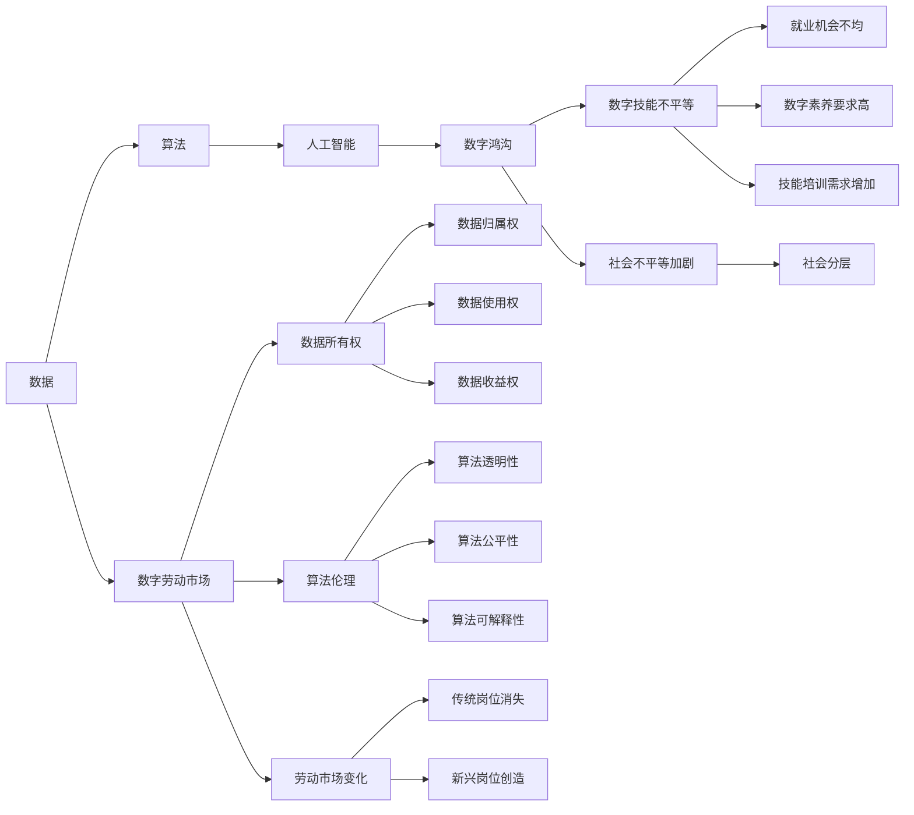

                 

# 数字劳动：人类计算的社会和经济影响

## 1. 背景介绍

### 1.1 问题由来
在数字时代，计算能力已成为推动经济发展和社会进步的重要驱动力。随着技术的进步，计算机的计算速度和存储能力不断提高，人工智能、大数据、云计算等技术的应用日益广泛。然而，在享受这些技术带来的便利的同时，我们也应该注意到，人类计算的社会和经济影响，特别是数字劳动的相关问题，正在引起越来越多的关注。

### 1.2 问题核心关键点
数字劳动主要指的是通过数字化手段，对信息进行采集、加工、分析和处理的过程。在这一过程中，人类扮演了计算力的提供者，但其劳动报酬和价值实现却往往不被充分重视。数字劳动涉及的问题包括但不限于以下几个方面：

1. **数据所有权**：在数字化时代，数据成为最重要的生产要素之一。然而，数据的收集、处理和使用过程中，数据所有权问题仍未得到充分解决，数据的归属权、使用权和收益权分配不均。

2. **算法伦理**：算法在决策过程中扮演着越来越重要的角色，但其透明性、公平性和可解释性问题，对社会正义和伦理道德提出了挑战。

3. **劳动市场变化**：数字劳动的兴起对传统劳动力市场造成了冲击，导致部分传统岗位消失，但同时又创造了新的就业机会。如何平衡这些变化，是一个重要的社会问题。

4. **数字鸿沟**：数字劳动要求高水平的数字素养和技能，这使得不同地区、不同人群之间的数字鸿沟进一步扩大，加剧了社会的不平等。

### 1.3 问题研究意义
研究数字劳动的社会和经济影响，对于理解数字时代的劳动市场、推动数字经济的健康发展、保障数据公平使用和保护劳动者权益具有重要意义。通过对数字劳动问题的深入探讨，可以为政策制定、企业运营和社会治理提供科学依据，促进数字劳动的可持续发展和公平分配。

## 2. 核心概念与联系

### 2.1 核心概念概述

要深入理解数字劳动，我们需要先掌握几个核心概念：

1. **数据**：指经过采集、存储和加工的信息，是数字劳动的主要对象。数据包括结构化数据（如数据库中的记录）和非结构化数据（如文本、图像、音频等）。

2. **算法**：指用于对数据进行处理和分析的数学模型和计算机程序。算法可以用于分类、回归、聚类等任务，是数字劳动中不可或缺的工具。

3. **人工智能**：指通过算法和模型，使计算机系统具备感知、理解和学习能力，从而实现智能决策。人工智能在数字劳动中扮演着越来越重要的角色。

4. **数字鸿沟**：指由于技术、教育等因素导致的数字技能和资源获取上的不平等。数字鸿沟不仅影响个体发展，还加剧了社会不平等。

5. **数字劳动市场**：指在数字化过程中，围绕数据和算法的采集、处理、分析和应用而形成的新型劳动力市场。数字劳动市场不同于传统劳动力市场，其就业形式更为多样，劳动报酬和价值实现也更为复杂。

这些概念之间存在着密切的联系。数据是数字劳动的对象，算法是数字劳动的工具，人工智能是数字劳动的产物，数字鸿沟影响数字劳动的普及和公平性，而数字劳动市场则是数字劳动的价值实现平台。通过理解这些概念，我们可以更好地把握数字劳动的本质和影响。

### 2.2 核心概念原理和架构的 Mermaid 流程图



该流程图展示了数据、算法、人工智能、数字劳动市场、数字鸿沟等核心概念之间的联系，以及它们对数据所有权、算法伦理、劳动市场变化、数字技能不平等、社会不平等加剧等方面的影响。

## 3. 核心算法原理 & 具体操作步骤

### 3.1 算法原理概述

数字劳动的核心算法原理主要包括以下几个方面：

1. **数据预处理**：对原始数据进行清洗、归一化、特征提取等操作，以便算法能够高效地处理数据。

2. **算法模型**：使用机器学习、深度学习等算法模型对数据进行训练和预测。常见的算法模型包括线性回归、决策树、神经网络等。

3. **模型评估**：使用各种评估指标（如准确率、召回率、F1分数等）对模型性能进行评估，以确保模型能够在实际应用中取得良好的效果。

4. **数据隐私保护**：在数据处理过程中，采用数据匿名化、差分隐私等技术手段，保护数据隐私，防止数据泄露和滥用。

### 3.2 算法步骤详解

以下是数字劳动中常见的算法步骤：

1. **数据收集**：从不同来源收集数据，包括但不限于社交媒体、传感器、互联网应用等。

2. **数据清洗**：对收集到的数据进行去重、去噪、异常值处理等操作，确保数据质量。

3. **特征工程**：根据业务需求和算法特性，对数据进行特征提取、转换和组合，生成适合算法处理的特征向量。

4. **模型训练**：使用已准备好的数据，对算法模型进行训练，优化模型参数，提高模型性能。

5. **模型评估与优化**：在验证集上对模型进行评估，根据评估结果对模型进行调优，确保模型泛化能力强。

6. **模型部署**：将训练好的模型部署到实际应用中，进行实时预测和决策。

7. **模型监控与维护**：实时监控模型性能，及时发现和解决问题，确保模型长期稳定运行。

### 3.3 算法优缺点

数字劳动中使用的算法具有以下优缺点：

**优点**：

1. **高效处理**：算法能够快速处理大量数据，自动化程度高，节省了大量人力和时间。

2. **精准预测**：算法模型经过训练后，能够根据历史数据进行精准预测和决策，提高决策的科学性和准确性。

3. **自适应性强**：算法可以根据新数据进行持续学习和更新，适应不断变化的环境。

**缺点**：

1. **算法黑箱**：许多算法模型（如深度学习）过于复杂，难以解释其内部决策机制，导致模型的可解释性较差。

2. **数据依赖性高**：算法的性能高度依赖于数据质量，数据噪声和偏差会影响算法结果。

3. **资源消耗大**：大规模数据处理和模型训练需要大量的计算资源和存储资源，成本较高。

### 3.4 算法应用领域

数字劳动的应用领域非常广泛，包括但不限于以下几个方面：

1. **自然语言处理**：通过算法对文本进行情感分析、语义理解、机器翻译等处理，提升自然语言理解和处理能力。

2. **计算机视觉**：使用算法对图像和视频进行目标检测、人脸识别、图像生成等处理，提升计算机视觉能力。

3. **推荐系统**：通过算法对用户行为和偏好进行分析，提供个性化的推荐服务，提升用户体验。

4. **金融科技**：使用算法进行风险评估、信用评分、欺诈检测等，提升金融服务的安全性和效率。

5. **智能制造**：通过算法对生产过程进行优化和预测，提升生产效率和产品质量。

6. **智慧城市**：使用算法对城市交通、环境、公共安全等数据进行处理，提升城市管理和决策能力。

## 4. 数学模型和公式 & 详细讲解 & 举例说明

### 4.1 数学模型构建

在数字劳动中，数学模型是理解和处理数据的基础。下面以线性回归为例，构建数学模型。

假设有一组训练数据集 $(x_i, y_i)$，其中 $x_i \in \mathbb{R}^n$ 为特征向量，$y_i \in \mathbb{R}$ 为标签，目标是通过学习一个线性函数 $f(x) = \theta_0 + \theta_1x_1 + \ldots + \theta_nx_n$ 来拟合数据。

最小二乘法的目标是最小化误差函数 $J(\theta) = \frac{1}{2}\sum_{i=1}^n (y_i - f(x_i))^2$。使用梯度下降算法，更新参数 $\theta$ 为：

$$
\theta_j = \theta_j - \eta \frac{\partial J(\theta)}{\partial \theta_j}
$$

其中 $\eta$ 为学习率。

### 4.2 公式推导过程

线性回归的推导过程如下：

1. 计算误差函数 $J(\theta)$。

2. 对误差函数求偏导数，得到 $\frac{\partial J(\theta)}{\partial \theta_j}$。

3. 使用梯度下降算法，更新参数 $\theta_j$。

4. 重复步骤1-3，直至收敛。

### 4.3 案例分析与讲解

以房价预测为例，分析线性回归模型的应用。

假设有一个城市的历史房价数据集，包含房屋面积、房间数量、地理位置等特征，以及对应的房价标签。使用线性回归模型，预测新房源的房价。

首先，将数据集划分为训练集和测试集，并随机抽取部分数据作为验证集。然后，对训练集进行特征工程，提取房价预测的特征向量 $x$。

接下来，构建线性回归模型，使用训练集数据对模型进行训练，并使用验证集进行调优。最后，使用测试集对模型进行评估，输出房价预测结果。

## 5. 项目实践：代码实例和详细解释说明

### 5.1 开发环境搭建

在进行数字劳动项目实践前，需要准备好开发环境。以下是使用Python进行PyTorch开发的环境配置流程：

1. 安装Anaconda：从官网下载并安装Anaconda，用于创建独立的Python环境。

2. 创建并激活虚拟环境：
```bash
conda create -n pytorch-env python=3.8 
conda activate pytorch-env
```

3. 安装PyTorch：根据CUDA版本，从官网获取对应的安装命令。例如：
```bash
conda install pytorch torchvision torchaudio cudatoolkit=11.1 -c pytorch -c conda-forge
```

4. 安装TensorFlow：由Google主导开发的开源深度学习框架，生产部署方便，适合大规模工程应用。同样有丰富的预训练语言模型资源。

5. 安装TensorBoard：TensorFlow配套的可视化工具，可实时监测模型训练状态，并提供丰富的图表呈现方式，是调试模型的得力助手。

6. 安装Weights & Biases：模型训练的实验跟踪工具，可以记录和可视化模型训练过程中的各项指标，方便对比和调优。

7. 安装Jupyter Notebook：用于编写和运行代码，支持Python、R等多种语言。

完成上述步骤后，即可在`pytorch-env`环境中开始项目实践。

### 5.2 源代码详细实现

下面以房价预测为例，给出使用PyTorch实现线性回归模型的代码。

首先，导入必要的库：

```python
import torch
import torch.nn as nn
import torch.optim as optim
import torch.nn.functional as F
```

然后，定义数据处理函数：

```python
class DataLoader:
    def __init__(self, data, batch_size):
        self.data = data
        self.batch_size = batch_size
        self.length = len(data)
        self.index = 0

    def __len__(self):
        return self.length // self.batch_size

    def __getitem__(self, idx):
        if self.index + self.batch_size > self.length:
            self.index = 0
        x = self.data[self.index:self.index+self.batch_size, :]
        y = self.data[self.index:self.index+self.batch_size, -1]
        self.index += self.batch_size
        return x, y

    def __iter__(self):
        return self

    def shuffle(self):
        np.random.shuffle(self.data)
```

接着，定义线性回归模型：

```python
class LinearRegression(nn.Module):
    def __init__(self, input_size, output_size):
        super(LinearRegression, self).__init__()
        self.linear = nn.Linear(input_size, output_size)

    def forward(self, x):
        return self.linear(x)
```

然后，定义损失函数和优化器：

```python
criterion = nn.MSELoss()
optimizer = optim.SGD(linear.parameters(), lr=0.01)
```

最后，训练模型并输出结果：

```python
def train(epoch):
    model.train()
    for batch_idx, (data, target) in enumerate(train_loader):
        optimizer.zero_grad()
        output = model(data)
        loss = criterion(output, target)
        loss.backward()
        optimizer.step()
        if batch_idx % 10 == 0:
            print('Train Epoch: {} [{}/{} ({:.0f}%)]\tLoss: {:.6f}'.format(
                epoch, batch_idx * len(data), len(train_loader.dataset),
                100. * batch_idx / len(train_loader), loss.item()))

def test():
    model.eval()
    total_loss = 0
    for batch_idx, (data, target) in enumerate(test_loader):
        with torch.no_grad():
            output = model(data)
            loss = criterion(output, target)
            total_loss += loss.item()
    print('Test Loss: {:.4f}'.format(total_loss / len(test_loader.dataset)))
```

完成上述步骤后，即可运行代码，对模型进行训练和测试。

### 5.3 代码解读与分析

在代码中，我们定义了数据加载器、线性回归模型、损失函数和优化器，并在训练和测试过程中使用了这些组件。数据加载器用于将数据以批为单位加载，线性回归模型用于定义线性回归算法，损失函数用于计算模型预测值与真实值之间的误差，优化器用于更新模型参数。

## 6. 实际应用场景

### 6.1 智能推荐系统

智能推荐系统是数字劳动中一个典型的应用场景。通过分析用户的行为数据和偏好信息，智能推荐系统能够为用户提供个性化的商品、内容和服务推荐，提升用户体验。

在实际应用中，智能推荐系统通常使用协同过滤、基于内容的推荐、混合推荐等算法，结合用户历史行为数据和实时数据，进行推荐预测。这些算法通过学习用户行为和物品属性之间的关系，预测用户可能感兴趣的物品，并实时更新推荐结果。

### 6.2 金融风险控制

金融风险控制是数字劳动中另一个重要的应用场景。通过分析用户的金融交易数据和行为数据，金融风险控制系统能够实时监控和预测金融风险，及时采取防范措施，保障金融系统的安全稳定。

在实际应用中，金融风险控制系统通常使用风险评估模型、信用评分模型、欺诈检测模型等算法，结合用户行为数据和交易数据，进行风险预测和识别。这些算法通过学习用户的行为模式和交易特征，预测用户的信用风险和欺诈行为，并及时报警和处理。

### 6.3 医疗诊断系统

医疗诊断系统是数字劳动中一个具有高度社会影响力的应用场景。通过分析患者的临床数据和影像数据，医疗诊断系统能够快速准确地进行疾病诊断，提升医疗服务的质量和效率。

在实际应用中，医疗诊断系统通常使用图像识别、自然语言处理、知识图谱等算法，结合患者的历史病历数据和实时数据，进行疾病诊断和预测。这些算法通过学习医学知识图谱和患者病历数据，提取患者的病情特征和诊断信息，提供精准的诊断结果。

## 7. 工具和资源推荐

### 7.1 学习资源推荐

为了帮助开发者系统掌握数字劳动的理论基础和实践技巧，这里推荐一些优质的学习资源：

1. 《数字劳动与社会》书籍：全面介绍了数字劳动的概念、形式、影响及其社会经济背景。

2. 《人工智能伦理》课程：介绍了人工智能技术在应用过程中面临的伦理问题，以及如何构建伦理友好的AI系统。

3. 《数据科学基础》课程：介绍了数据科学的基本概念、方法和技术，是理解数字劳动的基础。

4. 《机器学习》课程：介绍了机器学习的基本概念、算法和应用，是数字劳动中算法开发的基础。

5. 《数据隐私保护》课程：介绍了数据隐私保护的基本概念、技术和政策，是数字劳动中数据处理的基础。

6. 《数字劳动经济学》研究论文：深入分析了数字劳动对经济的影响，为政策制定提供理论支持。

### 7.2 开发工具推荐

高效的开发离不开优秀的工具支持。以下是几款用于数字劳动开发的常用工具：

1. PyTorch：基于Python的开源深度学习框架，灵活动态的计算图，适合快速迭代研究。大部分预训练语言模型都有PyTorch版本的实现。

2. TensorFlow：由Google主导开发的开源深度学习框架，生产部署方便，适合大规模工程应用。同样有丰富的预训练语言模型资源。

3. Weights & Biases：模型训练的实验跟踪工具，可以记录和可视化模型训练过程中的各项指标，方便对比和调优。与主流深度学习框架无缝集成。

4. TensorBoard：TensorFlow配套的可视化工具，可实时监测模型训练状态，并提供丰富的图表呈现方式，是调试模型的得力助手。

5. Jupyter Notebook：用于编写和运行代码，支持Python、R等多种语言。

合理利用这些工具，可以显著提升数字劳动任务的开发效率，加快创新迭代的步伐。

### 7.3 相关论文推荐

数字劳动的研究源于学界的持续研究。以下是几篇奠基性的相关论文，推荐阅读：

1. 《数字劳动与资本主义》（Digital Labor and Capitalism）：探讨数字劳动在资本主义生产关系中的地位和作用，以及其对劳动市场的影响。

2. 《数字鸿沟与社会不平等》（The Digital Divide and Social Inequality）：分析数字鸿沟对社会不平等的影响，以及如何缩小数字鸿沟。

3. 《人工智能与伦理》（AI and Ethics）：讨论人工智能技术在应用过程中面临的伦理问题，以及如何构建伦理友好的AI系统。

4. 《数据隐私保护》（Data Privacy Protection）：介绍数据隐私保护的基本概念、技术和政策，以及如何保护用户隐私。

5. 《智能推荐系统的理论与实践》（Theory and Practice of Recommendation Systems）：介绍智能推荐系统的基本概念、算法和应用，以及如何提升推荐系统的性能。

这些论文代表了大规模数据处理和算法开发的研究进展，对理解数字劳动的实际应用和理论背景具有重要参考价值。

## 8. 总结：未来发展趋势与挑战

### 8.1 总结

本文对数字劳动的社会和经济影响进行了全面系统的介绍。首先阐述了数字劳动的概念、形式及其对社会经济的影响，明确了数字劳动在数字时代的重要地位。其次，从原理到实践，详细讲解了数字劳动的核心算法原理和操作步骤，给出了数字劳动任务开发的完整代码实例。同时，本文还探讨了数字劳动在智能推荐、金融风险控制、医疗诊断等多个领域的应用场景，展示了数字劳动的广泛应用前景。最后，本文精选了数字劳动相关的学习资源、开发工具和研究论文，力求为读者提供全方位的技术指引。

通过本文的系统梳理，可以看到，数字劳动已成为数字时代不可或缺的一部分，对社会经济的影响深远而复杂。未来，随着技术的不断进步，数字劳动的应用将更加广泛，其社会和经济影响也将更加显著。

### 8.2 未来发展趋势

展望未来，数字劳动的发展趋势将呈现以下几个方面：

1. **技术进步**：随着计算能力的提升和算法的创新，数字劳动将变得更加高效、智能，应用场景将更加广泛。

2. **跨界融合**：数字劳动将与其他技术（如物联网、区块链、区块链等）进行更深入的融合，提升整体系统的效率和可靠性。

3. **伦理与公平**：随着数字劳动的普及，如何保障数据隐私、公平性和透明性，将成为一个重要的研究课题。

4. **政策与法规**：政府和企业将更加关注数字劳动的伦理和法律问题，制定相应的政策法规，保障数字劳动的健康发展。

5. **人才培养**：随着数字劳动的需求增加，对相关人才的需求也将不断上升，培养具有数字素养和技能的人才将成为一个重要的任务。

### 8.3 面临的挑战

尽管数字劳动带来了诸多好处，但在其发展过程中，仍面临诸多挑战：

1. **数据隐私**：数字劳动需要大量的数据支持，如何保障数据隐私，防止数据滥用，是一个重要的问题。

2. **算法透明性**：许多数字劳动中的算法模型过于复杂，难以解释其内部决策机制，导致模型的可解释性较差。

3. **公平性问题**：数字劳动中的算法模型可能会存在偏见和歧视，如何保证算法的公平性，是一个重要的研究方向。

4. **资源消耗**：大规模数据处理和模型训练需要大量的计算资源和存储资源，成本较高。

5. **跨领域应用**：数字劳动的应用场景多样，如何将数字劳动的技术应用到不同领域，是一个重要的挑战。

### 8.4 研究展望

面对数字劳动面临的挑战，未来的研究需要在以下几个方面寻求新的突破：

1. **数据隐私保护**：开发新的数据隐私保护技术，如差分隐私、联邦学习等，保障数据隐私安全。

2. **算法透明性**：探索更加透明、可解释的算法模型，如可解释的深度学习模型、透明的多模态模型等，提升算法的透明性和公平性。

3. **公平性问题**：研究如何消除算法中的偏见和歧视，构建更加公平、公正的算法模型。

4. **资源优化**：开发更加高效的算法和模型压缩技术，优化资源消耗，提高计算效率。

5. **跨领域应用**：探索数字劳动技术在不同领域的应用，如医疗、金融、教育等，推动数字劳动技术的普适化发展。

6. **政策法规研究**：深入研究数字劳动的伦理和法律问题，制定相应的政策法规，保障数字劳动的健康发展。

这些研究方向的探索，必将引领数字劳动技术迈向更高的台阶，为数字时代的社会和经济进步提供强有力的支持。面向未来，数字劳动技术将与其他人工智能技术进行更深入的融合，共同推动数字劳动的发展，提升数字劳动的效率和公平性。

## 9. 附录：常见问题与解答

**Q1：数字劳动与传统劳动的区别是什么？**

A: 数字劳动与传统劳动的区别主要在于劳动形式和劳动对象。传统劳动通常涉及物理劳动，如体力劳动和手工劳动，劳动对象主要是物理实体。而数字劳动则涉及数字化劳动，如数据采集、处理和分析，劳动对象主要是数据和信息。此外，数字劳动的劳动报酬和价值实现也不同于传统劳动，通常采用数据使用权、数据收益权等方式进行分配。

**Q2：数字劳动中如何保障数据隐私？**

A: 保障数据隐私是数字劳动中的重要问题。以下是一些常见的数据隐私保护技术：

1. 数据匿名化：通过去除或混淆数据中的个人身份信息，防止数据泄露。

2. 差分隐私：在数据处理过程中加入噪声，确保单个数据记录的隐私性。

3. 数据加密：使用加密算法对数据进行加密，防止数据被未授权访问。

4. 访问控制：对数据的访问进行严格控制，确保只有授权人员能够访问数据。

**Q3：数字劳动对社会经济的影响是什么？**

A: 数字劳动对社会经济的影响是多方面的，包括但不限于以下几个方面：

1. 提高生产力：数字劳动通过自动化和智能化的手段，提高了生产力和效率。

2. 改变就业结构：数字劳动改变了传统的就业结构，创造了新的就业机会，但也导致部分传统岗位消失。

3. 促进经济发展：数字劳动推动了数字化转型，提升了经济发展的速度和质量。

4. 加剧社会不平等：数字鸿沟的存在使得数字劳动的普及和公平性受到限制，加剧了社会不平等。

**Q4：数字劳动中如何保障算法公平性？**

A: 保障算法公平性是数字劳动中的重要问题。以下是一些常见的算法公平性技术：

1. 数据平衡：在训练数据中确保各类数据比例平衡，防止算法偏向某类数据。

2. 公平学习：使用公平性损失函数，在模型训练过程中约束算法公平性。

3. 对抗训练：引入对抗样本，提高算法的鲁棒性，防止算法出现偏见。

4. 公平模型评估：使用公平性指标（如偏差、公平性差异等）评估算法的公平性。

**Q5：数字劳动的未来发展方向是什么？**

A: 数字劳动的未来发展方向将呈现以下几个方面：

1. 更加智能化：随着人工智能技术的进步，数字劳动将变得更加智能化，能够处理更复杂、更抽象的数据和任务。

2. 更加普适化：数字劳动技术将更加普适化，能够应用到更多领域，推动社会经济的全面发展。

3. 更加透明化：数字劳动的算法和模型将更加透明，便于监督和管理，保障数据隐私和算法公平性。

4. 更加公平化：数字劳动的分配机制将更加公平，保障不同人群的利益。

5. 更加安全化：数字劳动的安全性将得到更好的保障，防止数据泄露和滥用。

总之，未来数字劳动将更加智能、普适、透明、公平和安全，为社会经济的发展提供更加坚实的技术支撑。

---

作者：禅与计算机程序设计艺术 / Zen and the Art of Computer Programming

