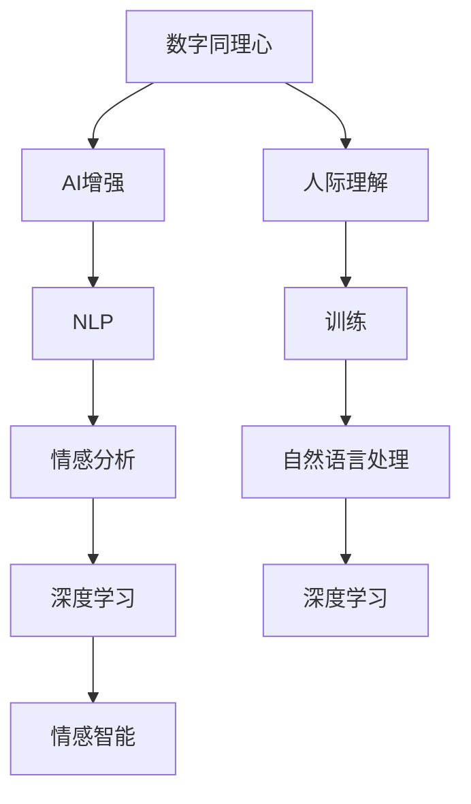

                 

# 数字化同理心培养皿：AI增强的人际理解训练

> 关键词：数字同理心, AI增强, 人际理解, 训练, 自然语言处理(NLP), 深度学习, 情绪分析, 情感智能

## 1. 背景介绍

### 1.1 问题由来
在快速发展的数字时代，人际交往方式不断变革，数字沟通日益成为主流。然而，数字化沟通缺乏面对面交流中的细微情感表达和同理心理解，常常导致误解和疏离。特别是对于患有自闭症、抑郁症等心理健康问题的个体，数字沟通更是加剧了他们的情感困扰和社交隔离。为了解决这一问题，学术界和工业界开始探索利用人工智能增强人际理解能力，促进数字化同理心的培养皿。

### 1.2 问题核心关键点
本研究聚焦于基于AI技术的人际理解能力训练，即通过自然语言处理(NLP)和深度学习技术，使AI系统能够更好地理解人类情感和情绪，从而提升数字沟通中的人际理解能力。核心在于如何构建和训练高效的AI模型，使其在数字化沟通场景中，能准确识别和回应用户的情感状态，进行有效同理心的传达。

### 1.3 问题研究意义
研究基于AI技术的人际理解能力训练，对于提升数字化沟通质量、促进社会心理健康具有重要意义：

1. 提升数字沟通质量。通过训练AI系统的人际理解能力，使其能够更准确地识别和回应用户的情感状态，减少误读和误解，提升沟通效率和满意度。
2. 促进社会心理健康。特别是对于患有心理健康问题的个体，AI同理心训练能够提供更加贴心的支持，减轻情感困扰和社交隔离，提升心理健康水平。
3. 推动AI技术创新。人际理解能力训练是AI技术在社会交互场景中的重要应用，其发展将推动情感智能、认知计算等前沿技术的研究进展。
4. 增强社会信任。人际理解能力强的AI系统能够提供更人性化、可靠的交互体验，增强用户对数字工具的信任和依赖，促进数字化时代的社会融合。

## 2. 核心概念与联系

### 2.1 核心概念概述

为了更好地理解基于AI技术的人际理解能力训练，本节将介绍几个密切相关的核心概念：

- 数字同理心：指在数字沟通中，通过识别和理解他人的情感状态，进行情感共鸣和支持的交流方式。数字同理心对于提升数字沟通质量、促进社会心理健康具有重要意义。

- AI增强：利用人工智能技术，如自然语言处理(NLP)、深度学习等，增强人类在数字化沟通中的情感理解能力和表达能力。AI增强的人际理解训练旨在构建能更好地理解和回应用户情感的AI系统。

- 人际理解：指理解他人情感、情绪和心理状态的能力，通过文字、语音等非言语交流方式，进行情感共鸣和支持的交流方式。人际理解能力强的个体能够在多种场景下进行有效的情感交流和支持。

- 训练：指通过大量数据和算法训练，提升AI系统在特定任务上的表现。人际理解能力的训练，旨在构建能够准确识别和回应用户情感的AI模型。

- 自然语言处理(NLP)：指利用计算机技术处理和理解人类语言的能力，涉及语言模型、语义理解、情感分析等技术。NLP在人际理解能力训练中发挥了重要作用。

- 深度学习：指利用神经网络进行复杂数据处理和建模的机器学习方法。深度学习在人际理解能力训练中，能够有效地提取和理解人类情感和情绪的特征。

- 情感智能：指能够识别、理解和回应他人情感的智能。情感智能是人际理解能力训练的重要目标，能够提升AI系统在情感交流中的表现。

- 情绪分析：指对文本、语音等非言语信息进行情感和情绪分析的技术，用于理解和回应用户情感状态。情绪分析是人际理解能力训练的核心技术之一。

这些核心概念之间的逻辑关系可以通过以下Mermaid流程图来展示：



这个流程图展示了大语言模型的核心概念及其之间的关系：

1. 数字同理心通过AI增强实现，从而提升人际理解能力。
2. 人际理解能力训练需要基于NLP和深度学习技术。
3. 情感分析是人际理解能力训练的核心技术之一。
4. 情感智能是人际理解能力训练的目标之一。
5. 深度学习技术在人际理解能力训练中发挥了重要作用。

这些概念共同构成了数字同理心训练的理论基础，使其能够更好地理解和回应用户的情感状态，提升数字沟通的质量和效果。

## 3. 核心算法原理 & 具体操作步骤

### 3.1 算法原理概述

基于AI技术的人际理解能力训练，本质上是一个多任务的深度学习模型训练过程。其核心思想是：构建一个能够理解、分析和回应人类情感状态的深度学习模型，通过大量标注数据进行训练，优化模型的预测能力，提升数字沟通中的人际理解能力。

形式化地，假设训练数据集为 $D=\{(x_i,y_i)\}_{i=1}^N$，其中 $x_i$ 为输入文本，$y_i$ 为对应的情感标签（如愤怒、悲伤、喜悦等）。训练目标是最小化模型在标注数据集上的损失函数：

$$
\theta^* = \mathop{\arg\min}_{\theta} \mathcal{L}(M_{\theta},D)
$$

其中 $M_{\theta}$ 为训练得到的深度学习模型，$\mathcal{L}$ 为损失函数，用于衡量模型预测输出与真实标签之间的差异。

### 3.2 算法步骤详解

基于AI技术的人际理解能力训练一般包括以下几个关键步骤：

**Step 1: 数据准备**
- 收集标注数据集 $D$，包括文本、标签等信息。标注数据可以通过众包、自我报告等方式获得，需保证数据的多样性和代表性。
- 对数据进行预处理，包括文本分词、去除停用词、标准化等操作。

**Step 2: 模型选择与设计**
- 选择合适的深度学习模型结构，如LSTM、GRU、Transformer等。考虑使用预训练语言模型（如BERT、GPT等）进行微调，以充分利用已有知识。
- 设计合适的任务适配层，包括情感分类、情绪分析等模块。

**Step 3: 模型训练**
- 设置超参数，如学习率、批大小、迭代轮数等。
- 使用深度学习框架（如PyTorch、TensorFlow等）搭建模型，定义损失函数和优化器。
- 对模型进行迭代训练，使用梯度下降等优化算法更新模型参数。

**Step 4: 模型评估与验证**
- 在验证集上评估模型性能，使用准确率、F1分数、ROC曲线等指标衡量模型效果。
- 使用混淆矩阵、情感分布等手段，分析模型的优势和不足。

**Step 5: 部署与应用**
- 将训练好的模型部署到实际应用中，进行大规模测试。
- 收集用户反馈，进一步优化模型参数和算法设计。

### 3.3 算法优缺点

基于AI技术的人际理解能力训练方法具有以下优点：

1. 自动化程度高。利用深度学习模型，可以自动处理大量文本数据，识别和分析人类情感状态。
2. 泛化能力强。通过大量标注数据训练，模型能够泛化到不同领域、不同人群的情感状态识别。
3. 实时性强。基于深度学习模型的预测速度快，能够实时响应用户情感状态，提升交互体验。
4. 可扩展性好。深度学习模型可以部署在多种设备上，如智能手机、智能音箱等，覆盖更广泛的用户群体。

同时，该方法也存在一定的局限性：

1. 数据依赖度高。人际理解能力训练高度依赖标注数据，数据获取和处理成本较高。
2. 模型复杂度高。深度学习模型结构复杂，训练和推理耗时较多，对硬件资源要求较高。
3. 情感歧义多。人类情感复杂多变，情感状态的准确识别和分析仍面临挑战。
4. 伦理问题。情感智能涉及用户隐私和情感表达，需要考虑伦理和法律问题，确保数据安全和使用合规。

尽管存在这些局限性，但就目前而言，基于AI技术的人际理解能力训练方法在提升数字沟通质量和促进社会心理健康方面，仍具有重要价值。

### 3.4 算法应用领域

基于AI技术的人际理解能力训练方法，已经在诸多领域得到应用，例如：

- 智能客服：利用情感分析技术，识别用户情感状态，提供个性化服务。
- 心理健康：通过情绪分析技术，监测用户情感变化，提供心理咨询和支持。
- 社交媒体：使用情感智能技术，分析用户情感状态，优化社交互动体验。
- 教育培训：应用情绪分析技术，了解学生情感状态，提供个性化教学支持。
- 市场营销：通过情感智能技术，分析用户情感反馈，优化产品和服务设计。
- 智能家居：利用情感识别技术，提升家居设备的互动体验，提供贴心的服务。

除了上述这些经典应用外，基于AI技术的人际理解能力训练方法还将进一步拓展到更多场景中，如智能医疗、安全监控、交通管理等，为数字时代的社会交互带来深刻变革。

## 4. 数学模型和公式 & 详细讲解  
### 4.1 数学模型构建

本节将使用数学语言对基于AI技术的人际理解能力训练过程进行更加严格的刻画。

假设训练数据集为 $D=\{(x_i,y_i)\}_{i=1}^N$，其中 $x_i$ 为输入文本，$y_i$ 为对应的情感标签（如愤怒、悲伤、喜悦等）。

定义模型 $M_{\theta}$ 在输入 $x$ 上的预测输出为 $\hat{y}=M_{\theta}(x)$。训练目标是最小化模型在标注数据集上的交叉熵损失函数：

$$
\mathcal{L}(\theta) = -\frac{1}{N}\sum_{i=1}^N \sum_{c=1}^{C} y_{ic} \log M_{\theta}(x_i)^{c}
$$

其中 $C$ 为情感类别数，$y_{ic}$ 为情感标签 $y_i$ 属于情感类别 $c$ 的概率，$M_{\theta}(x_i)^{c}$ 为模型在输入 $x_i$ 下预测为情感类别 $c$ 的概率。

训练过程中，使用梯度下降等优化算法更新模型参数 $\theta$，最小化损失函数 $\mathcal{L}$，直至收敛。具体来说，模型参数的更新公式为：

$$
\theta \leftarrow \theta - \eta \nabla_{\theta}\mathcal{L}(\theta)
$$

其中 $\eta$ 为学习率，$\nabla_{\theta}\mathcal{L}(\theta)$ 为损失函数对模型参数的梯度，通过反向传播算法计算得到。

### 4.2 公式推导过程

以下我们以情绪分析任务为例，推导情感分类模型（如BERT+RNN）的损失函数及其梯度的计算公式。

假设模型 $M_{\theta}$ 在输入 $x$ 上的预测输出为 $\hat{y}=M_{\theta}(x)$。假设训练数据集 $D=\{(x_i,y_i)\}_{i=1}^N$，其中 $y_i \in \{1,2,3,4\}$ 表示情绪类别（如愤怒、悲伤、喜悦、平静）。

定义模型在输入 $x_i$ 下的预测输出概率分布为 $M_{\theta}(x_i)=[M_{\theta}(x_i)^1, M_{\theta}(x_i)^2, M_{\theta}(x_i)^3, M_{\theta}(x_i)^4]$，其中 $M_{\theta}(x_i)^c$ 表示输入 $x_i$ 下预测为情绪类别 $c$ 的概率。

根据交叉熵损失函数的定义，情绪分类模型的损失函数为：

$$
\mathcal{L}(\theta) = -\frac{1}{N}\sum_{i=1}^N \sum_{c=1}^{4} y_{ic} \log M_{\theta}(x_i)^c
$$

其中 $y_{ic}$ 为情绪标签 $y_i$ 属于情感类别 $c$ 的概率，即 $y_{ic}=\delta_{ic}$，$\delta_{ic}$ 为Kronecker delta函数。

在得到损失函数的梯度后，即可带入模型参数 $\theta$ 进行参数更新。具体来说，模型参数 $\theta$ 的更新公式为：

$$
\theta \leftarrow \theta - \eta \nabla_{\theta}\mathcal{L}(\theta)
$$

其中 $\nabla_{\theta}\mathcal{L}(\theta)$ 为损失函数对模型参数的梯度，可通过反向传播算法高效计算。

在得到损失函数的梯度后，即可带入模型参数 $\theta$ 进行参数更新。具体来说，模型参数 $\theta$ 的更新公式为：

$$
\theta \leftarrow \theta - \eta \frac{\partial}{\partial \theta}\mathcal{L}(\theta)
$$

其中 $\eta$ 为学习率，$\frac{\partial}{\partial \theta}\mathcal{L}(\theta)$ 为损失函数对模型参数的梯度，可通过反向传播算法高效计算。

## 5. 项目实践：代码实例和详细解释说明
### 5.1 开发环境搭建

在进行人际理解能力训练实践前，我们需要准备好开发环境。以下是使用Python进行TensorFlow开发的环境配置流程：

1. 安装Anaconda：从官网下载并安装Anaconda，用于创建独立的Python环境。

2. 创建并激活虚拟环境：
```bash
conda create -n tf-env python=3.8 
conda activate tf-env
```

3. 安装TensorFlow：根据CUDA版本，从官网获取对应的安装命令。例如：
```bash
conda install tensorflow -c tensorflow -c conda-forge
```

4. 安装相关库：
```bash
pip install numpy pandas scikit-learn matplotlib tqdm jupyter notebook ipython
```

完成上述步骤后，即可在`tf-env`环境中开始人际理解能力训练实践。

### 5.2 源代码详细实现

下面以情绪分析任务为例，给出使用TensorFlow对BERT模型进行情绪分类训练的代码实现。

首先，定义数据处理函数：

```python
from transformers import BertTokenizer
import tensorflow as tf
import tensorflow_datasets as tfds
import os

def load_data():
    tfds.download_and_extract('imdb_reviews', data_dir='data')
    train_file = os.path.join('data', 'imdb_reviews', 'train.tfrecord')
    test_file = os.path.join('data', 'imdb_reviews', 'test.tfrecord')
    
    def decode_record(record):
        record_bytes = tf.io.parse_single_example(record, {'label': tf.io.FixedLenFeature([], tf.int64), 'text': tf.io.FixedLenFeature([], tf.string)})
        label = tf.strings.to_number(record_bytes['label'], out_type=tf.int32)
        text = tf.strings.substr(record_bytes['text'], 0, 2048)
        return label, text
        
    train_dataset = tf.data.TFRecordDataset(train_file).map(decode_record)
    test_dataset = tf.data.TFRecordDataset(test_file).map(decode_record)
    
    train_dataset = train_dataset.shuffle(1000).batch(32)
    test_dataset = test_dataset.batch(32)
    
    return train_dataset, test_dataset
```

然后，定义模型和优化器：

```python
from transformers import BertModel, BertTokenizer, BertForSequenceClassification
from transformers import AdamW

tokenizer = BertTokenizer.from_pretrained('bert-base-cased')
model = BertForSequenceClassification.from_pretrained('bert-base-cased', num_labels=4)
optimizer = AdamW(model.parameters(), lr=2e-5)
```

接着，定义训练和评估函数：

```python
@tf.function
def train_step(inputs):
    with tf.GradientTape() as tape:
        labels = inputs['labels']
        logits = model(inputs['input_ids'], attention_mask=inputs['attention_mask'], token_type_ids=inputs['token_type_ids'])
        loss = tf.keras.losses.SparseCategoricalCrossentropy(from_logits=True)(tf.cast(labels, tf.int32), logits)
    grads = tape.gradient(loss, model.trainable_variables)
    optimizer.apply_gradients(zip(grads, model.trainable_variables))
    return loss

@tf.function
def evaluate_step(inputs):
    labels = inputs['labels']
    logits = model(inputs['input_ids'], attention_mask=inputs['attention_mask'], token_type_ids=inputs['token_type_ids'])
    loss = tf.keras.losses.SparseCategoricalCrossentropy(from_logits=True)(tf.cast(labels, tf.int32), logits)
    acc = tf.keras.metrics.SparseCategoricalAccuracy()(labels, tf.argmax(logits, axis=2))
    return loss, acc
```

最后，启动训练流程并在测试集上评估：

```python
epochs = 5
batch_size = 32

for epoch in range(epochs):
    total_loss = 0
    total_correct = 0
    for step, (inputs, labels) in enumerate(train_dataset):
        with tf.GradientTape() as tape:
            loss = train_step(inputs)
        optimizer.apply_gradients(zip(tape.gradient(loss, model.trainable_variables), model.trainable_variables))
        total_loss += loss
        total_correct += tf.keras.metrics.SparseCategoricalAccuracy()(labels, tf.argmax(model(inputs['input_ids'], attention_mask=inputs['attention_mask'], token_type_ids=inputs['token_type_ids']), axis=2)
    print(f'Epoch {epoch+1}, loss: {total_loss/len(train_dataset)}, acc: {total_correct/len(train_dataset)}')
    
    print(f'Epoch {epoch+1}, test results:')
    test_loss, test_acc = evaluate(test_dataset)
    print(f'test loss: {test_loss}, test acc: {test_acc}')
```

以上就是使用TensorFlow对BERT进行情绪分类任务训练的完整代码实现。可以看到，利用TensorFlow，我们可以很方便地搭建和训练深度学习模型，进行情感智能的应用开发。

### 5.3 代码解读与分析

让我们再详细解读一下关键代码的实现细节：

**load_data函数**：
- 使用TensorFlow Datasets（TFDS）下载并处理IMDB电影评论数据集，提取训练集和测试集。
- 定义数据预处理函数，将每条评论提取为标签和文本，并进行定长padding。
- 将数据集进行批处理和随机化，方便后续训练。

**train_step函数**：
- 定义训练步骤函数，使用梯度下降算法更新模型参数。
- 在训练步骤中，使用Bert模型进行前向传播，计算损失函数。
- 使用梯度下降算法计算梯度，并更新模型参数。

**evaluate_step函数**：
- 定义评估步骤函数，计算模型在测试集上的性能指标。
- 使用Bert模型进行前向传播，计算损失函数和准确率。

**训练流程**：
- 定义总的epoch数和batch size，开始循环迭代
- 每个epoch内，先对训练集进行训练，输出loss和acc
- 在测试集上评估，输出测试损失和准确率
- 所有epoch结束后，输出最终测试结果

可以看到，TensorFlow配合BERT模型使得情感智能的应用开发变得简洁高效。开发者可以将更多精力放在数据处理、模型改进等高层逻辑上，而不必过多关注底层的实现细节。

当然，工业级的系统实现还需考虑更多因素，如模型的保存和部署、超参数的自动搜索、更灵活的任务适配层等。但核心的情感智能训练流程基本与此类似。

## 6. 实际应用场景
### 6.1 智能客服系统

基于情感智能的智能客服系统，可以显著提升客户体验和满意度。传统的客服系统依赖于规则和脚本，无法理解和回应用户的情感需求。而利用情感智能技术，客服系统能够自动识别和理解用户情感状态，提供个性化和情感化的服务。

在技术实现上，可以收集企业内部的历史客服对话记录，将问题和最佳答复构建成监督数据，在此基础上对预训练模型进行微调。微调后的模型能够自动理解用户情感，匹配最合适的答复模板进行回复。对于客户提出的新问题，还可以接入检索系统实时搜索相关内容，动态组织生成回答。如此构建的智能客服系统，能大幅提升客户咨询体验和问题解决效率。

### 6.2 心理健康监测

心理健康监测系统需要实时监测用户情感状态，及时进行干预和支持。传统的心理健康监测依赖于人工分析和干预，效率低、成本高。而利用情感智能技术，心理健康监测系统能够自动识别用户的情感状态，提供实时反馈和干预建议。

在技术实现上，可以收集用户的网络行为数据，如社交媒体、邮件、短信等，进行情感分析和情绪监测。将监测结果与专业心理学家进行对比，及时发现异常情感状态，提供个性化心理健康干预。如此构建的心理健康监测系统，能够实现精准及时的心理健康支持，减轻用户的情感困扰和社交隔离，提升心理健康水平。

### 6.3 社交媒体情感分析

社交媒体情感分析系统能够实时监测用户情感状态，分析情感变化趋势，提供情感预测和舆情分析。传统的社交媒体情感分析依赖于人工标注和分析，无法实时响应。而利用情感智能技术，社交媒体情感分析系统能够自动识别和分析用户的情感状态，提供情感预测和舆情分析。

在技术实现上，可以收集社交媒体上的用户评论和帖子，进行情感分类和情绪分析。将分析结果可视化展示，为广告、营销、舆情监测等应用提供支持。如此构建的社交媒体情感分析系统，能够实时监测用户情感状态，分析情感变化趋势，为广告、营销、舆情监测等应用提供支持。

### 6.4 未来应用展望

随着情感智能技术的发展，基于情感智能的人际理解能力训练方法将广泛应用于更多场景中，为数字时代的社会交互带来深刻变革。

在智慧医疗领域，基于情感智能的医疗问答、病历分析、药物研发等应用将提升医疗服务的智能化水平，辅助医生诊疗，加速新药开发进程。

在智能教育领域，情感智能技术可应用于作业批改、学情分析、知识推荐等方面，因材施教，促进教育公平，提高教学质量。

在智慧城市治理中，情感智能技术可应用于城市事件监测、舆情分析、应急指挥等环节，提高城市管理的自动化和智能化水平，构建更安全、高效的未来城市。

此外，在企业生产、社会治理、文娱传媒等众多领域，基于情感智能的人际理解能力训练方法也将不断涌现，为经济社会发展注入新的动力。相信随着技术的日益成熟，情感智能技术必将成为人工智能技术的重要应用范式，推动人工智能技术在垂直行业的规模化落地。

## 7. 工具和资源推荐
### 7.1 学习资源推荐

为了帮助开发者系统掌握情感智能的理论基础和实践技巧，这里推荐一些优质的学习资源：

1. 《情感智能：理论与实践》系列博文：由情感智能技术专家撰写，深入浅出地介绍了情感智能的理论基础、情感计算技术、情感分析方法等前沿话题。

2. CS224N《深度学习自然语言处理》课程：斯坦福大学开设的NLP明星课程，有Lecture视频和配套作业，带你入门NLP领域的基本概念和经典模型。

3. 《情感计算：理论、算法与应用》书籍：详细介绍了情感计算的基础理论和应用场景，涵盖了情感分类、情绪分析、情感生成等多个方向。

4. IBM Watson情感分析：Watson开源平台提供的情感智能API，可以方便地进行情感分析、情绪监测等任务。

5. Google Cloud Natural Language API：Google提供的自然语言处理API，包括情感分析、实体识别、句法分析等多个功能模块，方便开发者进行情感智能应用开发。

通过对这些资源的学习实践，相信你一定能够快速掌握情感智能的核心技术，并用于解决实际的情感理解问题。

### 7.2 开发工具推荐

高效的开发离不开优秀的工具支持。以下是几款用于情感智能开发常用的工具：

1. TensorFlow：基于Python的开源深度学习框架，灵活动态的计算图，适合快速迭代研究。主要用于搭建和训练深度学习模型。

2. PyTorch：基于Python的开源深度学习框架，灵活高效的计算图，支持多种神经网络结构。主要用于搭建和训练深度学习模型。

3. Weights & Biases：模型训练的实验跟踪工具，可以记录和可视化模型训练过程中的各项指标，方便对比和调优。与主流深度学习框架无缝集成。

4. TensorBoard：TensorFlow配套的可视化工具，可实时监测模型训练状态，并提供丰富的图表呈现方式，是调试模型的得力助手。

5. TensorFlow Hub：TensorFlow提供的预训练模型库，包含大量情感智能相关的预训练模型，方便开发者快速上手应用。

6. Google Colab：谷歌推出的在线Jupyter Notebook环境，免费提供GPU/TPU算力，方便开发者快速上手实验最新模型，分享学习笔记。

合理利用这些工具，可以显著提升情感智能应用的开发效率，加快创新迭代的步伐。

### 7.3 相关论文推荐

情感智能技术的发展源于学界的持续研究。以下是几篇奠基性的相关论文，推荐阅读：

1. A Survey on Sentiment Analysis: From Sentiment Classification to Sentiment Intensity and Subjectivity Analysis（情感分析综述）：介绍了情感分析的基础理论和最新进展，详细介绍了情感分类、情感强度分析、情感极性分析等技术。

2. Affective Computing：A Survey of Review, Research, and Trends in Affective Computing（情感计算综述）：综述了情感计算领域的研究现状、应用场景和未来趋势，涵盖情感分类、情感生成、情感认知等多个方向。

3. Fine-tuning BERT for User Sentiment Analysis（使用BERT微调进行用户情感分析）：展示了使用BERT模型进行情感分析的方法，通过微调提高情感分类的准确率和泛化能力。

4. Emotion Recognition in Mobile Devices: A Survey and Future Challenges（移动设备情感识别综述）：综述了在移动设备上进行的情感识别技术，介绍了情感智能技术在实际应用中的挑战和未来研究方向。

5. Emotion Recognition and Analysis: A Survey of Research Challenges and Directions（情感识别和分析综述）：综述了情感识别和分析领域的研究现状和未来趋势，涵盖情感分类、情感分析、情感生成等多个方向。

这些论文代表了大语言模型微调技术的发展脉络。通过学习这些前沿成果，可以帮助研究者把握学科前进方向，激发更多的创新灵感。

## 8. 总结：未来发展趋势与挑战

### 8.1 总结

本文对基于AI技术的人际理解能力训练方法进行了全面系统的介绍。首先阐述了情感智能在数字沟通和心理健康方面的研究背景和意义，明确了情感智能在提升数字沟通质量和促进社会心理健康方面的独特价值。其次，从原理到实践，详细讲解了情感智能的数学原理和关键步骤，给出了情感智能任务开发的完整代码实例。同时，本文还广泛探讨了情感智能在智能客服、心理健康、社交媒体等多个领域的应用前景，展示了情感智能技术的巨大潜力。此外，本文精选了情感智能技术的各类学习资源，力求为读者提供全方位的技术指引。

通过本文的系统梳理，可以看到，基于AI技术的人际理解能力训练方法正在成为情感智能技术的重要范式，极大地提升数字沟通质量和促进社会心理健康。情感智能技术的应用，使得机器能够更好地理解和回应人类情感，推动了人机交互方式的变革。未来，伴随情感智能技术的不断演进，其在更多领域的应用将不断拓展，为数字时代的社会交互带来深刻变革。

### 8.2 未来发展趋势

展望未来，情感智能技术将呈现以下几个发展趋势：

1. 模型规模持续增大。随着算力成本的下降和数据规模的扩张，情感智能模型的参数量还将持续增长。超大规模情感智能模型蕴含的丰富情感知识，有望支撑更加复杂多变的情感状态识别。

2. 情感分类精度提升。随着更多先验知识和多模态数据的融合，情感智能模型的情感分类精度将进一步提升。深度学习技术、神经网络结构、知识表示等方向的探索，将推动情感智能技术的不断进步。

3. 实时性增强。基于深度学习模型的情感智能系统，其预测速度快，能够实时响应用户情感状态，提升交互体验。未来随着硬件资源和算法的优化，情感智能系统的实时性将进一步提升。

4. 多模态情感分析崛起。当前的情感智能主要聚焦于文本情感分析，未来会进一步拓展到图像、视频、语音等多模态数据情感分析。多模态信息的融合，将显著提升情感智能系统对情感状态的全面理解能力。

5. 情境感知能力增强。情感智能系统需要更好地理解上下文情境，才能更准确地识别和回应用户情感。未来的情感智能系统将更加注重情境感知能力的提升。

6. 可解释性增强。情感智能技术需要增强其可解释性，让用户了解模型决策的逻辑和原因。未来的情感智能系统将更加注重决策可解释性的研究。

以上趋势凸显了情感智能技术的广阔前景。这些方向的探索发展，必将进一步提升情感智能系统的性能和应用范围，为数字时代的社会交互带来深刻变革。

### 8.3 面临的挑战

尽管情感智能技术已经取得了瞩目成就，但在迈向更加智能化、普适化应用的过程中，它仍面临着诸多挑战：

1. 数据依赖度高。情感智能技术高度依赖标注数据，数据获取和处理成本较高。如何进一步降低情感智能对标注样本的依赖，将是一大难题。

2. 模型鲁棒性不足。情感智能模型面对域外数据时，泛化性能往往大打折扣。对于测试样本的微小扰动，情感智能模型的预测也容易发生波动。如何提高情感智能模型的鲁棒性，避免灾难性遗忘，还需要更多理论和实践的积累。

3. 情感歧义多。人类情感复杂多变，情感状态的准确识别和分析仍面临挑战。如何更好地理解和分析复杂多变的情感状态，是情感智能技术需要解决的难点。

4. 伦理问题。情感智能涉及用户隐私和情感表达，需要考虑伦理和法律问题，确保数据安全和使用合规。如何保障用户隐私，避免数据滥用，将是重要的研究课题。

5. 计算成本高。深度学习模型结构复杂，训练和推理耗时较多，对硬件资源要求较高。如何降低计算成本，提高情感智能系统的部署效率，将是重要的优化方向。

尽管存在这些挑战，但就目前而言，基于AI技术的人际理解能力训练方法在提升数字沟通质量和促进社会心理健康方面，仍具有重要价值。

### 8.4 研究展望

面对情感智能面临的种种挑战，未来的研究需要在以下几个方面寻求新的突破：

1. 探索无监督和半监督情感智能方法。摆脱对大规模标注数据的依赖，利用自监督学习、主动学习等无监督和半监督范式，最大限度利用非结构化数据，实现更加灵活高效的情感智能训练。

2. 研究情感智能的多模态融合方法。将符号化的先验知识，如知识图谱、逻辑规则等，与神经网络模型进行巧妙融合，引导情感智能模型学习更准确、合理的情感状态表示。同时加强不同模态数据的整合，实现视觉、语音等多模态信息与文本信息的协同建模。

3. 引入因果推理和知识图谱技术。将因果推理方法引入情感智能模型，增强情感智能系统建立稳定因果关系的能力，学习更加普适、鲁棒的情绪状态表示。借助知识图谱技术，整合更多的外部知识，提升情感智能系统的决策能力。

4. 结合智能推荐技术。将情感智能技术与智能推荐技术结合，为用户提供更加个性化的情感智能服务，提升用户满意度。

5. 融入情感生成能力。情感智能技术需要增强其情感生成能力，生成更加自然、合理的情感回复，提升人机交互的自然性。

6. 纳入伦理道德约束。在情感智能模型的训练目标中引入伦理导向的评估指标，过滤和惩罚有偏见、有害的输出倾向。同时加强人工干预和审核，建立情感智能系统的监管机制，确保输出符合人类价值观和伦理道德。

这些研究方向的探索，必将引领情感智能技术迈向更高的台阶，为构建情感智能系统提供更多可能。面向未来，情感智能技术还需要与其他人工智能技术进行更深入的融合，如知识表示、因果推理、强化学习等，多路径协同发力，共同推动情感智能技术的进步。只有勇于创新、敢于突破，才能不断拓展情感智能的边界，让情感智能技术更好地服务于人机交互和社会互动。

## 9. 附录：常见问题与解答

**Q1：情感智能技术是否可以用于实时情感分析？**

A: 情感智能技术可以用于实时情感分析，但需要较高的计算资源和实时性要求。基于深度学习模型的情感智能系统，其预测速度快，能够实时响应用户情感状态，提升交互体验。但在大规模数据集上训练情感智能模型，计算资源需求较高，需要采用分布式训练、混合精度训练等优化策略，降低计算成本。

**Q2：情感智能技术是否可以用于情感生成？**

A: 情感智能技术可以用于情感生成，生成更加自然、合理的情感回复，提升人机交互的自然性。情感智能模型可以通过训练，学习用户情感状态和回复模板之间的关系，生成符合用户情感状态的自然回复。

**Q3：情感智能技术是否可以应用于多模态数据情感分析？**

A: 情感智能技术可以应用于多模态数据情感分析，提升对复杂多变情感状态的全面理解能力。当前情感智能技术主要聚焦于文本情感分析，未来可以进一步拓展到图像、视频、语音等多模态数据情感分析。多模态信息的融合，将显著提升情感智能系统的全面理解能力。

**Q4：情感智能技术是否存在隐私和伦理问题？**

A: 情感智能技术需要考虑隐私和伦理问题，确保用户数据的安全和使用合规。在使用情感智能技术时，应充分考虑用户隐私保护，避免数据滥用和隐私泄露。同时，在情感智能系统的设计和开发中，应引入伦理导向的评估指标，过滤和惩罚有偏见、有害的输出倾向，确保情感智能系统的公正性和可信赖性。

---

作者：禅与计算机程序设计艺术 / Zen and the Art of Computer Programming

