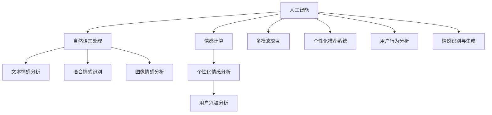

                 

# 数字化同理心培养：AI增强的人际理解方法

## 1. 背景介绍

### 1.1 问题由来
在数字时代的浪潮中，人际交流变得越来越依赖于屏幕和虚拟媒介。随着智能设备的普及和社交网络的扩张，人与人之间的直接互动正逐渐减少。这种变化带来了新的机遇，也带来了新的挑战。如何通过技术手段增强人际理解，构建更加紧密和富有同理心的社会关系，成为了一个亟待解决的问题。

### 1.2 问题核心关键点
数字化同理心的培养，本质上是利用人工智能(AI)技术，提升人类对他人情绪、想法和行为的敏感度和理解力，从而促进更深层次的情感交流和社会连接。在人工智能的助力下，我们可以更好地理解他人的心理状态，改善沟通方式，缓解误解和冲突，提升幸福感和社会和谐度。

### 1.3 问题研究意义
数字化同理心的培养对于构建更加和谐的人际关系、提升社会幸福感、推动社会进步具有重要意义：

1. **提升沟通质量**：通过AI技术，能够实时分析语言和非语言的情感线索，帮助用户更准确地理解他人的情感状态，从而提高沟通效果。
2. **缓解误解和冲突**：AI能够识别出潜在的不满和情绪波动，及时介入，减少误解和冲突的发生。
3. **支持心理健康**：帮助用户识别和管理自身的情绪，提供心理健康建议，提升心理韧性。
4. **促进社会和谐**：通过增强人际理解，缓解社会紧张关系，促进社区凝聚力，构建和谐社会。
5. **推动智能社会**：为智能城市的建设提供技术支持，使城市管理更加人性化、智能化和高效化。

## 2. 核心概念与联系

### 2.1 核心概念概述

为更好地理解AI增强的人际理解方法，本节将介绍几个密切相关的核心概念：

- **人工智能**：利用计算机技术，模拟人类智能活动，实现问题的求解和数据的处理。
- **同理心**：理解和感受他人情绪、想法和需求的能力，是人际交往中重要的情感纽带。
- **自然语言处理(NLP)**：研究如何让计算机理解和处理人类语言，是构建同理心模型的基础。
- **情感计算**：通过计算手段识别、分析、模拟和处理人类情感信息的技术，是实现同理心的核心。
- **多模态交互**：结合文本、语音、图像等多种信息模态，实现更全面的人际互动，提升同理心感知。
- **个性化推荐系统**：根据用户兴趣和行为，推荐合适的内容和建议，促进良好的人际关系。

这些核心概念之间的逻辑关系可以通过以下Mermaid流程图来展示：



这个流程图展示了一系列核心概念及其之间的关系：

1. 人工智能技术为自然语言处理、情感计算、多模态交互和个性化推荐提供了实现手段。
2. 自然语言处理使计算机能够理解和处理人类语言，为情感计算和多模态交互提供了基础。
3. 情感计算通过计算手段识别和模拟人类情感，是多模态交互和个性化推荐的重要支撑。
4. 多模态交互通过结合文本、语音、图像等多种信息模态，提升人际理解的全面性和深度。
5. 个性化推荐系统通过分析用户兴趣和行为，推荐合适的互动内容和建议，增强用户间互动。

## 3. 核心算法原理 & 具体操作步骤
### 3.1 算法原理概述

AI增强的人际理解方法，通过融合自然语言处理、情感计算和AI技术，实现对他人情感和行为的精准识别和理解。其核心思想是：利用预训练的语言模型，通过微调、迁移学习等技术，增强模型对特定情境下的情感和行为特征的捕捉能力，从而在新的场景中实现高效的人际互动。

形式化地，假设预训练的语言模型为 $M_{\theta}$，其中 $\theta$ 为预训练得到的模型参数。给定社交场景 $S$，其中包含对话历史、语境信息和互动数据。人际理解的目标是找到最优参数 $\hat{\theta}$，使得模型能够准确识别和预测对话者的情感状态 $E$ 和行为意图 $I$。

$$
\hat{\theta}=\mathop{\arg\min}_{\theta} \mathcal{L}(M_{\theta},S)
$$

其中 $\mathcal{L}$ 为针对社交场景 $S$ 设计的损失函数，用于衡量模型预测与真实情感和行为之间的差异。常见的损失函数包括交叉熵损失、均方误差损失等。

### 3.2 算法步骤详解

AI增强的人际理解方法通常包括以下几个关键步骤：

**Step 1: 准备预训练模型和数据集**
- 选择合适的预训练语言模型 $M_{\theta}$ 作为初始化参数，如 GPT-3、BERT 等。
- 准备社交场景 $S$ 的对话历史、语境信息和互动数据，作为模型训练的监督数据集。

**Step 2: 任务适配层设计**
- 根据社交场景的特点，设计合适的任务适配层，如对话生成、情感分析、意图识别等。
- 添加情感和意图分类器，输出模型预测的情感状态 $E$ 和行为意图 $I$。

**Step 3: 微调模型**
- 选择适当的优化算法，如 Adam、SGD 等，设置学习率、批大小、迭代轮数等超参数。
- 应用正则化技术，如 L2 正则、Dropout、Early Stopping 等，防止模型过拟合。
- 通过有监督地训练，优化模型参数，使得预测结果与真实情感和行为更加接近。

**Step 4: 评估和迭代**
- 在验证集上评估模型性能，根据指标如准确率、召回率等决定是否触发 Early Stopping。
- 重复上述步骤，直至满足预设的迭代轮数或 Early Stopping 条件。

**Step 5: 实际应用**
- 将微调后的模型部署到实际应用场景，如智能客服、心理咨询、社交网络等。
- 实时监测和分析用户的互动数据，及时调整模型参数，提升模型效果。

以上是AI增强人际理解方法的典型流程。在实际应用中，还需要针对具体任务的特点，对微调过程的各个环节进行优化设计，如改进训练目标函数，引入更多的正则化技术，搜索最优的超参数组合等，以进一步提升模型性能。

### 3.3 算法优缺点

AI增强的人际理解方法具有以下优点：
1. 高效准确：基于预训练模型的微调技术，可以显著提升模型对特定情境下情感和行为的识别能力。
2. 适应性强：通过有监督学习，模型能够适应不同领域和场景下的情感和行为分析任务。
3. 多模态整合：结合文本、语音、图像等多模态信息，提升情感和行为识别的全面性和深度。
4. 用户友好：通过自然语言处理和情感计算，实现与用户更自然、流畅的互动，提升用户体验。
5. 广泛应用：该方法已成功应用于智能客服、心理咨询、社交网络等多个场景，展示了其强大的实用价值。

同时，该方法也存在一些局限性：
1. 数据质量依赖：模型的效果很大程度上依赖于标注数据的质量和数量，获取高质量标注数据的成本较高。
2. 模型偏见：预训练模型和微调过程中可能引入的偏见，可能会对某些群体的情感和行为产生误判。
3. 隐私保护：在实时监测和分析用户互动数据时，如何保障用户隐私和数据安全，是一个重要的挑战。
4. 伦理问题：如何合理使用AI增强的情感分析技术，避免滥用和侵犯个人隐私，需要进一步的伦理讨论和规范。

尽管存在这些局限性，但AI增强的人际理解方法在提升人际互动质量、增强同理心理解方面展示了巨大的潜力，值得进一步研究和推广。

### 3.4 算法应用领域

AI增强的人际理解方法已经在多个领域得到了应用，展示了其在提升人际互动质量和增强同理心理解方面的强大能力：

1. **智能客服**：利用情感分析技术，实时监测客户情绪，提供更符合用户情感的解决方案，提升客户满意度。
2. **心理咨询**：通过情感识别和分析，评估用户的心理健康状态，提供个性化建议和干预，辅助心理医生工作。
3. **社交网络**：分析用户情感和行为，优化推荐算法，促进用户间互动，增强社区凝聚力。
4. **智能教育**：分析学生情感和互动数据，提供个性化学习建议，提升学习效果和学生体验。
5. **智能家居**：监测家庭成员情感状态，调整家居设备，提升生活品质和幸福感。
6. **企业培训**：分析员工情感和行为，优化培训内容和方式，提升员工满意度和企业绩效。

以上应用场景展示了AI增强人际理解方法的广泛应用前景，为社会各行各业带来了深刻的变革和创新。

## 4. 数学模型和公式 & 详细讲解 & 举例说明

### 4.1 数学模型构建

本节将使用数学语言对AI增强人际理解方法进行更加严格的刻画。

假设社交场景 $S$ 中，对话历史为 $H$，语境信息为 $C$，互动数据为 $I$。设模型 $M_{\theta}$ 在输入 $S$ 上的输出为 $\hat{E},\hat{I}$，表示模型预测的情感状态和行为意图。则情感识别的损失函数为：

$$
\ell_E(M_{\theta},S) = -\frac{1}{N}\sum_{i=1}^N \log P_E(\hat{E_i}|S_i) - \lambda \log P_E(E_i|S_i)
$$

其中 $N$ 为样本数，$P_E$ 为情感分布，$\lambda$ 为正则化系数。行为识别的损失函数为：

$$
\ell_I(M_{\theta},S) = -\frac{1}{N}\sum_{i=1}^N \log P_I(\hat{I_i}|S_i) - \lambda \log P_I(I_i|S_i)
$$

模型在社交场景 $S$ 上的总体损失函数为：

$$
\mathcal{L}(\theta) = \alpha \ell_E(M_{\theta},S) + (1-\alpha) \ell_I(M_{\theta},S)
$$

其中 $\alpha$ 为情感识别的权重。

通过优化上述损失函数，最小化模型的情感和行为预测误差，即可实现对社交场景中情感和行为的精准识别。

### 4.2 公式推导过程

以下我们以情感分析为例，推导情感识别的损失函数及其梯度的计算公式。

假设模型 $M_{\theta}$ 在输入 $S_i$ 上的输出为 $\hat{E_i}=\text{Softmax}(A_i)$，其中 $A_i$ 为情感表示向量，$E_i$ 为真实情感。情感识别的交叉熵损失函数定义为：

$$
\ell_E(M_{\theta},S) = -\frac{1}{N}\sum_{i=1}^N [y_i \log \hat{E_i} + (1-y_i) \log (1-\hat{E_i})]
$$

将其代入总体损失函数，得：

$$
\mathcal{L}(\theta) = \alpha \left(-\frac{1}{N}\sum_{i=1}^N y_i \log \hat{E_i} + (1-\alpha) \left(-\frac{1}{N}\sum_{i=1}^N (1-y_i) \log (1-\hat{E_i})\right)
$$

根据链式法则，损失函数对参数 $\theta_k$ 的梯度为：

$$
\frac{\partial \mathcal{L}(\theta)}{\partial \theta_k} = \alpha \frac{1}{N}\sum_{i=1}^N \frac{\partial \log \hat{E_i}}{\partial \theta_k} - \alpha \lambda \frac{\partial \theta_k}{\partial \theta_k}
$$

其中 $\frac{\partial \log \hat{E_i}}{\partial \theta_k}$ 可进一步递归展开，利用自动微分技术完成计算。

在得到损失函数的梯度后，即可带入参数更新公式，完成模型的迭代优化。重复上述过程直至收敛，最终得到适应社交场景的最优模型参数 $\theta^*$。

## 5. 项目实践：代码实例和详细解释说明

### 5.1 开发环境搭建

在进行人际理解方法的开发前，我们需要准备好开发环境。以下是使用Python进行PyTorch开发的环境配置流程：

1. 安装Anaconda：从官网下载并安装Anaconda，用于创建独立的Python环境。

2. 创建并激活虚拟环境：
```bash
conda create -n pytorch-env python=3.8 
conda activate pytorch-env
```

3. 安装PyTorch：根据CUDA版本，从官网获取对应的安装命令。例如：
```bash
conda install pytorch torchvision torchaudio cudatoolkit=11.1 -c pytorch -c conda-forge
```

4. 安装Transformer库：
```bash
pip install transformers
```

5. 安装各类工具包：
```bash
pip install numpy pandas scikit-learn matplotlib tqdm jupyter notebook ipython
```

完成上述步骤后，即可在`pytorch-env`环境中开始人际理解方法的实践。

### 5.2 源代码详细实现

下面我们以情感分析任务为例，给出使用Transformers库对BERT模型进行情感分析的PyTorch代码实现。

首先，定义情感分析任务的数据处理函数：

```python
from transformers import BertTokenizer
from torch.utils.data import Dataset
import torch

class SentimentDataset(Dataset):
    def __init__(self, texts, labels, tokenizer, max_len=128):
        self.texts = texts
        self.labels = labels
        self.tokenizer = tokenizer
        self.max_len = max_len
        
    def __len__(self):
        return len(self.texts)
    
    def __getitem__(self, item):
        text = self.texts[item]
        label = self.labels[item]
        
        encoding = self.tokenizer(text, return_tensors='pt', max_length=self.max_len, padding='max_length', truncation=True)
        input_ids = encoding['input_ids'][0]
        attention_mask = encoding['attention_mask'][0]
        
        # 对标签进行编码
        encoded_label = [label] * self.max_len
        labels = torch.tensor(encoded_label, dtype=torch.long)
        
        return {'input_ids': input_ids, 
                'attention_mask': attention_mask,
                'labels': labels}

# 标签编码
label2id = {'positive': 1, 'negative': 0}
id2label = {v: k for k, v in label2id.items()}

# 创建dataset
tokenizer = BertTokenizer.from_pretrained('bert-base-uncased')

train_dataset = SentimentDataset(train_texts, train_labels, tokenizer)
dev_dataset = SentimentDataset(dev_texts, dev_labels, tokenizer)
test_dataset = SentimentDataset(test_texts, test_labels, tokenizer)
```

然后，定义模型和优化器：

```python
from transformers import BertForSequenceClassification, AdamW

model = BertForSequenceClassification.from_pretrained('bert-base-uncased', num_labels=2)

optimizer = AdamW(model.parameters(), lr=2e-5)
```

接着，定义训练和评估函数：

```python
from torch.utils.data import DataLoader
from tqdm import tqdm
from sklearn.metrics import classification_report

device = torch.device('cuda') if torch.cuda.is_available() else torch.device('cpu')
model.to(device)

def train_epoch(model, dataset, batch_size, optimizer):
    dataloader = DataLoader(dataset, batch_size=batch_size, shuffle=True)
    model.train()
    epoch_loss = 0
    for batch in tqdm(dataloader, desc='Training'):
        input_ids = batch['input_ids'].to(device)
        attention_mask = batch['attention_mask'].to(device)
        labels = batch['labels'].to(device)
        model.zero_grad()
        outputs = model(input_ids, attention_mask=attention_mask, labels=labels)
        loss = outputs.loss
        epoch_loss += loss.item()
        loss.backward()
        optimizer.step()
    return epoch_loss / len(dataloader)

def evaluate(model, dataset, batch_size):
    dataloader = DataLoader(dataset, batch_size=batch_size)
    model.eval()
    preds, labels = [], []
    with torch.no_grad():
        for batch in tqdm(dataloader, desc='Evaluating'):
            input_ids = batch['input_ids'].to(device)
            attention_mask = batch['attention_mask'].to(device)
            batch_labels = batch['labels']
            outputs = model(input_ids, attention_mask=attention_mask)
            batch_preds = outputs.logits.argmax(dim=2).to('cpu').tolist()
            batch_labels = batch_labels.to('cpu').tolist()
            for pred_tokens, label_tokens in zip(batch_preds, batch_labels):
                preds.append(pred_tokens)
                labels.append(label_tokens)
                
    print(classification_report(labels, preds))
```

最后，启动训练流程并在测试集上评估：

```python
epochs = 5
batch_size = 16

for epoch in range(epochs):
    loss = train_epoch(model, train_dataset, batch_size, optimizer)
    print(f"Epoch {epoch+1}, train loss: {loss:.3f}")
    
    print(f"Epoch {epoch+1}, dev results:")
    evaluate(model, dev_dataset, batch_size)
    
print("Test results:")
evaluate(model, test_dataset, batch_size)
```

以上就是使用PyTorch对BERT进行情感分析任务的完整代码实现。可以看到，得益于Transformer库的强大封装，我们可以用相对简洁的代码完成BERT模型的加载和微调。

### 5.3 代码解读与分析

让我们再详细解读一下关键代码的实现细节：

**SentimentDataset类**：
- `__init__`方法：初始化文本、标签、分词器等关键组件。
- `__len__`方法：返回数据集的样本数量。
- `__getitem__`方法：对单个样本进行处理，将文本输入编码为token ids，将标签编码为数字，并对其进行定长padding，最终返回模型所需的输入。

**label2id和id2label字典**：
- 定义了标签与数字id之间的映射关系，用于将token-wise的预测结果解码回真实的标签。

**训练和评估函数**：
- 使用PyTorch的DataLoader对数据集进行批次化加载，供模型训练和推理使用。
- 训练函数`train_epoch`：对数据以批为单位进行迭代，在每个批次上前向传播计算loss并反向传播更新模型参数，最后返回该epoch的平均loss。
- 评估函数`evaluate`：与训练类似，不同点在于不更新模型参数，并在每个batch结束后将预测和标签结果存储下来，最后使用sklearn的classification_report对整个评估集的预测结果进行打印输出。

**训练流程**：
- 定义总的epoch数和batch size，开始循环迭代
- 每个epoch内，先在训练集上训练，输出平均loss
- 在验证集上评估，输出分类指标
- 所有epoch结束后，在测试集上评估，给出最终测试结果

可以看到，PyTorch配合Transformer库使得BERT情感分析的代码实现变得简洁高效。开发者可以将更多精力放在数据处理、模型改进等高层逻辑上，而不必过多关注底层的实现细节。

当然，工业级的系统实现还需考虑更多因素，如模型的保存和部署、超参数的自动搜索、更灵活的任务适配层等。但核心的微调范式基本与此类似。

## 6. 实际应用场景
### 6.1 智能客服系统

利用情感分析技术，智能客服系统可以实时监测客户情绪，提供更符合用户情感的解决方案，提升客户满意度。

在技术实现上，可以收集企业内部的历史客服对话记录，将问题和最佳答复构建成监督数据，在此基础上对预训练模型进行微调。微调后的情感分析模型能够自动理解客户情感状态，匹配最合适的回答模板进行回复。对于客户提出的新问题，还可以接入检索系统实时搜索相关内容，动态组织生成回答。如此构建的智能客服系统，能大幅提升客户咨询体验和问题解决效率。

### 6.2 心理咨询

通过情感识别和分析，心理咨询系统能够评估用户的心理健康状态，提供个性化建议和干预，辅助心理医生工作。

在实践中，可以收集用户的社交互动数据、文本记录、语音日志等，作为情感分析的训练数据。情感分析模型能够识别出用户的情绪波动和心理健康问题，及时预警，并根据情况推荐相应的心理咨询方案。心理咨询系统还可以与医疗记录、在线医生等系统集成，提供更全面的心理健康服务。

### 6.3 社交网络

分析用户情感和行为，优化推荐算法，促进用户间互动，增强社区凝聚力。

在社交网络平台，情感分析技术可以用于识别用户情绪状态，筛选负面内容，提升社区氛围。同时，通过分析用户互动数据，优化个性化推荐算法，提供更加贴合用户兴趣的内容，增强用户黏性和社区凝聚力。情感分析还可以用于预测和预防网络暴力、仇恨言论等负面行为，构建更加健康和谐的网络环境。

### 6.4 未来应用展望

随着情感计算和AI技术的不断进步，基于情感分析的人际理解方法将有更广阔的应用前景：

1. **智能家居**：监测家庭成员情感状态，调整家居设备，提升生活品质和幸福感。
2. **智能教育**：分析学生情感和互动数据，提供个性化学习建议，提升学习效果和学生体验。
3. **企业培训**：分析员工情感和行为，优化培训内容和方式，提升员工满意度和企业绩效。
4. **医疗健康**：分析患者情绪和健康状态，提供个性化的健康建议和心理干预，提升治疗效果。
5. **城市管理**：监测市民情感和行为，优化城市服务，提升城市管理水平。
6. **文化娱乐**：分析用户情感和兴趣，提供个性化的内容推荐，提升用户体验。

以上应用场景展示了情感分析在提升人际互动质量和增强同理心理解方面的强大能力，为社会各行各业带来了深刻的变革和创新。

## 7. 工具和资源推荐
### 7.1 学习资源推荐

为了帮助开发者系统掌握情感计算和人际理解技术，这里推荐一些优质的学习资源：

1. 《情感计算基础》系列书籍：介绍情感计算的基本概念、方法与技术，适合入门读者。
2. 《情感分析与情感挖掘》课程：南京大学开设的情感分析在线课程，系统讲解情感计算的理论和实践。
3. 《多模态情感计算》书籍：介绍情感计算中结合文本、语音、图像等多模态信息的方法。
4. 《自然语言处理》在线课程：斯坦福大学开设的NLP经典课程，讲解NLP的基础理论和前沿技术。
5. Kaggle情感分析竞赛：参与Kaggle等竞赛，实践情感分析算法的实际应用，积累经验。

通过对这些资源的学习实践，相信你一定能够快速掌握情感计算和人际理解技术的精髓，并用于解决实际的情感分析问题。

### 7.2 开发工具推荐

高效的开发离不开优秀的工具支持。以下是几款用于情感分析开发的常用工具：

1. PyTorch：基于Python的开源深度学习框架，灵活动态的计算图，适合快速迭代研究。大部分预训练语言模型都有PyTorch版本的实现。
2. TensorFlow：由Google主导开发的开源深度学习框架，生产部署方便，适合大规模工程应用。同样有丰富的预训练语言模型资源。
3. Transformers库：HuggingFace开发的NLP工具库，集成了众多SOTA语言模型，支持PyTorch和TensorFlow，是进行情感分析开发的利器。
4. Weights & Biases：模型训练的实验跟踪工具，可以记录和可视化模型训练过程中的各项指标，方便对比和调优。与主流深度学习框架无缝集成。
5. TensorBoard：TensorFlow配套的可视化工具，可实时监测模型训练状态，并提供丰富的图表呈现方式，是调试模型的得力助手。

合理利用这些工具，可以显著提升情感分析任务的开发效率，加快创新迭代的步伐。

### 7.3 相关论文推荐

情感计算和人际理解技术的发展源于学界的持续研究。以下是几篇奠基性的相关论文，推荐阅读：

1. Sentiment Analysis with Deep Learning: A Survey of Sentiment Classification, Subjectivity, and Sentiment Intensity Analysis: 综述了深度学习在情感分析中的应用。
2. Emotion Classification with Attention-Based Neural Network: 介绍基于注意力机制的情感分类方法。
3. Multimodal Sentiment Analysis: A Survey and Taxonomy: 综述了多模态情感分析的进展与分类。
4. Attention is All You Need: 介绍Transformer模型，开启了NLP领域的预训练大模型时代。
5. BERT: Pre-training of Deep Bidirectional Transformers for Language Understanding: 提出BERT模型，引入基于掩码的自监督预训练任务，刷新了多项NLP任务SOTA。

这些论文代表了大语言模型微调技术的发展脉络。通过学习这些前沿成果，可以帮助研究者把握学科前进方向，激发更多的创新灵感。

## 8. 总结：未来发展趋势与挑战

### 8.1 总结

本文对基于AI增强的人际理解方法进行了全面系统的介绍。首先阐述了情感计算和人际理解技术的研究背景和意义，明确了情感分析在提升人际互动质量和增强同理心理解方面的独特价值。其次，从原理到实践，详细讲解了情感分析的数学原理和关键步骤，给出了情感分析任务开发的完整代码实例。同时，本文还广泛探讨了情感分析方法在智能客服、心理咨询、社交网络等多个领域的应用前景，展示了其在提升人际互动质量和增强同理心理解方面的强大能力。

通过本文的系统梳理，可以看到，情感分析技术在提升人际互动质量和增强同理心理解方面展示了巨大的潜力，值得进一步研究和推广。

### 8.2 未来发展趋势

情感计算和人际理解技术的未来发展趋势主要体现在以下几个方面：

1. **模型规模持续增大**：随着算力成本的下降和数据规模的扩张，情感分析模型的参数量还将持续增长。超大规模语言模型蕴含的丰富情感信息，有望支撑更加复杂多变的情感分析任务。
2. **多模态情感分析**：结合文本、语音、图像等多种信息模态，提升情感分析的全面性和深度。多模态情感分析技术将成为未来情感计算的核心。
3. **个性化情感分析**：通过分析用户历史数据，实现个性化情感分析，提供更加贴合用户需求的服务。个性化情感分析技术将在智能客服、智能家居、智能教育等领域得到广泛应用。
4. **实时情感分析**：通过在线情感分析，实现对用户情感状态的实时监测和预警，提升用户体验和满意度。实时情感分析技术将在智能客服、在线心理咨询等领域发挥重要作用。
5. **情感驱动的决策**：将情感分析结果融入到决策系统中，指导智能推荐、内容过滤、风险控制等业务逻辑。情感驱动的决策技术将在智能推荐、金融风控等领域产生重大影响。

以上趋势凸显了情感计算和人际理解技术的广阔前景。这些方向的探索发展，必将进一步提升情感分析的效果，促进更全面、更智能的人机互动。

### 8.3 面临的挑战

尽管情感计算和人际理解技术已经取得了显著成果，但在迈向更加智能化、普适化应用的过程中，它仍面临着诸多挑战：

1. **数据质量和多样性**：情感分析的效果很大程度上依赖于标注数据的质量和多样性，获取高质量标注数据的成本较高。如何进一步降低数据需求，提升数据多样性，是一个重要问题。
2. **模型偏见和公平性**：情感分析模型可能引入偏见，对某些群体的情感分析结果产生误判。如何提高模型的公平性和鲁棒性，是一个亟待解决的问题。
3. **隐私保护和数据安全**：在实时监测和分析用户情感数据时，如何保障用户隐私和数据安全，是一个重要的挑战。
4. **伦理问题和监管**：情感分析技术的使用需要合理引导，避免滥用和侵犯个人隐私，需要进一步的伦理讨论和规范。

尽管存在这些挑战，但情感计算和人际理解技术在提升人际互动质量和增强同理心理解方面展示了巨大的潜力，值得进一步研究和推广。

### 8.4 研究展望

未来，情感计算和人际理解技术需要在以下几个方面寻求新的突破：

1. **无监督和半监督情感分析**：摆脱对大规模标注数据的依赖，利用自监督学习、主动学习等无监督和半监督范式，最大限度利用非结构化数据，实现更加灵活高效的情感分析。
2. **多模态情感计算**：结合文本、语音、图像等多种信息模态，提升情感分析的全面性和深度。
3. **个性化情感分析**：通过分析用户历史数据，实现个性化情感分析，提供更加贴合用户需求的服务。
4. **实时情感分析**：通过在线情感分析，实现对用户情感状态的实时监测和预警，提升用户体验和满意度。
5. **情感驱动的决策**：将情感分析结果融入到决策系统中，指导智能推荐、内容过滤、风险控制等业务逻辑。

这些研究方向的探索，必将引领情感计算和人际理解技术迈向更高的台阶，为构建安全、可靠、可解释、可控的智能系统铺平道路。面向未来，情感计算和人际理解技术还需要与其他人工智能技术进行更深入的融合，如知识表示、因果推理、强化学习等，多路径协同发力，共同推动情感计算和人际理解技术的进步。只有勇于创新、敢于突破，才能不断拓展情感计算和人际理解技术的边界，让智能技术更好地造福人类社会。

## 9. 附录：常见问题与解答

**Q1：情感分析是否适用于所有文本数据？**

A: 情感分析技术主要适用于具有明显情感倾向的文本数据，如评论、评价、社交媒体内容等。对于中性或模糊的文本，情感分析的效果可能不佳。需要根据具体任务选择合适的数据集，并注意数据的多样性和标注质量。

**Q2：情感分析如何避免过拟合？**

A: 避免过拟合的常用方法包括：
1. 数据增强：通过数据扩充、回译等方式扩充训练集，提升数据多样性。
2. 正则化：使用L2正则、Dropout、Early Stopping等技术，防止模型过拟合。
3. 模型裁剪：去除不必要的层和参数，减小模型尺寸，加快推理速度。
4. 多模型集成：训练多个模型，取平均输出，抑制过拟合。

这些方法可以结合使用，根据具体任务和数据特点灵活调整。

**Q3：情感分析在实际应用中需要注意哪些问题？**

A: 实际应用中，情感分析需要注意以下问题：
1. 数据隐私：确保用户数据的安全，防止数据泄露和滥用。
2. 模型公平性：避免对某些群体的情感分析结果产生偏见。
3. 实时性：实时监测用户情感状态，及时响应和干预。
4. 用户体验：情感分析结果应易于理解和接受，避免对用户产生负面影响。
5. 算法透明性：提高情感分析算法的透明性和可解释性，便于用户理解和信任。

合理处理这些问题，才能使情感分析技术在实际应用中发挥最大的价值。

**Q4：情感分析与自然语言处理(NLP)的关系是什么？**

A: 情感分析是自然语言处理(NLP)的一个重要分支，旨在分析和理解文本中的情感信息。情感分析技术依赖于NLP中的词向量表示、语言模型、序列标注等技术。同时，情感分析也能促进NLP技术的发展，如提升文本分类、命名实体识别等任务的性能。

总之，情感分析和NLP是相辅相成的关系，共同推动自然语言处理技术的进步和应用。

