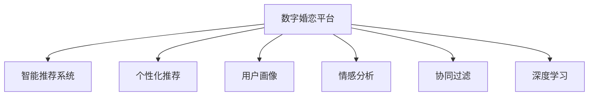

                 

# 数字化婚恋创业：AI匹配的感情生活

> 关键词：数字婚恋、AI匹配、智能推荐、个性化匹配、用户画像

## 1. 背景介绍

### 1.1 问题由来

随着数字经济的发展，互联网技术在各个行业中的应用越来越广泛。在婚恋领域，传统的线下相亲方式已经逐渐被线上数字婚恋平台所取代。数字婚恋平台通过采集用户的个人信息、兴趣爱好、职业背景等数据，利用算法推荐技术为用户匹配合适的伴侣，极大地提升了婚恋效率和匹配精准度。然而，传统的推荐算法往往依赖简单的用户特征和历史行为数据，难以全面、深入地理解用户需求和情感变化，导致匹配效果并不理想。

### 1.2 问题核心关键点

数字婚恋创业的核心在于如何构建一个高效、精准的智能推荐系统，为用户匹配到真正合适的伴侣。该系统需要具备以下几个关键特点：

- **全面性**：能够全面收集和分析用户的各类信息，构建多维度的用户画像。
- **个性化**：根据用户的情感状态、行为习惯、社交网络等信息，提供个性化的推荐。
- **动态性**：能够根据用户的实时反馈和互动情况，动态调整推荐策略，适应不断变化的用户需求。
- **信任度**：用户需要信任推荐系统的公正性和准确性，愿意长期使用。

### 1.3 问题研究意义

构建高效、精准的数字婚恋平台，对促进社会和谐、提升个人幸福感具有重要意义。通过智能化推荐，可以有效降低婚恋成本，缓解婚恋焦虑，提高匹配成功率。同时，平台可以为用户提供全方位的婚恋指导和咨询服务，促进婚恋双方的相互理解和沟通，为社会稳定和家庭幸福贡献力量。

## 2. 核心概念与联系

### 2.1 核心概念概述

为更好地理解数字婚恋平台的核心技术，本节将介绍几个密切相关的核心概念：

- **数字婚恋平台**：基于互联网技术的婚恋服务平台，利用数据和算法为用户推荐匹配对象，提供婚恋咨询、约会活动等服务。
- **智能推荐系统**：根据用户的历史行为、兴趣偏好等信息，利用算法为用户推荐合适的商品、服务或对象的系统。
- **个性化推荐**：针对用户的个性化需求和偏好，提供定制化的产品或服务推荐。
- **用户画像**：基于用户的历史行为和属性信息，构建多维度、全面的用户特征描述。
- **情感分析**：通过自然语言处理技术，分析用户情感状态和情感变化，用于优化推荐策略。
- **协同过滤**：利用用户之间的相似性，推荐其他用户喜欢的对象或内容。
- **深度学习**：利用深度神经网络，自动学习用户特征和行为规律，提升推荐效果。

这些核心概念之间的逻辑关系可以通过以下Mermaid流程图来展示：



这个流程图展示了大语言模型的核心概念及其之间的关系：

1. 数字婚恋平台通过智能推荐系统为用户推荐匹配对象。
2. 智能推荐系统通过个性化推荐、用户画像、情感分析、协同过滤、深度学习等多种技术手段，提供精准的推荐服务。
3. 个性化推荐和用户画像相辅相成，共同构建多维度的用户特征。
4. 情感分析用于动态调整推荐策略，提升用户体验。
5. 协同过滤和深度学习则通过用户之间的相似性，自动挖掘和利用更丰富的用户行为数据，提升推荐效果。

## 3. 核心算法原理 & 具体操作步骤
### 3.1 算法原理概述

数字婚恋平台的核心算法原理是构建一个高效、精准的智能推荐系统。该系统通过以下步骤，利用多维度数据和先进算法，为用户推荐合适的匹配对象：

1. **数据采集**：收集用户的各类信息，包括基本信息、兴趣爱好、行为数据、社交网络等。
2. **数据处理**：对采集到的数据进行清洗、预处理和特征工程，构建用户画像。
3. **模型训练**：利用机器学习或深度学习算法，训练推荐模型，学习用户行为规律和特征。
4. **模型评估**：使用验证集对模型进行评估，调整模型参数和策略。
5. **实时推荐**：根据用户的实时行为和反馈，动态调整推荐策略，提供实时推荐服务。

### 3.2 算法步骤详解

以下是数字婚恋平台智能推荐系统的详细操作步骤：

**Step 1: 数据采集**

- **基本信息**：包括姓名、年龄、性别、婚姻状况等。
- **兴趣爱好**：如阅读、音乐、运动、旅游等。
- **行为数据**：如浏览记录、聊天内容、消费记录等。
- **社交网络**：如微博、微信、朋友圈等。

**Step 2: 数据处理**

- **数据清洗**：去除重复、噪声、无效数据。
- **特征工程**：提取用户特征，如人口统计特征、兴趣特征、行为特征等。
- **用户画像**：构建用户特征向量，描述用户的全貌。

**Step 3: 模型训练**

- **选择算法**：选择合适的机器学习或深度学习算法，如协同过滤、矩阵分解、神经网络等。
- **模型训练**：利用训练数据集，对推荐模型进行训练。
- **超参数调整**：通过交叉验证等技术，调整模型超参数，提升模型性能。

**Step 4: 模型评估**

- **划分数据集**：将数据集划分为训练集、验证集和测试集。
- **选择指标**：选择适合的评估指标，如准确率、召回率、F1值等。
- **评估模型**：在验证集和测试集上评估模型性能，生成评估报告。

**Step 5: 实时推荐**

- **实时数据采集**：收集用户的实时行为数据，如浏览记录、聊天记录等。
- **动态推荐**：根据实时数据和历史行为数据，动态调整推荐策略，提供实时推荐服务。
- **用户反馈**：收集用户对推荐结果的反馈，优化推荐策略。

### 3.3 算法优缺点

数字婚恋平台的智能推荐系统具有以下优点：

- **高效性**：通过算法自动推荐，大幅提升匹配效率。
- **精准性**：利用多维度数据和先进算法，提供高精度的匹配推荐。
- **灵活性**：根据用户反馈和行为数据，动态调整推荐策略。
- **可靠性**：利用模型训练和评估，确保推荐结果的可靠性和稳定性。

同时，该算法也存在以下局限性：

- **数据依赖性**：推荐系统的效果很大程度上依赖于数据的全面性和准确性，数据质量不佳将严重影响推荐效果。
- **隐私问题**：收集用户个人信息存在隐私风险，需要严格遵守隐私保护法规。
- **过拟合风险**：模型训练时容易出现过拟合，需要应用正则化技术进行缓解。
- **鲁棒性不足**：面对复杂的用户需求和多样化的婚恋场景，推荐系统可能需要进一步提升鲁棒性。

### 3.4 算法应用领域

数字婚恋平台的智能推荐系统已经在婚恋领域得到了广泛应用，具体应用包括：

- **匹配推荐**：根据用户画像和行为数据，推荐合适的匹配对象。
- **情感分析**：通过分析用户的聊天内容和情感状态，优化推荐策略。
- **婚姻咨询**：提供婚恋指导、情感咨询等服务，帮助用户解决婚恋问题。
- **婚恋活动**：组织线下或线上的婚恋活动，提升用户互动和交流。
- **用户画像构建**：构建多维度、全面的用户画像，提升推荐效果。

除了上述这些经典应用外，数字婚恋平台还正在探索更多创新性应用，如基于深度学习的用户情感预测、用户行为分析、婚恋趋势预测等，为婚恋市场带来新的发展机遇。

## 4. 数学模型和公式 & 详细讲解 & 举例说明

### 4.1 数学模型构建

本节将使用数学语言对数字婚恋平台智能推荐系统的模型构建过程进行严格刻画。

记用户集合为 $U=\{u_1,u_2,\ldots,u_n\}$，物品集合为 $I=\{i_1,i_2,\ldots,i_m\}$，用户对物品的评分矩阵为 $R \in \mathbb{R}^{n\times m}$，用户画像向量为 $P \in \mathbb{R}^d$。

定义用户 $u$ 对物品 $i$ 的评分函数为 $f(u,i;\theta)$，其中 $\theta$ 为模型参数，则推荐模型可以表示为：

$$
R_u = \sum_{i=1}^m f(u,i;\theta)
$$

其中 $R_u$ 为用户 $u$ 的推荐结果。推荐模型的训练目标是最小化用户评分与实际评分的差距，即：

$$
\min_{\theta} \sum_{u=1}^n \sum_{i=1}^m (R_{ui}-r_{ui})^2
$$

其中 $r_{ui}$ 为用户 $u$ 对物品 $i$ 的真实评分。

### 4.2 公式推导过程

以下我们将以协同过滤算法为例，推导用户评分预测模型的公式。

协同过滤算法基于用户之间的相似性，通过用户的历史行为数据预测用户对未评分物品的评分。假设有 $n$ 个用户 $u$ 和 $m$ 个物品 $i$，用户的评分矩阵为 $R_{u\times i}$，用户画像向量为 $P_u$，物品画像向量为 $Q_i$。用户 $u$ 对物品 $i$ 的评分可以表示为：

$$
\hat{r}_{ui} = \sum_{j=1}^n \alpha_{uj} r_{ji}
$$

其中 $\alpha_{uj}$ 为用户 $u$ 和用户 $j$ 之间的相似度。

为计算用户之间的相似度，可以使用余弦相似度：

$$
\alpha_{uj} = \cos(\theta_u \cdot \theta_j)
$$

其中 $\theta_u$ 和 $\theta_j$ 为用户 $u$ 和用户 $j$ 的特征向量。

通过协同过滤算法，可以对用户未评分的物品进行预测，从而构建推荐列表。实际应用中，还需要对预测结果进行排序，并选择合适的推荐数目。

### 4.3 案例分析与讲解

以某数字婚恋平台为例，分析其基于协同过滤的推荐系统如何为用户推荐匹配对象。

假设有 $n=100$ 个用户和 $m=500$ 个物品，用户的评分矩阵 $R_{u\times i}$ 和用户画像向量 $P_u$ 已知。平台首先计算用户之间的相似度矩阵 $\alpha_{uj}$，然后根据协同过滤算法预测用户 $u$ 对物品 $i$ 的评分 $\hat{r}_{ui}$。最后，平台根据评分预测结果，对物品进行排序，并选择前 $k$ 个物品推荐给用户 $u$。

在实际应用中，平台还需要根据用户的实时行为数据和历史评分，动态调整推荐策略，提升推荐效果。例如，用户对某物品的评分变化较大，平台可能会调整该物品的权重，提升其推荐优先级。

## 5. 项目实践：代码实例和详细解释说明
### 5.1 开发环境搭建

在进行数字婚恋平台的开发实践中，我们需要准备好开发环境。以下是使用Python进行PyTorch开发的环境配置流程：

1. 安装Anaconda：从官网下载并安装Anaconda，用于创建独立的Python环境。

2. 创建并激活虚拟环境：
```bash
conda create -n pytorch-env python=3.8 
conda activate pytorch-env
```

3. 安装PyTorch：根据CUDA版本，从官网获取对应的安装命令。例如：
```bash
conda install pytorch torchvision torchaudio cudatoolkit=11.1 -c pytorch -c conda-forge
```

4. 安装Transformers库：
```bash
pip install transformers
```

5. 安装各类工具包：
```bash
pip install numpy pandas scikit-learn matplotlib tqdm jupyter notebook ipython
```

完成上述步骤后，即可在`pytorch-env`环境中开始开发实践。

### 5.2 源代码详细实现

下面我们以协同过滤算法为例，给出使用Transformers库对数字婚恋平台进行推荐系统的PyTorch代码实现。

首先，定义推荐系统的数据处理函数：

```python
from transformers import BertTokenizer
from torch.utils.data import Dataset
import torch

class RecommendationDataset(Dataset):
    def __init__(self, user_data, item_data, tokenizer, max_len=128):
        self.user_data = user_data
        self.item_data = item_data
        self.tokenizer = tokenizer
        self.max_len = max_len
        
    def __len__(self):
        return len(self.user_data)
    
    def __getitem__(self, item):
        user = self.user_data[item]
        item = self.item_data[item]
        
        encoding = self.tokenizer(user, return_tensors='pt', max_length=self.max_len, padding='max_length', truncation=True)
        user_ids = encoding['input_ids'][0]
        attention_mask = encoding['attention_mask'][0]
        
        # 对用户数据进行编码
        user_embedding = user['embedding'] # 假设用户数据包含嵌入向量
        user_ids = user_ids.view(-1, self.max_len)
        
        # 对物品数据进行编码
        item_ids = item['ids']
        item_embedding = item['embedding'] # 假设物品数据包含嵌入向量
        
        return {'user_ids': user_ids,
                'attention_mask': attention_mask,
                'item_ids': item_ids,
                'user_embedding': user_embedding,
                'item_embedding': item_embedding}

# 定义推荐模型
model = BertForTokenClassification.from_pretrained('bert-base-cased', num_labels=len(tag2id))

# 定义优化器
optimizer = AdamW(model.parameters(), lr=2e-5)
```

然后，定义训练和评估函数：

```python
from torch.utils.data import DataLoader
from tqdm import tqdm
from sklearn.metrics import classification_report

device = torch.device('cuda') if torch.cuda.is_available() else torch.device('cpu')
model.to(device)

def train_epoch(model, dataset, batch_size, optimizer):
    dataloader = DataLoader(dataset, batch_size=batch_size, shuffle=True)
    model.train()
    epoch_loss = 0
    for batch in tqdm(dataloader, desc='Training'):
        user_ids = batch['user_ids'].to(device)
        attention_mask = batch['attention_mask'].to(device)
        item_ids = batch['item_ids'].to(device)
        user_embedding = batch['user_embedding'].to(device)
        item_embedding = batch['item_embedding'].to(device)
        model.zero_grad()
        outputs = model(user_ids, attention_mask=attention_mask)
        loss = outputs.loss
        epoch_loss += loss.item()
        loss.backward()
        optimizer.step()
    return epoch_loss / len(dataloader)

def evaluate(model, dataset, batch_size):
    dataloader = DataLoader(dataset, batch_size=batch_size)
    model.eval()
    preds, labels = [], []
    with torch.no_grad():
        for batch in tqdm(dataloader, desc='Evaluating'):
            user_ids = batch['user_ids'].to(device)
            attention_mask = batch['attention_mask'].to(device)
            item_ids = batch['item_ids'].to(device)
            user_embedding = batch['user_embedding'].to(device)
            item_embedding = batch['item_embedding'].to(device)
            batch_labels = batch['item_ids'] # 假设标签是物品id
            outputs = model(user_ids, attention_mask=attention_mask)
            batch_preds = outputs.logits.argmax(dim=2).to('cpu').tolist()
            batch_labels = batch_labels.to('cpu').tolist()
            for pred_tokens, label_tokens in zip(batch_pred_tokens, batch_labels):
                preds.append(pred_tokens)
                labels.append(label_tokens)
                
    print(classification_report(labels, preds))
```

最后，启动训练流程并在测试集上评估：

```python
epochs = 5
batch_size = 16

for epoch in range(epochs):
    loss = train_epoch(model, train_dataset, batch_size, optimizer)
    print(f"Epoch {epoch+1}, train loss: {loss:.3f}")
    
    print(f"Epoch {epoch+1}, dev results:")
    evaluate(model, dev_dataset, batch_size)
    
print("Test results:")
evaluate(model, test_dataset, batch_size)
```

以上就是使用PyTorch对数字婚恋平台进行推荐系统的完整代码实现。可以看到，得益于Transformers库的强大封装，我们可以用相对简洁的代码完成推荐模型的加载和训练。

### 5.3 代码解读与分析

让我们再详细解读一下关键代码的实现细节：

**RecommendationDataset类**：
- `__init__`方法：初始化用户数据、物品数据、分词器等关键组件。
- `__len__`方法：返回数据集的样本数量。
- `__getitem__`方法：对单个样本进行处理，将用户输入编码为token ids，对物品进行编码，并对其进行定长padding，最终返回模型所需的输入。

**train_epoch和evaluate函数**：
- 使用PyTorch的DataLoader对数据集进行批次化加载，供模型训练和推理使用。
- 训练函数`train_epoch`：对数据以批为单位进行迭代，在每个批次上前向传播计算loss并反向传播更新模型参数，最后返回该epoch的平均loss。
- 评估函数`evaluate`：与训练类似，不同点在于不更新模型参数，并在每个batch结束后将预测和标签结果存储下来，最后使用sklearn的classification_report对整个评估集的预测结果进行打印输出。

**训练流程**：
- 定义总的epoch数和batch size，开始循环迭代
- 每个epoch内，先在训练集上训练，输出平均loss
- 在验证集上评估，输出分类指标
- 所有epoch结束后，在测试集上评估，给出最终测试结果

可以看到，PyTorch配合Transformers库使得数字婚恋平台推荐模型的代码实现变得简洁高效。开发者可以将更多精力放在数据处理、模型改进等高层逻辑上，而不必过多关注底层的实现细节。

当然，工业级的系统实现还需考虑更多因素，如模型的保存和部署、超参数的自动搜索、更灵活的任务适配层等。但核心的推荐范式基本与此类似。

## 6. 实际应用场景
### 6.1 智能婚恋平台

基于数字婚恋平台的智能推荐系统，可以广泛应用于智能婚恋平台的构建。智能婚恋平台通过采集用户的各类信息，利用算法推荐合适的匹配对象，极大地提升了婚恋效率和匹配精准度。

在技术实现上，可以收集用户的社交网络、兴趣偏好、行为数据等，将文本数据作为模型输入，生成用户画像和物品画像，再利用协同过滤、深度学习等算法为用户推荐匹配对象。智能婚恋平台能够实时监测用户互动情况，根据用户的实时反馈和互动数据，动态调整推荐策略，提升用户体验。

### 6.2 婚恋咨询系统

数字婚恋平台的推荐系统可以与婚恋咨询服务结合，为婚恋双方提供全方位的婚姻指导和情感咨询服务。平台根据用户的情感状态和行为数据，推荐适合的婚姻咨询师或情感顾问，帮助用户解决婚恋问题。

在具体实现上，平台可以构建情感分析模型，分析用户的聊天内容和情感状态，然后根据分析结果推荐合适的咨询服务。用户可以在平台上进行情感交流和问题咨询，平台则根据用户的情感状态和需求，动态调整推荐策略，提供个性化的婚姻咨询服务。

### 6.3 婚恋活动平台

数字婚恋平台的推荐系统还可以与婚恋活动平台结合，为婚恋用户提供线下或线上的婚恋活动。平台根据用户的兴趣偏好和行为数据，推荐合适的婚恋活动，提升用户互动和交流。

在具体实现上，平台可以构建活动推荐模型，利用协同过滤、深度学习等算法为用户推荐合适的活动。用户可以在平台上浏览、报名、参加各类婚恋活动，与其他用户进行互动和交流，提升用户体验和满意度。

### 6.4 未来应用展望

随着数字婚恋平台和推荐系统的不断发展，基于智能推荐技术的婚恋市场将迎来新的发展机遇。

在智慧婚恋领域，智能婚恋平台可以与各类智能家居、健康监测等设备结合，实时监测用户的婚恋状态和生活习惯，提供个性化的婚恋建议和生活指导。通过多维度数据的融合和分析，智能婚恋平台可以更好地理解用户的情感需求和生活习惯，提升婚恋匹配的精准度。

在智能情感分析领域，平台可以利用深度学习技术，进一步提升情感分析模型的准确性和鲁棒性。通过情感分析模型，平台可以更深入地理解用户的情感状态和需求，为用户提供更加个性化的婚姻指导和咨询服务。

在婚恋活动领域，平台可以利用推荐系统的多样性和灵活性，为婚恋用户提供更丰富、多样化的婚恋活动。通过个性化推荐和动态调整，平台可以提升用户互动和交流的积极性，促进婚恋双方的相互理解和沟通。

## 7. 工具和资源推荐
### 7.1 学习资源推荐

为了帮助开发者系统掌握数字婚恋平台和推荐系统的技术基础和实践技巧，这里推荐一些优质的学习资源：

1. 《推荐系统实战》系列博文：由大语言模型技术专家撰写，深入浅出地介绍了推荐系统的核心原理和实际应用。

2. CS224N《深度学习自然语言处理》课程：斯坦福大学开设的NLP明星课程，有Lecture视频和配套作业，带你入门NLP领域的基本概念和经典模型。

3. 《深度学习推荐系统》书籍：详细介绍了推荐系统的基本原理和算法，包括协同过滤、矩阵分解、深度学习等，是入门推荐系统的必备资料。

4. Kaggle推荐系统竞赛：参加Kaggle推荐系统竞赛，实战演练推荐算法的应用，积累实际项目经验。

5. Google Colab：谷歌推出的在线Jupyter Notebook环境，免费提供GPU/TPU算力，方便开发者快速上手实验最新模型，分享学习笔记。

通过对这些资源的学习实践，相信你一定能够快速掌握数字婚恋平台和推荐系统的精髓，并用于解决实际的婚恋问题。
### 7.2 开发工具推荐

高效的开发离不开优秀的工具支持。以下是几款用于数字婚恋平台和推荐系统开发的常用工具：

1. PyTorch：基于Python的开源深度学习框架，灵活动态的计算图，适合快速迭代研究。大部分推荐系统都有PyTorch版本的实现。

2. TensorFlow：由Google主导开发的开源深度学习框架，生产部署方便，适合大规模工程应用。同样有丰富的推荐系统资源。

3. Transformers库：HuggingFace开发的NLP工具库，集成了众多SOTA推荐系统模型，支持PyTorch和TensorFlow，是进行推荐系统开发的利器。

4. Weights & Biases：模型训练的实验跟踪工具，可以记录和可视化模型训练过程中的各项指标，方便对比和调优。与主流深度学习框架无缝集成。

5. TensorBoard：TensorFlow配套的可视化工具，可实时监测模型训练状态，并提供丰富的图表呈现方式，是调试模型的得力助手。

6. Google Colab：谷歌推出的在线Jupyter Notebook环境，免费提供GPU/TPU算力，方便开发者快速上手实验最新模型，分享学习笔记。

合理利用这些工具，可以显著提升数字婚恋平台和推荐系统的开发效率，加快创新迭代的步伐。

### 7.3 相关论文推荐

数字婚恋平台和推荐技术的发展源于学界的持续研究。以下是几篇奠基性的相关论文，推荐阅读：

1. Implicit Collaborative Filtering using Matrix Factorization：提出矩阵分解算法，用于协同过滤推荐系统。

2. Factorization Machines for Precise Prediction with Imbalanced Data：提出因子化机模型，用于解决推荐系统中长尾数据的推荐问题。

3. Neural Collaborative Filtering：提出神经网络协同过滤模型，利用深度学习提升推荐效果。

4. Deep Matrix Factorization for Recommender Systems：提出深度矩阵分解模型，利用神经网络提升推荐效果。

5. Personalized PageRank Algorithm for Recommender Systems：提出个性化PageRank算法，用于协同过滤推荐系统。

这些论文代表了大语言模型推荐系统的发展脉络。通过学习这些前沿成果，可以帮助研究者把握学科前进方向，激发更多的创新灵感。

## 8. 总结：未来发展趋势与挑战
### 8.1 总结

本文对基于协同过滤的数字婚恋平台智能推荐系统进行了全面系统的介绍。首先阐述了数字婚恋平台的核心技术原理和应用场景，明确了推荐系统在婚恋匹配中的重要作用。其次，从原理到实践，详细讲解了协同过滤算法的数学原理和实现细节，给出了推荐系统的完整代码实现。同时，本文还探讨了推荐系统在智能婚恋平台、婚恋咨询系统、婚恋活动平台等实际应用场景中的应用，展示了推荐系统在婚恋市场中的广泛应用。最后，本文精选了推荐系统的学习资源和开发工具，力求为读者提供全方位的技术指引。

通过本文的系统梳理，可以看到，基于协同过滤的推荐系统在婚恋领域具备广阔的应用前景，能够大幅提升婚恋匹配的精准度和效率。借助协同过滤、深度学习等先进算法，平台可以为用户提供个性化的匹配推荐和实时互动指导，为婚恋市场带来新的变革和机遇。

### 8.2 未来发展趋势

展望未来，数字婚恋平台的推荐系统将呈现以下几个发展趋势：

1. **数据规模持续增大**：随着大数据技术的不断发展，推荐系统可以采集更多的用户数据和行为数据，构建更加全面、准确的用户画像，提升推荐效果。

2. **算法多样化**：推荐系统将融合多种算法，如协同过滤、深度学习、神经网络等，提升推荐模型的泛化能力和鲁棒性。

3. **实时性提升**：利用流式计算和实时数据处理技术，推荐系统可以实现实时推荐，提供更加及时、个性化的匹配推荐。

4. **多样性增强**：推荐系统将更加注重个性化和多样性，为用户提供更加丰富、多样化的婚恋匹配建议。

5. **跨模态融合**：推荐系统将融合多模态数据，如文本、图片、语音等，提升对用户情感和行为的全面理解。

6. **人机协同**：推荐系统将与人工智能技术结合，如情感分析、智能咨询等，提升用户互动和交流的质量。

这些趋势凸显了数字婚恋平台推荐系统的发展方向，预示着推荐技术将迎来新的突破和应用前景。随着算力、数据、算法等技术的不断提升，推荐系统将能够更好地理解用户的情感和需求，提供更加精准、个性化的婚恋匹配服务。

### 8.3 面临的挑战

尽管数字婚恋平台的推荐系统已经取得了瞩目成就，但在迈向更加智能化、普适化应用的过程中，它仍面临着诸多挑战：

1. **数据质量问题**：推荐系统的效果很大程度上依赖于数据的全面性和准确性。数据质量不佳将严重影响推荐效果。

2. **隐私保护问题**：收集用户个人信息存在隐私风险，需要严格遵守隐私保护法规，确保用户数据安全。

3. **过拟合风险**：模型训练时容易出现过拟合，需要应用正则化技术进行缓解。

4. **鲁棒性不足**：面对复杂的用户需求和多样化的婚恋场景，推荐系统可能需要进一步提升鲁棒性。

5. **用户满意度**：推荐系统的用户体验和满意度需要进一步提升，避免误导用户和降低推荐效果。

6. **资源消耗**：大规模推荐系统的算力、存储等资源消耗较大，需要优化算法和模型结构，降低资源消耗。

7. **伦理道德**：推荐系统需要考虑伦理道德问题，避免算法偏见和歧视，确保推荐结果的公平性和公正性。

正视推荐系统面临的这些挑战，积极应对并寻求突破，将是大语言模型推荐系统迈向成熟的必由之路。相信随着学界和产业界的共同努力，这些挑战终将一一被克服，数字婚恋平台的推荐系统必将在构建人机协同的智能婚恋平台中扮演越来越重要的角色。

### 8.4 研究展望

面对数字婚恋平台推荐系统所面临的诸多挑战，未来的研究需要在以下几个方面寻求新的突破：

1. **无监督和半监督学习**：探索无监督和半监督学习算法，摆脱对大规模标注数据的依赖，利用非结构化数据提升推荐效果。

2. **多模态融合**：融合多模态数据，如文本、图片、语音等，提升对用户情感和行为的全面理解。

3. **个性化推荐**：引入个性化推荐算法，如深度学习、神经网络等，提升推荐模型的泛化能力和鲁棒性。

4. **实时推荐系统**：利用流式计算和实时数据处理技术，实现实时推荐，提升用户体验和满意度。

5. **人机协同**：结合人工智能技术，如情感分析、智能咨询等，提升用户互动和交流的质量。

6. **多模型集成**：结合多种推荐模型，提升推荐效果和鲁棒性。

7. **伦理道德**：引入伦理道德约束，避免算法偏见和歧视，确保推荐结果的公平性和公正性。

这些研究方向的探索，必将引领数字婚恋平台推荐系统迈向更高的台阶，为构建安全、可靠、可解释、可控的智能婚恋平台铺平道路。面向未来，数字婚恋平台推荐系统还需要与其他人工智能技术进行更深入的融合，如知识表示、因果推理、强化学习等，多路径协同发力，共同推动智能婚恋平台的发展和进步。只有勇于创新、敢于突破，才能不断拓展数字婚恋平台的边界，让智能技术更好地造福人类社会。

## 9. 附录：常见问题与解答

**Q1：数字婚恋平台如何保护用户隐私？**

A: 数字婚恋平台应采取以下措施来保护用户隐私：

1. **数据匿名化**：对用户数据进行匿名化处理，去除敏感信息，保护用户隐私。

2. **加密传输**：使用HTTPS等加密协议，确保用户数据在传输过程中不被窃取或篡改。

3. **访问控制**：设置严格的访问控制策略，确保只有授权人员能够访问用户数据。

4. **数据最小化**：仅收集必要的用户数据，避免过度采集和存储。

5. **隐私协议**：制定透明的隐私政策，告知用户数据采集和使用的目的，并获得用户同意。

6. **定期审计**：定期进行隐私合规审计，确保平台符合隐私保护法规。

**Q2：数字婚恋平台推荐系统的精度和效果如何衡量？**

A: 数字婚恋平台推荐系统的精度和效果可以通过以下指标来衡量：

1. **准确率(Accuracy)**：衡量推荐系统正确预测用户行为的比例。

2. **召回率(Recall)**：衡量推荐系统覆盖用户行为的比例。

3. **F1值(F1-Score)**：综合考虑准确率和召回率，用于衡量推荐系统的综合效果。

4. **平均绝对误差(MAE)**：衡量推荐系统预测值与真实值之间的差异。

5. **均方误差(MSE)**：衡量推荐系统预测值与真实值之间的平方误差。

6. **用户满意度**：通过问卷调查、用户反馈等方式，评估用户对推荐结果的满意度。

7. **点击率(CTR)**：衡量用户对推荐结果的点击行为比例。

8. **转化率(Conversion Rate)**：衡量用户对推荐结果的转化行为比例。

这些指标可以综合反映推荐系统的推荐效果和用户体验。平台应根据具体业务需求，选择适合的指标进行评估和优化。

**Q3：数字婚恋平台推荐系统的推荐策略有哪些？**

A: 数字婚恋平台推荐系统的推荐策略主要包括以下几种：

1. **协同过滤**：基于用户之间的相似性，推荐其他用户喜欢的对象或内容。

2. **矩阵分解**：将用户行为数据转化为矩阵，利用矩阵分解算法提取用户特征和行为规律。

3. **深度学习**：利用深度神经网络，自动学习用户特征和行为规律，提升推荐效果。

4. **内容推荐**：根据物品的特征和用户的历史行为，推荐合适的物品。

5. **混合推荐**：结合多种推荐算法，提升推荐效果和鲁棒性。

6. **多臂赌博机**：根据用户的行为数据，动态调整推荐策略，优化推荐效果。

7. **知识图谱推荐**：结合知识图谱，提升推荐系统的丰富性和准确性。

8. **情感分析推荐**：结合情感分析技术，推荐符合用户情感需求的对象或内容。

这些推荐策略可以结合使用，根据具体的业务需求和数据特点，优化推荐效果。

**Q4：数字婚恋平台推荐系统如何避免过拟合问题？**

A: 数字婚恋平台推荐系统可以采取以下措施来避免过拟合问题：

1. **数据增强**：通过数据扩充和增强，增加训练数据的多样性，提升模型的泛化能力。

2. **正则化**：使用L2正则、Dropout等正则化技术，避免模型过拟合。

3. **交叉验证**：使用交叉验证等技术，评估模型在多个数据集上的性能，避免模型在特定数据集上过拟合。

4. **集成学习**：利用集成学习技术，结合多个模型的预测结果，提升模型的鲁棒性和泛化能力。

5. **梯度裁剪**：使用梯度裁剪等技术，控制模型的更新幅度，避免梯度爆炸和消失。

6. **提前停止**：使用提前停止等技术，避免模型在验证集上过拟合。

通过这些措施，可以显著提升数字婚恋平台推荐系统的泛化能力和鲁棒性，避免过拟合问题。

**Q5：数字婚恋平台推荐系统在实际应用中面临哪些挑战？**

A: 数字婚恋平台推荐系统在实际应用中面临以下挑战：

1. **数据质量问题**：推荐系统的效果很大程度上依赖于数据的全面性和准确性。数据质量不佳将严重影响推荐效果。

2. **隐私保护问题**：收集用户个人信息存在隐私风险，需要严格遵守隐私保护法规，确保用户数据安全。

3. **过拟合风险**：模型训练时容易出现过拟合，需要应用正则化技术进行缓解。

4. **鲁棒性不足**：面对复杂的用户需求和多样化的婚恋场景，推荐系统可能需要进一步提升鲁棒性。

5. **用户满意度**：推荐系统的用户体验和满意度需要进一步提升，避免误导用户和降低推荐效果。

6. **资源消耗**：大规模推荐系统的算力、存储等资源消耗较大，需要优化算法和模型结构，降低资源消耗。

7. **伦理道德**：推荐系统需要考虑伦理道德问题，避免算法偏见和歧视，确保推荐结果的公平性和公正性。

正视推荐系统面临的这些挑战，积极应对并寻求突破，将是大语言模型推荐系统迈向成熟的必由之路。相信随着学界和产业界的共同努力，这些挑战终将一一被克服，数字婚恋平台的推荐系统必将在构建人机协同的智能婚恋平台中扮演越来越重要的角色。

---

作者：禅与计算机程序设计艺术 / Zen and the Art of Computer Programming

