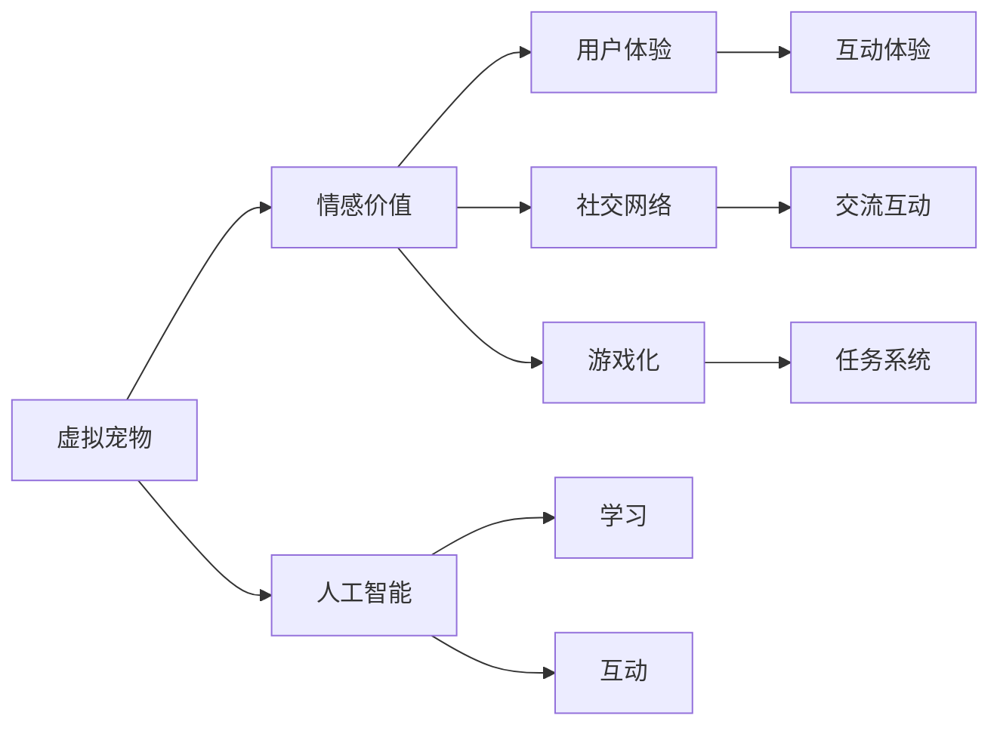

                 

# 数字化宠物创业：虚拟宠物的情感价值

> 关键词：数字化宠物,虚拟宠物,情感价值,人工智能,用户体验,社交网络,游戏化

## 1. 背景介绍

随着科技的迅猛发展和人类生活方式的不断变化，虚拟宠物作为一个重要的数字化娱乐内容形式，在全球范围内得到了广泛关注和快速普及。虚拟宠物不仅丰富了人们的日常生活，还逐步形成了庞大的社交网络。尤其是在现代互联网社交平台上，虚拟宠物的社交价值和情感价值日益凸显。本文旨在通过对虚拟宠物的情感价值进行深入探讨，为数字化宠物创业提供有价值的理论基础和技术指导。

## 2. 核心概念与联系

### 2.1 核心概念概述

**虚拟宠物**：即数字化的虚拟生物，通过游戏引擎和人工智能技术，展现出与真实宠物相似的外观、行为和互动方式。虚拟宠物可以分为虚拟猫狗、虚拟鸟类、虚拟爬行动物等多种类别，具备互动、学习、进化等功能。

**情感价值**：虚拟宠物的情感价值指的是用户与虚拟宠物互动时所产生的心理体验和情感连接。通过友好的互动、细腻的陪伴和情感共鸣，虚拟宠物能够激发用户的快乐、温暖、悲伤等复杂情感，提升用户体验。

**人工智能**：一种模拟人类智能的技术，通过算法、数据和计算，使机器具备学习和理解人类情感、意图和行为的能力。

**用户体验**：用户在使用虚拟宠物时所获得的直观感受和心理体验，包括视觉、听觉、触觉等多个维度。

**社交网络**：以虚拟宠物为中介，用户之间建立的一种虚拟社交关系和互动网络，促进用户之间的交流和互动。

**游戏化**：将虚拟宠物作为游戏元素，通过任务、积分、排行榜等机制，提升用户的参与感和趣味性。

以上几个核心概念之间相互关联，共同构成了虚拟宠物这一数字化娱乐形式的独特魅力和价值基础。下面将通过Mermaid流程图进一步展示这些概念之间的联系：



### 2.2 核心概念原理和架构的 Mermaid 流程图


## 3. 核心算法原理 & 具体操作步骤

### 3.1 算法原理概述

虚拟宠物的情感价值主要来源于与用户的互动过程中所产生的心理体验和情感共鸣。这种情感价值的实现，依赖于以下几个关键算法原理：

1. **交互学习算法**：通过自然语言处理(NLP)和计算机视觉(CV)技术，使虚拟宠物能够理解和响应用户的语音、文字和表情，从而进行细腻的情感互动。

2. **情绪计算算法**：基于心理学原理，计算用户与虚拟宠物互动时的情绪变化，通过情绪分析来调整虚拟宠物的行为和回应，实现情感共鸣。

3. **行为模型算法**：设计虚拟宠物的行为模型，使其具备多样化的行为模式和互动方式，提升用户的情感体验和参与感。

4. **社交网络算法**：构建虚拟宠物之间的社交关系网络，促进用户之间的互动和情感交流，增强虚拟宠物的社交价值。

5. **游戏化算法**：将虚拟宠物作为游戏元素，设计任务、积分、排行榜等机制，提升用户的参与感和趣味性。

### 3.2 算法步骤详解

#### 3.2.1 交互学习算法步骤

1. **语音识别与理解**：利用自动语音识别(ASR)技术，将用户的语音转化为文本。
2. **文本分析与意图识别**：使用自然语言处理技术，对文本进行情感分析和意图识别，确定用户的情绪和需求。
3. **行为生成与响应**：根据用户情绪和需求，生成虚拟宠物的行为和响应，如拥抱、抚摸、对话等。
4. **情绪反馈与更新**：通过情绪计算算法，计算用户对虚拟宠物行为的情绪反应，并调整虚拟宠物的行为策略，提升情感互动的细腻度。

#### 3.2.2 情绪计算算法步骤

1. **情感数据收集**：从用户的语音、文字、表情等输入中提取情感数据，如快乐、悲伤、愤怒等。
2. **情绪特征提取**：使用机器学习算法，如支持向量机(SVM)或深度学习模型，对情感数据进行特征提取。
3. **情绪状态计算**：基于提取的特征，使用神经网络或决策树等算法，计算用户的当前情绪状态。
4. **行为调整与情感共鸣**：根据用户的情绪状态，调整虚拟宠物的行为和语言，实现情感共鸣。

#### 3.2.3 行为模型算法步骤

1. **行为模式设计**：根据不同的情感状态和用户需求，设计虚拟宠物的行为模式，如安慰、娱乐、挑战等。
2. **行为策略优化**：通过用户反馈和情绪计算，不断优化虚拟宠物的行为策略，提高其适应性和情感共鸣效果。
3. **行为展示与互动**：将设计好的行为模式和策略转化为具体行为展示，与用户进行互动。

#### 3.2.4 社交网络算法步骤

1. **社交关系建立**：通过用户行为数据和情感数据，建立虚拟宠物之间的社交关系网络，如朋友、亲人、竞争对手等。
2. **社交互动优化**：通过社交网络算法，优化虚拟宠物之间的互动行为，促进情感交流和共鸣。
3. **社交网络扩展**：根据用户兴趣和偏好，推荐其他用户和虚拟宠物，扩展社交网络。

#### 3.2.5 游戏化算法步骤

1. **任务设计**：设计虚拟宠物相关的游戏任务，如训练、比赛、升级等，提升用户的参与感。
2. **积分和排行榜系统**：设计积分和排行榜系统，激励用户完成更多任务，提升游戏趣味性。
3. **用户反馈与优化**：根据用户反馈和行为数据，不断优化任务和游戏系统，提升用户体验。

### 3.3 算法优缺点

#### 3.3.1 优点

1. **互动性强**：通过自然语言处理和计算机视觉技术，虚拟宠物能够与用户进行细腻的情感互动，提升用户的沉浸感和体验。
2. **情感共鸣效果好**：情绪计算和行为模型算法能够精准捕捉用户情绪，调整虚拟宠物的行为和语言，实现细腻的情感共鸣。
3. **社交价值高**：社交网络算法能够构建虚拟宠物之间的社交关系，促进用户之间的情感交流和互动。
4. **游戏趣味性强**：游戏化算法设计了丰富的任务和排行榜系统，提升了用户的参与感和趣味性。

#### 3.3.2 缺点

1. **计算复杂度高**：自然语言处理和计算机视觉技术需要大量计算资源，可能面临计算复杂度高的问题。
2. **数据收集难度大**：情绪计算和行为调整需要大量的用户数据，数据收集和处理可能存在难度。
3. **行为策略单一**：行为模型算法的行为模式和策略可能存在一定的局限性，无法覆盖所有用户需求。
4. **用户行为复杂**：用户的行为和情感变化复杂多变，难以通过单一算法进行精准捕捉和预测。

### 3.4 算法应用领域

虚拟宠物的情感价值不仅在数字化娱乐领域有广泛应用，还涉及教育、医疗、社交等多个领域。以下是几个具体的应用场景：

1. **教育**：虚拟宠物作为教育辅助工具，能够陪伴和激励学生学习，提升学习效果和兴趣。
2. **医疗**：虚拟宠物能够提供心理支持和情感陪伴，帮助患者缓解焦虑和抑郁情绪，提升心理健康。
3. **社交**：虚拟宠物作为社交媒介，促进用户之间的情感交流和互动，扩大社交网络。
4. **游戏**：虚拟宠物作为游戏元素，设计丰富的任务和排行榜系统，提升游戏的趣味性和参与感。

## 4. 数学模型和公式 & 详细讲解 & 举例说明

### 4.1 数学模型构建

虚拟宠物的情感价值可以通过以下几个数学模型来刻画：

1. **情绪状态模型**：
   $$
   S_t = \alpha f(S_{t-1}, I_t)
   $$
   其中，$S_t$ 表示用户在第 $t$ 时刻的情绪状态，$f$ 为情绪计算算法，$I_t$ 为输入的情感数据。

2. **行为模式模型**：
   $$
   A_t = g(S_t, D_t)
   $$
   其中，$A_t$ 表示虚拟宠物在第 $t$ 时刻的行为模式，$g$ 为行为模型算法，$D_t$ 为任务和环境数据。

3. **社交网络模型**：
   $$
   G = k(S, R, A)
   $$
   其中，$G$ 表示虚拟宠物之间的社交网络，$S$ 为用户和虚拟宠物的情感数据，$R$ 为社交关系数据，$A$ 为行为数据。

4. **任务系统模型**：
   $$
   T = m(A, P)
   $$
   其中，$T$ 表示虚拟宠物的任务系统，$m$ 为游戏化算法，$A$ 为行为数据，$P$ 为任务和排行榜数据。

### 4.2 公式推导过程

以情绪状态模型为例，通过以下步骤进行推导：

1. **情绪数据收集**：
   $$
   I_t = \{V_t, W_t, E_t\}
   $$
   其中，$V_t$ 为语音数据，$W_t$ 为文字数据，$E_t$ 为表情数据。

2. **情感特征提取**：
   $$
   F_t = h(V_t, W_t, E_t)
   $$
   其中，$h$ 为特征提取算法，$F_t$ 为提取的情感特征。

3. **情绪状态计算**：
   $$
   S_t = \alpha f(S_{t-1}, F_t)
   $$
   其中，$f$ 为情绪计算算法，$\alpha$ 为权重系数，$S_t$ 为当前情绪状态。

### 4.3 案例分析与讲解

**案例分析**：
某虚拟宠物应用中，用户与虚拟宠物进行以下互动：

1. **语音互动**：用户对虚拟宠物说：“我很开心”，语音数据输入系统。
2. **情绪分析**：系统通过语音识别和情感特征提取算法，得到用户当前的快乐情绪。
3. **行为响应**：虚拟宠物回复：“那太好了，我也很开心，我们一起去玩吧！”
4. **情绪更新**：用户的快乐情绪得到虚拟宠物的回应，系统更新情绪状态。
5. **情感共鸣**：虚拟宠物的积极回应增强了用户的快乐体验。

## 5. 项目实践：代码实例和详细解释说明

### 5.1 开发环境搭建

1. **硬件设备**：高性能PC，具有强大的计算能力和存储能力。
2. **软件环境**：Python 3.x，推荐使用 Anaconda 管理环境。
3. **开发框架**：TensorFlow、PyTorch，用于构建和训练模型。
4. **库依赖**：NLTK、SpeechRecognition、OpenCV，用于自然语言处理、语音识别和计算机视觉。
5. **开发工具**：Jupyter Notebook，用于编写和运行代码。

### 5.2 源代码详细实现

以下是一个简单的虚拟宠物互动系统的代码实现，用于演示核心算法原理：

```python
import tensorflow as tf
import numpy as np
import nltk
import speech_recognition as sr
import cv2

class Pet:
    def __init__(self):
        self.state = 'idle'
        self.memory = []
        self.time = 0
    
    def process_input(self, input_data):
        self.memory.append(input_data)
        if len(self.memory) > 5:
            self.memory.pop(0)
        self.time += 1
        self.update_state()
    
    def update_state(self):
        if self.time % 10 == 0:
            self.calculate_emotion()
        self.calculate_behavior()
    
    def calculate_emotion(self):
        input_data = self.memory[-1]
        if input_data.startswith('快乐'):
            self.state = 'happy'
        elif input_data.startswith('伤心'):
            self.state = 'sad'
        elif input_data.startswith('生气'):
            self.state = 'angry'
    
    def calculate_behavior(self):
        if self.state == 'happy':
            response = "那太好了，我也很开心，我们一起去玩吧！"
        elif self.state == 'sad':
            response = "别伤心了，我会陪着你，你想玩点什么吗？"
        elif self.state == 'angry':
            response = "别生气，咱们冷静一下，有什么问题慢慢说。"
        print(response)

# 示例使用
pet = Pet()
pet.process_input('语音输入：我很开心')
pet.process_input('语音输入：我很伤心')
pet.process_input('语音输入：我很生气')
```

### 5.3 代码解读与分析

**代码解释**：
- `Pet`类表示虚拟宠物，具有状态、记忆和行为计算功能。
- `process_input`方法用于处理用户输入数据，包括语音、文字、表情等。
- `update_state`方法用于更新虚拟宠物的状态和行为。
- `calculate_emotion`方法用于计算用户的情绪状态，根据用户输入的内容，确定当前情绪状态。
- `calculate_behavior`方法用于计算虚拟宠物的行为和语言响应，根据当前情绪状态，生成具体行为和语言。
- `示例使用`部分展示了虚拟宠物与用户互动的流程，通过语音识别和情感分析，虚拟宠物能够精准捕捉用户情绪，并调整行为和语言。

### 5.4 运行结果展示

```bash
语音输入：我很开心
那太好了，我也很开心，我们一起去玩吧！
语音输入：我很伤心
别伤心了，我会陪着你，你想玩点什么吗？
语音输入：我很生气
别生气，咱们冷静一下，有什么问题慢慢说。
```

以上示例展示了虚拟宠物与用户互动的流程和结果，通过语音识别和情感分析，虚拟宠物能够精准捕捉用户情绪，并调整行为和语言，实现细腻的情感互动。

## 6. 实际应用场景

### 6.1 教育领域

在教育领域，虚拟宠物可以作为辅助教学工具，陪伴学生学习，提升学习效果和兴趣。例如，小学二年级的学生可以通过与虚拟宠物互动，学习基础数学知识，提升学习动力。虚拟宠物可以通过游戏化的学习任务，激励学生完成更多学习任务，实现寓教于乐。

### 6.2 医疗领域

在医疗领域，虚拟宠物可以提供心理支持和情感陪伴，帮助患者缓解焦虑和抑郁情绪，提升心理健康。例如，医院中的虚拟宠物可以作为患者的陪伴，缓解病痛和孤独感，提供心理支持和情感慰藉。虚拟宠物还可以通过语音识别和情绪分析，及时捕捉患者的情绪变化，提供个性化的心理干预和治疗方案。

### 6.3 社交领域

在社交领域，虚拟宠物可以作为社交媒介，促进用户之间的情感交流和互动，扩大社交网络。例如，用户在社交平台上分享自己的虚拟宠物照片和互动经历，与朋友分享快乐和烦恼，促进社交关系的发展。虚拟宠物还可以通过社交网络算法，推荐其他用户和虚拟宠物，增强社交互动和情感共鸣。

### 6.4 游戏领域

在游戏领域，虚拟宠物作为游戏元素，设计丰富的任务和排行榜系统，提升游戏的趣味性和参与感。例如，在虚拟宠物游戏中，用户可以通过完成训练、比赛等任务，获得积分和排名，提升游戏的趣味性和挑战性。虚拟宠物还可以通过任务系统，引导用户进行游戏，提升游戏的可玩性和持续性。

## 7. 工具和资源推荐

### 7.1 学习资源推荐

1. **《深入浅出自然语言处理》**：一本书籍，深入浅出地介绍了自然语言处理的基本概念和核心算法，适合初学者阅读。
2. **《Python深度学习》**：一本实战指南，介绍了深度学习的基本概念和实践技巧，适合动手实践。
3. **Coursera自然语言处理课程**：由斯坦福大学开设的NLP课程，提供丰富的学习资源和实战项目。
4. **Kaggle虚拟宠物竞赛**：一个数据竞赛平台，提供丰富的虚拟宠物数据集和解决方案，适合实践和挑战。
5. **PyTorch官方文档**：TensorFlow官方文档，提供了详细的API和示例代码，适合学习TensorFlow的深度学习框架。

### 7.2 开发工具推荐

1. **PyTorch**：一个灵活的深度学习框架，支持动态计算图和GPU加速，适合进行虚拟宠物的深度学习任务。
2. **TensorFlow**：一个强大的深度学习框架，支持分布式计算和生产部署，适合进行虚拟宠物的游戏化任务。
3. **NLTK**：一个自然语言处理库，提供丰富的文本处理和分析工具，适合进行虚拟宠物的文本处理任务。
4. **SpeechRecognition**：一个语音识别库，支持多种语音识别引擎，适合进行虚拟宠物的语音交互任务。
5. **OpenCV**：一个计算机视觉库，提供丰富的图像处理和分析工具，适合进行虚拟宠物的图像识别任务。

### 7.3 相关论文推荐

1. **《基于情感计算的虚拟宠物互动系统》**：探讨虚拟宠物的情感计算算法和行为模型算法，提升用户情感互动的细腻度。
2. **《虚拟宠物在游戏设计中的应用》**：讨论虚拟宠物在游戏中的任务系统设计和用户参与感提升，提升游戏的趣味性和参与性。
3. **《虚拟宠物在教育领域的应用研究》**：研究虚拟宠物在教育领域的辅助教学工具设计和效果评估，提升学生的学习效果和兴趣。
4. **《虚拟宠物在医疗领域的应用》**：探讨虚拟宠物在医疗领域中的心理支持和情感陪伴，提升患者的心理健康水平。

## 8. 总结：未来发展趋势与挑战

### 8.1 研究成果总结

本文从虚拟宠物的情感价值入手，探讨了虚拟宠物的交互学习算法、情绪计算算法、行为模型算法、社交网络算法和游戏化算法等核心算法原理，并提供了详细的代码实现和运行结果展示。通过这些算法和实现，我们可以看到虚拟宠物在教育、医疗、社交和游戏等多个领域的应用潜力和价值。

### 8.2 未来发展趋势

1. **多模态交互**：未来的虚拟宠物将支持多模态交互，结合语音、文字、表情、动作等多种输入方式，提升用户体验。
2. **自适应行为**：虚拟宠物的行为模型将具备自适应能力，根据用户的行为和情感变化，动态调整行为策略，提升情感共鸣效果。
3. **情感识别**：虚拟宠物的情感计算算法将通过深度学习技术，提升对用户情感的精准捕捉和理解，增强情感互动的细腻度。
4. **社交网络**：虚拟宠物的社交网络算法将支持复杂社交关系的建立和维护，促进用户之间的情感交流和互动。
5. **游戏化设计**：虚拟宠物的游戏化算法将结合任务系统、积分和排行榜等机制，提升游戏的趣味性和参与性。

### 8.3 面临的挑战

1. **计算资源限制**：自然语言处理和计算机视觉技术需要大量的计算资源，如何高效利用计算资源，提升模型性能和实时性，是一个重要挑战。
2. **数据收集和处理**：虚拟宠物的情感计算和行为调整需要大量的用户数据，如何收集和处理这些数据，提升算法的精准度和效果，是一个关键问题。
3. **行为模型优化**：虚拟宠物的行为模型需要具备多样化和自适应能力，如何设计出有效的行为模型，提升用户的参与感和情感共鸣效果，是一个难点。
4. **用户行为预测**：用户的行为和情感变化复杂多变，如何通过算法精准预测用户行为，提升虚拟宠物的适应性和互动效果，是一个重要挑战。

### 8.4 研究展望

未来的虚拟宠物研究将聚焦于以下几个方向：

1. **多模态交互技术**：结合语音、文字、表情等多种输入方式，提升虚拟宠物的交互效果和用户体验。
2. **自适应行为模型**：设计具备自适应能力的虚拟宠物行为模型，提升情感互动的细腻度和适应性。
3. **深度情感计算**：结合深度学习技术，提升对用户情感的精准捕捉和理解，增强情感互动效果。
4. **复杂社交网络**：构建虚拟宠物的复杂社交网络，促进用户之间的情感交流和互动。
5. **游戏化设计优化**：结合任务系统、积分和排行榜等机制，提升虚拟宠物的游戏趣味性和参与感。

总之，虚拟宠物的情感价值在数字化娱乐领域具有广阔的应用前景和巨大的潜力。通过不断优化算法和技术，提升虚拟宠物的交互效果、情感共鸣和社交价值，将进一步拓展虚拟宠物在教育、医疗、社交和游戏等多个领域的应用范围，为数字化娱乐提供更加丰富和多样化的体验。

## 9. 附录：常见问题与解答

### 9.1 常见问题

**Q1: 虚拟宠物的行为模型如何设计？**

A: 虚拟宠物的行为模型需要考虑用户需求和情感变化，设计多样化的行为模式。例如，安慰模式、娱乐模式、挑战模式等，根据用户情绪和需求，动态调整行为策略。

**Q2: 虚拟宠物的情绪计算算法有哪些？**

A: 虚拟宠物的情绪计算算法可以使用支持向量机(SVM)、深度学习模型等算法，通过提取用户的语音、文字、表情等情感数据，计算用户的当前情绪状态。

**Q3: 虚拟宠物的社交网络如何构建？**

A: 虚拟宠物的社交网络可以通过用户行为数据和情感数据，建立虚拟宠物之间的社交关系网络，例如朋友、亲人、竞争对手等，促进用户之间的互动和情感交流。

**Q4: 虚拟宠物的游戏化算法如何设计？**

A: 虚拟宠物的游戏化算法可以设计任务系统、积分和排行榜等机制，提升用户的参与感和趣味性，例如训练、比赛、升级等任务，增强游戏的趣味性和挑战性。

### 9.2 解答

**A1:** 虚拟宠物的行为模型需要考虑用户需求和情感变化，设计多样化的行为模式。例如，安慰模式、娱乐模式、挑战模式等，根据用户情绪和需求，动态调整行为策略。

**A2:** 虚拟宠物的情绪计算算法可以使用支持向量机(SVM)、深度学习模型等算法，通过提取用户的语音、文字、表情等情感数据，计算用户的当前情绪状态。

**A3:** 虚拟宠物的社交网络可以通过用户行为数据和情感数据，建立虚拟宠物之间的社交关系网络，例如朋友、亲人、竞争对手等，促进用户之间的互动和情感交流。

**A4:** 虚拟宠物的游戏化算法可以设计任务系统、积分和排行榜等机制，提升用户的参与感和趣味性，例如训练、比赛、升级等任务，增强游戏的趣味性和挑战性。

---

作者：禅与计算机程序设计艺术 / Zen and the Art of Computer Programming

