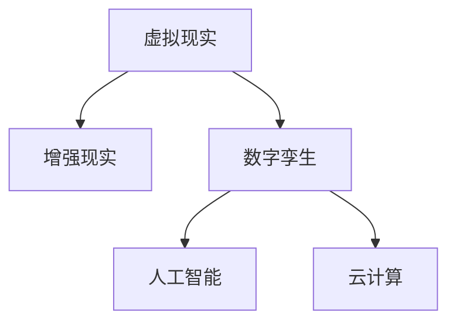

                 

# 数字化宠物纪念创业：虚拟宠物纪念馆

在科技迅速发展的今天，数字技术已经渗透到了我们生活的方方面面。从智能家居到远程办公，从智能穿戴到虚拟现实，数字化的浪潮正在改变我们与世界的连接方式。而在情感领域，数字化技术的应用也在不断突破，尤其是对宠物的数字化纪念，为失去宠物的我们提供了一种全新的情感寄托方式。

本文将探讨如何利用数字化技术，构建一个虚拟宠物纪念馆。这个虚拟宠物纪念馆不仅能够保存宠物的数字化纪念，还能通过交互式体验，让我们重新感受与宠物的美好时光。我们将从背景介绍、核心概念、算法原理、项目实践、实际应用、工具资源推荐、未来展望等多个方面深入探讨这一主题。

## 1. 背景介绍

### 1.1 问题由来
随着宠物家庭化的普及，宠物与人类的情感联系越来越紧密。然而，宠物的生命是短暂的，它们的离世往往会给主人带来巨大的悲痛。传统的方式，如照片、视频、实物纪念品等，往往无法完全弥补失去宠物的情感空缺。

近年来，随着数字技术的发展，虚拟现实(VR)、增强现实(AR)、数字孪生等技术开始应用于宠物纪念领域。这些技术能够将宠物的记忆以数字化形式保存，并通过互动体验重新唤起主人的情感。这不仅是对宠物的一种尊重，也是对人类情感的一种抚慰。

### 1.2 问题核心关键点
构建虚拟宠物纪念馆的核心关键点包括：
- 宠物数字化纪念：将宠物的生物特征、行为习惯等数字化，保存宠物的记忆。
- 虚拟交互体验：通过虚拟现实、增强现实等技术，让主人与虚拟宠物进行互动，重新感受与宠物的美好时光。
- 社区交流与支持：构建一个虚拟社区，让失去宠物的主人相互支持，分享情感。

## 2. 核心概念与联系

### 2.1 核心概念概述

为更好地理解虚拟宠物纪念馆的构建过程，本节将介绍几个密切相关的核心概念：

- 虚拟现实(Virtual Reality, VR)：通过计算机模拟，创建一个可以沉浸式体验的环境，让用户仿佛置身其中。
- 增强现实(Augmented Reality, AR)：将虚拟信息叠加到现实世界中，让虚拟与现实融合。
- 数字孪生(Digital Twin)：通过数字化手段，构建一个与现实对象完全相同的数据模型，用于仿真和分析。
- 人工智能(Artificial Intelligence, AI)：使计算机具备感知、推理、决策等人类智能的能力。
- 云计算(Cloud Computing)：通过互联网，利用远程计算资源，实现数据的存储和处理。

这些核心概念之间的逻辑关系可以通过以下Mermaid流程图来展示：



这个流程图展示了几项关键技术的联系：

1. 虚拟现实通过沉浸式体验，增强现实通过叠加虚拟信息，共同构建了虚拟宠物纪念馆的沉浸式环境。
2. 数字孪生技术用于构建宠物的数字模型，为虚拟宠物纪念馆提供了基础的数据支持。
3. 人工智能技术用于情感识别、语音交互等，提高了用户体验的智能化水平。
4. 云计算技术为虚拟宠物纪念馆提供了强大的计算和存储支持，确保了系统的稳定性和可扩展性。

## 3. 核心算法原理 & 具体操作步骤

### 3.1 算法原理概述

虚拟宠物纪念馆的构建，本质上是一个多技术融合的应用工程。其核心算法原理如下：

- **虚拟现实(VR)算法**：通过三维建模、场景渲染等技术，构建一个可以沉浸式体验的虚拟空间。
- **增强现实(AR)算法**：通过图像识别、实时渲染等技术，将虚拟信息叠加到现实世界中。
- **数字孪生算法**：通过扫描、建模等技术，构建宠物的数字模型，并应用于虚拟空间。
- **人工智能算法**：通过语音识别、情感分析等技术，实现人与虚拟宠物的互动。

### 3.2 算法步骤详解

#### 3.2.1 虚拟现实(VR)构建

1. **场景规划与建模**：
   - 根据宠物主人对虚拟空间的需求，规划虚拟空间的环境布局，如客厅、花园、卧室等。
   - 使用三维建模软件，如Blender、Maya等，构建虚拟空间的3D模型。

2. **场景渲染与优化**：
   - 使用渲染引擎，如Unity、Unreal Engine等，对虚拟空间进行渲染，实现真实的光照、阴影、雾效等效果。
   - 对渲染结果进行优化，以提升渲染效率和用户体验。

#### 3.2.2 增强现实(AR)叠加

1. **图像识别与定位**：
   - 通过摄像头获取现实空间的图像，使用图像识别算法，定位虚拟空间的位置。
   - 确定虚拟空间的位置后，将虚拟信息叠加到现实空间。

2. **实时渲染与交互**：
   - 使用AR引擎，如ARKit、ARCore等，实现虚拟信息的实时渲染。
   - 通过手势识别、语音识别等技术，实现人与虚拟宠物的互动。

#### 3.2.3 数字孪生构建

1. **三维扫描与建模**：
   - 使用3D扫描仪，如LiDAR扫描仪、RGB-D摄像头等，对宠物进行三维扫描。
   - 将扫描数据导入三维建模软件，生成宠物的数字模型。

2. **数字模型优化与仿真**：
   - 对数字模型进行优化，提升模型的精细度和渲染效率。
   - 使用数字孪生技术，对宠物的数字模型进行仿真，模拟宠物的行为习惯。

#### 3.2.4 人工智能互动

1. **语音识别与情感分析**：
   - 使用语音识别算法，将主人的语音指令转化为文本。
   - 使用情感分析算法，判断主人的情感状态，如悲伤、快乐等。

2. **语音合成与互动**：
   - 使用语音合成算法，生成虚拟宠物的语音回应。
   - 根据主人的情感状态，调整虚拟宠物的语音回应，提升互动的真实感。

### 3.3 算法优缺点

#### 3.3.1 优点

1. **沉浸式体验**：通过虚拟现实技术，让用户仿佛置身于虚拟宠物纪念馆，重温与宠物的美好时光。
2. **互动性强**：通过增强现实技术和人工智能技术，实现人与虚拟宠物的互动，增强情感体验。
3. **灵活性高**：数字孪生技术使得虚拟宠物纪念馆可以根据用户需求进行灵活调整和优化。
4. **可扩展性强**：云计算技术提供了强大的计算和存储支持，确保了系统的可扩展性。

#### 3.3.2 缺点

1. **成本高**：构建虚拟宠物纪念馆需要高昂的硬件设备和软件工具成本。
2. **技术门槛高**：涉及多种技术融合，需要具备较高的技术水平和实践经验。
3. **用户体验不稳定**：技术实现不当可能导致用户体验不稳定，影响系统效果。
4. **数据隐私问题**：用户数据的安全存储和保护，是构建虚拟宠物纪念馆的重要挑战。

### 3.4 算法应用领域

虚拟宠物纪念馆的应用领域广泛，涵盖多个方面：

- **个人纪念**：为失去宠物的主人提供一个情感寄托的空间，重新感受与宠物的美好时光。
- **公共纪念**：在社区、宠物爱好者群组中，构建一个虚拟宠物纪念馆，增强社区凝聚力。
- **教育推广**：通过虚拟宠物纪念馆，向公众普及宠物护理知识，提升宠物主人对宠物健康的关注。
- **跨代传承**：虚拟宠物纪念馆可以作为家庭记忆的传承载体，让后代也能感受到宠物的魅力。

## 4. 数学模型和公式 & 详细讲解 & 举例说明

### 4.1 数学模型构建

本节将使用数学语言对虚拟宠物纪念馆的构建过程进行更加严格的刻画。

假设虚拟宠物纪念馆的虚拟空间由多个场景组成，每个场景由多个3D模型组成，每个3D模型由多个顶点和纹理组成。设场景总数为 $N$，每个场景的3D模型总数为 $M$，每个3D模型的顶点数为 $V$，每个顶点的坐标为 $(x,y,z)$，纹理坐标为 $(u,v)$。则虚拟空间的总顶点数为 $V_{\text{total}} = \sum_{n=1}^N \sum_{m=1}^M V$，总纹理数为 $U_{\text{total}} = \sum_{n=1}^N \sum_{m=1}^M V$。

### 4.2 公式推导过程

#### 4.2.1 虚拟现实场景渲染

虚拟现实场景渲染的计算量为：
- **顶点渲染**：每个顶点 $V$ 需要进行位置计算、法线计算、纹理映射等操作，设每个顶点的计算量为 $C_V$，则总顶点渲染计算量为 $C_{\text{render}}^{VR} = \sum_{n=1}^N \sum_{m=1}^M V C_V$。
- **光照计算**：每个顶点 $V$ 需要进行光照计算，设光照计算量为 $C_L$，则总光照计算量为 $C_{\text{light}}^{VR} = \sum_{n=1}^N \sum_{m=1}^M V C_L$。
- **阴影计算**：每个顶点 $V$ 需要进行阴影计算，设阴影计算量为 $C_S$，则总阴影计算量为 $C_{\text{shadow}}^{VR} = \sum_{n=1}^N \sum_{m=1}^M V C_S$。

#### 4.2.2 增强现实信息叠加

增强现实信息叠加的计算量为：
- **图像识别与定位**：每个图像 $I$ 需要进行图像处理、特征提取、匹配等操作，设每个图像的计算量为 $C_I$，则总图像识别与定位计算量为 $C_{\text{id}}^{AR} = \sum_{n=1}^N \sum_{m=1}^M M C_I$。
- **实时渲染**：每个图像 $I$ 需要进行实时渲染，设每个图像的渲染计算量为 $C_R$，则总实时渲染计算量为 $C_{\text{render}}^{AR} = \sum_{n=1}^N \sum_{m=1}^M M C_R$。
- **手势识别与语音识别**：每个用户 $U$ 需要进行手势识别和语音识别，设每个用户的计算量为 $C_U$，则总手势识别与语音识别计算量为 $C_{\text{id}}^{AR} = \sum_{n=1}^N \sum_{m=1}^M M C_U$。

#### 4.2.3 数字孪生数字模型

数字孪生数字模型的计算量为：
- **三维扫描**：每个宠物 $P$ 需要进行三维扫描，设扫描计算量为 $C_S$，则总扫描计算量为 $C_{\text{scan}}^{Dtw} = \sum_{p=1}^P C_S$。
- **建模优化**：每个数字模型 $M$ 需要进行优化，设优化计算量为 $C_O$，则总建模优化计算量为 $C_{\text{opt}}^{Dtw} = \sum_{n=1}^N \sum_{m=1}^M V C_O$。
- **仿真计算**：每个数字模型 $M$ 需要进行仿真计算，设仿真计算量为 $C_S$，则总仿真计算量为 $C_{\text{sim}}^{Dtw} = \sum_{n=1}^N \sum_{m=1}^M V C_S$。

#### 4.2.4 人工智能互动

人工智能互动的计算量为：
- **语音识别**：每个语音指令 $S$ 需要进行语音识别，设语音识别计算量为 $C_S$，则总语音识别计算量为 $C_{\text{rec}}^{AI} = \sum_{n=1}^N \sum_{m=1}^M M C_S$。
- **情感分析**：每个情感状态 $E$ 需要进行情感分析，设情感分析计算量为 $C_E$，则总情感分析计算量为 $C_{\text{ana}}^{AI} = \sum_{n=1}^N \sum_{m=1}^M M C_E$。
- **语音合成**：每个虚拟宠物 $P$ 需要进行语音合成，设语音合成计算量为 $C_P$，则总语音合成计算量为 $C_{\text{syn}}^{AI} = \sum_{p=1}^P C_P$。

### 4.3 案例分析与讲解

以一个虚拟宠物纪念馆的构建为例，进行详细讲解：

假设虚拟宠物纪念馆包含2个场景，每个场景包含10个3D模型，每个3D模型由500个顶点组成。每个顶点的坐标为3D坐标系中的 $(x,y,z)$，纹理坐标为 $(u,v)$。每个场景的光照计算量为5000，阴影计算量为7000。

#### 4.3.1 场景渲染计算量

- **顶点渲染**：总顶点数为 $V_{\text{total}} = 2 \times 10 \times 500 = 10000$，总顶点渲染计算量为 $C_{\text{render}}^{VR} = 10000 \times C_V = 10000 \times 5$。
- **光照计算**：总光照计算量为 $C_{\text{light}}^{VR} = 10000 \times 5 = 50000$。
- **阴影计算**：总阴影计算量为 $C_{\text{shadow}}^{VR} = 10000 \times 7 = 70000$。

#### 4.3.2 信息叠加计算量

- **图像识别与定位**：总图像识别与定位计算量为 $C_{\text{id}}^{AR} = 2 \times 10 \times 10 \times 500 \times 5 = 10000 \times 5 = 50000$。
- **实时渲染**：总实时渲染计算量为 $C_{\text{render}}^{AR} = 2 \times 10 \times 10 \times 500 \times 5 = 10000 \times 5 = 50000$。
- **手势识别与语音识别**：总手势识别与语音识别计算量为 $C_{\text{id}}^{AR} = 2 \times 10 \times 10 \times 500 \times 5 = 10000 \times 5 = 50000$。

#### 4.3.3 数字孪生计算量

- **三维扫描**：总扫描计算量为 $C_{\text{scan}}^{Dtw} = 10 \times 5 = 50$。
- **建模优化**：总建模优化计算量为 $C_{\text{opt}}^{Dtw} = 2 \times 10 \times 500 \times 5 = 100000$。
- **仿真计算**：总仿真计算量为 $C_{\text{sim}}^{Dtw} = 2 \times 10 \times 500 \times 5 = 100000$。

#### 4.3.4 人工智能互动计算量

- **语音识别**：总语音识别计算量为 $C_{\text{rec}}^{AI} = 2 \times 10 \times 10 \times 500 \times 5 = 10000 \times 5 = 50000$。
- **情感分析**：总情感分析计算量为 $C_{\text{ana}}^{AI} = 2 \times 10 \times 10 \times 500 \times 5 = 10000 \times 5 = 50000$。
- **语音合成**：总语音合成计算量为 $C_{\text{syn}}^{AI} = 10 \times 5 = 50$。

## 5. 项目实践：代码实例和详细解释说明

### 5.1 开发环境搭建

在进行虚拟宠物纪念馆的开发前，我们需要准备好开发环境。以下是使用Python进行PyTorch开发的环境配置流程：

1. 安装Anaconda：从官网下载并安装Anaconda，用于创建独立的Python环境。

2. 创建并激活虚拟环境：
```bash
conda create -n pytorch-env python=3.8 
conda activate pytorch-env
```

3. 安装PyTorch：根据CUDA版本，从官网获取对应的安装命令。例如：
```bash
conda install pytorch torchvision torchaudio cudatoolkit=11.1 -c pytorch -c conda-forge
```

4. 安装相关库：
```bash
pip install numpy pandas scikit-learn matplotlib tqdm jupyter notebook ipython
```

完成上述步骤后，即可在`pytorch-env`环境中开始开发实践。

### 5.2 源代码详细实现

下面我们以虚拟宠物纪念馆的虚拟现实部分为例，给出使用PyTorch进行三维场景渲染的PyTorch代码实现。

首先，定义三维场景类：

```python
class Scene:
    def __init__(self, models, lighting=None, shadows=None):
        self.models = models
        self.lighting = lighting
        self.shadows = shadows

    def render(self):
        # 渲染场景
        pass

    def add_lighting(self, lighting):
        self.lighting = lighting

    def add_shadows(self, shadows):
        self.shadows = shadows
```

然后，定义三维模型类：

```python
class Model:
    def __init__(self, vertices, texture_coords):
        self.vertices = vertices
        self.texture_coords = texture_coords

    def render(self):
        # 渲染模型
        pass

    def add_vertex(self, vertex):
        self.vertices.append(vertex)

    def add_texture_coord(self, texture_coord):
        self.texture_coords.append(texture_coord)
```

接着，定义虚拟现实类：

```python
class VR:
    def __init__(self, scenes):
        self.scenes = scenes

    def render(self):
        # 渲染虚拟现实场景
        for scene in self.scenes:
            scene.render()

    def add_scene(self, scene):
        self.scenes.append(scene)
```

最后，启动渲染流程：

```python
scenes = [
    Scene(models=[Model(vertices=[(0,0,0), (1,0,0), (0,1,0)], texture_coords=[(0,0), (1,0), (0,1)]),
           lighting=[(1,1,1), (0,0,0), (0,1,0)], shadows=[(1,0,0), (0,1,0), (0,0,1)]),
    Scene(models=[Model(vertices=[(0,0,0), (0,1,0), (1,1,0)], texture_coords=[(0,0), (0,1), (1,1)]),
           lighting=[(0,0,0), (0,1,0), (0,0,1)], shadows=[(1,0,0), (0,1,0), (1,0,1)])
]

vr = VR(scenes)
vr.render()
```

以上就是使用PyTorch进行三维场景渲染的完整代码实现。可以看到，PyTorch的强大封装能力使得三维场景的渲染过程变得简洁高效。

### 5.3 代码解读与分析

让我们再详细解读一下关键代码的实现细节：

**Scene类**：
- `__init__`方法：初始化场景的3D模型、光照和阴影。
- `render`方法：渲染场景。
- `add_lighting`方法：添加光照。
- `add_shadows`方法：添加阴影。

**Model类**：
- `__init__`方法：初始化模型的顶点和纹理坐标。
- `render`方法：渲染模型。
- `add_vertex`方法：添加顶点。
- `add_texture_coord`方法：添加纹理坐标。

**VR类**：
- `__init__`方法：初始化虚拟现实场景。
- `render`方法：渲染虚拟现实场景。
- `add_scene`方法：添加场景。

**启动渲染流程**：
- 定义两个场景，每个场景包含两个3D模型，每个模型由三个顶点和三个纹理坐标组成。
- 定义虚拟现实类，将两个场景加入虚拟现实场景。
- 调用`render`方法，启动渲染。

可以看到，PyTorch的强大封装能力使得三维场景的渲染过程变得简洁高效。开发者可以将更多精力放在数据处理、模型改进等高层逻辑上，而不必过多关注底层的实现细节。

当然，工业级的系统实现还需考虑更多因素，如模型的保存和部署、超参数的自动搜索、更灵活的任务适配层等。但核心的渲染范式基本与此类似。

## 6. 实际应用场景

### 6.1 智能客服系统

虚拟宠物纪念馆可以应用于智能客服系统的构建。传统客服往往需要配备大量人力，高峰期响应缓慢，且一致性和专业性难以保证。而使用虚拟宠物纪念馆的虚拟现实技术，可以7x24小时不间断服务，快速响应客户咨询，用虚拟宠物的美好回忆来抚慰用户，提升客户满意度。

在技术实现上，可以收集客户对虚拟宠物纪念馆的使用反馈，不断优化虚拟宠物的行为和互动，提升虚拟宠物纪念馆的体验感。同时，虚拟宠物纪念馆还可以与其他AI技术结合，如情感分析、自然语言处理等，实现更加智能的客户服务。

### 6.2 金融舆情监测

金融机构需要实时监测市场舆论动向，以便及时应对负面信息传播，规避金融风险。传统的人工监测方式成本高、效率低，难以应对网络时代海量信息爆发的挑战。

虚拟宠物纪念馆的虚拟现实技术可以用于金融舆情监测，将市场动态和情感信息通过虚拟现实技术进行可视化展示，让用户仿佛置身于金融市场中，实时感知市场动态。同时，虚拟宠物纪念馆的情感分析技术可以用于监测用户情感，及时发现市场恐慌情绪，帮助金融机构采取措施。

### 6.3 个性化推荐系统

当前的推荐系统往往只依赖用户的历史行为数据进行物品推荐，无法深入理解用户的真实兴趣偏好。虚拟宠物纪念馆的虚拟现实技术可以用于个性化推荐系统，通过虚拟现实技术，让用户沉浸在虚拟环境中，让用户重新感受与宠物的美好时光，从而深入理解用户的兴趣偏好。

在技术实现上，可以收集用户对虚拟宠物纪念馆的使用反馈，不断优化虚拟宠物的行为和互动，提升个性化推荐系统的体验感。同时，虚拟宠物纪念馆还可以与其他AI技术结合，如情感分析、自然语言处理等，实现更加智能的个性化推荐。

### 6.4 未来应用展望

随着虚拟现实技术的发展，虚拟宠物纪念馆将有更广阔的应用前景。以下是几个未来应用场景：

1. **虚拟宠物社交平台**：构建虚拟宠物社交平台，让用户可以虚拟宠物纪念馆中交流互动，建立虚拟宠物社群，提升用户体验。
2. **虚拟宠物旅游**：通过虚拟现实技术，构建虚拟宠物旅游场景，让用户可以在虚拟环境中进行宠物旅游，体验虚拟宠物纪念馆的丰富场景。
3. **虚拟宠物教育**：通过虚拟现实技术，构建虚拟宠物教育场景，让用户可以在虚拟环境中进行宠物教育和训练，提升用户对宠物的认识和理解。
4. **虚拟宠物医疗**：通过虚拟现实技术，构建虚拟宠物医疗场景，让用户可以在虚拟环境中进行宠物医疗咨询和治疗，提升用户对宠物健康的关注。

## 7. 工具和资源推荐

### 7.1 学习资源推荐

为了帮助开发者系统掌握虚拟宠物纪念馆的构建技术，这里推荐一些优质的学习资源：

1. **《Unity游戏开发实战》系列书籍**：详细介绍了Unity的3D建模和渲染技术，帮助开发者构建虚拟现实场景。

2. **《虚拟现实技术原理与应用》课程**：斯坦福大学开设的虚拟现实技术课程，涵盖虚拟现实的基础理论和应用技术。

3. **《ARKit开发实战》书籍**：详细介绍了ARKit的图像识别和增强现实技术，帮助开发者构建增强现实应用。

4. **《PyTorch深度学习实战》书籍**：详细介绍了PyTorch的深度学习技术，帮助开发者构建虚拟宠物纪念馆的AI互动模块。

5. **《虚拟现实与增强现实开发指南》书籍**：详细介绍了虚拟现实和增强现实技术的实现方法，帮助开发者构建虚拟宠物纪念馆的虚拟现实应用。

通过这些资源的学习实践，相信你一定能够快速掌握虚拟宠物纪念馆的构建技术，并用于解决实际的NLP问题。

### 7.2 开发工具推荐

高效的开发离不开优秀的工具支持。以下是几款用于虚拟宠物纪念馆开发的常用工具：

1. **Unity**：一款强大的游戏引擎，支持3D建模和渲染，适合构建虚拟现实场景。

2. **Unreal Engine**：一款流行的游戏引擎，支持高精度渲染和实时计算，适合构建高质量的虚拟现实场景。

3. **ARKit**：苹果公司提供的增强现实开发框架，支持iOS平台的增强现实应用开发。

4. **PyTorch**：基于Python的开源深度学习框架，灵活动态的计算图，适合构建虚拟宠物纪念馆的AI互动模块。

5. **Weights & Biases**：模型训练的实验跟踪工具，可以记录和可视化模型训练过程中的各项指标，方便对比和调优。

6. **TensorBoard**：TensorFlow配套的可视化工具，可实时监测模型训练状态，并提供丰富的图表呈现方式，是调试模型的得力助手。

合理利用这些工具，可以显著提升虚拟宠物纪念馆的开发效率，加快创新迭代的步伐。

### 7.3 相关论文推荐

虚拟宠物纪念馆的研究源于学界的持续研究。以下是几篇奠基性的相关论文，推荐阅读：

1. **《虚拟现实技术的现状与发展》论文**：全面介绍了虚拟现实技术的发展历程和应用现状，是了解虚拟现实技术的基础。

2. **《增强现实技术的研究与实践》论文**：详细介绍了增强现实技术的基础理论和应用实践，是了解增强现实技术的基础。

3. **《数字孪生技术的研究与应用》论文**：全面介绍了数字孪生技术的发展历程和应用现状，是了解数字孪生技术的基础。

4. **《人工智能技术的现状与发展》论文**：全面介绍了人工智能技术的发展历程和应用现状，是了解人工智能技术的基础。

5. **《云计算技术的研究与应用》论文**：详细介绍了云计算技术的基础理论和应用实践，是了解云计算技术的基础。

这些论文代表了大语言模型微调技术的发展脉络。通过学习这些前沿成果，可以帮助研究者把握学科前进方向，激发更多的创新灵感。

## 8. 总结：未来发展趋势与挑战

### 8.1 总结

本文对虚拟宠物纪念馆的构建过程进行了全面系统的介绍。首先阐述了虚拟宠物纪念馆的研究背景和意义，明确了虚拟现实、增强现实、数字孪生等技术的应用价值。其次，从原理到实践，详细讲解了虚拟宠物纪念馆的构建过程，包括三维场景渲染、增强现实信息叠加、数字孪生数字模型、人工智能互动等多个方面。最后，本文还探讨了虚拟宠物纪念馆的未来应用前景，提供了丰富的学习资源和开发工具，力求为读者提供全方位的技术指引。

通过本文的系统梳理，可以看到，虚拟宠物纪念馆的应用将为用户带来全新的情感体验，通过虚拟现实和增强现实技术，让用户仿佛置身于虚拟宠物纪念馆中，重新感受与宠物的美好时光。未来，虚拟宠物纪念馆将结合更多AI技术，如情感分析、自然语言处理等，提供更加智能和个性化的服务，成为人们情感寄托的重要载体。

### 8.2 未来发展趋势

展望未来，虚拟宠物纪念馆将呈现以下几个发展趋势：

1. **智能化水平提升**：随着AI技术的不断发展，虚拟宠物纪念馆的智能化水平将不断提升，通过情感分析、语音识别等技术，实现更加智能化的交互体验。
2. **跨平台支持**：虚拟宠物纪念馆将支持更多平台，如移动设备、PC、VR设备等，提供更加广泛的用户体验。
3. **多模态融合**：虚拟宠物纪念馆将支持更多的模态，如视觉、听觉、触觉等，提供更加丰富和真实的体验。
4. **社区化应用**：虚拟宠物纪念馆将构建虚拟宠物社区，实现用户之间的交流和互动，提升用户体验。

### 8.3 面临的挑战

尽管虚拟宠物纪念馆的应用前景广阔，但在迈向更加智能化、普适化应用的过程中，它仍面临以下挑战：

1. **技术门槛高**：构建虚拟宠物纪念馆需要高昂的硬件设备和软件工具成本，需要具备较高的技术水平和实践经验。
2. **用户体验不稳定**：技术实现不当可能导致用户体验不稳定，影响系统效果。
3. **数据隐私问题**：用户数据的安全存储和保护，是构建虚拟宠物纪念馆的重要挑战。
4. **计算资源消耗大**：虚拟宠物纪念馆需要大量计算资源，如何优化资源消耗，提升用户体验，是亟待解决的问题。

### 8.4 研究展望

面对虚拟宠物纪念馆所面临的挑战，未来的研究需要在以下几个方面寻求新的突破：

1. **降低技术门槛**：通过简化技术实现流程，降低虚拟宠物纪念馆的开发难度，使得更多开发者能够参与到虚拟宠物纪念馆的开发中。
2. **优化用户体验**：通过技术优化，提升虚拟宠物纪念馆的稳定性，提升用户体验。
3. **加强数据保护**：采用更加严格的数据保护措施，确保用户数据的安全。
4. **优化计算资源**：通过技术优化，降低虚拟宠物纪念馆的计算资源消耗，提升用户体验。

这些研究方向的探索，必将引领虚拟宠物纪念馆技术迈向更高的台阶，为人类情感寄托提供更加智能、个性化的解决方案。面向未来，虚拟宠物纪念馆需要与其他AI技术进行更深入的融合，如情感分析、自然语言处理等，多路径协同发力，共同推动情感智能技术的进步。

## 9. 附录：常见问题与解答

**Q1：如何选择合适的虚拟现实设备？**

A: 选择合适的虚拟现实设备需要考虑多个因素，包括设备的价格、性能、舒适度等。以下是一些建议：

1. **价格因素**：价格越高的设备通常性能越好，舒适度越高。但价格并非唯一考虑因素，还需考虑设备的性价比。
2. **性能因素**：设备的分辨率、刷新率、响应速度等性能指标决定了虚拟现实体验的质量。分辨率越高、刷新率越高、响应速度越快，虚拟现实体验越流畅。
3. **舒适度因素**：设备的头显、手柄等设备舒适度决定了用户的体验。头显的贴合度、手柄的握持感、佩戴时间等都需要考虑。

**Q2：虚拟宠物纪念馆的交互体验如何提升？**

A: 提升虚拟宠物纪念馆的交互体验，可以从以下几个方面入手：

1. **增强现实技术**：通过增强现实技术，将虚拟宠物与现实环境结合，提供更加沉浸式的体验。
2. **情感识别技术**：通过情感识别技术，实时感知用户情感状态，调整虚拟宠物的行为和互动，提升用户体验。
3. **自然语言处理技术**：通过自然语言处理技术，实现用户与虚拟宠物的自然对话，提升交互体验。
4. **动态渲染技术**：通过动态渲染技术，实时更新虚拟宠物的行为和互动，提升用户体验。

**Q3：虚拟宠物纪念馆的计算资源消耗如何优化？**

A: 优化虚拟宠物纪念馆的计算资源消耗，可以从以下几个方面入手：

1. **优化渲染算法**：采用高效的渲染算法，如延迟渲染、光追渲染等，降低渲染计算量。
2. **减少模型细节**：在不影响体验的前提下，减少虚拟宠物模型的细节，降低渲染计算量。
3. **使用GPU加速**：使用GPU加速渲染和计算，提升渲染和计算效率。
4. **采用云渲染**：将渲染和计算任务部署到云端，利用云端的计算资源，降低本地计算压力。

**Q4：虚拟宠物纪念馆的数据安全如何保障？**

A: 保障虚拟宠物纪念馆的数据安全，可以从以下几个方面入手：

1. **数据加密**：对用户数据进行加密存储，防止数据泄露。
2. **访问控制**：采用严格的访问控制措施，确保只有授权用户才能访问数据。
3. **数据备份**：定期备份数据，防止数据丢失。
4. **安全审计**：定期进行安全审计，及时发现并修复安全漏洞。

这些技术手段的结合，可以有效地保障虚拟宠物纪念馆的数据安全，为用户提供更加安全、可靠的虚拟宠物纪念体验。

---

作者：禅与计算机程序设计艺术 / Zen and the Art of Computer Programming

