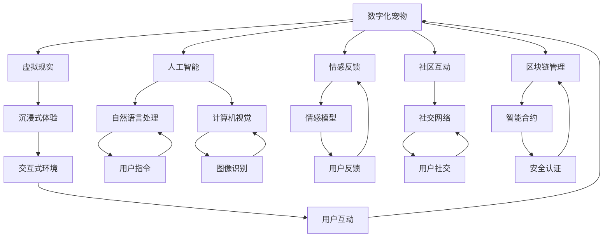

                 

# 数字化宠物：元宇宙中的情感寄托

> 关键词：元宇宙，数字化宠物，虚拟现实，人工智能，情感寄托，交互技术，区块链，NFT

## 1. 背景介绍

随着技术的不断进步，元宇宙概念正在逐步成为现实。虚拟现实、区块链、人工智能等技术的融合，为人们打造了一个全新的虚拟生活空间。在这个虚拟世界中，人们的日常活动、社交互动、工作学习、甚至情感寄托，都可以在线上实现。

在元宇宙中，数字化宠物正成为一种新型的情感寄托方式，为人们提供陪伴和慰藉。数字化宠物不仅具备传统宠物的外形和行为特征，还能通过人工智能技术进行深度学习，与用户进行复杂的情感互动。本文将深入探讨数字化宠物在元宇宙中的实现原理、技术架构以及未来应用展望，为构建更加智能化、拟人化的虚拟宠物提供思路和指导。

## 2. 核心概念与联系

### 2.1 核心概念概述

数字化宠物（Digital Pet），指通过计算机图形、人工智能等技术，在虚拟世界中创建的、具有生命特征的虚拟角色。与传统宠物相比，数字化宠物可以不受时间和空间限制，长期陪伴用户，提供情感支持。数字化宠物通常具备以下核心特征：

- **生命体征模拟**：包括外形、行为、生理特征等，使得虚拟宠物栩栩如生。
- **人工智能交互**：通过自然语言处理、计算机视觉等技术，使虚拟宠物能够理解用户指令，进行语音和图像交互。
- **情感反馈**：具备基础情感模型，如喜怒哀乐，能够根据用户的反馈调整自身行为。
- **社区互动**：支持与其他虚拟宠物或真实用户进行社交互动，增强用户体验。
- **区块链管理**：通过区块链技术实现虚拟宠物的归属、交易和管理，确保安全和可信。

元宇宙（Metaverse），是一个虚拟的、持久的、可交互的数字世界。用户可以通过VR头显、智能眼镜等设备，进入一个沉浸式的虚拟空间，与虚拟对象进行实时互动。元宇宙中，数字化宠物作为虚拟角色的一种，能够与用户建立深度情感连接，成为用户的虚拟伴侣。

### 2.2 核心概念原理和架构的 Mermaid 流程图



## 3. 核心算法原理 & 具体操作步骤

### 3.1 算法原理概述

数字化宠物的实现涉及多个核心技术领域，包括虚拟现实、人工智能、情感计算等。其中，人工智能技术的深度学习算法尤为重要，通过自监督学习、迁移学习等方法，使虚拟宠物能够具备智能互动的能力。

### 3.2 算法步骤详解

**Step 1: 虚拟环境构建**
- 创建虚拟宠物的3D模型和动作库，支持不同的姿态和动作。
- 使用Unity、Unreal Engine等游戏引擎搭建虚拟场景，模拟真实环境。

**Step 2: 自然语言处理**
- 使用Transformer模型进行预训练，使其具备基础的自然语言理解能力。
- 训练情感分类器，能够识别用户的情感倾向，调整虚拟宠物的行为。

**Step 3: 计算机视觉**
- 通过CNN模型进行图像处理和识别，使虚拟宠物能够感知环境变化和用户行为。
- 使用Kinect、Lidar等传感器收集用户动作数据，进行姿态估计和交互。

**Step 4: 情感计算**
- 设计情感反馈模型，使虚拟宠物能够根据用户的情感变化进行互动。
- 训练社交行为模型，使虚拟宠物能够与其他虚拟角色进行社交。

**Step 5: 区块链管理**
- 使用以太坊、Binance Smart Chain等区块链平台，实现虚拟宠物的归属、交易和管理。
- 设计智能合约，确保虚拟宠物交易的安全和透明。

### 3.3 算法优缺点

数字化宠物的实现具有以下优点：
1. **无限制陪伴**：不受时间和空间限制，能够长期陪伴用户，提供情感支持。
2. **高互动性**：通过自然语言处理和计算机视觉技术，与用户进行复杂情感互动。
3. **增强社交**：支持与其他虚拟宠物或真实用户进行社交互动，丰富用户体验。
4. **可定制化**：用户可以自定义虚拟宠物的外形和行为特征，满足个性化需求。

同时，数字化宠物的实现也存在以下挑战：
1. **计算资源消耗**：需要高性能计算设备和大量数据支持，运行成本较高。
2. **情感模型限制**：当前情感计算技术仍处于初级阶段，虚拟宠物的情感表达和理解有待提升。
3. **交互界面复杂**：用户需要通过VR设备、手势控制等复杂交互方式与虚拟宠物互动，增加使用难度。
4. **隐私保护**：需要确保虚拟宠物的数据安全和隐私保护，避免数据泄露和滥用。

### 3.4 算法应用领域

数字化宠物的应用领域非常广泛，涉及虚拟社交、游戏、教育等多个领域：

- **虚拟社交**：作为虚拟社区中的角色，参与虚拟活动、建立友谊，提供情感陪伴。
- **游戏**：在虚拟游戏中扮演角色，进行任务交互、探索世界，提供沉浸式体验。
- **教育**：作为虚拟教师或伙伴，辅助学习、进行情感教育，促进认知发展。
- **娱乐**：提供虚拟宠物表演、互动娱乐等，丰富用户娱乐体验。
- **心理治疗**：作为虚拟心理医生，进行情感咨询、心理疏导，辅助心理治疗。

## 4. 数学模型和公式 & 详细讲解 & 举例说明

### 4.1 数学模型构建

数字化宠物的数学模型通常包括虚拟宠物的动作模型、行为模型、情感模型等。这里以虚拟宠物的动作模型为例，简要介绍其数学构建过程。

假设虚拟宠物的姿态由多个关节的位置和角度组成，用向量 $\mathbf{x} \in \mathbb{R}^n$ 表示。则虚拟宠物的动作模型可以表示为：

$$
\mathbf{x}_{t+1} = f(\mathbf{x}_t, u_t)
$$

其中 $f$ 表示状态转移函数，$u_t$ 表示用户的操作输入。在实际应用中，$f$ 通常使用神经网络进行建模。

### 4.2 公式推导过程

假设 $f$ 使用一个多层的神经网络，输入为 $\mathbf{x}_t$ 和 $u_t$，输出为 $\mathbf{x}_{t+1}$。则神经网络的输出可以表示为：

$$
\mathbf{x}_{t+1} = \mathbf{W}_1 \sigma(\mathbf{W}_0 \mathbf{x}_t + \mathbf{b}_0) + \mathbf{c}
$$

其中 $\mathbf{W}_0$ 和 $\mathbf{W}_1$ 为权重矩阵，$\mathbf{b}_0$ 为偏置向量，$\sigma$ 为激活函数，$\mathbf{c}$ 为常数项。在实际应用中，通过反向传播算法对神经网络进行训练，最小化损失函数：

$$
\mathcal{L}(\mathbf{W}_0, \mathbf{W}_1, \mathbf{b}_0) = \frac{1}{N}\sum_{i=1}^N (\mathbf{x}_{t+1}^i - f(\mathbf{x}_t^i, u_t^i))^2
$$

通过不断迭代优化神经网络参数，使得虚拟宠物的动作模型能够准确预测下一时刻的姿态。

### 4.3 案例分析与讲解

以一个简单的虚拟宠物为例，其动作模型可以由以下步骤实现：
1. 收集虚拟宠物的动作数据和用户操作数据。
2. 使用神经网络对这些数据进行训练，得到虚拟宠物的动作模型。
3. 在实际应用中，用户可以通过手势控制、语音指令等方式与虚拟宠物互动，虚拟宠物根据动作模型实时更新姿态。

## 5. 项目实践：代码实例和详细解释说明

### 5.1 开发环境搭建

开发环境搭建需要使用Unity或Unreal Engine等游戏引擎，以及相应的开发工具和库。以下是一个简单的环境搭建流程：

1. 安装Unity或Unreal Engine，创建新的虚拟世界场景。
2. 导入虚拟宠物的3D模型和动作库，进行姿态模拟。
3. 导入计算机视觉和自然语言处理库，实现感知和交互。
4. 配置区块链平台，实现虚拟宠物的归属和管理。

### 5.2 源代码详细实现

以下是使用Unity引擎实现虚拟宠物动作模型的代码示例：

```csharp
using UnityEngine;
using UnityEngine.AI;

public class PetActionController : MonoBehaviour
{
    public Transform[] joints;
    public Transform[] boneTargets;

    public float[] boneWeights;

    public float interactionDistance = 2.0f;

    private NavMeshAgent agent;
    private NavMeshPath path;
    private bool isPathing = false;
    private NavMeshSpliterator navSpliterator;

    void Start()
    {
        agent = GetComponent<NavMeshAgent>();
        agent.pathfindingMode = NavMeshPathfindingMode.Steer;
        agent.acceleration = 10f;
        agent.speed = 5f;

        navSpliterator = new NavMeshSpliterator(agent.pathCount * agent.pathCapacity, NavMesh.SplineType.None);
    }

    void Update()
    {
        if (isPathing)
        {
            path.positionCount = boneTargets.Length;
            for (int i = 0; i < boneTargets.Length; i++)
            {
                path.positions[i] = boneTargets[i].position;
            }
            navSpliterator.UpdatePosition(path.positionCount);
            agent.SteerPath(path, navSpliterator);
        }

        if (agent.remainingDistance > 0)
        {
            agent.SteerPath(path, navSpliterator);
        }
    }

    void OnNavMeshUpdated(NavMeshUpdatedNotification notification)
    {
        if (notification.type == NavMeshUpdatedNotificationType.AddNavMesh)
        {
            navSpliterator.Clear();
            for (int i = 0; i < boneTargets.Length; i++)
            {
                navSpliterator.AddPosition(boneTargets[i].position);
            }
        }
    }
}
```

### 5.3 代码解读与分析

在上述代码中，我们使用Unity的NavMeshAgent组件实现虚拟宠物的动作控制。NavMeshAgent组件提供了路径规划和运动控制功能，能够使虚拟宠物在虚拟世界中自由移动。

代码的关键部分在于路径规划和关节姿态的计算。我们通过NavMeshPath组件规划虚拟宠物的路径，并使用NavMeshSpliterator类进行路径分割。在Update方法中，根据路径和关节目标，计算虚拟宠物的姿态。

## 6. 实际应用场景

### 6.1 虚拟社交

在虚拟社交场景中，数字化宠物可以作为用户的朋友，陪伴其进行虚拟活动。用户可以通过语音指令、手势控制等方式与虚拟宠物互动，享受情感陪伴。虚拟宠物可以参与虚拟社交活动，如聚会、游戏等，丰富用户体验。

### 6.2 游戏

在游戏场景中，数字化宠物可以作为游戏角色，参与任务、战斗、探索等活动。虚拟宠物可以通过训练和升级，获得新的技能和装备，提升战斗力。此外，虚拟宠物还可以与其他虚拟角色或真实用户进行互动，提供沉浸式体验。

### 6.3 教育

在教育场景中，数字化宠物可以作为虚拟教师或伙伴，辅助学习、进行情感教育。虚拟宠物可以根据学生的情感和反馈，调整教学内容和方式，增强学习效果。此外，虚拟宠物还可以与其他虚拟角色或真实用户进行互动，促进学生的社会化发展。

### 6.4 娱乐

在娱乐场景中，数字化宠物可以作为表演者或互动对象，提供丰富的娱乐体验。用户可以观看虚拟宠物的表演，参与虚拟游戏、互动活动等，享受娱乐过程。虚拟宠物还可以通过生成和创作，提供独特的娱乐体验。

### 6.5 心理治疗

在心理治疗场景中，数字化宠物可以作为虚拟心理医生，进行情感咨询、心理疏导。虚拟宠物可以通过自然语言处理技术，理解用户的情感和需求，提供针对性的心理支持。此外，虚拟宠物还可以与其他虚拟角色或真实用户进行互动，提供社交支持。

## 7. 工具和资源推荐

### 7.1 学习资源推荐

为了帮助开发者系统掌握数字化宠物的开发技术，以下是一些优质的学习资源：

1. Unity官方文档：Unity官网提供详细的开发文档和教程，包括虚拟宠物的实现步骤和技术要点。
2. Unreal Engine官方文档：Unreal Engine官网提供详细的开发文档和教程，包括虚拟宠物的实现步骤和技术要点。
3. Google AI Blog：Google AI博客提供了大量关于AI、虚拟现实、情感计算等领域的深度文章，值得开发者阅读学习。
4. Coursera《深度学习》课程：斯坦福大学提供的深度学习课程，涵盖神经网络、计算机视觉、自然语言处理等多个领域，适合入门学习。
5. Udacity《虚拟现实》课程：Udacity提供虚拟现实技术的深入学习课程，涵盖VR设备的搭建、交互技术、人工智能等多个方面。

### 7.2 开发工具推荐

以下是几款常用的开发工具，帮助开发者进行数字化宠物的开发和部署：

1. Unity：由Unity Technologies开发的全面游戏引擎，支持3D游戏、虚拟现实等多种应用场景。
2. Unreal Engine：由Epic Games开发的全面游戏引擎，支持3D游戏、虚拟现实、增强现实等多种应用场景。
3. TensorFlow：由Google开发的深度学习框架，支持自然语言处理、计算机视觉等多种技术。
4. PyTorch：由Facebook开发的深度学习框架，支持自然语言处理、计算机视觉等多种技术。
5. Microsoft Azure：提供云服务和人工智能解决方案，支持数字化宠物的云部署和扩展。

### 7.3 相关论文推荐

以下是几篇奠基性的相关论文，推荐阅读：

1. DeepMind《AlphaGo》论文：介绍AlphaGo的实现原理和训练过程，提供了深度学习在棋类游戏中的应用思路。
2. OpenAI《GPT-3》论文：介绍GPT-3的预训练和微调过程，提供了大规模语言模型在自然语言处理中的应用思路。
3. NVIDIA《NVIDIA Metaverse》白皮书：介绍元宇宙的架构和应用场景，提供了元宇宙的实现思路和技术要点。
4. Stanford《情感计算》论文：介绍情感计算的研究进展和应用案例，提供了情感计算的理论基础和技术实现。

## 8. 总结：未来发展趋势与挑战

### 8.1 未来发展趋势

数字化宠物在元宇宙中的实现，正处于快速发展的阶段。未来，数字化宠物将呈现出以下几个发展趋势：

1. **高度拟人化**：通过更加复杂的深度学习算法，使虚拟宠物具备更高的智能和情感表达能力。
2. **多模态互动**：支持视觉、语音、触觉等多种模态的互动，提供更加丰富的用户体验。
3. **跨平台兼容**：支持多个平台和设备的交互，提供跨平台的用户体验。
4. **社区驱动**：支持用户自定义虚拟宠物的外形和行为，促进社区的活跃和创造力。
5. **虚拟经济**：通过区块链技术，实现虚拟宠物的归属和交易，形成虚拟经济体系。

### 8.2 面临的挑战

尽管数字化宠物在元宇宙中展现出了巨大的潜力，但在实现过程中仍面临诸多挑战：

1. **计算资源消耗**：需要高性能计算设备和大量数据支持，运行成本较高。
2. **技术复杂度**：涉及多个核心技术领域，需要跨学科的深度合作和协同开发。
3. **用户接受度**：用户对虚拟宠物的接受度仍需提升，需要更多的用户体验和反馈。
4. **隐私和安全**：需要确保虚拟宠物的数据安全和隐私保护，避免数据泄露和滥用。
5. **法律和伦理**：需要建立相应的法律法规和伦理规范，确保虚拟宠物的合理使用和监管。

### 8.3 研究展望

未来的研究需要在以下几个方面寻求新的突破：

1. **高效计算**：开发更加高效和低成本的计算模型，支持大规模虚拟宠物的部署。
2. **智能算法**：研究更加智能和高效的情感计算和行为模型，提升虚拟宠物的互动能力。
3. **多模态融合**：研究多模态融合技术，支持视觉、语音、触觉等多种模态的互动，增强用户体验。
4. **社区建设**：构建虚拟宠物的社区生态，促进用户之间的互动和创造。
5. **法律和伦理**：建立虚拟宠物的法律和伦理规范，确保虚拟宠物的合理使用和监管。

## 9. 附录：常见问题与解答

**Q1：如何设计虚拟宠物的行为模型？**

A: 设计虚拟宠物的行为模型需要考虑以下几个因素：
1. 虚拟宠物的目标和动机，如生存、求食、社交等。
2. 虚拟宠物的情感状态，如喜怒哀乐等。
3. 虚拟宠物与环境和其他角色的交互方式。
4. 虚拟宠物的学习和记忆能力。

通过综合考虑以上因素，可以设计出更加合理和自然的虚拟宠物行为模型。

**Q2：虚拟宠物的情感模型如何训练？**

A: 训练虚拟宠物的情感模型通常包括以下步骤：
1. 收集虚拟宠物的情感数据，如语音、表情、行为等。
2. 使用深度学习算法（如卷积神经网络、循环神经网络等）对这些数据进行训练。
3. 设计情感分类器，能够识别用户的情感倾向，调整虚拟宠物的行为。
4. 在实际应用中，使用训练好的情感模型进行情感分析，调整虚拟宠物的行为。

**Q3：虚拟宠物的训练和优化方法有哪些？**

A: 虚拟宠物的训练和优化方法包括：
1. 自监督学习：通过无标注数据进行训练，学习通用的行为和情感模型。
2. 迁移学习：使用预训练模型作为初始化参数，进行微调优化。
3. 对抗训练：使用对抗样本训练模型，提高模型的鲁棒性和泛化能力。
4. 强化学习：通过与环境交互，优化虚拟宠物的行为策略。
5. 多目标优化：同时优化多个行为和情感模型，提升整体性能。

**Q4：虚拟宠物的部署和维护有哪些注意事项？**

A: 虚拟宠物的部署和维护需要注意以下几个方面：
1. 硬件资源：确保虚拟宠物的计算和存储资源充足，避免性能瓶颈。
2. 数据管理：保护虚拟宠物的数据隐私和安全，防止数据泄露和滥用。
3. 网络通信：优化虚拟宠物的网络通信协议，减少延迟和卡顿。
4. 用户反馈：及时收集和分析用户反馈，优化虚拟宠物的功能和体验。
5. 系统监控：实时监控虚拟宠物的运行状态，及时发现和解决问题。

---

作者：禅与计算机程序设计艺术 / Zen and the Art of Computer Programming

