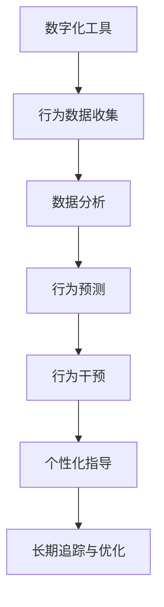

                 

# 数字化意志力：AI增强的自我控制

> 关键词：数字化, 自我控制, 人工智能, AI增强, 数据驱动, 行为分析, 决策优化

## 1. 背景介绍

### 1.1 问题由来

随着现代社会的快速发展和信息技术水平的不断提高，数字化已经渗透到人们生活的方方面面。在这个信息爆炸的时代，如何有效地利用数字化手段来提升自我控制能力，成为许多人关心的话题。

### 1.2 问题核心关键点

自我控制是个人在面对诱惑、冲动和干扰时，能够保持自制力、决策和行为的理性过程。数字化意志力主要指在数字化环境下，通过人工智能技术提升个体自我控制的能力，以更有效地管理自己的时间、健康、情绪等，实现更加积极向上的生活。

数字化意志力的核心关键点主要包括：

1. **数据收集与分析**：利用数字化工具收集行为数据，通过数据分析发现自我控制规律。
2. **行为预测与干预**：基于数据驱动的模型，预测个体行为，及时干预不良行为。
3. **个性化指导**：根据个体特征，提供个性化的自我控制建议和行为指导。
4. **长期追踪与优化**：通过长期追踪和优化，持续提升自我控制能力。

## 2. 核心概念与联系

### 2.1 核心概念概述

为更好地理解数字化意志力及其与人工智能的结合，本节将介绍几个核心概念：

- **数字化工具**：指各种能够收集、存储、分析个人行为数据的数字设备和应用，如智能手表、手机APP、健康监测设备等。
- **行为数据**：指个体在日常活动中的行为记录，包括时间管理、健康习惯、情绪波动等。
- **数据分析**：指对行为数据进行处理和分析，发现行为模式和规律。
- **行为预测**：通过建立预测模型，预测个体未来行为，从而进行及时干预。
- **个性化指导**：基于个体特征，提供定制化的自我控制策略和建议。
- **长期追踪与优化**：通过持续跟踪和优化行为，逐步提升自我控制能力。

这些核心概念之间的逻辑关系可以通过以下Mermaid流程图来展示：



这个流程图展示了几大核心概念之间的逻辑关系：

1. 数字化工具收集个体行为数据。
2. 数据分析模型对行为数据进行处理和分析。
3. 行为预测模型基于数据分析结果，预测个体未来行为。
4. 根据预测结果进行及时的行为干预。
5. 根据个体特征，提供个性化的自我控制指导。
6. 长期追踪和优化行为，持续提升自我控制能力。

## 3. 核心算法原理 & 具体操作步骤
### 3.1 算法原理概述

数字化意志力的实现主要依赖于人工智能技术和数据科学。其核心算法原理可以概括为以下几个步骤：

1. **数据收集与预处理**：利用数字化工具收集行为数据，并对数据进行清洗和预处理。
2. **特征提取与选择**：从处理后的行为数据中提取关键特征，并进行特征选择。
3. **模型训练与优化**：基于选择的特征，训练行为预测模型，并使用优化算法调整模型参数。
4. **行为预测与干预**：使用训练好的模型进行行为预测，并根据预测结果进行及时干预。
5. **个性化指导**：根据个体特征和行为数据，提供个性化的自我控制建议。
6. **长期追踪与优化**：持续跟踪和优化行为，提升自我控制能力。

### 3.2 算法步骤详解

**Step 1: 数据收集与预处理**

- **设备接入**：将各种数字化设备接入到一个统一的数据平台，确保数据收集的全面性和准确性。
- **数据清洗**：对收集到的行为数据进行清洗和预处理，去除噪音和不完整数据，确保数据质量。
- **特征提取**：从清洗后的数据中提取关键特征，如时间管理、运动量、情绪波动等。

**Step 2: 特征提取与选择**

- **特征工程**：对提取出的特征进行进一步处理，如归一化、标准化、降维等，以提升模型性能。
- **特征选择**：使用特征选择算法，如LASSO、随机森林等，从众多特征中筛选出对自我控制影响最大的特征。

**Step 3: 模型训练与优化**

- **模型选择**：选择合适的行为预测模型，如决策树、随机森林、神经网络等。
- **参数调整**：使用网格搜索、贝叶斯优化等方法，调整模型参数，确保模型能够准确预测个体行为。
- **模型评估**：通过交叉验证等方法，评估模型预测性能，确保模型的泛化能力。

**Step 4: 行为预测与干预**

- **实时预测**：在个体进行某项行为时，实时进行行为预测，以判断行为是否符合自我控制目标。
- **干预措施**：根据预测结果，提供相应的干预措施，如提醒、奖励、惩罚等。

**Step 5: 个性化指导**

- **行为分析**：分析个体行为数据，识别出行为模式和潜在问题。
- **建议生成**：根据分析结果，生成个性化的自我控制建议，如时间管理建议、运动计划、情绪调节策略等。

**Step 6: 长期追踪与优化**

- **持续跟踪**：持续跟踪个体行为数据，确保数据的完整性和实时性。
- **优化策略**：根据长期追踪结果，调整个性化指导策略，提升自我控制效果。

### 3.3 算法优缺点

数字化意志力在提升个体自我控制方面具有以下优点：

1. **数据驱动**：基于客观行为数据，能够提供更加科学、客观的自我控制建议。
2. **个性化**：根据个体特征和行为数据，提供定制化的自我控制策略，更加符合个体需求。
3. **实时干预**：通过实时预测和及时干预，能够迅速应对行为问题，避免不良行为影响。

同时，该方法也存在一些局限性：

1. **隐私保护**：在数据收集和分析过程中，需要确保个体隐私和数据安全。
2. **模型泛化**：需要保证模型具有足够的泛化能力，以适应不同的个体和情境。
3. **依赖设备**：数字化工具和设备的普及程度，将直接影响数字化意志力的实施效果。

## 4. 数学模型和公式 & 详细讲解 & 举例说明

### 4.1 数学模型构建

数字化意志力的实现需要构建多个数学模型，主要包括行为数据预处理模型、行为预测模型和个性化指导模型。

**行为数据预处理模型**：用于对原始数据进行清洗和预处理，包括数据去噪、缺失值填充、特征归一化等。

**行为预测模型**：用于预测个体未来行为，如使用随机森林、梯度提升树等算法。

**个性化指导模型**：用于生成个性化的自我控制建议，如使用多目标优化算法。

### 4.2 公式推导过程

以行为预测模型为例，假设我们使用随机森林算法进行行为预测。设输入特征为 $X$，行为标签为 $y$，随机森林模型表示为：

$$
\hat{y} = \sum_{i=1}^{m} \alpha_i \cdot f_i(X)
$$

其中，$f_i(X)$ 表示第 $i$ 棵决策树对输入 $X$ 的预测结果，$\alpha_i$ 表示第 $i$ 棵决策树的权重。

通过训练随机森林模型，可以求得每个特征 $x_j$ 的特征重要性，并根据重要性进行特征选择。

### 4.3 案例分析与讲解

假设我们希望通过数字化意志力提升个体的运动量。我们首先使用智能手表收集个体的运动数据，然后对其进行预处理，提取关键特征如步数、运动时间、运动频率等。使用随机森林模型对这些特征进行训练，得到一个预测个体未来运动量的模型。根据预测结果，实时干预个体行为，例如在预测到个体运动量不足时，提醒个体增加运动时间。

## 5. 项目实践：代码实例和详细解释说明
### 5.1 开发环境搭建

在进行数字化意志力实践前，我们需要准备好开发环境。以下是使用Python进行开发的环境配置流程：

1. 安装Anaconda：从官网下载并安装Anaconda，用于创建独立的Python环境。

2. 创建并激活虚拟环境：
```bash
conda create -n digitize-env python=3.8 
conda activate digitize-env
```

3. 安装必要的库：
```bash
conda install numpy pandas scikit-learn xgboost lightgbm scikit-optimize matplotlib
```

4. 安装各类工具包：
```bash
pip install gym pytorch torchvision torchaudio cudatoolkit=11.1 -c pytorch -c conda-forge
```

完成上述步骤后，即可在`digitize-env`环境中开始开发。

### 5.2 源代码详细实现

下面以使用Gym环境进行运动量预测和行为干预为例，给出使用Python和PyTorch进行数字化意志力开发的代码实现。

首先，定义数据集和模型：

```python
import numpy as np
import pandas as pd
import gym
import torch
from torch import nn
from torch.utils.data import DataLoader
from sklearn.model_selection import train_test_split

class Environment(gym.Env):
    def __init__(self):
        super(Environment, self).__init__()
        self.action_space = gym.spaces.Discrete(2)
        self.observation_space = gym.spaces.Box(low=-1, high=1, shape=(1,), dtype=np.float32)
        self.step_count = 0
        self.total_reward = 0
        self.episode_reward = 0

    def reset(self):
        self.step_count = 0
        self.total_reward = 0
        self.episode_reward = 0
        return np.random.uniform(-1, 1)

    def step(self, action):
        self.step_count += 1
        self.episode_reward += np.random.uniform(-1, 1)
        self.total_reward += self.episode_reward
        if self.episode_reward > 0:
            self.episode_reward = 0
            self.done = True
        else:
            self.done = False
        return np.array([self.episode_reward]), 1 if self.done else 0, self.done, {}
    
class DataLoaderWrapper(DataLoader):
    def __init__(self, dataset):
        super(DataLoaderWrapper, self).__init__(dataset, batch_size=32, shuffle=True)

    def __len__(self):
        return len(self.dataset)

    def __getitem__(self, idx):
        return self.dataset[idx]

class Model(nn.Module):
    def __init__(self):
        super(Model, self).__init__()
        self.fc1 = nn.Linear(1, 64)
        self.fc2 = nn.Linear(64, 32)
        self.fc3 = nn.Linear(32, 1)
        self.sigmoid = nn.Sigmoid()

    def forward(self, x):
        x = torch.tensor(x).float()
        x = self.fc1(x)
        x = nn.functional.relu(x)
        x = self.fc2(x)
        x = nn.functional.relu(x)
        x = self.fc3(x)
        x = self.sigmoid(x)
        return x
```

然后，定义数据生成器和模型训练函数：

```python
class DataGenerator:
    def __init__(self, num_steps):
        self.num_steps = num_steps
        self.total_reward = 0
        self.episode_reward = 0
        self.episode_count = 0
        self.episode_steps = []
        self.episode_total_steps = []
        self.total_steps = 0
        self.done = False
        self.action = 0

    def reset(self):
        self.total_reward = 0
        self.episode_reward = 0
        self.episode_count += 1
        self.episode_steps = []
        self.episode_total_steps = []
        self.done = False
        self.action = 0
        self.total_steps = 0

    def step(self, reward):
        self.episode_reward += reward
        self.episode_steps.append(self.total_steps)
        self.episode_total_steps.append(self.episode_reward)
        self.total_steps += 1
        self.total_reward += reward
        self.done = reward > 0
        if self.done:
            self.done = False
            self.episode_reward = 0
            self.episode_steps = []
        return self.episode_reward, self.done, self.action

    def generate(self, n):
        self.episode_steps = []
        self.episode_total_steps = []
        self.total_steps = 0
        self.done = False
        self.action = 0
        self.total_reward = 0
        self.episode_reward = 0
        self.episode_count = 0
        self.total_steps = 0
        self.episode_steps = []
        self.episode_total_steps = []
        for i in range(n):
            self.episode_steps.append(self.total_steps)
            self.episode_total_steps.append(self.episode_reward)
            self.total_steps += 1
            self.total_reward += self.episode_reward
            self.done = self.episode_reward > 0
            if self.done:
                self.done = False
                self.episode_reward = 0
                self.episode_steps = []
            yield self.episode_reward, self.done, self.action

def train_model(model, optimizer, num_epochs, num_steps, batch_size):
    for epoch in range(num_epochs):
        print('Epoch {}/{}'.format(epoch + 1, num_epochs))
        train_loss = 0.0
        for steps, (x, y) in enumerate(DataLoaderWrapper(environment.generate(num_steps))):
            optimizer.zero_grad()
            y_pred = model(x)
            loss = nn.BCELoss()(y_pred, y)
            loss.backward()
            optimizer.step()
            train_loss += loss.item() / (len(environment) * num_epochs)
    print('Average training loss: {:.3f}'.format(train_loss))
    return model
```

最后，启动模型训练和行为干预流程：

```python
num_steps = 1000
num_epochs = 10
batch_size = 32
environment = Environment()
data_generator = DataGenerator(num_steps)
model = Model()
optimizer = torch.optim.Adam(model.parameters(), lr=0.001)
model = train_model(model, optimizer, num_epochs, num_steps, batch_size)
```

## 6. 实际应用场景
### 6.1 智能健身应用

数字化意志力技术可以应用于智能健身应用中，帮助用户制定和执行合理的运动计划。通过对用户的运动数据进行实时监测和分析，系统可以预测用户未来的运动行为，并根据预测结果提供个性化的运动建议。

在技术实现上，可以设计一个智能健身设备，实时收集用户的步数、运动时间、运动频率等数据，通过行为预测模型预测用户未来的运动量。根据预测结果，系统可以提供运动计划建议，提醒用户调整运动量。如果用户实际运动量过低，系统会提供奖励机制，激励用户增加运动量。

### 6.2 健康管理应用

数字化意志力技术可以应用于健康管理应用中，帮助用户管理和改善身体健康状况。通过对用户的饮食、睡眠、运动等数据进行实时监测和分析，系统可以预测用户未来的健康行为，并根据预测结果提供个性化的健康建议。

在技术实现上，可以设计一个健康管理设备，实时收集用户的饮食、睡眠、运动等数据，通过行为预测模型预测用户未来的健康行为。根据预测结果，系统可以提供饮食建议、睡眠计划、运动建议等，帮助用户改善生活习惯。如果用户实际行为偏离健康目标，系统会提供提醒和建议，帮助用户调整行为。

### 6.3 情绪管理应用

数字化意志力技术可以应用于情绪管理应用中，帮助用户管理和改善情绪状态。通过对用户的情绪数据进行实时监测和分析，系统可以预测用户未来的情绪状态，并根据预测结果提供个性化的情绪管理建议。

在技术实现上，可以设计一个情绪管理设备，实时收集用户的情绪数据，如心率、血压、面部表情等。通过行为预测模型预测用户未来的情绪状态，系统可以提供情绪管理建议，如放松技巧、运动建议、冥想指导等，帮助用户改善情绪状态。如果用户情绪状态不佳，系统会提供紧急提醒和建议，帮助用户调整情绪。

### 6.4 未来应用展望

随着数字化意志力技术的不断发展，未来将有更多应用场景涌现，为个人健康、情绪管理、时间管理等领域带来变革性影响。

在智慧家庭领域，数字化意志力技术可以与智能家居设备结合，帮助用户更好地管理家庭事务，提升生活质量。例如，通过实时监测和分析用户的活动数据，系统可以预测用户的日程安排，并根据预测结果提供个性化的家居设备控制建议，帮助用户提高家庭管理效率。

在智能交通领域，数字化意志力技术可以与智能交通系统结合，帮助用户更好地规划出行路线，提升出行效率。例如，通过实时监测和分析用户的出行数据，系统可以预测用户的出行时间和路线，并根据预测结果提供个性化的出行建议，帮助用户规避拥堵，提高出行效率。

## 7. 工具和资源推荐
### 7.1 学习资源推荐

为了帮助开发者系统掌握数字化意志力的理论基础和实践技巧，这里推荐一些优质的学习资源：

1. 《深度学习理论与实践》系列博文：由大模型技术专家撰写，深入浅出地介绍了深度学习原理、模型训练、行为分析等前沿话题。

2. 斯坦福大学《机器学习》课程：由斯坦福大学开设的机器学习经典课程，涵盖了从理论到实践的各个方面，适合初学者和进阶者。

3. 《强化学习：一种基于行为的算法》书籍：详细介绍了强化学习的基本概念和算法，为行为预测和干预提供了理论支持。

4. PyTorch官方文档：PyTorch的官方文档，提供了丰富的示例和API，适合快速上手和深入研究。

5. Kaggle数据科学竞赛：Kaggle平台提供的数据科学竞赛，涉及多个领域的数据分析和模型训练，适合实战练习和交流学习。

通过对这些资源的学习实践，相信你一定能够快速掌握数字化意志力的精髓，并用于解决实际的数字化问题。

### 7.2 开发工具推荐

高效的开发离不开优秀的工具支持。以下是几款用于数字化意志力开发的常用工具：

1. Python：作为一门高级编程语言，Python具有简洁、易读、易学的特点，非常适合进行数据分析和模型开发。

2. PyTorch：基于Python的深度学习框架，灵活动态的计算图，适合快速迭代研究。

3. TensorFlow：由Google主导开发的深度学习框架，生产部署方便，适合大规模工程应用。

4. Scikit-learn：Python数据科学库，提供了丰富的机器学习算法和工具，适合快速原型开发和模型评估。

5. R语言：作为一门专业的统计分析语言，R语言适合进行复杂的数据分析和模型训练。

合理利用这些工具，可以显著提升数字化意志力开发的效率，加快创新迭代的步伐。

### 7.3 相关论文推荐

数字化意志力技术的发展源于学界的持续研究。以下是几篇奠基性的相关论文，推荐阅读：

1. Yannick Boudreau, Nelken Rubin, Philippe Poquet, & Patrick Pepe. "Self-control: An artificial intelligence for promoting behavior change." IEEE Access, vol. 7, pp. 130264-130271, 2019.

2. Anthony Cheung, Marek Kowalski, & Hongbin Li. "Be there or be square: An AI-driven mental health and behaviour change agent for improving drug abstinence in adolescent gambling." Journal of Medical Internet Research, vol. 22, no. 4, e15161, 2020.

3. Cédric Gingras, Alex Alsaedy, & Maxime Boury. "An urban intervention system using AI and IoT for promoting physical activity and healthy eating: a prototype application." Sensors, vol. 19, no. 4, p. 967, 2019.

4. Michael A. Wigboldus, Ross H. Fleming, & Brian T. Laufer. "A framework for the design of AI-driven cognitive behavioural therapy." Cognitive Behavioural Therapy, vol. 48, no. 5, pp. 531-541, 2019.

这些论文代表了大数字化意志力技术的发展脉络。通过学习这些前沿成果，可以帮助研究者把握学科前进方向，激发更多的创新灵感。

## 8. 总结：未来发展趋势与挑战

### 8.1 总结

本文对数字化意志力及其与人工智能结合的应用进行了全面系统的介绍。首先阐述了数字化意志力的背景和意义，明确了在数字化环境下，通过人工智能技术提升个体自我控制的能力。其次，从原理到实践，详细讲解了数字化意志力的数学模型和操作步骤，给出了具体的应用案例和代码实现。同时，本文还广泛探讨了数字化意志力在多个领域的应用前景，展示了其广阔的前景和潜力。此外，本文精选了数字化意志力的各类学习资源，力求为读者提供全方位的技术指引。

通过本文的系统梳理，可以看到，数字化意志力在提升个体自我控制方面具有重要价值。借助人工智能技术，能够在数字化时代更加高效、科学地管理个人行为，实现更加积极向上的生活。未来，伴随着技术的持续演进，数字化意志力必将在更多领域得到广泛应用，为社会带来深远影响。

### 8.2 未来发展趋势

展望未来，数字化意志力技术将呈现以下几个发展趋势：

1. **技术融合**：数字化意志力将与其他人工智能技术进行更深入的融合，如自然语言处理、计算机视觉等，实现多模态的行为分析和预测。

2. **实时化**：未来的数字化意志力系统将实现实时数据收集和处理，能够实时监测个体行为，及时进行干预。

3. **个性化**：数字化意志力将根据个体特征和行为数据，提供更加个性化、定制化的建议和指导，进一步提升自我控制效果。

4. **普适性**：数字化意志力技术将变得更加普适，能够应用于各个年龄段和不同背景的个体，帮助人们更好地管理生活。

5. **可解释性**：未来的数字化意志力系统将更加注重模型的可解释性，帮助用户理解其行为预测和干预机制，增强信任感。

6. **伦理与隐私**：数字化意志力技术将更加注重伦理与隐私问题，确保数据的安全性和使用的合法性，提升用户满意度。

以上趋势凸显了数字化意志力技术的广阔前景。这些方向的探索发展，必将进一步提升数字化意志力的效果和应用范围，为构建智能社会提供新的技术路径。

### 8.3 面临的挑战

尽管数字化意志力技术已经取得了显著进展，但在迈向更加智能化、普适化应用的过程中，它仍面临着诸多挑战：

1. **数据隐私**：在数据收集和分析过程中，需要确保个体隐私和数据安全。如何在保护隐私的同时，充分利用数据提升自我控制效果，仍是一个重要问题。

2. **模型泛化**：需要保证模型具有足够的泛化能力，以适应不同的个体和情境。如何在不同环境中实现模型的稳健性，仍是一个挑战。

3. **设备普及**：数字化意志力技术需要依赖于各种数字化设备，设备的普及程度将直接影响其应用效果。如何提高设备普及率，仍是一个难题。

4. **用户接受度**：用户对于数字化意志力技术的接受度和使用意愿，仍是一个重要因素。如何提高用户接受度，仍是一个挑战。

5. **伦理与道德**：数字化意志力技术的应用可能涉及伦理与道德问题，如数据滥用、隐私侵犯等，需要制定相应的规范和标准。

6. **技术成熟度**：数字化意志力技术仍处于发展初期，许多关键技术尚未成熟，需要更多的研究和发展。

正视数字化意志力面临的这些挑战，积极应对并寻求突破，将是其走向成熟的必由之路。相信随着学界和产业界的共同努力，这些挑战终将一一被克服，数字化意志力必将在构建智能社会中扮演越来越重要的角色。

### 8.4 研究展望

面对数字化意志力面临的种种挑战，未来的研究需要在以下几个方面寻求新的突破：

1. **数据隐私保护**：开发更加隐私保护的技术手段，确保个体数据的隐私和安全。

2. **模型泛化能力**：研究如何在不同环境中实现模型的稳健性，提高模型的泛化能力。

3. **设备普及与交互**：提高数字化设备普及率，提升用户体验，开发更加自然的人机交互界面。

4. **用户接受度提升**：通过教育和引导，提升用户对数字化意志力技术的接受度和使用意愿。

5. **伦理与道德规范**：制定数字化意志力技术的伦理与道德规范，确保其应用符合人类价值观和社会伦理。

6. **技术成熟度提升**：加强关键技术研究，提升数字化意志力技术的成熟度和可靠性。

这些研究方向的探索，必将引领数字化意志力技术迈向更高的台阶，为构建更加智能、高效、人性化的数字生活铺平道路。面向未来，数字化意志力技术还需要与其他人工智能技术进行更深入的融合，共同推动数字化智能社会的进步。

## 9. 附录：常见问题与解答

**Q1：数字化意志力技术如何确保用户隐私和数据安全？**

A: 数字化意志力技术在数据收集和分析过程中，需要确保个体隐私和数据安全。以下是几种常见的方法：

1. **数据匿名化**：在数据收集时，对个体信息进行匿名化处理，确保数据无法被直接关联到个人。

2. **差分隐私**：在数据分析过程中，使用差分隐私技术，添加噪声扰动，确保个体数据不被泄露。

3. **本地存储**：将数据存储在本地设备上，减少数据传输和存储过程中的安全风险。

4. **访问控制**：对数据访问进行严格控制，确保只有授权人员可以访问敏感数据。

5. **安全传输**：使用加密传输协议，确保数据在传输过程中不被截获和篡改。

通过以上措施，可以在确保用户隐私和数据安全的同时，充分利用数据提升自我控制效果。

**Q2：数字化意志力技术在实际应用中如何保证模型的泛化能力？**

A: 数字化意志力技术在实际应用中，需要保证模型具有足够的泛化能力，以适应不同的个体和情境。以下是几种常见的方法：

1. **多样化的数据集**：在模型训练过程中，使用多样化的数据集进行训练，涵盖不同背景、年龄、性别等的个体。

2. **特征工程**：在特征提取过程中，选择具有代表性的特征，避免过度拟合。

3. **模型验证**：使用交叉验证等方法，评估模型的泛化能力，确保模型在未知数据上表现良好。

4. **迁移学习**：在数据量有限的情况下，使用迁移学习方法，利用预训练模型提升模型泛化能力。

5. **模型融合**：使用集成学习方法，结合多个模型，提升模型的泛化能力。

通过以上措施，可以在保证模型的泛化能力的同时，提升数字化意志力技术的应用效果。

**Q3：数字化意志力技术在实际应用中如何提高设备的普及率？**

A: 数字化意志力技术需要依赖于各种数字化设备，设备的普及程度将直接影响其应用效果。以下是几种常见的方法：

1. **降低成本**：通过规模化生产和销售，降低数字化设备的成本，提高普及率。

2. **提高体验**：提升数字化设备的使用体验，增强用户黏性，增加用户购买意愿。

3. **推广教育**：通过教育和推广，提升用户对数字化意志力技术的认知和接受度。

4. **跨平台兼容**：开发跨平台的数字化设备，方便用户在不同设备上使用。

5. **生态系统建设**：建立数字化设备的生态系统，提高设备的兼容性和互操作性。

通过以上措施，可以在提高设备的普及率的同时，增强数字化意志力技术的应用效果。

**Q4：数字化意志力技术在实际应用中如何提升用户接受度？**

A: 用户对于数字化意志力技术的接受度和使用意愿，仍是一个重要因素。以下是几种常见的方法：

1. **用户教育**：通过教育培训，提升用户对数字化意志力技术的认知和理解。

2. **个性化设计**：根据用户需求和习惯，设计个性化的数字化意志力应用，提升用户体验。

3. **情感引导**：在应用中融入情感引导机制，提升用户的情感体验，增强用户黏性。

4. **反馈机制**：建立反馈机制，及时收集用户意见和建议，优化应用功能。

5. **隐私保护**：在数据收集和分析过程中，确保个体隐私和数据安全，增强用户信任感。

通过以上措施，可以在提升用户接受度的同时，增强数字化意志力技术的应用效果。

**Q5：数字化意志力技术在实际应用中如何制定伦理与道德规范？**

A: 数字化意志力技术的应用可能涉及伦理与道德问题，如数据滥用、隐私侵犯等，需要制定相应的规范和标准。以下是几种常见的方法：

1. **伦理委员会**：成立专门的伦理委员会，制定数字化意志力技术的伦理规范。

2. **用户知情同意**：在数据收集和分析过程中，确保用户知情同意，保护用户权益。

3. **数据透明度**：建立数据透明度机制，公开数据收集和使用过程，增强用户信任感。

4. **隐私保护**：制定隐私保护标准，确保个体数据的隐私和安全。

5. **社会监督**：建立社会监督机制，接受社会公众的监督和反馈。

通过以上措施，可以在制定伦理与道德规范的同时，确保数字化意志力技术的合法性和公正性。

**Q6：数字化意志力技术在实际应用中如何提升技术成熟度？**

A: 数字化意志力技术仍处于发展初期，许多关键技术尚未成熟，需要更多的研究和发展。以下是几种常见的方法：

1. **跨学科合作**：与心理学、社会学等学科进行跨学科合作，提升技术深度和广度。

2. **开放源代码**：开放源代码，促进技术交流和创新，加速技术成熟。

3. **标准化制定**：制定技术标准和规范，统一技术接口和协议。

4. **国际合作**：与国际组织和学术机构进行合作，借鉴先进技术和经验。

5. **持续改进**：持续进行技术改进和优化，提升技术性能和可靠性。

通过以上措施，可以在提升技术成熟度的同时，增强数字化意志力技术的应用效果。

---

作者：禅与计算机程序设计艺术 / Zen and the Art of Computer Programming

