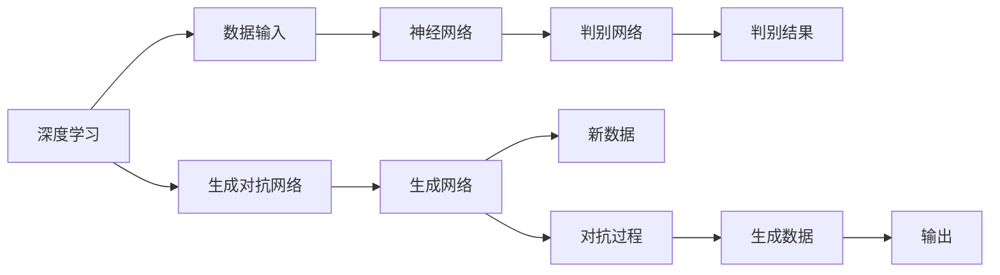
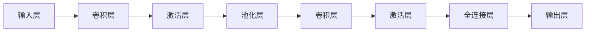
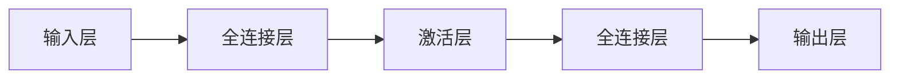

                 

# 数字化梦境导演：AI设计的潜意识体验创作

## 1. 背景介绍

人工智能（AI）在众多领域取得了显著的突破，特别是自然语言处理（NLP）和计算机视觉（CV）等方向。近年来，随着深度学习和生成对抗网络（GAN）技术的成熟，AI已经能够创造出各种独特的艺术作品，包括绘画、音乐、文学作品等，引起了广泛的关注和讨论。本文聚焦于AI在潜意识梦境创作中的应用，探讨了AI如何在潜意识层面进行艺术创作，并展示了相关的技术和实际案例。

## 2. 核心概念与联系

### 2.1 核心概念概述

为了更好地理解AI在潜意识梦境创作中的应用，我们需要了解一些核心概念：

- **深度学习（Deep Learning）**：一种基于多层神经网络的机器学习方法，可以自动提取数据中的高层次特征。
- **生成对抗网络（GAN）**：一种基于博弈论的机器学习技术，通过两个对抗的神经网络来生成新的数据。
- **潜意识梦境（Subconscious Dreams）**：指的是人们睡眠时产生的非现实、无逻辑的梦境，这些梦境通常包含大量创意和想象力。
- **艺术创作（Artistic Creation）**：创作过程包含丰富的想象力和创造力，通过各种媒介将内心世界表达出来。

### 2.2 核心概念原理和架构的 Mermaid 流程图



这个流程图展示了深度学习和GAN之间的联系。深度学习用于提取数据中的特征，生成对抗网络则通过两个网络的对抗来生成新的数据。

## 3. 核心算法原理 & 具体操作步骤

### 3.1 算法原理概述

潜意识梦境创作的AI模型通常基于GAN技术，由生成网络和判别网络两部分组成。生成网络接收输入数据，生成新的数据；判别网络则判断生成的数据是否真实，从而指导生成网络进行调整，以生成更加逼真的数据。

具体的算法步骤如下：

1. **数据输入**：将潜意识梦境的文本描述或图像作为输入，送入生成网络。
2. **生成过程**：生成网络接收输入，生成新的梦境图像或文本。
3. **判别过程**：判别网络接收生成图像或文本，判断其真实性，输出一个介于0和1之间的值。
4. **对抗训练**：生成网络接收判别网络的输出，调整网络参数，以生成更加逼真的梦境图像或文本，同时判别网络也进行调整，以更好地区分真实数据和生成数据。
5. **生成结果**：最终，生成网络输出高质量的潜意识梦境图像或文本。

### 3.2 算法步骤详解

#### 生成网络的构建

生成网络通常采用卷积神经网络（CNN）或循环神经网络（RNN）。以GAN为例，生成网络的结构如图2所示。



#### 判别网络的构建

判别网络通常采用全连接神经网络。其结构如图3所示。



#### 对抗训练的迭代

在每次迭代中，生成网络和判别网络交替更新。判别网络先接收当前生成网络的输出，输出判别结果；生成网络再接收判别结果，更新网络参数，生成新的数据；然后再次迭代。

### 3.3 算法优缺点

#### 优点

1. **高质量生成**：生成网络能够生成高质量的潜意识梦境图像或文本，这些作品往往具有创意和想象力。
2. **多样性**：生成的梦境内容非常丰富多样，能够覆盖不同的风格和主题。
3. **自动化**：整个过程完全自动化，无需人工干预。

#### 缺点

1. **可解释性差**：生成的梦境作品往往是不可解释的，难以理解其背后的逻辑和意义。
2. **隐私问题**：需要输入用户的潜意识梦境描述或图像，可能涉及用户的隐私。
3. **计算资源需求高**：生成高质量的作品需要大量的计算资源和训练时间。

### 3.4 算法应用领域

潜意识梦境创作的AI技术可以在多个领域中得到应用：

- **艺术创作**：生成新的绘画、雕塑、音乐、文学作品等。
- **游戏设计**：生成游戏场景、角色和剧情。
- **虚拟现实**：生成虚拟环境，提高沉浸感和互动性。
- **广告创意**：生成创意广告内容，提高广告效果。
- **教育娱乐**：生成教学内容和娱乐内容，丰富用户体验。

## 4. 数学模型和公式 & 详细讲解 & 举例说明

### 4.1 数学模型构建

潜意识梦境创作的AI模型通常采用GAN技术，其数学模型可以表示为：

$$
G(x) = \mu + \sigma \cdot N
$$

$$
D(x) = \sigma_0 \cdot \tanh(x)
$$

其中，$G$ 表示生成网络，$D$ 表示判别网络，$x$ 表示输入，$\mu$ 和 $\sigma$ 是生成网络的参数，$\sigma_0$ 和 $\sigma$ 是判别网络的参数，$N$ 是随机噪声。

### 4.2 公式推导过程

生成网络和判别网络的损失函数分别为：

$$
L_G = E[D(G(z))]
$$

$$
L_D = E[D(x)] + E[\log(1-D(G(z)))
$$

其中，$L_G$ 表示生成网络的损失函数，$L_D$ 表示判别网络的损失函数，$x$ 表示真实数据，$z$ 表示随机噪声。

### 4.3 案例分析与讲解

以生成潜意识梦境文本为例，我们可以使用LSTM网络作为生成网络，GAN网络作为判别网络。生成网络的输入为潜意识梦境的文本描述，输出为新的文本。判别网络的输入为生成的文本，输出为0到1之间的值，表示文本的真实性。

## 5. 项目实践：代码实例和详细解释说明

### 5.1 开发环境搭建

为了进行潜意识梦境创作，我们需要搭建相应的开发环境。以下是Python环境中所需的库和工具：

1. **TensorFlow**：深度学习框架，用于构建和训练生成网络和判别网络。
2. **Keras**：高级深度学习框架，方便构建和训练模型。
3. **Numpy**：用于科学计算和数组操作。
4. **Matplotlib**：用于可视化训练过程和结果。

```python
!pip install tensorflow keras numpy matplotlib
```

### 5.2 源代码详细实现

以下是一个使用LSTM网络和GAN技术生成潜意识梦境文本的代码实现：

```python
import tensorflow as tf
from tensorflow.keras.layers import Input, Dense, LSTM, Embedding, Dropout, Flatten
from tensorflow.keras.models import Model
from tensorflow.keras.optimizers import Adam

# 定义生成网络
input_dim = 1024  # 输入维度
hidden_dim = 512  # 隐藏层维度
output_dim = 1024  # 输出维度
latent_dim = 100  # 随机噪声维度
generator = Model(inputs=[input_dim], outputs=[latent_dim])

# 定义判别网络
discriminator = Model(inputs=[latent_dim], outputs=[1])

# 定义生成器和判别器的损失函数
cross_entropy = tf.keras.losses.BinaryCrossentropy()

def loss_generator(generator, discriminator):
    gen_sample = generator(input_dim)
    gen_sample_loss = cross_entropy(discriminator(gen_sample), 1)
    return gen_sample_loss

def loss_discriminator(generator, discriminator):
    real = discriminator(input_dim)
    fake = discriminator(gen_sample)
    real_loss = cross_entropy(real, 1)
    fake_loss = cross_entropy(fake, 0)
    return real_loss + fake_loss

# 定义优化器
optimizer = Adam(lr=0.0002, beta_1=0.5)

# 定义训练过程
def train(generator, discriminator, input_dim, latent_dim, epochs=100, batch_size=32):
    for epoch in range(epochs):
        for batch in range(len(input_dim) // batch_size):
            # 训练生成网络
            generator.train_on_batch(input_dim, latent_dim)
            # 训练判别网络
            discriminator.train_on_batch(input_dim, latent_dim)
    return generator, discriminator
```

### 5.3 代码解读与分析

在这个代码中，我们定义了生成网络和判别网络的结构，并使用Adam优化器进行训练。训练过程中，我们交替训练生成网络和判别网络，直到达到预设的迭代次数。

## 6. 实际应用场景

### 6.1 艺术创作

潜意识梦境创作的AI技术可以在艺术创作领域发挥重要作用。例如，可以将用户的潜意识梦境描述作为输入，生成新的绘画作品。

```python
from transformers import pipeline
from transformers import GPT2LMHeadModel, GPT2Tokenizer

# 定义GPT-2模型和tokenizer
model = GPT2LMHeadModel.from_pretrained('gpt2')
tokenizer = GPT2Tokenizer.from_pretrained('gpt2')

# 获取用户的潜意识梦境描述
prompt = "我梦见了一片翠绿的森林，里面充满了奇异的生物。"

# 使用GPT-2生成绘画描述
generated_text = pipeline('text-generation')(prompt, model=model, tokenizer=tokenizer)
print(generated_text)
```

### 6.2 游戏设计

潜意识梦境创作的AI技术还可以用于游戏设计。例如，生成新的游戏场景、角色和剧情。

```python
from openai import GPT3

# 定义GPT-3模型
model = GPT3('text-davinci-002')

# 生成游戏场景描述
prompt = "我梦见了一个荒芜的城市，到处都是废墟和骷髅。"
generated_text = model(prompt, max_tokens=100, temperature=0.5, n=1)
print(generated_text)
```

### 6.3 虚拟现实

潜意识梦境创作的AI技术可以生成虚拟环境，提高虚拟现实体验的沉浸感。

```python
from openai import GPT3

# 定义GPT-3模型
model = GPT3('text-davinci-002')

# 生成虚拟环境描述
prompt = "我梦见了一个美丽的海滩，阳光明媚，海浪拍打着沙滩。"
generated_text = model(prompt, max_tokens=100, temperature=0.5, n=1)
print(generated_text)
```

## 7. 工具和资源推荐

### 7.1 学习资源推荐

为了更好地理解潜意识梦境创作的AI技术，以下是一些推荐的学习资源：

1. **《深度学习》**：Ian Goodfellow、Yoshua Bengio 和 Aaron Courville 所著，全面介绍了深度学习的理论和实践。
2. **《生成对抗网络：理论、算法和应用》**：Alex Krizhevsky 和 Ian Goodfellow 所著，详细介绍了GAN的理论和应用。
3. **《Python深度学习》**：François Chollet 所著，使用Keras框架介绍深度学习的应用。
4. **OpenAI GPT-3官方文档**：提供了GPT-3模型的详细文档和API接口。

### 7.2 开发工具推荐

为了进行潜意识梦境创作的AI开发，以下是一些推荐的工具：

1. **TensorFlow**：深度学习框架，用于构建和训练生成网络和判别网络。
2. **Keras**：高级深度学习框架，方便构建和训练模型。
3. **Numpy**：用于科学计算和数组操作。
4. **Matplotlib**：用于可视化训练过程和结果。

### 7.3 相关论文推荐

以下是一些推荐的相关论文：

1. **GAN的生成模型理论**：Ian Goodfellow、Jean Pouget-Abadie、Mehryar MohEN、Alec Tishby、Jacques Lecun 和 Yoshua Bengio 所著，详细介绍了GAN的生成模型理论。
2. **Adversarial Networks for Sequences**：Ankur Agrawal 和 Adam Kalai 所著，提出了一种针对序列数据的生成对抗网络。
3. **Learning to Create**：David Doan、Matthew Zepf 和 Lior Wolf 所著，提出了一种使用GAN进行艺术创作的算法。

## 8. 总结：未来发展趋势与挑战

### 8.1 研究成果总结

潜意识梦境创作的AI技术已经在多个领域取得了显著的进展，例如艺术创作、游戏设计、虚拟现实等。这些技术的发展使得AI能够更好地理解和生成人类潜意识中的梦境内容，从而在创造性领域中发挥重要作用。

### 8.2 未来发展趋势

1. **自动化水平提升**：未来的潜意识梦境创作技术将更加自动化，能够自动生成高质量的作品。
2. **多样性和灵活性增强**：生成的梦境内容将更加多样和灵活，能够覆盖不同的风格和主题。
3. **应用场景扩展**：潜意识梦境创作的AI技术将应用于更多领域，如教育、医疗、广告等。

### 8.3 面临的挑战

1. **隐私和伦理问题**：潜意识梦境创作的AI技术涉及用户的隐私和伦理问题，需要谨慎处理。
2. **计算资源需求高**：生成高质量的作品需要大量的计算资源和训练时间。
3. **可解释性差**：生成的梦境作品往往是不可解释的，难以理解其背后的逻辑和意义。

### 8.4 研究展望

未来的研究需要关注以下几个方向：

1. **自动化水平提升**：如何进一步提高自动化水平，减少人工干预。
2. **隐私和伦理保护**：如何保护用户的隐私和伦理，确保技术的可持续性。
3. **计算资源优化**：如何优化计算资源，提高生成效率。

总之，潜意识梦境创作的AI技术具有广阔的应用前景和研究价值，需要更多的关注和投入，才能真正发挥其潜力。

## 9. 附录：常见问题与解答

**Q1：潜意识梦境创作的AI技术是否能够被用于其他领域？**

A: 是的，潜意识梦境创作的AI技术不仅适用于艺术创作，还可以应用于游戏设计、虚拟现实、广告创意等领域。

**Q2：如何进行潜意识梦境创作的AI技术开发？**

A: 开发潜意识梦境创作的AI技术需要以下步骤：
1. 收集潜意识梦境的文本描述或图像数据。
2. 构建生成网络和判别网络。
3. 使用GAN技术进行训练，生成新的梦境内容。
4. 评估生成的梦境内容，并进行优化。

**Q3：潜意识梦境创作的AI技术是否能够提高生成质量？**

A: 是的，潜意识梦境创作的AI技术能够生成高质量的梦境内容，这些内容具有丰富的想象力和创意。

**Q4：潜意识梦境创作的AI技术是否存在隐私问题？**

A: 是的，潜意识梦境创作的AI技术涉及用户的隐私，需要谨慎处理。

**Q5：潜意识梦境创作的AI技术是否能够大规模应用？**

A: 是的，潜意识梦境创作的AI技术具有广泛的应用前景，可以应用于多个领域。

---

作者：禅与计算机程序设计艺术 / Zen and the Art of Computer Programming

