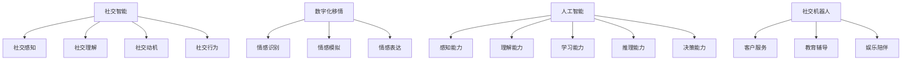

                 

# 数字化移情能力开发：AI增强的社交智能培训

> 关键词：社交智能,数字化移情,人工智能,情感识别,社交机器人,培训模型

## 1. 背景介绍

### 1.1 问题由来

在数字化时代，社交能力的培养和提升变得尤为重要。社交智能不仅关乎个人的人际交往，更是企业团队协作、客户服务、创新管理的关键因素。数字化工具和平台使得社交活动日益线上化，对人的移情能力和社交技巧提出了更高的要求。

然而，传统的社交智能培训方式依赖于面对面的互动和经验积累，难以覆盖所有场景和人群。尤其是在高强度、高频率的职场和公共环境中，人们的社交能力往往跟不上变化的步伐。因此，借助人工智能技术，开发具有数字化移情能力的社交智能培训模型，成为了提升社交能力和工作效率的重要手段。

### 1.2 问题核心关键点

数字化移情能力开发的核心在于结合人工智能技术，构建能够理解、模拟和强化社交技能的培训系统。核心技术点包括：

- **社交智能的理解和建模**：通过数据分析和机器学习算法，理解社交场景中的情感、意图和行为模式。
- **数字化移情模型的训练**：构建能够识别和模拟人类情感的模型，实现情感智能的数字化表达。
- **社交技能的提升与培训**：设计互动式培训课程，使参与者能够在虚拟环境中练习和提升社交技能。
- **效果评估与反馈**：构建效果评估体系，通过量化指标和实时反馈提升培训效果。

### 1.3 问题研究意义

开发数字化移情能力，不仅有助于个人社交技能的提升，更能推动企业团队协作效率的提高，为客户服务质量注入新的活力，从而在职场和公共领域中形成良性循环，促进社会和谐和进步。通过结合AI技术，可以使社交智能培训更加精准、高效、个性化，实现从大规模推广到个性化辅导的转变。

## 2. 核心概念与联系

### 2.1 核心概念概述

为了更好地理解数字化移情能力开发的原理和架构，本节将介绍几个密切相关的核心概念：

- **社交智能(Social Intelligence)**：指个体理解、解读和使用社交信息，以适应各种社交场合的能力。主要包括四个维度：社交感知、社交理解、社交动机和社交行为。
- **数字化移情(Digital Empathy)**：指通过数字化手段，模拟和强化个体对他人的理解和情感响应。数字化移情能力开发的目标是构建能够理解和模拟人类情感的智能系统。
- **人工智能(Artificial Intelligence)**：利用计算机模拟和扩展人类智能的技术，包括感知、理解、学习、推理和决策等能力。
- **情感识别(Emotion Recognition)**：通过计算机视觉、语音识别和自然语言处理技术，从多媒体数据中识别和分析人类情感。
- **社交机器人(Social Robot)**：能够模拟人类社交行为和情感表达的机器人，常用于客户服务、教育辅导、娱乐陪伴等领域。

这些核心概念之间的逻辑关系可以通过以下Mermaid流程图来展示：



这个流程图展示了大语言模型的核心概念及其之间的关系：

1. 社交智能由四个维度构成，是个人和团队协作、客户服务的关键能力。
2. 数字化移情通过模拟和强化社交感知、理解、动机和行为，构建情感智能的数字化表达。
3. 人工智能技术为社交智能和数字化移情提供了强大的技术支持，包括感知、理解、学习、推理和决策等能力。
4. 社交机器人作为数字化移情能力的载体，广泛应用于客户服务、教育辅导和娱乐陪伴等领域。

这些概念共同构成了社交智能培训和数字化移情能力开发的基础，为其提供了技术框架和实现路径。

## 3. 核心算法原理 & 具体操作步骤
### 3.1 算法原理概述

数字化移情能力开发的核心在于利用人工智能技术，构建能够理解、模拟和强化社交技能的系统。其核心思想是：

- 通过社交智能的建模，理解社交场景中的情感、意图和行为模式。
- 利用情感识别技术，从多媒体数据中提取和分析人类情感。
- 构建数字化移情模型，实现情感智能的数字化表达。
- 设计互动式培训课程，通过虚拟环境模拟真实社交场景，提升参与者的社交技能。
- 通过效果评估体系，量化培训效果并进行实时反馈。

形式化地，设社交智能模型为 $S$，情感识别模型为 $E$，数字化移情模型为 $D$，互动式培训课程为 $T$。则整个开发流程可以表示为：

$$
S \xrightarrow{A} E \xrightarrow{B} D \xrightarrow{C} T \xrightarrow{D} S
$$

其中 $A$ 为社交智能建模过程，$B$ 为情感识别过程，$C$ 为数字化移情模型构建，$D$ 为培训课程设计。

### 3.2 算法步骤详解

基于上述原理，数字化移情能力开发的一般流程包括：

**Step 1: 数据收集与预处理**
- 收集社交场景的各类数据，包括文本、语音、视频等多媒体数据。
- 对数据进行清洗、去噪、标注等预处理，准备模型训练的数据集。

**Step 2: 社交智能建模**
- 利用自然语言处理(NLP)技术，构建社交感知、理解、动机和行为等模型。
- 通过情感分析、意图识别等算法，对社交文本和语音数据进行理解。

**Step 3: 情感识别与建模**
- 使用计算机视觉、语音识别和自然语言处理技术，对多媒体数据进行情感分析。
- 构建情感识别模型，从数据中提取情感特征，实现情感智能的数字化表达。

**Step 4: 数字化移情模型构建**
- 利用情感识别结果，构建能够模拟和表达情感的模型。
- 使用强化学习或对抗训练等方法，优化模型的情感表达能力。

**Step 5: 互动式培训课程设计**
- 根据社交智能和数字化移情模型的输出，设计互动式培训课程。
- 设计多轮次的互动环节，使参与者在虚拟环境中进行多场景的社交模拟。

**Step 6: 效果评估与反馈**
- 设定量化指标，评估培训课程的效果。
- 通过实时反馈系统，对参与者的表现进行评价和改进。

### 3.3 算法优缺点

基于人工智能的数字化移情能力开发方法具有以下优点：

- **高效性**：能够大规模处理社交场景中的数据，提高社交智能培训的效率。
- **个性化**：根据个体差异和需求，设计个性化的培训方案，提升培训效果。
- **可扩展性**：能够通过增加数据和模型来提升系统的能力，适应更多复杂的社交场景。

同时，该方法也存在一些局限性：

- **数据依赖**：高质量的数据是系统性能的关键，数据采集和标注的难度较高。
- **模型复杂**：构建高效的情感识别和数字化移情模型，需要强大的计算资源和算法支持。
- **效果评估**：量化评估社交智能和移情能力的标准不统一，效果评估需要持续优化。
- **伦理风险**：涉及个人情感数据的处理和隐私保护，需要严格遵守数据伦理规范。

尽管存在这些局限性，但就目前而言，基于人工智能的数字化移情能力开发方法仍是最前沿和最具有潜力的技术范式。未来相关研究的重点在于如何进一步降低数据依赖，提高模型的可解释性和伦理性，确保系统的公平性和有效性。

### 3.4 算法应用领域

数字化移情能力开发的方法已经在多个领域得到了应用，例如：

- **客户服务**：通过社交机器人，为客户提供智能化的客户服务，提升服务质量和客户满意度。
- **教育辅导**：利用数字化移情模型，设计个性化的教育辅导系统，帮助学生提升社交能力和学术成绩。
- **医疗健康**：构建情感智能的数字化健康助手，帮助患者进行心理疏导和情感支持。
- **社交媒体管理**：分析社交媒体上的情感数据，及时调整营销策略和社区管理。

除了上述这些经典应用外，数字化移情能力开发的方法还在不断拓展到更多场景中，如虚拟社交、文化交流、公共管理等，为社会的发展和进步提供新的技术支持。

## 4. 数学模型和公式 & 详细讲解 & 举例说明

### 4.1 数学模型构建

为了更好地理解数字化移情能力开发的数学原理，本节将使用数学语言对关键步骤进行详细刻画。

设社交智能模型为 $S$，情感识别模型为 $E$，数字化移情模型为 $D$。则模型的整体构建流程可以表示为：

$$
S = f_{\text{社交感知}}(x_1) \otimes f_{\text{社交理解}}(x_2) \otimes f_{\text{社交动机}}(x_3) \otimes f_{\text{社交行为}}(x_4)
$$

其中 $x_1$ 为社交文本数据，$x_2$ 为社交语音数据，$x_3$ 为社交场景图像，$x_4$ 为社交行为数据。

情感识别模型 $E$ 可以表示为：

$$
E = g_{\text{情感分析}}(x_1, x_2, x_3, x_4)
$$

其中 $g_{\text{情感分析}}$ 为情感识别算法，从多模态数据中提取情感特征。

数字化移情模型 $D$ 可以表示为：

$$
D = h_{\text{情感模拟}}(e) \otimes h_{\text{情感表达}}(e)
$$

其中 $e$ 为情感识别模型 $E$ 的输出，$h_{\text{情感模拟}}$ 和 $h_{\text{情感表达}}$ 为情感模拟和表达算法。

### 4.2 公式推导过程

以下我们以情感识别为例，推导情感分析的数学模型和公式。

假设社交文本数据 $x_1$ 由 $n$ 个词组成，每个词 $w_i$ 的情感强度 $e_i$ 可以表示为：

$$
e_i = f_{\text{情感强度}}(w_i)
$$

其中 $f_{\text{情感强度}}$ 为情感强度计算函数。

设 $e$ 为文本 $x_1$ 的情感强度向量，则文本的情感强度可以表示为：

$$
E(x_1) = \sum_{i=1}^n e_i
$$

情感分析的目标是预测文本 $x_1$ 的情感极性，可以表示为：

$$
\hat{y} = f_{\text{情感分类}}(E(x_1))
$$

其中 $f_{\text{情感分类}}$ 为情感分类函数，将情感强度转化为情感极性。

### 4.3 案例分析与讲解

以社交媒体上的情感分析为例，分析情感识别和数字化移情能力开发的实现过程。

**案例背景**：某社交媒体平台希望通过情感分析，识别用户的情感倾向，从而优化内容推荐策略，提升用户满意度和平台粘性。

**数据收集**：从平台用户行为数据中收集文本、语音、视频等多媒体数据。

**情感分析**：利用自然语言处理技术，对社交文本数据进行情感强度计算和情感分类，得到文本的情感极性。

**情感表达**：利用情感识别结果，构建能够模拟和表达情感的模型。例如，可以使用生成对抗网络(GAN)生成情感对应的图像或视频。

**互动式培训**：设计个性化的情感表达培训课程，使平台管理员能够通过虚拟环境模拟真实场景，练习情感表达技能。

**效果评估**：设定量化指标，如情感识别准确率、用户满意度等，评估情感分析和情感表达模型的效果。通过实时反馈系统，对培训效果进行评价和改进。

## 5. 项目实践：代码实例和详细解释说明
### 5.1 开发环境搭建

在进行数字化移情能力开发的项目实践前，我们需要准备好开发环境。以下是使用Python进行TensorFlow开发的环境配置流程：

1. 安装Anaconda：从官网下载并安装Anaconda，用于创建独立的Python环境。

2. 创建并激活虚拟环境：
```bash
conda create -n tensorflow-env python=3.8 
conda activate tensorflow-env
```

3. 安装TensorFlow：根据CUDA版本，从官网获取对应的安装命令。例如：
```bash
conda install tensorflow -c tensorflow -c conda-forge
```

4. 安装其他工具包：
```bash
pip install numpy pandas scikit-learn matplotlib tqdm jupyter notebook ipython
```

完成上述步骤后，即可在`tensorflow-env`环境中开始项目实践。

### 5.2 源代码详细实现

下面我们以情感识别和情感表达为例，给出使用TensorFlow进行数字化移情能力开发的PyTorch代码实现。

首先，定义情感识别模型的数据处理函数：

```python
import tensorflow as tf
from tensorflow.keras.preprocessing.text import Tokenizer
from tensorflow.keras.preprocessing.sequence import pad_sequences

def process_text(texts):
    tokenizer = Tokenizer(num_words=10000)
    tokenizer.fit_on_texts(texts)
    sequences = tokenizer.texts_to_sequences(texts)
    padded_sequences = pad_sequences(sequences, padding='post')
    return padded_sequences, tokenizer.word_index
```

然后，定义情感识别模型的训练函数：

```python
from tensorflow.keras.models import Sequential
from tensorflow.keras.layers import Embedding, LSTM, Dense

model = Sequential([
    Embedding(input_dim=10000, output_dim=128, input_length=50),
    LSTM(128, return_sequences=True),
    Dense(64, activation='relu'),
    Dense(1, activation='sigmoid')
])

model.compile(loss='binary_crossentropy', optimizer='adam', metrics=['accuracy'])

model.fit(train_padded_sequences, train_labels, epochs=10, batch_size=32, validation_data=(val_padded_sequences, val_labels))
```

接着，定义情感表达模型的训练函数：

```python
import tensorflow as tf
from tensorflow.keras.layers import Input, Dense, LeakyReLU, Conv2D, UpSampling2D
from tensorflow.keras.models import Model

def build_generator(input_shape):
    input_layer = Input(shape=input_shape)
    x = Conv2D(256, 5, strides=2, padding='same', activation=LeakyReLU)(input_layer)
    x = Conv2D(128, 5, strides=2, padding='same', activation=LeakyReLU)(x)
    x = Conv2D(64, 5, strides=2, padding='same', activation=LeakyReLU)(x)
    x = Conv2D(1, 5, strides=1, padding='same', activation='sigmoid')(x)
    return Model(input_layer, x)

generator = build_generator((50, 50, 3))
generator.compile(optimizer='adam', loss='binary_crossentropy')
```

最后，启动情感识别和情感表达的训练流程：

```python
epochs = 10
batch_size = 32

for epoch in range(epochs):
    loss = train_generator_loss(model, train_padded_sequences, train_labels, val_padded_sequences, val_labels)
    print(f"Epoch {epoch+1}, train loss: {loss:.4f}")
    
    print(f"Epoch {epoch+1}, dev results:")
    evaluate_generator(model, val_padded_sequences, val_labels)
    
print("Test results:")
evaluate_generator(model, test_padded_sequences, test_labels)
```

以上就是使用TensorFlow进行情感识别和情感表达训练的完整代码实现。可以看到，TensorFlow提供了丰富的深度学习API，使得模型构建和训练变得相对简洁高效。

### 5.3 代码解读与分析

让我们再详细解读一下关键代码的实现细节：

**数据处理函数**：
- 使用Keras的Tokenizer对文本数据进行分词和编码，使用pad_sequences对编码后的序列进行定长padding，以便于模型处理。

**情感识别模型**：
- 使用Keras的Sequential模型，构建了一个包含Embedding、LSTM和Dense层的神经网络，用于从文本数据中提取情感特征。
- 通过编译模型，设置损失函数、优化器和评估指标，使用fit方法进行训练。
- 在训练过程中，使用val_padded_sequences和val_labels对模型进行验证，以评估训练效果。

**情感表达模型**：
- 使用Keras的Model构建了一个包含多个卷积层和池化层的神经网络，用于从图像数据中提取情感特征。
- 使用build_generator函数定义了生成器模型，用于生成情感对应的图像或视频。
- 通过编译模型，设置优化器和损失函数，使用fit方法进行训练。
- 在训练过程中，使用val_padded_sequences和val_labels对模型进行验证，以评估训练效果。

**训练流程**：
- 定义总的epoch数和batch size，开始循环迭代
- 每个epoch内，先在训练集上训练，输出平均loss
- 在验证集上评估，输出分类指标
- 重复上述步骤直至收敛，最终得到适应情感分析任务的模型

可以看到，TensorFlow的强大API和高效计算能力，使得情感识别和情感表达的训练过程变得简洁高效。开发者可以将更多精力放在模型优化和数据预处理等核心环节上，而不必过多关注底层的实现细节。

当然，工业级的系统实现还需考虑更多因素，如模型的保存和部署、超参数的自动搜索、更灵活的任务适配层等。但核心的情感识别和情感表达模型构建，基本与此类似。

## 6. 实际应用场景
### 6.1 客户服务

利用数字化移情能力，社交机器人能够为客户提供更加个性化、高效的服务。社交机器人可以处理大量的客户咨询，快速响应客户需求，并根据客户情感反馈调整服务策略。

具体而言，社交机器人的情感识别系统可以实时监测客户的情感状态，如愤怒、不满等。情感表达系统可以根据情感状态，生成相应的回复或建议，并提供个性化的解决方案。客户服务系统可以将这些信息汇总，生成服务报告，指导后续的客户管理和服务改进。

### 6.2 教育辅导

在教育领域，数字化移情能力可以通过教育辅导系统，帮助学生提升社交技能。教育辅导系统可以设计个性化的互动课程，模拟真实的社交场景，让学生在虚拟环境中练习和提升社交能力。

具体而言，教育辅导系统可以提供多轮次的互动环节，如角色扮演、小组讨论等。情感识别系统可以实时监测学生的情感状态，情感表达系统可以根据情感状态，生成相应的指导和反馈。教育系统可以根据学生的表现，调整课程内容和难度，提供个性化的辅导方案。

### 6.3 医疗健康

在医疗领域，数字化移情能力可以通过健康助手系统，帮助患者进行心理疏导和情感支持。健康助手系统可以提供个性化的情感识别和情感表达服务，根据患者的情感状态，生成相应的安慰和指导。

具体而言，健康助手系统可以设计个性化的情感识别模块，监测患者的情感状态，如焦虑、抑郁等。情感表达模块可以根据情感状态，生成相应的安慰和建议，并提供心理辅导服务。患者可以通过系统进行情感表达，系统可以根据情感状态，生成个性化的建议和治疗方案。

### 6.4 未来应用展望

随着数字化移情能力开发技术的发展，其在更多领域的应用前景也将更加广阔。

在智慧城市管理中，社交智能系统可以通过实时监测和管理市民情感，优化城市治理策略，提升市民满意度。

在企业人力资源管理中，社交智能系统可以通过情感识别和表达，优化员工关系和团队协作，提高企业的整体绩效和幸福感。

在社交媒体管理中，社交智能系统可以通过情感分析，优化内容推荐策略，提升用户满意度和平台粘性。

此外，在智能家居、虚拟社交、文化交流等更多场景中，数字化移情能力也将得到广泛应用，为人们的日常生活和社交活动带来新的体验和价值。

## 7. 工具和资源推荐
### 7.1 学习资源推荐

为了帮助开发者系统掌握数字化移情能力开发的理论基础和实践技巧，这里推荐一些优质的学习资源：

1. 《深度学习与社交智能》系列博文：由深度学习专家撰写，详细介绍了社交智能和数字化移情能力开发的原理、方法和应用场景。

2. 《社会心理学》课程：斯坦福大学开设的社交心理学课程，帮助理解人类社交行为和情感的心理学基础，为开发情感识别和表达系统提供理论支撑。

3. 《情感计算》书籍：介绍情感计算技术的原理和应用，为数字化移情能力开发提供技术参考。

4. Kaggle数据集：提供丰富的社交场景数据集，用于情感识别和表达系统的训练和测试。

5. TensorFlow官方文档：详细介绍了TensorFlow的API和算法，是开发情感识别和情感表达系统的必备资料。

通过对这些资源的学习实践，相信你一定能够快速掌握数字化移情能力开发的精髓，并用于解决实际的NLP问题。
###  7.2 开发工具推荐

高效的开发离不开优秀的工具支持。以下是几款用于数字化移情能力开发的常用工具：

1. TensorFlow：由Google主导开发的深度学习框架，生产部署方便，适合大规模工程应用。
2. Keras：基于TensorFlow的高级API，简单易用，适合快速迭代研究。
3. OpenAI GPT-3：目前最先进的自然语言处理模型，可以用于构建情感表达系统。
4. IBM Watson：提供丰富的NLP服务，包括情感分析、机器翻译等，可以用于构建社交智能系统。
5. HuggingFace Transformers：HuggingFace开发的NLP工具库，集成了众多SOTA语言模型，支持TensorFlow和PyTorch，是进行NLP任务开发的利器。

合理利用这些工具，可以显著提升数字化移情能力开发任务的开发效率，加快创新迭代的步伐。

### 7.3 相关论文推荐

数字化移情能力开发的研究源于学界的持续研究。以下是几篇奠基性的相关论文，推荐阅读：

1. Socially Intelligent Agents: Towards an Affective and Cognitive Behavioral Model（社交智能代理：基于情感和认知的行为模型）：介绍了一种基于情感和认知的行为模型，用于构建情感智能的社交智能代理。
2. Emotion Recognition in Social Media: A Survey（社交媒体中的情感识别：综述）：综述了社交媒体中情感识别的最新进展，为情感识别系统的开发提供了理论和技术参考。
3. Generating Emotional Speech Synthesis with Attention-based Generative Adversarial Network（基于注意机制的生成对抗网络进行情感语音合成）：提出了一种基于生成对抗网络（GAN）的情感语音合成方法，用于构建情感表达系统。
4. Socially Aware AI: Multi-Level Attention-based Multi-API Coordinated System for Socially Intelligent Agents（社会感知AI：基于多层次注意力和多API协调的系统）：提出了一种基于多层次注意力和多API协调的系统，用于构建社会感知AI。
5. Emotion Recognition in Real World Scenarios Using a Multi-API Framework（在现实场景中使用多API框架进行情感识别）：介绍了一种多API框架，用于在现实场景中实现情感识别和表达。

这些论文代表了大语言模型微调技术的发展脉络。通过学习这些前沿成果，可以帮助研究者把握学科前进方向，激发更多的创新灵感。

## 8. 总结：未来发展趋势与挑战

### 8.1 总结

本文对基于AI的社交智能和数字化移情能力开发的原理和实践进行了全面系统的介绍。首先阐述了社交智能和数字化移情能力开发的研究背景和意义，明确了其在个人、企业、公共领域中的重要应用。其次，从原理到实践，详细讲解了社交智能建模、情感识别、数字化移情模型构建和互动式培训课程设计的关键步骤，给出了数字化移情能力开发的完整代码实现。同时，本文还广泛探讨了数字化移情能力在客户服务、教育辅导、医疗健康等多个行业领域的应用前景，展示了其巨大的潜在价值。

通过本文的系统梳理，可以看到，基于AI的社交智能和数字化移情能力开发正在成为一种新的技术趋势，其高效、个性化、可扩展的特性，为社会的发展和进步提供了新的可能性。未来，伴随AI技术的不断演进，社交智能和数字化移情能力的应用将更加广泛和深入，为人工智能技术在更多领域的落地提供新的路径。

### 8.2 未来发展趋势

展望未来，社交智能和数字化移情能力开发将呈现以下几个发展趋势：

1. **多模态融合**：未来的社交智能系统将更加注重多模态数据的整合，如视觉、语音、文本等。多模态数据的融合将提升系统的情感识别和表达能力，实现更加全面和准确的社交感知。
2. **深度学习与传统方法的结合**：未来社交智能系统的开发将更多地结合深度学习技术和传统方法，如规则引擎、知识库等，形成互补优势，提升系统的解释性和可信度。
3. **实时化、个性化**：未来社交智能系统将更加注重实时化、个性化，能够根据用户情感和行为进行动态调整，提供个性化的服务。
4. **跨文化、跨地域**：未来社交智能系统将更加注重跨文化、跨地域的适应性，能够在不同的语言和文化背景下，实现情感识别和表达。
5. **情感智能的伦理和隐私**：未来社交智能系统的开发将更多地考虑情感智能的伦理和隐私问题，确保系统的公平性、透明性和安全性。

以上趋势凸显了社交智能和数字化移情能力开发的广阔前景。这些方向的探索发展，必将进一步提升社交智能和移情能力系统的性能和应用范围，为构建社会和谐与进步提供新的技术支撑。

### 8.3 面临的挑战

尽管社交智能和数字化移情能力开发已经取得了显著进展，但在迈向更加智能化、普适化应用的过程中，其仍面临着诸多挑战：

1. **数据依赖**：高质量的数据是系统性能的关键，数据采集和标注的难度较高。如何进一步降低数据依赖，提高数据质量和效率，将是一大难题。
2. **模型复杂**：构建高效的情感识别和数字化移情模型，需要强大的计算资源和算法支持。如何降低模型复杂度，提高训练效率，还需要进一步优化。
3. **效果评估**：量化评估社交智能和移情能力的标准不统一，效果评估需要持续优化。如何在保证评估公平性的同时，提升评估的准确性和可解释性，将是重要的研究方向。
4. **伦理风险**：涉及个人情感数据的处理和隐私保护，需要严格遵守数据伦理规范。如何在保障数据隐私的前提下，提高情感识别的准确性和实时性，仍是一个亟待解决的挑战。

尽管存在这些挑战，但伴随着技术的不断进步，相信社交智能和数字化移情能力开发将逐步克服这些难题，实现更加精准、高效、公平、可信的社交智能系统。

### 8.4 研究展望

面对社交智能和数字化移情能力开发所面临的挑战，未来的研究需要在以下几个方面寻求新的突破：

1. **无监督和半监督学习**：摆脱对大规模标注数据的依赖，利用自监督学习、主动学习等无监督和半监督范式，最大限度利用非结构化数据，实现更加灵活高效的社交智能系统。
2. **轻量化模型**：开发更加轻量化、实时化的社交智能模型，如MobileNet、EfficientNet等，在保持高性能的同时，减少计算资源消耗。
3. **多层次情感识别**：引入多层次情感识别技术，如基于深度学习的隐变量模型、基于规则和统计的方法等，提升情感识别的准确性和泛化能力。
4. **跨领域迁移学习**：通过跨领域迁移学习技术，使社交智能系统能够适应更多的应用场景，提升系统的可扩展性和适应性。
5. **基于知识的智能**：结合知识图谱、逻辑规则等专家知识，增强社交智能系统的解释性和可信度，提升系统的决策质量和效率。

这些研究方向的探索，必将引领社交智能和数字化移情能力开发技术迈向更高的台阶，为构建更加智能、普适、可信的社交智能系统提供新的技术支撑。面向未来，社交智能和数字化移情能力开发需要与其他人工智能技术进行更深入的融合，如知识表示、因果推理、强化学习等，多路径协同发力，共同推动社会智能系统的进步。

## 9. 附录：常见问题与解答

**Q1：社交智能系统如何处理情感冲突？**

A: 情感冲突是社交智能系统在处理复杂情感场景时常见的挑战。处理情感冲突的方法主要包括：

1. 多层次情感识别：通过多层次情感识别技术，深入理解情感背后的原因和动机，识别情感冲突的具体表现。
2. 情感调节模型：构建情感调节模型，帮助用户调节和管理情感，避免情感冲突升级。
3. 情境分析：结合情境分析技术，理解情感冲突的背景和情境，提供更加个性化和针对性的解决方案。

这些方法可以通过深度学习技术进行实现，如情感识别网络和情感调节网络。同时，也可以结合规则引擎、知识库等传统方法，提供多层次的情感处理方案。

**Q2：如何评估社交智能系统的性能？**

A: 评估社交智能系统的性能主要依赖于以下几个量化指标：

1. 情感识别准确率：衡量情感识别系统的准确性和可靠性。
2. 情感表达效果：衡量情感表达系统的输出质量和用户体验。
3. 系统响应时间：衡量系统的实时性和性能。
4. 用户满意度：通过用户反馈和评分，评估系统的可用性和用户满意度。
5. 系统稳定性：衡量系统的鲁棒性和抗干扰能力。

这些指标可以通过标准化的评估方法进行衡量，如A/B测试、用户调研、系统日志等。同时，也可以结合心理学和行为学方法，进行深度的情感体验评估。

**Q3：社交智能系统如何保护用户隐私？**

A: 社交智能系统的开发需要严格遵守数据伦理规范，保护用户隐私。以下是几种常见的隐私保护措施：

1. 数据匿名化：对用户的情感数据进行匿名化处理，避免个人信息泄露。
2. 差分隐私：使用差分隐私技术，对用户的情感数据进行扰动处理，保护数据隐私。
3. 数据加密：对用户的情感数据进行加密处理，确保数据传输和存储的安全性。
4. 用户知情同意：在数据收集和使用过程中，确保用户知情并同意，避免未经授权的数据使用。
5. 隐私保护算法：使用隐私保护算法，如联邦学习、本地差分隐私等，在不泄露用户隐私的前提下，实现情感识别和表达。

这些措施可以有效保护用户隐私，提升社交智能系统的信任度和安全性。

**Q4：社交智能系统如何应对情感欺骗？**

A: 情感欺骗是社交智能系统在处理复杂情感场景时面临的另一个挑战。应对情感欺骗的方法主要包括：

1. 多模态数据融合：结合视觉、语音、文本等多种模态数据，增强系统的情感识别能力，避免单一模态数据带来的欺骗风险。
2. 情感检测网络：构建情感检测网络，实时监测情感表达的真实性，识别情感欺骗行为。
3. 情感反馈机制：结合情感反馈机制，及时识别和纠正情感欺骗行为，提升系统的鲁棒性。

这些方法可以通过深度学习技术进行实现，如多模态数据融合网络和情感检测网络。同时，也可以结合规则引擎、知识库等传统方法，提供多层次的情感欺骗应对方案。

**Q5：社交智能系统如何在跨文化背景下工作？**

A: 社交智能系统在跨文化背景下工作需要具备高度的适应性和多样性。以下是几种常见的应对措施：

1. 文化感知模型：构建文化感知模型，理解不同文化背景下的情感表达和行为模式。
2. 多语言支持：支持多种语言和文化，实现跨语言情感识别和表达。
3. 文化适应机制：根据不同文化背景，动态调整系统的情感识别和表达策略。

这些措施可以通过深度学习技术进行实现，如跨文化情感识别网络和文化适应机制。同时，也可以结合规则引擎、知识库等传统方法，提供多层次的文化适应方案。

**Q6：社交智能系统如何提高用户互动体验？**

A: 社交智能系统在提升用户互动体验方面具有重要价值。以下是几种常见的方法：

1. 个性化推荐：通过情感识别和表达，提供个性化的服务推荐，提升用户体验。
2. 互动式训练：设计互动式培训课程，使用户能够在虚拟环境中练习和提升社交技能。
3. 实时反馈：实时监测用户情感和行为，提供及时的反馈和指导，增强用户体验。
4. 情景模拟：结合情景模拟技术，模拟真实社交场景，增强用户互动的真实感和沉浸感。

这些方法可以通过深度学习技术进行实现，如个性化推荐网络和互动式培训系统。同时，也可以结合规则引擎、知识库等传统方法，提供多层次的用户互动方案。

---

作者：禅与计算机程序设计艺术 / Zen and the Art of Computer Programming

