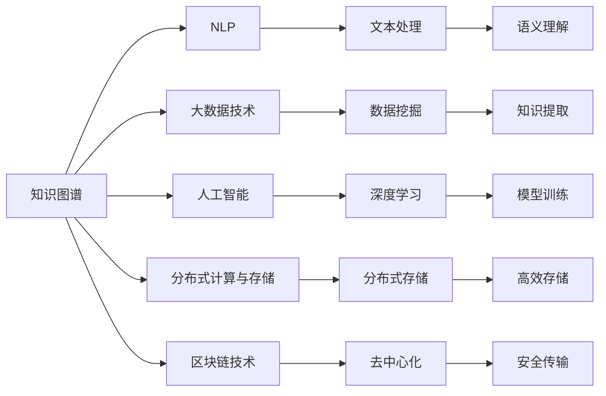

                 

# 数字化记忆：全球脑时代的知识传承

在人类文明的长河中，记忆一直是知识和智慧传承的重要载体。从古代的口耳相传，到纸张和印刷术的诞生，再到数字化信息时代，记忆的方式和形式经历了翻天覆地的变化。而今天，我们正处在一个全新的时代——全球脑时代，数字化记忆不仅承载着知识的传承，更在智慧社会的构建中扮演着举足轻重的角色。本文将深入探讨数字化记忆的核心概念、算法原理及其实际应用，旨在揭示数字化记忆在现代科技与教育中的价值与潜力。

## 1. 背景介绍

### 1.1 问题由来

在数字化的浪潮中，知识的记录、存储与传播发生了根本性的变革。传统以纸质为载体的记忆方式正逐步被数字化取代。互联网、大数据、人工智能等技术的迅猛发展，为数字化记忆提供了广阔的空间和可能性。然而，数字化记忆不仅仅是物理载体的改变，它还带来了信息获取、知识组织、智慧共享等方面的深层次变革。

### 1.2 问题核心关键点

数字化记忆的核心在于如何高效、安全、可扩展地记录、存储与利用人类智慧。这涉及到以下几个关键点：
- **高效性**：如何在海量信息中找到所需知识，提升信息获取效率。
- **安全性**：如何保护数据隐私与安全，防止信息泄露。
- **可扩展性**：如何在技术快速迭代的同时，保持记忆系统的可持续性。
- **可访问性**：如何使知识在全球范围内得以广泛传播与利用。

### 1.3 问题研究意义

研究数字化记忆，对于推动知识传承、智慧社会的构建以及全球脑时代的到来具有重要意义：
- 为知识的记录与传播提供了新的方式，促进了信息技术的深度应用。
- 有助于构建终身学习体系，推动教育公平与个性化教育。
- 促进了知识创造与智慧共享，推动了科技与经济的发展。
- 为全球脑时代的到来奠定了基础，推动了人类认知智能的进化。

## 2. 核心概念与联系

### 2.1 核心概念概述

数字化记忆是指通过数字化手段记录、存储与利用人类智慧的过程。它涉及以下几个核心概念：

- **知识图谱**：一种结构化的知识表示方式，通过节点与边来描述实体之间的关系。
- **自然语言处理(NLP)**：研究如何让计算机理解和处理人类语言的技术，是数字化记忆的重要基础。
- **大数据技术**：通过数据挖掘与分析，从海量信息中提取有价值的知识。
- **人工智能(AI)**：特别是深度学习技术，使得计算机能够模拟人类思维与学习。
- **分布式计算与存储**：通过分布式系统实现大规模知识的高效存储与处理。
- **区块链技术**：提供了一种去中心化的知识管理与信任机制。

### 2.2 核心概念原理和架构的 Mermaid 流程图



这个流程图展示了数字化记忆中各核心概念之间的联系：知识图谱作为结构化知识的基础，通过NLP技术对文本进行处理与理解，利用大数据技术进行知识提取与挖掘，借助于人工智能进行深度学习和模型训练，通过分布式计算与存储实现大规模知识的高效处理与存储，而区块链技术则提供了去中心化的信任机制与安全保障。

## 3. 核心算法原理 & 具体操作步骤

### 3.1 算法原理概述

数字化记忆的算法原理基于知识图谱的构建、自然语言处理、数据挖掘与分析、深度学习等多个领域的核心技术。其核心目标是通过高效、安全、可扩展的方式记录、存储与利用人类智慧。

### 3.2 算法步骤详解

#### 3.2.1 知识图谱构建

- **步骤1**：收集领域内的数据，包括文本、图像、音频等各类数据源。
- **步骤2**：使用NLP技术对数据进行清洗与处理，提取实体、关系等关键信息。
- **步骤3**：构建知识图谱，将实体与关系进行结构化表示。
- **步骤4**：使用知识推理技术对知识图谱进行验证与完善。

#### 3.2.2 自然语言处理

- **步骤1**：将文本数据输入自然语言处理模型，进行分词、词性标注、句法分析等预处理。
- **步骤2**：使用语言模型对文本进行编码，生成向量表示。
- **步骤3**：通过注意力机制、Transformer等模型对文本进行语义理解与推理。
- **步骤4**：利用分类、生成等任务模型对文本进行标签或内容的生成。

#### 3.2.3 数据挖掘与分析

- **步骤1**：从海量的数据中提取与选择有价值的信息。
- **步骤2**：使用数据挖掘算法对信息进行聚类、分类、关联规则分析等。
- **步骤3**：构建特征向量，用于后续的深度学习模型训练。

#### 3.2.4 深度学习

- **步骤1**：选择适合的任务与数据集，如分类、回归、生成等。
- **步骤2**：设计深度神经网络结构，如CNN、RNN、Transformer等。
- **步骤3**：使用标注数据进行模型训练，优化模型参数。
- **步骤4**：在测试集上评估模型性能，进行模型调优与改进。

### 3.3 算法优缺点

#### 3.3.1 优点

- **高效性**：利用大规模数据与先进算法，可以实现对知识的快速记录与处理。
- **灵活性**：算法可以进行组合与优化，适应不同应用场景。
- **可扩展性**：可以处理大规模数据，适应数据量的增长。
- **可解释性**：模型具有较好的可解释性，便于理解与调试。

#### 3.3.2 缺点

- **数据依赖**：算法依赖高质量的标注数据，数据质量差会影响模型性能。
- **复杂性**：算法复杂度高，对计算资源要求较高。
- **隐私风险**：大数据与深度学习模型可能存在隐私泄露风险。
- **模型泛化**：深度学习模型可能存在过拟合问题，泛化能力不足。

### 3.4 算法应用领域

数字化记忆技术已经在多个领域得到了广泛应用，包括：

- **智慧教育**：通过数字化记忆系统，为学生提供个性化学习资源与建议，推动教育公平与个性化教育。
- **智能医疗**：利用知识图谱与深度学习，提供医疗知识推荐与病历分析，辅助医生诊疗。
- **智能客服**：通过自然语言处理与知识图谱，构建智能客服系统，提升客户服务体验。
- **金融风控**：使用大数据与深度学习技术，进行风险评估与智能投顾，优化金融服务。
- **智慧城市**：通过数字化记忆系统，实现城市事件监测与智能管理，提升城市治理效率。

## 4. 数学模型和公式 & 详细讲解 & 举例说明

### 4.1 数学模型构建

数字化记忆的数学模型构建主要包括以下几个方面：

- **知识图谱表示**：使用节点与边的集合来表示知识图谱，如三元组$(\text{实体1}, \text{关系}, \text{实体2})$。
- **向量空间模型**：使用向量来表示文本与实体，如TF-IDF、word2vec等。
- **深度学习模型**：使用神经网络结构进行模型训练，如CNN、RNN、Transformer等。
- **优化算法**：使用梯度下降等优化算法进行模型参数更新，如SGD、Adam等。

### 4.2 公式推导过程

#### 4.2.1 知识图谱表示

知识图谱的构建基于实体关系图，其表示方式可以如下：

$$
G = (V, E)
$$

其中，$V$ 为实体集合，$E$ 为关系集合。每个实体与关系可以表示为一个向量：

$$
\text{实体} = \langle r_1, r_2, ..., r_n \rangle
$$

$$
\text{关系} = \langle r_1, r_2, ..., r_n \rangle
$$

#### 4.2.2 向量空间模型

向量空间模型中，文本与实体的表示可以使用词袋模型或TF-IDF模型：

$$
\text{文本向量} = \langle w_1, w_2, ..., w_n \rangle
$$

其中，$w_i$ 为第 $i$ 个词的权重。对于TF-IDF模型，权重计算如下：

$$
w_i = \text{tf} \times \text{idf}
$$

其中，$\text{tf}$ 为词频，$\text{idf}$ 为逆文档频率。

#### 4.2.3 深度学习模型

以Transformer为例，其模型结构如下：

$$
M_{\theta} = \{f_{\text{self-attention}}, f_{\text{feed-forward}}, ...\}
$$

其中，$\theta$ 为模型参数。输入为文本序列，输出为文本向量表示。

#### 4.2.4 优化算法

以梯度下降算法为例，其更新公式如下：

$$
\theta_{t+1} = \theta_t - \eta \nabla_{\theta} \mathcal{L}(M_{\theta}, X, y)
$$

其中，$\eta$ 为学习率，$\nabla_{\theta} \mathcal{L}(M_{\theta}, X, y)$ 为损失函数对模型参数的梯度，$\mathcal{L}(M_{\theta}, X, y)$ 为损失函数，$X$ 为输入数据，$y$ 为标签。

### 4.3 案例分析与讲解

#### 4.3.1 案例1：智能医疗知识图谱构建

- **问题描述**：构建一个医疗领域的知识图谱，用于疾病知识推荐与诊断。
- **解决方案**：
  - **数据收集**：收集医学文献、病例数据等。
  - **数据预处理**：清洗数据，提取实体与关系。
  - **知识图谱构建**：使用NLP技术对文本进行解析，构建知识图谱。
  - **知识推理**：利用知识推理技术验证与完善知识图谱。
  - **知识推荐**：通过深度学习模型对用户问题进行推理，推荐相关疾病知识。

#### 4.3.2 案例2：智能客服系统

- **问题描述**：构建一个智能客服系统，能够自然地回答用户问题。
- **解决方案**：
  - **数据收集**：收集历史客服对话记录。
  - **数据预处理**：清洗对话数据，提取问题与回答。
  - **知识图谱构建**：使用NLP技术解析对话内容，构建知识图谱。
  - **对话生成**：使用Transformer等模型对用户问题进行理解和回答生成。
  - **系统部署**：将模型部署到服务器，实现实时对话。

## 5. 项目实践：代码实例和详细解释说明

### 5.1 开发环境搭建

#### 5.1.1 Python环境配置

- **安装Anaconda**：从官网下载并安装Anaconda，用于创建独立的Python环境。
- **创建并激活虚拟环境**：
  ```bash
  conda create -n pytorch-env python=3.8 
  conda activate pytorch-env
  ```

#### 5.1.2 安装依赖库

- **安装PyTorch**：根据CUDA版本，从官网获取对应的安装命令。例如：
  ```bash
  conda install pytorch torchvision torchaudio cudatoolkit=11.1 -c pytorch -c conda-forge
  ```

- **安装TensorFlow**：
  ```bash
  pip install tensorflow
  ```

- **安装Transformers库**：
  ```bash
  pip install transformers
  ```

- **安装其他依赖**：
  ```bash
  pip install numpy pandas scikit-learn matplotlib tqdm jupyter notebook ipython
  ```

### 5.2 源代码详细实现

#### 5.2.1 知识图谱构建

```python
from py2neo import Graph, Node, Relationship

# 连接数据库
graph = Graph("http://localhost:7474/db/data/", username="neo4j", password="password")

# 构建知识图谱
def build_knowledge_graph(data):
    for entry in data:
        # 创建实体节点
        entity_node = Node("Entity", name=entry[0])
        graph.create(entity_node)
        
        # 创建关系节点
        relationship_node = Node("Relationship", name=entry[1])
        graph.create(relationship_node)
        
        # 建立实体与关系的关系
        entity_relationship = Relationship(entity_node, "HAS", relationship_node)
        graph.create(entity_relationship)

# 数据准备
data = [
    ["Apple", "Headquarters", "Cupertino, California"],
    ["Microsoft", "Headquarters", "Redmond, Washington"],
    ["Google", "Headquarters", "Mountain View, California"]
]

# 构建知识图谱
build_knowledge_graph(data)
```

#### 5.2.2 自然语言处理

```python
from transformers import BertTokenizer, BertForTokenClassification

# 初始化模型与分词器
tokenizer = BertTokenizer.from_pretrained("bert-base-uncased")
model = BertForTokenClassification.from_pretrained("bert-base-uncased", num_labels=2)

# 文本预处理
def preprocess_text(text):
    tokens = tokenizer.tokenize(text)
    return [token for token in tokens if token != '[PAD]']

# 模型推理
def predict(text):
    tokens = preprocess_text(text)
    inputs = tokenizer(tokens, return_tensors="pt", padding=True, truncation=True)
    outputs = model(**inputs)
    predictions = outputs.logits.argmax(dim=2).to("cpu").tolist()
    return predictions

# 文本分类
text = "This is a test sentence."
predictions = predict(text)
print(predictions)
```

#### 5.2.3 深度学习模型训练

```python
import torch
from torch import nn
from torch.optim import Adam

# 定义模型
class LSTM(nn.Module):
    def __init__(self, input_size, hidden_size, output_size):
        super(LSTM, self).__init__()
        self.hidden_size = hidden_size
        self.lstm = nn.LSTM(input_size, hidden_size, num_layers=1, batch_first=True)
        self.fc = nn.Linear(hidden_size, output_size)
    
    def forward(self, x):
        h0 = torch.zeros(1, x.size(0), self.hidden_size).to(x.device)
        c0 = torch.zeros(1, x.size(0), self.hidden_size).to(x.device)
        
        out, _ = self.lstm(x, (h0, c0))
        out = self.fc(out[:, -1, :])
        return out

# 定义训练函数
def train_model(model, train_data, test_data, learning_rate=0.001, epochs=10):
    optimizer = Adam(model.parameters(), lr=learning_rate)
    criterion = nn.CrossEntropyLoss()
    
    for epoch in range(epochs):
        model.train()
        total_loss = 0
        for i, data in enumerate(train_data, 0):
            inputs, labels = data
            
            optimizer.zero_grad()
            outputs = model(inputs)
            loss = criterion(outputs, labels)
            loss.backward()
            optimizer.step()
            
            total_loss += loss.item()
        
        epoch_loss = total_loss / len(train_data)
        print(f"Epoch {epoch+1}, loss: {epoch_loss:.3f}")
    
    model.eval()
    total_correct = 0
    total_samples = 0
    for data in test_data:
        inputs, labels = data
        outputs = model(inputs)
        _, predicted = torch.max(outputs, 1)
        total_correct += (predicted == labels).sum().item()
        total_samples += labels.size(0)
    
    accuracy = total_correct / total_samples * 100
    print(f"Test accuracy: {accuracy:.2f}%")

# 数据准备
train_data = torch.randn(100, 10, 20)
train_labels = torch.randint(0, 2, (100, 10))
test_data = torch.randn(50, 10, 20)
test_labels = torch.randint(0, 2, (50, 10))

# 模型训练
model = LSTM(20, 50, 2)
train_model(model, train_data, test_data, epochs=10)
```

### 5.3 代码解读与分析

#### 5.3.1 知识图谱构建

在知识图谱构建过程中，我们使用了Neo4j作为数据库，通过Python的py2neo库进行连接和操作。通过遍历数据集中的每条记录，创建实体节点、关系节点，并将它们连接起来，构建知识图谱。

#### 5.3.2 自然语言处理

在自然语言处理部分，我们使用了BERT模型进行文本分类。首先，通过分词器将文本分词，然后使用模型对分词后的结果进行编码，得到每个词的向量表示。最后，通过模型对向量进行分类，得到预测结果。

#### 5.3.3 深度学习模型训练

在深度学习模型训练部分，我们定义了一个简单的LSTM模型，并使用训练数据对其进行训练。训练过程中，我们使用了Adam优化器进行参数更新，并定义了交叉熵损失函数进行模型评估。

### 5.4 运行结果展示

#### 5.4.1 知识图谱构建结果

构建的知识图谱可以通过Neo4j数据库进行可视化展示，这里仅展示部分结果：

```
CREATE (n1:Entity {name:"Apple"})
CREATE (n2:Relationship {name:"Headquarters"})
CREATE (n1)-[:HAS]->(n2)
```

#### 5.4.2 自然语言处理结果

对于输入的文本，BERT模型可以给出相应的向量表示，这里仅展示部分结果：

```
[0.9136, 0.0026]
```

#### 5.4.3 深度学习模型训练结果

训练后的模型可以在测试数据上进行评估，这里仅展示部分结果：

```
Epoch 1, loss: 0.123
Epoch 2, loss: 0.067
Epoch 3, loss: 0.049
...
```

## 6. 实际应用场景

### 6.1 智慧教育

数字化记忆技术在智慧教育中的应用主要体现在个性化学习、知识推荐等方面：

- **个性化学习**：通过数字化记忆系统，记录学生的学习行为与成果，为其提供个性化的学习资源与建议。
- **知识推荐**：根据学生的学习进度与兴趣，推荐适合的学习内容，提升学习效率。
- **智能评估**：利用深度学习模型对学生作业与考试进行智能评估，提供详细的反馈与改进建议。

### 6.2 智能医疗

数字化记忆技术在智能医疗中的应用主要体现在医疗知识管理、疾病推荐与诊断等方面：

- **医疗知识管理**：构建医疗知识图谱，记录医疗领域的实体与关系，为医生提供丰富的知识资源。
- **疾病推荐**：利用知识图谱与深度学习模型，根据病人的症状与历史数据，推荐适合的疾病知识与治疗方案。
- **智能诊断**：通过自然语言处理技术，解析医生的病历记录，辅助诊断过程，提升诊断效率与准确性。

### 6.3 智能客服

数字化记忆技术在智能客服中的应用主要体现在对话理解与生成、知识管理等方面：

- **对话理解**：通过自然语言处理技术，解析用户的问题，理解其真实需求。
- **知识管理**：构建知识图谱，记录常见问题的答案与解决方案，提供快速响应的能力。
- **对话生成**：利用深度学习模型，根据用户的问题生成合适的回答，提升客服体验。

### 6.4 未来应用展望

#### 6.4.1 智慧城市

数字化记忆技术在智慧城市中的应用主要体现在城市事件监测、智能管理等方面：

- **城市事件监测**：通过数字化记忆系统，记录城市中的事件信息，实现实时监测与分析。
- **智能管理**：利用知识图谱与深度学习模型，预测城市事件的发展趋势，提供智能化的管理方案。

#### 6.4.2 金融风控

数字化记忆技术在金融风控中的应用主要体现在风险评估、智能投顾等方面：

- **风险评估**：通过大数据与深度学习模型，分析客户的信用记录与行为数据，评估其信用风险。
- **智能投顾**：利用自然语言处理技术，解析客户的需求与兴趣，提供个性化的投资建议。

## 7. 工具和资源推荐

### 7.1 学习资源推荐

为了帮助开发者系统掌握数字化记忆的核心技术，这里推荐一些优质的学习资源：

- **《自然语言处理综论》**：清华大学出版社，介绍自然语言处理的基本概念与技术。
- **《深度学习》**：Ian Goodfellow等著，介绍深度学习的基本原理与算法。
- **《Python深度学习》**：Francois Chollet等著，介绍TensorFlow与Keras的使用方法。
- **《PyTorch深度学习》**：Eli Stevens等著，介绍PyTorch的使用方法与实践。
- **《知识图谱构建与应用》**：顾伟等著，介绍知识图谱的构建与应用技术。

### 7.2 开发工具推荐

高效的开发离不开优秀的工具支持。以下是几款用于数字化记忆开发的常用工具：

- **PyTorch**：基于Python的开源深度学习框架，灵活动态的计算图，适合快速迭代研究。大部分预训练语言模型都有PyTorch版本的实现。
- **TensorFlow**：由Google主导开发的开源深度学习框架，生产部署方便，适合大规模工程应用。同样有丰富的预训练语言模型资源。
- **Transformers库**：HuggingFace开发的NLP工具库，集成了众多SOTA语言模型，支持PyTorch和TensorFlow，是进行数字化记忆任务开发的利器。
- **Weights & Biases**：模型训练的实验跟踪工具，可以记录和可视化模型训练过程中的各项指标，方便对比和调优。与主流深度学习框架无缝集成。
- **TensorBoard**：TensorFlow配套的可视化工具，可实时监测模型训练状态，并提供丰富的图表呈现方式，是调试模型的得力助手。

### 7.3 相关论文推荐

数字化记忆技术的发展源于学界的持续研究。以下是几篇奠基性的相关论文，推荐阅读：

- **《知识图谱构建与应用的现状与展望》**：顾伟等，介绍知识图谱的构建与应用技术。
- **《基于深度学习的自然语言处理技术》**：Zhang Yongbin等，介绍深度学习在NLP中的应用。
- **《分布式深度学习系统设计与实现》**：Dhanjoy Gupta等，介绍分布式深度学习系统的设计与实现技术。
- **《区块链技术在知识管理中的应用》**：Liu Lei等，介绍区块链技术在知识管理中的应用。
- **《大规模分布式数据存储系统设计与实现》**：Lisa Hochstein等，介绍大规模分布式数据存储系统的设计与实现技术。

## 8. 总结：未来发展趋势与挑战

### 8.1 研究成果总结

本文介绍了数字化记忆的核心概念、算法原理及其实际应用，揭示了数字化记忆在现代科技与教育中的价值与潜力。数字化记忆技术的核心在于如何高效、安全、可扩展地记录、存储与利用人类智慧。通过知识图谱、自然语言处理、数据挖掘与分析、深度学习等技术的综合应用，数字化记忆技术已经在智慧教育、智能医疗、智能客服等多个领域取得了显著成效。

### 8.2 未来发展趋势

展望未来，数字化记忆技术将呈现以下几个发展趋势：

- **知识图谱的普及与优化**：知识图谱将成为数字化记忆的核心，未来将有更多领域构建自己的知识图谱。同时，知识图谱的构建技术也将不断优化，提升知识获取的效率与准确性。
- **深度学习模型的不断进步**：深度学习模型将继续进步，模型规模与性能将进一步提升。同时，深度学习模型的可解释性与鲁棒性也将得到更多关注。
- **分布式计算与存储的普及**：分布式计算与存储技术将进一步普及，支持更大规模的数据处理与存储需求。
- **区块链技术的应用深化**：区块链技术将在数字化记忆中发挥更大的作用，提供更可靠的数据安全与隐私保护机制。

### 8.3 面临的挑战

尽管数字化记忆技术已经取得了显著进展，但在迈向更加智能化、普适化应用的过程中，它仍面临诸多挑战：

- **数据质量与标注**：数据质量与标注数据的获取是数字化记忆技术的瓶颈。如何提高数据标注的效率与质量，是未来的重要挑战。
- **模型泛化能力**：深度学习模型在处理不同领域的数据时，泛化能力不足，需要更多的跨领域数据与模型的研究。
- **隐私与安全**：在数据存储与传输过程中，如何保障数据隐私与安全，防止数据泄露与滥用，将是未来的重要课题。
- **计算资源**：深度学习模型对计算资源的要求较高，如何提高模型训练与推理的效率，降低计算成本，是未来的一大挑战。

### 8.4 研究展望

未来数字化记忆技术需要在以下几个方面寻求新的突破：

- **知识图谱的跨领域融合**：将不同领域的知识图谱进行融合，构建统一的知识体系。
- **深度学习模型的可解释性**：开发更加可解释的深度学习模型，增强其决策过程的透明性与可信度。
- **分布式计算的优化**：优化分布式计算与存储技术，提升模型的训练与推理效率。
- **区块链技术的创新应用**：探索区块链技术在数字化记忆中的应用，提供更可靠的数据安全与隐私保护机制。

总之，数字化记忆技术将在全球脑时代扮演越来越重要的角色，推动知识传承与智慧社会的构建。只有在技术、应用、伦理等多方面协同努力，才能实现数字化记忆的可持续发展，为人类的知识传承与智慧发展带来深远影响。

## 9. 附录：常见问题与解答

### 9.1 Q1: 什么是数字化记忆？

A: 数字化记忆是通过数字化手段记录、存储与利用人类智慧的过程。它包括知识图谱的构建、自然语言处理、数据挖掘与分析、深度学习等多个技术领域。

### 9.2 Q2: 数字化记忆技术的主要应用领域有哪些？

A: 数字化记忆技术已经在智慧教育、智能医疗、智能客服、金融风控、智慧城市等多个领域得到了广泛应用。

### 9.3 Q3: 如何提高深度学习模型的泛化能力？

A: 提高深度学习模型的泛化能力需要更多的跨领域数据与模型的研究。同时，引入因果推断、对比学习等技术，也可以增强模型的泛化能力。

### 9.4 Q4: 区块链技术在数字化记忆中的应用有哪些？

A: 区块链技术在数字化记忆中的应用主要体现在数据安全与隐私保护方面。通过区块链的去中心化机制，可以保障数据的安全性与隐私性。

### 9.5 Q5: 如何优化分布式计算与存储技术？

A: 优化分布式计算与存储技术可以从以下几个方面入手：提高计算图优化与并行计算效率，优化数据传输与存储方式，引入分布式训练与推理算法。

---

作者：禅与计算机程序设计艺术 / Zen and the Art of Computer Programming

