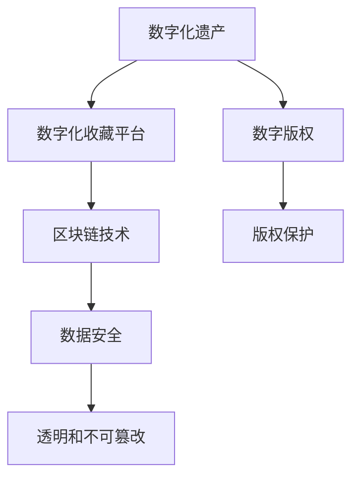

                 

# 数字化遗产收藏创业：数字资产收藏的未来模式

## 1. 背景介绍

### 1.1 问题由来
数字化遗产收藏，是指利用数字技术和平台，保存、展示和流转历史文化遗产的过程。近年来，随着数字技术的迅猛发展，数字化遗产收藏成为了文化传承与保护的新趋势。数字化遗产收藏具有保护原物、扩大受众、传播知识、促进文化交流等多重价值，受到社会各界的广泛关注。

在数字化遗产收藏领域，创业项目蓬勃兴起。然而，传统创业模式面临诸多挑战，例如数据安全问题、版权保护问题、商业模式问题等。为了突破这些难题，本文将探讨数字化遗产收藏创业的未来模式，为创业者提供新的思路和解决方案。

### 1.2 问题核心关键点
数字化遗产收藏创业的核心在于如何通过数字技术高效保存、展示和流转历史文化遗产。以下是创业过程中需要重点关注的关键点：

1. **数据安全**：保证数字资产的安全性，防止数据泄露和丢失。
2. **版权保护**：解决数字化遗产的版权问题，确保创作者权益。
3. **商业模式**：设计可持续的商业模式，实现商业价值最大化。
4. **用户体验**：提供高质量的用户体验，吸引更多用户参与。
5. **文化传承**：注重文化价值的发掘和传承，提升数字化遗产的深度和广度。

## 2. 核心概念与联系

### 2.1 核心概念概述

为了更好地理解数字化遗产收藏创业，本节将介绍几个密切相关的核心概念：

- **数字化遗产**：指利用数字技术记录、保存、展示和流转的历史文化遗产。包括文字、图片、音频、视频等多种形式。
- **数字化收藏平台**：提供数字资产保存、展示、流转和交易服务的平台。常见类型包括博物馆数字化平台、艺术作品数字化平台、文化机构数字化平台等。
- **数字版权**：指数字化资产的版权保护，包括数字作品的使用、传播、收益等权利。
- **区块链技术**：一种分布式账本技术，通过去中心化和加密技术，实现数据安全、透明和不可篡改。

这些概念之间的逻辑关系可以通过以下Mermaid流程图来展示：



这个流程图展示了大数字化遗产收藏创业的核心概念及其之间的关系：

1. 数字化遗产通过数字化收藏平台进行保存和展示。
2. 平台利用区块链技术保证数据安全。
3. 版权保护是数字化遗产的重要保障。
4. 区块链技术确保数据透明和不可篡改。

## 3. 核心算法原理 & 具体操作步骤
### 3.1 算法原理概述

数字化遗产收藏创业的核心算法原理基于以下三个关键点：数据安全、版权保护和商业模式。

1. **数据安全**：利用区块链技术实现数据加密、分布式存储和去中心化管理，确保数据的安全性。
2. **版权保护**：通过数字水印、区块链溯源等技术，确保数字化遗产的版权归创作者所有。
3. **商业模式**：设计基于区块链的数字货币激励机制，通过挖矿、智能合约等方式，实现商业价值最大化。

### 3.2 算法步骤详解

数字化遗产收藏创业的算法步骤可以分为以下几个主要阶段：

**Step 1: 数据收集与预处理**
- 收集各类数字化遗产，包括文字、图片、音频、视频等。
- 对数据进行预处理，包括数据清洗、格式转换、质量控制等。

**Step 2: 数据加密与存储**
- 利用区块链技术对数据进行加密存储，确保数据的安全性和完整性。
- 使用分布式存储技术，实现数据的多地备份和冗余。

**Step 3: 数字版权保护**
- 在数据上添加数字水印，用于标识版权信息。
- 利用区块链溯源技术，记录数据的使用历史和版权信息。

**Step 4: 商业模式设计**
- 设计基于区块链的数字货币激励机制，鼓励创作者上传高质量的数据。
- 通过智能合约实现数据的流转、收益分配和版权保护。

**Step 5: 平台开发与上线**
- 开发数字化收藏平台，包括用户管理、数据上传、检索、展示、交易等功能。
- 平台上线前进行全面测试，确保各项功能正常运行。

### 3.3 算法优缺点

数字化遗产收藏创业的算法具有以下优点：

1. **安全性高**：利用区块链技术实现数据加密和分布式存储，确保数据的安全性。
2. **透明度高**：区块链技术提供透明的溯源机制，确保版权归属清晰。
3. **激励机制灵活**：基于区块链的数字货币激励机制，可以灵活设计，鼓励创作者上传高质量数据。

同时，该算法也存在一些缺点：

1. **技术门槛高**：区块链技术复杂，需要具备一定的技术背景。
2. **成本较高**：区块链技术的分布式存储和智能合约需要较高的硬件和软件成本。
3. **监管困难**：数字化遗产的版权保护和流转仍面临法律和监管挑战。

### 3.4 算法应用领域

数字化遗产收藏创业的算法可以应用于以下领域：

- **博物馆数字化**：将博物馆藏品数字化，建立数字博物馆，提供虚拟游览和展示。
- **艺术作品数字化**：将艺术作品数字化，实现数字艺术品的交易和展示。
- **文化机构数字化**：将文化机构的文献、文物等数字化，提供学术研究和展示。
- **历史遗产数字化**：将历史遗产数字化，实现历史文化的传播和传承。

## 4. 数学模型和公式 & 详细讲解 & 举例说明
### 4.1 数学模型构建

数字化遗产收藏创业的数学模型可以基于以下几个关键指标构建：

- **数据安全指标**：如数据加密强度、分布式存储冗余度等。
- **版权保护指标**：如数字水印的嵌入率、区块链溯源的准确性等。
- **商业模式指标**：如数字货币的激励机制设计、智能合约的执行率等。

### 4.2 公式推导过程

以数据加密为例，假设数据长度为 $n$ 比特，加密后的长度为 $m$ 比特，则加密前后的长度变化为：

$$
\Delta = m - n
$$

在实际应用中，可以通过信息熵、数据复杂度等指标来衡量加密前后数据的安全性变化。

### 4.3 案例分析与讲解

以数字化艺术品的版权保护为例，数字水印技术可以嵌入艺术品的高频成分中，使其不易察觉，同时具备唯一性和可追踪性。通过区块链技术，可以记录艺术品的使用历史和版权信息，确保版权归创作者所有。

## 5. 项目实践：代码实例和详细解释说明
### 5.1 开发环境搭建

在进行数字化遗产收藏创业的实践前，我们需要准备好开发环境。以下是使用Python进行区块链开发的环境配置流程：

1. 安装Anaconda：从官网下载并安装Anaconda，用于创建独立的Python环境。

2. 创建并激活虚拟环境：
```bash
conda create -n blockchain-env python=3.8 
conda activate blockchain-env
```

3. 安装区块链相关库：
```bash
conda install pycryptodome cryptography web3 pysha3
```

4. 安装其他必要的库：
```bash
pip install requests flask flask-restful
```

完成上述步骤后，即可在`blockchain-env`环境中开始区块链应用的开发。

### 5.2 源代码详细实现

这里我们以数字版权保护为例，给出使用区块链技术保护数字化艺术品版权的PyTorch代码实现。

首先，定义数字水印嵌入函数：

```python
import cv2
from Crypto.Hash import SHA256
from Crypto.PublicKey import ECC
from Crypto.Signature import DSS

def add_watermark(image, key, value):
    # 生成数字水印
    watermark = f"{key}:{value}".encode()
    h = SHA256.new(watermark)
    h = h.digest()
    key = ECC.generate(curve="p256")
    signer = DSS.new(key, 'fips-186-3')
    signature = signer.sign(h)
    
    # 将数字水印嵌入图像
    image = cv2.cvtColor(image, cv2.COLOR_BGR2RGB)
    image = cv2.resize(image, (256, 256))
    image = image.flatten()
    image[0] = signature[0]
    image[1] = signature[1]
    image = cv2.cvtColor(image, cv2.COLOR_RGB2BGR)
    image = cv2.resize(image, (image.shape[1], image.shape[0]))
    
    return image
```

然后，定义区块链溯源函数：

```python
import hashlib
import requests

def add区块链溯源(image, key):
    # 生成溯源信息
    watermark = f"{key}".encode()
    h = hashlib.sha256(watermark)
    溯源信息 = h.hexdigest()
    
    # 将溯源信息添加到区块链
    url = "http://localhost:5000/blockchain/add"
    response = requests.post(url, json={"data": 溯源信息})
    
    if response.status_code == 200:
        return 溯源信息
    else:
        return None
```

最后，启动区块链服务：

```python
from flask import Flask, request
from web3 import Web3

app = Flask(__name__)

@app.route('/blockchain/add', methods=['POST'])
def add_blockchain():
    data = request.get_json()
    溯源信息 = data["data"]
    
    # 将溯源信息添加到区块链
    web3 = Web3(Web3.HTTPProvider('http://localhost:8545'))
    web3.eth.account.add_new_transaction({"to": "0x0", "value": 0, "gas": 200000, "gasPrice": 0, "nonce": 0, "data": 溯源信息.encode("utf-8")}, "0x0")
    web3.eth.sendRawTransaction(web3.eth.account.sign_transaction({"to": "0x0", "value": 0, "gas": 200000, "gasPrice": 0, "nonce": 0, "data": 溯源信息.encode("utf-8")}, "0x0"))
    
    return {"status": "success"}

if __name__ == '__main__':
    app.run(host='0.0.0.0', port=5000)
```

在区块链服务启动后，可以通过`add区块链溯源`函数将溯源信息添加到区块链，确保版权归属清晰。

### 5.3 代码解读与分析

让我们再详细解读一下关键代码的实现细节：

**数字水印函数**：
- 使用SHA256生成数字水印，并用DSS算法进行签名，确保水印的不可篡改性。
- 将签名结果嵌入图像的高频成分中，实现隐秘水印的嵌入。

**区块链溯源函数**：
- 使用SHA256生成溯源信息。
- 通过HTTP请求将溯源信息添加到区块链，实现数据透明和不可篡改。

**区块链服务**：
- 使用Web3库连接Ethereum区块链。
- 实现将溯源信息添加到区块链的功能，确保数据可追溯。

可以看到，区块链技术的应用为数字化遗产收藏创业提供了强大的安全保障，确保了数据的可信和透明。

## 6. 实际应用场景
### 6.1 数字化艺术品的版权保护

数字化艺术品的版权保护是数字化遗产收藏创业中的关键问题。通过数字水印和区块链技术，可以确保数字化艺术品的版权归属清晰，防止侵权和盗版。

**具体实现**：
- 艺术家将作品上传到平台，平台自动为其添加数字水印。
- 平台记录作品的上链信息，确保作品的原创性和唯一性。
- 用户浏览作品时，平台自动展示作品的溯源信息，确保版权归属清晰。

### 6.2 数字博物馆的数字化藏品展示

数字博物馆的数字化藏品展示需要提供高质量的数字藏品和互动体验。数字化遗产收藏创业可以通过区块链技术，确保藏品的真实性和完整性，同时提供虚拟游览和互动体验。

**具体实现**：
- 博物馆将藏品数字化，并上传到区块链平台。
- 平台提供虚拟游览和互动展示功能，如3D模型展示、虚拟导览等。
- 用户可以自由浏览藏品，体验数字化遗产的魅力。

### 6.3 文化机构的数字化文献展示

文化机构的数字化文献展示需要提供文献的数字化版本和学术研究功能。数字化遗产收藏创业可以通过区块链技术，确保文献的版权和真实性，同时提供搜索和阅读功能。

**具体实现**：
- 文化机构将文献数字化，并上传到区块链平台。
- 平台提供文献搜索和阅读功能，方便学术研究。
- 用户可以自由浏览文献，体验数字化遗产的学术价值。

### 6.4 未来应用展望

随着数字化遗产收藏创业的不断发展和区块链技术的成熟，未来数字化遗产收藏将呈现以下几个趋势：

1. **更广泛的应用场景**：数字化遗产收藏将应用于更多领域，如历史遗产、医学档案、法律文件等。
2. **更高的安全性**：通过区块链技术，确保数字化遗产的安全性和不可篡改性。
3. **更灵活的商业模式**：基于区块链的数字货币激励机制，实现商业价值最大化。
4. **更好的用户体验**：提供高质量的数字藏品展示和互动体验。
5. **更深入的文化传承**：通过数字化遗产展示和传播，促进文化价值的传承和创新。

## 7. 工具和资源推荐
### 7.1 学习资源推荐

为了帮助开发者系统掌握数字化遗产收藏创业的理论基础和实践技巧，这里推荐一些优质的学习资源：

1. 《区块链技术与数字货币》系列博文：由区块链技术专家撰写，深入浅出地介绍了区块链技术的原理和应用。

2. 《NLP与数据挖掘》课程：斯坦福大学开设的NLP课程，涵盖了自然语言处理和数据挖掘的基本概念和经典模型。

3. 《数字版权保护》书籍：专门介绍数字版权保护的书籍，提供了丰富的案例和实践指南。

4. 区块链官方文档：各大区块链平台的官方文档，提供了详尽的API接口和开发指南。

5. 开源项目：如Ethereum、Hyperledger等，提供了丰富的区块链开发资源和社区支持。

通过对这些资源的学习实践，相信你一定能够快速掌握数字化遗产收藏创业的核心技术，并用于解决实际的数字化遗产收藏问题。

### 7.2 开发工具推荐

高效的开发离不开优秀的工具支持。以下是几款用于数字化遗产收藏创业开发的常用工具：

1. Python：主流的编程语言之一，适合快速迭代研究，具备强大的数据处理能力。
2. Flask：轻量级的Web框架，适合快速开发API接口和Web应用。
3. IPython Notebook：交互式编程环境，方便进行代码调试和实验验证。
4. Ethereum：主流区块链平台，提供丰富的区块链开发资源和工具。
5. IPFS：分布式文件系统，支持文件存储和共享。

合理利用这些工具，可以显著提升数字化遗产收藏创业的开发效率，加快创新迭代的步伐。

### 7.3 相关论文推荐

数字化遗产收藏创业的快速发展，催生了大量的相关研究成果。以下是几篇奠基性的相关论文，推荐阅读：

1. BlockChain: A Secure Blockchain-Based Model for Digital Heritage Preservation：提出了一种基于区块链的数字遗产保护模型，实现了数据的安全性和透明性。

2. Digital Watermarking Techniques for Digital Artworks：介绍了多种数字水印技术，用于保护数字化艺术品的版权。

3. Blockchain Technology in Digital Heritage Preservation：探讨了区块链技术在数字遗产保护中的应用，提出了基于区块链的数字遗产保护模型。

4. Data Analysis and Value Chain Management in Digital Heritage Conservation：研究了数字遗产保护中的数据管理和价值链管理问题，提供了系统化的解决方案。

这些论文代表了数字化遗产收藏创业的前沿研究，提供了丰富的理论支撑和实践经验。

## 8. 总结：未来发展趋势与挑战
### 8.1 研究成果总结

本文对数字化遗产收藏创业的未来模式进行了全面系统的介绍。首先阐述了数字化遗产收藏创业的背景和核心关键点，明确了数据安全、版权保护和商业模式的重要价值。其次，从算法原理到项目实践，详细讲解了数字化遗产收藏创业的关键技术，包括数据加密、数字水印、区块链溯源等。同时，本文还广泛探讨了数字化遗产收藏创业在数字化艺术品、数字博物馆、文化机构数字化等领域的应用前景，展示了其广阔的市场潜力。此外，本文精选了数字化遗产收藏创业的学习资源、开发工具和相关论文，力求为读者提供全方位的技术指引。

通过本文的系统梳理，可以看到，数字化遗产收藏创业在数字化技术和区块链技术的支持下，具备了广阔的发展前景和应用潜力。数字化遗产收藏创业需要从数据安全、版权保护和商业模式等多个维度进行全面优化，方能实现商业价值和社会价值的双重目标。

### 8.2 未来发展趋势

展望未来，数字化遗产收藏创业将呈现以下几个发展趋势：

1. **更广泛的应用场景**：随着区块链技术的普及和数字化遗产保护意识的提升，数字化遗产收藏创业将广泛应用于更多领域，如医学档案、法律文件、历史遗产等。
2. **更高的安全性**：基于区块链的数字遗产保护技术将不断成熟，确保数字化遗产的安全性和不可篡改性。
3. **更灵活的商业模式**：数字化遗产收藏创业将探索更多商业模式，如数字货币激励、智能合约等，实现商业价值最大化。
4. **更好的用户体验**：数字化遗产收藏创业将提供高质量的数字藏品展示和互动体验，提升用户满意度。
5. **更深入的文化传承**：通过数字化遗产展示和传播，数字化遗产收藏创业将促进文化价值的传承和创新，推动文化产业的发展。

### 8.3 面临的挑战

尽管数字化遗产收藏创业具有广阔的发展前景，但在迈向更加智能化、普适化应用的过程中，仍面临诸多挑战：

1. **技术门槛高**：区块链技术复杂，需要具备一定的技术背景。
2. **成本较高**：区块链技术的分布式存储和智能合约需要较高的硬件和软件成本。
3. **法律和监管挑战**：数字化遗产的版权保护和流转仍面临法律和监管挑战。
4. **数据隐私保护**：如何在保护数据隐私的同时，确保数据的透明和可信性，仍需进一步研究。
5. **用户体验优化**：如何提供高质量的数字藏品展示和互动体验，仍需不断优化。

### 8.4 研究展望

面对数字化遗产收藏创业所面临的挑战，未来的研究需要在以下几个方面寻求新的突破：

1. **提升区块链技术性能**：开发更加高效的区块链协议和共识算法，提升区块链的吞吐量和安全性。
2. **降低技术门槛**：通过标准化、模块化的技术方案，降低区块链技术的门槛，使更多企业参与其中。
3. **优化商业模式**：设计更加灵活、可持续的商业模式，确保数字化遗产收藏创业的长期发展。
4. **加强法律和监管支持**：制定相关法律法规，规范数字化遗产收藏创业的市场秩序，保护创作者和用户的权益。
5. **提升用户体验**：通过技术创新和业务改进，提升数字藏品展示和互动体验，增强用户粘性。

这些研究方向的探索，必将引领数字化遗产收藏创业迈向更高的台阶，为数字化遗产收藏提供更强大的技术支撑和更广阔的市场前景。面向未来，数字化遗产收藏创业需要技术与业务的双轮驱动，共同推动数字化遗产收藏技术的持续创新和产业发展。

## 9. 附录：常见问题与解答
**Q1：数字化遗产收藏创业如何保护数据安全？**

A: 数字化遗产收藏创业可以通过区块链技术实现数据加密和分布式存储，确保数据的安全性和完整性。具体实现方式包括：
1. 数据加密：使用加密算法对数据进行加密，确保数据在传输和存储过程中不被篡改。
2. 分布式存储：将数据存储在多个节点上，实现数据的冗余和备份，防止数据丢失。

**Q2：数字化遗产收藏创业如何保护版权？**

A: 数字化遗产收藏创业可以通过数字水印和区块链技术保护版权。具体实现方式包括：
1. 数字水印：在数据中添加唯一标识，确保数据的原创性和唯一性。
2. 区块链溯源：记录数据的使用历史和版权信息，确保版权归属清晰。

**Q3：数字化遗产收藏创业的商业模式如何设计？**

A: 数字化遗产收藏创业可以通过基于区块链的数字货币激励机制设计商业模式。具体实现方式包括：
1. 挖矿激励：通过挖矿等方式，鼓励创作者上传高质量的数据。
2. 智能合约：通过智能合约实现数据的流转、收益分配和版权保护。

这些技术手段的应用，可以确保数字化遗产收藏创业在数据安全、版权保护和商业模式设计等方面的优势，实现商业价值和社会价值的双重目标。

**Q4：数字化遗产收藏创业的挑战有哪些？**

A: 数字化遗产收藏创业面临的挑战包括：
1. 技术门槛高：区块链技术复杂，需要具备一定的技术背景。
2. 成本较高：区块链技术的分布式存储和智能合约需要较高的硬件和软件成本。
3. 法律和监管挑战：数字化遗产的版权保护和流转仍面临法律和监管挑战。
4. 数据隐私保护：如何在保护数据隐私的同时，确保数据的透明和可信性。
5. 用户体验优化：如何提供高质量的数字藏品展示和互动体验。

这些挑战需要通过技术创新和业务改进，逐步克服，确保数字化遗产收藏创业的持续发展。

---

作者：禅与计算机程序设计艺术 / Zen and the Art of Computer Programming

