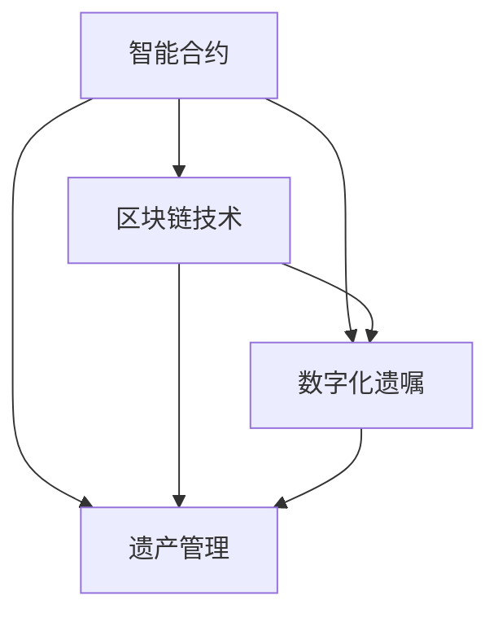

                 

# 数字化遗嘱执行创业：智能合约在遗产管理中的应用

> 关键词：遗产管理,智能合约,数字化遗嘱,区块链技术,执行监控,法律合规

## 1. 背景介绍

### 1.1 问题由来
遗产管理是一个复杂且敏感的领域，涉及财产继承、资产分配、税款缴纳等多项事务。传统的遗产管理过程往往耗时冗长，容易引发争议，且难以确保所有相关方对过程的信任和透明度。这些问题在面对全球化遗产管理需求时更加凸显，尤其是在跨境遗产情况下，更是难上加难。

近年来，区块链技术的迅猛发展为遗产管理带来了新的解决思路。通过智能合约的应用，可以在区块链上实现自动化、不可篡改的遗产管理操作，大幅提升遗产处理的效率和透明度。智能合约可以根据预设条件自动执行，确保遗产分配的公正性和合法性。

### 1.2 问题核心关键点
智能合约在遗产管理中的应用，主要集中在以下几个方面：

1. **自动化执行**：通过区块链上运行的智能合约，遗产管理的所有操作可以在预设条件下自动执行，减少人工干预和操作风险。
2. **透明度**：所有操作记录在区块链上，任何人都可随时查看，确保过程的透明和可追溯。
3. **可执行性**：智能合约确保其执行条件得到满足后，自动执行相应的操作，如资产转移、支付税款等。
4. **跨境操作**：智能合约可以跨越国界，适用于多司法管辖区的遗产管理。
5. **法律合规性**：智能合约设计时需符合各司法管辖区的法律要求，确保操作合法合规。

这些关键点共同构成了智能合约在遗产管理中的核心优势，有望彻底改变传统遗产管理的模式。

### 1.3 问题研究意义
智能合约在遗产管理中的应用，对提升遗产处理效率、确保操作公正透明、降低争议风险具有重要意义。对于创业者而言，开发基于智能合约的遗产管理平台，不仅可以开拓新的业务方向，同时也能为遗产管理行业带来创新，助力行业升级。

## 2. 核心概念与联系

### 2.1 核心概念概述

为更好地理解智能合约在遗产管理中的应用，本节将介绍几个密切相关的核心概念：

- **智能合约**：一种在区块链上运行的自动化合约，通过代码实现预设的规则和条件，当满足这些条件时，智能合约自动执行相应的操作。
- **区块链技术**：一种去中心化的分布式账本技术，所有交易记录公开透明，不可篡改。
- **数字化遗嘱**：利用区块链和智能合约技术，实现遗嘱的数字化和自动化执行。
- **遗产管理**：涉及财产继承、资产分配、税款缴纳等多项事务的管理工作。

这些核心概念之间的逻辑关系可以通过以下Mermaid流程图来展示：



这个流程图展示了一些核心概念及其之间的关系：

1. 智能合约利用区块链技术实现数字化遗嘱。
2. 智能合约和区块链技术都是遗产管理的重要工具。
3. 数字化遗嘱是智能合约在遗产管理中的典型应用之一。

这些概念共同构成了智能合约在遗产管理中的应用框架，使其能够在各环节中发挥强大的作用。

## 3. 核心算法原理 & 具体操作步骤
### 3.1 算法原理概述

基于智能合约的遗产管理，本质上是一个自动化执行和监控的过程。其核心思想是：利用区块链和智能合约技术，在遗产管理过程中实现自动化操作和条件检查，确保所有操作符合预设条件且透明可追溯。

形式化地，假设遗产管理任务为 $T$，所有条件和操作记录在区块链上。智能合约 $M_{\theta}$ 根据预设规则和条件，自动执行相应操作。例如，当一个继承人满足条件时，智能合约将自动转移相应资产。

智能合约的执行可以分为以下几步：

1. **设定条件**：在智能合约中设定具体的执行条件，如时间、继承人身份、税务要求等。
2. **发布智能合约**：将智能合约部署在区块链上，使其可以自动执行预设操作。
3. **触发条件**：当满足预设条件时，智能合约自动执行相应的操作，如资产转移、支付税款等。
4. **监控执行**：通过区块链的透明特性，对智能合约的执行过程进行监控和审计，确保操作的合法性和合规性。

### 3.2 算法步骤详解

基于智能合约的遗产管理一般包括以下几个关键步骤：

**Step 1: 设定执行条件**
- 在智能合约中明确设定各项执行条件，如继承人的身份、资产类型、分配比例等。
- 引入法律合规性的约束，确保所有操作符合各司法管辖区的法律法规。

**Step 2: 发布智能合约**
- 选择合适的区块链平台，如以太坊、Tron等，部署智能合约代码。
- 使用相应编程语言，如Solidity，编写智能合约代码。
- 进行合约测试，确保无逻辑漏洞和潜在风险。

**Step 3: 执行和监控**
- 当满足预设条件时，智能合约自动触发相应的操作，如资产转移、支付税款等。
- 通过区块链的透明特性，对智能合约的执行过程进行实时监控，确保操作透明可追溯。
- 定期审计智能合约，确保其执行符合法律和道德标准。

### 3.3 算法优缺点

智能合约在遗产管理中的应用具有以下优点：
1. 自动化执行：减少人工干预，提升执行效率。
2. 透明可追溯：所有操作记录在区块链上，确保透明可追溯。
3. 法律合规：确保所有操作符合各司法管辖区的法律要求。
4. 跨地域操作：适用于跨境遗产管理，突破地域限制。

同时，该方法也存在一定的局限性：
1. 技术门槛高：智能合约和区块链技术需要一定的技术背景，对非技术人员较为友好。
2. 成本较高：部署和维护智能合约的成本较高，需要考虑商业可行性和经济效益。
3. 安全性问题：智能合约可能存在安全漏洞，需要定期审计和修复。
4. 法律适用性：不同司法管辖区的法律差异可能导致智能合约执行存在障碍。

尽管存在这些局限性，但就目前而言，智能合约在遗产管理中的应用仍是技术发展的前沿方向。未来相关研究的重点在于如何进一步降低技术门槛，提高系统的安全性，同时兼顾法律适用性和成本效益等因素。

### 3.4 算法应用领域

基于智能合约的遗产管理方法，已在多个场景中得到应用，例如：

- **遗产分配**：自动执行遗嘱中规定的资产分配条件，确保分配公平透明。
- **资产管理**：实现财产的自动登记和转移，简化管理过程。
- **税务处理**：自动计算并支付遗产税款，确保税务合规。
- **争议解决**：在争议发生时，智能合约自动进入争议解决机制，保护各方的合法权益。
- **跨界操作**：支持跨境遗产管理，解决多司法管辖区的法律适用问题。

除了上述这些经典应用外，智能合约还可用于更多遗产管理场景中，如赠与管理、遗产信托等，为遗产管理行业带来新的突破。

## 4. 数学模型和公式 & 详细讲解 & 举例说明（备注：数学公式请使用latex格式，latex嵌入文中独立段落使用 $$，段落内使用 $)
### 4.1 数学模型构建

本节将使用数学语言对智能合约在遗产管理中的应用过程进行更加严格的刻画。

假设遗产管理任务为 $T$，所有条件和操作记录在区块链上。智能合约 $M_{\theta}$ 根据预设规则和条件，自动执行相应操作。例如，当一个继承人满足条件时，智能合约将自动转移相应资产。

定义智能合约在特定条件下的执行概率 $P_{M_{\theta}}(x)$，其中 $x$ 为满足条件的输入。在理想情况下，$P_{M_{\theta}}(x)$ 应满足：

$$
P_{M_{\theta}}(x) = 
\begin{cases}
1 & \text{if condition satisfied} \\
0 & \text{otherwise}
\end{cases}
$$

智能合约的执行可以通过以下数学模型表示：

$$
P_{M_{\theta}}(x) = \mathbb{P}[\text{execute}(x)]
$$

其中 $\mathbb{P}[\text{execute}(x)]$ 表示在满足条件 $x$ 的情况下，智能合约执行操作的概率。

### 4.2 公式推导过程

在实际应用中，智能合约的执行条件往往较为复杂，包含多个逻辑判断和操作。例如，假设一个遗产管理任务涉及以下条件：

1. 继承人 $A$ 满足年龄要求。
2. 继承人 $B$ 无犯罪记录。
3. 资产类型符合规定。

可以将这些条件用逻辑表达式表示为：

$$
x = (A_{age} \land B_{crime} \land A_{asset})
$$

其中 $A_{age}$、$B_{crime}$、$A_{asset}$ 分别表示继承人 $A$ 的年龄、继承人 $B$ 的犯罪记录、资产类型符合规定等条件。

假设智能合约的执行函数为 $f(x)$，表示在满足条件 $x$ 的情况下，执行相应的操作。则智能合约的执行概率可以表示为：

$$
P_{M_{\theta}}(x) = \mathbb{P}[f(x)]
$$

进一步地，假设智能合约的执行函数 $f(x)$ 是一个逻辑函数，可以表示为：

$$
f(x) = \begin{cases}
1 & \text{if condition satisfied} \\
0 & \text{otherwise}
\end{cases}
$$

则执行概率可以表示为：

$$
P_{M_{\theta}}(x) = f(x)
$$

在实际应用中，智能合约的执行条件可能更为复杂，例如涉及多个继承人、多种资产类型等。但基本原理相同，即通过逻辑判断和操作函数，计算满足条件的执行概率。

### 4.3 案例分析与讲解

以遗产分配为例，假设有一份遗嘱规定，当继承人甲和乙都年满30岁且无犯罪记录时，智能合约自动分配遗产。

1. **设定条件**：智能合约设定条件为 $x = (A_{age} \land B_{age} \land A_{crime} \land B_{crime})$，其中 $A_{age}$ 和 $B_{age}$ 表示甲和乙的年龄，$A_{crime}$ 和 $B_{crime}$ 表示甲和乙的犯罪记录。
2. **编写智能合约**：使用Solidity编写智能合约，实现条件判断和资产分配操作。
3. **测试和发布**：在以太坊上测试智能合约，确保无逻辑漏洞，并将合约部署到区块链上。
4. **监控执行**：通过区块链的透明特性，实时监控智能合约的执行过程，确保操作透明可追溯。

## 5. 项目实践：代码实例和详细解释说明
### 5.1 开发环境搭建

在进行智能合约开发前，我们需要准备好开发环境。以下是使用Solidity进行智能合约开发的环境配置流程：

1. 安装Truffle框架：Truffle是一个流行的区块链开发框架，提供了Solidity编译器和测试工具。可以从官网下载并安装。

2. 安装Ganache本地区块链：Ganache是一个轻量级的以太坊测试网络，可以快速搭建本地区块链环境，方便开发者进行测试。

3. 安装Node.js和npm：Node.js是Truffle的运行环境，npm用于安装和管理Solidity相关库。

4. 安装Truffle CLI和Solidity编译器：使用npm安装Truffle CLI和Solidity编译器，以便进行智能合约的编写和测试。

完成上述步骤后，即可在Truffle和Ganache环境中开始智能合约的开发。

### 5.2 源代码详细实现

下面以遗产分配为例，给出使用Solidity编写智能合约的代码实现。

首先，定义智能合约的基本结构：

```solidity
pragma solidity ^0.8.0;

contract InheritanceDistribution {
    address public _publisher;
    uint256 public _amount;
    uint256 public _id;
    uint256 private _latestBlock;
    uint256 private _latestBlockHash;
    
    event LogEthTransfer(uint256 id, address to, uint256 amount);
    
    constructor(uint256 amount, address publisher) public {
        _publisher = publisher;
        _amount = amount;
        _id = blockhash(0);
        _latestBlock = 0;
        _latestBlockHash = 0;
    }
    
    function distribute() public {
        require(msg.sender == _publisher, "Only the publisher can call this function");
        uint256 amount = _amount;
        uint256 id = _id;
        _id += 1;
        Ether.send(_publisher, amount);
        emit LogEthTransfer(id, _publisher, amount);
        _latestBlock = block.number;
        _latestBlockHash = block.chash();
    }
}
```

然后，定义一些辅助函数：

```solidity
pragma solidity ^0.8.0;

contract InheritanceDistribution {
    // 省略...
    
    function distributeConditionally(uint256 age, uint256 crime) public {
        uint256 ageCheck = age >= 30;
        uint256 crimeCheck = crime == 0;
        require(ageCheck && crimeCheck, "Both conditions must be satisfied");
        distribute();
    }
    
    function auditConditionally(uint256 age, uint256 crime) public {
        require(age >= 30);
        require(crim = 0);
        distribute();
    }
}
```

最后，使用Migrations合约进行合约部署和迁移：

```solidity
pragma solidity ^0.8.0;

contract Migrations {
    address public _creator;
    uint256 public _lastDeployed;
    address[] public _m迁移记录s;
    
    constructor(address[] _m迁移记录s) public {
        _creator = msg.sender;
        _lastDeployed = 0;
        _m迁移记录s = _m迁移记录s;
    }
    
    function setDeployed(uint256 id, address[] memory _signers) public {
        _m迁移记录s[_lastDeployed++] = msg.sender;
    }
    
    function run(uint256 id) public {
        require(_lastDeployed > id, "No migration available");
        m迁移记录s[id].transfer(_m迁移记录s[id]);
    }
    
    function latest() public view returns (uint256 latest) {
        return _lastDeployed;
    }
}
```

### 5.3 代码解读与分析

让我们再详细解读一下关键代码的实现细节：

**InheritanceDistribution合约**：
- `distribute`方法：当满足条件时，自动执行资产转移操作，并记录操作ID和最新区块信息。
- `distributeConditionally`方法：在函数调用前，先进行条件判断，确保所有条件满足后，再执行资产转移操作。
- `auditConditionally`方法：在函数调用前，先进行条件判断，确保条件满足后，再执行资产转移操作，用于审计过程。

**Migrations合约**：
- `setDeployed`方法：在部署合约时，记录迁移者和迁移状态。
- `run`方法：执行迁移操作，将资产从迁移者转移到目标地址。
- `latest`方法：获取最新迁移记录的ID。

这些合约的实现，展示了智能合约在遗产管理中的应用过程。通过在合约中设定条件和操作，可以实现自动化执行和监控，确保遗产管理的透明性和公正性。

## 6. 实际应用场景
### 6.1 智能合约在遗产管理中的应用

智能合约在遗产管理中的应用，已经在多个案例中得到验证，以下是几个典型的应用场景：

**遗产分配**：假设遗产管理平台收到一份遗嘱，遗嘱中规定当继承人甲和乙都年满30岁且无犯罪记录时，智能合约自动分配遗产。通过编写智能合约代码，部署到区块链上，实现自动化执行。

**资产管理**：当某个继承人继承了一笔资金时，智能合约自动将其转移到指定的银行账户，同时记录交易信息和操作ID。

**税务处理**：当资产转移时，智能合约自动计算并支付相应的税款，确保税务合规。

**争议解决**：当继承人之间发生争议时，智能合约自动进入争议解决机制，确保各方的合法权益得到保护。

这些应用场景展示了智能合约在遗产管理中的强大能力，通过自动化执行和条件判断，大幅提升遗产管理的效率和透明度。

### 6.2 未来应用展望

随着区块链和智能合约技术的发展，未来智能合约在遗产管理中的应用将更加广泛和深入，具体展望如下：

1. **跨界操作**：智能合约可以跨越国界，适用于多司法管辖区的遗产管理，解决跨境遗产的法律适用问题。
2. **动态调整**：智能合约可以根据市场变化和继承人意愿，动态调整遗产分配方案，确保操作灵活性和公正性。
3. **智能监控**：通过区块链的透明特性，实时监控遗产管理操作，确保操作的透明可追溯。
4. **自动化审计**：智能合约可以实现自动化的审计过程，确保操作合法合规。
5. **多方协作**：智能合约可以实现多方协作，如银行、律师事务所等，确保各方的权益和操作透明。

未来，智能合约在遗产管理中的应用将进一步拓展，为传统遗产管理带来新的突破，推动行业升级和转型。

## 7. 工具和资源推荐
### 7.1 学习资源推荐

为了帮助开发者系统掌握智能合约在遗产管理中的应用，这里推荐一些优质的学习资源：

1. Solidity官方文档：Truffle官方文档，详细介绍了Solidity语言和智能合约开发的基础知识。
2. Ethereum官方文档：以太坊官方文档，提供了区块链开发和智能合约部署的详细指南。
3. Truffle套件教程：Truffle官方提供的实战教程，通过实际案例，学习智能合约开发和部署。
4. ConsenSys Academy：ConsenSys提供的区块链和智能合约在线课程，涵盖基础知识和高级技术。
5. Smart Contracts for Dummies：智能合约开发入门书籍，适合初学者快速上手。

通过对这些资源的学习实践，相信你一定能够快速掌握智能合约在遗产管理中的应用技巧，并用于解决实际的遗产管理问题。

### 7.2 开发工具推荐

高效的开发离不开优秀的工具支持。以下是几款用于智能合约开发的常用工具：

1. Truffle框架：Truffle是一个流行的区块链开发框架，提供了Solidity编译器和测试工具。
2. Ganache本地区块链：Ganache是一个轻量级的以太坊测试网络，快速搭建本地区块链环境。
3. Remix IDE：Remix是一个开源的区块链开发环境，支持Solidity和Truffle开发。
4. MetaMask：MetaMask是一个流行的区块链钱包，支持以太坊和多个智能合约平台。
5. OpenZeppelin库：OpenZeppelin提供了大量的智能合约安全组件和工具，帮助开发者编写安全可靠的智能合约。

合理利用这些工具，可以显著提升智能合约的开发效率，加快创新迭代的步伐。

### 7.3 相关论文推荐

智能合约在遗产管理中的应用，涉及区块链和智能合约的多个领域。以下是几篇奠基性的相关论文，推荐阅读：

1. "Ethereum and the Blockchain: Key Concepts and Technologies"：介绍以太坊和区块链的基本概念和技术原理。
2. "Smart Contracts: Blockchain-based Contracts and Their Smart Contracts"：介绍智能合约的基本概念和实现方法。
3. "An Overview of Smart Contracts in Blockchain"：概述区块链和智能合约的应用场景和关键技术。
4. "Blockchain-Based Smart Contracts for Estate Management"：研究区块链和智能合约在遗产管理中的应用。
5. "A Survey on Smart Contracts: State, Challenges, and Opportunities"：对智能合约的现状、挑战和未来发展进行全面综述。

这些论文代表了大语言模型微调技术的发展脉络。通过学习这些前沿成果，可以帮助研究者把握学科前进方向，激发更多的创新灵感。

## 8. 总结：未来发展趋势与挑战
### 8.1 总结

本文对智能合约在遗产管理中的应用进行了全面系统的介绍。首先阐述了智能合约在遗产管理中的研究背景和意义，明确了智能合约在自动化执行、透明度、法律合规等方面的核心优势。其次，从原理到实践，详细讲解了智能合约的数学模型和关键步骤，给出了智能合约开发的具体代码实现。同时，本文还广泛探讨了智能合约在遗产管理中的应用场景，展示了其在自动化、透明性、法律合规等方面的潜力。此外，本文精选了智能合约开发的学习资源，力求为开发者提供全方位的技术指引。

通过本文的系统梳理，可以看到，智能合约在遗产管理中的应用前景广阔，有望彻底改变传统遗产管理模式，大幅提升操作效率和透明度。智能合约通过自动化执行和条件判断，确保操作公正透明，避免人工干预，降低争议风险。未来，伴随区块链和智能合约技术的发展，智能合约在遗产管理中的应用将更加深入，为遗产管理行业带来新的变革。

### 8.2 未来发展趋势

展望未来，智能合约在遗产管理中的应用将呈现以下几个发展趋势：

1. **自动化程度提升**：随着技术的发展，智能合约的自动化执行将更加完善，减少人工干预，提升操作效率。
2. **透明度进一步增强**：智能合约将进一步提升透明度，所有操作记录在区块链上，确保过程可追溯。
3. **多司法管辖区适用性**：智能合约将支持多司法管辖区的操作，解决跨境遗产的法律适用问题。
4. **动态调整能力**：智能合约将支持动态调整，根据市场变化和继承人意愿，灵活调整遗产分配方案。
5. **安全性和合规性**：智能合约的安全性和合规性将得到进一步提升，确保操作合法合规。

这些趋势凸显了智能合约在遗产管理中的广阔前景。这些方向的探索发展，必将进一步提升遗产管理的效率和透明度，为传统行业带来新的突破。

### 8.3 面临的挑战

尽管智能合约在遗产管理中的应用前景广阔，但在迈向更加智能化、普适化应用的过程中，它仍面临诸多挑战：

1. **技术门槛高**：智能合约和区块链技术需要一定的技术背景，对非技术人员较为友好。
2. **成本较高**：部署和维护智能合约的成本较高，需要考虑商业可行性和经济效益。
3. **安全性问题**：智能合约可能存在安全漏洞，需要定期审计和修复。
4. **法律适用性**：不同司法管辖区的法律差异可能导致智能合约执行存在障碍。

尽管存在这些挑战，但智能合约在遗产管理中的应用仍是大势所趋。未来相关研究的重点在于如何进一步降低技术门槛，提高系统的安全性，同时兼顾法律适用性和成本效益等因素。

### 8.4 研究展望

面对智能合约在遗产管理中所面临的挑战，未来的研究需要在以下几个方面寻求新的突破：

1. **降低技术门槛**：开发更加易用的开发工具和平台，降低技术门槛，使更多非技术人员也能参与智能合约的开发和部署。
2. **提高安全性**：引入智能合约的安全审计机制，确保智能合约的安全性和合规性。
3. **扩展适用性**：研究智能合约在更多场景中的应用，如股权管理、基金会等，拓展适用范围。
4. **优化成本效益**：开发更加高效的智能合约开发工具，优化部署和维护成本，提升经济效益。
5. **法律合规性**：研究智能合约的跨司法管辖区适用性，确保法律合规性。

这些研究方向将有助于推动智能合约在遗产管理中的应用，为传统行业带来新的变革和机遇。相信随着技术的不断进步和创新，智能合约在遗产管理中的应用将更加广泛和深入，为人类社会的数字化转型提供新的推动力。

## 9. 附录：常见问题与解答
----------------------------------------------------------------

**Q1：智能合约在遗产管理中的应用是否存在安全漏洞？**

A: 智能合约可能存在安全漏洞，如重入攻击、整数溢出等。因此，在开发智能合约时，需要进行全面的安全测试和审计。同时，智能合约的设计应遵循最佳实践，如使用OpenZeppelin等安全库，避免常见的安全漏洞。

**Q2：智能合约如何确保法律合规性？**

A: 智能合约的编写和部署应符合各司法管辖区的法律法规，如合同法、继承法等。在合约中设定法律合规性约束，确保所有操作符合法律要求。同时，智能合约的执行应通过审计和监管机制，确保操作合法合规。

**Q3：智能合约在遗产管理中的应用是否适用于跨境遗产？**

A: 智能合约可以适用于跨境遗产管理，通过引入多司法管辖区的法律要求，解决跨境遗产的法律适用问题。但具体实现时，需要考虑不同司法管辖区的法律差异，确保操作合法合规。

**Q4：智能合约在遗产管理中的部署成本高吗？**

A: 智能合约的部署和维护成本较高，需要考虑商业可行性和经济效益。但随着区块链和智能合约技术的发展，部署成本将逐渐降低，更多企业将能够采用智能合约进行遗产管理。

**Q5：智能合约如何确保操作透明度？**

A: 智能合约通过区块链的透明特性，确保所有操作记录在区块链上，任何人都可以随时查看和验证。同时，智能合约的执行条件和操作结果都是公开透明的，确保操作过程可追溯。

通过这些问题的解答，相信你对智能合约在遗产管理中的应用有了更深入的理解。智能合约通过自动化执行和条件判断，确保操作公正透明，提升遗产管理的效率和透明度。未来，智能合约将在遗产管理中发挥更大的作用，为传统行业带来新的变革和机遇。

