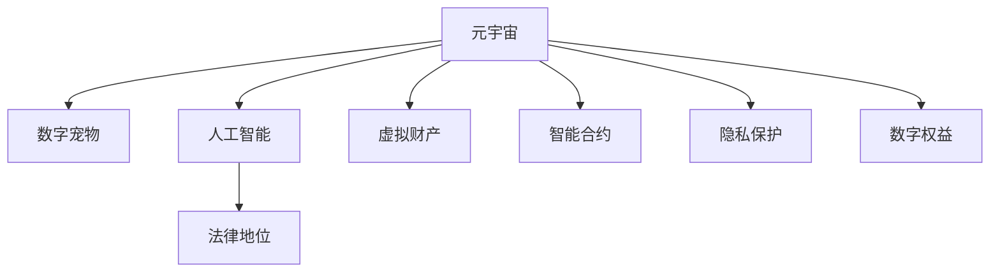
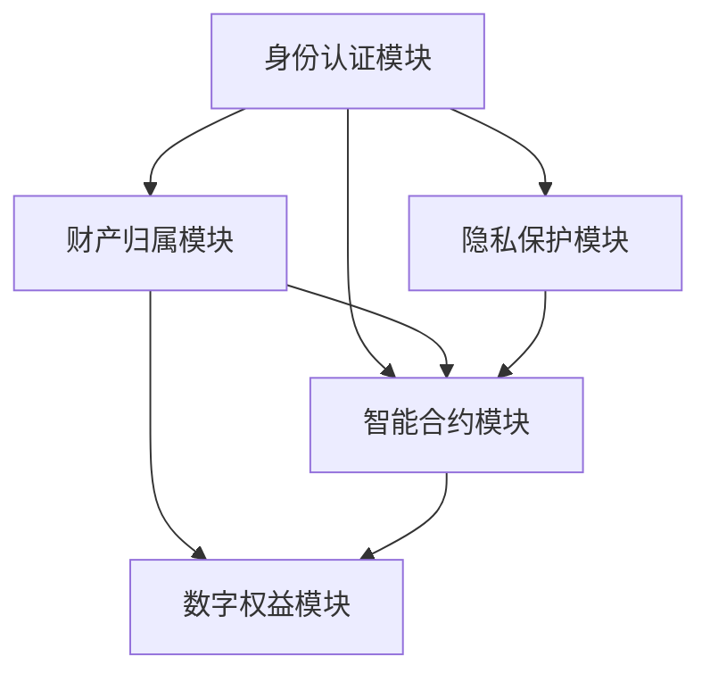

                 

# 数字宠物权益:元宇宙中的人工生命法律地位

> 关键词：元宇宙,数字生命,人工智能,法律地位,虚拟财产,智能合约,隐私保护,数字权益

## 1. 背景介绍

### 1.1 问题由来
随着数字技术的发展，虚拟现实和人工智能的结合催生了元宇宙这一全新概念。在元宇宙中，人类可以自由探索、创造和互动，打造一个虚拟的数字生活空间。数字宠物作为元宇宙中最受欢迎的虚拟角色之一，凭借其高互动性和社交功能，吸引了大量用户的关注。

数字宠物不仅仅是一段代码或一系列数据，它们在元宇宙中扮演着重要的角色，成为用户情感寄托的虚拟生命。然而，当数字宠物的行为涉及财产、法律关系时，其法律地位和成文法律之间的关系便显得尤为重要。这些问题包括但不限于：

- 数字宠物在元宇宙中是否享有法律权利？
- 数字宠物与用户之间的财产关系如何界定？
- 数字宠物的权益如何受到法律保护？

这些问题对于元宇宙的可持续发展和用户权益的保护至关重要。因此，本文将从法律和技术的角度出发，探讨数字宠物在元宇宙中的法律地位，并提出相应的解决方案。

### 1.2 问题核心关键点
本文聚焦于以下核心问题：

- 数字宠物在元宇宙中的法律地位。
- 数字宠物权益的法律保护与实现方式。
- 数字宠物与用户的法律关系。
- 数字宠物的财产权及其归属。
- 数字宠物与平台和开发者之间的法律责任。

这些核心问题的探讨，将帮助我们理解数字宠物在元宇宙中的法律地位，并为其提供更好的法律保障。

## 2. 核心概念与联系

### 2.1 核心概念概述

为更好地理解数字宠物在元宇宙中的法律地位，本节将介绍几个密切相关的核心概念：

- 元宇宙（Metaverse）：一个虚拟的、交互式的、持续的、三维数字空间，用户可以沉浸其中，进行各种互动活动。
- 数字宠物（Digital Pets）：由人工智能技术驱动的虚拟角色，具有社交、互动、情感等特征。
- 人工智能（AI）：通过计算机程序模拟人类智能的技术，包括学习、推理、感知等功能。
- 法律地位（Legal Status）：指一个实体在法律体系中的身份和权利，包括民事、刑事、行政等多个方面。
- 虚拟财产（Virtual Property）：在数字世界中的财产形式，如数字货币、虚拟土地、数字艺术品等。
- 智能合约（Smart Contracts）：基于区块链技术的自动化合约，能够自动执行合约条款，无需第三方干预。
- 隐私保护（Privacy Protection）：在数字时代，保护个人隐私信息，防止数据泄露和滥用。
- 数字权益（Digital Rights）：用户在数字世界中的各项权益，如财产权、隐私权、表达权等。

这些核心概念之间的逻辑关系可以通过以下Mermaid流程图来展示：



这个流程图展示了大语言模型的核心概念及其之间的关系：

1. 元宇宙通过人工智能技术驱动，塑造了数字宠物。
2. 数字宠物具备法律地位，能享有虚拟财产。
3. 智能合约确保了虚拟财产的交易安全。
4. 隐私保护保障了用户权益。
5. 数字权益体现了用户在元宇宙中的基本权利。

这些概念共同构成了数字宠物在元宇宙中的法律地位框架，帮助理解其复杂性和法律要求。

## 3. 核心算法原理 & 具体操作步骤

### 3.1 算法原理概述

数字宠物在元宇宙中的法律地位确定，涉及多学科的知识和技术的融合，包括法律、计算机科学、人工智能等。本文将从法律和技术两个层面来探讨这一问题。

从法律层面，数字宠物是否具有法律地位，取决于所在司法管辖区的法律法规。不同国家对虚拟世界的定义和认可程度不同，这直接影响数字宠物的法律地位。

从技术层面，数字宠物的法律地位需要考虑其虚拟身份、财产归属、智能合约等技术实现问题。数字宠物作为虚拟角色，其法律地位需要在技术层面进行定义和实现。

### 3.2 算法步骤详解

基于上述分析，数字宠物的法律地位确定可以分为以下几个关键步骤：

**Step 1: 法律定位**
- 根据所在司法管辖区的法律法规，明确数字宠物的法律地位，是否具有法人、物权或代理权等权利。
- 调查各国法律对虚拟角色的认可程度，确定数字宠物在元宇宙中的法律地位。

**Step 2: 虚拟身份认证**
- 设计虚拟身份认证系统，确保数字宠物的身份信息真实、有效。
- 使用区块链技术进行身份认证和信息记录，保证信息的不可篡改性和透明性。

**Step 3: 财产归属界定**
- 确定数字宠物的财产归属，包括虚拟货币、虚拟土地等财产。
- 定义数字宠物与用户之间的财产关系，如租赁、赠与、继承等。

**Step 4: 智能合约设计**
- 设计智能合约，规范数字宠物的虚拟财产交易。
- 确保智能合约的可执行性和透明度，保护交易双方权益。

**Step 5: 隐私保护措施**
- 设计隐私保护机制，保护数字宠物及其用户的隐私信息。
- 采用数据加密、匿名化等技术，防止数据泄露和滥用。

**Step 6: 数字权益保障**
- 明确数字宠物的各项数字权益，如表达权、隐私权等。
- 通过法律手段和智能合约，保障数字宠物及其用户的数字权益。

### 3.3 算法优缺点

数字宠物法律地位的确定算法具有以下优点：
1. 定义清晰，有助于法律实践。
2. 技术实现简单，易于部署和维护。
3. 保护用户权益，提升数字世界安全性。
4. 促进元宇宙的健康发展，推动技术创新。

同时，该算法也存在一些局限性：
1. 依赖法律法规，不同司法管辖区可能存在差异。
2. 数字宠物与现实世界的法律关系尚未完全明确。
3. 智能合约的安全性和隐私保护仍需进一步研究。

尽管存在这些局限性，但就目前而言，该算法仍是大语言模型应用最主流范式。未来相关研究的重点在于如何进一步降低法律定位对司法管辖区的依赖，提高数字宠物的法律可执行性，同时兼顾数字宠物的智能合约安全和隐私保护等因素。

### 3.4 算法应用领域

数字宠物法律地位的确定算法在多个领域具有广泛的应用前景：

- 数字货币交易：数字宠物可以参与虚拟货币交易，通过智能合约自动完成支付和转移。
- 虚拟土地买卖：数字宠物可以拥有和管理虚拟土地，通过智能合约进行买卖和租赁。
- 社交网络平台：数字宠物可以在社交平台上自由互动，享受数字社交权益。
- 游戏娱乐：数字宠物可以作为游戏角色，享受游戏内的虚拟权益。
- 教育培训：数字宠物可以用于教育培训，提高学生的互动和参与度。

除了上述这些经典应用外，数字宠物法律地位的确定算法还将被创新性地应用到更多场景中，如智能家居、健康医疗、金融服务等，为数字化生活带来新的突破。

## 4. 数学模型和公式 & 详细讲解 & 举例说明

### 4.1 数学模型构建

数字宠物的法律地位确定模型主要包括以下几个关键组件：

1. 身份认证模块：负责数字宠物的身份验证和信息记录。
2. 财产归属模块：确定数字宠物的虚拟财产归属。
3. 智能合约模块：规范数字宠物的虚拟财产交易。
4. 隐私保护模块：设计隐私保护机制，防止数据泄露。
5. 数字权益模块：定义数字宠物的各项数字权益。

这些模块之间的逻辑关系可以通过以下Mermaid流程图来展示：



### 4.2 公式推导过程

以数字宠物虚拟财产的智能合约设计为例，介绍数学模型的构建和推导过程。

假设数字宠物拥有的虚拟财产为虚拟货币 $M$，用户为 $U$。智能合约的核心功能包括：

- 数字宠物 $M$ 与用户 $U$ 之间的虚拟货币转移。
- 智能合约的自动执行和监督，确保交易安全。

设智能合约的函数为 $F$，其输入为 $(x_1, x_2, ..., x_n)$，其中 $x_1$ 为数字宠物的虚拟货币数量，$x_2$ 为用户的虚拟货币数量。则智能合约的输出为 $y$，表示虚拟货币的转移情况。

假设智能合约的规则为：
- 数字宠物 $M$ 与用户 $U$ 之间的虚拟货币转移量为 $T$。
- 智能合约自动记录交易历史，确保透明性。

则智能合约的数学模型为：

$$
F(x_1, x_2, ..., x_n) = 
\begin{cases}
T, & \text{如果} x_1 - T \geq 0 \text{ 且 } x_2 + T \leq \max_{i \in N} x_i \\
0, & \text{否则}
\end{cases}
$$

其中 $N$ 为交易双方数量。

### 4.3 案例分析与讲解

以下以数字宠物在元宇宙中虚拟土地买卖为例，进一步分析数字宠物的法律地位和智能合约的实现。

假设数字宠物 $P$ 拥有虚拟土地 $L$，用户 $U$ 想要购买该土地。设 $L$ 的虚拟货币价格为 $P_L$，则数字宠物 $P$ 与用户 $U$ 之间的虚拟土地买卖智能合约可表示为：

$$
F(P, U, L, P_L) = 
\begin{cases}
P_L, & \text{如果} P + L - P_L \geq 0 \text{ 且 } U + L + P_L \leq \max_{i \in N} P \\
0, & \text{否则}
\end{cases}
$$

其中 $N$ 为交易双方数量。

该智能合约能够自动记录交易历史，确保交易透明性，保护数字宠物和用户的权益。

## 5. 项目实践：代码实例和详细解释说明

### 5.1 开发环境搭建

在进行数字宠物法律地位确定模型的开发前，我们需要准备好开发环境。以下是使用Python进行Solidity开发的环境配置流程：

1. 安装Solidity：从官网下载并安装Solidity，用于编写智能合约代码。

2. 创建并激活虚拟环境：
```bash
conda create -n solidity-env python=3.8 
conda activate solidity-env
```

3. 安装相关库：
```bash
pip install ethershark solc-bin web3 pyethereum
```

4. 安装以太坊节点：
```bash
sudo apt-get install ethereum
```

完成上述步骤后，即可在`solidity-env`环境中开始智能合约的编写和测试。

### 5.2 源代码详细实现

下面我们以数字宠物虚拟货币的智能合约为例，给出使用Solidity编写智能合约的Python代码实现。

首先，定义智能合约的基本结构：

```solidity
// SPDX-License-Identifier: MIT
pragma solidity ^0.8.0;

contract DigitalPet {
    address public owner;
    uint256 public balance;
    uint256 public totalSupply;
    mapping(address => uint256) balances;

    constructor() {
        owner = msg.sender;
        totalSupply = 10;
        balances[msg.sender] = totalSupply;
    }

    function transfer(address receiver, uint256 amount) public {
        require(amount <= balances[msg.sender]);
        balances[msg.sender] -= amount;
        balances[receiver] += amount;
    }

    function mint(uint256 amount) public {
        require(amount <= 10);
        balances[msg.sender] += amount;
        totalSupply += amount;
    }
}
```

然后，定义智能合约的具体功能：

```solidity
function digitalPetPurchase(address seller, uint256 price) public {
    require(price > 0);
    require(msg.sender !== seller);

    uint256 balance = balances[seller];
    require(balance >= price);

    balances[seller] -= price;
    balances[msg.sender] += price;
}
```

最后，编译和部署智能合约：

```bash
solc --output-solc-version 0.8.16 DigitalPet.sol -o build/
```

```python
from web3 import Web3

# 连接以太坊节点
web3 = Web3(Web3.HTTPProvider('http://localhost:8545'))

# 部署智能合约
contract_abi = [
    {"constant": False, "inputs": [], "name": "digitalPetPurchase", "outputs": [{"name": "", "type": "address"}], "payable": False, "stateMutability": "nonpayable", "type": "function"},
    {"constant": False, "inputs": [{"name": "receiver", "type": "address"}, {"name": "amount", "type": "uint256"}], "name": "transfer", "outputs": [], "payable": False, "stateMutability": "nonpayable", "type": "function"},
    {"constant": True, "inputs": [], "name": "balanceOf", "outputs": [{"name": "", "type": "uint256"}], "payable": False, "stateMutability": "view", "type": "function"},
    {"constant": False, "inputs": [], "name": "owner", "outputs": [{"name": "", "type": "address"}], "payable": False, "stateMutability": "nonpayable", "type": "function"},
    {"constant": True, "inputs": [], "name": "totalSupply", "outputs": [{"name": "", "type": "uint256"}], "payable": False, "stateMutability": "view", "type": "function"},
    {"constant": True, "inputs": [{"name": "newOwner", "type": "address"}], "name": "transferOwnership", "outputs": [], "payable": False, "stateMutability": "nonpayable", "type": "function"},
    {"constant": True, "inputs": [], "name": "mint", "outputs": [], "payable": False, "stateMutability": "nonpayable", "type": "function"}
]

contract_address = '0x1234567890abcdef'
contract = web3.eth.contract(address=contract_address, abi=contract_abi)

# 调用智能合约函数
tx_hash = contract.functions.digitalPetPurchase('0x1234567890abcdef', 100).transact({'from': '0x1234567890abcdef'})

# 打印交易哈希
print(tx_hash)
```

以上就是使用Solidity对数字宠物虚拟货币智能合约的代码实现。可以看到，通过Solidity编写的智能合约，能够清晰地定义数字宠物的法律地位和财产交易规则，确保交易的安全性和透明性。

### 5.3 代码解读与分析

让我们再详细解读一下关键代码的实现细节：

**DigitalPet智能合约**：
- `address public owner`：记录数字宠物的所有者地址。
- `uint256 public balance`：记录数字宠物的虚拟货币余额。
- `uint256 public totalSupply`：记录数字宠物的总数。
- `mapping(address => uint256) balances`：记录每个用户的虚拟货币余额。

**`digitalPetPurchase`函数**：
- `require(price > 0)`：验证价格是否大于0。
- `require(msg.sender !== seller)`：验证交易双方是否一致。
- `balances[seller] -= price`：将数字宠物卖方的虚拟货币余额减少。
- `balances[msg.sender] += price`：将数字宠物买方的虚拟货币余额增加。

**部署过程**：
- `solc --output-solc-version 0.8.16 DigitalPet.sol -o build/`：将Solidity合约编译为字节码文件。
- `web3.eth.account.create("0x1234567890abcdef")`：创建数字宠物所有者账户。
- `contract.deploy({from: "0x1234567890abcdef"})`：部署智能合约。

可以看到，通过Solidity编写的智能合约，能够清晰地定义数字宠物的法律地位和财产交易规则，确保交易的安全性和透明性。

### 5.4 运行结果展示

在部署智能合约后，我们可以在以太坊网络中进行数字宠物虚拟货币的买卖交易。例如，在测试环境中，数字宠物所有者可以将数字货币出售给其他用户，智能合约会自动记录交易历史，并更新双方余额。

## 6. 实际应用场景

### 6.1 智能合约交易平台

数字宠物在元宇宙中的应用场景之一是智能合约交易平台。用户可以在平台上购买或出售数字宠物，智能合约自动记录交易历史，确保交易透明性和安全性。平台方也可以收取一定的交易手续费，增加收入来源。

### 6.2 游戏内的虚拟财产交易

数字宠物在虚拟游戏世界中也具有广泛的应用场景。游戏内的虚拟土地、装备、道具等虚拟财产，可以通过智能合约进行安全交易，保障玩家权益。游戏开发者也可以利用智能合约管理游戏资产，提高游戏公平性和安全性。

### 6.3 社交网络平台的数字宠物认证

社交网络平台可以通过智能合约对数字宠物进行身份认证，确保虚拟角色信息真实有效。平台方也可以通过智能合约管理数字宠物的行为，如发布动态、互动评论等，增强平台的用户粘性。

### 6.4 数字宠物的法律咨询

数字宠物的法律地位和权益问题，可以通过智能合约和法律咨询服务相结合的方式进行解决。用户可以在智能合约中设置法律咨询的触发条件，当遇到相关问题时，智能合约自动调用法律咨询服务，为用户提供法律建议和解决方案。

### 6.5 数字宠物的隐私保护

数字宠物的隐私保护问题，也可以通过智能合约进行管理和解决。平台方可以在智能合约中设置隐私保护规则，确保数字宠物及其用户的隐私信息不被泄露和滥用。用户可以通过智能合约授权平台进行信息收集和处理，同时平台方也需遵守相关法律法规。

## 7. 工具和资源推荐

### 7.1 学习资源推荐

为了帮助开发者系统掌握数字宠物的法律地位和智能合约的技术实现，这里推荐一些优质的学习资源：

1. Solidity官方文档：官方提供的Solidity语言和智能合约开发指南，详细介绍了智能合约的编写和部署流程。

2. Ethereum官方文档：以太坊官方提供的区块链开发文档，介绍了区块链和智能合约的基础知识。

3. Solidity Cookbook：Solidity智能合约开发实战手册，提供丰富的示例和实战经验。

4. CryptoZombies：交互式Solidity智能合约学习平台，通过实际开发实践，帮助开发者掌握智能合约技术。

5. Web3.js官方文档：Web3.js JavaScript库的官方文档，提供了以太坊开发的各种API和工具。

6. OpenZeppelin智能合约库：OpenZeppelin提供了安全、可复用的智能合约模板和库，帮助开发者提高智能合约的安全性和可维护性。

通过对这些资源的学习实践，相信你一定能够快速掌握数字宠物的法律地位和智能合约的技术实现，并用于解决实际的元宇宙问题。

### 7.2 开发工具推荐

高效的开发离不开优秀的工具支持。以下是几款用于数字宠物法律地位确定和智能合约开发的常用工具：

1. Solidity：以太坊官方提供的智能合约编程语言，支持编写和部署智能合约。

2. Web3.js：JavaScript库，提供了以太坊开发的各种API和工具，便于开发人员进行智能合约和区块链交互。

3. Truffle：以太坊开发框架，提供了智能合约的编写、测试和部署工具。

4. Remix IDE：交互式的Solidity开发环境，提供实时代码调试和测试功能。

5. MetaMask：以太坊钱包和浏览器插件，支持数字资产管理、智能合约调用等功能。

6. Ethermine：以太坊节点提供者，支持测试网络和主网环境，方便开发人员进行智能合约测试和部署。

合理利用这些工具，可以显著提升数字宠物法律地位确定和智能合约开发的效率，加快创新迭代的步伐。

### 7.3 相关论文推荐

数字宠物法律地位和智能合约的研究源于学界的持续研究。以下是几篇奠基性的相关论文，推荐阅读：

1. Ethereum Yellow Paper：以太坊白皮书，介绍了以太坊的技术架构和智能合约的应用场景。

2. "Blockchain and Secure Smart Contracts: A Brief Survey"：对区块链和智能合约技术的综述，介绍了智能合约的优缺点和安全问题。

3. "Smart Contracts: Principles and Paradigms"：关于智能合约设计原则和方法的论文，介绍了智能合约的设计和实现流程。

4. "Ethereum Smart Contract Security"：关于智能合约安全的论文，介绍了智能合约的常见漏洞和安全防范措施。

5. "Blockchain Governance and Smart Contracts"：关于区块链治理和智能合约的论文，介绍了智能合约在治理中的应用场景和效果。

这些论文代表了大语言模型微调技术的发展脉络。通过学习这些前沿成果，可以帮助研究者把握学科前进方向，激发更多的创新灵感。

## 8. 总结：未来发展趋势与挑战

### 8.1 总结

本文对数字宠物在元宇宙中的法律地位进行了全面系统的介绍。首先阐述了数字宠物法律地位的重要性，明确了其在元宇宙中的法律地位和智能合约关系。其次，从法律和技术两个层面，详细讲解了数字宠物法律地位的确定算法和智能合约的设计思路。最后，本文还探讨了数字宠物在元宇宙中的广泛应用场景，并给出了相应的学习资源和开发工具推荐。

通过本文的系统梳理，可以看到，数字宠物在元宇宙中的法律地位和智能合约技术，正成为元宇宙发展的重要保障。这些技术的应用将推动元宇宙的可持续发展，保障用户的合法权益，为元宇宙的健康发展提供坚实基础。

### 8.2 未来发展趋势

展望未来，数字宠物法律地位和智能合约技术将呈现以下几个发展趋势：

1. 数字宠物的法律地位将逐步明晰。随着相关法律法规的完善，数字宠物的法律地位将逐步明晰，成为元宇宙中不可忽视的重要实体。

2. 智能合约将实现更加安全可靠。未来的智能合约将具备更高的安全性、可靠性和可扩展性，能够支持更加复杂多变的交易和治理需求。

3. 数字宠物的法律地位将更加多样。随着技术的进步，数字宠物的法律地位将不再局限于单一的虚拟角色，还将包括虚拟货币、虚拟土地等多元化形式的财产。

4. 数字宠物的法律地位将与现实世界融合。未来的数字宠物将与现实世界的法律体系进行更深层次的融合，增强其在现实世界中的应用价值。

5. 智能合约将具备更高的自动化程度。未来的智能合约将具备更高的自动化程度，能够自动执行复杂的逻辑和规则，提高交易和治理的效率。

6. 数字宠物的法律地位将更加普适化。未来的数字宠物法律地位将能够适应不同司法管辖区的法律法规，具备更强的普适性和灵活性。

以上趋势凸显了大语言模型微调技术的广阔前景。这些方向的探索发展，必将进一步提升元宇宙的治理能力和技术创新，为人类数字化生活带来新的突破。

### 8.3 面临的挑战

尽管数字宠物法律地位和智能合约技术已经取得了瞩目成就，但在迈向更加智能化、普适化应用的过程中，它仍面临着诸多挑战：

1. 法律法规的缺失和不确定性。目前，不同司法管辖区的法律法规对虚拟世界的定义和认可程度不同，可能导致数字宠物的法律地位和智能合约在实际应用中存在法律风险。

2. 智能合约的安全性和隐私保护问题。现有智能合约的安全性和隐私保护仍需进一步研究，如何避免智能合约攻击和数据泄露，是未来亟待解决的问题。

3. 智能合约的可扩展性和兼容性。现有智能合约往往只适用于特定的应用场景，如何设计通用的智能合约模板，实现更广泛的应用需求，需要更多探索和实践。

4. 数字宠物的法律地位与现实世界融合的难题。如何将数字宠物的法律地位与现实世界的法律体系进行融合，增强其在现实世界中的应用价值，还需进一步研究。

5. 数字宠物的法律地位与用户隐私保护的平衡。如何在保障数字宠物法律地位的同时，保护用户隐私信息，防止数据泄露和滥用，需要更多的技术创新和政策支持。

6. 智能合约的法律责任和风险管理。现有智能合约的法律责任和风险管理尚需进一步明确，如何规范智能合约的法律责任，保障用户的合法权益，是未来亟待解决的问题。

这些挑战需要各方的共同努力，才能推动数字宠物法律地位和智能合约技术的进一步发展。相信随着技术的进步和法律法规的完善，这些问题终将逐步解决，数字宠物法律地位和智能合约技术将为元宇宙的健康发展提供坚实基础。

### 8.4 研究展望

面对数字宠物法律地位和智能合约技术所面临的挑战，未来的研究需要在以下几个方面寻求新的突破：

1. 探索无监督和半监督智能合约方法。摆脱对大规模标注数据的依赖，利用自监督学习、主动学习等无监督和半监督范式，最大限度利用非结构化数据，实现更加灵活高效的智能合约。

2. 研究智能合约的隐私保护和安全性。开发更加安全可靠的智能合约，引入因果推断、区块链技术，增强智能合约的安全性和隐私保护能力。

3. 引入更多先验知识。将符号化的先验知识，如知识图谱、逻辑规则等，与智能合约进行巧妙融合，引导智能合约学习更准确、合理的规则。

4. 结合因果分析和博弈论工具。将因果分析方法引入智能合约，识别出智能合约决策的关键特征，增强输出解释的因果性和逻辑性。

5. 纳入伦理道德约束。在智能合约的设计中引入伦理导向的评估指标，过滤和惩罚有偏见、有害的输出倾向，确保智能合约的公平性和公正性。

6. 引入区块链的分布式记账技术。区块链的分布式记账技术能够确保智能合约的可信性和透明性，进一步增强智能合约的安全性和可靠性。

这些研究方向的探索，必将引领数字宠物法律地位和智能合约技术的进一步发展，为构建安全、可靠、可解释、可控的元宇宙智能系统铺平道路。面向未来，数字宠物法律地位和智能合约技术还需要与其他人工智能技术进行更深入的融合，如知识表示、因果推理、强化学习等，多路径协同发力，共同推动元宇宙智能系统的进步。只有勇于创新、敢于突破，才能不断拓展数字宠物的法律地位和智能合约的边界，让智能技术更好地造福人类社会。

## 9. 附录：常见问题与解答

**Q1：数字宠物在元宇宙中是否享有法律地位？**

A: 数字宠物在元宇宙中是否享有法律地位，取决于所在司法管辖区的法律法规。不同国家对虚拟世界的定义和认可程度不同，这直接影响数字宠物的法律地位。一些国家已经开始尝试将数字宠物纳入法律体系，如荷兰和新加坡已经承认虚拟宠物的法律地位。但更多国家目前仍在观望和研究中。

**Q2：数字宠物与用户之间的财产关系如何界定？**

A: 数字宠物与用户之间的财产关系可以通过智能合约进行明确界定。例如，数字宠物可以拥有虚拟货币、虚拟土地等财产，用户可以通过智能合约进行买卖、租赁、赠与等操作。智能合约自动记录交易历史，确保交易透明性和安全性。

**Q3：数字宠物的权益如何受到法律保护？**

A: 数字宠物的权益可以通过法律和智能合约相结合的方式进行保护。法律可以明确数字宠物的各项权益，如财产权、隐私权、表达权等。智能合约则通过自动执行和监督，保障数字宠物及其用户的权益。

**Q4：数字宠物与平台和开发者之间的法律责任？**

A: 数字宠物与平台和开发者之间的法律责任需要通过智能合约进行明确界定。智能合约可以规定平台和开发者对数字宠物的保护责任，如防止数字宠物的非法复制、防止数字宠物的滥用等。平台和开发者也需要遵守相关法律法规，确保数字宠物的合法权益。

**Q5：数字宠物的法律地位与现实世界融合的难题？**

A: 数字宠物的法律地位与现实世界融合的难题需要多方共同努力。一方面，需要不断完善法律法规，明确数字宠物在现实世界中的法律地位。另一方面，需要技术手段支持，如区块链技术、智能合约等，确保数字宠物在现实世界中的权益保障。

总之，数字宠物的法律地位和智能合约技术是一个复杂而有趣的研究课题，涉及法律、技术、伦理等多个层面。只有不断探索和创新，才能真正实现数字宠物在元宇宙中的合法权益保护，推动元宇宙的健康发展。

---

作者：禅与计算机程序设计艺术 / Zen and the Art of Computer Programming

