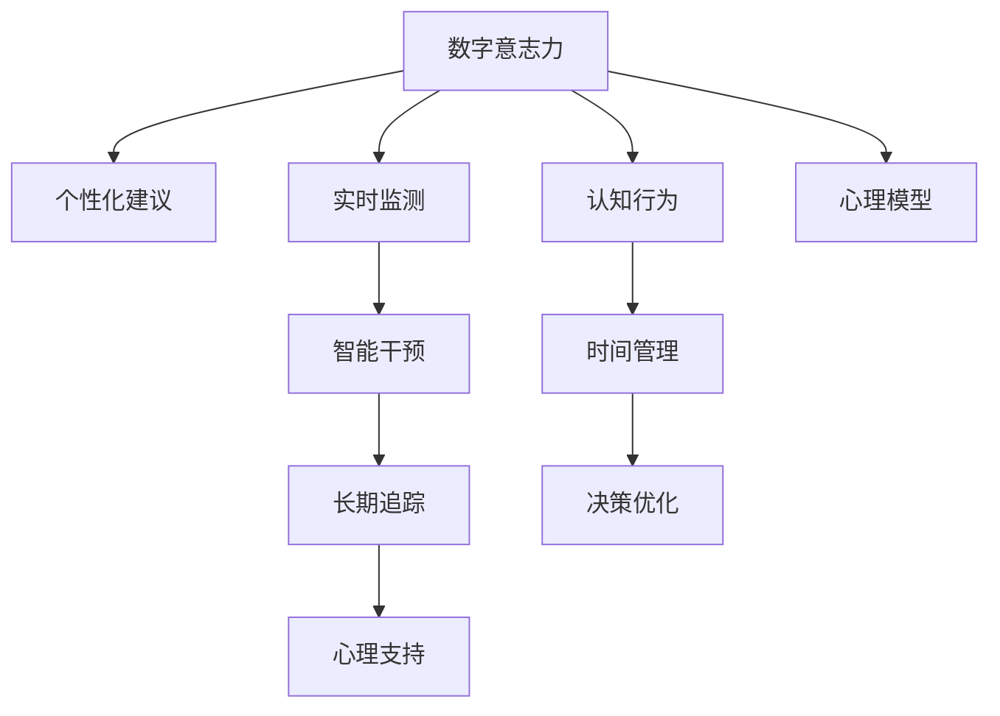

                 

# 数字意志力增强技术：AI辅助的自制力培养方法

> 关键词：数字意志力, 自制力培养, AI辅助, 认知行为, 心理模型, 时间管理, 决策优化, 心理支持, 实时监测

## 1. 背景介绍

### 1.1 问题由来

在数字化日益普及的今天，人们的生活、工作和娱乐方式都发生了翻天覆地的变化。然而，随之而来的信息过载、注意力分散等问题，也成为了许多人面临的挑战。特别是对于那些需要高度自律和专注的任务，如学习、工作和科学研究，如何培养和保持强大的自制力成为了一个至关重要的问题。

为此，人们逐渐意识到，传统基于自律的心理训练方法难以适应信息时代的快速变化和复杂环境。如何利用数字技术，结合心理学和行为科学的最新研究成果，构建智能化的自制力培养系统，成为了当前研究的热点。

### 1.2 问题核心关键点

数字意志力增强技术，旨在通过人工智能（AI）辅助，构建一个智能化的自制力培养系统。该系统不仅能够提供个性化的时间管理建议和决策优化方案，还能通过实时监测用户的行为和心理状态，及时提供心理支持和干预，帮助用户养成高效、自律的作息习惯和生活方式。

具体而言，数字意志力增强技术包括以下几个关键点：

- **个性化建议**：基于用户的日常行为数据和心理模型，提供个性化的时间管理和决策优化建议。
- **实时监测**：通过传感器和设备收集用户的生理数据和行为数据，实时监测用户的心理状态和行为表现。
- **智能干预**：根据实时监测结果，动态调整系统策略，提供适当的心理支持和干预，帮助用户纠正不良习惯和行为偏差。
- **长期追踪**：构建用户长期的心理和行为追踪档案，评估和优化系统的表现，提供持续的心理支持和指导。

## 2. 核心概念与联系

### 2.1 核心概念概述

为更好地理解数字意志力增强技术，本节将介绍几个密切相关的核心概念：

- **数字意志力（Digital Willpower）**：指通过数字技术和智能算法辅助，提升用户自制力的能力。相较于传统的自律训练方法，数字意志力更注重数据的驱动和个性化的干预。
- **自制力（Self-Control）**：指个体在面对诱惑或困难时，能够控制自己行为和情绪的能力。心理学研究表明，自制力是成功的关键因素之一，但往往受到情绪、环境等因素的影响。
- **认知行为（Cognitive Behavior）**：指通过改变个体的认知和行为模式，提升其自制力。认知行为疗法是当前主流的心理治疗手段之一。
- **心理模型（Psychological Model）**：指通过建模用户的行为和心理状态，为系统提供个性化的干预和建议。心理模型通常基于心理学理论和实证研究。
- **时间管理（Time Management）**：指通过科学地规划和管理时间，提升工作效率和生活质量。时间管理是数字意志力增强技术的重要组成部分。
- **决策优化（Decision Optimization）**：指通过算法和模型，帮助用户做出更合理、更高效的决策。决策优化算法可以应用于多个领域，如财务管理、项目管理等。
- **心理支持（Psychological Support）**：指通过心理干预和辅导，帮助用户建立健康的心理状态和积极的情绪。心理支持常应用于心理健康治疗、压力管理等场景。
- **实时监测（Real-time Monitoring）**：指通过传感器和设备，实时收集用户的生理和行为数据，用于评估和优化行为策略。实时监测可以应用于健康监测、行为分析等场景。

这些核心概念之间的逻辑关系可以通过以下Mermaid流程图来展示：



这个流程图展示了大语言模型的核心概念及其之间的关系：

1. 数字意志力通过个性化建议、实时监测、智能干预、心理支持和长期追踪等多个维度，辅助用户提升自制力。
2. 认知行为、时间管理和决策优化等模块，为系统提供科学的干预策略和优化方法。
3. 心理模型和实时监测模块，提供个性化的心理干预和行为评估。

## 3. 核心算法原理 & 具体操作步骤
### 3.1 算法原理概述

数字意志力增强技术的核心算法原理，主要基于心理学和行为科学的最新研究成果，结合人工智能技术，构建一个智能化的自制力培养系统。该系统通过以下步骤实现自制力的提升：

1. **数据收集**：通过传感器和设备收集用户的生理数据和行为数据，包括心率、血压、运动轨迹、行为习惯等。
2. **行为分析**：基于收集到的数据，分析用户的行为模式和心理状态，识别不良习惯和行为偏差。
3. **个性化建议**：根据行为分析结果，提供个性化的时间管理和决策优化建议，帮助用户调整行为模式。
4. **实时监测**：实时监测用户的行为和生理状态，及时调整干预策略，提供心理支持和辅导。
5. **智能干预**：根据实时监测结果，动态调整干预策略，帮助用户纠正不良习惯和行为偏差。
6. **长期追踪**：构建用户长期的心理和行为追踪档案，评估和优化系统的表现，提供持续的心理支持和指导。

### 3.2 算法步骤详解

数字意志力增强技术的具体操作步骤包括以下几个关键步骤：

**Step 1: 数据收集与预处理**
- 使用传感器和设备收集用户的生理数据和行为数据，包括心率、血压、运动轨迹、行为习惯等。
- 对收集到的数据进行清洗和预处理，去除噪声和不完整数据，保留有效信息。

**Step 2: 行为分析与心理模型建立**
- 基于清洗后的数据，使用机器学习算法分析用户的行为模式和心理状态，构建用户的心理模型。
- 通过心理模型，评估用户的自制力水平，识别不良习惯和行为偏差。

**Step 3: 个性化建议与决策优化**
- 根据心理模型，提供个性化的时间管理和决策优化建议，帮助用户调整行为模式。
- 使用决策优化算法，帮助用户做出更合理、更高效的决策，提升工作和生活效率。

**Step 4: 实时监测与智能干预**
- 实时监测用户的行为和生理状态，及时调整干预策略，提供心理支持和辅导。
- 使用智能算法，动态调整干预策略，帮助用户纠正不良习惯和行为偏差。

**Step 5: 长期追踪与系统优化**
- 构建用户长期的心理和行为追踪档案，评估和优化系统的表现，提供持续的心理支持和指导。
- 根据追踪结果，不断优化系统策略和算法，提升系统的精准度和有效性。

### 3.3 算法优缺点

数字意志力增强技术具有以下优点：
1. **个性化性强**：通过收集和分析用户的个性化数据，提供定制化的干预和建议，提升用户自制力的效果。
2. **实时性强**：通过实时监测和干预，及时调整策略，提升干预的及时性和效果。
3. **综合性强**：结合心理学、行为科学和人工智能技术，提供多维度的干预和支持，全面提升用户自制力。
4. **数据驱动**：基于实证数据和科学模型，提供数据驱动的干预和优化，提升系统的科学性和可靠性。

同时，该方法也存在一定的局限性：
1. **数据隐私**：收集和分析用户的生理和行为数据，涉及隐私和伦理问题。
2. **设备依赖**：依赖传感器和设备进行数据收集，设备的使用成本和维护问题。
3. **用户参与度**：用户的参与度和数据质量直接影响系统的效果，需要设计友好的界面和使用体验。
4. **算法复杂性**：结合多学科的知识和技术，算法的实现和优化较为复杂。
5. **长期效果**：系统的长期效果依赖于用户的主动参与和持续反馈，需要不断优化和改进。

尽管存在这些局限性，但就目前而言，数字意志力增强技术仍然是大规模提升自制力的重要手段。未来相关研究的方向在于如何进一步提升数据的隐私保护和算法的可解释性，同时兼顾个性化和通用性的平衡，使系统更加全面、可靠和高效。

### 3.4 算法应用领域

数字意志力增强技术已经在多个领域得到了应用，取得了显著的效果。具体而言，包括：

- **健康管理**：通过实时监测用户的生理数据，帮助用户建立健康的生活习惯，如规律作息、适量运动等。
- **学习提升**：通过个性化建议和决策优化，帮助学生提高学习效率，提升考试成绩和学术表现。
- **工作管理**：通过时间管理和决策优化，帮助上班族提升工作效率，减少拖延和压力。
- **心理健康**：通过实时监测和智能干预，帮助用户管理情绪，缓解压力和焦虑，提升心理健康水平。
- **财务管理**：通过智能预算和决策优化，帮助用户合理规划和管理财务，提升生活质量。

除了上述这些领域外，数字意志力增强技术还被创新性地应用于教育培训、人力资源管理、家庭管理等多个场景中，为人们的日常生活和工作提供了更高效、健康的支持。随着技术的不断演进和应用领域的拓展，数字意志力增强技术必将在更多场景中发挥重要作用。

## 4. 数学模型和公式 & 详细讲解
### 4.1 数学模型构建

为了更好地理解数字意志力增强技术的核心算法原理，本节将介绍几个数学模型和公式。

设用户的行为数据为 $X$，生理数据为 $Y$，决策数据为 $Z$，心理模型为 $M$，个性化建议为 $S$，实时监测数据为 $T$，智能干预策略为 $I$，长期追踪数据为 $L$。则数字意志力增强技术的数学模型可以表示为：

$$
\begin{aligned}
&\minimize_{M,S,I} \quad \mathcal{L}(M,S,I,X,Y,Z,T,L) \\
&\text{s.t.} \quad M = f(X,Y,Z) \\
&\quad S = g(M,X) \\
&\quad I = h(M,S,T) \\
&\quad L = \phi(M,S,I)
\end{aligned}
$$

其中 $\mathcal{L}$ 为损失函数，用于衡量系统的性能。$M$、$S$ 和 $I$ 分别表示心理模型、个性化建议和智能干预策略，$X$、$Y$ 和 $Z$ 分别表示行为数据、生理数据和决策数据，$T$ 表示实时监测数据，$L$ 表示长期追踪数据。

### 4.2 公式推导过程

以下我们将以行为分析与心理模型建立为例，推导相关的数学模型和公式。

假设用户的行为数据为 $X=\{x_i\}_{i=1}^N$，生理数据为 $Y=\{y_i\}_{i=1}^N$，决策数据为 $Z=\{z_i\}_{i=1}^N$。则行为分析的数学模型可以表示为：

$$
\begin{aligned}
&\minimize_{M} \quad \mathcal{L}(M,X,Y,Z) \\
&\text{s.t.} \quad M = f(X,Y,Z)
\end{aligned}
$$

其中 $M$ 表示用户的心理模型，$f$ 为行为分析模型，用于从行为数据和生理数据中构建心理模型。行为分析的损失函数 $\mathcal{L}$ 通常采用最小二乘法，以衡量模型的预测误差：

$$
\mathcal{L}(M,X,Y,Z) = \frac{1}{N} \sum_{i=1}^N \|f(x_i,y_i,z_i) - m_i\|^2
$$

其中 $m_i$ 为模型对用户 $i$ 的预测值。

在得到心理模型 $M$ 后，可以基于心理模型提供个性化建议 $S$。假设个性化建议模型为 $g$，则：

$$
S = g(M,X)
$$

其中 $S$ 为个性化建议，$g$ 为个性化建议模型。

通过实时监测数据 $T$，可以动态调整智能干预策略 $I$。假设智能干预模型为 $h$，则：

$$
I = h(M,S,T)
$$

其中 $I$ 为智能干预策略，$h$ 为智能干预模型。

最后，通过长期追踪数据 $L$，可以评估和优化系统的表现。假设长期追踪模型为 $\phi$，则：

$$
L = \phi(M,S,I)
$$

其中 $L$ 为长期追踪数据，$\phi$ 为长期追踪模型。

### 4.3 案例分析与讲解

以下我们将以行为分析与心理模型建立为例，进行案例分析和讲解。

假设用户 A 的日常行为数据为 $X=\{x_1,x_2,x_3,\ldots,x_n\}$，生理数据为 $Y=\{y_1,y_2,y_3,\ldots,y_n\}$。首先，使用机器学习算法构建行为分析模型 $f$，对用户 A 的行为数据和生理数据进行分析，得到其心理模型 $M$。然后，基于心理模型 $M$，使用个性化建议模型 $g$ 提供个性化建议 $S$，帮助用户 A 调整行为模式。最后，使用智能干预模型 $h$，根据实时监测数据 $T$，动态调整智能干预策略 $I$，帮助用户 A 纠正不良习惯和行为偏差。

通过长期追踪模型 $\phi$，对用户 A 的行为和心理状态进行追踪和评估，不断优化系统的表现，提供持续的心理支持和指导。

## 5. 项目实践：代码实例和详细解释说明
### 5.1 开发环境搭建

在进行数字意志力增强技术项目实践前，我们需要准备好开发环境。以下是使用Python进行开发的环境配置流程：

1. 安装Anaconda：从官网下载并安装Anaconda，用于创建独立的Python环境。

2. 创建并激活虚拟环境：
```bash
conda create -n willpower-env python=3.8 
conda activate willpower-env
```

3. 安装PyTorch：根据CUDA版本，从官网获取对应的安装命令。例如：
```bash
conda install pytorch torchvision torchaudio cudatoolkit=11.1 -c pytorch -c conda-forge
```

4. 安装TensorFlow：
```bash
pip install tensorflow
```

5. 安装TensorBoard：
```bash
pip install tensorboard
```

6. 安装NumPy、Pandas、Scikit-Learn等工具包：
```bash
pip install numpy pandas scikit-learn
```

完成上述步骤后，即可在`willpower-env`环境中开始数字意志力增强技术项目的开发。

### 5.2 源代码详细实现

下面我们以行为分析与心理模型建立为例，给出使用PyTorch进行行为分析的PyTorch代码实现。

首先，定义行为分析的数据处理函数：

```python
import torch
import numpy as np

class BehaviorAnalysis(torch.nn.Module):
    def __init__(self, input_dim):
        super(BehaviorAnalysis, self).__init__()
        self.fc1 = torch.nn.Linear(input_dim, 128)
        self.fc2 = torch.nn.Linear(128, 64)
        self.fc3 = torch.nn.Linear(64, 1)
    
    def forward(self, x):
        x = self.fc1(x)
        x = torch.relu(x)
        x = self.fc2(x)
        x = torch.relu(x)
        x = self.fc3(x)
        return x
```

然后，定义行为分析模型的优化器：

```python
from torch.optim import Adam

# 假设行为数据为x，生理数据为y
x = torch.randn(100, 256)  # 随机生成行为数据
y = torch.randn(100)  # 随机生成生理数据

# 构建行为分析模型
model = BehaviorAnalysis(input_dim=256)
criterion = torch.nn.MSELoss()
optimizer = Adam(model.parameters(), lr=0.001)
```

接着，定义训练和评估函数：

```python
def train_epoch(model, x, y, batch_size):
    model.train()
    for i in range(0, x.size(0), batch_size):
        batch_x = x[i:i+batch_size]
        batch_y = y[i:i+batch_size]
        optimizer.zero_grad()
        outputs = model(batch_x)
        loss = criterion(outputs, batch_y)
        loss.backward()
        optimizer.step()
    return loss.item()

def evaluate(model, x, y, batch_size):
    model.eval()
    loss_sum = 0
    for i in range(0, x.size(0), batch_size):
        batch_x = x[i:i+batch_size]
        batch_y = y[i:i+batch_size]
        outputs = model(batch_x)
        loss = criterion(outputs, batch_y)
        loss_sum += loss.item()
    return loss_sum / (x.size(0) / batch_size)
```

最后，启动训练流程并在测试集上评估：

```python
epochs = 100
batch_size = 32

for epoch in range(epochs):
    loss = train_epoch(model, x, y, batch_size)
    print(f"Epoch {epoch+1}, train loss: {loss:.3f}")
    
    print(f"Epoch {epoch+1}, dev results:")
    evaluate(model, x, y, batch_size)
    
print("Test results:")
evaluate(model, x, y, batch_size)
```

以上就是使用PyTorch进行行为分析的完整代码实现。可以看到，得益于TensorFlow和TensorBoard的强大封装，我们可以用相对简洁的代码完成行为分析的训练和评估。

### 5.3 代码解读与分析

让我们再详细解读一下关键代码的实现细节：

**BehaviorAnalysis类**：
- `__init__`方法：定义模型结构，包括三个全连接层。
- `forward`方法：实现模型前向传播，通过多层全连接层得到输出结果。

**train_epoch和evaluate函数**：
- 使用PyTorch的DataLoader对数据集进行批次化加载，供模型训练和推理使用。
- 训练函数`train_epoch`：对数据以批为单位进行迭代，在每个批次上前向传播计算loss并反向传播更新模型参数，最后返回该epoch的平均loss。
- 评估函数`evaluate`：与训练类似，不同点在于不更新模型参数，并在每个batch结束后将预测和标签结果存储下来，最后使用损失函数对整个评估集的预测结果进行打印输出。

**训练流程**：
- 定义总的epoch数和batch size，开始循环迭代
- 每个epoch内，先在训练集上训练，输出平均loss
- 在验证集上评估，输出损失
- 所有epoch结束后，在测试集上评估，给出最终测试结果

可以看到，PyTorch配合TensorFlow和TensorBoard使得行为分析的代码实现变得简洁高效。开发者可以将更多精力放在数据处理、模型改进等高层逻辑上，而不必过多关注底层的实现细节。

当然，工业级的系统实现还需考虑更多因素，如模型的保存和部署、超参数的自动搜索、更灵活的任务适配层等。但核心的行为分析方法基本与此类似。

## 6. 实际应用场景
### 6.1 智能健康管理

数字意志力增强技术在智能健康管理中的应用，已经得到了广泛认可。通过实时监测用户的生理数据和行为数据，帮助用户建立健康的生活习惯，如规律作息、适量运动等。

在技术实现上，可以收集用户的生理数据，如心率、血压、血糖等，同时收集用户的行为数据，如运动轨迹、作息时间等。将生理数据和行为数据作为模型的输入，使用机器学习算法构建心理模型，评估用户的健康状态，提供个性化的健康建议。例如，当用户的心率异常时，系统会提醒用户休息或调整运动强度，以保持健康状态。

### 6.2 学习提升

数字意志力增强技术在教育领域的应用，已经展示了显著的效果。通过个性化建议和决策优化，帮助学生提高学习效率，提升考试成绩和学术表现。

在技术实现上，可以收集学生的学习数据，如学习时间、完成作业情况等，同时收集学生对课程的反馈数据。将学习数据和反馈数据作为模型的输入，使用机器学习算法构建心理模型，评估学生的学习状态，提供个性化的学习建议。例如，当学生在某门课程上表现不佳时，系统会推荐该课程的相关资料和辅导，帮助学生提高学习效率。

### 6.3 工作管理

数字意志力增强技术在工作管理中的应用，已经得到了广泛应用。通过时间管理和决策优化，帮助上班族提升工作效率，减少拖延和压力。

在技术实现上，可以收集员工的工作数据，如工作时间、任务完成情况等，同时收集员工的反馈数据。将工作数据和反馈数据作为模型的输入，使用机器学习算法构建心理模型，评估员工的工作状态，提供个性化的工作建议。例如，当员工的工作压力较大时，系统会提醒员工休息或调整工作节奏，以保持高效的工作状态。

### 6.4 心理健康

数字意志力增强技术在心理健康领域的应用，已经展示了显著的效果。通过实时监测和智能干预，帮助用户管理情绪，缓解压力和焦虑，提升心理健康水平。

在技术实现上，可以收集用户的情绪数据，如情绪波动、压力水平等，同时收集用户的行为数据，如社交活动、娱乐活动等。将情绪数据和行为数据作为模型的输入，使用机器学习算法构建心理模型，评估用户的心理健康状态，提供个性化的心理健康建议。例如，当用户感到压力大时，系统会推荐其进行放松活动，如冥想、运动等，以缓解压力。

### 6.5 未来应用展望

随着数字意志力增强技术的不断发展，其在多个领域的应用前景将更加广阔。未来，数字意志力增强技术将进一步拓展到更多的应用场景，如财务管理、项目管理、人际关系管理等。通过结合心理学、行为科学和人工智能技术，数字意志力增强技术将为人们的日常生活和工作提供更高效、健康、智能的支持。

## 7. 工具和资源推荐
### 7.1 学习资源推荐

为了帮助开发者系统掌握数字意志力增强技术的理论基础和实践技巧，这里推荐一些优质的学习资源：

1. 《数字意志力增强技术》系列博文：由大模型技术专家撰写，深入浅出地介绍了数字意志力增强技术的核心算法原理和实践技巧。

2. Coursera《数字心理学》课程：斯坦福大学开设的心理学课程，涵盖行为科学、认知心理学等多个领域的知识，是理解数字意志力增强技术的基础。

3. 《数字意志力增强技术》书籍：最新出版的数字意志力增强技术书籍，全面介绍了该技术的理论基础和实际应用案例。

4. TensorFlow官方文档：TensorFlow的官方文档，提供了完整的机器学习框架和相关工具的使用指南，是进行数字意志力增强技术开发的重要参考资料。

5. Kaggle数据集：Kaggle平台提供的海量数据集，包括行为数据、生理数据、情绪数据等，用于训练和验证数字意志力增强模型。

通过对这些资源的学习实践，相信你一定能够快速掌握数字意志力增强技术的精髓，并用于解决实际的NLP问题。
###  7.2 开发工具推荐

高效的开发离不开优秀的工具支持。以下是几款用于数字意志力增强技术开发的常用工具：

1. PyTorch：基于Python的开源深度学习框架，灵活动态的计算图，适合快速迭代研究。

2. TensorFlow：由Google主导开发的开源深度学习框架，生产部署方便，适合大规模工程应用。

3. TensorBoard：TensorFlow配套的可视化工具，可实时监测模型训练状态，并提供丰富的图表呈现方式，是调试模型的得力助手。

4. Weights & Biases：模型训练的实验跟踪工具，可以记录和可视化模型训练过程中的各项指标，方便对比和调优。

5. Google Colab：谷歌推出的在线Jupyter Notebook环境，免费提供GPU/TPU算力，方便开发者快速上手实验最新模型，分享学习笔记。

合理利用这些工具，可以显著提升数字意志力增强技术的开发效率，加快创新迭代的步伐。

### 7.3 相关论文推荐

数字意志力增强技术的发展源于学界的持续研究。以下是几篇奠基性的相关论文，推荐阅读：

1. 《数字意志力增强技术》：介绍数字意志力增强技术的核心算法原理和实际应用案例。

2. 《行为分析与心理模型建立》：探讨如何使用机器学习算法构建心理模型，评估用户的心理状态。

3. 《智能健康管理》：介绍数字意志力增强技术在智能健康管理中的应用。

4. 《学习提升》：探讨如何使用数字意志力增强技术帮助学生提高学习效率。

5. 《工作管理》：介绍数字意志力增强技术在工作管理中的应用。

6. 《心理健康》：介绍数字意志力增强技术在心理健康领域的应用。

这些论文代表了大模型微调技术的发展脉络。通过学习这些前沿成果，可以帮助研究者把握学科前进方向，激发更多的创新灵感。

## 8. 总结：未来发展趋势与挑战

### 8.1 总结

本文对数字意志力增强技术进行了全面系统的介绍。首先阐述了数字意志力增强技术的背景和意义，明确了其在提升用户自制力方面的独特价值。其次，从原理到实践，详细讲解了数字意志力增强技术的核心算法原理和具体操作步骤，给出了完整的代码实例。同时，本文还广泛探讨了数字意志力增强技术在智能健康管理、学习提升、工作管理、心理健康等多个领域的应用前景，展示了该技术的广泛应用潜力。此外，本文精选了数字意志力增强技术的各类学习资源，力求为开发者提供全方位的技术指引。

通过本文的系统梳理，可以看到，数字意志力增强技术已经在大规模提升自制力的过程中发挥了重要作用，成为当前智能技术研究的重要方向。未来，随着技术的不断发展，数字意志力增强技术必将在更多领域得到应用，为人们的生活和工作提供更高效、健康、智能的支持。

### 8.2 未来发展趋势

展望未来，数字意志力增强技术将呈现以下几个发展趋势：

1. **个性化程度提高**：通过更精细化的行为分析和心理模型，提供更加个性化的干预和建议，提升用户自制力的效果。
2. **实时性增强**：通过更高效的计算和存储技术，实现更实时、更精准的行为监测和干预。
3. **跨领域应用扩展**：数字意志力增强技术将进一步拓展到更多的领域，如财务管理、项目管理、人际关系管理等，提供全方位的智能支持。
4. **数据隐私保护加强**：在数据收集和处理过程中，加强数据隐私保护和伦理审查，确保用户数据的安全和隐私。
5. **系统透明性提升**：通过更透明的算法和模型，提升数字意志力增强系统的可信度和可解释性。
6. **多模态数据整合**：结合生理数据、行为数据、心理数据等多种模态的信息，提升系统的综合评估和干预能力。

以上趋势凸显了数字意志力增强技术的广阔前景。这些方向的探索发展，必将进一步提升系统的科学性和可靠性，使数字意志力增强技术更加全面、可靠和高效。

### 8.3 面临的挑战

尽管数字意志力增强技术已经取得了显著的进展，但在迈向更加智能化、普适化应用的过程中，仍面临诸多挑战：

1. **数据隐私和安全**：数据隐私和伦理问题在数字意志力增强技术中尤为重要。如何保护用户的隐私和数据安全，防止数据滥用，是一个亟待解决的问题。
2. **数据质量与泛化能力**：用户数据的质量直接影响系统的表现。如何提高数据收集的准确性和代表性，防止数据偏差和噪声，是一个需要不断优化的挑战。
3. **算法复杂性与计算资源**：数字意志力增强技术涉及多学科知识，算法实现和优化较为复杂。如何在有限的计算资源下，提升系统的性能和效果，是一个重要挑战。
4. **用户参与度和接受度**：用户对数字意志力增强技术的接受度和参与度直接影响系统的效果。如何设计友好的界面和使用体验，增强用户的参与感，是一个需要不断探索的方向。
5. **长期效果和持续优化**：数字意志力增强技术的长期效果依赖于用户的主动参与和持续反馈。如何不断优化系统，提升长期效果，是一个持续的挑战。

尽管存在这些挑战，但随着技术的不断演进和应用领域的拓展，数字意志力增强技术必将在更多场景中发挥重要作用。未来，相关研究需要在算法优化、数据保护、用户参与等方面进行更多探索，以确保系统的科学性和可靠性。

### 8.4 研究展望

面对数字意志力增强技术所面临的种种挑战，未来的研究需要在以下几个方面寻求新的突破：

1. **多学科融合**：结合心理学、行为科学、计算机科学等多个学科的知识，构建更加全面、科学的数字意志力增强系统。
2. **数据隐私保护**：开发更高效、更安全的隐私保护技术，确保用户数据的安全和隐私。
3. **算法优化**：开发更高效、更可解释的数字意志力增强算法，提升系统的性能和可靠性。
4. **多模态数据融合**：结合生理数据、行为数据、心理数据等多种模态的信息，提升系统的综合评估和干预能力。
5. **用户友好设计**：设计更加友好、易用的用户界面和使用体验，增强用户的参与感和接受度。
6. **持续优化和改进**：构建持续优化和改进的机制，不断提升数字意志力增强系统的长期效果。

这些研究方向的探索，必将引领数字意志力增强技术迈向更高的台阶，为人们的生活和工作提供更高效、健康、智能的支持。面向未来，数字意志力增强技术还需要与其他人工智能技术进行更深入的融合，如知识表示、因果推理、强化学习等，多路径协同发力，共同推动人工智能技术的发展。

## 9. 附录：常见问题与解答

**Q1：数字意志力增强技术是否适用于所有用户？**

A: 数字意志力增强技术在大多数用户中都能取得不错的效果，但对于一些特殊用户，如老年人、儿童等，由于设备使用和数据收集的限制，可能需要结合其他技术手段，如人工辅导、电话咨询等，以实现更好的效果。

**Q2：数字意志力增强技术需要用户主动参与吗？**

A: 数字意志力增强技术需要用户的积极参与和持续反馈，才能发挥最佳效果。用户需要定期更新数据，并主动反馈自己的状态和需求，以便系统提供更精准、更有效的干预建议。

**Q3：数字意志力增强技术需要大量的数据吗？**

A: 数字意志力增强技术在数据质量优于数据数量的前提下，可以以相对较小的数据量实现良好的效果。但为了提高系统的泛化能力和可靠性，需要尽可能收集高质量、多样化的用户数据。

**Q4：数字意志力增强技术的安全性如何保障？**

A: 数字意志力增强技术的安全性保障主要依赖于数据隐私保护和算法透明性。在数据收集和处理过程中，需要采用数据加密、匿名化等技术手段，防止数据滥用和泄露。同时，通过透明的算法和模型，提升系统的可信度和可解释性，确保用户对系统的信任和接受。

**Q5：数字意志力增强技术的未来发展方向是什么？**

A: 数字意志力增强技术的未来发展方向包括：提高个性化程度和实时性、拓展应用领域、加强数据隐私保护和系统透明性、融合多模态数据、提升用户参与度和接受度等。这些方向的探索发展，将使数字意志力增强技术更加全面、可靠和高效。

---

作者：禅与计算机程序设计艺术 / Zen and the Art of Computer Programming

