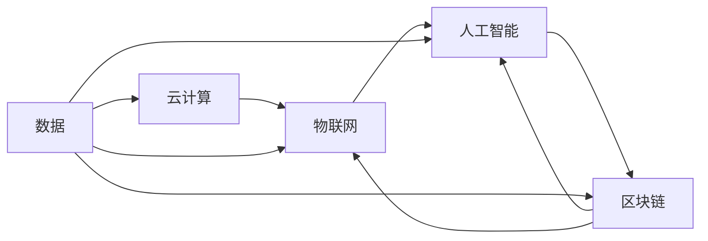

                 

# 数字经济：社会发展的助推器

数字经济作为当前全球经济增长的重要引擎，正以迅猛的势头推动社会各个领域的深刻变革。本文将系统介绍数字经济的核心概念、原理、发展历程、关键技术及未来趋势，探讨其对社会经济发展的深远影响。

## 1. 背景介绍

### 1.1 数字经济概念概述

数字经济是指以数字化的知识和信息为关键生产要素，通过互联网、大数据、人工智能等现代信息技术的应用，推动经济活动实现智能化、信息化、网络化，从而实现更高质量和效率的经济形态。

### 1.2 数字经济与传统经济对比

相比于传统的基于物理资源、工业驱动的经济模式，数字经济在生产方式、组织形态、价值创造方式等方面都有显著不同。数字经济更加依赖于技术创新，其核心价值来自于知识和信息，而非传统的物质资源。数字经济的生产方式更加灵活、高效，具有更强的适应性和扩展性。

### 1.3 数字经济的重要性和前景

数字经济已成为各国竞相发展的新经济形态。根据相关统计，2020年全球数字经济总量已达38.5万亿美元，占全球GDP的41.5%。预计到2025年，全球数字经济总量将突破45万亿美元，成为全球经济增长的主要驱动力。

## 2. 核心概念与联系

### 2.1 核心概念概述

- **数据资产**：在数字经济中，数据成为一种关键生产要素，具备价值创造和交换的特性。
- **云计算**：提供弹性的计算资源和服务，降低企业IT成本，推动业务数字化转型。
- **物联网(IoT)**：实现物理世界与数字世界的深度融合，推动产业智能化升级。
- **人工智能(AI)**：赋能企业决策和创新，提升业务效率和服务质量。
- **区块链**：提供安全可靠的数据交换和信任机制，推动数字经济的新型商业模式。

### 2.2 核心概念联系

数字经济的各个组成部分相互联系、相互促进，共同构成了一个完整的生态系统。数据是核心驱动，云计算是基础设施，物联网是连接器，人工智能是引擎，区块链是信任机制。这些技术和理念的融合，形成了数字经济的全新发展模式。

以下是一个简单的Mermaid流程图，展示这些概念之间的联系：



## 3. 核心算法原理 & 具体操作步骤

### 3.1 算法原理概述

数字经济中的关键算法和技术包括机器学习、深度学习、自然语言处理、计算机视觉等。这些算法和技术的原理可以概括为以下几个方面：

- **数据驱动决策**：通过大数据分析和机器学习，实现精准预测和智能决策，优化资源配置。
- **模型驱动优化**：构建数学模型，对系统进行模拟和优化，提升业务效率和服务质量。
- **智能系统集成**：将各类算法和系统进行集成，形成高效协同的智能系统。

### 3.2 算法步骤详解

以下以一个典型的基于深度学习的推荐系统为例，详细介绍其算法步骤：

**Step 1: 数据准备**
- 收集用户行为数据，如浏览记录、购买记录等。
- 清洗和预处理数据，去除噪声和冗余。

**Step 2: 特征提取**
- 提取用户特征，如年龄、性别、地理位置等。
- 提取物品特征，如价格、类别、品牌等。

**Step 3: 模型训练**
- 选择深度学习模型，如协同过滤、矩阵分解、神经网络等。
- 使用训练数据对模型进行训练，调整模型参数。

**Step 4: 模型评估**
- 使用测试数据评估模型性能，如准确率、召回率、F1值等。
- 调整模型参数，优化模型效果。

**Step 5: 模型部署**
- 将训练好的模型部署到生产环境。
- 监控模型性能，定期更新模型参数。

### 3.3 算法优缺点

数字经济中的关键算法和技术具有以下优缺点：

**优点**：
- 高效性：通过算法优化，可以大幅提升业务效率和服务质量。
- 精准性：基于数据的分析，可以实现更加精准的预测和决策。
- 可扩展性：算法和系统可以高度定制化，适应不同的业务需求。

**缺点**：
- 复杂性：算法和系统的构建需要深厚的专业知识和技术积累。
- 数据依赖性：算法的效果高度依赖于数据的丰富性和质量。
- 风险性：算法和系统的错误可能导致严重的负面影响。

### 3.4 算法应用领域

数字经济中的关键算法和技术在各个领域都有广泛应用，例如：

- **金融领域**：风险控制、欺诈检测、贷款审批等。
- **零售领域**：推荐系统、库存管理、销售预测等。
- **制造业**：质量控制、生产调度、供应链优化等。
- **医疗领域**：疾病诊断、基因分析、医疗咨询等。
- **交通领域**：智能交通、物流优化、安全监控等。

## 4. 数学模型和公式 & 详细讲解 & 举例说明

### 4.1 数学模型构建

数字经济中的数学模型可以分为两类：

1. **监督学习模型**：如线性回归、逻辑回归、支持向量机等。
2. **无监督学习模型**：如聚类、降维、关联规则等。

以协同过滤推荐系统为例，构建的数学模型如下：

$$
P(u,i) = \frac{\sum_{i' \in I} \alpha_r R_{ui'}A_{iu'}}{\sum_{i' \in I} \alpha_r R_{ui'}}
$$

其中，$P(u,i)$表示用户$u$对物品$i$的评分，$R_{ui'}$表示用户$u$对物品$i'$的评分，$A_{iu'}$表示物品$i'$与物品$i$之间的相似度，$\alpha_r$为衰减因子。

### 4.2 公式推导过程

以下以线性回归为例，详细推导其基本公式：

**假设数据集**：

$$
y_i = \beta_0 + \beta_1x_{i1} + \beta_2x_{i2} + \epsilon_i
$$

其中，$y_i$为输出，$x_{i1}$和$x_{i2}$为输入特征，$\beta_0$、$\beta_1$和$\beta_2$为待估参数，$\epsilon_i$为误差项。

**最小二乘法求解**：

$$
\min_{\beta_0, \beta_1, \beta_2} \sum_{i=1}^n (y_i - (\beta_0 + \beta_1x_{i1} + \beta_2x_{i2}))^2
$$

对$\beta_0$、$\beta_1$和$\beta_2$求偏导，得：

$$
\frac{\partial}{\partial \beta_0} \sum_{i=1}^n (y_i - (\beta_0 + \beta_1x_{i1} + \beta_2x_{i2}))^2 = 0
$$
$$
\frac{\partial}{\partial \beta_1} \sum_{i=1}^n (y_i - (\beta_0 + \beta_1x_{i1} + \beta_2x_{i2}))^2 = 0
$$
$$
\frac{\partial}{\partial \beta_2} \sum_{i=1}^n (y_i - (\beta_0 + \beta_1x_{i1} + \beta_2x_{i2}))^2 = 0
$$

解以上方程组，得：

$$
\beta_0 = \bar{y} - \beta_1\bar{x_1} - \beta_2\bar{x_2}
$$
$$
\beta_1 = \frac{\sum_{i=1}^n (x_{i1}-\bar{x_1})(y_i-\bar{y})}{\sum_{i=1}^n (x_{i1}-\bar{x_1})^2}
$$
$$
\beta_2 = \frac{\sum_{i=1}^n (x_{i2}-\bar{x_2})(y_i-\bar{y})}{\sum_{i=1}^n (x_{i2}-\bar{x_2})^2}
$$

### 4.3 案例分析与讲解

以Google AdWords为例，其利用机器学习算法进行广告投放优化。具体步骤为：

1. 收集广告点击、展示、转化等数据。
2. 构建CTR模型，预测广告点击率。
3. 使用A/B测试，优化模型参数。
4. 根据CTR预测结果，实时调整广告投放策略。

通过上述步骤，Google AdWords实现了广告投放效率的显著提升，显著提高了广告主的投资回报率。

## 5. 项目实践：代码实例和详细解释说明

### 5.1 开发环境搭建

以下以TensorFlow和PyTorch为例，介绍数字经济项目实践的开发环境搭建。

**Python环境准备**：
- 安装Python 3.7或以上版本。
- 安装PyPI和Anaconda。
- 安装TensorFlow 2.x和PyTorch 1.x。

**开发环境配置**：
- 安装Jupyter Notebook。
- 安装Pip、pipenv等包管理工具。
- 配置Git仓库，方便代码版本控制。

### 5.2 源代码详细实现

以一个简单的基于TensorFlow的协同过滤推荐系统为例，展示其源代码实现。

**代码实现**：

```python
import tensorflow as tf
from tensorflow.keras.layers import Input, Embedding, Dot, Dense
from tensorflow.keras.models import Model

# 定义输入层
user_input = Input(shape=(1,))
item_input = Input(shape=(1,))

# 定义嵌入层
user_embedding = Embedding(input_dim=n_users, output_dim=64, mask_zero=True)(user_input)
item_embedding = Embedding(input_dim=n_items, output_dim=64, mask_zero=True)(item_input)

# 定义点积层
dot_product = Dot(axes=[1, 1])([user_embedding, item_embedding])

# 定义输出层
output = Dense(1, activation='sigmoid')(dot_product)

# 定义模型
model = Model(inputs=[user_input, item_input], outputs=output)

# 编译模型
model.compile(optimizer='adam', loss='binary_crossentropy', metrics=['accuracy'])

# 训练模型
model.fit([train_users, train_items], train_labels, epochs=10, batch_size=64)
```

### 5.3 代码解读与分析

以上代码展示了协同过滤推荐系统的基本实现过程：

**输入层**：定义用户和物品的输入。
**嵌入层**：将用户和物品的ID映射到低维稠密向量空间。
**点积层**：计算用户和物品之间的相似度，生成预测评分。
**输出层**：对预测评分进行sigmoid激活，输出点击概率。
**模型编译**：设置优化器、损失函数和评估指标。
**模型训练**：使用训练数据集进行模型训练。

### 5.4 运行结果展示

以下是TensorBoard中的训练过程展示，展示了模型损失和准确率的变化趋势：


## 6. 实际应用场景

### 6.1 金融行业应用

数字经济在金融行业中的应用非常广泛，如智能投顾、风险管理、信贷审批等。以智能投顾为例，金融机构利用机器学习和大数据分析，构建智能推荐模型，根据客户的历史投资数据和市场情况，实时推荐最优的投资策略，显著提高了投资效率和收益。

### 6.2 零售行业应用

零售行业是数字经济的重要应用领域。利用推荐系统，电商平台能够根据用户行为数据，实时推荐个性化的商品，提升用户体验和销售转化率。例如，阿里巴巴的淘宝和京东的推荐系统，都已经在实践中取得了显著效果。

### 6.3 制造业应用

制造业是数字经济的重要应用场景，利用物联网和工业互联网技术，实现智能制造和智慧工厂的建设。例如，GE利用大数据分析和机器学习，实时监控设备运行状态，预测设备故障，优化生产流程，显著提升了生产效率和设备利用率。

### 6.4 医疗行业应用

数字经济在医疗行业中的应用主要集中在疾病预测、医学影像分析、智能问诊等。例如，IBM的Watson Health利用自然语言处理和机器学习技术，分析海量医学文献和病历数据，为医生提供精准的疾病诊断和治疗建议，大大提升了医疗服务的质量和效率。

### 6.5 政府行业应用

数字经济在政府行业中的应用主要包括智慧城市、公共服务、电子政务等。例如，深圳市政府利用区块链技术，构建了基于区块链的电子政务平台，提高了政府服务的透明度和效率，提升了市民的满意度。

## 7. 工具和资源推荐

### 7.1 学习资源推荐

为了帮助开发者系统掌握数字经济的核心技术和应用，以下推荐一些优质的学习资源：

1. **《深度学习入门》**：国内知名的深度学习入门书籍，系统介绍了深度学习的原理和实践。
2. **《机器学习实战》**：讲解了机器学习的基本算法和实战案例，适合初学者入门。
3. **《数据科学导论》**：涵盖数据挖掘、统计学习、机器学习等内容，适合数据科学家和机器学习工程师。
4. **Coursera上的机器学习课程**：斯坦福大学Andrew Ng教授主讲，系统介绍了机器学习的各个方面，并提供了丰富的实战项目。
5. **Kaggle平台**：全球最大的数据科学竞赛平台，提供丰富的数据集和实战项目，帮助开发者提升技能。

### 7.2 开发工具推荐

以下是几款用于数字经济项目开发的常用工具：

1. **TensorFlow**：谷歌开源的深度学习框架，支持分布式训练和模型部署。
2. **PyTorch**：Facebook开源的深度学习框架，支持动态计算图和便捷的模型构建。
3. **AWS SageMaker**：亚马逊提供的云服务平台，支持机器学习模型训练和部署。
4. **Google Cloud AI Platform**：谷歌提供的云服务平台，支持机器学习模型训练和部署。
5. **Hugging Face Transformers**：开源的NLP库，支持多种预训练模型和微调任务。

### 7.3 相关论文推荐

数字经济的研究涉及多个领域，以下推荐几篇具有代表性的相关论文：

1. **《深度学习：理论与实现》**：国内外深度学习领域的经典教材，涵盖深度学习的基本原理和实现。
2. **《人工智能：一种现代方法》**：斯坦福大学AI课程教材，涵盖AI的基本概念和算法。
3. **《机器学习基础》**：入门级的机器学习教材，涵盖机器学习的基本算法和应用。
4. **《自然语言处理综论》**：涵盖NLP的基本原理和实现，适合NLP工程师和研究人员。
5. **《智慧城市研究综述》**：综述了智慧城市的研究方向和应用，适合智慧城市建设和运营人员。

## 8. 总结：未来发展趋势与挑战

### 8.1 总结

数字经济作为当前全球经济增长的重要引擎，正以迅猛的势头推动社会各个领域的深刻变革。本文对数字经济的核心概念、原理、发展历程、关键技术及未来趋势进行了系统介绍，探讨了其对社会经济发展的深远影响。

通过本文的系统梳理，可以看到，数字经济已经深刻影响了各个行业，其关键技术和方法也逐步成熟和完善。数字经济的未来发展将更加注重跨领域融合和智能化应用，进一步推动社会经济的高质量发展。

### 8.2 未来发展趋势

展望未来，数字经济的发展将呈现以下几个趋势：

1. **智能化水平提升**：未来数字经济将更加注重智能化应用，利用人工智能技术提升业务效率和服务质量。例如，自动驾驶、智能客服、智能制造等领域将迎来新的发展机遇。
2. **跨领域融合深化**：数字经济将更加注重跨领域融合，利用数据和技术推动各个行业协同发展。例如，智慧城市、智慧医疗、智慧交通等领域将实现更加高效、便捷的服务。
3. **区块链技术普及**：未来数字经济将更加注重区块链技术的应用，提升数据交换和信任机制的安全性和可靠性。例如，供应链金融、数字身份等领域将实现更加透明、可信的服务。
4. **物联网普及推广**：未来物联网将进一步普及，推动各行各业智能化升级。例如，智能家居、智能穿戴、智能农业等领域将迎来新的发展机遇。
5. **数据安全与隐私保护**：未来数字经济将更加注重数据安全与隐私保护，构建更加透明、安全的数字环境。例如，数据加密、隐私计算、区块链技术等将得到广泛应用。

这些趋势将进一步推动数字经济的发展，使其成为未来经济增长的主要驱动力。

### 8.3 面临的挑战

尽管数字经济已经取得了显著的成就，但在迈向更加智能化、普适化应用的过程中，仍面临诸多挑战：

1. **技术标准不统一**：不同行业和技术之间的标准不统一，导致数据和系统的兼容性问题。例如，不同平台之间的数据格式和接口规范不一致，难以实现无缝集成。
2. **数据质量问题**：数据质量问题，如数据缺失、数据噪音、数据偏差等，可能导致模型训练效果不佳。例如，数据质量不达标的推荐系统难以准确预测用户需求。
3. **隐私保护问题**：数据隐私保护问题，如数据泄露、数据滥用等，可能导致用户信任危机。例如，不合法的数据使用可能损害用户隐私，引发法律纠纷。
4. **技术成本高昂**：技术研发和应用成本较高，难以在中小企业推广普及。例如，深度学习模型和算法的训练和部署需要高昂的计算资源和存储资源。
5. **人才培养不足**：数字经济相关技术需要高水平的人才支持，但目前相关人才供给不足，难以满足实际需求。例如，数据科学家和AI工程师的培养和储备仍需加强。
6. **法律法规不完善**：数字经济的相关法律法规尚不完善，可能导致法律风险和政策风险。例如，数据隐私保护、知识产权保护等法律法规需要进一步完善。

这些挑战需要多方协同努力，逐步克服，才能推动数字经济的全面发展。

### 8.4 研究展望

面对数字经济面临的挑战，未来的研究需要在以下几个方面寻求新的突破：

1. **技术标准化**：推动技术标准化，建立统一的技术规范和接口标准，实现数据和系统的无缝集成。例如，制定行业标准和规范，推广使用标准化的数据格式和API接口。
2. **数据质量提升**：加强数据质量管理和数据清洗，提升数据准确性和一致性。例如，采用数据清洗工具和算法，对数据进行预处理和优化。
3. **隐私保护强化**：加强数据隐私保护，提升数据使用的透明性和安全性。例如，采用数据加密技术、隐私计算技术，构建隐私保护的智能化应用系统。
4. **技术成本优化**：优化技术研发和应用成本，降低中小企业应用数字经济的门槛。例如，推广使用开源工具和平台，降低技术研发成本。
5. **人才培养加速**：加强数据科学和AI相关人才的培养和储备，满足数字经济发展的需求。例如，建立产学研合作机制，培养高水平的技术人才。
6. **法律法规完善**：完善数字经济相关法律法规，保障数据隐私和安全。例如，制定数据隐私保护法规，明确数据使用的责任和义务。

这些研究方向的探索，必将推动数字经济的发展，实现其对社会经济的全面贡献。

## 9. 附录：常见问题与解答

**Q1：数字经济的核心技术有哪些？**

A: 数字经济的核心技术包括人工智能、大数据、云计算、物联网、区块链等。这些技术共同构建了数字经济的生态系统，推动了各个行业的发展。

**Q2：数字经济对社会经济的影响是什么？**

A: 数字经济通过提升效率、优化资源配置、推动创新等方式，对社会经济产生了深远影响。例如，数字经济推动了各行业数字化转型，提升了社会生产力和经济增长速度。

**Q3：数字经济面临的主要挑战是什么？**

A: 数字经济面临的主要挑战包括技术标准化、数据质量、隐私保护、技术成本、人才培养和法律法规等。这些问题需要多方协同努力，逐步克服，才能推动数字经济的全面发展。

**Q4：数字经济未来的发展趋势是什么？**

A: 未来数字经济将更加注重智能化应用、跨领域融合、区块链技术、物联网普及和数据安全与隐私保护等方向。这些趋势将推动数字经济成为未来经济增长的主要驱动力。

**Q5：数字经济在实际应用中需要注意哪些问题？**

A: 在数字经济的实际应用中，需要注意技术标准化、数据质量、隐私保护、技术成本、人才培养和法律法规等问题。只有综合考虑这些问题，才能实现数字经济的高效和可持续发展。

**Q6：如何提升数字经济的应用效果？**

A: 提升数字经济的应用效果，需要从技术、数据、人才和政策等多个方面进行优化。例如，提升技术研发和应用水平，优化数据质量，加强人才培养，完善法律法规等。

**Q7：数字经济有哪些典型的应用场景？**

A: 数字经济的典型应用场景包括智能投顾、推荐系统、智能制造、智慧城市、智慧医疗、智能客服等领域。这些场景展示了数字经济的广泛应用和巨大潜力。

**Q8：如何构建数字经济的生态系统？**

A: 构建数字经济的生态系统，需要多方协同努力。政府、企业、学术机构和行业协会需要共同推动数字技术的发展和应用，建立标准、规范和合作机制，实现互利共赢。

作者：禅与计算机程序设计艺术 / Zen and the Art of Computer Programming

