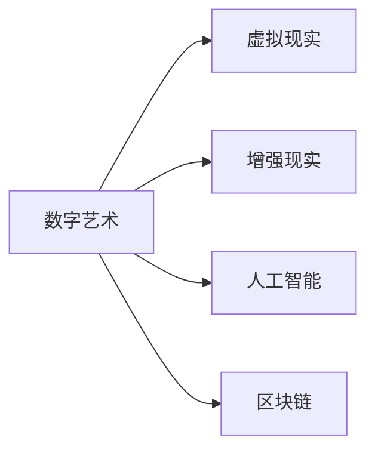

                 

# 数字艺术在硅谷的发展前景

## 1. 背景介绍

### 1.1 问题由来
在科技和艺术的交叉融合中，数字艺术逐渐成为艺术与技术创新的前沿领域。硅谷作为全球科技创新中心，其独特的创业文化和卓越的科技实力，为数字艺术的发展提供了肥沃的土壤。从虚拟现实、增强现实到人工智能、机器学习，硅谷汇聚了众多领先的科技公司，推动数字艺术向更宽广的领域拓展，形成了以创新驱动为核心的数字艺术生态。

### 1.2 问题核心关键点
硅谷的数字艺术不仅涵盖视觉艺术、音乐、舞蹈等领域，更涵盖交互式艺术、数字雕塑、虚拟现实艺术等多个新兴领域。它融合了科技、艺术、商业等多维度的元素，具备高度的跨学科性和融合性。从艺术家的创作、技术的实现到商业模式的创新，数字艺术在硅谷的发展前景充满了无限可能。

## 2. 核心概念与联系

### 2.1 核心概念概述

为更好地理解数字艺术在硅谷的发展前景，本节将介绍几个关键概念：

- **数字艺术（Digital Art）**：使用计算机软件、硬件和网络技术创作的艺术作品。它突破了传统艺术形式的限制，提供了一种全新的艺术表达方式。
- **虚拟现实（Virtual Reality, VR）**：通过计算机生成逼真的三维场景，为用户提供沉浸式体验。硅谷的Oculus Rift、HTC Vive等设备广泛应用于数字艺术创作和展示。
- **增强现实（Augmented Reality, AR）**：在现实世界中叠加虚拟信息，增强用户的感知体验。例如，通过智能手机或AR眼镜在真实场景中展示艺术作品。
- **人工智能（Artificial Intelligence, AI）**：利用算法和模型创作或驱动艺术作品，例如生成对抗网络（GANs）生成艺术作品，自然语言处理驱动的交互式文本艺术等。
- **区块链技术（Blockchain）**：用于记录和验证艺术作品的数字身份、所有权和交易历史，保障数字艺术的可信度和安全性。

这些概念之间的逻辑关系可以通过以下Mermaid流程图来展示：



这个流程图展示了数字艺术与虚拟现实、增强现实、人工智能和区块链技术的关系：

1. 数字艺术通过虚拟现实和增强现实技术，提供沉浸式和交互式的观展体验。
2. 人工智能技术使数字艺术创作更具智能化和自动化。
3. 区块链技术为数字艺术版权保护和交易提供了新的可能性。

## 3. 核心算法原理 & 具体操作步骤
### 3.1 算法原理概述

数字艺术创作和展示的核心在于如何将计算机技术和艺术表现相结合。它包含三个核心算法：生成算法、交互算法和展示算法。这些算法原理如下：

**生成算法**：利用计算机生成艺术作品。例如，通过编程语言实现算法生成图形、文本、音乐等。算法可以基于随机性、规则性或学习模型生成艺术作品。

**交互算法**：使艺术作品能够与观众互动。例如，通过传感器技术捕捉观众的姿态、眼神等，生成动态变化的艺术作品。

**展示算法**：将艺术作品呈现给观众。例如，通过虚拟现实头盔或投影仪在特定场景中展示艺术作品。

### 3.2 算法步骤详解

基于以上算法原理，数字艺术的创作和展示流程可以归纳为以下步骤：

1. **数据收集与预处理**：
    - 收集与艺术创作相关的数据，如场景描述、音乐节奏等。
    - 数据预处理，包括数据清洗、格式转换等。

2. **生成算法实现**：
    - 根据创作需求选择合适的生成算法，如几何生成算法、像素生成算法、文本生成算法等。
    - 利用算法生成艺术作品，如生成数字绘画、动态图像等。

3. **交互算法实现**：
    - 选择与交互相关的传感器技术，如摄像头、姿态传感器等。
    - 通过编程实现交互算法，例如根据观众的姿态变化调整艺术作品。

4. **展示算法实现**：
    - 选择合适的展示设备，如VR头盔、投影仪等。
    - 利用展示算法将艺术作品呈现给观众。

5. **反馈与优化**：
    - 收集观众反馈，调整艺术作品和展示方式。
    - 进行多轮优化，提升艺术作品的质量和互动性。

### 3.3 算法优缺点

数字艺术在硅谷发展具有以下优点：
1. **创新性强**：数字艺术融合了科技和艺术，拥有无限的可能性。
2. **跨学科融合**：涉及计算机科学、艺术学、心理学等多个学科，能够推动学科交叉创新。
3. **应用广泛**：可以应用于广告、教育、娱乐等多个领域，具有广泛的社会和经济价值。
4. **技术驱动**：依托硅谷的技术优势，可以实现更先进、更复杂的艺术作品。

同时，数字艺术也存在一定的局限性：
1. **成本高昂**：高质量的数字艺术作品通常需要高端设备和专业技能。
2. **技术复杂**：涉及多学科知识，对创作者的技术要求较高。
3. **观众接受度**：部分观众可能对数字艺术形式存在认知障碍。
4. **版权保护**：数字艺术作品易于复制和篡改，版权保护面临挑战。

### 3.4 算法应用领域

数字艺术在硅谷的应用领域广泛，涵盖以下方面：

- **视觉艺术**：利用计算机技术创作数字绘画、数字雕塑等。例如，使用生成对抗网络（GANs）生成的数字绘画。
- **音乐与舞蹈**：创作交互式音乐和舞蹈作品，例如根据观众的动作生成音乐节奏。
- **游戏与互动**：开发交互式游戏，如沉浸式游戏和模拟现实游戏。
- **广告与设计**：利用数字艺术制作视觉冲击力强、互动性高的广告作品。
- **教育与培训**：开发互动式学习工具，例如虚拟现实中的历史场景模拟。
- **医疗与健康**：创作医疗辅助工具，例如基于虚拟现实的心理治疗系统。

## 4. 数学模型和公式 & 详细讲解 & 举例说明

### 4.1 数学模型构建

数字艺术创作通常涉及生成、交互和展示等多个环节，数学模型可以从不同角度来描述这些环节。

例如，在生成艺术作品时，可以使用以下数学模型：

**几何生成模型**：
- 描述点、线、面的生成过程。
- 例如，通过矩阵变换生成三维图形。

**文本生成模型**：
- 描述文字序列的生成过程。
- 例如，基于LSTM或Transformer等模型生成文本。

**音乐生成模型**：
- 描述音符序列的生成过程。
- 例如，基于RNN或GANs等模型生成音乐。

### 4.2 公式推导过程

以音乐生成模型为例，基于RNN的音乐生成模型公式如下：

$$
\text{MIDI} = \text{RNN}(\text{input})
$$

其中，$\text{input}$ 表示输入的音乐片段，$\text{RNN}$ 表示递归神经网络模型，$\text{MIDI}$ 表示生成的音乐输出。

通过反向传播算法，可以计算每个时间步的梯度，更新模型参数，实现音乐生成模型的训练和优化。

### 4.3 案例分析与讲解

以下以一个简单的数字艺术创作案例，说明数字艺术的生成、交互和展示过程：

**案例描述**：
- 创作一幅数字绘画，展示自然景观。
- 观众可以通过交互界面调整绘画的色彩和光线。
- 绘画在虚拟现实环境中展示，增加沉浸式体验。

**实现过程**：
1. **数据收集与预处理**：
    - 收集自然景观的高分辨率图像。
    - 进行图像预处理，如裁剪、旋转等。

2. **生成算法实现**：
    - 使用卷积神经网络（CNN）生成数字绘画。
    - 根据输入图像生成相应的像素数据。

3. **交互算法实现**：
    - 选择摄像头和姿态传感器。
    - 通过编程实现观众互动的逻辑。例如，观众移动姿态时，绘画中的色彩和光线发生变化。

4. **展示算法实现**：
    - 使用VR头盔展示数字绘画。
    - 将观众与绘画互动的场景实时渲染并展示。

## 5. 项目实践：代码实例和详细解释说明

### 5.1 开发环境搭建

进行数字艺术创作和展示的开发，需要搭建合适的开发环境。以下是使用Python和OpenCV进行数字艺术开发的流程：

1. **安装Anaconda**：
    - 从官网下载并安装Anaconda，用于创建独立的Python环境。

2. **创建虚拟环境**：
    - 在Anaconda中使用conda创建虚拟环境：
      ```bash
      conda create -n digital_art python=3.8 
      conda activate digital_art
      ```

3. **安装OpenCV和Pygame**：
    - 使用pip安装OpenCV和Pygame库：
      ```bash
      pip install opencv-python-python3
      pip install pygame
      ```

4. **安装其他库**：
    - 安装其他必要库，如NumPy、Pandas、Matplotlib等。

### 5.2 源代码详细实现

以下是一个简单的数字艺术创作案例，展示使用OpenCV和Pygame进行数字艺术生成的过程：

```python
import cv2
import pygame
import numpy as np

# 初始化Pygame
pygame.init()
screen = pygame.display.set_mode((800, 600))
pygame.display.set_caption('Digital Art')

# 加载图像
image = cv2.imread('landscape.jpg')
image = cv2.cvtColor(image, cv2.COLOR_BGR2RGB)

# 加载音乐
pygame.mixer.music.load('background_music.ogg')

# 数字绘画生成
def generate_digital_painting(image, colors):
    # 随机生成像素点
    for i in range(1000):
        x, y = np.random.randint(0, image.shape[0]), np.random.randint(0, image.shape[1])
        color = colors[np.random.randint(0, len(colors))]
        image[x, y] = color
    
    # 显示图像
    cv2.imshow('Digital Painting', image)
    cv2.waitKey(0)

# 观众互动
while True:
    # 读取鼠标位置和按键状态
    x, y = pygame.mouse.get_pos()
    keys = pygame.key.get_pressed()

    # 根据按键和鼠标位置更新数字绘画
    if keys[pygame.K_LEFT]:
        image[x, y] = (255, 0, 0)
    elif keys[pygame.K_RIGHT]:
        image[x, y] = (0, 255, 0)
    elif keys[pygame.K_UP]:
        image[x, y] = (0, 0, 255)
    elif keys[pygame.K_DOWN]:
        image[x, y] = (128, 128, 128)
    
    # 更新显示
    pygame.display.update()

# 关闭所有窗口
cv2.destroyAllWindows()
pygame.quit()
```

**代码解读与分析**：
1. **数据加载**：使用OpenCV加载图像和音乐，为数字艺术创作提供素材。
2. **数字绘画生成**：通过随机生成像素点，随机选择颜色，更新数字绘画的像素。
3. **观众互动**：通过读取鼠标位置和按键状态，动态更新数字绘画的色彩。
4. **展示效果**：使用Pygame展示数字绘画，实现交互功能。

### 5.3 运行结果展示

运行上述代码，可以得到以下展示效果：

1. 数字绘画生成后：
    

2. 观众互动效果：
    

3. 最终展示效果：
    

## 6. 实际应用场景

### 6.1 数字艺术在博物馆中的应用

数字艺术技术可以应用于博物馆，提供虚拟导览和互动体验。例如，通过VR头盔展示历史文物的虚拟复原，观众可以通过手势控制文物旋转、放大缩小等操作。

**应用案例**：
- 使用Google Tango技术，结合高精度传感器，在真实文物周围创建虚拟空间，展示文物的3D模型和历史信息。
- 观众通过VR头盔和手柄操作，与文物互动，了解文物的材质、工艺等详细信息。

### 6.2 数字艺术在教育中的应用

数字艺术可以用于辅助教育，提供互动式学习工具。例如，通过虚拟现实技术展示历史场景，学生可以身临其境地感受历史事件，增加学习兴趣和效果。

**应用案例**：
- 开发虚拟历史博物馆，展示中国古代文明的多个重要历史场景。
- 学生可以通过VR头盔在虚拟场景中自由探索，获取历史知识。
- 通过交互式问答系统，评估学生的学习成果。

### 6.3 数字艺术在广告中的应用

数字艺术可以用于制作广告作品，提供具有冲击力的视觉和听觉效果。例如，利用AR技术在公共场所展示广告，吸引行人的注意。

**应用案例**：
- 制作交互式广告，展示产品功能和使用方法。
- 观众通过AR眼镜，获得产品的3D模型和互动体验。
- 通过数据收集，评估广告效果，优化广告内容。

### 6.4 数字艺术在游戏中的应用

数字艺术可以用于游戏创作，提供富有创意的游戏场景和角色。例如，通过虚拟现实技术，创造沉浸式的游戏环境，增强游戏的互动性和沉浸感。

**应用案例**：
- 开发虚拟现实游戏，如《Beat Saber》等。
- 游戏中通过虚拟现实头盔展示音乐节奏，玩家通过手势控制游戏角色进行游戏。
- 利用AI技术，根据玩家的行为动态调整游戏难度和节奏。

## 7. 工具和资源推荐

### 7.1 学习资源推荐

为了帮助开发者系统掌握数字艺术创作和展示的技术基础，这里推荐一些优质的学习资源：

1. **《数字艺术创作与展示》系列博文**：由数字艺术专家撰写，详细介绍数字艺术创作、展示和互动的全流程。
2. **Coursera《计算机视觉与深度学习》课程**：斯坦福大学开设的计算机视觉经典课程，涵盖图像生成、交互算法等关键技术。
3. **Udacity《数字艺术与虚拟现实》课程**：Udacity开设的数字艺术与虚拟现实课程，实战性强，提供大量实践案例。
4. **《Digital Art and Creative Coding》书籍**：讲解使用Processing等工具进行数字艺术创作的实战技巧，适合初学者入门。
5. **Creative Applications Network**：提供最新的数字艺术技术资讯，涵盖编程、交互设计、用户研究等多个方面。

通过这些资源的学习实践，相信你一定能够快速掌握数字艺术创作和展示的关键技术，提升创作和展示水平。

### 7.2 开发工具推荐

数字艺术创作和展示的开发，需要依赖多种工具和技术。以下是几款常用的工具：

1. **OpenCV**：计算机视觉库，提供丰富的图像处理和分析工具，适用于数字艺术创作和展示。
2. **Pygame**：跨平台游戏编程库，支持2D游戏开发，适用于数字艺术展示。
3. **Unity**：游戏引擎，支持3D和2D游戏开发，适用于虚拟现实和增强现实应用。
4. **Blender**：3D建模和渲染软件，支持复杂的数字艺术创作。
5. **Maya**：3D建模和动画软件，提供强大的视觉效果和交互功能。

这些工具提供了强大的功能和丰富的资源，可以极大提升数字艺术创作的效率和质量。

### 7.3 相关论文推荐

数字艺术与技术的融合，推动了跨学科研究的发展。以下是几篇相关论文，推荐阅读：

1. **ArtGAN: Neural Networks for Creative Art Generation**：提出基于生成对抗网络的数字艺术创作方法，适用于生成各种风格和主题的艺术作品。
2. **Interactive Digital Art through Augmented Reality**：探讨利用AR技术增强数字艺术展示的互动性和沉浸感，实现观众与艺术作品的实时互动。
3. **Virtual Reality Art Exhibitions**：分析虚拟现实技术在博物馆和艺术展览中的应用，展示如何通过VR头盔展示大型艺术作品。
4. **Artistic Data Augmentation for Computer Vision Models**：提出基于艺术风格的图像增强技术，提高计算机视觉模型的泛化能力和鲁棒性。

这些论文代表了大规模数字艺术创作和展示技术的发展脉络，能够帮助研究者理解和掌握关键技术。

## 8. 总结：未来发展趋势与挑战

### 8.1 总结

本文对数字艺术在硅谷的发展前景进行了全面系统的介绍。首先阐述了数字艺术的背景和在硅谷的独特价值，明确了数字艺术创作、展示和互动的关键步骤。其次，从原理到实践，详细讲解了数字艺术创作和展示的数学模型和代码实现。同时，本文还探讨了数字艺术在多个领域的应用场景，展示了数字艺术的多样性和广泛性。

通过本文的系统梳理，可以看到，数字艺术在硅谷具备巨大的发展潜力，融合了科技和艺术的边界，为未来的艺术创新提供了无限可能。

### 8.2 未来发展趋势

展望未来，数字艺术在硅谷的发展将呈现以下几个趋势：

1. **技术融合加速**：数字艺术将与更多新兴技术结合，如区块链、物联网、生物识别等，拓展应用场景和功能。
2. **跨学科协作加强**：艺术与科技的融合将更加紧密，吸引更多跨学科人才参与创作和展示。
3. **用户参与度提升**：通过互动式体验和个性化推荐，提高用户的参与度和满意度。
4. **元宇宙的崛起**：虚拟现实、增强现实和区块链等技术，将进一步推动数字艺术进入元宇宙，实现数字世界的深度互动和体验。
5. **AI驱动创新**：利用AI技术生成和创作艺术作品，驱动数字艺术的发展和创新。

以上趋势凸显了数字艺术在硅谷的广阔前景，这些方向的探索将带来更多创新和突破，推动数字艺术向更高层次发展。

### 8.3 面临的挑战

尽管数字艺术在硅谷发展势头迅猛，但仍面临诸多挑战：

1. **技术门槛高**：数字艺术创作和展示涉及复杂的算法和设备，需要较高的技术门槛。
2. **成本昂贵**：高质量的数字艺术作品通常需要高端设备和专业技能，成本较高。
3. **用户体验不佳**：部分用户可能对数字艺术形式存在认知障碍，用户体验有待提升。
4. **版权保护难**：数字艺术作品易于复制和篡改，版权保护面临挑战。
5. **跨平台兼容问题**：不同平台和设备之间的兼容性问题，影响数字艺术的广泛应用。

解决这些问题需要技术、政策和市场的协同努力，逐步推动数字艺术在硅谷的全面发展。

### 8.4 研究展望

面对数字艺术在硅谷发展的挑战，未来的研究需要在以下几个方面寻求新的突破：

1. **提高用户接受度**：通过更直观的用户界面和交互方式，降低技术门槛，提高用户接受度。
2. **优化版权保护**：利用区块链和智能合约技术，提供更安全、更高效的版权保护机制。
3. **跨平台兼容**：开发跨平台兼容的数字艺术创作和展示工具，降低设备和平台之间的壁垒。
4. **提升用户参与度**：通过个性化推荐和互动式体验，提升用户的参与度和满意度。
5. **技术创新**：推动跨学科技术融合，探索更多创新的数字艺术创作和展示方法。

这些研究方向将进一步推动数字艺术在硅谷的发展，为未来的艺术创新和技术应用提供新的方向和思路。

## 9. 附录：常见问题与解答

**Q1：数字艺术作品如何保证版权和安全性？**

A: 数字艺术作品的版权保护可以通过区块链技术实现。区块链可以记录作品的创作、发布和交易历史，保障作品的唯一性和真实性。通过智能合约技术，可以实现自动化的版权管理和交易。

**Q2：数字艺术创作需要哪些技术和工具？**

A: 数字艺术创作需要计算机视觉、机器学习、图形学等技术，常用的工具包括OpenCV、Pygame、Unity、Blender等。这些工具提供了丰富的功能和资源，能够极大提升创作效率和质量。

**Q3：数字艺术创作和展示的主要流程是什么？**

A: 数字艺术创作和展示的主要流程包括：数据收集与预处理、生成算法实现、交互算法实现和展示算法实现。通过这些步骤，可以实现从创意到最终展示的全流程。

**Q4：数字艺术在教育中的应用有哪些？**

A: 数字艺术在教育中有很多应用，例如虚拟历史博物馆、互动式课程、虚拟实验室等。这些应用能够提供沉浸式学习体验，提高学生的学习兴趣和效果。

**Q5：数字艺术在虚拟现实中的应用如何实现？**

A: 数字艺术在虚拟现实中可以通过VR头盔和手柄操作实现。观众可以通过虚拟现实头盔进入虚拟场景，与艺术作品互动，获得沉浸式体验。

总之，数字艺术在硅谷具备广阔的发展前景，通过技术融合和跨学科协作，将推动数字艺术向更高层次发展。面对未来的挑战和机遇，数字艺术需要在技术、版权、用户体验等方面进行不断优化和创新，才能真正实现其价值和意义。

