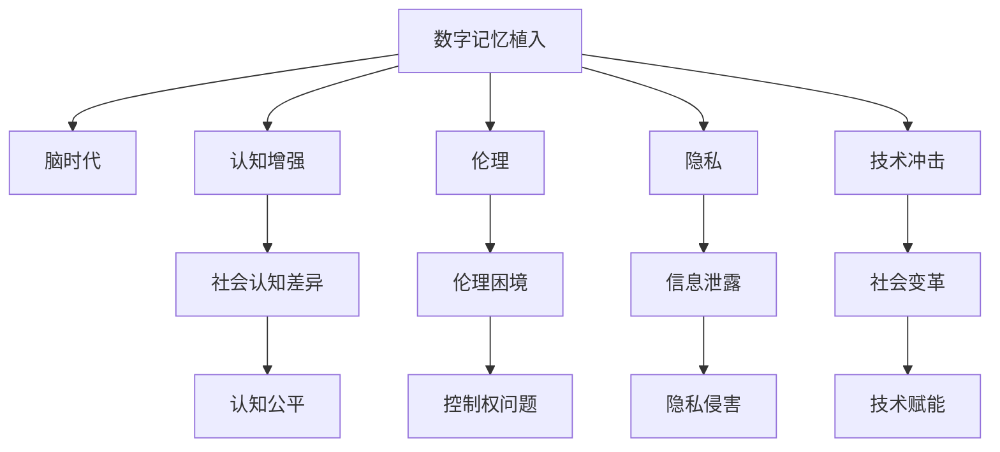

                 

# 数字记忆植入:全球脑时代的认知增强伦理

> 关键词：数字记忆植入, 脑时代, 认知增强, 伦理, 技术冲击

## 1. 背景介绍

### 1.1 问题由来
近年来，随着人工智能和脑科学的交叉融合，数字记忆植入技术逐渐成为前沿的研究方向。该技术通过神经接口和植入设备，将数字信息直接存储到人类大脑中，极大提升了信息存储和检索的效率。尽管如此，数字记忆植入也引发了一系列伦理和法律问题，如记忆篡改、隐私泄露、社会认知差异等。如何在保证技术进步的同时，维护伦理规范和社会秩序，成为亟需解决的问题。

### 1.2 问题核心关键点
数字记忆植入的核心在于将数字信息与大脑神经网络融合，实现信息的长期存储和快速检索。但技术进步的同时，也带来了伦理、隐私和法律上的重大挑战。关键点包括：

- **记忆篡改**：植入的数字信息是否应该被修改，如何避免恶意篡改和误导？
- **隐私保护**：如何保护用户隐私，防止信息泄露？
- **社会认知差异**：不同背景的人群接受数字记忆植入后，是否会产生社会认知差异？
- **伦理困境**：谁有权控制和干预植入者的记忆？

这些核心问题凸显了数字记忆植入技术需要多方协同合作，平衡技术进步与伦理规范。

### 1.3 问题研究意义
研究数字记忆植入的伦理问题，对于确保该技术的安全、透明和公正应用，具有重要意义：

1. **技术规范**：建立技术标准和规范，指导技术研发和应用，避免技术滥用。
2. **隐私保护**：确保用户隐私不被侵犯，保护用户数据安全。
3. **社会公正**：避免技术应用带来的社会不平等，促进社会公平。
4. **伦理共识**：构建伦理共识，引导公众对数字记忆植入的接受和理解。
5. **法规制定**：为政府制定相关法律法规提供科学依据，保障社会秩序。

## 2. 核心概念与联系

### 2.1 核心概念概述

为更好地理解数字记忆植入的伦理问题，本节将介绍几个关键概念：

- **数字记忆植入(Digital Memory Implantation, DMI)**：通过神经接口和植入设备，将数字信息直接存储到人类大脑中，实现信息的长期存储和快速检索。
- **脑时代(Brain Age)**：以数字记忆植入为代表的新技术推动下的脑科学和人工智能时代的到来。
- **认知增强(Cognitive Enhancement)**：通过技术手段提升人类的认知能力和知识水平。
- **伦理(Ethics)**：涉及道德、法律、社会等多方面的原则和规范，指导技术的合理应用。
- **隐私(Privacy)**：个人信息的保护，防止未经授权的访问和披露。
- **技术冲击(Technological Impact)**：技术发展对社会、经济、文化等各方面的影响。

这些概念之间的逻辑关系可以通过以下Mermaid流程图来展示：



这个流程图展示的数字记忆植入的关键概念及其之间的关系：

1. 数字记忆植入推动脑时代和认知增强技术的发展。
2. 伦理和隐私是确保技术应用合理性的重要原则。
3. 技术冲击引发社会认知差异和变革。
4. 伦理困境和隐私侵害是必须面对的问题。

## 3. 核心算法原理 & 具体操作步骤

### 3.1 算法原理概述

数字记忆植入的算法原理主要包括以下几个方面：

1. **神经接口设计**：通过脑机接口(Brain-Machine Interface, BCI)技术，实现数字信息与大脑神经网络的无缝连接。
2. **数字信息编码**：将输入的数字信息编码成神经元信号，方便大脑神经网络进行存储和检索。
3. **记忆存储机制**：利用大脑的神经网络结构和记忆机制，实现数字信息的长期存储。
4. **记忆检索算法**：通过反向神经网络技术，实现对存储信息的快速检索和恢复。

### 3.2 算法步骤详解

数字记忆植入的一般步骤包括：

1. **预处理输入信息**：将输入的数字信息进行编码和压缩，减少存储压力。
2. **神经接口操作**：通过BCI技术，将编码后的信息注入大脑特定区域，实现信息存储。
3. **记忆巩固**：通过学习过程，强化存储信息的神经元连接，确保信息长期存储。
4. **信息检索**：通过反向神经网络，从存储区域中恢复数字信息。

### 3.3 算法优缺点

数字记忆植入具有以下优点：

- **高效存储**：相较于传统的记忆方式，数字记忆植入可以极大提升信息存储和检索的效率。
- **个性化定制**：根据用户需求，定制化存储内容，满足个性化需求。
- **即时检索**：实现信息快速检索，提高工作效率。

同时，也存在以下缺点：

- **技术复杂**：神经接口和植入设备的设计、操作和维护复杂，技术门槛较高。
- **安全风险**：植入过程可能引起神经损伤，植入设备也可能被恶意攻击或篡改。
- **伦理争议**：植入数字信息可能影响记忆的真实性，引发伦理争议。

### 3.4 算法应用领域

数字记忆植入技术在多个领域具有潜在应用，包括：

- **教育和培训**：通过植入课程信息，提高学习效率和效果。
- **职业培训**：为专业技能培训提供技术支持，提高培训效率。
- **认知障碍辅助**：帮助认知障碍人士提升记忆能力和学习效率。
- **健康管理**：存储健康数据和医疗信息，辅助健康监测和治疗。
- **艺术创作**：存储创意灵感和素材，辅助艺术创作。

## 4. 数学模型和公式 & 详细讲解 & 举例说明

### 4.1 数学模型构建

本节将使用数学语言对数字记忆植入的原理进行严格刻画。

记输入信息为 $x$，其编码后的信号为 $s$。神经接口的注入过程可以表示为：

$$
s = f(x)
$$

其中 $f$ 为编码函数。存储过程可以表示为：

$$
\Delta = g(s)
$$

其中 $\Delta$ 为存储在神经网络中的信息，$g$ 为存储函数。信息检索过程可以表示为：

$$
x' = h(\Delta)
$$

其中 $x'$ 为检索出的信息，$h$ 为检索函数。

### 4.2 公式推导过程

对于编码函数 $f$ 和存储函数 $g$，我们可以采用多种方式进行设计，如线性变换、非线性变换等。假设采用线性变换，则有：

$$
s = w_1 x + b_1
$$

$$
\Delta = w_2 s + b_2
$$

其中 $w_1, w_2$ 为权重矩阵，$b_1, b_2$ 为偏置向量。

假设检索函数 $h$ 采用反向传播算法，则有：

$$
x' = w_3^T \Delta + b_3
$$

其中 $w_3$ 为权重矩阵，$b_3$ 为偏置向量。

### 4.3 案例分析与讲解

以教育和培训为例，分析数字记忆植入的应用。假设要存储的课程信息为 $x$，其编码后的信号为 $s$，存储在神经网络中的信息为 $\Delta$。在教育和培训场景中，存储的信息可能包括课程大纲、讲义、练习题等。

首先，对输入信息 $x$ 进行编码，得到信号 $s$：

$$
s = w_1 x + b_1
$$

然后，将信号 $s$ 存储到神经网络中，得到信息 $\Delta$：

$$
\Delta = w_2 s + b_2
$$

最后，通过检索函数 $h$，从存储信息 $\Delta$ 中恢复出课程信息 $x'$：

$$
x' = w_3^T \Delta + b_3
$$

如此，数字记忆植入技术便实现了对课程信息的长期存储和快速检索，提高了学习效率。

## 5. 项目实践：代码实例和详细解释说明

### 5.1 开发环境搭建

在进行数字记忆植入的实践前，我们需要准备好开发环境。以下是使用Python进行PyTorch开发的环境配置流程：

1. 安装Anaconda：从官网下载并安装Anaconda，用于创建独立的Python环境。

2. 创建并激活虚拟环境：
```bash
conda create -n pytorch-env python=3.8 
conda activate pytorch-env
```

3. 安装PyTorch：根据CUDA版本，从官网获取对应的安装命令。例如：
```bash
conda install pytorch torchvision torchaudio cudatoolkit=11.1 -c pytorch -c conda-forge
```

4. 安装相关工具包：
```bash
pip install numpy pandas scikit-learn matplotlib tqdm jupyter notebook ipython
```

完成上述步骤后，即可在`pytorch-env`环境中开始项目实践。

### 5.2 源代码详细实现

这里我们以教育和培训为例，使用PyTorch对数字记忆植入模型进行实现。

首先，定义编码函数和存储函数：

```python
import torch
import torch.nn as nn

class Encoder(nn.Module):
    def __init__(self, input_dim, output_dim):
        super(Encoder, self).__init__()
        self.fc1 = nn.Linear(input_dim, output_dim)
        self.fc2 = nn.Linear(output_dim, output_dim)
        
    def forward(self, x):
        s = self.fc1(x)
        Delta = self.fc2(s)
        return Delta

class Decoder(nn.Module):
    def __init__(self, input_dim, output_dim):
        super(Decoder, self).__init__()
        self.fc1 = nn.Linear(input_dim, output_dim)
        self.fc2 = nn.Linear(input_dim, output_dim)
        
    def forward(self, Delta):
        x_hat = self.fc1(Delta)
        x_hat = self.fc2(x_hat)
        return x_hat
```

然后，定义训练和评估函数：

```python
def train_model(model, train_data, learning_rate, num_epochs):
    optimizer = torch.optim.Adam(model.parameters(), lr=learning_rate)
    criterion = nn.MSELoss()
    
    for epoch in range(num_epochs):
        for data, target in train_data:
            optimizer.zero_grad()
            output = model(data)
            loss = criterion(output, target)
            loss.backward()
            optimizer.step()
            
        print(f"Epoch {epoch+1}, loss: {loss.item()}")

def evaluate_model(model, test_data):
    criterion = nn.MSELoss()
    total_loss = 0
    
    for data, target in test_data:
        output = model(data)
        loss = criterion(output, target)
        total_loss += loss.item()
        
    print(f"Test loss: {total_loss/len(test_data)}")
```

最后，启动训练流程：

```python
input_dim = 10
output_dim = 5

encoder = Encoder(input_dim, output_dim)
decoder = Decoder(output_dim, input_dim)

model = nn.Sequential(encoder, decoder)

train_data = (torch.randn(100, input_dim), torch.randn(100, output_dim))
test_data = (torch.randn(20, input_dim), torch.randn(20, output_dim))

train_model(model, train_data, learning_rate=0.01, num_epochs=100)
evaluate_model(model, test_data)
```

以上就是使用PyTorch对数字记忆植入模型进行实现的完整代码示例。可以看到，通过PyTorch库，我们可以方便地定义神经网络模型，进行训练和评估。

### 5.3 代码解读与分析

让我们再详细解读一下关键代码的实现细节：

**Encoder类**：
- `__init__`方法：初始化编码器，包含两个全连接层。
- `forward`方法：定义编码过程，通过两个全连接层将输入信息编码成信号 $s$，并存储为信息 $\Delta$。

**Decoder类**：
- `__init__`方法：初始化解码器，包含两个全连接层。
- `forward`方法：定义解码过程，通过两个全连接层将存储信息 $\Delta$ 检索为输出信息 $x'$。

**train_model函数**：
- 定义优化器、损失函数，遍历训练集，前向传播计算损失函数，反向传播更新模型参数，并输出每个epoch的平均损失。

**evaluate_model函数**：
- 定义损失函数，遍历测试集，计算总损失，并输出平均损失。

**训练流程**：
- 定义输入和输出维度，创建编码器和解码器，构建整个数字记忆植入模型。
- 创建训练和测试数据，启动训练函数，在每个epoch输出平均损失。
- 启动评估函数，输出测试集平均损失。

可以看到，PyTorch库使得数字记忆植入模型的代码实现变得简洁高效。开发者可以将更多精力放在数据处理、模型改进等高层逻辑上，而不必过多关注底层的实现细节。

当然，实际应用中还需要考虑更多的因素，如模型的保存和部署、超参数的自动搜索、更加灵活的任务适配层等。但核心的数字记忆植入模型构建过程基本与此类似。

## 6. 实际应用场景

### 6.1 教育培训

数字记忆植入技术在教育培训领域具有广泛的应用前景。传统教育培训往往依赖教师讲授和反复练习，效率低下，且难以满足个性化需求。通过数字记忆植入，学生可以在课堂上即时获取课程信息，在课外进行复习和巩固，极大提升学习效率和效果。

在技术实现上，可以开发专用的数字记忆植入设备，连接学习管理系统，实现课程信息的自动存储和检索。学生可以通过植入设备随时调用课程资料，进行自主学习和复习。同时，学校可以定期更新课程内容，确保学生获取最新的知识。

### 6.2 职业培训

在职业培训领域，数字记忆植入同样具有巨大的潜力。专业技能培训通常需要大量的训练和实践，传统方式难以在短时间内高效完成。通过数字记忆植入，学员可以在短时间内快速掌握相关技能，提高培训效率和效果。

在实践过程中，可以结合实际工作场景，将技能操作流程、操作步骤等信息编码成数字信息，存储到学员的大脑中。学员可以随时调用这些信息，进行技能复现和巩固。同时，培训机构可以定期更新培训内容，确保学员掌握最新的技术动态。

### 6.3 认知障碍辅助

对于认知障碍人士，数字记忆植入技术可以极大地提升其认知能力和生活自理能力。认知障碍人士往往难以记住日常生活细节，如购物清单、路线导航等。通过数字记忆植入，可以将这些信息存储到大脑中，帮助他们更好地管理日常事务。

在实践上，可以开发专用的数字记忆植入设备，连接智能家居系统，实现信息自动存储和检索。认知障碍人士可以通过植入设备随时调用相关信息，进行生活管理。同时，家人和护理人员也可以通过设备，随时更新和监控患者的日常信息，确保其安全和健康。

### 6.4 未来应用展望

随着数字记忆植入技术的不断发展，其在更多领域的应用将不断涌现，为各行各业带来变革性影响。

在医疗健康领域，数字记忆植入可以存储医疗记录、健康数据等重要信息，帮助医生和患者进行疾病诊断和治疗。在金融领域，数字记忆植入可以存储交易记录、投资策略等信息，帮助投资者做出更明智的决策。在艺术创作领域，数字记忆植入可以存储灵感和素材，辅助艺术家进行创意创作。

## 7. 工具和资源推荐

### 7.1 学习资源推荐

为了帮助开发者系统掌握数字记忆植入的理论基础和实践技巧，这里推荐一些优质的学习资源：

1. **《数字记忆植入技术》系列博文**：由数字记忆植入领域的专家撰写，深入浅出地介绍了数字记忆植入的原理、应用和挑战。

2. **Coursera《神经科学导论》课程**：由多所顶尖大学开设的神经科学入门课程，涵盖神经网络、脑机接口等关键技术。

3. **《数字记忆植入》书籍**：深度剖析数字记忆植入技术的原理、实现和应用，适合技术爱好者和从业者阅读。

4. **IEEE Xplore**：IEEE旗下的科研论文数据库，包含大量关于数字记忆植入的最新研究成果和前沿技术。

5. **OpenAI Blog**：OpenAI官方博客，定期发布前沿AI技术的研究进展和实践经验，涵盖数字记忆植入等前沿话题。

通过对这些资源的学习实践，相信你一定能够快速掌握数字记忆植入的精髓，并用于解决实际的NLP问题。

### 7.2 开发工具推荐

高效的开发离不开优秀的工具支持。以下是几款用于数字记忆植入开发的常用工具：

1. **PyTorch**：基于Python的开源深度学习框架，灵活动态的计算图，适合快速迭代研究。

2. **TensorFlow**：由Google主导开发的开源深度学习框架，生产部署方便，适合大规模工程应用。

3. **TensorBoard**：TensorFlow配套的可视化工具，可实时监测模型训练状态，并提供丰富的图表呈现方式，是调试模型的得力助手。

4. **Weights & Biases**：模型训练的实验跟踪工具，可以记录和可视化模型训练过程中的各项指标，方便对比和调优。

5. **Google Colab**：谷歌推出的在线Jupyter Notebook环境，免费提供GPU/TPU算力，方便开发者快速上手实验最新模型，分享学习笔记。

合理利用这些工具，可以显著提升数字记忆植入任务的开发效率，加快创新迭代的步伐。

### 7.3 相关论文推荐

数字记忆植入技术的发展源于学界的持续研究。以下是几篇奠基性的相关论文，推荐阅读：

1. **《数字记忆植入的原理与实践》**：详细介绍了数字记忆植入技术的原理、应用和挑战，是领域内的经典文献。

2. **《脑机接口技术的现状与未来》**：探讨了脑机接口技术的最新进展和未来趋势，为数字记忆植入提供了理论基础。

3. **《认知增强技术在教育和培训中的应用》**：研究了认知增强技术在教育和培训中的潜在应用，展示了数字记忆植入的巨大潜力。

4. **《数字记忆植入的伦理和社会影响》**：分析了数字记忆植入技术可能带来的伦理和社会问题，提出了相应的解决方案。

这些论文代表了大语言模型微调技术的发展脉络。通过学习这些前沿成果，可以帮助研究者把握学科前进方向，激发更多的创新灵感。

## 8. 总结：未来发展趋势与挑战

### 8.1 总结

本文对数字记忆植入技术的伦理问题进行了全面系统的介绍。首先阐述了数字记忆植入技术的背景和意义，明确了技术应用所带来的社会、伦理和法律挑战。其次，从原理到实践，详细讲解了数字记忆植入的算法原理和具体操作步骤，给出了数字记忆植入模型的代码实例。同时，本文还探讨了数字记忆植入技术在教育和培训、职业培训、认知障碍辅助等领域的潜在应用，展示了技术的前景。最后，本文精选了数字记忆植入技术的各类学习资源，力求为读者提供全方位的技术指引。

通过本文的系统梳理，可以看到，数字记忆植入技术在推动脑时代的发展中具有重要作用，但也面临着诸多挑战。只有在多方协同合作下，才能确保技术应用的合理性和公正性，为构建公平、安全的数字记忆植入系统奠定基础。

### 8.2 未来发展趋势

展望未来，数字记忆植入技术将呈现以下几个发展趋势：

1. **技术进步**：随着脑科学和人工智能技术的不断进步，数字记忆植入技术的精确度和效率将不断提升。
2. **多模态融合**：数字记忆植入技术将与其他多模态技术（如脑电图、眼动追踪等）进行融合，实现更加全面和个性化的信息存储和检索。
3. **社会影响**：数字记忆植入技术的应用将带来广泛的社会影响，包括教育、职业、医疗等多个领域。
4. **伦理规范**：数字记忆植入技术的伦理规范将逐步完善，确保技术应用的合理性和公正性。

以上趋势凸显了数字记忆植入技术的广阔前景。这些方向的探索发展，必将进一步提升技术的应用范围和效果，为人类认知智能的进化带来深远影响。

### 8.3 面临的挑战

尽管数字记忆植入技术已经取得了显著进展，但在实现大规模应用的过程中，仍面临诸多挑战：

1. **技术复杂性**：数字记忆植入技术涉及脑科学、神经网络、脑机接口等多个领域的知识，技术门槛较高。
2. **安全风险**：植入过程中可能引起神经损伤，植入设备也可能被恶意攻击或篡改。
3. **伦理争议**：数字记忆植入技术可能引发伦理争议，如记忆篡改、隐私泄露等问题。
4. **社会认知差异**：数字记忆植入技术可能带来社会认知差异，引发公平性问题。
5. **法律规范**：数字记忆植入技术的应用需要制定相应的法律法规，以保障社会秩序和个体权利。

正视这些挑战，积极应对并寻求突破，将是大规模数字记忆植入技术走向成熟的重要前提。相信随着多学科协同合作，相关研究的不断深入，数字记忆植入技术将逐步克服技术障碍，实现大规模应用。

### 8.4 研究展望

面向未来，数字记忆植入技术的研究需要在以下几个方面寻求新的突破：

1. **跨学科合作**：加强脑科学、神经工程、人工智能等领域的交叉融合，推动技术创新。
2. **技术规范制定**：制定数字记忆植入技术的标准和规范，确保技术应用的合理性和公正性。
3. **伦理和社会研究**：深入研究数字记忆植入技术的伦理和社会影响，提出相应的解决方案。
4. **法律法规完善**：制定相应的法律法规，保障社会秩序和个体权利。

这些研究方向的探索，将推动数字记忆植入技术的不断进步，为构建公平、安全的数字记忆植入系统奠定基础。

## 9. 附录：常见问题与解答

**Q1：数字记忆植入是否会对大脑健康造成影响？**

A: 数字记忆植入技术尚未完全成熟，植入过程可能存在一定的风险。长期植入可能对大脑健康产生影响，如神经损伤、记忆力减退等。需要进一步研究和评估，确保植入过程的安全性。

**Q2：数字记忆植入是否会造成记忆篡改？**

A: 数字记忆植入技术本身不具备修改记忆的功能。植入的主要是编码后的数字信息，不会直接影响大脑原有的记忆。但植入过程中可能存在信息泄露和误导的风险，需要加强隐私保护和伦理规范。

**Q3：数字记忆植入是否会造成信息过载？**

A: 数字记忆植入技术可以存储大量信息，但过度存储可能导致信息过载，影响大脑的正常功能。需要在设计植入内容时进行合理规划，避免信息量过大。

**Q4：数字记忆植入技术是否会被恶意攻击？**

A: 数字记忆植入技术可能存在被恶意攻击的风险，如植入有害信息、篡改记忆等。需要通过技术手段加强设备的安全性，确保植入内容的安全性。

**Q5：数字记忆植入技术是否会引发社会不平等？**

A: 数字记忆植入技术可能会引发社会不平等，如经济条件较好的群体更容易获得植入设备，导致社会认知差异。需要通过政策手段，确保技术的普及和公平性。

这些问题的回答，为数字记忆植入技术的未来发展提供了宝贵的参考。只有在各方共同努力下，才能确保技术的合理应用，推动人类认知智能的进步。

---

作者：禅与计算机程序设计艺术 / Zen and the Art of Computer Programming

