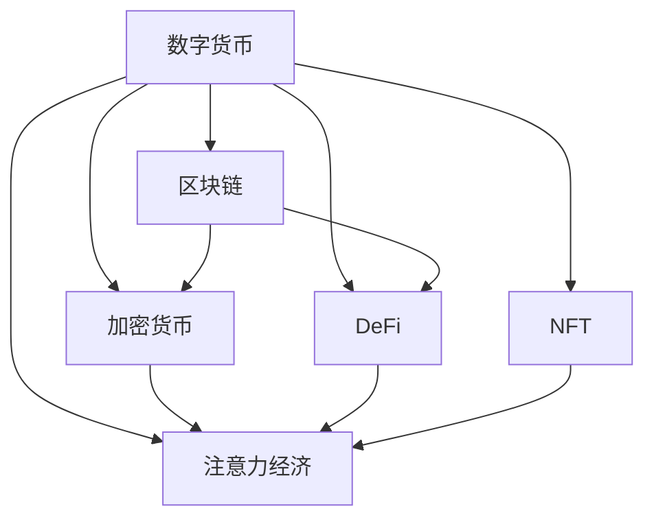

                 

# 数字货币在注意力经济中的应用前景

> 关键词：数字货币, 注意力经济, 区块链, 加密货币, DeFi, NFT, 安全, 效率, 隐私保护, 未来趋势

## 1. 背景介绍

### 1.1 问题由来

随着互联网技术的发展，传统经济模式正在逐步向数字化、网络化方向转型。其中，注意力经济作为新兴的经济形态，正逐渐成为数字时代的核心驱动力。注意力经济的核心理念是通过吸引并利用人们的注意力资源，实现商业价值最大化。数字货币作为数字时代的金融工具，在注意力经济中扮演着重要的角色。

### 1.2 问题核心关键点

数字货币在注意力经济中的应用主要体现在以下几个方面：

- **支付与结算**：通过区块链技术，数字货币提供了快速、低成本、安全的支付与结算方式，使得商品和服务交易更加便捷。
- **激励机制**：数字货币可以通过奖励机制激励用户参与内容创作、平台建设等，促进注意力资源的流动。
- **数据交易**：通过数字货币实现用户数据的自由买卖，推动数据市场的形成和发展。
- **去中心化**：数字货币基于区块链的分布式账本技术，实现了去中心化的治理模式，提高了透明度和安全性。

本文将深入探讨数字货币在注意力经济中的应用前景，分析其技术优势和潜在风险，提出未来发展的建议和方向。

## 2. 核心概念与联系

### 2.1 核心概念概述

为更好地理解数字货币在注意力经济中的应用，本节将介绍几个关键概念：

- **数字货币**：基于区块链技术的加密数字资产，用于交易和存储。其特点是去中心化、透明、不可篡改。
- **区块链**：一种去中心化的分布式账本技术，通过共识机制确保数据的不可篡改性和安全性。
- **加密货币**：使用加密算法保障交易安全、隐私保护的数字货币，包括比特币、以太坊等。
- **DeFi**：去中心化金融，利用区块链技术实现传统金融服务，如借贷、交易等。
- **NFT**：非同质化代币，用于表示独特的数字资产，如艺术品、游戏道具等。
- **注意力经济**：以吸引和利用人们的注意力为核心的经济模式，如社交媒体、内容创作平台等。

这些概念之间的逻辑关系可以通过以下Mermaid流程图来展示：



这个流程图展示了大货币在注意力经济中的核心概念及其之间的关系：

1. 数字货币基于区块链技术实现，通过加密算法保障交易安全。
2. DeFi利用区块链技术提供去中心化的金融服务。
3. NFT用于表示独特的数字资产，增强了数字经济的可操作性。
4. 注意力经济以吸引和利用人们的注意力为核心，通过数字货币激励参与者。

## 3. 核心算法原理 & 具体操作步骤
### 3.1 算法原理概述

数字货币在注意力经济中的应用，主要依赖于区块链和加密技术。区块链通过分布式共识机制，保证了数据的安全性和透明性，而加密技术则确保了交易的安全性和隐私保护。

### 3.2 算法步骤详解

数字货币在注意力经济中的使用可以分为以下几个步骤：

**Step 1: 设计区块链网络**
- 选择合适的共识机制，如PoW、PoS等，确定网络的治理规则。
- 设计智能合约，实现自动化交易和治理。
- 部署节点，形成分布式账本网络。

**Step 2: 发行数字货币**
- 通过区块链网络发行数字货币，设定货币单位和初始数量。
- 确定货币的供需机制，如减半机制、通缩机制等。
- 通过激励机制吸引用户参与网络建设。

**Step 3: 使用数字货币**
- 通过智能合约进行支付和结算，降低交易成本。
- 利用数字货币激励用户参与内容创作、平台建设等，促进注意力资源的流动。
- 实现用户数据的自由买卖，推动数据市场的形成和发展。

**Step 4: 维护区块链网络**
- 定期进行节点维护，确保网络稳定运行。
- 监控网络安全，防范攻击和欺诈。
- 根据网络发展需要，调整治理规则和激励机制。

### 3.3 算法优缺点

数字货币在注意力经济中的应用具有以下优点：

1. **去中心化**：通过区块链技术，数字货币实现了去中心化的治理模式，提高了透明度和安全性。
2. **高效性**：数字货币的交易速度快，交易成本低，适合高频次的支付和结算。
3. **隐私保护**：数字货币使用加密技术保护交易隐私，用户数据不被泄露。
4. **激励机制**：数字货币可以通过激励机制吸引用户参与网络建设，促进注意力资源的流动。

同时，数字货币也存在一些局限性：

1. **技术门槛高**：区块链技术复杂，需要较高的技术储备和资源投入。
2. **市场波动大**：数字货币价格波动大，可能带来投资风险。
3. **监管困难**：数字货币的匿名性和跨境流动性，使得监管难度增加。
4. **安全性问题**：区块链网络可能面临51%攻击、共识攻击等安全威胁。

### 3.4 算法应用领域

数字货币在注意力经济中的应用广泛，具体包括：

- **内容创作平台**：如区块链版Twitter、YouTube，通过数字货币激励创作者上传高质量内容。
- **社交媒体**：如Token-based的社交网络，用户通过参与内容创作、社区建设获得奖励。
- **数据交易平台**：如数据市场、数据交易所，通过数字货币实现用户数据的自由买卖。
- **去中心化金融**：如DeFi应用，通过智能合约提供去中心化的借贷、交易等服务。
- **艺术品和收藏品市场**：如基于NFT的虚拟艺术品市场，通过数字货币实现艺术品的交易和版权保护。

## 4. 数学模型和公式 & 详细讲解 & 举例说明

### 4.1 数学模型构建

数字货币在注意力经济中的应用，涉及数学模型和公式的推导。以下我们将使用数学语言对这一过程进行详细的阐述。

### 4.2 公式推导过程

考虑一个去中心化内容创作平台，用户通过上传内容获得数字货币奖励，平台通过数字货币激励用户参与内容创作和平台建设。

假设平台有$N$个用户，每个用户上传内容获得的数字货币奖励为$R$，平台每天收入为$I$，平台需要支付的激励费用为$C$。

**收入模型**：
$$
I = N \times R \times t
$$
其中$t$为内容上传的平均周期。

**激励模型**：
$$
C = N \times R \times c
$$
其中$c$为用户参与内容的平均周期。

平台的目标是最大化每天的净收入$P$，即：
$$
P = I - C
$$

代入上述公式，得：
$$
P = N \times R \times (t - c)
$$

为了最大化净收入$P$，需要最大化$(t - c)$，即提高内容上传频率，降低用户参与内容的平均周期。

### 4.3 案例分析与讲解

假设平台有1000个用户，每个用户每天上传内容获得2枚数字货币，平台每天收入为100枚数字货币，用户参与内容的平均周期为3天。

通过计算，平台每天的净收入为$1000 \times 2 \times (1 - \frac{1}{3}) = 1600$枚数字货币。

如果平台将奖励增加到3枚数字货币，用户参与内容的平均周期降低到2天，平台每天的净收入将提升至$1000 \times 3 \times (1 - \frac{1}{2}) = 1500$枚数字货币。

通过数字货币的激励机制，平台能够吸引更多的用户参与内容创作和平台建设，实现注意力资源的有效利用。

## 5. 项目实践：代码实例和详细解释说明
### 5.1 开发环境搭建

在进行数字货币项目实践前，我们需要准备好开发环境。以下是使用Python进行Solidity开发的环节：

1. 安装Node.js和npm：从官网下载并安装Node.js和npm，用于管理Solidity智能合约的依赖和打包。

2. 安装Truffle框架：使用npm安装Truffle框架，用于智能合约的开发、测试和部署。

```bash
npm install -g truffle
```

3. 配置Truffle环境：在Truffle环境中配置开发网络和测试网络，方便进行智能合约的调试和测试。

```bash
truffle init
truffle develop
```

4. 安装Solidity编译器：使用npm安装Solidity编译器，用于将智能合约代码转换为字节码，并打包部署到区块链网络。

```bash
npm install -g solc
```

完成上述步骤后，即可在Truffle环境中开始数字货币项目的开发。

### 5.2 源代码详细实现

以下是使用Solidity语言实现数字货币项目的代码示例。

```solidity
// SPDX-License-Identifier: MIT
pragma solidity ^0.8.0;

contract DigitalCurrency {
    uint256 public balance;
    
    constructor(uint256 initialBalance) {
        balance = initialBalance;
    }
    
    function mint(uint256 amount) public {
        balance += amount;
    }
    
    function transfer(uint256 receiver, uint256 amount) public {
        require(balance >= amount, "Insufficient balance");
        balance -= amount;
        Address payable(receiver).transfer(amount);
    }
    
    function getBalance() public view returns (uint256) {
        return balance;
    }
    
    function getName() public view returns (string memory) {
        return "Digital Currency";
    }
}
```

在这个示例中，我们定义了一个简单的数字货币合约，实现了发行、转账和获取余额等功能。

**constructor**：合约初始化函数，定义初始余额。

**mint**：发行数字货币，增加余额。

**transfer**：转账函数，减少余额并转至接收者钱包。

**getBalance**：获取余额函数，返回当前余额。

**getName**：获取合约名称函数，返回"Digital Currency"。

### 5.3 代码解读与分析

让我们再详细解读一下关键代码的实现细节：

**constructor函数**：
- 在合约创建时，通过参数初始化余额，确保合约一创建就有一定数量的数字货币。

**mint函数**：
- 用户可以调用该函数，增加自己的余额，用于模拟发行数字货币。

**transfer函数**：
- 调用该函数，可以将一定数量的数字货币转账给其他用户，实现货币的流转。

**getBalance函数**：
- 返回当前用户的余额，用于查询和监控余额变化。

**getName函数**：
- 返回合约的名称，便于识别和区分不同的数字货币合约。

## 6. 实际应用场景
### 6.1 智能内容创作平台

数字货币在智能内容创作平台中的应用，可以极大地激励创作者上传高质量内容。平台可以通过数字货币奖励创作者，吸引更多优质内容，提升平台的吸引力。

**应用场景**：
- 用户上传文章、视频、图片等内容，获得一定数量的数字货币奖励。
- 创作者通过数字货币激励，上传更多高质量内容，提高平台的用户活跃度。
- 平台通过内容审核和推荐算法，筛选优质内容，提升平台的影响力。

### 6.2 社交媒体

数字货币在社交媒体中的应用，可以实现用户之间的互动和奖励。通过数字货币激励，用户可以参与平台建设、内容创作等，促进社区的良性发展。

**应用场景**：
- 用户参与内容创作、社区建设等，获得数字货币奖励。
- 平台通过数字货币激励，吸引更多用户参与平台建设，提升用户活跃度。
- 用户可以通过数字货币参与投票、奖励等活动，增强社区的凝聚力。

### 6.3 数据交易平台

数字货币在数据交易平台中的应用，可以实现用户数据的自由买卖，推动数据市场的形成和发展。

**应用场景**：
- 用户将自己的数据上传到平台，获得一定数量的数字货币奖励。
- 数据购买者通过数字货币交易平台，购买所需数据，提升数据利用效率。
- 平台通过数字货币激励，吸引更多用户上传数据，丰富数据资源库。

### 6.4 去中心化金融

数字货币在去中心化金融中的应用，可以提供去中心化的借贷、交易等服务，减少传统金融系统的中介成本和风险。

**应用场景**：
- 用户通过数字货币抵押获得贷款，降低贷款成本。
- 用户通过数字货币参与去中心化交易，获得更高的交易效率和安全性。
- 平台通过数字货币激励，吸引更多用户参与平台建设，提升平台的竞争力。

### 6.5 艺术品和收藏品市场

数字货币在艺术品和收藏品市场中的应用，可以实现艺术品的交易和版权保护，推动数字艺术的发展。

**应用场景**：
- 艺术家将自己的艺术品上传平台，获得数字货币奖励。
- 收藏家通过数字货币交易平台，购买所需的艺术品，确保版权保护。
- 平台通过数字货币激励，吸引更多艺术家上传艺术品，丰富艺术品市场。

## 7. 工具和资源推荐
### 7.1 学习资源推荐

为了帮助开发者系统掌握数字货币在注意力经济中的应用，这里推荐一些优质的学习资源：

1. 《区块链原理与实践》：一本系统介绍区块链技术的经典书籍，适合初学者入门。
2. 《以太坊智能合约编程》：一本介绍以太坊智能合约开发的书籍，包含大量实用代码和案例。
3. 《DeFi开发实战》：一本详细介绍去中心化金融开发的书籍，适合有一定区块链基础的开发者。
4. 《NFT艺术市场：虚拟艺术品的兴起》：一本介绍NFT市场和虚拟艺术品发展的书籍，适合对数字艺术感兴趣的读者。
5. 以太坊官网和Solidity文档：以太坊和Solidity的官方文档，提供最新的技术支持和编程指南。

通过对这些资源的学习实践，相信你一定能够快速掌握数字货币在注意力经济中的应用，并用于解决实际的NLP问题。

### 7.2 开发工具推荐

高效的开发离不开优秀的工具支持。以下是几款用于数字货币项目开发的常用工具：

1. Truffle框架：用于智能合约的开发、测试和部署，支持Solidity语言的编译和打包。
2. Remix IDE：一款基于Web的智能合约开发工具，支持Solidity语言的在线编辑和测试。
3. MetaMask钱包：一款以太坊钱包，支持数字货币的存储和交易，方便开发者进行测试和部署。
4. ConsenSys Academy：以太坊官方培训平台，提供丰富的区块链开发课程和实战项目。
5. OpenZeppelin：一款智能合约安全工具库，提供常见的安全检查和防护措施，提高智能合约的安全性。

合理利用这些工具，可以显著提升数字货币项目开发的效率，加快创新迭代的步伐。

### 7.3 相关论文推荐

数字货币在注意力经济中的应用源于学界的持续研究。以下是几篇奠基性的相关论文，推荐阅读：

1. Satoshi Nakamoto. "Bitcoin: A Peer-to-Peer Electronic Cash System." 2008.
2. Vitalik Buterin. "A Next-Generation Smart Contract and Decentralized Application Platform." 2013.
3. Andreas M. Antonopoulos. "Mastering Bitcoin: Fundamentals, Tools, and Techniques." 2014.
4. Davidsummary summary. "A Survey on Blockchain-based Financial Services." 2020.
5. Axel Arzt. "Smart Contracts: Foundations and Mechanisms." 2020.

这些论文代表了大货币在注意力经济中的应用发展脉络。通过学习这些前沿成果，可以帮助研究者把握学科前进方向，激发更多的创新灵感。

## 8. 总结：未来发展趋势与挑战
### 8.1 总结

本文对数字货币在注意力经济中的应用进行了全面系统的介绍。首先阐述了大货币和注意力经济的研究背景和意义，明确了数字货币在注意力经济中的应用价值。其次，从原理到实践，详细讲解了数字货币的发行、使用和激励机制，给出了智能合约的代码实现。同时，本文还广泛探讨了数字货币在内容创作、社交媒体、数据交易等众多领域的应用前景，展示了数字货币的巨大潜力。此外，本文精选了数字货币相关的学习资源，力求为读者提供全方位的技术指引。

通过本文的系统梳理，可以看到，数字货币在注意力经济中的应用前景广阔，具有去中心化、高效性、隐私保护等独特优势，能够极大地激励用户参与内容创作和平台建设，促进注意力资源的流动。未来，伴随数字货币技术的不断进步，相信数字货币在注意力经济中的应用将进一步深化，为数字经济的发展注入新的动力。

### 8.2 未来发展趋势

展望未来，数字货币在注意力经济中的应用将呈现以下几个发展趋势：

1. **技术成熟度提升**：随着区块链和智能合约技术的不断成熟，数字货币的应用场景将更加丰富，安全性和效率也将得到进一步提升。
2. **去中心化程度加深**：越来越多的领域将采用去中心化的治理模式，数字货币将发挥越来越重要的作用。
3. **应用领域扩大**：数字货币将渗透到更多领域，如智能合约、供应链管理、数字艺术等，推动数字化转型。
4. **市场规模扩大**：数字货币市场将逐步壮大，成为全球经济的重要组成部分，吸引更多投资者参与。
5. **监管环境改善**：各国政府和监管机构将逐步完善数字货币的监管框架，为数字货币的健康发展提供保障。

这些趋势凸显了数字货币在注意力经济中的广阔前景。这些方向的探索发展，必将进一步提升数字货币的应用效果，为数字经济的发展带来新的动力。

### 8.3 面临的挑战

尽管数字货币在注意力经济中的应用前景广阔，但在迈向更加智能化、普适化应用的过程中，它仍面临着诸多挑战：

1. **技术复杂性高**：区块链和智能合约技术复杂，需要较高的技术储备和资源投入。
2. **市场波动大**：数字货币价格波动大，可能带来投资风险。
3. **监管难度大**：数字货币的匿名性和跨境流动性，使得监管难度增加。
4. **安全性问题**：区块链网络可能面临51%攻击、共识攻击等安全威胁。
5. **用户接受度低**：部分用户对数字货币的理解和接受度较低，影响了数字货币的推广和应用。

### 8.4 研究展望

面对数字货币在注意力经济中面临的种种挑战，未来的研究需要在以下几个方面寻求新的突破：

1. **简化技术门槛**：开发更加易用、易理解的技术工具，降低数字货币应用的入门门槛。
2. **优化市场机制**：建立更公平、透明的市场机制，降低数字货币市场的波动风险。
3. **加强监管合作**：各国政府和监管机构加强合作，制定统一的数字货币监管框架。
4. **提高安全性**：引入先进的安全技术，防范区块链网络的安全威胁。
5. **提高用户接受度**：通过教育和宣传，提高公众对数字货币的理解和接受度。

这些研究方向的探索，必将引领数字货币在注意力经济中的应用向更高台阶迈进，为数字经济的发展带来新的动力。

## 9. 附录：常见问题与解答

**Q1：数字货币在注意力经济中的应用是否存在法律风险？**

A: 数字货币在注意力经济中的应用，可能涉及各类法律风险，包括但不限于版权、隐私、反垄断等问题。因此，在使用数字货币时，需要遵守相关的法律法规，保护用户权益。

**Q2：数字货币在内容创作平台中的应用，是否会导致版权纠纷？**

A: 数字货币在内容创作平台中的应用，需要明确版权归属和激励机制，避免版权纠纷。可以通过智能合约设定版权归属规则，确保创作者的权益。

**Q3：数字货币在社交媒体中的应用，是否存在用户隐私风险？**

A: 数字货币在社交媒体中的应用，需要确保用户隐私的保护。平台可以通过匿名化和去标识化的方式，保护用户隐私。

**Q4：数字货币在数据交易平台中的应用，是否存在数据泄露风险？**

A: 数字货币在数据交易平台中的应用，需要确保数据的安全性和隐私保护。平台可以通过加密技术和安全协议，保护用户数据不被泄露。

**Q5：数字货币在去中心化金融中的应用，是否存在金融风险？**

A: 数字货币在去中心化金融中的应用，需要确保系统的稳定性和安全性。平台可以通过智能合约和去中心化审计，提高系统的安全性和可靠性。

通过本文的系统梳理，可以看到，数字货币在注意力经济中的应用前景广阔，具有去中心化、高效性、隐私保护等独特优势，能够极大地激励用户参与内容创作和平台建设，促进注意力资源的流动。未来，伴随数字货币技术的不断进步，相信数字货币在注意力经济中的应用将进一步深化，为数字经济的发展注入新的动力。

---

作者：禅与计算机程序设计艺术 / Zen and the Art of Computer Programming

