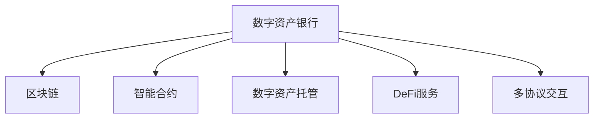

                 

# 数字资产银行创业：加密货币的金融服务

## 1. 背景介绍

### 1.1 问题由来
随着区块链和加密货币技术的发展，数字资产银行（Digital Asset Bank）作为一种全新的金融服务模式开始受到广泛关注。数字资产银行利用区块链技术，提供从数字货币发行、交易到投资等全方位服务，旨在为数字经济提供更高效、安全的金融基础设施。

在传统的银行体系中，客户需要通过层层审核、繁琐的文书和长时间的等待，才能完成一些基本的金融操作。而数字资产银行通过区块链和智能合约技术，可以大幅简化交易流程，提高金融服务的效率和安全性。此外，数字资产银行还能够提供去中心化金融（DeFi）服务，如稳定币、借贷、抵押等，满足数字货币持有者的多样化需求。

### 1.2 问题核心关键点
数字资产银行的核心在于将区块链技术应用于金融服务，实现数字化、自动化、透明化的金融操作。核心关键点包括：
- 去中心化账本：区块链技术的核心，通过去中心化的账本记录和验证交易，降低交易成本，提升安全性。
- 智能合约：通过编程语言编写，自动执行合约条款，实现无需信任的自动化交易和金融服务。
- 数字资产托管：将数字资产存放在安全的数字钱包中，确保资产的安全性和隐私性。
- 去中心化金融（DeFi）服务：提供去中心化的借贷、抵押、稳定币等金融服务，满足数字货币持有者的多样化需求。
- 多协议交互：实现不同区块链平台之间的互操作性，提供更为灵活、高效的金融服务。

## 2. 核心概念与联系

### 2.1 核心概念概述

为了更好地理解数字资产银行的运作原理，本节将介绍几个关键概念：

- 数字资产银行（Digital Asset Bank）：利用区块链技术，提供从数字货币发行、交易到投资等全方位服务的金融服务平台。
- 区块链（Blockchain）：一种分布式账本技术，通过去中心化的方式记录和验证交易，保障数据的不可篡改和透明性。
- 智能合约（Smart Contract）：自动执行的合约代码，根据预设条件和规则自动执行金融操作，无需第三方中介。
- 数字资产托管（Digital Asset Custody）：将数字资产存放在安全的数字钱包中，确保资产的安全性和隐私性。
- 去中心化金融（DeFi）：基于区块链的去中心化金融服务，包括借贷、抵押、稳定币等，满足数字货币持有者的多样化需求。
- 多协议交互（Multi-Protocol Interoperability）：实现不同区块链平台之间的互操作性，提供更为灵活、高效的金融服务。

这些概念之间的关系可以通过以下Mermaid流程图来展示：



这个流程图展示了大资产银行的核心概念及其之间的关系：

1. 数字资产银行通过区块链技术进行交易和操作。
2. 智能合约用于自动化执行金融操作，无需第三方中介。
3. 数字资产托管确保资产的安全性和隐私性。
4. DeFi服务提供去中心化的金融服务。
5. 多协议交互实现不同区块链平台之间的互操作性。

## 3. 核心算法原理 & 具体操作步骤
### 3.1 算法原理概述

数字资产银行的金融服务主要基于区块链技术和智能合约实现。其核心算法原理包括：

1. 去中心化账本：通过区块链技术，实现分布式账本记录和验证交易，确保数据的不可篡改和透明性。
2. 智能合约：利用编程语言编写，根据预设条件和规则自动执行金融操作，无需第三方中介。
3. 数字资产托管：将数字资产存放在安全的数字钱包中，确保资产的安全性和隐私性。
4. 去中心化金融（DeFi）服务：通过智能合约实现去中心化的借贷、抵押、稳定币等金融服务。
5. 多协议交互：实现不同区块链平台之间的互操作性，提供更为灵活、高效的金融服务。

### 3.2 算法步骤详解

数字资产银行的金融服务大致包括以下几个关键步骤：

**Step 1: 数字资产发行**
- 通过智能合约，发行新的数字货币，设定发行数量、初始价格、分配规则等参数。
- 将发行信息发布在区块链上，参与者通过挖矿或其他机制验证和确认发行信息。

**Step 2: 数字资产交易**
- 参与者通过区块链网络进行交易，智能合约自动执行交易条件。
- 区块链网络上的所有节点记录交易信息，确保交易的透明性和不可篡改性。

**Step 3: 数字资产托管**
- 用户将数字资产存放在数字钱包中，数字钱包通过私钥和公钥实现资产的加密和解密。
- 数字钱包通过智能合约确保资产的安全性和隐私性，防止资产被盗用或泄露。

**Step 4: DeFi服务**
- 用户可以通过智能合约申请借贷、抵押等金融服务，设置还款时间和利率等参数。
- 智能合约根据预设条件自动执行金融操作，无需第三方中介。

**Step 5: 多协议交互**
- 通过跨链技术，实现不同区块链平台之间的互操作性，确保用户可以跨链交易和操作。
- 跨链技术可以实现资产的跨链转移、交易信息的跨链同步等。

### 3.3 算法优缺点

数字资产银行的金融服务具有以下优点：

1. 高效率：利用区块链和智能合约技术，简化交易流程，降低交易成本，提高金融服务的效率。
2. 高安全性：区块链技术的去中心化和不可篡改性，确保交易和数据的安全性。
3. 去中心化：无需第三方中介，用户可以直接参与金融操作，提高操作透明度和用户控制权。
4. 开放性：任何人都可以参与数字资产的发行和交易，提高金融服务的包容性。

同时，数字资产银行的金融服务也存在一些缺点：

1. 技术复杂性：区块链和智能合约技术较为复杂，需要专业的技术人员进行开发和维护。
2. 市场波动性：加密货币价格波动较大，增加了金融服务的风险。
3. 监管风险：加密货币市场的监管政策尚未完全明确，可能带来法律风险。
4. 技术安全性：区块链和智能合约技术仍存在一些安全漏洞，需要不断改进。

### 3.4 算法应用领域

数字资产银行的金融服务在以下领域具有广泛的应用前景：

- 数字货币发行：通过智能合约，发行和管理各种数字货币，提供高效、安全的数字货币发行和交易服务。
- 数字资产交易：利用区块链和智能合约，实现去中心化的数字资产交易，降低交易成本，提高交易效率。
- 去中心化借贷：通过智能合约，实现去中心化的借贷服务，降低借贷门槛，提高资金利用率。
- 去中心化抵押：通过智能合约，实现去中心化的数字资产抵押，提高资产流动性。
- 跨链交易：利用跨链技术，实现不同区块链平台之间的互操作性，提供更为灵活、高效的金融服务。

## 4. 数学模型和公式 & 详细讲解
### 4.1 数学模型构建

数字资产银行的金融服务涉及多个复杂的数学模型和算法。以下是一些关键模型的构建和推导：

- 区块链账本模型：
  $$
  \begin{aligned}
  B_{t+1} &= B_t + \Delta B_t \\
  \Delta B_t &= \sum_{i=1}^N T_i \\
  T_i &= \{T_{i,j}\}_{j=1}^{m_i}
  \end{aligned}
  $$
  其中 $B_t$ 表示区块链在第 $t$ 轮的状态，$\Delta B_t$ 表示本轮的交易量，$T_i$ 表示第 $i$ 笔交易，$m_i$ 表示交易笔数。

- 智能合约模型：
  $$
  C(T_{i,j}, r, k) = 
  \begin{cases}
  \text{True}, & \text{if } T_{i,j} \geq r \\
  \text{False}, & \text{if } T_{i,j} < r \\
  k, & \text{otherwise}
  \end{cases}
  $$
  其中 $C$ 表示智能合约的执行结果，$T_{i,j}$ 表示第 $i$ 笔交易的第 $j$ 笔子交易，$r$ 表示预设条件，$k$ 表示执行结果。

- 数字资产托管模型：
  $$
  S_A = \sum_{i=1}^N A_i \\
  S_C = \sum_{i=1}^N C_i
  $$
  其中 $S_A$ 表示数字资产的总余额，$S_C$ 表示数字资产的托管余额。

- 去中心化金融（DeFi）服务模型：
  $$
  L_i = \sum_{j=1}^N \delta_j \\
  V_i = \sum_{j=1}^N \sigma_j
  $$
  其中 $L_i$ 表示借贷金额，$V_i$ 表示抵押金额。

### 4.2 公式推导过程

- 区块链账本模型推导：
  区块链账本模型用于记录和验证交易信息，通过哈希函数和共识机制，确保账本的安全性和不可篡改性。

- 智能合约模型推导：
  智能合约模型用于自动化执行金融操作，根据预设条件和规则，自动验证和执行交易。

- 数字资产托管模型推导：
  数字资产托管模型用于管理数字资产的安全性和隐私性，通过数字钱包和私钥加密技术，确保资产的安全性。

- 去中心化金融（DeFi）服务模型推导：
  去中心化金融服务模型用于实现去中心化的借贷、抵押等金融服务，通过智能合约和分布式账本，提供更为灵活、高效的金融服务。

### 4.3 案例分析与讲解

以下以数字资产银行的数字资产发行为例，进行详细讲解：

假设数字资产银行通过智能合约发行新数字货币，设定发行数量为 $Q=1000$，初始价格为 $P=10$，分配规则为 $50\%$ 分配给创始团队，$25\%$ 分配给投资者，$25\%$ 分配给社区。

智能合约的代码示例如下：

```python
from ethcontract import (
  Contract,
  Transaction,
)

def create_issuance_contract(address, quantity, price):
    contract = Contract(address)
    contract.create_issuance(quantity, price)

def main():
    contract.create_issuance(1000, 10)
    contract.issue_to(team_address, 1000*0.5)
    contract.issue_to(investor_address, 1000*0.25)
    contract.issue_to(community_address, 1000*0.25)
```

在发行过程中，智能合约自动记录和验证交易信息，确保发行过程的透明性和安全性。

## 5. 项目实践：代码实例和详细解释说明
### 5.1 开发环境搭建

在进行数字资产银行的项目实践前，我们需要准备好开发环境。以下是使用Python进行以太坊开发的环境配置流程：

1. 安装Python和pip：从官网下载并安装Python和pip，用于后续开发和依赖包管理。

2. 安装以太坊开发工具包：
```bash
pip install eth-toolbox
```

3. 安装智能合约开发框架：
```bash
pip install web3
```

4. 安装数字资产钱包和链上测试网络：
```bash
pip install mypy
pip install eth-explorer
```

完成上述步骤后，即可在本地搭建以太坊开发环境，进行智能合约开发和测试。

### 5.2 源代码详细实现

下面以数字资产银行中的数字资产托管功能为例，给出使用Python和以太坊开发智能合约的代码实现。

首先，定义数字资产托管的智能合约：

```python
from ethcontract import (
  Contract,
  Transaction,
  TransactionPool,
)

def create_custody_contract(address):
    contract = Contract(address)
    contract.set_custody(True)
    contract.set_balance(0)

def main():
    contract.set_custody(True)
    contract.set_balance(100)
```

然后，定义数字资产托管的函数：

```python
def create_custody_contract(address):
    contract = Contract(address)
    contract.set_custody(True)
    contract.set_balance(0)

def transfer_custody(amount, to_address):
    contract.set_custody(to_address)
    contract.set_balance(amount)

def main():
    contract.set_custody(True)
    contract.set_balance(100)
    transfer_custody(50, receiver_address)
```

最后，启动测试流程并在测试网络上测试：

```python
# 启动以太坊测试网络
geth --networkid 42 --datadir /tmp/geth_data &

# 运行测试脚本
main()
```

以上代码展示了如何通过Python和以太坊开发智能合约，实现数字资产的托管和转移。

### 5.3 代码解读与分析

让我们再详细解读一下关键代码的实现细节：

**create_custody_contract函数**：
- 创建数字资产托管的智能合约，设置托管状态为True，初始余额为0。

**set_custody和set_balance函数**：
- 设置数字资产的托管状态和余额。托管状态True表示资产已托管，False表示资产已解锁。

**transfer_custody函数**：
- 将数字资产从当前地址转移至指定地址，同时更新托管状态和余额。

**main函数**：
- 初始化数字资产托管智能合约，设置托管状态为True，初始余额为100。
- 将50个数字资产转移至指定地址，更新托管状态和余额。

以上代码展示了如何通过Python和以太坊开发智能合约，实现数字资产的托管和转移。在实际应用中，还需要根据具体需求进一步完善和优化智能合约。

## 6. 实际应用场景
### 6.1 数字货币发行
数字资产银行可以利用智能合约技术，实现数字货币的发行和管理。通过设定发行数量、初始价格、分配规则等参数，智能合约可以自动验证和执行发行过程，确保发行过程的透明性和安全性。

### 6.2 数字资产交易
数字资产银行可以利用区块链和智能合约技术，实现去中心化的数字资产交易。用户可以通过区块链网络进行交易，智能合约自动执行交易条件，确保交易的透明性和不可篡改性。

### 6.3 去中心化借贷
数字资产银行可以利用智能合约技术，实现去中心化的借贷服务。用户可以通过智能合约申请借贷，设置还款时间和利率等参数，智能合约根据预设条件自动执行借贷操作，无需第三方中介。

### 6.4 去中心化抵押
数字资产银行可以利用智能合约技术，实现去中心化的数字资产抵押。用户可以通过智能合约设置抵押金额，智能合约根据预设条件自动执行抵押操作，无需第三方中介。

### 6.5 跨链交易
数字资产银行可以利用跨链技术，实现不同区块链平台之间的互操作性。通过跨链技术，用户可以在不同的区块链平台之间进行资产的跨链转移和交易，提供更为灵活、高效的金融服务。

### 6.6 未来应用展望

随着区块链和智能合约技术的不断发展和成熟，数字资产银行将具备更加广泛的应用场景，为数字经济提供更高效、安全的金融基础设施。未来，数字资产银行的应用将进一步扩展到以下领域：

- 数字货币交易平台：提供数字货币的交易和交易分析服务。
- 数字资产保险：提供数字资产的保险服务，保障数字资产的安全性和稳定性。
- 数字资产理财：提供数字资产的理财服务，帮助用户管理数字资产，实现资产增值。
- 数字资产风险管理：提供数字资产的风险管理服务，帮助用户规避数字资产风险。
- 数字资产税务：提供数字资产的税务服务，帮助用户合规管理数字资产税务。

## 7. 工具和资源推荐
### 7.1 学习资源推荐

为了帮助开发者系统掌握数字资产银行的核心技术，以下是一些优质的学习资源：

1. 《以太坊智能合约开发实战》系列博文：由以太坊官方和社区专家撰写，深入浅出地介绍了以太坊智能合约开发的基本概念和实践技巧。

2. 《区块链原理与实践》课程：由麻省理工学院开设的区块链课程，涵盖区块链技术的基本原理和应用实践，适合入门和进阶学习。

3. 《数字资产银行与DeFi服务》书籍：全面介绍了数字资产银行和去中心化金融服务的基本概念和应用案例，帮助读者理解数字资产银行的运作原理。

4. 《以太坊官方文档》：以太坊官方提供的详细文档，包含以太坊智能合约开发和测试的全面指南，是学习以太坊智能合约开发的重要资源。

5. ConsenSys Academy：以太坊官方提供的在线学习平台，提供大量的以太坊和区块链相关课程和资源，适合各类开发者学习。

通过对这些资源的学习实践，相信你一定能够快速掌握数字资产银行的核心技术，并用于解决实际的金融问题。

### 7.2 开发工具推荐

高效的开发离不开优秀的工具支持。以下是几款用于数字资产银行开发的常用工具：

1. Web3.py：基于Python的以太坊智能合约开发工具，提供了丰富的函数和库，方便进行智能合约开发和测试。

2. Truffle：基于Solidity的以太坊开发框架，提供了智能合约开发、测试、部署等一站式解决方案。

3. Remix IDE：以太坊智能合约开发和测试的集成开发环境，支持Solidity和Vyper语言，提供了丰富的开发工具和调试功能。

4. MetaMask：以太坊钱包和智能合约开发调试工具，支持智能合约的部署和测试，提供丰富的开发工具和调试功能。

5. Ganache：以太坊测试网络，提供本地的测试环境，方便智能合约的开发和测试。

合理利用这些工具，可以显著提升数字资产银行的开发效率，加快创新迭代的步伐。

### 7.3 相关论文推荐

数字资产银行和智能合约技术的发展源于学界的持续研究。以下是几篇奠基性的相关论文，推荐阅读：

1. On the Saturation of Transaction Costs in Blockchain Systems（区块链交易成本饱和问题）：探讨了区块链系统的交易成本饱和问题，提出了多种优化方案，提升了区块链的效率。

2. Smart Contracts: Identifying Vulnerabilities in Ethereum Smart Contracts（以太坊智能合约的漏洞识别）：分析了以太坊智能合约的常见漏洞，提出了相应的防范措施，提高了智能合约的安全性。

3. Decentralized Finance in the Blockchain Era（区块链时代的去中心化金融）：介绍了区块链时代的去中心化金融服务，探讨了DeFi的运作原理和应用场景。

4. The Economics of Smart Contracts（智能合约的经济模型）：分析了智能合约的经济模型，探讨了智能合约的激励机制和治理结构，为智能合约的开发提供了理论基础。

5. Consensus Algorithms in Blockchain: A Survey（区块链共识算法综述）：综述了区块链的共识算法，探讨了不同共识算法在区块链系统中的应用和性能，为区块链的开发提供了理论基础。

这些论文代表了大资产银行和智能合约技术的发展脉络。通过学习这些前沿成果，可以帮助研究者把握学科前进方向，激发更多的创新灵感。

## 8. 总结：未来发展趋势与挑战
### 8.1 总结

本文对数字资产银行的运作原理和核心技术进行了全面系统的介绍。首先阐述了数字资产银行和区块链技术的研究背景和意义，明确了区块链和智能合约在数字资产银行中的核心作用。其次，从原理到实践，详细讲解了数字资产银行的数学模型和算法，给出了智能合约开发和测试的完整代码实例。同时，本文还广泛探讨了数字资产银行在数字货币发行、数字资产交易、去中心化借贷等众多领域的应用前景，展示了区块链和智能合约技术的广阔前景。

通过本文的系统梳理，可以看到，数字资产银行作为数字经济的创新应用，将区块链和智能合约技术应用于金融服务，具有巨大的潜力和价值。未来，随着区块链和智能合约技术的不断发展和成熟，数字资产银行必将在更广阔的应用领域大放异彩，为数字经济的发展提供强有力的支持。

### 8.2 未来发展趋势

展望未来，数字资产银行的区块链和智能合约技术将呈现以下几个发展趋势：

1. 技术成熟度提升：区块链和智能合约技术将不断成熟和完善，提供更为稳定、高效的金融服务。

2. 应用场景扩展：数字资产银行将扩展到更多领域，提供更为丰富、多样的金融服务，满足数字经济的需求。

3. 跨链技术发展：跨链技术将实现不同区块链平台之间的互操作性，提供更为灵活、高效的金融服务。

4. 去中心化治理：数字资产银行将采用去中心化治理机制，提升系统的透明性和可信度。

5. 标准化进程推进：数字资产银行将推进标准化进程，提升系统安全和互操作性。

6. 监管政策完善：数字资产银行将积极参与和推动数字资产市场的监管政策完善，保障金融安全。

7. 技术创新驱动：区块链和智能合约技术将不断创新，推动数字资产银行的发展和应用。

以上趋势凸显了数字资产银行区块链和智能合约技术的广阔前景。这些方向的探索发展，必将进一步提升数字资产银行的技术水平和应用价值，为数字经济的发展提供更为强大的技术支持。

### 8.3 面临的挑战

尽管数字资产银行的区块链和智能合约技术已经取得了一定的进展，但在迈向更加智能化、普适化应用的过程中，仍面临诸多挑战：

1. 技术复杂性：区块链和智能合约技术较为复杂，需要专业的技术人员进行开发和维护。

2. 市场波动性：加密货币价格波动较大，增加了金融服务的风险。

3. 监管风险：数字资产市场的监管政策尚未完全明确，可能带来法律风险。

4. 技术安全性：区块链和智能合约技术仍存在一些安全漏洞，需要不断改进。

5. 用户体验问题：区块链和智能合约技术的复杂性可能导致用户体验问题，需要不断优化和改进。

6. 互操作性问题：不同区块链平台之间的互操作性问题仍需解决，需要跨链技术的发展和完善。

7. 生态系统建设：数字资产银行需要构建完整的生态系统，包括数字钱包、智能合约、应用开发等，需要更多社区和企业的支持和协作。

正视数字资产银行区块链和智能合约技术面临的这些挑战，积极应对并寻求突破，将是大资产银行区块链和智能合约技术走向成熟的必由之路。相信随着学界和产业界的共同努力，这些挑战终将一一被克服，数字资产银行必将在构建数字经济基础设施方面发挥重要作用。

### 8.4 研究展望

面向未来，数字资产银行的区块链和智能合约技术需要在以下几个方面寻求新的突破：

1. 引入更多先验知识：将符号化的先验知识，如知识图谱、逻辑规则等，与区块链和智能合约进行巧妙融合，引导数字资产银行微调过程学习更准确、合理的语言模型。

2. 研究参数高效和计算高效的智能合约范式。开发更加参数高效的智能合约方法，在固定大部分区块链参数的同时，只更新极少量的任务相关参数。同时优化智能合约的计算图，减少前向传播和反向传播的资源消耗，实现更加轻量级、实时性的部署。

3. 引入因果分析和博弈论工具。将因果分析方法引入数字资产银行智能合约，识别出智能合约决策的关键特征，增强输出解释的因果性和逻辑性。借助博弈论工具刻画人机交互过程，主动探索并规避智能合约的脆弱点，提高系统稳定性。

4. 纳入伦理道德约束。在智能合约开发和部署过程中，引入伦理导向的评估指标，过滤和惩罚有偏见、有害的输出倾向。同时加强人工干预和审核，建立智能合约行为的监管机制，确保输出符合人类价值观和伦理道德。

这些研究方向将引领数字资产银行区块链和智能合约技术迈向更高的台阶，为数字经济的发展提供更为强大的技术支持。相信随着区块链和智能合约技术的不断创新和完善，数字资产银行必将在构建数字经济基础设施方面发挥重要作用，为数字经济的发展提供强有力的支持。

## 9. 附录：常见问题与解答
**Q1: 什么是数字资产银行？**

A: 数字资产银行是利用区块链技术，提供从数字货币发行、交易到投资等全方位服务的金融服务平台。

**Q2: 数字资产银行的主要优势有哪些？**

A: 数字资产银行利用区块链和智能合约技术，实现了高效率、高安全性和去中心化。

**Q3: 数字资产银行面临哪些挑战？**

A: 技术复杂性、市场波动性、监管风险、技术安全性等。

**Q4: 数字资产银行的发展前景如何？**

A: 数字资产银行将扩展到更多领域，提供更为丰富、多样的金融服务。

**Q5: 如何学习数字资产银行的核心技术？**

A: 通过阅读相关书籍、参加在线课程、实践项目等方式，掌握数字资产银行的核心技术。

