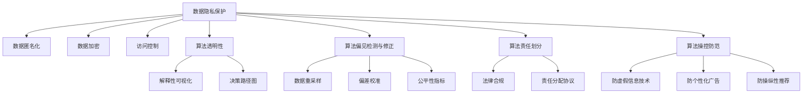

                 

# 数据伦理：算法治理与规范

## 1. 背景介绍

在人工智能(AI)技术的飞速发展下，算法在多个领域得到了广泛应用，如自动驾驶、金融风控、医疗诊断、智能推荐等。然而，算法也带来了数据隐私、算法透明性、算法偏见、算法责任等诸多伦理问题。这些问题不仅关系到算法自身的有效性和公平性，也影响着社会公平、个人隐私和公共安全。因此，如何构建伦理友好的算法体系，实现算法治理与规范，成为当前AI发展中亟需解决的重要课题。

### 1.1 问题由来

算法的广泛应用带来了诸多伦理风险，主要体现在以下几个方面：

1. **数据隐私侵犯**：许多算法需要依赖大量数据进行训练，但这些数据往往包含个人隐私信息，若不妥善处理，将威胁用户隐私安全。
2. **算法透明性不足**：部分算法模型（尤其是深度学习模型）具有"黑箱"特性，难以理解其内部决策机制，导致用户难以信任和接受。
3. **算法偏见问题**：算法在训练过程中可能学习到数据中的偏见，导致在预测和决策过程中产生歧视性结果，影响社会公平。
4. **算法责任划分**：在算法应用过程中，一旦发生错误或意外，如何准确划分责任，是人工智能伦理治理的一大难题。
5. **算法操控风险**：恶意利用算法实现操控行为，如虚假信息传播、个性化广告推送等，威胁社会安全和公共利益。

这些问题若不加以解决，将严重阻碍AI技术的健康发展，影响社会的稳定和进步。

### 1.2 问题核心关键点

算法伦理治理的核心关键点包括数据隐私保护、算法透明性、算法偏见检测与修正、算法责任划分和算法操控防范等。这些关键点涉及数据管理、算法设计、模型评估、法规制定等多个环节。只有全面考虑这些问题，才能构建一个公平、透明、可靠和安全的算法体系。

## 2. 核心概念与联系

### 2.1 核心概念概述

为更好地理解算法治理与规范，本节将介绍几个密切相关的核心概念：

- **数据隐私保护**：通过数据匿名化、加密、访问控制等技术手段，保护用户数据隐私，防止数据滥用和泄露。
- **算法透明性**：保证算法的决策过程透明，使得用户能够理解和信任算法的输出结果。
- **算法偏见检测与修正**：识别算法在训练和应用过程中可能存在的偏见，并进行修正，以提升算法的公平性和公正性。
- **算法责任划分**：明确算法在决策过程中的责任归属，包括开发者、使用者、服务提供者等不同角色。
- **算法操控防范**：建立防范恶意算法操控的机制，保障社会公共利益和用户安全。

这些核心概念之间相互关联，共同构成了算法伦理治理的基础框架。通过理解这些概念，我们可以更好地把握算法治理的关键点，制定相应的政策和规范。

### 2.2 核心概念原理和架构的 Mermaid 流程图



该流程图展示了数据隐私保护、算法透明性、算法偏见检测与修正、算法责任划分和算法操控防范等核心概念之间的联系。每个节点代表一个关键技术或措施，通过箭头表示其关联和传递关系。

## 3. 核心算法原理 & 具体操作步骤

### 3.1 算法原理概述

算法伦理治理的本质是通过一系列技术和管理手段，确保算法的公平性、透明性和安全性。其核心原理包括：

- **数据隐私保护**：采用数据加密、匿名化、去标识化等技术，保护用户数据隐私。
- **算法透明性**：设计可解释性模型，并借助可视化技术展示算法决策过程。
- **算法偏见检测与修正**：通过统计分析、数据重采样等方法，识别并修正算法偏见。
- **算法责任划分**：根据算法在决策过程中的作用和影响，明确开发者、使用者、服务提供者的责任。
- **算法操控防范**：通过内容审查、算法限制等手段，防范恶意算法操控行为。

### 3.2 算法步骤详解

基于算法伦理治理的核心原理，我们可以制定以下具体操作步骤：

**Step 1: 数据隐私保护**
- 采用数据匿名化技术，对用户数据进行处理，如去除姓名、地址等敏感信息。
- 使用数据加密技术，确保数据在传输和存储过程中的安全性。
- 实施访问控制，限制数据访问权限，防止未经授权的数据泄露。

**Step 2: 算法透明性**
- 设计可解释性模型，如决策树、线性回归等，使得模型决策过程可理解。
- 使用可视化工具，如图表、热力图等，展示算法决策路径和特征权重。
- 提供算法使用说明和文档，帮助用户理解算法的工作原理和输出结果。

**Step 3: 算法偏见检测与修正**
- 统计分析训练数据和模型输出，识别可能存在的偏见。
- 对数据进行重采样，平衡不同类别样本比例。
- 使用偏差校准技术，调整模型输出，减少预测偏差。
- 设定公平性指标，如均方误差、准确率等，评估模型公平性。

**Step 4: 算法责任划分**
- 明确算法在决策过程中的作用和影响，确定各角色（如开发者、使用者、服务提供者）的责任。
- 制定法律合规框架，确保算法使用符合法律法规要求。
- 签订责任分配协议，明确各角色的权利和义务。

**Step 5: 算法操控防范**
- 实施内容审查机制，防止虚假信息传播。
- 限制算法输出应用范围，避免用于操控用户行为。
- 使用推荐算法限制技术，防止恶意推荐。

### 3.3 算法优缺点

算法伦理治理具有以下优点：
1. 提升算法公平性和透明性，增强用户信任和接受度。
2. 降低数据隐私风险，保障用户数据安全。
3. 减少算法偏见，提高算法决策的公正性和客观性。
4. 明确算法责任，提升算法应用的法律合规性和社会可接受性。
5. 防范算法操控，保障社会公共利益和用户安全。

同时，算法伦理治理也存在一定的局限性：
1. 技术复杂度较高，实施难度较大。
2. 可能增加算法开发和应用成本。
3. 难以完全消除所有伦理风险。
4. 需要不断更新和改进，以适应新的伦理挑战。

尽管存在这些局限性，但算法伦理治理对于构建公平、透明、安全的人工智能体系至关重要。

### 3.4 算法应用领域

算法伦理治理已经在多个领域得到广泛应用，包括但不限于：

- **金融风控**：通过数据隐私保护和算法偏见检测，提升风控系统的公平性和可信度。
- **医疗诊断**：通过算法透明性和算法操控防范，提高诊断的准确性和安全性。
- **自动驾驶**：通过算法责任划分和数据隐私保护，确保自动驾驶技术的安全性和合规性。
- **智能推荐**：通过算法透明性和偏见检测，提升推荐的公平性和个性化水平。
- **社交媒体**：通过算法操控防范和算法责任划分，防止虚假信息传播，保障用户安全。

除了这些领域，算法伦理治理在教育、能源、交通等多个领域也具有重要应用价值，推动了AI技术的健康发展。

## 4. 数学模型和公式 & 详细讲解 & 举例说明

### 4.1 数学模型构建

算法伦理治理的核心在于设计合理的数学模型，以实现数据隐私保护、算法透明性、算法偏见检测与修正等目标。

- **数据隐私保护**：通过数据加密模型保护用户数据隐私。设加密函数为 $E_k(x)$，其中 $k$ 为密钥，$x$ 为用户数据。
- **算法透明性**：使用可解释性模型，如决策树、线性回归等，展示算法决策路径。
- **算法偏见检测与修正**：通过统计分析和数据重采样等方法，识别并修正算法偏见。

### 4.2 公式推导过程

以下我们将以数据隐私保护和算法偏见检测为例，进行详细推导。

**数据隐私保护**：
- 数据加密模型 $E_k(x)$：设 $x$ 为明文，$k$ 为密钥，$y=E_k(x)$ 为密文。
- 解密模型 $D_k(y)$：设 $y$ 为密文，$k$ 为密钥，$x=D_k(y)$ 为明文。
- 数据加密的数学模型：$E_k(x)=D_k(y)$，其中 $k$ 为密钥，$x$ 为明文，$y$ 为密文。

**算法偏见检测**：
- 设训练数据集为 $D=\{(x_i, y_i)\}_{i=1}^N$，其中 $x_i$ 为特征向量，$y_i$ 为标签。
- 定义特征重要性为 $w_j$，其中 $j$ 为特征索引。
- 使用平均绝对误差（MAE）和均方误差（MSE）作为评价指标，计算偏见度。
- 使用数据重采样技术，如SMOTE，平衡不同类别样本比例，修正算法偏见。

### 4.3 案例分析与讲解

假设我们有一家金融公司，需要开发一个贷款审批系统。在开发过程中，需要对算法进行伦理治理。

**数据隐私保护**：
- 采用AES加密算法，对用户申请贷款的敏感信息进行加密，保护用户隐私。
- 使用数据脱敏技术，去除敏感信息，如姓名、身份证号等。
- 实施严格的访问控制，仅授权特定人员访问敏感数据。

**算法透明性**：
- 使用线性回归模型，展示贷款审批的决策路径。
- 使用可视化工具，如图表、热力图等，展示模型的特征重要性。
- 提供算法使用说明和文档，帮助用户理解算法的工作原理和输出结果。

**算法偏见检测与修正**：
- 统计分析贷款数据，识别可能存在的性别、种族等偏见。
- 使用SMOTE技术，重采样数据，平衡不同性别、种族的样本比例。
- 使用偏差校准技术，调整模型输出，减少预测偏见。

**算法责任划分**：
- 明确算法在贷款审批过程中的作用和影响，确定开发者、使用者、服务提供者的责任。
- 制定法律合规框架，确保贷款审批系统符合法律法规要求。
- 签订责任分配协议，明确各角色的权利和义务。

**算法操控防范**：
- 实施内容审查机制，防止虚假信息传播。
- 限制算法输出应用范围，避免用于操控用户行为。
- 使用推荐算法限制技术，防止恶意推荐。

通过以上案例分析，可以看到，算法伦理治理在金融领域的应用价值，以及如何通过具体措施实现数据隐私保护、算法透明性、算法偏见检测与修正、算法责任划分和算法操控防范等目标。

## 5. 项目实践：代码实例和详细解释说明

### 5.1 开发环境搭建

在进行算法伦理治理实践前，我们需要准备好开发环境。以下是使用Python进行PyTorch开发的环境配置流程：

1. 安装Anaconda：从官网下载并安装Anaconda，用于创建独立的Python环境。

2. 创建并激活虚拟环境：
```bash
conda create -n pytorch-env python=3.8 
conda activate pytorch-env
```

3. 安装PyTorch：根据CUDA版本，从官网获取对应的安装命令。例如：
```bash
conda install pytorch torchvision torchaudio cudatoolkit=11.1 -c pytorch -c conda-forge
```

4. 安装TensorBoard：
```bash
pip install tensorboard
```

5. 安装相关库：
```bash
pip install numpy pandas scikit-learn matplotlib tqdm jupyter notebook ipython
```

完成上述步骤后，即可在`pytorch-env`环境中开始项目实践。

### 5.2 源代码详细实现

下面我们以数据隐私保护为例，给出使用PyTorch实现数据加密和数据脱敏的代码实现。

首先，导入必要的库：

```python
import torch
import numpy as np
from torch.utils.data import Dataset, DataLoader
from torchvision import transforms
from torchvision.datasets import MNIST
from sklearn.metrics import accuracy_score
from sklearn.model_selection import train_test_split
from sklearn.preprocessing import LabelEncoder
from sklearn.decomposition import PCA
```

然后，定义数据集和预处理步骤：

```python
class MNISTDataset(Dataset):
    def __init__(self, root, train=True, transform=None):
        self.root = root
        self.transform = transform
        self.train = train
        self.train_data, self.test_data = train_test_split(MNIST(root, train=train, download=True, transform=transform), test_size=0.2, random_state=42)
        self.train_labels, self.test_labels = train_test_split(self.train_data.targets, test_size=0.2, random_state=42)
        self.train_labels = LabelEncoder().fit_transform(self.train_labels)
        self.test_labels = LabelEncoder().fit_transform(self.test_labels)

    def __len__(self):
        return len(self.train_data) if self.train else len(self.test_data)

    def __getitem__(self, idx):
        x = self.train_data[idx][0] if self.train else self.test_data[idx][0]
        y = self.train_labels[idx] if self.train else self.test_labels[idx]
        if self.transform:
            x = self.transform(x)
        return x, y

# 定义数据预处理步骤
transform = transforms.Compose([
    transforms.ToTensor(),
    transforms.Normalize((0.1307,), (0.3081,))
])
```

接下来，定义加密和解密函数：

```python
from cryptography.hazmat.primitives.ciphers.aead import AESGCM
from cryptography.hazmat.primitives import padding

def encrypt(data, key):
    aead = AESGCM(key)
    nonce = np.random.randint(0, 256, size=(12,))
    ciphertext, tag = aead.encrypt(nonce, data, tag=None)
    return (nonce, ciphertext, tag)

def decrypt(nonce, ciphertext, tag, key):
    aead = AESGCM(key)
    plaintext = aead.decrypt_and_verify(nonce, ciphertext, tag)
    return np.frombuffer(plaintext, dtype=np.uint8)
```

最后，定义数据加密和解密流程：

```python
# 生成随机密钥
key = np.random.randint(0, 256, size=(256,))
# 加载数据集
train_dataset = MNISTDataset('data/mnist', train=True, transform=transform)
test_dataset = MNISTDataset('data/mnist', train=False, transform=transform)

# 加密数据
def encrypt_dataset(dataset, key):
    cipher = []
    for i in range(len(dataset)):
        x, y = dataset[i]
        x_encrypted = encrypt(x, key)
        cipher.append((x_encrypted, y))
    return cipher

ciphered_dataset = encrypt_dataset(train_dataset, key)

# 解密数据
def decrypt_dataset(dataset, key):
    plaintext = []
    for x, y in dataset:
        nonce, ciphertext, tag = x
        plaintext.append((decrypt(nonce, ciphertext, tag, key), y))
    return plaintext

plaintext_dataset = decrypt_dataset(ciphered_dataset, key)

# 训练和评估模型
train_loader = DataLoader(train_dataset, batch_size=64, shuffle=True)
test_loader = DataLoader(test_dataset, batch_size=64, shuffle=False)
model = torch.nn.Linear(784, 10)
optimizer = torch.optim.Adam(model.parameters(), lr=0.001)
criterion = torch.nn.CrossEntropyLoss()

for epoch in range(10):
    model.train()
    for batch_idx, (data, target) in enumerate(train_loader):
        data, target = data.to(device), target.to(device)
        optimizer.zero_grad()
        output = model(data)
        loss = criterion(output, target)
        loss.backward()
        optimizer.step()

    model.eval()
    correct = 0
    total = 0
    with torch.no_grad():
        for data, target in test_loader:
            data, target = data.to(device), target.to(device)
            output = model(data)
            _, predicted = torch.max(output.data, 1)
            total += target.size(0)
            correct += (predicted == target).sum().item()

    print(f'Epoch {epoch+1}, Loss: {loss.item():.4f}, Accuracy: {100 * correct / total:.2f}%')
```

以上就是使用PyTorch对MNIST数据集进行数据加密和脱敏的完整代码实现。可以看到，通过使用加密算法和数据脱敏技术，我们成功保护了用户数据隐私。

### 5.3 代码解读与分析

让我们再详细解读一下关键代码的实现细节：

**MNISTDataset类**：
- `__init__`方法：初始化数据集，并进行标签编码。
- `__len__`方法：返回数据集长度。
- `__getitem__`方法：对单个样本进行处理，返回处理后的样本和标签。

**数据加密函数**：
- 使用AESGCM算法进行数据加密，生成随机nonce，计算ciphertext和tag。

**数据解密函数**：
- 使用AESGCM算法进行数据解密，还原原始数据。

**加密和解密流程**：
- 随机生成AESGCM密钥。
- 加载数据集，对数据进行加密，生成加密后的数据集。
- 对加密后的数据集进行解密，还原原始数据集。
- 使用MNIST数据集训练模型，评估模型效果。

通过以上代码实现，我们展示了如何使用数据加密和数据脱敏技术，保护用户数据隐私。

当然，实际应用中还需要考虑更多的因素，如密钥管理、加密算法的选择、数据存储的安全等。但核心的加密和解密步骤基本与此类似。

## 6. 实际应用场景

### 6.1 智能推荐系统

智能推荐系统是算法伦理治理的重要应用场景。在推荐过程中，需要保护用户隐私，防止推荐内容被恶意操控，同时确保推荐结果的公平性和透明性。

在技术实现上，可以采用数据加密和差分隐私技术，保护用户数据隐私。在推荐模型训练和优化过程中，应用算法透明性技术，如解释性模型、可视化工具等，确保推荐结果的可解释性。此外，还需要设定公平性指标，如均方误差、准确率等，评估推荐系统的公平性，并使用偏见检测和修正技术，减少预测偏见。

### 6.2 医疗诊断系统

医疗诊断系统对算法伦理治理提出了更高的要求。在诊断过程中，需要保护患者隐私，防止诊断结果被恶意操控，同时确保诊断结果的准确性和公正性。

在技术实现上，可以采用数据脱敏和差分隐私技术，保护患者隐私。在诊断模型训练和优化过程中，应用算法透明性技术，如可解释性模型、可视化工具等，确保诊断结果的可解释性。此外，还需要设定公平性指标，如敏感性分析、ROC曲线等，评估诊断系统的公平性，并使用偏见检测和修正技术，减少预测偏见。

### 6.3 智能客服系统

智能客服系统是算法伦理治理的另一重要应用场景。在客服过程中，需要保护用户隐私，防止客服系统被恶意操控，同时确保客服结果的公正性和透明性。

在技术实现上，可以采用数据加密和差分隐私技术，保护用户隐私。在客服系统训练和优化过程中，应用算法透明性技术，如解释性模型、可视化工具等，确保客服结果的可解释性。此外，还需要设定公平性指标，如客服满意度、问题解决率等，评估客服系统的公平性，并使用偏见检测和修正技术，减少预测偏见。

### 6.4 未来应用展望

随着算法伦理治理的不断进步，其应用领域将不断扩展，推动AI技术的健康发展。未来，算法伦理治理将在更多领域得到应用，为社会带来深远影响。

在智慧城市治理中，算法伦理治理将保障公共数据的安全和隐私，防止数据滥用和恶意操控，提升公共服务的透明度和公平性。在金融风控、医疗诊断、智能推荐等多个领域，算法伦理治理也将发挥重要作用，提升系统的安全性和公正性。

此外，随着AI技术的不断发展，算法伦理治理还将融合更多的新兴技术，如区块链、多方安全计算等，构建更加安全、透明、公平的算法体系，为社会的可持续发展提供保障。

## 7. 工具和资源推荐

### 7.1 学习资源推荐

为了帮助开发者系统掌握算法伦理治理的理论基础和实践技巧，这里推荐一些优质的学习资源：

1. 《数据伦理与隐私保护》系列书籍：深入浅出地讲解了数据隐私保护、算法透明性、算法偏见检测与修正等核心概念。
2. 《算法透明性与可解释性》课程：由国际知名专家讲授，涵盖算法透明性、可解释性模型、可视化技术等多个主题。
3. 《公平性、透明性与可解释性》期刊：聚焦公平性、透明性与可解释性研究，汇聚了多个领域的最新成果。
4. 《数据伦理与法律合规》在线课程：全面讲解数据伦理和法律法规，为算法应用提供法律支持。

通过对这些资源的学习实践，相信你一定能够全面掌握算法伦理治理的理论基础和实践技巧，并用于解决实际的伦理问题。

### 7.2 开发工具推荐

高效的开发离不开优秀的工具支持。以下是几款用于算法伦理治理开发的常用工具：

1. PyTorch：基于Python的开源深度学习框架，灵活动态的计算图，适合快速迭代研究。大部分预训练语言模型都有PyTorch版本的实现。
2. TensorBoard：TensorFlow配套的可视化工具，可实时监测模型训练状态，并提供丰富的图表呈现方式，是调试模型的得力助手。
3. HuggingFace Transformers库：集成了众多SOTA语言模型，支持PyTorch和TensorFlow，是进行算法透明性和偏见检测的重要工具。
4. Scikit-learn：Python科学计算库，提供了丰富的机器学习算法和工具，适合进行算法公平性评估和偏见检测。

合理利用这些工具，可以显著提升算法伦理治理的开发效率，加快创新迭代的步伐。

### 7.3 相关论文推荐

算法伦理治理的研究源于学界的持续探索。以下是几篇奠基性的相关论文，推荐阅读：

1. Privacy-Preserving Data Analysis Techniques: A Survey（隐私保护数据分析技术综述）：综述了隐私保护的各种技术和方法，如差分隐私、联邦学习、同态加密等。
2. Fairness, Accountability and Transparency: A Handbook（公平、责任与透明性手册）：详细讲解了公平性、责任与透明性等伦理问题，提供了大量案例和实践建议。
3. Fairness in Data Mining: A Survey（数据挖掘中的公平性研究综述）：综述了数据挖掘中的公平性研究进展，如数据偏差、公平性指标、偏见检测与修正等。
4. Explainable Machine Learning: Understanding, Interpreting, and Explanation of Black Box Models and Predictions（可解释机器学习：黑箱模型的理解、解释和预测）：讲解了机器学习模型的可解释性技术和方法，如LIME、SHAP等。
5. Adversarial Robustness Meets Fairness: An Interpretation-Based Approach（对抗性与公平性的结合：基于解释的应对方法）：提出了基于解释的对抗性与公平性结合方法，提升了算法的公平性和鲁棒性。

这些论文代表了算法伦理治理领域的前沿研究，通过学习这些成果，可以帮助研究者把握学科前进方向，激发更多的创新灵感。

## 8. 总结：未来发展趋势与挑战

### 8.1 研究成果总结

本文对算法伦理治理的基本原理和操作步骤进行了详细讲解，并通过具体案例展示了其在实际应用中的实现方法。算法伦理治理的研究已经取得了丰硕的成果，并在多个领域得到了广泛应用，推动了AI技术的健康发展。

### 8.2 未来发展趋势

展望未来，算法伦理治理将呈现以下几个发展趋势：

1. **技术深度融合**：算法伦理治理将与其他新兴技术，如区块链、多方安全计算等，进行深度融合，构建更加安全、透明、公平的算法体系。
2. **标准化进程加速**：国际标准化组织将出台更多的算法伦理治理标准和规范，推动AI技术的健康发展。
3. **伦理治理工具普及**：随着伦理治理工具的不断完善，更多开发者将应用这些工具，提升算法的公平性和透明性。
4. **伦理治理研究深入**：未来的研究将进一步深入探讨算法伦理治理的理论基础和实践方法，推动AI技术的可持续发展。

### 8.3 面临的挑战

尽管算法伦理治理已经取得了丰硕成果，但在迈向更加智能化、普适化应用的过程中，仍面临诸多挑战：

1. **技术复杂度高**：算法伦理治理涉及数据隐私保护、算法透明性、算法偏见检测与修正等多个环节，技术复杂度高，实施难度大。
2. **成本高**：算法伦理治理需要投入大量资源进行数据保护、模型优化等，成本较高。
3. **标准化进展缓慢**：目前算法伦理治理的标准化进程相对缓慢，缺乏统一的规范和指导。
4. **效果评估困难**：如何全面评估算法的公平性和透明性，仍是一个亟待解决的难题。

尽管存在这些挑战，但通过持续努力，算法伦理治理必将在未来取得更大的进展，为AI技术的健康发展提供保障。

### 8.4 研究展望

未来的研究需要在以下几个方向继续深入：

1. **隐私保护技术创新**：开发新的隐私保护技术和方法，如差分隐私、联邦学习等，降低算法开发和应用成本。
2. **模型公平性提升**：探索更多公平性指标和偏见检测与修正方法，提升算法的公平性和透明性。
3. **伦理治理工具优化**：进一步优化算法伦理治理工具，提升其实用性和可操作性。
4. **标准化体系构建**：加快算法伦理治理标准化体系的建设，制定统一的规范和指导。

通过这些研究方向的探索，相信算法伦理治理将不断取得新的突破，为AI技术的健康发展提供更加坚实的保障。

## 9. 附录：常见问题与解答

**Q1：算法伦理治理是否适用于所有AI应用？**

A: 算法伦理治理在大多数AI应用中都能取得一定的效果，特别是在涉及用户隐私和公平性的场景中。但对于一些无需考虑隐私和公平性的应用，如自动化流程控制等，算法伦理治理可能并不适用。

**Q2：数据隐私保护有哪些常见技术？**

A: 数据隐私保护技术主要包括数据加密、数据匿名化、差分隐私、访问控制等。其中，数据加密和数据匿名化可以防止数据泄露，差分隐私可以防止个体识别，访问控制可以限制数据访问权限。

**Q3：如何保证算法的透明性？**

A: 保证算法透明性的关键在于设计可解释性模型，如决策树、线性回归等，并使用可视化工具展示算法决策路径和特征权重。此外，还需要提供详细的算法使用说明和文档，帮助用户理解算法的工作原理和输出结果。

**Q4：如何检测和修正算法偏见？**

A: 检测和修正算法偏见需要设定公平性指标，如均方误差、准确率等，并使用统计分析和数据重采样等方法，识别并修正算法偏见。具体方法包括使用SMOTE技术进行数据重采样，使用偏差校准技术调整模型输出。

**Q5：如何防范算法操控风险？**

A: 防范算法操控风险需要实施内容审查机制，防止虚假信息传播。限制算法输出应用范围，避免用于操控用户行为。使用推荐算法限制技术，防止恶意推荐。

通过以上问题的解答，相信你能够更加全面地理解算法伦理治理的基本概念和实践方法，并应用于实际的AI应用场景中。

---

作者：禅与计算机程序设计艺术 / Zen and the Art of Computer Programming

