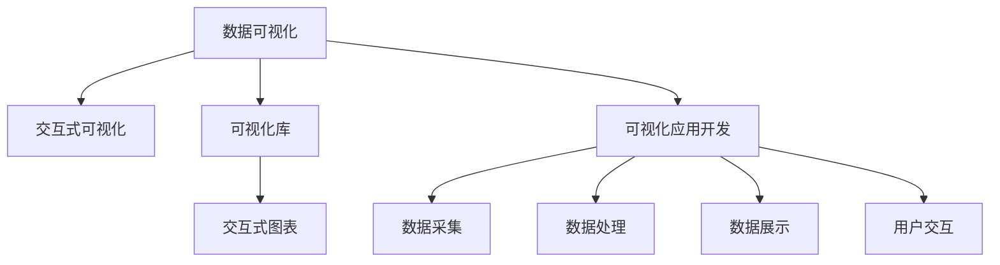

                 

# 数据可视化技术：从图表到交互式仪表板

> 关键词：数据可视化, 图表, 交互式仪表板, 用户界面(UI), 用户体验(UX), 动态数据, 可视化库, 可视化应用开发

## 1. 背景介绍

### 1.1 问题由来
随着数据科学和大数据技术的不断发展，数据可视化已成为数据驱动决策的重要工具。通过可视化，决策者可以更加直观地理解复杂数据，发现数据中的模式和趋势，从而做出更加明智的决策。

然而，传统的静态图表和单一视图已经无法满足日益增长的数据复杂性和用户需求。为了更好地呈现和交互数据，交互式数据可视化应运而生。交互式数据可视化不仅能够展示数据的多维度视图，还可以通过交互功能，让用户深入探索数据，发现更丰富的信息。

### 1.2 问题核心关键点
交互式数据可视化系统通过动态更新视图和提供交互功能，极大地增强了数据展示的效果和用户的参与度。其核心技术包括：

- 可视化库：提供丰富的可视化组件和API，支持复杂的数据呈现。
- 交互功能：如悬停、点击、拖动等，提供对数据的深度探索能力。
- 动态数据：能够实时更新数据，反映最新情况。
- 可视化应用开发：涵盖数据采集、处理、展示、交互等全流程。

交互式数据可视化在商业智能(BI)、科学研究、教育培训、医疗健康等领域都有广泛应用，成为现代数据驱动决策的重要支撑。

### 1.3 问题研究意义
研究交互式数据可视化技术，对于提升数据展示效果、增强用户参与度、优化决策流程、推动数据驱动的科学研究和商业决策，具有重要意义：

1. 直观展示复杂数据。交互式可视化能够将多维数据转化为直观的视图，帮助用户快速理解和掌握数据。
2. 提升用户参与度。通过交互功能，用户能够主动探索数据，发现数据中的有趣点和重要信息。
3. 优化决策流程。可视化提供了直观的数据洞察，支持决策者更好地理解数据、发现问题和制定策略。
4. 推动科研创新。交互式可视化支持多角度、多维度、多层次的数据探索，促进科学研究中的数据发现和创新。
5. 加速商业应用。在商业智能等领域，交互式可视化能够帮助企业快速分析数据、发现市场机会，加速决策和运营。

## 2. 核心概念与联系

### 2.1 核心概念概述

为更好地理解交互式数据可视化技术，本节将介绍几个密切相关的核心概念：

- 数据可视化(Data Visualization)：将数据转化为图形、图表等直观的形式，以便更好地理解和展示数据。
- 交互式可视化(Interactive Visualization)：通过用户交互行为（如鼠标悬停、点击、拖动等）动态更新视图，提供对数据的深度探索能力。
- 可视化库(Visualization Library)：提供丰富的可视化组件和API，支持复杂的数据呈现。
- 可视化应用开发(Visualization Development)：涵盖数据采集、处理、展示、交互等全流程，提供可视化工具和开发框架。

这些核心概念之间的逻辑关系可以通过以下Mermaid流程图来展示：



这个流程图展示了大数据可视化系统的核心概念及其之间的关系：

1. 数据可视化通过可视化库提供丰富的可视化组件和API，支持复杂的数据呈现。
2. 交互式可视化增强了用户参与度，通过交互功能，用户能够深入探索数据。
3. 可视化应用开发涵盖数据采集、处理、展示、交互等全流程，提供可视化工具和开发框架。
4. 可视化库和交互式可视化技术，通过可视化应用开发，应用于不同的场景和领域。

这些核心概念共同构成了交互式数据可视化系统的技术框架，使其能够在各种场景下发挥强大的数据展示和分析能力。

## 3. 核心算法原理 & 具体操作步骤
### 3.1 算法原理概述

交互式数据可视化系统通过动态更新视图和提供交互功能，极大地增强了数据展示的效果和用户的参与度。其核心算法原理包括：

1. 数据映射：将原始数据映射到可视化空间，转化为图表或图形。
2. 数据变换：根据用户的交互行为，动态更新视图，展示数据的不同视角。
3. 交互功能设计：提供悬停、点击、拖动等交互功能，增强用户对数据的探索能力。

### 3.2 算法步骤详解

交互式数据可视化系统的开发过程一般包括以下关键步骤：

**Step 1: 数据预处理**
- 收集原始数据，进行清洗、转换和归一化等预处理，以便进行可视化。
- 确定可视化视图，选择恰当的可视化组件（如折线图、柱状图、散点图等）。

**Step 2: 可视化组件配置**
- 选择合适的可视化库（如D3.js、Highcharts、ECharts等），获取可视化组件。
- 配置可视化组件的参数，如坐标轴、标签、图例、颜色等，以符合数据展示的需求。

**Step 3: 数据绑定**
- 将数据绑定到可视化组件上，通过API设置数据映射关系。
- 使用数据变换API，动态更新视图，展示数据的最新状态。

**Step 4: 交互功能开发**
- 根据需求添加交互功能，如鼠标悬停、点击、拖动等。
- 处理用户交互事件，更新视图，展示相应的数据。

**Step 5: 应用集成**
- 将可视化组件和交互功能集成到应用中，设计用户界面(UI)。
- 优化用户体验(UX)，确保用户能够流畅地使用系统。

**Step 6: 测试和部署**
- 在开发和测试环境中测试系统，验证功能和性能。
- 部署到生产环境，监控系统运行状态，提供数据展示服务。

以上是交互式数据可视化系统开发的通用流程。在具体实现中，还需要针对数据的特点和应用场景，灵活设计可视化组件和交互功能，以满足用户的实际需求。

### 3.3 算法优缺点

交互式数据可视化系统具有以下优点：
1. 直观展示数据。动态更新的视图能够直观展示数据的变化和趋势。
2. 增强用户参与度。交互功能使用户能够深入探索数据，发现数据中的有趣点和重要信息。
3. 优化决策流程。可视化提供了直观的数据洞察，支持决策者更好地理解数据、发现问题和制定策略。

同时，该系统也存在一些局限性：
1. 数据处理复杂。需要处理大量的原始数据，并进行复杂的数据映射和变换，计算量较大。
2. 交互功能复杂。设计高质量的交互功能需要大量的技术积累和用户反馈。
3. 应用场景限制。交互式可视化系统需要适配特定的应用场景，难以通用化。

尽管存在这些局限性，但就目前而言，交互式可视化系统在商业智能(BI)、科学研究、教育培训、医疗健康等领域已经得到了广泛的应用，成为现代数据驱动决策的重要支撑。

### 3.4 算法应用领域

交互式数据可视化系统在多个领域都有广泛应用，例如：

- 商业智能(BI)：提供动态的报表和图表，支持数据分析和业务决策。
- 科学研究：展示实验数据和研究结果，辅助科学发现和论文撰写。
- 教育培训：创建交互式教学工具，帮助学生理解和掌握知识。
- 医疗健康：展示患者数据和医疗结果，支持医生诊断和治疗。
- 金融市场：提供实时市场数据和图表，支持投资分析和交易决策。
- 城市管理：展示城市数据和规划方案，辅助城市治理和规划。

除了上述这些经典应用外，交互式可视化系统也被创新性地应用到更多场景中，如企业运营管理、交通监控、灾害预警等，为数据驱动的各行各业带来了新的突破。

## 4. 数学模型和公式 & 详细讲解 & 举例说明（备注：数学公式请使用latex格式，latex嵌入文中独立段落使用 $$，段落内使用 $)
### 4.1 数学模型构建

交互式数据可视化的数学模型主要涉及数据映射和数据变换。以下以柱状图为例，展示交互式数据可视化的数学模型构建过程：

**数据映射模型**
数据映射模型将原始数据转化为可视化空间中的坐标点。设原始数据为 $(x_1, y_1), (x_2, y_2), \ldots, (x_n, y_n)$，其中 $x_i$ 表示第 $i$ 个数据点，$y_i$ 表示该数据点的值。柱状图的横轴表示 $x_i$，纵轴表示 $y_i$，数据点在坐标系中的位置为 $(x_i, y_i)$。

**数据变换模型**
数据变换模型根据用户的交互行为，动态更新视图。例如，用户可以通过拖动改变柱状图的横轴范围，或者通过悬停查看具体数据。设用户拖动的横轴范围为 $(x_{min}, x_{max})$，则柱状图中可视化的数据点为 $(x_i, y_i)$，其中 $i \in (x_{min}, x_{max})$。

### 4.2 公式推导过程

以柱状图为例，推导数据映射和数据变换的数学公式：

**柱状图数据映射公式**
柱状图的横轴 $x_i$ 表示第 $i$ 个数据点，纵轴 $y_i$ 表示该数据点的值。假设横轴范围为 $(x_{min}, x_{max})$，则柱状图中可视化的数据点为 $(x_i, y_i)$，其中 $i \in (x_{min}, x_{max})$。

**柱状图数据变换公式**
设用户拖动的横轴范围为 $(x_{min}, x_{max})$，则可视化的数据点为 $(x_i, y_i)$，其中 $i \in (x_{min}, x_{max})$。

### 4.3 案例分析与讲解

假设有一组销售数据：某公司在不同地区的销售额数据。原始数据如下：

| 地区  | 销售额 |
|-------|-------|
| 北京  | 1000  |
| 上海  | 2000  |
| 广州  | 1500  |
| 深圳  | 3000  |

使用柱状图展示这组数据。假设柱状图的横轴范围为 $x \in (0, 4)$，纵轴范围为 $y \in (0, 4000)$。

**柱状图数据映射**
原始数据映射到柱状图的横轴和纵轴：

- 北京：$x=1, y=1000$
- 上海：$x=2, y=2000$
- 广州：$x=3, y=1500$
- 深圳：$x=4, y=3000$

**柱状图数据变换**
用户拖动横轴范围为 $(x_{min}, x_{max})=(0.5, 3.5)$，则可视化的数据点为：

- 北京：$x=1, y=1000$
- 上海：$x=2, y=2000$
- 广州：$x=3, y=1500$
- 深圳：$x=4, y=3000$

动态更新的柱状图能够直观展示数据的分布和变化，增强用户对数据的理解。

## 5. 项目实践：代码实例和详细解释说明
### 5.1 开发环境搭建

在进行交互式数据可视化项目实践前，我们需要准备好开发环境。以下是使用JavaScript和D3.js进行可视化开发的流程：

1. 安装Node.js和npm：从官网下载并安装Node.js，npm是Node.js的包管理工具。
2. 创建项目目录：使用npm初始化项目，安装D3.js等依赖库。
3. 编写代码：在HTML文件中编写可视化组件和交互逻辑，使用JavaScript代码绑定数据和处理交互事件。
4. 测试运行：使用Node.js运行HTML文件，查看可视化效果。
5. 部署发布：将可视化项目部署到服务器或CDN，提供数据展示服务。

完成上述步骤后，即可在开发环境中开始交互式数据可视化项目的实践。

### 5.2 源代码详细实现

下面以柱状图为例，给出使用D3.js进行交互式数据可视化的JavaScript代码实现。

首先，在HTML文件中编写可视化组件：

```html
<!DOCTYPE html>
<html>
<head>
  <title>交互式柱状图</title>
  <script src="https://d3js.org/d3.v5.min.js"></script>
</head>
<body>
  <div id="chart"></div>
  <script>
    // 数据
    var data = [
      { x: 1, y: 1000 },
      { x: 2, y: 2000 },
      { x: 3, y: 1500 },
      { x: 4, y: 3000 }
    ];

    // 创建柱状图
    var svg = d3.select("#chart")
      .append("svg")
      .attr("width", 400)
      .attr("height", 300);

    // 添加横轴和纵轴
    var x = d3.scaleLinear()
      .domain([0, 4])
      .range([0, 400]);

    var y = d3.scaleLinear()
      .domain([0, 4000])
      .range([300, 0]);

    svg.append("g")
      .attr("transform", "translate(0, 0)")
      .call(d3.axisLeft(y).tickFormat(d3.format(".2f")));

    svg.append("g")
      .attr("transform", "translate(0, 0)")
      .call(d3.axisBottom(x).tickFormat(d3.format(".2f")));

    // 添加柱状图
    svg.selectAll("rect")
      .data(data)
      .enter().append("rect")
      .attr("x", function(d) { return x(d.x); })
      .attr("y", function(d) { return y(d.y); })
      .attr("width", function(d) { return 0.5; })
      .attr("height", function(d) { return 300 - y(d.y); })
      .attr("fill", "steelblue");
  </script>
</body>
</html>
```

然后，添加交互逻辑：

```javascript
// 添加交互功能
svg.append("g")
  .on("mousedown", function() {
    d3.select(this).attr("cursor", "ew-resize");
  })
  .on("mouseup", function() {
    d3.select(this).attr("cursor", "default");
  })
  .on("mousemove", function() {
    var x = d3.event.x;
    svg.select("g").attr("transform", "translate(" + x + ", 0)");
    var xDomain = [0, 4];
    var yDomain = [0, 4000];
    svg.select("g").attr("transform", "translate(" + x + ", 0)");
    x.scale().domain([xDomain[0], xDomain[1]]);
    y.scale().domain([yDomain[0], yDomain[1]]);
    svg.select("g").attr("transform", "translate(" + x + ", 0)");
  });

svg.append("g")
  .on("mousemove", function() {
    var y = d3.event.y;
    svg.select("g").attr("transform", "translate(0, " + y + ")");
    var xDomain = [0, 4];
    var yDomain = [yDomain[0], yDomain[1]];
    svg.select("g").attr("transform", "translate(0, " + y + ")");
    x.scale().domain([xDomain[0], xDomain[1]]);
    y.scale().domain([yDomain[0], yDomain[1]]);
    svg.select("g").attr("transform", "translate(0, " + y + ")");
  });
```

最后，运行可视化效果：

```javascript
// 更新数据
var x = d3.select("#chart").selectAll("rect")
  .data(data)
  .attr("x", function(d) { return x(d.x); })
  .attr("y", function(d) { return y(d.y); })
  .attr("width", function(d) { return 0.5; })
  .attr("height", function(d) { return 300 - y(d.y); })
  .attr("fill", "steelblue");
```

以上就是使用D3.js进行交互式数据可视化开发的完整代码实现。可以看到，D3.js提供了丰富的可视化组件和API，能够轻松实现复杂的数据展示和交互功能。

### 5.3 代码解读与分析

让我们再详细解读一下关键代码的实现细节：

**D3.js的用法**
- `d3.select("#chart")`：选择HTML元素。
- `append("svg")`：在元素中添加SVG元素。
- `attr("width", 400)` 和 `attr("height", 300)`：设置SVG的宽高。
- `d3.scaleLinear()`：创建线性比例尺。
- `domain([0, 4])`：设置比例尺的域。
- `range([0, 400])`：设置比例尺的映射范围。
- `call(d3.axisLeft(y).tickFormat(d3.format(".2f")))`：创建并配置水平坐标轴。

**交互逻辑**
- `on("mousedown", function() { ... })`：添加鼠标按下事件。
- `d3.select(this).attr("cursor", "ew-resize")`：设置鼠标光标为东西向可拖动。
- `on("mouseup", function() { ... })`：添加鼠标抬起事件。
- `d3.select(this).attr("cursor", "default")`：设置鼠标光标为默认。
- `on("mousemove", function() { ... })`：添加鼠标移动事件。
- `x = d3.event.x`：获取鼠标横坐标。
- `svg.select("g").attr("transform", "translate(" + x + ", 0)")`：更新坐标轴的位置。

**数据绑定**
- `selectAll("rect")`：选择所有柱状图元素。
- `data(data)`：绑定数据到柱状图元素。
- `attr("x", function(d) { return x(d.x); })`：设置柱状图元素的位置。
- `attr("y", function(d) { return y(d.y); })`：设置柱状图元素的高度。

通过以上代码，实现了交互式柱状图的动态展示和交互功能。开发者可以根据实际需求，使用D3.js提供的更多组件和API，设计更加复杂和灵活的可视化应用。

## 6. 实际应用场景
### 6.1 智能报表系统

交互式数据可视化在智能报表系统中得到了广泛应用。传统报表系统主要提供静态报表和图表展示，难以满足用户对数据深度探索的需求。通过交互式数据可视化，用户能够动态更新报表视图，深入探索数据，发现更多有价值的信息。

在技术实现上，智能报表系统通常包括以下组件：

1. 数据采集：从业务系统中采集数据，并进行清洗和转换。
2. 数据可视化：使用可视化库，将数据展示为交互式图表和仪表板。
3. 报表生成：根据用户交互行为，生成动态报表和图表。
4. 报表导出：提供多种格式的数据导出功能，如PDF、Excel等。

基于交互式数据可视化，智能报表系统能够支持用户自定义报表展示，灵活生成动态报表和图表，提供实时数据分析和决策支持，极大地提升了报表系统的人机交互和数据分析能力。

### 6.2 科研数据分析平台

在科学研究中，数据可视化的应用日益重要。交互式数据可视化能够帮助研究人员高效地探索和分析大规模数据，发现数据中的模式和趋势，加速科研创新。

科研数据分析平台通常包括以下功能：

1. 数据导入：从各类数据源导入原始数据。
2. 数据清洗：对数据进行清洗和预处理。
3. 数据探索：使用可视化组件展示数据的多维视图。
4. 数据分析：通过交互功能，深入探索数据，发现数据中的有趣点和重要信息。
5. 数据可视化：使用可视化组件展示数据分析结果，生成科研论文。

基于交互式数据可视化，科研数据分析平台能够提供高效的数据探索和分析工具，帮助研究人员发现数据中的有趣点和重要信息，加速科研创新。

### 6.3 教育培训系统

在教育培训中，数据可视化的应用能够帮助教师更好地展示和讲解知识，帮助学生更好地理解和掌握知识。

教育培训系统通常包括以下功能：

1. 数据采集：从学生和教师系统中采集数据，如成绩、作业、测试等。
2. 数据清洗：对数据进行清洗和预处理。
3. 数据可视化：使用可视化组件展示学生的学习数据，生成图表和仪表板。
4. 数据分析：通过交互功能，深入探索学生的学习行为和表现。
5. 教学反馈：根据学生的学习数据，生成教学反馈报告，帮助教师优化教学。

基于交互式数据可视化，教育培训系统能够提供高效的数据展示和分析工具，帮助教师和学生更好地理解和掌握知识，提高教学效果和学习效率。

### 6.4 医疗健康系统

在医疗健康领域，数据可视化的应用能够帮助医生更好地诊断和治疗患者，帮助医院提高运营效率。

医疗健康系统通常包括以下功能：

1. 数据采集：从医院信息系统采集患者数据，如病历、检查报告、诊断结果等。
2. 数据清洗：对数据进行清洗和预处理。
3. 数据可视化：使用可视化组件展示患者的健康数据，生成图表和仪表板。
4. 数据分析：通过交互功能，深入探索患者的健康状况，发现潜在的健康问题。
5. 决策支持：根据患者数据，生成健康建议和治疗方案，支持医生进行决策。

基于交互式数据可视化，医疗健康系统能够提供高效的数据展示和分析工具，帮助医生更好地诊断和治疗患者，提高医院运营效率。

## 7. 工具和资源推荐
### 7.1 学习资源推荐

为了帮助开发者系统掌握交互式数据可视化技术，这里推荐一些优质的学习资源：

1. D3.js官方文档：提供详细的API文档和示例代码，是学习D3.js的最佳资源。
2. D3.js教程和示例：如D3.js的官方教程和GitHub上的示例代码，能够帮助开发者快速上手。
3. 《D3.js实战》书籍：提供丰富的实战案例和代码示例，是学习D3.js的绝佳参考。
4. 《JavaScript数据可视化》书籍：详细介绍数据可视化的原理和实现技术，适合深入学习。
5. 可视化数据科学课程：如Coursera上的《Data Visualization with Python and R》课程，涵盖多种数据可视化工具和技术。

通过对这些资源的学习实践，相信你一定能够快速掌握交互式数据可视化技术的精髓，并用于解决实际的业务问题。
### 7.2 开发工具推荐

高效的开发离不开优秀的工具支持。以下是几款用于交互式数据可视化开发的常用工具：

1. D3.js：功能强大的JavaScript可视化库，提供了丰富的可视化组件和API，支持复杂的数据呈现。
2. Highcharts：商业级的JavaScript可视化库，支持多种图表类型和交互功能。
3. ECharts：由百度开发的JavaScript可视化库，支持多种图表类型和交互功能，具备良好的兼容性和性能。
4. Google Charts：Google提供的免费JavaScript可视化库，支持多种图表类型和交互功能。
5. Chart.js：轻量级的JavaScript可视化库，支持多种图表类型和交互功能。
6. Plotly：支持多种编程语言的可视化库，提供了丰富的图表类型和交互功能。

合理利用这些工具，可以显著提升交互式数据可视化任务的开发效率，加快创新迭代的步伐。

### 7.3 相关论文推荐

交互式数据可视化技术的发展源于学界的持续研究。以下是几篇奠基性的相关论文，推荐阅读：

1. D3.js：Visualization with JavaScript。
2. Highcharts：The Highcharts JavaScript Charting Library。
3. ECharts：A interactive visualization and data presentation library based on JavaScript.
4. Google Charts：Introduction to Google Charts。
5. Chart.js：Chart.js。
6. Plotly：Plotly Graphing Library.

这些论文代表了大数据可视化技术的发展脉络。通过学习这些前沿成果，可以帮助研究者把握学科前进方向，激发更多的创新灵感。

## 8. 总结：未来发展趋势与挑战

### 8.1 总结

本文对交互式数据可视化技术进行了全面系统的介绍。首先阐述了交互式数据可视化系统的背景和意义，明确了交互式可视化在数据展示和分析中的重要价值。其次，从原理到实践，详细讲解了交互式数据可视化的核心算法和技术细节，给出了交互式数据可视化开发的完整代码实现。同时，本文还广泛探讨了交互式数据可视化在商业智能(BI)、科学研究、教育培训、医疗健康等领域的应用前景，展示了交互式数据可视化的广泛应用场景。此外，本文精选了交互式数据可视化的学习资源和开发工具，力求为开发者提供全方位的技术指引。

通过本文的系统梳理，可以看到，交互式数据可视化技术已经成为现代数据驱动决策的重要工具。通过动态更新视图和提供交互功能，交互式数据可视化系统极大地增强了数据展示的效果和用户的参与度，为决策者提供了更加直观、深入的数据洞察。未来，随着数据量的不断增长和技术的不断进步，交互式数据可视化技术将在更多的领域得到应用，为各行各业带来新的突破和机遇。

### 8.2 未来发展趋势

展望未来，交互式数据可视化技术将呈现以下几个发展趋势：

1. 实时数据展示。交互式数据可视化系统将更加注重实时数据展示，通过动态更新视图，实时反映最新数据变化，支持实时决策。
2. 多维数据融合。交互式数据可视化系统将支持多维数据的融合展示，通过可视化组件和交互功能，展示复杂的数据结构和关系。
3. 用户个性化定制。交互式数据可视化系统将提供更多的用户自定义选项，支持用户根据自己的需求定制个性化视图和交互功能。
4. 智能推荐系统。交互式数据可视化系统将引入智能推荐算法，根据用户行为和偏好，推荐最适合的视图和交互方式。
5. 自然语言交互。交互式数据可视化系统将引入自然语言交互技术，支持用户通过文本输入进行数据查询和探索。

这些趋势凸显了交互式数据可视化技术的广阔前景。未来，随着技术的不断进步和应用的不断深入，交互式数据可视化技术将实现更全面的数据展示和分析，成为数据驱动决策的强大工具。

### 8.3 面临的挑战

尽管交互式数据可视化技术已经取得了显著成果，但在走向广泛应用的过程中，仍然面临以下挑战：

1. 数据处理复杂。交互式数据可视化系统需要处理大规模数据，并进行复杂的数据映射和变换，计算量较大。
2. 交互功能复杂。设计高质量的交互功能需要大量的技术积累和用户反馈。
3. 应用场景限制。交互式数据可视化系统需要适配特定的应用场景，难以通用化。
4. 数据安全和隐私。交互式数据可视化系统需要保障数据的安全和隐私，防止数据泄露和滥用。
5. 系统稳定性。交互式数据可视化系统需要保持稳定运行，防止因数据量过大或交互行为频繁导致的系统崩溃。

尽管存在这些挑战，但随着技术的发展和应用的不断积累，交互式数据可视化技术将在更多的领域得到应用，为各行各业带来新的突破和机遇。

### 8.4 研究展望

未来的研究需要在以下几个方面寻求新的突破：

1. 提升实时数据处理能力。通过优化算法和提高硬件性能，提升交互式数据可视化系统的实时数据处理能力。
2. 开发更丰富的可视化组件。研究和开发更多的可视化组件，支持多维数据的展示和分析。
3. 引入自然语言交互技术。研究和开发自然语言交互技术，支持用户通过文本输入进行数据查询和探索。
4. 探索更多交互行为设计。研究和探索更多高质量的交互行为设计，提升用户的交互体验。
5. 提高系统稳定性和安全性。研究和开发系统稳定性技术，保障交互式数据可视化系统的稳定运行。

这些研究方向的探索，必将引领交互式数据可视化技术迈向更高的台阶，为数据驱动的各行各业带来新的突破和机遇。

## 9. 附录：常见问题与解答

**Q1：如何选择合适的交互式数据可视化工具？**

A: 选择合适的交互式数据可视化工具，需要综合考虑以下几个因素：
1. 功能需求：根据具体业务需求，选择具备相应功能的可视化工具。如需要实时数据展示，可以选择支持实时数据更新的工具。
2. 数据量大小：根据数据量大小，选择性能和内存占用较低的可视化工具。
3. 用户群体：根据用户群体的特点，选择具备用户自定义选项和交互功能的可视化工具。
4. 开发成本：根据项目开发周期和预算，选择易于上手和使用的可视化工具。
5. 技术支持：根据技术支持和社区活跃度，选择有良好技术支持和社区资源的工具。

常见的交互式数据可视化工具包括D3.js、Highcharts、ECharts等，开发者可以根据实际需求选择合适的工具。

**Q2：如何优化交互式数据可视化系统的性能？**

A: 优化交互式数据可视化系统的性能，可以从以下几个方面入手：
1. 数据预处理：对数据进行清洗、归一化和压缩，减少数据量。
2. 数据分页：对大规模数据进行分页展示，避免一次性加载大量数据。
3. 数据缓存：对常用数据进行缓存，减少重复计算和数据传输。
4. 数据更新策略：根据用户行为，动态更新视图，减少数据渲染次数。
5. 优化算法：使用高效的数据处理算法，如分布式计算、并行处理等。
6. 资源优化：使用混合精度计算、优化内存使用、减少GPU显存占用等技术。

通过以上方法，可以显著提升交互式数据可视化系统的性能，确保系统稳定运行。

**Q3：如何保证交互式数据可视化系统的安全性？**

A: 保障交互式数据可视化系统的安全性，需要从以下几个方面入手：
1. 数据加密：对敏感数据进行加密处理，防止数据泄露。
2. 访问控制：对系统进行访问控制，限制用户的访问权限。
3. 数据脱敏：对数据进行脱敏处理，防止敏感信息泄露。
4. 异常检测：使用异常检测技术，监控系统的运行状态，及时发现和处理异常行为。
5. 安全审计：对系统的访问和操作进行日志记录和审计，确保系统的安全性。

通过以上方法，可以保障交互式数据可视化系统的安全性，防止数据泄露和滥用。

**Q4：如何提高交互式数据可视化系统的交互体验？**

A: 提高交互式数据可视化系统的交互体验，可以从以下几个方面入手：
1. 用户自定义选项：提供更多的用户自定义选项，支持用户根据自己的需求定制视图和交互功能。
2. 交互行为设计：设计高质量的交互行为，提供直观、流畅的交互体验。
3. 用户反馈机制：引入用户反馈机制，根据用户反馈不断优化和改进系统。
4. 交互提示和帮助：提供交互提示和帮助文档，帮助用户快速上手和使用系统。
5. 多语言支持：支持多语言交互，方便不同语言用户使用系统。

通过以上方法，可以显著提高交互式数据可视化系统的交互体验，提升用户的使用体验和满意度。

---

作者：禅与计算机程序设计艺术 / Zen and the Art of Computer Programming

