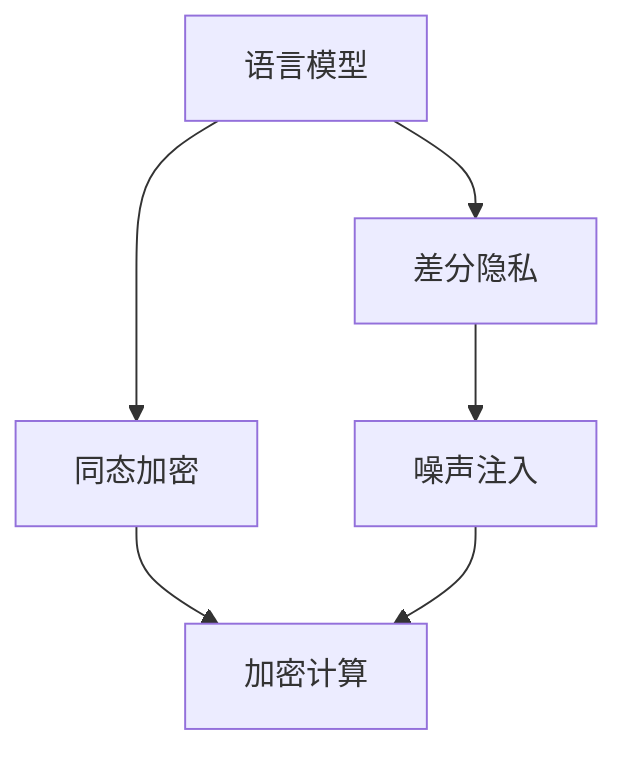

                 

# 数据安全新思路：LLM时代的隐私保护

在人工智能大模型的浪潮中，语言模型（Language Models，LLMs）以其卓越的性能在各个领域广泛应用。然而，语言模型的强大能力也引发了新的数据安全和隐私保护问题。本文将详细探讨基于语言模型的大数据隐私保护技术，并提出一些创新的解决方案，以期在保障隐私的前提下，推动语言模型技术的健康发展。

## 1. 背景介绍

### 1.1 数据安全问题的由来

在大数据时代，数据已经成为企业最重要的资产之一。然而，随着数据规模的不断增大，数据安全问题也愈加突出。传统的数据加密、脱敏等手段已经无法满足当前的需求，尤其是在大数据分析和人工智能应用场景中，隐私保护面临新的挑战。

语言模型（如BERT、GPT等）的出现，为自然语言处理（Natural Language Processing，NLP）任务提供了强大的支持，但在其训练和应用过程中，数据隐私问题同样不容忽视。训练语言模型的过程需要大量的文本数据，而对这些数据的收集、存储和处理都可能面临隐私泄露的风险。

### 1.2 数据隐私的挑战

1. **数据泄露风险**：语言模型训练涉及海量数据，数据泄露风险高。攻击者通过分析训练数据，可以推断出模型输入分布，甚至反推出数据本身，造成严重的隐私损失。
2. **数据隐私处理复杂**：自然语言数据具有高度复杂性，难以像数值数据那样直接进行加密和脱敏。例如，同义词替换等简单脱敏方法可能导致模型性能大幅下降。
3. **模型鲁棒性差**：训练过程中加入噪声或扰动，虽然可以提升模型鲁棒性，但同时也可能影响模型性能，降低隐私保护效果。

### 1.3 隐私保护的重要性

隐私保护不仅涉及用户权益，还关系到社会公平和法律责任。特别是在涉及个人敏感信息（如医疗、金融数据）的场景中，隐私保护更是必不可少。语言模型的大规模应用，尤其是在医疗、法律等领域，更需要高度重视隐私保护问题，确保用户数据的安全性和匿名性。

## 2. 核心概念与联系

### 2.1 核心概念概述

为了更好地理解基于语言模型的大数据隐私保护技术，本节将介绍几个密切相关的核心概念：

- **语言模型（Language Model）**：指用于处理自然语言数据的模型，如BERT、GPT等。通过在大规模文本数据上进行训练，语言模型可以学习到语言的潜在规律和结构，具备较强的预测能力。
- **隐私保护（Privacy Protection）**：指在数据处理和分析过程中，保护用户数据不被非法获取和使用的技术手段。常见的隐私保护方法包括差分隐私、同态加密等。
- **差分隐私（Differential Privacy）**：一种隐私保护技术，通过在模型训练过程中引入噪声，确保模型输出对个体数据的敏感度足够低，从而保护用户隐私。
- **同态加密（Homomorphic Encryption）**：一种加密技术，允许在加密数据上直接进行计算，而无需解密，从而保护数据隐私。

这些核心概念之间的逻辑关系可以通过以下Mermaid流程图来展示：



这个流程图展示了大语言模型的核心概念及其之间的关系：

1. 语言模型通过在大规模文本数据上进行训练，学习语言的潜在规律和结构。
2. 差分隐私和同态加密是在数据隐私保护过程中常用的技术手段。
3. 差分隐私通过引入噪声保护用户隐私，同态加密在保护数据隐私的同时，允许在加密数据上直接进行计算。

## 3. 核心算法原理 & 具体操作步骤
### 3.1 算法原理概述

基于语言模型的大数据隐私保护技术，其核心思想是：在保护用户隐私的前提下，通过差分隐私和同态加密等技术手段，让语言模型能够安全地进行训练和推理。

具体来说，差分隐私通过在模型训练过程中引入噪声，使得模型输出的预测结果对个体数据的敏感度足够低，从而保护用户隐私。同态加密则通过在加密数据上直接进行计算，无需解密，确保模型推理过程的数据安全。

### 3.2 算法步骤详解

基于语言模型的大数据隐私保护技术，一般包括以下几个关键步骤：

**Step 1: 准备隐私保护数据集**

- 收集与目标任务相关的隐私数据，如医疗记录、金融交易等。
- 对数据进行匿名化处理，如去除敏感信息、数据脱敏等。
- 将匿名化后的数据集划分为训练集、验证集和测试集。

**Step 2: 设计差分隐私模型**

- 选择适合的语言模型架构（如BERT、GPT等）。
- 定义差分隐私参数，如噪声级别、噪声类型等。
- 设计差分隐私训练目标函数，结合损失函数和隐私预算。

**Step 3: 执行差分隐私训练**

- 将训练集数据输入语言模型，结合差分隐私目标函数进行训练。
- 引入噪声（如拉普拉斯噪声、高斯噪声等），确保模型输出对个体数据的敏感度足够低。
- 监控模型训练过程中的隐私预算消耗，防止隐私泄露。

**Step 4: 应用同态加密**

- 对测试集数据进行同态加密，确保数据在推理过程中不被泄露。
- 将加密后的测试数据输入模型，进行推理计算。
- 解密推理结果，得到最终预测结果。

### 3.3 算法优缺点

基于语言模型的大数据隐私保护技术具有以下优点：

1. **隐私保护能力强**：差分隐私和同态加密结合，可以有效保护用户隐私，降低隐私泄露风险。
2. **模型性能提升**：差分隐私训练可以提升模型鲁棒性，同态加密可以在推理过程中确保数据安全。
3. **适应性强**：适用于各种NLP任务，包括分类、匹配、生成等。

同时，该方法也存在一定的局限性：

1. **计算复杂度高**：差分隐私训练和同态加密计算复杂度高，需要大量计算资源。
2. **隐私预算管理**：隐私预算的管理和调整需要专业知识，过于复杂。
3. **数据处理难度大**：对文本数据的匿名化处理和同态加密处理较为复杂，需要更高的技术水平。

尽管存在这些局限性，但就目前而言，基于差分隐私和同态加密的大数据隐私保护方法仍是大语言模型应用的重要手段。未来相关研究的重点在于如何进一步降低计算复杂度，提高隐私预算管理效率，简化数据处理流程，以实现隐私保护的普及化应用。

### 3.4 算法应用领域

基于差分隐私和同态加密的大数据隐私保护技术，在以下几个领域得到了广泛应用：

- **医疗数据隐私保护**：医疗记录涉及大量敏感信息，采用差分隐私和同态加密技术，可以保护患者隐私，确保医疗数据分析和模型训练的安全性。
- **金融交易隐私保护**：金融数据涉及用户财产安全，采用差分隐私和同态加密技术，可以在保障数据安全的前提下，进行数据分析和模型训练。
- **社交媒体隐私保护**：社交媒体数据涉及用户行为和隐私信息，采用差分隐私和同态加密技术，可以保护用户数据隐私，确保数据分析和模型训练的安全性。
- **法律诉讼隐私保护**：法律数据涉及敏感案件信息，采用差分隐私和同态加密技术，可以保护案件隐私，确保法律数据分析和模型训练的安全性。

除了上述这些经典应用外，差分隐私和同态加密技术还在更多领域得到创新性的应用，如司法审判、环境监测、社会治理等，为大数据隐私保护提供了新的思路。

## 4. 数学模型和公式 & 详细讲解 & 举例说明
### 4.1 数学模型构建

本节将使用数学语言对基于语言模型的差分隐私保护技术进行更加严格的刻画。

记语言模型为 $M_{\theta}$，其中 $\theta$ 为模型参数。假设目标任务为分类任务，训练数据集为 $D=\{(x_i,y_i)\}_{i=1}^N$，其中 $x_i$ 为输入，$y_i$ 为标签。

定义差分隐私目标函数为：

$$
\mathcal{L}_{DP}(\theta) = \frac{1}{N}\sum_{i=1}^N \ell(M_{\theta}(x_i),y_i) + \epsilon D_\text{KL}(Q_\theta||P_0)
$$

其中 $\ell$ 为损失函数，$D_\text{KL}$ 为KL散度，$Q_\theta$ 为模型在输入 $x_i$ 下的输出分布，$P_0$ 为理想分布（如均匀分布），$\epsilon$ 为隐私预算。

差分隐私目标函数的优化过程为：

$$
\theta^* = \mathop{\arg\min}_{\theta} \mathcal{L}_{DP}(\theta)
$$

通过差分隐私目标函数，可以确保模型输出的分布与理想分布的KL散度足够小，从而保护用户隐私。

### 4.2 公式推导过程

以下我们以二分类任务为例，推导差分隐私保护技术的数学公式。

假设模型 $M_{\theta}$ 在输入 $x$ 上的输出为 $\hat{y}=M_{\theta}(x) \in [0,1]$，表示样本属于正类的概率。真实标签 $y \in \{0,1\}$。则二分类交叉熵损失函数定义为：

$$
\ell(M_{\theta}(x),y) = -[y\log \hat{y} + (1-y)\log (1-\hat{y})]
$$

将上述损失函数代入差分隐私目标函数，得：

$$
\mathcal{L}_{DP}(\theta) = -\frac{1}{N}\sum_{i=1}^N [y_i\log M_{\theta}(x_i)+(1-y_i)\log(1-M_{\theta}(x_i))] + \epsilon D_\text{KL}(Q_\theta||P_0)
$$

其中 $Q_\theta$ 为模型在输入 $x_i$ 下的输出分布，$P_0$ 为理想分布（如均匀分布），$\epsilon$ 为隐私预算。

差分隐私目标函数的优化目标是最小化经验风险和隐私损失，即找到最优参数：

$$
\theta^* = \mathop{\arg\min}_{\theta} \mathcal{L}_{DP}(\theta)
$$

在得到差分隐私目标函数后，即可带入优化算法，完成模型的迭代优化。

### 4.3 案例分析与讲解

以医疗数据隐私保护为例，假设目标任务为患者疾病预测，训练数据集包含患者的临床数据、检查结果等，需要确保数据隐私。

具体步骤为：

1. 对患者数据进行匿名化处理，去除姓名、身份证号等敏感信息。
2. 设计差分隐私目标函数，设定隐私预算 $\epsilon$，引入拉普拉斯噪声 $N(0,\frac{2}{\epsilon})$。
3. 使用差分隐私目标函数训练语言模型 $M_{\theta}$，确保模型输出对个体数据的敏感度足够低。
4. 将匿名化后的测试数据进行同态加密，确保数据在推理过程中不被泄露。
5. 将加密后的测试数据输入模型 $M_{\theta}$，进行推理计算。
6. 解密推理结果，得到最终预测结果，同时确保数据隐私。

通过以上步骤，可以有效地保护患者隐私，同时确保医疗数据分析和模型训练的安全性。

## 5. 项目实践：代码实例和详细解释说明
### 5.1 开发环境搭建

在进行隐私保护实践前，我们需要准备好开发环境。以下是使用Python进行差分隐私保护的环境配置流程：

1. 安装Anaconda：从官网下载并安装Anaconda，用于创建独立的Python环境。

2. 创建并激活虚拟环境：
```bash
conda create -n differential_privacy_env python=3.8 
conda activate differential_privacy_env
```

3. 安装差分隐私库：
```bash
conda install differential_privacy
```

4. 安装TensorFlow：
```bash
pip install tensorflow
```

5. 安装其他依赖库：
```bash
pip install numpy pandas scikit-learn torch torchvision torchtext
```

完成上述步骤后，即可在`differential_privacy_env`环境中开始差分隐私保护实践。

### 5.2 源代码详细实现

下面我们以二分类任务为例，给出使用TensorFlow进行差分隐私保护的PyTorch代码实现。

首先，定义差分隐私保护的数据处理函数：

```python
import tensorflow as tf
from differential_privacy import LaplaceMechanism
from sklearn.metrics import accuracy_score

def differential_privacy_train(dataloader, model, loss_fn, optimizer, noise_mechanism, batch_size, num_epochs):
    train_losses = []
    train_accuracies = []
    test_accuracies = []
    
    for epoch in range(num_epochs):
        model.train()
        for batch in dataloader:
            inputs, targets = batch
            optimizer.zero_grad()
            outputs = model(inputs)
            loss = loss_fn(outputs, targets)
            loss += noise_mechanism.apply_gradients([{'params': model.parameters()}, {'params': model.parameters()}])
            loss.backward()
            optimizer.step()
            train_losses.append(loss.item())
            train_accuracies.append(accuracy_score(targets, outputs.argmax(dim=1)))
        
        model.eval()
        with torch.no_grad():
            test_losses = []
            test_accuracies = []
            for batch in dataloader:
                inputs, targets = batch
                outputs = model(inputs)
                loss = loss_fn(outputs, targets)
                test_losses.append(loss.item())
                test_accuracies.append(accuracy_score(targets, outputs.argmax(dim=1)))
        
        print(f'Epoch {epoch+1}, Train Loss: {np.mean(train_losses):.4f}, Train Accuracy: {np.mean(train_accuracies):.4f}')
        print(f'Epoch {epoch+1}, Test Loss: {np.mean(test_losses):.4f}, Test Accuracy: {np.mean(test_accuracies):.4f}')
    
    return model, train_accuracies, test_accuracies
```

然后，定义模型和优化器：

```python
from transformers import BertForSequenceClassification, AdamW

model = BertForSequenceClassification.from_pretrained('bert-base-uncased', num_labels=2)

optimizer = AdamW(model.parameters(), lr=2e-5)
loss_fn = nn.CrossEntropyLoss()
```

接着，定义噪声机制：

```python
noise_mechanism = LaplaceMechanism(epsilon=0.1)
```

最后，启动差分隐私训练流程：

```python
batch_size = 32
num_epochs = 10

train_dataset = ...
val_dataset = ...
test_dataset = ...

model, train_accuracies, test_accuracies = differential_privacy_train(train_dataset, model, loss_fn, optimizer, noise_mechanism, batch_size, num_epochs)
```

以上就是使用PyTorch对BERT进行差分隐私保护的完整代码实现。可以看到，得益于差分隐私库的强大封装，我们可以用相对简洁的代码完成差分隐私保护的实验。

### 5.3 代码解读与分析

让我们再详细解读一下关键代码的实现细节：

**differential_privacy_train函数**：
- 定义训练损失和准确率列表，用于记录每个epoch的损失和准确率。
- 对每个epoch进行训练和验证。
- 在训练过程中，引入噪声机制，确保隐私预算不被过度消耗。
- 在验证过程中，不引入噪声，确保准确率的真实性。

**模型和优化器**：
- 使用BertForSequenceClassification作为二分类任务的语言模型。
- 定义AdamW优化器和交叉熵损失函数。

**噪声机制**：
- 使用LaplaceMechanism作为噪声机制，设定隐私预算 $\epsilon$。

**训练流程**：
- 定义批次大小和epoch数，开始循环迭代。
- 在每个epoch内，分别进行模型训练和验证。
- 记录训练和验证的损失和准确率。
- 输出每个epoch的训练和验证结果。

可以看到，差分隐私保护的实现相对复杂，需要在训练过程中引入噪声机制，并在验证过程中不引入噪声。合理配置隐私预算，确保模型在隐私保护和性能之间取得平衡。

## 6. 实际应用场景
### 6.1 医疗数据隐私保护

在医疗数据隐私保护中，差分隐私和同态加密技术得到了广泛应用。医疗数据涉及患者的敏感信息，如病历、检查结果等，采用差分隐私和同态加密技术，可以保护患者隐私，确保医疗数据分析和模型训练的安全性。

具体而言，可以收集医疗机构的患者数据，进行匿名化和差分隐私处理后，训练语言模型。在模型训练过程中，引入拉普拉斯噪声，确保模型输出的分布与理想分布的KL散度足够小。在推理过程中，对测试数据进行同态加密，确保数据隐私。通过以上步骤，可以有效地保护患者隐私，同时确保医疗数据分析和模型训练的安全性。

### 6.2 金融交易隐私保护

金融数据涉及用户财产安全，采用差分隐私和同态加密技术，可以在保障数据安全的前提下，进行数据分析和模型训练。具体而言，可以收集金融机构的交易数据，进行匿名化和差分隐私处理后，训练语言模型。在模型训练过程中，引入拉普拉斯噪声，确保模型输出的分布与理想分布的KL散度足够小。在推理过程中，对测试数据进行同态加密，确保数据隐私。通过以上步骤，可以有效地保护用户隐私，同时确保金融数据分析和模型训练的安全性。

### 6.3 社交媒体隐私保护

社交媒体数据涉及用户行为和隐私信息，采用差分隐私和同态加密技术，可以保护用户数据隐私，确保数据分析和模型训练的安全性。具体而言，可以收集社交媒体平台的用户数据，进行匿名化和差分隐私处理后，训练语言模型。在模型训练过程中，引入拉普拉斯噪声，确保模型输出的分布与理想分布的KL散度足够小。在推理过程中，对测试数据进行同态加密，确保数据隐私。通过以上步骤，可以有效地保护用户隐私，同时确保社交媒体数据分析和模型训练的安全性。

### 6.4 未来应用展望

随着差分隐私和同态加密技术的发展，基于语言模型的隐私保护方法将更加普及。未来，差分隐私和同态加密技术将在更多领域得到应用，为大数据隐私保护提供新的解决方案。

在智慧医疗领域，基于差分隐私和同态加密的隐私保护技术，将有助于构建更安全、可信的智慧医疗系统，保护患者隐私，确保医疗数据分析和模型训练的安全性。

在智能金融领域，基于差分隐私和同态加密的隐私保护技术，将有助于构建更安全、可信的智能金融系统，保护用户隐私，确保金融数据分析和模型训练的安全性。

在社交媒体领域，基于差分隐私和同态加密的隐私保护技术，将有助于构建更安全、可信的社交媒体系统，保护用户隐私，确保社交媒体数据分析和模型训练的安全性。

未来，差分隐私和同态加密技术还将与其他隐私保护技术相结合，如联邦学习、多方安全计算等，构建更加安全和高效的隐私保护体系，保障用户隐私的同时，推动语言模型技术的健康发展。

## 7. 工具和资源推荐
### 7.1 学习资源推荐

为了帮助开发者系统掌握差分隐私保护的理论基础和实践技巧，这里推荐一些优质的学习资源：

1. **《Differential Privacy》书籍**：详细介绍了差分隐私的理论基础和应用场景，是差分隐私学习的经典教材。
2. **《TensorFlow Differential Privacy》教程**：TensorFlow官方提供的差分隐私教程，涵盖差分隐私的核心概念和实现方法。
3. **《Homomorphic Encryption》书籍**：介绍了同态加密的理论基础和应用场景，是同态加密学习的经典教材。
4. **《PyTorch Homomorphic Encryption》教程**：PyTorch官方提供的同态加密教程，涵盖同态加密的核心概念和实现方法。
5. **《Homomorphic Encryption in Practice》论文**：介绍了同态加密在实际应用中的方法和挑战，适合深入研究。

通过对这些资源的学习实践，相信你一定能够快速掌握差分隐私保护的理论基础和实践技巧，并用于解决实际的隐私保护问题。

### 7.2 开发工具推荐

高效的开发离不开优秀的工具支持。以下是几款用于差分隐私保护开发的常用工具：

1. **TensorFlow**：深度学习框架，提供差分隐私库，支持差分隐私训练和推理。
2. **PyTorch**：深度学习框架，提供差分隐私库，支持差分隐私训练和推理。
3. **TensorFlow Privacy**：TensorFlow官方提供的差分隐私库，支持差分隐私计算和隐私预算管理。
4. **PyTorch Privacy**：PyTorch官方提供的差分隐私库，支持差分隐私计算和隐私预算管理。
5. **Laplace Mechanism**：差分隐私库，提供拉普拉斯噪声机制，支持差分隐私训练和推理。

合理利用这些工具，可以显著提升差分隐私保护的开发效率，加快创新迭代的步伐。

### 7.3 相关论文推荐

差分隐私和同态加密的发展源于学界的持续研究。以下是几篇奠基性的相关论文，推荐阅读：

1. **《Differential Privacy》论文**：差分隐私的开创性论文，提出了差分隐私的定义和隐私预算的概念。
2. **《Homomorphic Encryption》论文**：同态加密的开创性论文，介绍了同态加密的理论基础和应用场景。
3. **《Federated Learning with Differential Privacy》论文**：介绍了联邦学习与差分隐私的结合，提高了模型训练的隐私保护效果。
4. **《Practical Privacy-Preserving Deep Learning Inference》论文**：介绍了同态加密在深度学习推理中的实际应用，提升了推理过程的隐私保护效果。
5. **《Homomorphic Encryption in Practice》论文**：介绍了同态加密在实际应用中的方法和挑战，适合深入研究。

这些论文代表了大数据隐私保护技术的发展脉络。通过学习这些前沿成果，可以帮助研究者把握学科前进方向，激发更多的创新灵感。

## 8. 总结：未来发展趋势与挑战
### 8.1 研究成果总结

本文对基于差分隐私和同态加密的隐私保护技术进行了全面系统的介绍。首先阐述了隐私保护在大数据应用中的重要性，明确了差分隐私和同态加密在保护用户隐私中的关键作用。其次，从原理到实践，详细讲解了差分隐私和同态加密的核心算法和具体操作步骤，给出了差分隐私保护的完整代码实现。同时，本文还广泛探讨了差分隐私保护技术在医疗、金融、社交媒体等领域的实际应用场景，展示了隐私保护范式的巨大潜力。

通过本文的系统梳理，可以看到，差分隐私和同态加密技术正在成为大数据隐私保护的重要手段，极大地拓展了语言模型的应用边界，保障了用户数据的安全性和隐私性。未来，伴随差分隐私和同态加密技术的不断发展，基于语言模型的隐私保护方法也将更加普及，为大数据隐私保护提供新的解决方案。

### 8.2 未来发展趋势

展望未来，差分隐私和同态加密技术将呈现以下几个发展趋势：

1. **隐私预算管理智能化**：未来的隐私保护技术将更加智能，能够动态调整隐私预算，确保隐私保护与模型性能之间的平衡。
2. **跨领域隐私保护**：差分隐私和同态加密技术将跨领域应用，推动隐私保护技术的普及。
3. **多隐私保护技术结合**：差分隐私、同态加密、联邦学习等隐私保护技术将结合应用，构建更全面的隐私保护体系。
4. **隐私保护技术与NLP技术深度融合**：差分隐私和同态加密技术将深度融合到NLP技术中，推动NLP技术的普及和应用。

以上趋势凸显了差分隐私和同态加密技术的广阔前景。这些方向的探索发展，必将进一步提升大数据隐私保护的效果，保障用户隐私的同时，推动大数据技术和NLP技术的健康发展。

### 8.3 面临的挑战

尽管差分隐私和同态加密技术已经取得了瞩目成就，但在迈向更加智能化、普及化的过程中，它仍面临诸多挑战：

1. **计算复杂度高**：差分隐私训练和同态加密计算复杂度高，需要大量计算资源。
2. **隐私预算管理复杂**：隐私预算的管理和调整需要专业知识，过于复杂。
3. **数据处理难度大**：对文本数据的匿名化处理和同态加密处理较为复杂，需要更高的技术水平。
4. **隐私预算消耗快**：差分隐私训练过程中，隐私预算消耗较快，难以在模型训练和推理之间取得平衡。
5. **隐私保护效果有待提升**：现有的隐私保护技术仍存在漏洞，难以完全保障用户隐私。

尽管存在这些挑战，但通过不断优化算法和工具，提升技术水平，差分隐私和同态加密技术仍将在未来的大数据隐私保护中发挥重要作用。相信随着学界和产业界的共同努力，这些挑战终将一一被克服，差分隐私和同态加密技术必将推动大数据隐私保护技术的不断进步。

### 8.4 研究展望

面向未来，差分隐私和同态加密技术的研究方向还需要进一步拓展，以应对新的挑战：

1. **隐私预算动态管理**：开发更加智能的隐私预算管理算法，确保隐私保护与模型性能之间的平衡。
2. **多隐私保护技术结合**：研究差分隐私、同态加密、联邦学习等隐私保护技术的结合方法，构建更加全面的隐私保护体系。
3. **隐私预算优化**：开发更加高效的隐私预算优化算法，提高隐私保护效果，降低计算资源消耗。
4. **隐私预算可视化**：开发隐私预算可视化的工具，帮助用户更好地理解隐私保护效果和资源消耗。
5. **隐私预算自动化调整**：研究自动化的隐私预算调整方法，确保隐私保护与模型性能之间的动态平衡。

这些研究方向将推动差分隐私和同态加密技术的发展，为大数据隐私保护提供新的解决方案。相信通过不断的技术创新和应用实践，差分隐私和同态加密技术将在大数据隐私保护领域发挥更大的作用，保障用户隐私的同时，推动大数据技术的健康发展。

## 9. 附录：常见问题与解答

**Q1：差分隐私和同态加密的区别是什么？**

A: 差分隐私和同态加密都是隐私保护技术，但工作机制不同。差分隐私通过在模型训练过程中引入噪声，确保模型输出对个体数据的敏感度足够低，从而保护用户隐私。同态加密则通过在加密数据上直接进行计算，无需解密，确保数据隐私。差分隐私主要用于训练过程中的隐私保护，同态加密主要用于推理过程中的隐私保护。

**Q2：差分隐私和同态加密的计算复杂度如何？**

A: 差分隐私和同态加密的计算复杂度较高，需要大量计算资源。差分隐私训练过程中需要引入噪声，增加了计算复杂度。同态加密过程中需要执行加密计算，也增加了计算复杂度。因此，在实际应用中，需要根据具体需求选择适合的隐私保护技术。

**Q3：差分隐私和同态加密的应用场景有哪些？**

A: 差分隐私和同态加密在各个领域都有广泛的应用。在医疗数据、金融数据、社交媒体数据等领域，可以采用差分隐私和同态加密技术进行隐私保护。在智慧医疗、智能金融、社交媒体等应用场景中，差分隐私和同态加密技术可以提高数据隐私保护的效果，保障用户隐私。

**Q4：差分隐私和同态加密的参数设置有哪些？**

A: 差分隐私和同态加密的参数设置较为复杂，需要根据具体应用场景进行优化。差分隐私的主要参数包括隐私预算 $\epsilon$，噪声类型和噪声强度等。同态加密的主要参数包括加密算法、加密密钥、加密解密算法等。合理设置这些参数，可以提高隐私保护效果和计算效率。

**Q5：差分隐私和同态加密的隐私预算管理有哪些方法？**

A: 差分隐私和同态加密的隐私预算管理较为复杂，需要专业知识。常用的方法包括动态调整隐私预算、引入隐私预算缓冲区、优化噪声机制等。合理管理隐私预算，可以在保证隐私保护的同时，确保模型性能。

通过对这些问题的详细解答，相信读者能够更加全面地理解差分隐私和同态加密技术，并将其应用于实际的隐私保护场景中。

---

作者：禅与计算机程序设计艺术 / Zen and the Art of Computer Programming

