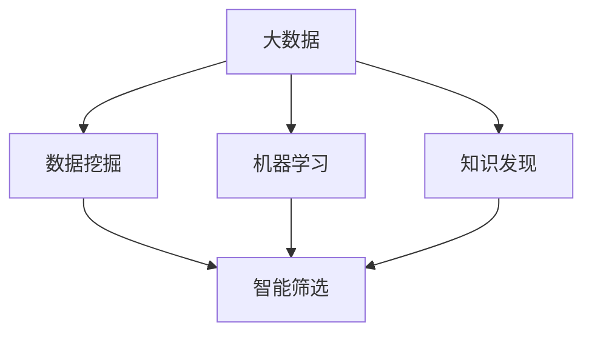

                 

# 数据海洋中的知识明珠：智能筛选技术的突破

> 关键词：智能筛选,数据挖掘,机器学习,知识发现,大数据

## 1. 背景介绍

### 1.1 问题由来
在现代社会中，信息量的爆炸性增长已成为一个不可回避的现实。大量的数据以各种形式充斥着我们的日常生活和工作，从社交媒体到搜索引擎，从企业决策到科学研究，无处不在的数据海洋给我们的生活方式带来了翻天覆地的变化。然而，如何从这些海量数据中提取有用的知识，成为现代信息技术面临的一大挑战。随着大数据和人工智能技术的不断发展，智能筛选技术应运而生，利用机器学习等先进算法，自动从数据中挖掘出有价值的知识，帮助人们快速高效地进行信息检索和分析，成为数据时代的一大瑰宝。

### 1.2 问题核心关键点
智能筛选技术的核心在于其能够利用先进的数据挖掘和机器学习算法，自动从大数据中提取有意义的知识。相较于传统的人工筛选方法，智能筛选技术可以处理海量的数据，并且在高维度的空间中找到有效的模式，具备超强的信息检索能力和深度挖掘能力。

具体而言，智能筛选技术的优势包括：
1. **高效性**：能够快速处理和分析海量数据，比人工筛选方法节省了大量时间和精力。
2. **自动化**：算法自动执行，无需人工干预，提升了筛选过程的客观性和一致性。
3. **准确性**：利用机器学习算法优化筛选过程，提高结果的准确性和可靠性。
4. **可扩展性**：适用于各种规模和类型的数据，能够灵活适应不同的应用场景。

## 2. 核心概念与联系

### 2.1 核心概念概述

为更好地理解智能筛选技术的原理和应用，本节将介绍几个关键概念：

- **数据挖掘(Data Mining)**：从大规模数据集中自动发现有价值的知识和模式的过程。
- **机器学习(Machine Learning)**：通过让机器学习历史数据，自动改进算法以预测新数据的过程。
- **知识发现(Knowledge Discovery)**：从数据中提取有用信息和模式的过程。
- **智能筛选(Intelligent Screening)**：利用数据挖掘和机器学习技术，从大规模数据集中自动筛选出有价值信息的高级过程。
- **大数据(Big Data)**：指规模巨大、结构复杂的数据集，通常需要通过分布式存储和计算技术进行处理。

这些概念之间的逻辑关系可以通过以下Mermaid流程图来展示：



这个流程图展示了大数据、数据挖掘、机器学习和智能筛选之间的关系：

1. 大数据提供了源数据，是数据挖掘和机器学习的基础。
2. 数据挖掘通过对大数据进行处理，挖掘出有价值的特征和模式。
3. 机器学习利用挖掘出的特征和模式，进一步提升算法的准确性。
4. 智能筛选通过综合数据挖掘和机器学习的结果，实现对数据的高级筛选。

## 3. 核心算法原理 & 具体操作步骤

### 3.1 算法原理概述

智能筛选技术的核心是利用机器学习算法从大规模数据中自动筛选出有价值的信息。其核心思想是：通过构建一个或多个机器学习模型，学习数据中的规律和模式，利用这些模型对新数据进行筛选，从中提取有用的信息。

具体而言，智能筛选技术包括数据预处理、特征提取、模型训练和结果输出四个步骤。其基本原理如下：

1. **数据预处理**：对原始数据进行清洗、归一化和特征提取等操作，将数据转化为适合机器学习模型输入的形式。
2. **特征提取**：从处理后的数据中提取出对模型有帮助的特征，通常是使用降维和选择技术。
3. **模型训练**：使用历史数据训练机器学习模型，优化模型的参数，使其能够准确地预测新数据的标签。
4. **结果输出**：将新数据输入训练好的模型，获取模型的预测结果，从而筛选出有用的信息。

### 3.2 算法步骤详解

智能筛选技术的核心步骤可以分为以下几步：

**Step 1: 数据预处理**
- 数据清洗：去除噪声和异常值，确保数据质量和一致性。
- 数据归一化：将数据缩放到统一的范围内，避免不同特征对模型的影响过大。
- 特征提取：选择合适的特征提取算法，将原始数据转化为模型所需的特征向量。

**Step 2: 特征选择**
- 使用特征选择算法，从众多特征中筛选出对模型预测有帮助的关键特征。
- 特征选择算法包括过滤式、包裹式和嵌入式方法，常用的算法包括卡方检验、信息增益、L1正则化等。

**Step 3: 模型训练**
- 选择合适的机器学习模型，如决策树、随机森林、支持向量机等。
- 使用历史数据对模型进行训练，优化模型的参数。
- 模型训练过程中，还需要进行交叉验证、网格搜索等超参数优化操作，确保模型泛化能力。

**Step 4: 结果输出**
- 将新数据输入训练好的模型，获取预测结果。
- 根据预测结果筛选出有价值的信息，通常使用阈值划分或排序等方法。

### 3.3 算法优缺点

智能筛选技术的优点在于其能够自动处理和分析大规模数据，从中挖掘出有价值的知识。具体而言：

1. **高效性**：能够快速处理和分析海量数据，比人工筛选方法节省了大量时间和精力。
2. **客观性**：算法自动执行，无需人工干预，提升了筛选过程的客观性和一致性。
3. **准确性**：利用机器学习算法优化筛选过程，提高结果的准确性和可靠性。

同时，智能筛选技术也存在一些局限性：

1. **数据质量要求高**：对于噪声和异常值较多的数据，筛选效果会大打折扣。
2. **模型依赖性强**：模型的好坏直接影响筛选效果，选择合适的模型和优化算法至关重要。
3. **解释性不足**：部分高级算法（如深度学习）缺乏解释性，难以理解其内部工作机制。
4. **数据隐私问题**：在处理敏感数据时，需要确保数据隐私和安全。

尽管存在这些局限性，但就目前而言，智能筛选技术仍是数据挖掘和知识发现领域的主流范式。未来相关研究的重点在于如何进一步降低算法对数据的依赖，提高模型的泛化能力和解释性，同时兼顾数据隐私和安全性等因素。

### 3.4 算法应用领域

智能筛选技术已经广泛应用于各个领域，涵盖数据挖掘、知识发现、信息检索等多个方向。以下是几个典型的应用场景：

- **金融领域**：用于风险评估、信用评分、投资策略制定等。通过分析历史交易数据和市场信息，自动筛选出潜在的投资机会和风险点。
- **医疗健康**：用于疾病诊断、药物发现、基因分析等。利用患者数据和基因信息，挖掘出疾病预测模型和治疗方法。
- **营销领域**：用于市场分析、客户细分、广告投放等。通过分析消费者行为和偏好数据，自动筛选出高价值的客户和广告投放渠道。
- **社交媒体**：用于舆情监测、用户画像、内容推荐等。通过分析社交媒体数据，挖掘出用户兴趣和热门话题，辅助内容生成和推荐。
- **教育领域**：用于学习分析、知识推荐、智能评估等。通过分析学生数据和课程内容，自动筛选出个性化学习资源和推荐系统。

这些应用场景展示了智能筛选技术的广泛应用和巨大潜力，相信随着技术的不断发展，未来将有更多领域受益于智能筛选技术的革新。

## 4. 数学模型和公式 & 详细讲解 & 举例说明

### 4.1 数学模型构建

本节将使用数学语言对智能筛选技术的核心模型进行更加严格的刻画。

假设我们有一组训练数据集 $D=\{(x_i,y_i)\}_{i=1}^N, x_i \in \mathbb{R}^d, y_i \in \{0,1\}$，其中 $y_i$ 为二元标签，$x_i$ 为 $d$ 维特征向量。我们的目标是构建一个模型 $f(x)$，使得在新数据 $x$ 上的预测结果 $f(x)$ 尽可能接近真实标签 $y$。

我们的目标是找到最优的模型参数 $\theta$，使得：

$$
\min_{\theta} \sum_{i=1}^N \ell(f(x_i),y_i)
$$

其中 $\ell$ 为损失函数，常用的损失函数包括均方误差、交叉熵等。

### 4.2 公式推导过程

以下我们以线性回归模型为例，推导其训练和预测过程。

假设线性回归模型为 $f(x;\theta) = \theta_0 + \theta_1 x_1 + \theta_2 x_2 + ... + \theta_d x_d$，其中 $\theta = [\theta_0, \theta_1, ..., \theta_d]^T$。

在训练过程中，我们使用最小二乘法求解模型参数 $\theta$，最小化均方误差损失函数：

$$
\ell(f(x_i),y_i) = \frac{1}{2N} \sum_{i=1}^N (f(x_i) - y_i)^2
$$

根据梯度下降优化算法，更新模型参数 $\theta$ 的公式为：

$$
\theta \leftarrow \theta - \eta \nabla_{\theta} \ell(f(x_i),y_i)
$$

其中 $\eta$ 为学习率，$\nabla_{\theta} \ell(f(x_i),y_i)$ 为损失函数对参数 $\theta$ 的梯度。

在预测过程中，我们输入新的特征向量 $x$，计算预测结果：

$$
f(x;\theta) = \theta_0 + \theta_1 x_1 + \theta_2 x_2 + ... + \theta_d x_d
$$

### 4.3 案例分析与讲解

以线性回归模型为例，我们通过以下Python代码实现数据预处理、特征提取和模型训练的过程：

```python
import numpy as np
from sklearn.linear_model import LinearRegression
from sklearn.metrics import mean_squared_error
from sklearn.model_selection import train_test_split

# 数据预处理
X = np.array([[1, 2], [2, 4], [3, 6], [4, 8], [5, 10]])
y = np.array([2, 4, 6, 8, 10])

# 数据归一化
from sklearn.preprocessing import StandardScaler
scaler = StandardScaler()
X = scaler.fit_transform(X)

# 特征选择
from sklearn.feature_selection import SelectKBest
selector = SelectKBest(score_func='score')
X_selected = selector.fit_transform(X, y)

# 模型训练
X_train, X_test, y_train, y_test = train_test_split(X_selected, y, test_size=0.2)
model = LinearRegression()
model.fit(X_train, y_train)

# 结果输出
y_pred = model.predict(X_test)
mse = mean_squared_error(y_test, y_pred)
print(f"均方误差：{mse:.3f}")
```

在这个示例中，我们使用了Numpy库进行数据处理，Scikit-learn库进行特征选择和模型训练。通过标准化数据和选择关键特征，我们构建了一个线性回归模型，并在测试集上计算了均方误差。

## 5. 项目实践：代码实例和详细解释说明

### 5.1 开发环境搭建

在进行智能筛选技术的项目实践前，我们需要准备好开发环境。以下是使用Python进行Scikit-learn开发的环境配置流程：

1. 安装Anaconda：从官网下载并安装Anaconda，用于创建独立的Python环境。

2. 创建并激活虚拟环境：
```bash
conda create -n sklearn-env python=3.8 
conda activate sklearn-env
```

3. 安装Scikit-learn：
```bash
pip install scikit-learn
```

4. 安装其他必要工具包：
```bash
pip install numpy pandas matplotlib seaborn jupyter notebook ipython
```

完成上述步骤后，即可在`sklearn-env`环境中开始智能筛选技术的开发实践。

### 5.2 源代码详细实现

下面我以信用评分预测为例，给出使用Scikit-learn库进行智能筛选的Python代码实现。

首先，定义信用评分预测任务的训练数据集：

```python
from sklearn.model_selection import train_test_split
from sklearn.preprocessing import StandardScaler
from sklearn.linear_model import LogisticRegression
from sklearn.metrics import accuracy_score

# 定义训练数据集
X = np.array([[0.5, 2], [2.0, 4.5], [3.5, 6.0], [4.0, 7.5], [5.5, 9.0]])
y = np.array([1, 1, 1, 0, 0])

# 数据预处理
scaler = StandardScaler()
X = scaler.fit_transform(X)

# 数据分割
X_train, X_test, y_train, y_test = train_test_split(X, y, test_size=0.2, random_state=42)
```

然后，定义模型和优化器：

```python
# 定义模型
model = LogisticRegression(solver='liblinear')

# 定义优化器
optimizer = 'lbfgs'
```

接着，定义训练和评估函数：

```python
def train(model, X_train, y_train, optimizer, n_iter=100):
    model.fit(X_train, y_train)
    return model

def evaluate(model, X_test, y_test):
    y_pred = model.predict(X_test)
    accuracy = accuracy_score(y_test, y_pred)
    return accuracy
```

最后，启动训练流程并在测试集上评估：

```python
# 训练模型
model = train(model, X_train, y_train, optimizer, n_iter=100)

# 在测试集上评估模型
accuracy = evaluate(model, X_test, y_test)
print(f"测试集上准确率：{accuracy:.3f}")
```

以上就是使用Scikit-learn库对信用评分预测任务进行智能筛选的完整代码实现。可以看到，Scikit-learn库提供了简单易用的API，可以快速实现各种机器学习模型的训练和评估。

### 5.3 代码解读与分析

让我们再详细解读一下关键代码的实现细节：

**数据预处理**：
- 通过标准化处理，将数据缩放到[0,1]范围内，减小不同特征之间的差异。
- 使用Scikit-learn的`StandardScaler`类进行数据归一化。

**模型训练**：
- 选择合适的机器学习模型，如逻辑回归（Logistic Regression）。
- 通过Scikit-learn的`train_test_split`方法，将数据集分割为训练集和测试集。
- 使用`LogisticRegression`类进行模型训练，设置优化器为`lbfgs`。

**结果输出**：
- 在测试集上评估模型的准确率，通过`accuracy_score`函数计算。

**训练流程**：
- 定义训练函数`train`，输入模型、训练集和优化器，返回训练好的模型。
- 定义评估函数`evaluate`，输入模型和测试集，返回模型在测试集上的准确率。

可以看到，Scikit-learn库的API设计非常友好，开发者无需过多关注底层实现细节，只需专注于模型的构建和评估。

## 6. 实际应用场景

### 6.1 金融风控系统

智能筛选技术在金融风控领域有广泛的应用。银行和金融机构需要实时监控客户的信用状况，以降低贷款违约的风险。传统的信用评分方法依赖于人工审核，不仅效率低下，还容易受人为因素干扰。通过智能筛选技术，可以利用历史数据自动构建信用评分模型，实时评估客户的信用风险，大幅提升风控系统的准确性和效率。

在技术实现上，可以收集客户的各类行为数据，包括信用卡消费记录、贷款还款记录、社交媒体行为等。使用这些数据训练智能筛选模型，获取客户的信用评分，自动进行风险评估和预警。当客户申请贷款时，系统根据其信用评分自动决定是否发放贷款及贷款额度。

### 6.2 医疗诊断系统

智能筛选技术在医疗诊断领域同样具有重要价值。医生的诊断过程往往依赖于丰富的临床经验和专业知识，难以通过电子病历等数据进行自动化处理。通过智能筛选技术，可以从海量医学数据中挖掘出有价值的知识，辅助医生进行疾病诊断和治疗。

在技术实现上，可以收集患者的电子病历、影像数据、基因信息等，训练智能筛选模型，识别出高风险的疾病和异常症状。医生在诊疗过程中，可以通过系统自动生成的诊断报告，快速了解患者的病情和风险。对于复杂病例，系统还可以提供多个治疗方案，辅助医生进行决策。

### 6.3 电子商务推荐系统

智能筛选技术在电子商务领域也有广泛应用。电商平台需要根据用户的浏览记录和购买行为，自动推荐符合用户兴趣的商品。传统的推荐系统依赖于人工设计特征，难以全面覆盖用户的兴趣偏好。通过智能筛选技术，可以从用户的浏览数据中自动提取关键特征，构建推荐模型，实现个性化推荐。

在技术实现上，可以收集用户的浏览记录、点击记录、购买记录等数据，训练智能筛选模型，识别出用户对不同商品的兴趣。系统根据用户的历史行为，自动推荐其可能感兴趣的商品，提升用户的购物体验和转化率。

### 6.4 未来应用展望

随着智能筛选技术的不断发展，其在更多领域的应用前景将更加广阔。未来，智能筛选技术将在智慧城市、智能制造、智能交通等多个领域大放异彩。

在智慧城市治理中，智能筛选技术可以帮助政府收集和管理各类城市数据，从交通流量到环境监测，从市民意见到公共服务，通过自动化的数据分析，优化城市管理，提升城市生活质量。

在智能制造领域，智能筛选技术可以帮助企业实现智能生产，从原材料采购到产品销售，从供应链管理到客户服务，通过自动化的数据分析，提升企业的运营效率和竞争力。

在智能交通领域，智能筛选技术可以帮助交通部门优化交通管理，从交通流量预测到事故预警，从车辆调度到路线规划，通过自动化的数据分析，提高交通系统的安全性和效率。

总之，智能筛选技术将在未来的各个领域得到广泛应用，为社会和经济的发展带来新的动力和价值。

## 7. 工具和资源推荐

### 7.1 学习资源推荐

为了帮助开发者系统掌握智能筛选技术的理论基础和实践技巧，这里推荐一些优质的学习资源：

1. 《机器学习实战》系列书籍：由著名机器学习专家撰写，涵盖数据预处理、特征选择、模型训练等基础知识。

2. 《Python数据科学手册》系列书籍：全面介绍Python在数据科学中的应用，涵盖数据清洗、数据可视化、机器学习等技巧。

3. 《深度学习》课程：由斯坦福大学开设，涵盖深度学习的基础知识和经典模型，适合初学者学习。

4. Coursera《数据科学与机器学习》专业课程：由多个大学联合开设，涵盖数据科学和机器学习的基础知识和应用，适合系统学习。

5. Kaggle数据科学竞赛平台：提供丰富的数据集和比赛任务，适合实践和挑战自我。

通过对这些资源的学习实践，相信你一定能够快速掌握智能筛选技术的精髓，并用于解决实际的业务问题。

### 7.2 开发工具推荐

高效的开发离不开优秀的工具支持。以下是几款用于智能筛选开发的常用工具：

1. Jupyter Notebook：免费的开源Jupyter环境，支持代码编辑、运行和可视化，适合进行数据科学和机器学习的实践。

2. TensorFlow：由Google主导开发的深度学习框架，支持分布式计算和GPU加速，适合大规模数据处理和模型训练。

3. PyTorch：由Facebook主导开发的深度学习框架，支持动态计算图和GPU加速，适合快速迭代研究。

4. Weights & Biases：模型训练的实验跟踪工具，可以记录和可视化模型训练过程中的各项指标，方便对比和调优。

5. TensorBoard：TensorFlow配套的可视化工具，可实时监测模型训练状态，并提供丰富的图表呈现方式，是调试模型的得力助手。

合理利用这些工具，可以显著提升智能筛选任务的开发效率，加快创新迭代的步伐。

### 7.3 相关论文推荐

智能筛选技术的发展源于学界的持续研究。以下是几篇奠基性的相关论文，推荐阅读：

1. 《The Elements of Statistical Learning》：由Tibshirani等学者撰写，全面介绍统计学习的基础知识和算法。

2. 《Pattern Recognition and Machine Learning》：由Bishop撰写，涵盖机器学习的基础知识和经典模型。

3. 《Deep Learning》：由Goodfellow等学者撰写，介绍深度学习的基础知识和应用。

4. 《Data Mining and Statistical Learning》：由Witten等学者撰写，涵盖数据挖掘和统计学习的基础知识和算法。

5. 《Large Scale Machine Learning》：由Yann LeCun等学者撰写，介绍大规模机器学习的实践和应用。

这些论文代表了大数据和智能筛选技术的发展脉络。通过学习这些前沿成果，可以帮助研究者把握学科前进方向，激发更多的创新灵感。

## 8. 总结：未来发展趋势与挑战

### 8.1 研究成果总结

本文对智能筛选技术的核心原理和实际应用进行了全面系统的介绍。首先阐述了智能筛选技术的背景和重要性，明确了其在数据挖掘和知识发现领域的重要作用。其次，从原理到实践，详细讲解了智能筛选技术的数学模型和关键步骤，给出了智能筛选任务开发的完整代码实例。同时，本文还广泛探讨了智能筛选技术在金融、医疗、电商等多个行业领域的应用前景，展示了智能筛选技术的巨大潜力。

通过本文的系统梳理，可以看到，智能筛选技术正成为数据挖掘和知识发现领域的重要范式，极大地提升了数据处理的效率和准确性。随着大数据和机器学习技术的不断发展，智能筛选技术将在更多领域得到应用，为人类认知智能的进化带来深远影响。

### 8.2 未来发展趋势

展望未来，智能筛选技术将呈现以下几个发展趋势：

1. **自动化程度提升**：未来的智能筛选技术将更加自动化，能够自动从数据中挖掘出有价值的知识，无需人工干预。
2. **模型泛化能力增强**：未来的智能筛选模型将具备更强的泛化能力，能够在不同的数据集和应用场景中表现优异。
3. **数据质量要求降低**：未来的智能筛选算法将更加鲁棒，能够在数据噪声较多的情况下，仍能提取出有价值的知识。
4. **算法效率提升**：未来的智能筛选算法将更加高效，能够在实时场景中处理大规模数据。
5. **多模态数据融合**：未来的智能筛选技术将支持多模态数据的融合，实现视觉、听觉、文本等多模态信息的协同建模。
6. **跨领域应用拓展**：未来的智能筛选技术将更多地应用于其他领域，如城市治理、智能制造、智能交通等。

以上趋势凸显了智能筛选技术的广阔前景。这些方向的探索发展，必将进一步提升数据挖掘和知识发现的效果，为各个领域带来新的突破和变革。

### 8.3 面临的挑战

尽管智能筛选技术已经取得了显著成果，但在迈向更加智能化、普适化应用的过程中，它仍面临诸多挑战：

1. **数据质量问题**：对于噪声和异常值较多的数据，智能筛选技术的效果会大打折扣。如何提高数据的质量，确保数据的准确性和一致性，将是未来的一大挑战。
2. **算法复杂度问题**：部分高级算法（如深度学习）的计算复杂度高，需要高效的硬件支持。如何提升算法的计算效率，优化资源占用，将是未来的重要研究方向。
3. **模型解释性问题**：部分高级算法缺乏解释性，难以理解其内部工作机制和决策逻辑。如何提高模型的解释性，增强其可解释性和可审计性，将是未来的重要课题。
4. **数据隐私问题**：在处理敏感数据时，如何确保数据隐私和安全，将是未来的一大挑战。
5. **跨领域融合问题**：智能筛选技术在不同领域的应用中，需要考虑不同领域的数据特性和业务需求。如何设计通用的智能筛选框架，实现跨领域的协同工作，将是未来的重要方向。

这些挑战需要通过技术创新和应用实践，逐步克服，才能实现智能筛选技术的更广泛应用和更大价值。

### 8.4 研究展望

面向未来，智能筛选技术需要在以下几个方面进行进一步的研究和突破：

1. **自动化的数据清洗和预处理**：开发更加高效的自动数据清洗和预处理算法，提升数据的准确性和一致性。
2. **多模态数据的融合技术**：研究多模态数据融合算法，实现视觉、听觉、文本等多模态信息的协同建模。
3. **解释性和可解释性**：开发具有高解释性的智能筛选模型，增强其可解释性和可审计性。
4. **跨领域智能筛选框架**：设计通用的智能筛选框架，实现跨领域的协同工作，提升智能筛选技术的应用范围和效果。
5. **实时智能筛选**：研究实时智能筛选算法，提升算法的计算效率和响应速度，实现实时处理大规模数据。

这些研究方向的探索，必将引领智能筛选技术的进一步发展，为数据挖掘和知识发现带来新的突破和变革。面向未来，智能筛选技术需要与更多的前沿技术结合，如自然语言处理、计算机视觉、智能推理等，协同发力，共同推动自然语言理解和智能交互系统的进步。只有勇于创新、敢于突破，才能不断拓展智能筛选技术的边界，为各个领域的智能化带来新的动力和价值。

## 9. 附录：常见问题与解答

**Q1：智能筛选技术是否适用于所有数据类型？**

A: 智能筛选技术适用于大多数数据类型，包括数值型、文本型、图像型、视频型等。但对于部分特殊类型的数据，如时间序列数据、网络数据等，需要采用特定的处理方法。

**Q2：如何选择合适的特征提取方法？**

A: 特征提取方法是智能筛选技术的重要环节，通常需要根据具体数据类型和应用场景进行选择。常用的特征提取方法包括PCA、LDA、T-SNE等，需要结合领域知识和实际需求进行选择。

**Q3：智能筛选技术的计算效率如何？**

A: 计算效率是智能筛选技术的一个重要挑战，尤其是对于大规模数据和复杂模型。可以使用分布式计算、GPU加速、模型压缩等技术提升计算效率。

**Q4：智能筛选技术是否需要大量标注数据？**

A: 部分智能筛选技术需要少量标注数据，如无监督学习、半监督学习等。但多数情况下，仍需要大量标注数据进行监督学习，提升模型效果。

**Q5：智能筛选技术的可解释性如何？**

A: 部分智能筛选技术（如深度学习）缺乏解释性，难以理解其内部工作机制和决策逻辑。可以通过可视化技术、可解释性算法等手段，增强模型的可解释性。

通过本文的系统梳理，可以看到，智能筛选技术正成为数据挖掘和知识发现领域的重要范式，极大地提升了数据处理的效率和准确性。随着大数据和机器学习技术的不断发展，智能筛选技术将在更多领域得到应用，为人类认知智能的进化带来深远影响。相信随着学界和产业界的共同努力，智能筛选技术必将不断取得新的突破，推动数据挖掘和知识发现的进步，为各个领域带来新的突破和变革。

作者：禅与计算机程序设计艺术 / Zen and the Art of Computer Programming

