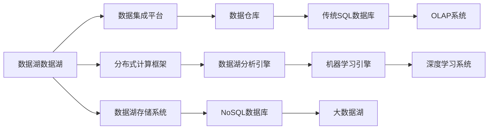

                 

# 数据湖架构：大规模数据存储和分析

> 关键词：数据湖, 数据仓库, 数据集成, 数据分析, 大数据处理, 数据生命周期管理, 数据湖技术栈

## 1. 背景介绍

### 1.1 问题由来
在现代数据驱动的时代，企业对数据的依赖日益增强。数据不仅被视为资产，更被视为一种战略性资源。如何高效、安全地存储和分析这些数据，从中挖掘有价值的信息，驱动业务决策，成为每一个企业都必须面对的挑战。传统的OLTP(联机事务处理)数据库和数据仓库系统已经难以应对海量数据和快速变化的业务需求。与此同时，大数据技术的发展，特别是Hadoop和Spark等分布式计算框架的成熟，为大规模数据存储和分析提供了新的解决方案。

数据湖架构正是基于这些背景应运而生的一种新型数据管理范式。数据湖能够存储任意类型的数据，通过分布式计算框架进行快速分析，并通过机器学习和人工智能技术挖掘数据中的深层次价值。在企业数字化转型加速的今天，数据湖正在成为连接业务、技术、创新和竞争力的重要纽带。

### 1.2 问题核心关键点
数据湖架构的核心思想是将数据存储和数据处理分离，通过一个集中化的平台，高效、灵活地管理和分析各种数据类型。其主要特点包括：
- 支持多种数据类型和来源
- 无限扩展，按需伸缩
- 以业务为导向，提供即席分析能力
- 强调数据的原始性和完整性

数据湖架构的实现依赖于一系列关键组件和技术栈，如图1所示。



### 1.3 问题研究意义
数据湖架构为企业提供了全新的数据管理范式，具有显著的优势和广泛的应用前景：

1. **数据完整性**：数据湖能够保存原始数据，避免了数据清洗和转换过程中的信息损失。
2. **灵活性**：支持多种数据类型和格式，能够灵活处理各类数据。
3. **可扩展性**：按需伸缩，支持海量数据的存储和分析。
4. **成本效益**：通过集中化管理和共享，减少冗余数据存储和管理成本。
5. **创新性**：结合机器学习和人工智能技术，挖掘数据深层次价值，支持创新性业务应用。

因此，数据湖架构成为了大数据时代企业数据管理的重要方向，对于推动企业数字化转型、提升数据驱动能力具有重要意义。

## 2. 核心概念与联系

### 2.1 核心概念概述

为更好地理解数据湖架构，本节将介绍几个关键概念：

- **数据湖(Data Lake)**：一个集中化的数据存储平台，可以存储各种类型的数据，如结构化数据、非结构化数据、时序数据等，并通过分布式计算框架进行分析和处理。数据湖强调数据的原始性和完整性，支持无限扩展和按需伸缩。

- **数据仓库(Data Warehouse)**：基于数据仓库技术进行的数据管理平台，主要用于支撑决策支持系统。数据仓库通过将数据整合和转换，提炼出可支持报表、分析、钻取的数据模型。

- **数据集成(Data Integration)**：将来自不同来源、不同类型的数据，整合到数据湖或数据仓库中进行统一管理和分析的过程。数据集成依赖于ETL(抽取、转换、加载)技术，实现数据的自动提取、转换和加载。

- **分布式计算框架(Distributed Computing Framework)**：如Hadoop、Spark等，用于大规模数据存储和处理，支持并行计算，提高数据处理效率。

- **数据湖存储系统(Data Lake Storage System)**：如Amazon S3、Azure Blob等，提供大容量、低成本的数据存储服务，支持多种数据格式。

- **数据湖分析引擎(Data Lake Analytics Engine)**：如Apache Flink、Apache Spark等，用于高效处理和分析数据湖中的数据，支持SQL查询、流处理、机器学习等。

- **NoSQL数据库(NoSQL Database)**：如Apache Cassandra、MongoDB等，用于支持非结构化数据存储和管理，适应大规模高并发的读写需求。

- **传统SQL数据库(Traditional SQL Database)**：如MySQL、Oracle等，主要用于支持事务处理，提供高效的数据读写和事务一致性。

- **OLAP系统(Online Analytical Processing System)**：如SAP BusinessObjects、Tableau等，用于支持即席分析，提供高性能的查询和报表生成能力。

- **机器学习引擎(Machine Learning Engine)**：如TensorFlow、PyTorch等，用于支撑机器学习和人工智能应用，提取数据中的模式和趋势。

- **深度学习系统(Deep Learning System)**：如Google Deep Learning、Microsoft Cognitive Toolkit等，用于实现深度神经网络的训练和推理，提取数据中的高层次特征。

这些核心概念构成了数据湖架构的技术基础，帮助企业在数据管理、存储、分析和应用中取得更大的成功。

## 3. 核心算法原理 & 具体操作步骤
### 3.1 算法原理概述

数据湖架构的核心算法原理主要基于分布式计算和大数据处理技术，通过构建一个集中化的数据平台，高效、灵活地管理和分析各种数据类型。其核心思想包括：

- **集中化存储**：将各类数据集中存储在数据湖中，减少数据冗余和存储管理成本。
- **分布式计算**：利用Hadoop、Spark等分布式计算框架，实现海量数据的并行处理和分析。
- **实时计算**：通过流计算和分布式计算框架，实现数据流的实时处理和分析。
- **多模式分析**：支持SQL查询、流处理、机器学习和深度学习等多种分析模式，适应不同业务需求。
- **数据湖治理**：通过元数据管理和数据质量管理，提升数据管理和治理能力。

这些原理构成了数据湖架构的基础，使得数据湖能够高效、灵活地管理和分析各种数据类型，满足不同业务需求。

### 3.2 算法步骤详解

数据湖架构的实现通常包括以下关键步骤：

**Step 1: 数据采集与预处理**
- 通过数据集成平台，收集来自不同来源、不同类型的数据，并进行预处理，如去重、清洗、转换等。
- 将数据加载到数据湖存储系统中，存储格式和存储策略根据数据类型和业务需求进行配置。

**Step 2: 数据湖存储与管理**
- 使用NoSQL数据库和传统SQL数据库，对数据湖进行高效存储和管理。
- 配置数据湖的访问权限和安全策略，确保数据安全和隐私保护。

**Step 3: 数据湖分析与处理**
- 利用分布式计算框架和数据湖分析引擎，对数据湖中的数据进行高效分析和处理。
- 使用SQL查询、流处理、机器学习和深度学习等技术，提取数据中的模式和趋势。

**Step 4: 数据可视化与报表**
- 使用数据可视化工具和报表系统，将分析结果转化为可视化图表和报表。
- 通过仪表盘和报表，向业务人员展示数据洞察和决策支持信息。

**Step 5: 数据治理与质量管理**
- 通过元数据管理和数据质量管理，提升数据管理和治理能力。
- 配置数据生命周期管理策略，确保数据的安全性和可用性。

以上是数据湖架构实现的典型步骤，每个步骤都需要根据具体业务需求进行定制和优化。

### 3.3 算法优缺点

数据湖架构的主要优点包括：

1. **灵活性和可扩展性**：支持多种数据类型和格式，按需扩展，满足不同业务需求。
2. **数据完整性和原始性**：保留数据的原始性和完整性，避免数据清洗和转换过程中的信息损失。
3. **成本效益**：通过集中化管理和共享，减少冗余数据存储和管理成本。
4. **创新性和数据驱动**：结合机器学习和人工智能技术，挖掘数据深层次价值，支持创新性业务应用。

同时，数据湖架构也存在一些缺点：

1. **数据质量管理复杂**：需要配置数据质量管理策略，确保数据的一致性和完整性。
2. **数据治理挑战**：需要配置元数据管理和数据生命周期管理策略，确保数据的安全性和可用性。
3. **数据集成复杂**：需要配置数据集成平台和ETL工具，实现数据的自动抽取、转换和加载。

尽管存在这些局限性，但总体而言，数据湖架构为企业提供了高效、灵活的数据管理和分析能力，具有广泛的应用前景。

### 3.4 算法应用领域

数据湖架构在多个领域得到了广泛应用，例如：

- **金融行业**：用于存储和分析海量交易数据、客户数据和市场数据，支持风险管理、客户分析和市场预测等。
- **零售行业**：用于存储和分析客户交易数据、行为数据和市场数据，支持个性化推荐、库存管理和市场分析等。
- **医疗行业**：用于存储和分析患者数据、医疗记录和研究数据，支持疾病预测、临床研究和患者管理等。
- **制造行业**：用于存储和分析生产数据、设备数据和供应链数据，支持生产优化、设备维护和供应链管理等。
- **政府行业**：用于存储和分析政府数据、公共数据和社会数据，支持公共管理、社会服务和政策制定等。
- **能源行业**：用于存储和分析能源数据、设备数据和市场数据，支持能源优化、设备维护和市场预测等。

这些应用领域展示了数据湖架构的广泛适用性和巨大价值。未来，随着数据湖技术的不断成熟，其应用范围还将进一步扩展。

## 4. 数学模型和公式 & 详细讲解 & 举例说明

### 4.1 数学模型构建

数据湖架构的实现涉及多种数学模型和技术栈，以下将详细介绍这些模型的构建。

假设数据湖存储的数据集为 $D=\{(x_i,y_i)\}_{i=1}^N$，其中 $x_i$ 为输入特征，$y_i$ 为输出标签。数据湖的数学模型可以表示为：

$$
M(D) = \{(x,y)\} \rightarrow \mathcal{Y}
$$

其中 $M(D)$ 为数据湖中的模型，$\mathcal{Y}$ 为输出空间。

数据湖分析引擎通常使用机器学习模型进行数据分析和预测，如线性回归、决策树、随机森林、梯度提升树、支持向量机等。这些模型可以通过训练数据集 $D$ 来拟合模型参数 $\theta$，得到最优的预测函数 $M_{\theta}$。数学模型可以表示为：

$$
M_{\theta}(x) = f(x;\theta)
$$

其中 $f(x;\theta)$ 为预测函数，$\theta$ 为模型参数。

### 4.2 公式推导过程

以下以线性回归模型为例，详细推导数据湖中的数学模型和预测函数。

假设数据湖中的数据集为 $D=\{(x_i,y_i)\}_{i=1}^N$，其中 $x_i$ 为输入特征，$y_i$ 为输出标签。线性回归模型的目标是找到一个线性函数 $f(x;\theta)=\theta_0+\theta_1x_1+\theta_2x_2+\ldots+\theta_nx_n$，使得预测值与真实值之间的误差最小。假设误差函数为均方误差，则线性回归模型的目标可以表示为：

$$
\min_{\theta} \sum_{i=1}^N (y_i - f(x_i;\theta))^2
$$

通过最小二乘法，求解上述优化问题，得到最优的模型参数 $\theta$。具体求解步骤为：

$$
\theta = \arg\min_{\theta} \sum_{i=1}^N (y_i - \theta_0 - \theta_1x_1 - \theta_2x_2 - \ldots - \theta_nx_n)^2
$$

其中 $\theta_0,\theta_1,\theta_2,\ldots,\theta_n$ 为线性回归模型的参数。

求解上述优化问题，可以得到最优的模型参数：

$$
\theta = (X^TX)^{-1}X^Ty
$$

其中 $X=\begin{bmatrix} 1 & x_1 & x_2 & \ldots & x_n \\ 1 & x_1' & x_2' & \ldots & x_n' \\ 1 & x_1'' & x_2'' & \ldots & x_n'' \\ \vdots & \vdots & \vdots & \vdots & \vdots \\ 1 & x_1^N & x_2^N & \ldots & x_n^N \end{bmatrix}$，$y=\begin{bmatrix} y_1 \\ y_2 \\ \vdots \\ y_N \end{bmatrix}$，$y_i$ 为输入特征 $x_i$ 对应的标签。

通过求解上述优化问题，可以得到最优的线性回归模型参数 $\theta$，用于对新数据进行预测。

### 4.3 案例分析与讲解

以金融行业为例，说明数据湖架构在实际应用中的具体实现。

假设某银行希望通过数据湖架构分析客户交易数据，预测客户的信用风险。客户交易数据包括客户的交易记录、账户余额、信用历史等。数据湖存储结构可以表示为：

$$
D=\{(x_i,y_i)\}_{i=1}^N = \{(x_{t,i},y_{t,i})\}_{i=1}^N = \{(t_i,x_{t,i},y_{t,i})\}_{i=1}^N
$$

其中 $t_i$ 为时间戳，$x_{t,i}$ 为输入特征，$y_{t,i}$ 为输出标签。

数据湖分析引擎使用线性回归模型进行数据分析和预测，训练数据集 $D$ 和预测函数 $f(x;\theta)$ 如上所述。通过最小二乘法求解最优的模型参数 $\theta$，得到线性回归模型：

$$
M_{\theta}(x) = \theta_0 + \theta_1x_1 + \theta_2x_2 + \ldots + \theta_nx_n
$$

其中 $x_1,\ldots,x_n$ 为输入特征，$\theta_0,\ldots,\theta_n$ 为模型参数。

通过训练数据集 $D$ 进行模型训练，得到最优的模型参数 $\theta$。将新客户交易数据输入到模型中，得到客户的信用风险预测值 $M_{\theta}(x)$。通过分析预测结果，银行可以对高风险客户进行提前干预，降低信用风险。

## 5. 项目实践：代码实例和详细解释说明

### 5.1 开发环境搭建

在进行数据湖架构实践前，我们需要准备好开发环境。以下是使用Python进行PyTorch开发的环境配置流程：

1. 安装Anaconda：从官网下载并安装Anaconda，用于创建独立的Python环境。

2. 创建并激活虚拟环境：
```bash
conda create -n pytorch-env python=3.8 
conda activate pytorch-env
```

3. 安装PyTorch：根据CUDA版本，从官网获取对应的安装命令。例如：
```bash
conda install pytorch torchvision torchaudio cudatoolkit=11.1 -c pytorch -c conda-forge
```

4. 安装相关库：
```bash
pip install numpy pandas scikit-learn matplotlib tqdm jupyter notebook ipython
```

完成上述步骤后，即可在`pytorch-env`环境中开始数据湖架构实践。

### 5.2 源代码详细实现

这里以数据湖存储和分析为例，给出使用Python实现数据湖架构的代码实现。

首先，定义数据湖存储系统：

```python
import boto3
import os

def create_s3_bucket(bucket_name):
    client = boto3.client('s3')
    response = client.create_bucket(Bucket=bucket_name)
    print(f"Bucket {bucket_name} created successfully")
```

然后，定义数据湖分析引擎：

```python
import pandas as pd

def read_data_from_s3(bucket_name, object_key):
    s3 = boto3.client('s3')
    response = s3.get_object(Bucket=bucket_name, Key=object_key)
    data = response['Body'].read().decode('utf-8')
    df = pd.read_csv(data)
    return df
```

接着，定义数据湖分析函数：

```python
def train_linear_regression_model(df, target_column):
    x = df.drop(target_column, axis=1)
    y = df[target_column]
    from sklearn.linear_model import LinearRegression
    model = LinearRegression()
    model.fit(x, y)
    return model
```

最后，启动数据湖分析流程：

```python
bucket_name = 'my-data-lake'
object_key = 'data.csv'
create_s3_bucket(bucket_name)
df = read_data_from_s3(bucket_name, object_key)
model = train_linear_regression_model(df, 'target')
print(model.coef_)
```

以上就是使用Python实现数据湖架构的完整代码实现。可以看到，数据湖架构的实现依赖于多种技术栈，如AWS S3存储系统、Pandas数据分析库、Scikit-learn机器学习库等。通过将这些技术有机结合，可以实现高效、灵活的数据管理和分析。

### 5.3 代码解读与分析

让我们再详细解读一下关键代码的实现细节：

**s3库**：
- `create_s3_bucket`方法：创建并配置S3存储桶，用于存储数据湖中的数据。

**read_data_from_s3方法**：
- 使用Boto3库连接S3存储系统，读取指定路径下的数据文件，并转换为Pandas DataFrame对象，便于后续分析。

**train_linear_regression_model方法**：
- 定义线性回归模型，通过Pandas DataFrame对象加载数据，并使用Scikit-learn库进行模型训练。

**启动流程**：
- 定义S3存储桶和数据文件路径，创建S3存储桶。
- 从S3存储系统读取数据文件，进行数据预处理。
- 训练线性回归模型，输出模型系数。

可以看到，数据湖架构的实现涉及多种技术栈，需要开发者根据具体业务需求进行灵活组合。合理利用这些工具，可以显著提升数据湖架构的开发效率，加快创新迭代的步伐。

## 6. 实际应用场景

### 6.1 智能制造

数据湖架构在智能制造领域具有广泛的应用前景。智能制造强调通过数据分析和机器学习技术，优化生产流程，提高生产效率和质量。数据湖架构能够存储和分析各类生产数据，如设备状态、生产参数、产品检测数据等，帮助企业进行预测性维护、故障诊断和优化生产调度。

在技术实现上，可以收集生产数据，存储到数据湖中。使用数据湖分析引擎进行数据分析和预测，如通过时间序列分析和机器学习模型，预测设备故障，优化生产调度，减少停机时间，提升生产效率。

### 6.2 智慧医疗

数据湖架构在智慧医疗领域同样具有广泛的应用前景。智慧医疗强调通过数据分析和机器学习技术，优化医疗资源配置，提高医疗服务质量。数据湖架构能够存储和分析各类医疗数据，如患者病历、医疗影像、基因数据等，帮助医院进行疾病预测、临床研究和患者管理。

在技术实现上，可以收集医疗数据，存储到数据湖中。使用数据湖分析引擎进行数据分析和预测，如通过图像识别和机器学习模型，辅助医生进行疾病诊断，提高诊断准确率。通过基因数据分析，进行疾病预测和个性化治疗，提高治疗效果。

### 6.3 智能交通

数据湖架构在智能交通领域也有着广泛的应用前景。智能交通强调通过数据分析和机器学习技术，优化交通管理和调度，提高交通运行效率。数据湖架构能够存储和分析各类交通数据，如交通流量、车辆位置、路况信息等，帮助交通管理部门进行交通流量预测、路径优化和交通事件管理。

在技术实现上，可以收集交通数据，存储到数据湖中。使用数据湖分析引擎进行数据分析和预测，如通过交通流量分析和机器学习模型，进行交通流量预测和路径优化，减少交通拥堵，提升交通效率。

### 6.4 未来应用展望

随着数据湖技术的不断成熟，数据湖架构在更多领域得到了应用，为传统行业数字化转型提供了新的解决方案。

在智慧农业领域，数据湖架构可用于存储和分析土壤数据、气象数据、作物生长数据等，辅助农民进行精准农业，提升农业生产效率。

在智能物流领域，数据湖架构可用于存储和分析运输数据、库存数据、配送数据等，优化物流配送，提高物流效率。

在智慧城市治理中，数据湖架构可用于存储和分析城市数据、公共数据、社会数据等，支持城市决策和管理，提高城市智能化水平。

此外，在教育、能源、金融、公共安全等多个领域，数据湖架构也将不断拓展，为数字化转型带来新的活力和动力。

## 7. 工具和资源推荐
### 7.1 学习资源推荐

为了帮助开发者系统掌握数据湖架构的理论基础和实践技巧，这里推荐一些优质的学习资源：

1. 《Hadoop: The Definitive Guide》：由Cloudera专家撰写，全面介绍了Hadoop和Spark等大数据处理框架。

2. 《Data Lake Analytics: Implementation with AWS Big Data》：由AWS专家撰写，介绍了AWS数据湖架构的实现方法和最佳实践。

3. 《Big Data Analytics with Python》：由O'Reilly作者撰写，介绍了使用Python进行大数据分析和数据湖架构的实践方法。

4. 《Big Data Architectures: From Traditional to Cloud Computing》：由Springer出版，全面介绍了从传统到大数据架构的演变过程。

5. 《Data Lake: The Big Data Value Chain》：由O'Reilly出版，介绍了数据湖在数据管理和分析中的应用。

通过学习这些资源，相信你一定能够快速掌握数据湖架构的理论基础和实践技巧，并用于解决实际的业务问题。

### 7.2 开发工具推荐

高效的开发离不开优秀的工具支持。以下是几款用于数据湖架构开发的常用工具：

1. Apache Hadoop：由Apache基金会开发的分布式计算框架，支持大规模数据存储和处理。

2. Apache Spark：由Apache基金会开发的分布式计算框架，支持大规模数据处理和分析。

3. AWS Lake Formation：由AWS提供的云数据湖服务，支持数据湖架构的快速搭建和管理。

4. Azure Data Lake：由微软提供的云数据湖服务，支持数据湖架构的快速搭建和管理。

5. Google Cloud Data Lake：由谷歌提供的云数据湖服务，支持数据湖架构的快速搭建和管理。

合理利用这些工具，可以显著提升数据湖架构的开发效率，加快创新迭代的步伐。

### 7.3 相关论文推荐

数据湖架构的发展源于学界的持续研究。以下是几篇奠基性的相关论文，推荐阅读：

1. "Data Warehousing: A Concept Whose Time Has Come and Gone"：由W. W. Codd撰写，介绍了数据仓库的演变过程和面临的挑战。

2. "Big Data: Concepts, Technology, and Architecture"：由Viktor Kowalczyk撰写，全面介绍了大数据技术的发展历程和未来趋势。

3. "Data Lake: A Survey"：由Zhengyao Guo等人撰写，介绍了数据湖架构的定义、特点和实现方法。

4. "A Survey of Data Lake Architectures: Technologies and Models"：由Alan B. Kakushadze撰写，介绍了数据湖架构的多种技术和模型。

5. "Big Data Architectures: Current State and Future Directions"：由Peng Ning和Leonard J. Guerriero撰写，全面介绍了大数据架构的当前状态和未来方向。

这些论文代表了大数据和数据湖架构的研究方向，通过学习这些前沿成果，可以帮助研究者把握学科前进方向，激发更多的创新灵感。

## 8. 总结：未来发展趋势与挑战

### 8.1 总结

本文对数据湖架构进行了全面系统的介绍。首先阐述了数据湖架构的背景和意义，明确了其在数据管理、存储、分析和应用中的重要作用。其次，从原理到实践，详细讲解了数据湖架构的实现步骤和关键技术栈，给出了数据湖架构的代码实例。同时，本文还探讨了数据湖架构在智能制造、智慧医疗、智能交通等多个领域的应用前景，展示了其广阔的适用性和巨大价值。此外，本文还推荐了相关的学习资源和工具，力求为读者提供全方位的技术指引。

通过本文的系统梳理，可以看到，数据湖架构为企业提供了一种高效、灵活的数据管理和分析能力，具有显著的优势和广泛的应用前景。未来，随着数据湖技术的不断成熟，其应用范围还将进一步扩展，成为企业数字化转型中不可或缺的重要工具。

### 8.2 未来发展趋势

展望未来，数据湖架构的发展趋势包括：

1. **云化迁移**：越来越多的企业将数据湖架构迁移到云平台，如AWS Lake Formation、Azure Data Lake等，减少硬件投资和维护成本。

2. **自动化管理**：数据湖架构将向自动化管理方向发展，通过智能编排、自动扩展等技术，提升数据湖的管理效率和灵活性。

3. **多云集成**：数据湖架构将支持多云平台集成，通过跨云数据迁移、多云计算等技术，实现更高效的数据管理和分析。

4. **智能化分析**：结合机器学习和人工智能技术，数据湖架构将支持更高级别的数据分析，如预测性分析、异常检测等。

5. **数据治理**：通过元数据管理和数据质量管理，提升数据湖的数据治理能力，确保数据的安全性和可用性。

6. **异构数据整合**：支持异构数据源的整合，如结构化数据、非结构化数据、时序数据等，提升数据湖的数据完整性和丰富性。

以上趋势凸显了数据湖架构的广阔前景。这些方向的探索发展，将进一步提升数据湖架构的性能和应用范围，为企业的数字化转型提供更强大的支持。

### 8.3 面临的挑战

尽管数据湖架构具有显著的优势和广泛的应用前景，但在迈向更加智能化、普适化应用的过程中，它仍面临诸多挑战：

1. **数据质量和治理**：数据湖架构需要配置元数据管理和数据质量管理策略，确保数据的一致性和完整性。

2. **数据安全和管理**：需要配置数据访问权限和安全策略，确保数据的安全性和隐私保护。

3. **技术复杂性**：数据湖架构涉及多种技术栈，如Hadoop、Spark、AWS Lake Formation等，需要深入理解和熟练掌握。

4. **成本控制**：数据湖架构的建设成本较高，需要合理规划和控制成本。

5. **技术演进**：数据湖架构需要紧跟技术发展，不断更新和优化，避免技术滞后。

6. **数据价值挖掘**：如何从数据中提取深层次价值，提升数据湖的商业价值，是数据湖架构面临的重要挑战。

这些挑战需要通过技术创新、流程优化和团队协作等方式进行解决，才能真正发挥数据湖架构的潜力，推动企业的数字化转型进程。

### 8.4 研究展望

面对数据湖架构面临的挑战，未来的研究需要在以下几个方面寻求新的突破：

1. **自动化管理**：开发自动化的数据湖管理工具，提升数据湖的管理效率和灵活性。

2. **数据治理**：开发高效的数据治理工具，提升数据的质量管理和元数据管理能力。

3. **异构数据整合**：开发异构数据源的整合技术，提升数据湖的数据完整性和丰富性。

4. **智能化分析**：结合机器学习和人工智能技术，提升数据湖的智能化分析能力。

5. **云平台集成**：开发多云平台的集成工具，实现跨云数据迁移和多云计算。

6. **成本控制**：开发成本优化工具，提升数据湖架构的成本效益。

这些研究方向的探索，将引领数据湖架构技术迈向更高的台阶，为构建智能化、高效、安全的数据湖架构提供新的思路和方向。

## 9. 附录：常见问题与解答

**Q1：数据湖和数据仓库有什么区别？**

A: 数据湖和数据仓库是两种不同的数据管理范式。数据仓库主要用于支持事务处理和决策支持系统，强调数据的有序性和一致性。数据湖则强调数据的原始性和完整性，能够存储和分析各种类型的数据，包括结构化数据、非结构化数据、时序数据等。数据湖比数据仓库更加灵活和可扩展，适用于处理大规模、多变的数据。

**Q2：数据湖架构如何确保数据安全？**

A: 数据湖架构需要配置数据访问权限和安全策略，确保数据的安全性和隐私保护。具体措施包括：
1. 配置数据访问权限，限制对数据湖的访问。
2. 使用数据加密技术，保护数据传输和存储的安全性。
3. 定期备份数据，确保数据的安全性和可用性。
4. 配置审计和监控机制，实时监控数据湖的使用情况，防止数据泄露和滥用。

**Q3：数据湖架构对企业有哪些优势？**

A: 数据湖架构对企业具有显著的优势，主要体现在以下几个方面：
1. 数据完整性和原始性：保留数据的原始性和完整性，避免数据清洗和转换过程中的信息损失。
2. 灵活性和可扩展性：支持多种数据类型和格式，按需扩展，满足不同业务需求。
3. 数据质量管理：通过元数据管理和数据质量管理，提升数据管理和治理能力。
4. 数据驱动和创新：结合机器学习和人工智能技术，挖掘数据深层次价值，支持创新性业务应用。

**Q4：如何选择合适的数据湖存储系统？**

A: 选择合适的数据湖存储系统需要考虑以下几个因素：
1. 数据类型和格式：选择支持多种数据类型和格式的存储系统，如NoSQL数据库和传统SQL数据库。
2. 数据容量和性能：选择能够支持海量数据存储和高效数据处理的存储系统，如AWS S3和Azure Blob等。
3. 数据安全和管理：选择支持数据安全和管理功能的存储系统，如数据加密和访问权限控制。

**Q5：数据湖架构的实现步骤是什么？**

A: 数据湖架构的实现步骤通常包括以下几个关键步骤：
1. 数据采集与预处理：通过数据集成平台，收集来自不同来源、不同类型的数据，并进行预处理，如去重、清洗、转换等。
2. 数据湖存储与管理：使用NoSQL数据库和传统SQL数据库，对数据湖进行高效存储和管理。
3. 数据湖分析与处理：利用分布式计算框架和数据湖分析引擎，对数据湖中的数据进行高效分析和处理。
4. 数据可视化与报表：使用数据可视化工具和报表系统，将分析结果转化为可视化图表和报表。
5. 数据治理与质量管理：通过元数据管理和数据质量管理，提升数据管理和治理能力。

通过这些步骤，可以构建高效、灵活的数据湖架构，实现数据的高效管理和分析。

---

作者：禅与计算机程序设计艺术 / Zen and the Art of Computer Programming

