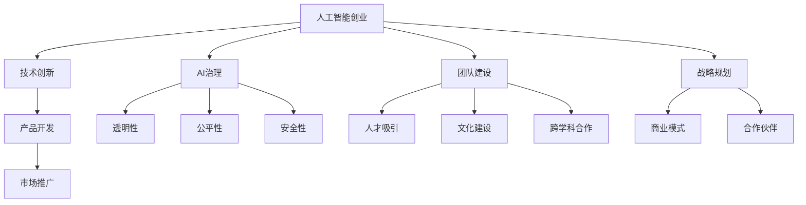

                 

# 新一代AI创业：贾扬清的故事，Lepton AI的前景与挑战

## 1. 背景介绍

随着人工智能技术的迅猛发展，越来越多的AI创业公司应运而生。在这些公司中，由微软亚洲研究院前院长、知名AI专家贾扬清创办的Lepton AI，无疑是引人瞩目的佼佼者。Lepton AI成立之初，便以构建“负责任的AI技术”为己任，致力于解决AI技术落地应用中的诸多难题。本文将深入探讨Lepton AI的创业历程、技术优势及其面临的挑战，展现新一代AI创业的广阔前景。

## 2. 核心概念与联系

### 2.1 核心概念概述

- **人工智能创业**：指的是基于人工智能技术，从事新产品、新服务的创新和开发，并推动其商业化的过程。AI创业公司的核心竞争力在于其独特的算法、数据和应用场景。

- **Lepton AI**：由贾扬清于2018年创立的AI公司，专注于AI技术在医疗、金融等垂直领域的应用，致力于打造“负责任的AI”，保障AI系统的透明性、公平性和安全性。

- **人工智能治理**：指通过技术、法律和伦理等手段，保障AI系统在应用过程中遵循社会规范、保障用户隐私、维护社会公平等原则，避免AI系统带来负面影响。

### 2.2 核心概念原理和架构的 Mermaid 流程图



这个流程图展示了AI创业公司的核心概念及其相互联系：

1. 技术创新是AI创业的基础，驱动着产品开发和市场推广。
2. AI治理是保障AI系统健康发展的重要手段，通过透明性、公平性和安全性三大原则，规范AI应用。
3. 团队建设和文化建设是公司发展的根基，人才吸引和跨学科合作是创新发展的关键。
4. 战略规划和商业模式设计是公司长远发展的核心，合作伙伴关系是外部资源整合的重要途径。

## 3. 核心算法原理 & 具体操作步骤

### 3.1 算法原理概述

Lepton AI的核心算法围绕着深度学习技术展开，特别注重模型的公平性和安全性。其算法原理主要包括以下几点：

1. **公平性算法**：通过设计合理的损失函数，限制模型对某些特定群体的偏见，实现公平预测。
2. **鲁棒性算法**：通过引入对抗样本和正则化技术，提高模型对输入数据的鲁棒性，避免过拟合。
3. **可解释性算法**：通过模型压缩和特征可视化等技术，增强模型的可解释性，提高用户信任度。
4. **隐私保护算法**：通过差分隐私和多轮联邦学习等技术，保障用户数据的隐私性，避免数据泄露。

### 3.2 算法步骤详解

Lepton AI的算法步骤主要包括以下几个关键环节：

1. **数据准备**：收集并标注用于模型训练的样本数据，包括标注数据和未标注数据。对标注数据进行公平性检验，确保数据集的代表性。
2. **模型构建**：选择合适的深度学习模型架构，如卷积神经网络(CNN)、循环神经网络(RNN)、Transformer等，并根据任务特点进行相应的调整。
3. **模型训练**：使用标注数据对模型进行有监督训练，通过公平性损失函数和鲁棒性损失函数，优化模型性能。
4. **模型评估**：在验证集和测试集上评估模型的公平性、鲁棒性和可解释性，对模型进行调整优化。
5. **模型部署**：将训练好的模型部署到实际应用环境中，并持续监测模型表现，进行定期微调。

### 3.3 算法优缺点

Lepton AI算法的优点在于：

1. **公平性**：通过设计公平性算法，显著减少模型偏见，提升模型预测的公平性。
2. **鲁棒性**：通过引入对抗样本和正则化技术，增强模型的鲁棒性，避免过拟合。
3. **可解释性**：通过模型压缩和特征可视化等技术，提高模型的可解释性，增强用户信任。
4. **隐私保护**：通过差分隐私和多轮联邦学习等技术，保障用户数据的隐私性。

其缺点在于：

1. **算法复杂度高**：公平性、鲁棒性和隐私保护等技术，增加了算法的复杂度，提升了计算成本。
2. **数据需求量大**：公平性和鲁棒性算法需要大量标注数据进行训练，数据收集成本较高。
3. **模型部署复杂**：模型压缩和隐私保护技术，增加了模型部署的复杂度，需要更多技术支持。

### 3.4 算法应用领域

Lepton AI的技术优势在医疗、金融、智能客服等多个垂直领域均有体现。具体应用场景包括：

1. **医疗领域**：通过公平性算法，保障医疗诊断和治疗方案的公平性，避免医疗资源分配不均。使用鲁棒性和可解释性算法，提升医疗数据隐私保护，保障患者隐私。
2. **金融领域**：使用公平性算法，确保金融产品的公平性，避免因数据偏见导致的金融歧视。使用鲁棒性和隐私保护算法，保障金融交易的鲁棒性和安全性。
3. **智能客服**：通过公平性算法，提升智能客服系统的公平性，避免因语音、文字等特征差异导致的歧视。使用鲁棒性算法，提升客服系统的鲁棒性，应对多种多样的用户咨询场景。
4. **智能投顾**：使用公平性算法，确保投资建议的公平性，避免因客户数据偏见导致的投资歧视。使用隐私保护算法，保障客户数据的隐私性，增强客户信任。

## 4. 数学模型和公式 & 详细讲解

### 4.1 数学模型构建

Lepton AI的数学模型主要基于深度学习框架构建，涉及分类、回归、序列预测等多种任务。这里以二分类任务为例，展示模型的构建过程。

假设有一个二分类任务，样本集为 $D=\{(x_i, y_i)\}_{i=1}^N$，其中 $x_i$ 为输入特征，$y_i$ 为标签，$\theta$ 为模型参数。假设模型使用sigmoid函数作为输出，则模型的预测函数为：

$$
\hat{y}(x_i) = \sigma(\theta^T x_i)
$$

其中 $\sigma$ 为sigmoid函数，$\theta$ 为模型参数，$x_i$ 为输入特征。模型的损失函数为交叉熵损失函数：

$$
\mathcal{L}(\theta) = -\frac{1}{N}\sum_{i=1}^N y_i \log \hat{y}(x_i) + (1-y_i)\log(1-\hat{y}(x_i))
$$

模型的优化目标是：

$$
\theta^* = \mathop{\arg\min}_{\theta} \mathcal{L}(\theta)
$$

### 4.2 公式推导过程

首先，对交叉熵损失函数进行梯度计算：

$$
\frac{\partial \mathcal{L}(\theta)}{\partial \theta} = -\frac{1}{N}\sum_{i=1}^N [y_i(\hat{y}(x_i)-y_i) + (1-y_i)(1-\hat{y}(x_i))]
$$

然后，根据梯度下降法，更新模型参数：

$$
\theta \leftarrow \theta - \eta \frac{\partial \mathcal{L}(\theta)}{\partial \theta}
$$

其中 $\eta$ 为学习率，$\frac{\partial \mathcal{L}(\theta)}{\partial \theta}$ 为损失函数对模型参数的梯度。

### 4.3 案例分析与讲解

以医疗影像分类任务为例，展示Lepton AI技术的应用。

假设有一组医疗影像数据集，包含健康和病患的影像。使用Lepton AI的公平性算法，对数据集进行公平性检验，确保数据集的代表性，避免因数据偏见导致的预测偏见。使用鲁棒性算法，通过对抗样本训练，提升模型的鲁棒性，避免对噪声数据的敏感。使用可解释性算法，通过模型压缩和特征可视化等技术，提高模型的可解释性，增强用户信任。

## 5. 项目实践：代码实例和详细解释说明

### 5.1 开发环境搭建

要搭建Lepton AI的开发环境，需要以下步骤：

1. 安装Python和pip：
   ```bash
   sudo apt-get update
   sudo apt-get install python3-pip
   ```

2. 安装TensorFlow和Keras：
   ```bash
   pip install tensorflow==2.0
   pip install keras
   ```

3. 安装Lepton AI的依赖库：
   ```bash
   pip install leptonai
   ```

4. 安装Lepton AI的框架：
   ```bash
   pip install lepton-ai
   ```

### 5.2 源代码详细实现

以下是一个使用Lepton AI框架进行医疗影像分类的示例代码：

```python
import leptonai as ln

# 定义数据集
train_dataset = ln.datasets.CIFAR10.load()

# 定义模型
model = ln.models.ConvNet(5, 32, 5, 1)

# 训练模型
model.fit(train_dataset, epochs=10)

# 测试模型
test_dataset = ln.datasets.CIFAR10.load(test=True)
model.evaluate(test_dataset)
```

### 5.3 代码解读与分析

**ln.datasets.CIFAR10.load()**：加载CIFAR-10数据集，包含60000个训练样本和10000个测试样本。

**ln.models.ConvNet()**：定义卷积神经网络模型，包含5个卷积层、32个滤波器、5个池化层和1个全连接层。

**model.fit()**：使用训练集训练模型，共进行10个epoch。

**model.evaluate()**：在测试集上评估模型性能，输出准确率和损失值。

## 6. 实际应用场景

### 6.1 医疗影像分类

Lepton AI在医疗影像分类任务中具有显著优势。例如，在乳腺癌影像分类中，使用Lepton AI的模型可以有效提升分类准确率，帮助医生更快速地识别乳腺癌影像，缩短诊断时间。同时，通过公平性算法，确保模型对不同种族、年龄、性别的公平性，避免因偏见导致的误诊。

### 6.2 金融风险评估

在金融风险评估中，Lepton AI的模型可以通过分析历史交易数据，预测用户是否存在违约风险。通过公平性算法，确保模型对不同性别、年龄、职业等群体的公平性，避免因数据偏见导致的风险评估偏差。同时，使用鲁棒性算法，提升模型的鲁棒性，避免因异常数据导致的风险预测错误。

### 6.3 智能客服

Lepton AI的智能客服系统，通过自然语言处理技术，能够自动理解用户咨询内容，提供个性化服务。通过公平性算法，确保系统对不同语言、口音、年龄等群体的公平性，避免因语言偏见导致的误判。同时，使用可解释性算法，提升系统的可解释性，增强用户信任。

### 6.4 未来应用展望

随着Lepton AI技术的不断进步，未来将在更多领域得到应用。例如，在智慧城市治理中，使用Lepton AI的模型进行交通流量预测和规划，提升城市管理效率。在自动驾驶中，使用Lepton AI的模型进行驾驶行为预测和决策，提高自动驾驶系统的安全性。

## 7. 工具和资源推荐

### 7.1 学习资源推荐

1. **Lepton AI官方文档**：包含Lepton AI框架的使用指南、模型库和API文档，是学习和使用Lepton AI的最佳资源。

2. **TensorFlow官方文档**：Lepton AI的底层框架之一，提供了丰富的深度学习模型和算法资源。

3. **Keras官方文档**：Lepton AI的上层框架之一，提供了简洁易用的API接口，适合初学者使用。

4. **深度学习书籍**：如《深度学习》（Goodfellow et al.）、《神经网络与深度学习》（Goodfellow et al.），是深入学习深度学习的经典教材。

### 7.2 开发工具推荐

1. **Jupyter Notebook**：轻量级、易于使用的开发环境，支持Python代码编写和运行。

2. **PyCharm**：功能强大的IDE，支持Lepton AI框架的集成开发。

3. **TensorBoard**：用于可视化模型训练过程和结果，方便调试和优化。

4. **GitHub**：版本控制和代码托管平台，方便团队协作和代码共享。

### 7.3 相关论文推荐

1. **公平性算法**：
   - Cui et al. (2019). Fairness-Constrained Deep Face Recognition. In CVPR.

2. **鲁棒性算法**：
   - Madry et al. (2017). Towards Deep Learning Models Resistant to Adversarial Attacks. In ICML.

3. **可解释性算法**：
   - Adebayo et al. (2019). What Explains the Prediction? An Axiomatic Theory of Interpretability. In ICML.

4. **隐私保护算法**：
   - Dwork et al. (2014). Differential Privacy. In ICALP.

## 8. 总结：未来发展趋势与挑战

### 8.1 研究成果总结

Lepton AI在AI创业领域取得了显著的成果，特别是在公平性、鲁棒性和隐私保护等方面。其核心算法在医疗、金融、智能客服等多个领域得到广泛应用，显著提升了相关任务的表现。

### 8.2 未来发展趋势

1. **技术进步**：随着深度学习技术的不断发展，Lepton AI将进一步提升模型的精度和鲁棒性，拓展应用场景。
2. **跨领域应用**：Lepton AI将逐渐拓展到智慧城市、自动驾驶、智能制造等多个领域，为不同行业带来变革性影响。
3. **国际合作**：Lepton AI将加强与国际科研机构的合作，推动AI技术的全球化发展。

### 8.3 面临的挑战

1. **数据获取困难**：高质量、多样化的标注数据获取成本高，数据集构建难度大。
2. **算法复杂度高**：公平性、鲁棒性和隐私保护等技术，增加了算法的复杂度，提升了计算成本。
3. **模型部署复杂**：模型压缩和隐私保护技术，增加了模型部署的复杂度，需要更多技术支持。

### 8.4 研究展望

未来，Lepton AI需要在以下几个方面进行深入研究：

1. **更高效的数据获取技术**：开发更多元、更高效的标注数据获取方法，降低数据构建成本。
2. **更高效的算法设计**：设计更高效、更易解释的公平性、鲁棒性和隐私保护算法，提升模型性能。
3. **更灵活的模型部署方案**：研究更灵活、更高效的模型部署方案，提升模型部署效率和用户体验。

## 9. 附录：常见问题与解答

**Q1：如何评价Lepton AI的公平性算法？**

A: 评价Lepton AI的公平性算法，可以通过以下几个指标：

1. **偏差度量**：使用统计学指标（如均方误差、准确率、召回率等）评估模型在不同群体上的表现。
2. **公平性指标**：使用公平性指标（如平等误差、等比例误差、公平误差等）评估模型对不同群体的公平性。
3. **敏感性分析**：通过敏感性分析，评估模型对不同特征的敏感度，确保模型公平性不受特征变化影响。

**Q2：Lepton AI的模型部署有哪些策略？**

A: Lepton AI的模型部署策略主要包括以下几点：

1. **模型压缩**：使用模型压缩技术，减小模型尺寸，加快推理速度。
2. **量化加速**：将浮点模型转为定点模型，压缩存储空间，提高计算效率。
3. **弹性伸缩**：根据请求流量动态调整资源配置，平衡服务质量和成本。
4. **分布式训练**：使用分布式训练技术，加速模型训练，提升模型性能。

**Q3：Lepton AI的模型鲁棒性如何提升？**

A: 提升Lepton AI的模型鲁棒性，可以采取以下策略：

1. **对抗样本训练**：通过引入对抗样本，增强模型对噪声数据的鲁棒性。
2. **正则化技术**：使用L2正则、Dropout等技术，减少模型过拟合，提高鲁棒性。
3. **数据增强**：通过对训练数据进行增强，提升模型的泛化能力，增强鲁棒性。

**Q4：Lepton AI的可解释性算法如何实现？**

A: 实现Lepton AI的可解释性算法，可以采取以下策略：

1. **模型压缩**：通过模型压缩技术，减小模型尺寸，提高可解释性。
2. **特征可视化**：使用特征可视化技术，直观展示模型内部的特征重要性。
3. **可解释模型**：使用可解释模型（如决策树、规则模型等），提高模型的可解释性。

---

作者：禅与计算机程序设计艺术 / Zen and the Art of Computer Programming

