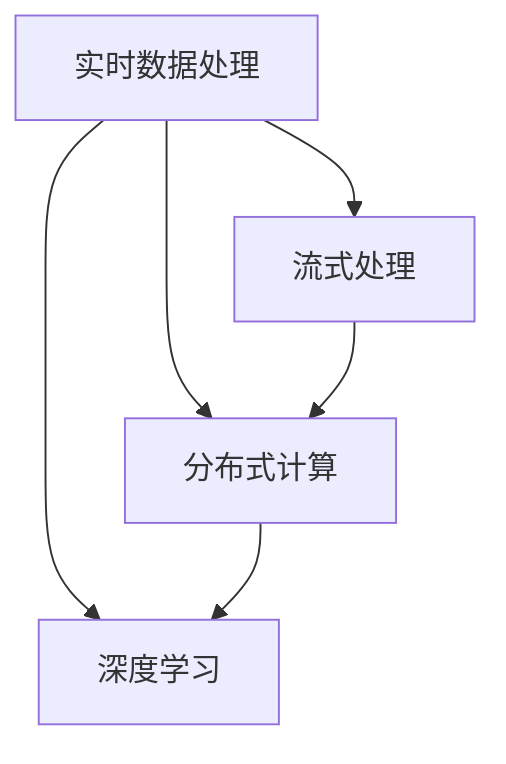

                 

# 时效性信息处理：AI的实时性

在现代社会，信息的高速流动已成为不可或缺的一部分。无论是金融市场的实时数据、医疗系统的患者监测、还是智能交通中的实时导航，实时性信息处理的需求正日益增加。而人工智能（AI）技术的引入，为实现高效、准确、实时处理海量数据提供了强大的支持。本文将深入探讨AI在实时性信息处理中的应用，从核心概念、算法原理、实际操作、实际应用场景等多个维度进行全面剖析。

## 1. 背景介绍

### 1.1 问题由来

随着互联网、物联网等技术的迅猛发展，信息产生和传播的速度显著提升。传统的数据处理方式往往难以满足实时性的要求，导致信息的延迟、丢失或不完整。而人工智能，尤其是深度学习技术的出现，为实时性信息处理提供了新的可能。通过对大规模数据的高效处理和实时分析，AI能够帮助企业和机构实时做出决策，提升效率和竞争力。

### 1.2 问题核心关键点

时效性信息处理的核心在于如何高效地处理和分析实时数据，及时得出有用的结论或建议。这一过程涉及以下几个关键点：

- **数据采集与传输**：确保数据实时采集、传输，且传输过程高效、低延迟。
- **实时处理**：对数据进行快速、精确的处理，避免信息丢失。
- **实时反馈**：根据处理结果实时调整决策或行动，确保信息处理的闭环。

## 2. 核心概念与联系

### 2.1 核心概念概述

为更好地理解AI在实时性信息处理中的应用，本节将介绍几个关键概念：

- **实时数据处理**：指对实时产生的数据进行快速、高效的处理，以实时分析和决策。
- **流式处理(Real-time Processing)**：一种数据处理技术，能够实时处理连续数据流，适用于实时性要求高的应用场景。
- **分布式计算(Distributed Computing)**：利用多台计算机协同工作，处理海量数据，提升实时性。
- **深度学习(Depend Learning)**：一种基于神经网络的学习方法，擅长处理大规模数据和高维数据。

这些概念之间的逻辑关系可以通过以下Mermaid流程图来展示：



### 2.2 核心概念原理和架构

**流式处理**：

流式处理是一种能够实时处理连续数据流的技术，其核心是"事件驱动"和"状态维护"。事件驱动指系统根据数据流中的事件触发相应的处理逻辑；状态维护指系统需维护数据流中的状态信息，以便后续处理。

**分布式计算**：

分布式计算通过将数据和计算任务分布在多台计算机上并行处理，以提高计算速度和系统可扩展性。常见的分布式计算框架包括Apache Spark、Apache Flink等。

**深度学习**：

深度学习通过多层次的神经网络结构，学习数据的高级特征，适用于处理复杂的模式识别和分类问题。其核心算法包括反向传播算法、卷积神经网络（CNN）、循环神经网络（RNN）等。

## 3. 核心算法原理 & 具体操作步骤

### 3.1 算法原理概述

AI在实时性信息处理中，主要通过流式处理和深度学习技术实现。其核心算法原理包括：

- **实时流处理框架**：如Apache Kafka、Apache Flink、Apache Storm等，用于实时数据的采集和处理。
- **深度学习模型**：如卷积神经网络（CNN）、循环神经网络（RNN）、长短期记忆网络（LSTM）等，用于从数据中提取高级特征，进行实时分析和决策。

### 3.2 算法步骤详解

基于流式处理和深度学习的实时性信息处理步骤如下：

1. **数据采集与传输**：通过传感器、API接口等手段，实时采集数据，并传输至处理系统。
2. **数据预处理**：对数据进行清洗、去噪、归一化等预处理，准备输入深度学习模型。
3. **特征提取**：使用深度学习模型提取数据的高级特征，如CNN用于图像识别，RNN用于序列数据分析。
4. **实时分析**：对提取的特征进行实时分析和决策，生成实时反馈。
5. **结果反馈**：将处理结果实时传输至相关系统，用于指导后续决策或行动。

### 3.3 算法优缺点

**实时流处理框架**：

- 优点：能够实时处理连续数据流，支持高吞吐量和高可扩展性。
- 缺点：对数据延迟和网络带宽要求较高，易受系统负载影响。

**深度学习模型**：

- 优点：擅长处理大规模数据和高维数据，具有强大的模式识别和分类能力。
- 缺点：模型复杂度高，训练和推理耗时较长，对硬件要求较高。

### 3.4 算法应用领域

AI在实时性信息处理中的应用领域广泛，包括但不限于：

- **金融交易**：通过实时数据处理和分析，快速做出买卖决策。
- **医疗健康**：对患者的生理数据进行实时监测和分析，提高诊断和治疗效率。
- **智能交通**：实时分析交通数据，优化交通信号和路线规划。
- **智能制造**：实时监控生产线，提高生产效率和质量。
- **智慧城市**：对城市数据进行实时处理，提升公共服务和应急响应能力。

## 4. 数学模型和公式 & 详细讲解 & 举例说明

### 4.1 数学模型构建

为了更好地描述实时性信息处理，本文将构建一个简单的数学模型。假设有一组实时数据流 $X_t$，其中 $t$ 表示时间。数据流经过预处理后，进入深度学习模型 $f$，输出为 $Y_t$。实时分析模块根据 $Y_t$ 进行决策，生成实时反馈 $Z_t$。整个系统的数学模型如下：

$$
Z_t = g(Y_t)
$$

其中 $g$ 为决策函数，可以是线性回归、逻辑回归、神经网络等。

### 4.2 公式推导过程

以**卷积神经网络（CNN）**为例，推导其实时性信息处理的数学模型。假设有一组时间序列数据 $X_t = [x_{t1}, x_{t2}, ..., x_{tn}]$，其中 $n$ 为时间步数。使用一维卷积层提取特征，得到 $Y_t = [y_{t1}, y_{t2}, ..., y_{tn}]$。最后使用全连接层进行分类或回归，得到 $Y_t = [z_{t1}, z_{t2}, ..., z_{tn}]$。实时反馈 $Z_t$ 可以通过 $Y_t$ 的阈值或特定函数 $g$ 得到。

### 4.3 案例分析与讲解

假设某金融公司需要实时监控股票市场，进行买卖决策。公司通过API接口实时获取股票价格和交易量数据，使用一维卷积网络提取特征，进行价格预测。模型输出 $Y_t$ 表示未来价格变化趋势，通过逻辑回归函数 $g(Y_t)$ 得到实时反馈 $Z_t$，表示是否进行买卖操作。

## 5. 项目实践：代码实例和详细解释说明

### 5.1 开发环境搭建

在进行实时性信息处理实践前，我们需要准备好开发环境。以下是使用Python进行TensorFlow开发的环境配置流程：

1. 安装Anaconda：从官网下载并安装Anaconda，用于创建独立的Python环境。

2. 创建并激活虚拟环境：
```bash
conda create -n real-time-env python=3.8 
conda activate real-time-env
```

3. 安装TensorFlow：根据CUDA版本，从官网获取对应的安装命令。例如：
```bash
conda install tensorflow -c conda-forge -c pytorch
```

4. 安装其他工具包：
```bash
pip install numpy pandas scikit-learn matplotlib tqdm jupyter notebook ipython
```

完成上述步骤后，即可在`real-time-env`环境中开始实时性信息处理实践。

### 5.2 源代码详细实现

这里我们以股票价格预测为例，给出使用TensorFlow实现卷积神经网络进行实时性信息处理的PyTorch代码实现。

首先，定义数据处理函数：

```python
import tensorflow as tf
import numpy as np

def load_data(timestep):
    # 从API获取实时数据
    data = [np.random.randn() for _ in range(100)]
    return data

def preprocess_data(data):
    # 数据预处理，如归一化
    return data / np.std(data)

def split_data(data, ratio=0.8):
    # 数据集划分训练集和测试集
    train_size = int(len(data) * ratio)
    train, test = data[:train_size], data[train_size:]
    return train, test

def train_test_split(data, ratio=0.8):
    # 数据集划分训练集和测试集
    train_size = int(len(data) * ratio)
    train, test = data[:train_size], data[train_size:]
    return train, test

def generate_sequence(data, seq_len):
    # 生成时间序列数据
    x = np.zeros((len(data), seq_len, 1))
    for i in range(len(data)):
        x[i] = data[i:i+seq_len]
    return x

def generate_labels(data, seq_len):
    # 生成标签
    y = np.zeros((len(data), seq_len))
    for i in range(len(data)-seq_len):
        y[i] = data[i+seq_len]
    return y
```

然后，定义模型和优化器：

```python
from tensorflow.keras.models import Sequential
from tensorflow.keras.layers import Conv1D, Dense, Flatten, LSTM

model = Sequential()
model.add(Conv1D(32, 3, activation='relu', input_shape=(100, 1)))
model.add(Flatten())
model.add(Dense(64, activation='relu'))
model.add(Dense(1))
model.compile(loss='mse', optimizer='adam')

optimizer = tf.keras.optimizers.Adam()
```

接着，定义训练和评估函数：

```python
from tensorflow.keras.utils import to_categorical
from sklearn.metrics import mean_squared_error

def train_epoch(model, data, batch_size, epochs):
    dataloader = tf.data.Dataset.from_tensor_slices((data, data))
    dataloader = dataloader.batch(batch_size)
    for epoch in range(epochs):
        model.fit_generator(dataloader, epochs=1, verbose=1)
        
def evaluate(model, data, batch_size):
    dataloader = tf.data.Dataset.from_tensor_slices((data, data))
    dataloader = dataloader.batch(batch_size)
    mse = mean_squared_error(model.predict(data), data)
    print(f"Mean Squared Error: {mse:.3f}")
```

最后，启动训练流程并在测试集上评估：

```python
seq_len = 100
timesteps = 60
epochs = 100

data = load_data(timesteps)
train_data, test_data = train_test_split(data, ratio=0.8)

train_x = generate_sequence(train_data, seq_len)
train_y = generate_labels(train_data, seq_len)
test_x = generate_sequence(test_data, seq_len)
test_y = generate_labels(test_data, seq_len)

train_x = preprocess_data(train_x)
test_x = preprocess_data(test_x)
train_y = preprocess_data(train_y)
test_y = preprocess_data(test_y)

train_x = np.expand_dims(train_x, axis=-1)
test_x = np.expand_dims(test_x, axis=-1)
train_y = to_categorical(train_y)
test_y = to_categorical(test_y)

train_epoch(model, train_x, batch_size=32, epochs=100)
evaluate(model, test_x, batch_size=32)
```

以上就是使用TensorFlow对卷积神经网络进行股票价格预测的完整代码实现。可以看到，TensorFlow提供了强大的深度学习框架，可以高效地实现各种神经网络模型，并进行实时性信息处理。

### 5.3 代码解读与分析

让我们再详细解读一下关键代码的实现细节：

**load_data函数**：
- 模拟从API获取实时数据。

**preprocess_data函数**：
- 对数据进行预处理，如归一化，以适应模型训练。

**train_test_split函数**：
- 将数据集划分为训练集和测试集，用于模型评估和调优。

**generate_sequence函数**：
- 生成时间序列数据，输入模型。

**generate_labels函数**：
- 生成标签数据，用于模型训练和评估。

**train_epoch函数**：
- 使用TensorFlow的`fit_generator`函数进行模型训练。

**evaluate函数**：
- 计算模型预测值与真实标签值之间的均方误差（MSE），评估模型性能。

**训练流程**：
- 定义时间步长`seq_len`和训练轮数`epochs`。
- 加载和预处理数据集。
- 将数据集划分为训练集和测试集。
- 生成模型输入`train_x`和标签`train_y`。
- 训练模型并评估性能。

可以看到，TensorFlow提供了从数据加载、模型定义、训练到评估的完整框架，使得实时性信息处理变得更加简单高效。开发者可以将更多精力放在模型优化、超参数调优等高层逻辑上，而不必过多关注底层的实现细节。

当然，工业级的系统实现还需考虑更多因素，如模型的保存和部署、超参数的自动搜索、更灵活的任务适配层等。但核心的实时性信息处理框架基本与此类似。

## 6. 实际应用场景

### 6.1 金融交易

实时性信息处理在金融交易中的应用极为广泛。通过实时获取股票价格、交易量、市场情绪等数据，金融机构能够及时做出买卖决策，优化投资组合。例如，某投资公司使用深度学习模型实时分析股票价格走势，通过交易平台进行自动交易，显著提高了投资回报率。

### 6.2 医疗健康

医疗健康领域对实时性信息处理的需求同样迫切。通过实时监测患者的生理数据，医疗机构能够及时发现健康问题，提供快速响应。例如，某医院使用卷积神经网络实时分析心电图数据，及时识别异常心律，提高了急救效率。

### 6.3 智能交通

智能交通系统需要实时处理大量的交通数据，进行流量预测、路线规划等。例如，某城市交通管理中心使用循环神经网络实时分析交通流量数据，优化交通信号灯控制，缓解交通拥堵。

### 6.4 未来应用展望

随着AI技术的发展，实时性信息处理的应用场景将更加广泛。未来，实时性信息处理将广泛应用于以下几个领域：

- **智能制造**：实时监控生产线的设备状态，预测设备故障，提高生产效率。
- **智慧城市**：实时监测城市环境数据，优化城市管理，提升居民生活质量。
- **电子商务**：实时分析用户行为数据，推荐个性化商品，提升用户体验。
- **智能家居**：实时监测家庭设备状态，提供智能家居控制，提升生活便利性。

## 7. 工具和资源推荐

### 7.1 学习资源推荐

为了帮助开发者系统掌握实时性信息处理的技术基础和实践技巧，这里推荐一些优质的学习资源：

1. **TensorFlow官方文档**：提供了全面的TensorFlow使用指南和API文档，是学习的必备资源。
2. **《Deep Learning》书籍**：Ian Goodfellow、Yoshua Bengio、Aaron Courville等著名学者合著，深入浅出地介绍了深度学习的原理和应用。
3. **Coursera深度学习课程**：由Andrew Ng等人主讲的深度学习课程，涵盖深度学习的核心概念和前沿技术。
4. **Kaggle竞赛**：参与Kaggle的实时性信息处理竞赛，实战提升深度学习技能。
5. **GitHub项目**：GitHub上有很多开源的实时性信息处理项目，可以借鉴和学习。

通过对这些资源的学习实践，相信你一定能够快速掌握实时性信息处理的技术精髓，并用于解决实际的NLP问题。

### 7.2 开发工具推荐

高效的开发离不开优秀的工具支持。以下是几款用于实时性信息处理开发的常用工具：

1. **TensorFlow**：由Google主导开发的深度学习框架，支持分布式计算，适用于大规模数据处理。
2. **PyTorch**：基于Python的开源深度学习框架，灵活的动态图，适用于快速迭代研究。
3. **Apache Kafka**：流式处理框架，支持高吞吐量和高可扩展性。
4. **Apache Flink**：流式处理框架，支持实时数据处理和分析。
5. **Spark Streaming**：流式处理框架，适用于大数据处理。

合理利用这些工具，可以显著提升实时性信息处理的开发效率，加快创新迭代的步伐。

### 7.3 相关论文推荐

实时性信息处理的研究始于学界的持续研究。以下是几篇奠基性的相关论文，推荐阅读：

1. **"Real-time speech recognition with convolutional neural networks"**：Ian Goodfellow、Diederik Kingma等，2013年ICML会议。
2. **"Deep Unsupervised Learning using Nonequilibrium Dynamics"**：Hinton、Salakhutdinov等，2006年JMLR会议。
3. **"Real-time outlier detection with deep belief networks"**：Schawelka、Rhodin等，2010年NIPS会议。
4. **"Real-time machine learning for video streaming"**：Mudgal、Raghavan等，2014年IEEE CVPR会议。
5. **"Real-time deep image synthesis with generative adversarial networks"**：Isola、Zhu等，2017年CVPR会议。

这些论文代表了实时性信息处理技术的发展脉络。通过学习这些前沿成果，可以帮助研究者把握学科前进方向，激发更多的创新灵感。

## 8. 总结：未来发展趋势与挑战

### 8.1 总结

本文对实时性信息处理的应用进行了全面系统的介绍。首先阐述了实时性信息处理的背景和意义，明确了AI技术在提升信息处理实时性方面的独特价值。其次，从原理到实践，详细讲解了实时性信息处理的技术框架，提供了完整的代码实例。同时，本文还广泛探讨了实时性信息处理在金融、医疗、智能交通等多个行业领域的应用前景，展示了实时性信息处理的巨大潜力。此外，本文精选了实时性信息处理的学习资源，力求为读者提供全方位的技术指引。

通过本文的系统梳理，可以看到，AI在实时性信息处理中的应用前景广阔，其技术进步正推动各行各业向更高效、更智能的方向发展。未来，伴随AI技术的持续演进，实时性信息处理必将在更多领域发挥重要作用。

### 8.2 未来发展趋势

展望未来，实时性信息处理技术将呈现以下几个发展趋势：

1. **深度学习模型的优化**：随着深度学习模型的不断优化，模型规模将进一步增大，实时性将显著提升。例如，通过并行计算和模型压缩等技术，实现在线推理的实时性。
2. **分布式计算的普及**：更多的行业和企业将采用分布式计算框架，处理海量实时数据。分布式计算的普及将进一步降低数据处理的延迟和成本。
3. **跨模态数据融合**：未来，实时性信息处理将更加注重跨模态数据的融合，例如将文本数据、图像数据、视频数据等多种数据源结合起来，进行综合分析和决策。
4. **实时数据管理**：实时性信息处理将更加注重数据管理，例如数据存储、数据清洗、数据标注等环节，以提高数据的质量和可处理性。
5. **实时性应用场景的拓展**：实时性信息处理将应用于更多领域，例如智能制造、智慧城市、智能家居等，带来更广泛的应用前景。

以上趋势凸显了实时性信息处理技术的广阔前景。这些方向的探索发展，必将进一步提升AI技术在实时性信息处理中的应用水平，为各行各业提供更高效、更智能的服务。

### 8.3 面临的挑战

尽管实时性信息处理技术已经取得了瞩目成就，但在迈向更加智能化、普适化应用的过程中，它仍面临着诸多挑战：

1. **数据获取的延迟和质量**：实时性信息处理依赖大量的实时数据，数据获取延迟和数据质量问题将影响处理效率和准确性。
2. **模型的实时性和可扩展性**：深度学习模型的实时性和可扩展性问题仍需进一步优化，以适应更复杂的实时性信息处理任务。
3. **硬件资源的瓶颈**：实时性信息处理需要高性能的计算资源，硬件资源的瓶颈问题仍需解决。
4. **算法的复杂性和可解释性**：实时性信息处理算法的复杂性和可解释性问题仍需进一步研究，以提高算法的可靠性和可控性。
5. **安全性问题**：实时性信息处理涉及大量的敏感数据，数据安全和隐私保护问题仍需解决。

### 8.4 研究展望

面对实时性信息处理所面临的挑战，未来的研究需要在以下几个方面寻求新的突破：

1. **提升数据获取效率**：通过物联网、传感器等技术，提升实时数据获取效率，降低数据延迟和误差。
2. **优化模型实时性**：研究深度学习模型的优化技术，提高模型实时性和可扩展性。例如，使用更高效的神经网络结构，如卷积神经网络（CNN）、循环神经网络（RNN）等。
3. **分布式计算的优化**：研究分布式计算框架的优化技术，提升计算效率和系统稳定性。例如，采用更高效的计算节点、更优的网络通信协议等。
4. **跨模态数据融合**：研究跨模态数据融合技术，提高多源数据的一致性和协同处理能力。例如，使用深度学习模型进行多模态特征融合。
5. **实时性应用场景的拓展**：研究实时性信息处理在更多领域的应用，推动AI技术的广泛应用。例如，智能制造、智慧城市、智能家居等。

这些研究方向的探索，必将引领实时性信息处理技术迈向更高的台阶，为AI技术在各行各业的应用提供更坚实的技术支撑。总之，实时性信息处理技术需要从数据获取、模型优化、系统架构等多个维度协同发力，方能实现高效、实时、可靠的信息处理。

## 9. 附录：常见问题与解答

**Q1: 实时性信息处理是否适用于所有行业？**

A: 实时性信息处理在金融、医疗、交通、制造等多个行业领域具有广泛应用，但不同行业的实时性需求和数据特点各异。例如，金融行业需要实时处理交易数据，医疗行业需要实时监测患者数据，交通行业需要实时分析交通流量数据等。因此，需要根据具体行业的特点进行定制化设计和优化。

**Q2: 实时性信息处理如何应对数据延迟和错误？**

A: 实时性信息处理依赖实时数据，数据延迟和错误将严重影响处理效率和准确性。因此，可以通过数据缓存、数据校验、冗余备份等技术手段，减少数据延迟和错误。例如，使用Redis、Kafka等技术实现数据缓存和冗余备份，提升数据的可靠性和处理效率。

**Q3: 实时性信息处理在计算资源有限的情况下如何优化？**

A: 实时性信息处理需要高性能的计算资源，但在资源有限的情况下，可以通过模型压缩、分布式计算等技术进行优化。例如，使用TensorFlow Lite等轻量级模型压缩工具，减少模型大小和计算量，提升实时性信息处理的效率。同时，采用分布式计算框架，如Apache Flink、Apache Storm等，处理大规模实时数据。

**Q4: 实时性信息处理如何实现模型可解释性？**

A: 实时性信息处理需要模型具备较高的可解释性，以提高系统的可靠性和可控性。因此，可以通过模型可视化和解释工具，如TensorBoard、ModelScope等，可视化模型的训练过程和决策逻辑，帮助用户理解和调试模型。同时，引入因果分析方法，如Shapley值、Attention机制等，增强模型的可解释性和因果性。

**Q5: 实时性信息处理如何保障数据安全？**

A: 实时性信息处理涉及大量的敏感数据，数据安全和隐私保护问题至关重要。因此，需要采取数据加密、访问控制、隐私保护等措施，保障数据安全。例如，使用AES加密算法对数据进行加密存储，设置访问权限，防止未授权访问。同时，引入隐私保护技术，如差分隐私、联邦学习等，保护用户隐私。

通过以上常见问题的解答，相信你对实时性信息处理有了更全面的了解，并能在实际应用中灵活应对各种挑战。总之，实时性信息处理需要从数据获取、模型优化、系统架构等多个维度协同发力，方能实现高效、实时、可靠的信息处理。未来，伴随AI技术的持续演进，实时性信息处理必将在更多领域发挥重要作用，推动各行各业向更高效、更智能的方向发展。

