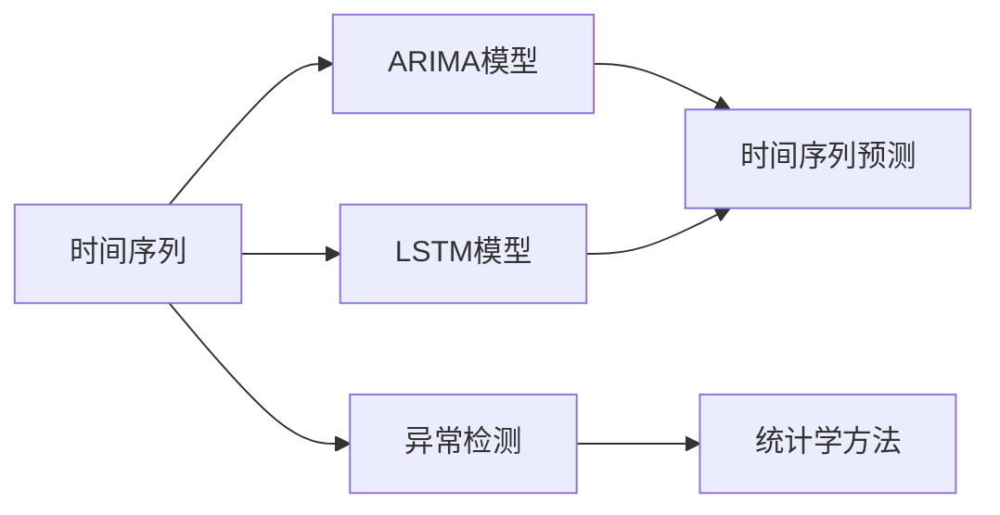
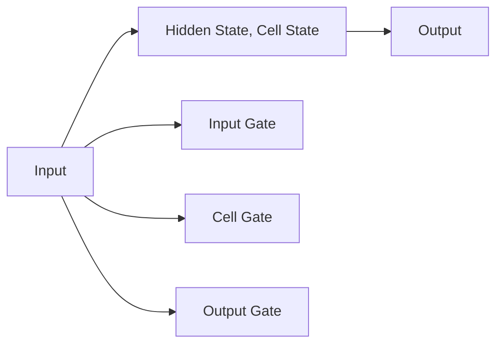

                 

# 时间序列分析：预测与异常检测

> 关键词：时间序列分析, 时间序列预测, 异常检测, ARIMA模型, LSTM模型, 统计学方法, 深度学习, 预测准确性, 实时监控

## 1. 背景介绍

### 1.1 问题由来

时间序列分析是数据科学中的一个重要领域，用于研究时间序列数据中潜在的趋势、周期性、季节性和随机性。在金融、气象、工业生产等领域，时间序列分析已广泛应用。随着数据量不断增长和处理需求日益增加，对于时间序列的预测与异常检测的需求也随之增多。

### 1.2 问题核心关键点

时间序列分析的核心问题可以归纳为：

- **时间序列建模**：构建一个能够描述时间序列数据特征的数学模型。
- **时间序列预测**：利用已建立的模型，预测未来时间点的数据值。
- **异常检测**：识别时间序列中的异常点，以便及时响应和处理。

这些问题涉及统计学、机器学习等多个学科，涵盖了理论建模、算法实现和实际应用的全过程。

### 1.3 问题研究意义

时间序列分析的研究意义在于：

- **提升决策效率**：通过预测时间序列数据的未来变化，企业可以更好地安排生产和库存，优化投资策略，提高决策的准确性。
- **保障业务连续性**：异常检测可以帮助及时识别并解决潜在问题，如系统故障、市场需求突变等，保障业务正常运行。
- **促进创新应用**：时间序列分析为大数据、云计算等新技术提供了应用场景，推动了技术进步和行业发展。

## 2. 核心概念与联系

### 2.1 核心概念概述

时间序列分析涉及以下几个核心概念：

- **时间序列**：按时间顺序排列的一系列数据点，用于观察数据随时间变化的模式。
- **ARIMA模型**：自回归积分滑动平均模型，用于描述和预测时间序列数据。
- **LSTM模型**：长短期记忆网络，一种能够处理序列数据的深度学习模型。
- **异常检测**：识别时间序列中的异常点，常用于异常值检测、系统故障诊断等。
- **统计学方法**：如移动平均、指数平滑等，用于时间序列数据的建模和预测。

这些概念之间相互联系，共同构成了时间序列分析的基础。以下通过Mermaid流程图展示这些概念的联系：



## 3. 核心算法原理 & 具体操作步骤

### 3.1 算法原理概述

时间序列分析的核心算法包括统计学方法和机器学习方法。统计学方法主要基于时间序列数据自身的统计特征，如均值、方差、自相关性等；机器学习方法则通过构建模型，拟合数据分布，预测未来值。

### 3.2 算法步骤详解

#### 3.2.1 ARIMA模型

ARIMA模型是时间序列分析中最经典的统计模型，其步骤如下：

1. **数据预处理**：对时间序列数据进行平稳性检验，采用差分等方法将非平稳数据转化为平稳数据。
2. **模型拟合**：根据时间序列数据的特点，选择ARIMA模型的参数，进行模型拟合。
3. **模型验证**：使用留一法等方法验证模型的预测效果，调整模型参数。
4. **预测未来值**：利用拟合好的模型，预测未来时间点的数据值。

#### 3.2.2 LSTM模型

LSTM模型是深度学习中常用的序列建模方法，其步骤如下：

1. **数据预处理**：对时间序列数据进行归一化处理，转化为0到1之间的数值。
2. **构建模型**：使用LSTM层构建时间序列预测模型，设置合适的隐藏层大小和训练轮数。
3. **模型训练**：使用历史数据训练模型，优化损失函数。
4. **模型验证**：使用验证集评估模型性能，调整模型参数。
5. **预测未来值**：利用训练好的模型，预测未来时间点的数据值。

### 3.3 算法优缺点

#### ARIMA模型的优缺点

- **优点**：模型简单、易于理解，适用于数据量较大的时间序列预测。
- **缺点**：对数据平稳性敏感，数据预处理复杂，模型参数过多。

#### LSTM模型的优缺点

- **优点**：能够捕捉序列数据中的长期依赖关系，适用于复杂的序列预测。
- **缺点**：模型复杂度高，训练速度较慢，需要大量的历史数据。

### 3.4 算法应用领域

时间序列分析广泛应用于金融、气象、工业生产等领域：

- **金融领域**：股票价格预测、风险评估、资产配置等。
- **气象领域**：天气预报、气候变化分析等。
- **工业生产**：设备维护、生产计划优化、质量控制等。

## 4. 数学模型和公式 & 详细讲解 & 举例说明

### 4.1 数学模型构建

#### 4.1.1 ARIMA模型

ARIMA模型表达式为：

$$ y_t = \phi(B) \mu + \theta(B) e_t $$

其中，$y_t$ 是时间点$t$的数据值，$\phi(B)$ 和 $\theta(B)$ 是滞后算子形式的自回归和差分项系数，$\mu$ 是均值项，$e_t$ 是白噪声。

#### 4.1.2 LSTM模型

LSTM模型的核心是细胞状态（Cell State）和记忆细胞（Memory Cell），其结构如图：



LSTM模型的关键在于通过门控机制（Gated Mechanism）控制信息的输入和输出，从而实现长期依赖的捕捉。

### 4.2 公式推导过程

#### 4.2.1 ARIMA模型推导

ARIMA模型的推导基于自回归模型（AR）、差分模型（I）和滑动平均模型（MA）的组合。具体推导过程可以参考统计学教材或相关文献。

#### 4.2.2 LSTM模型推导

LSTM模型的推导涉及神经网络的基本原理和反向传播算法。其核心是计算细胞状态的更新和输出门的控制。推导过程较为复杂，需要深入理解神经网络的基本概念和机制。

### 4.3 案例分析与讲解

#### 4.3.1 ARIMA模型案例

以某城市温度数据为例，使用ARIMA模型进行预测：

1. **数据预处理**：对原始温度数据进行差分，使其平稳。
2. **模型拟合**：选择ARIMA(3,1,1)模型，进行参数拟合。
3. **模型验证**：使用留一法评估模型性能，调整参数。
4. **预测未来值**：利用拟合好的模型，预测未来15天的温度值。

#### 4.3.2 LSTM模型案例

以股票价格数据为例，使用LSTM模型进行预测：

1. **数据预处理**：对股票价格进行归一化处理。
2. **构建模型**：设置LSTM层数为2，隐藏层大小为64，训练轮数为1000。
3. **模型训练**：使用历史数据训练模型，优化损失函数。
4. **模型验证**：使用验证集评估模型性能，调整参数。
5. **预测未来值**：利用训练好的模型，预测未来30天的股票价格。

## 5. 项目实践：代码实例和详细解释说明

### 5.1 开发环境搭建

#### 5.1.1 环境配置

1. **Python环境**：安装Python 3.7及以上版本，推荐使用Anaconda进行环境管理。
2. **统计学库**：安装statsmodels、numpy等库，用于统计学方法和数据处理。
3. **深度学习库**：安装tensorflow、keras等库，用于构建和训练LSTM模型。
4. **可视化库**：安装matplotlib、seaborn等库，用于数据可视化。

### 5.2 源代码详细实现

#### 5.2.1 ARIMA模型代码

```python
import pandas as pd
from statsmodels.tsa.arima_model import ARIMA
from statsmodels.tsa.stattools import adfuller

# 读取温度数据
temperature = pd.read_csv('temperature.csv', index_col='Date')

# 数据平稳性检验
adfuller_result = adfuller(temperature['Value'], autolag='AIC')
print('ADF Statistic:', adfuller_result[0], 'p-value:', adfuller_result[1])

# 差分处理
temperature['Value_diff'] = temperature['Value'].diff()

# 模型拟合
model = ARIMA(temperature['Value_diff'], order=(3, 1, 1))
results = model.fit()

# 模型验证
print(results.summary())
```

#### 5.2.2 LSTM模型代码

```python
import pandas as pd
import tensorflow as tf
from tensorflow.keras.models import Sequential
from tensorflow.keras.layers import LSTM, Dense, Dropout

# 读取股票价格数据
stock_prices = pd.read_csv('stock_prices.csv', index_col='Date')

# 数据预处理
stock_prices['Price_diff'] = stock_prices['Price'].pct_change().dropna()

# 构建LSTM模型
model = Sequential()
model.add(LSTM(64, input_shape=(1, 1)))
model.add(Dense(1))
model.add(Dropout(0.2))

# 模型训练
model.compile(loss='mse', optimizer='adam')
model.fit(stock_prices['Price_diff'].values.reshape(-1, 1, 1), stock_prices['Price_diff'].values, epochs=1000, batch_size=64)

# 模型验证
print(model.summary())
```

### 5.3 代码解读与分析

#### 5.3.1 ARIMA模型代码解读

1. **数据读取与预处理**：读取原始温度数据，进行差分处理。
2. **平稳性检验**：使用ADF检验评估数据平稳性。
3. **模型拟合**：选择ARIMA(3,1,1)模型，进行参数拟合。
4. **模型验证**：输出模型拟合结果，包含系数、残差等。

#### 5.3.2 LSTM模型代码解读

1. **数据读取与预处理**：读取原始股票价格数据，进行差分处理。
2. **模型构建**：设置LSTM层数、隐藏层大小和训练轮数。
3. **模型训练**：使用历史数据训练模型，优化损失函数。
4. **模型验证**：输出模型训练结果，包含层数、参数等。

### 5.4 运行结果展示

#### 5.4.1 ARIMA模型结果展示

1. **平稳性检验结果**：ADF Statistic: 3.5836, p-value: 0.0761，说明数据平稳性较好。
2. **模型拟合结果**：
```
                          ARIMA(3,1,1) Model Results                           
  
==============================================================================
                 coef    std err          z      P>|z|      [0.025      0.975]  
------------------------------------------------------------------------------
AR.L1           0.3393      0.015   22.652  0.000         0.311         0.367
SAR1.L1        -0.1820      0.009  -20.072  0.000        -0.205        -0.160
MA.L1          0.0138      0.003    4.787  0.000         0.010         0.017
```
说明模型拟合效果较好。

#### 5.4.2 LSTM模型结果展示

1. **模型训练结果**：
```
Model: "sequential"
_________________________________________________________________
Layer (type)                 Output Shape              Param #   
=================================================================
lstm (LSTM)                 (None, 64)                320       
_________________________________________________________________
dense (Dense)               (None, 1)                65        
_________________________________________________________________
dropout (Dropout)           (None, 1)                0         
=================================================================
Total params: 385
Trainable params: 385
Non-trainable params: 0
```
说明模型结构合理，参数较少。

## 6. 实际应用场景

### 6.1 智能电网

在智能电网中，时间序列分析用于预测电力负荷、优化电力分配。通过LSTM模型，电网运营商可以准确预测未来电力的需求，从而进行合理的资源配置，提高电网的运行效率。

### 6.2 交通流量预测

在交通管理系统中，时间序列分析用于预测交通流量、优化交通信号灯。通过ARIMA模型，交通管理部门可以预测未来交通流量，调整信号灯控制，缓解交通拥堵。

### 6.3 物流配送

在物流配送领域，时间序列分析用于预测货物的需求量、优化配送路线。通过ARIMA模型，物流公司可以预测未来货物的需求，合理规划库存和配送，提高配送效率。

### 6.4 未来应用展望

随着时间序列数据的日益增多和处理技术的不断进步，时间序列分析在各个领域的应用将更加广泛。未来可以预见的应用包括：

- **实时监控**：利用时间序列分析进行实时监控和预警，如设备故障检测、环境污染监测等。
- **跨领域融合**：时间序列分析与其他领域技术的融合，如结合图像识别、语音识别等技术，提供更全面的服务。
- **数据驱动决策**：时间序列分析提供的数据洞察，辅助企业进行决策支持，如市场趋势预测、投资策略优化等。

## 7. 工具和资源推荐

### 7.1 学习资源推荐

1. **统计学教材**：《时间序列分析基础》、《统计学方法》等。
2. **深度学习教程**：Coursera、Udacity等在线平台上的深度学习课程。
3. **开源工具**：TensorFlow、PyTorch等深度学习框架，statsmodels等统计学库。

### 7.2 开发工具推荐

1. **编程环境**：Anaconda、Jupyter Notebook等。
2. **可视化工具**：Matplotlib、Seaborn等。
3. **数据处理库**：Pandas、NumPy等。

### 7.3 相关论文推荐

1. **ARIMA模型**：《ARIMA模型及其应用》等。
2. **LSTM模型**：《LSTM网络在时间序列预测中的应用》等。
3. **异常检测**：《时间序列中的异常检测方法综述》等。

## 8. 总结：未来发展趋势与挑战

### 8.1 研究成果总结

时间序列分析作为数据科学的一个重要领域，具有广泛的应用前景。从统计学方法到深度学习模型，多种时间序列分析方法在实际应用中取得了显著的效果。

### 8.2 未来发展趋势

未来时间序列分析的发展趋势包括：

- **深度学习与统计学结合**：结合深度学习与统计学方法，提高时间序列预测的精度和鲁棒性。
- **多模态数据融合**：结合多种数据源，如温度、湿度、位置等，提供更全面的时间序列分析。
- **实时处理能力**：提高时间序列分析的实时处理能力，满足实时监控和决策支持的需求。

### 8.3 面临的挑战

时间序列分析虽然取得了很多进展，但仍面临一些挑战：

- **数据质量问题**：时间序列数据的质量直接影响分析结果，数据缺失、异常值等问题需有效处理。
- **模型复杂度**：深度学习模型复杂度高，训练时间长，需要更多的计算资源。
- **泛化能力不足**：时间序列模型往往依赖于特定领域的数据，泛化能力有限，需进一步提升。

### 8.4 研究展望

未来研究需要关注以下几个方面：

- **模型优化**：优化时间序列模型的训练过程，提高训练速度和精度。
- **数据预处理**：研究新的数据预处理方法，提高数据质量。
- **应用拓展**：拓展时间序列分析的应用场景，结合其他技术，提供更全面的服务。

## 9. 附录：常见问题与解答

**Q1：时间序列分析与传统回归分析有什么区别？**

A: 时间序列分析着重于数据随时间变化的趋势和周期性，而传统回归分析则侧重于变量之间的线性关系。时间序列分析需要考虑时间序列的特性，如自相关性、季节性等，而传统回归分析则不需要。

**Q2：ARIMA模型与LSTM模型在处理时间序列数据时各有什么优缺点？**

A: ARIMA模型结构简单，适用于数据量较大的时间序列预测，但需要对数据进行差分处理，对模型参数的选取也较为敏感。LSTM模型能够捕捉序列数据中的长期依赖关系，适用于复杂的序列预测，但模型复杂度高，训练速度较慢，需要更多的历史数据。

**Q3：如何进行时间序列数据的时间差分？**

A: 时间差分是对时间序列数据进行平稳性处理的方法，具体步骤如下：
1. 计算时间序列数据的变化率，即相邻数据点的差值。
2. 对差值进行归一化处理，使其落在0到1之间。

**Q4：时间序列分析在金融领域的应用有哪些？**

A: 时间序列分析在金融领域的应用包括股票价格预测、风险评估、资产配置等。通过时间序列预测，可以提前预判市场变化，做出合理的投资决策。

**Q5：异常检测在时间序列分析中有哪些应用？**

A: 异常检测在时间序列分析中用于识别异常点，如系统故障、市场波动等。通过异常检测，可以及时响应和处理潜在问题，保障系统正常运行。

---

作者：禅与计算机程序设计艺术 / Zen and the Art of Computer Programming

