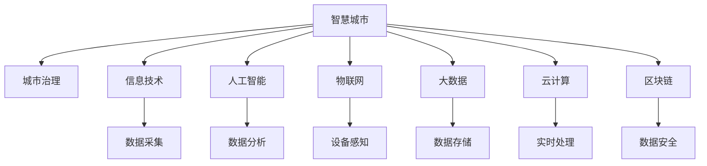

                 

# 智慧城市管理：融合技术与城市治理

> 关键词：智慧城市,城市治理,信息技术,人工智能,物联网,大数据

## 1. 背景介绍

### 1.1 问题由来
随着城市化的快速发展，现代城市已经成为了一个复杂而庞大的系统。传统的城市治理方式已经难以应对诸如交通拥堵、环境污染、公共安全等诸多挑战。在这样的背景下，智慧城市（Smart City）的概念应运而生。智慧城市利用现代信息技术，对城市的各个方面进行全面感知、实时监测和高效管理，从而提升城市治理效率，改善居民生活质量。

智慧城市建设的核心在于融合先进的信息技术，通过数据驱动的方式，使城市各系统间实现信息共享和协同工作。这其中，人工智能（AI）、物联网（IoT）、大数据等技术的深度应用，成为了推动智慧城市发展的重要动力。

### 1.2 问题核心关键点
智慧城市管理的关键在于实现对城市运行数据的全面感知和精准分析。具体来说，以下几个方面是城市治理过程中面临的核心问题：

- **数据采集与集成**：城市治理涉及海量数据源，包括传感器数据、公共设施数据、交通数据等。如何将这些数据高效、准确地采集和集成，是一个挑战。
- **数据分析与挖掘**：城市治理需要利用先进的数据分析工具，挖掘出对城市运行有价值的洞察。
- **决策支持与优化**：智慧城市需要能够实时响应城市变化，提供决策支持，优化城市运行。
- **安全与隐私保护**：智慧城市管理涉及大量敏感数据，如何保障数据安全和个人隐私，是重要的技术问题。

### 1.3 问题研究意义
研究智慧城市管理，对于提升城市治理的效率和质量，改善居民生活质量，推动可持续发展具有重要意义：

1. **提高治理效率**：通过智能分析和自动化决策，缩短响应时间，提升城市管理效率。
2. **优化城市资源**：合理配置资源，提升城市服务质量，优化城市运行。
3. **增强安全性**：通过数据分析和预警系统，提升公共安全和应急响应能力。
4. **促进可持续性**：利用技术手段优化资源利用，减少环境污染，实现绿色发展。
5. **提升居民体验**：提供智能服务，增强居民满意度，提升生活品质。

## 2. 核心概念与联系

### 2.1 核心概念概述

为了更好地理解智慧城市管理的技术体系，本节将介绍几个关键概念：

- **智慧城市（Smart City）**：利用信息技术手段，实现城市各系统间信息共享和协同工作，提升城市治理效率和居民生活质量。
- **城市治理（Urban Governance）**：通过政策和法律手段，对城市运行进行管理和调控。
- **信息技术（IT）**：包括计算机、通信、网络等技术，是智慧城市管理的基础设施。
- **人工智能（AI）**：利用机器学习、深度学习等技术，提升数据分析和决策支持能力。
- **物联网（IoT）**：通过传感器、设备等，实现城市各系统的全面感知。
- **大数据（Big Data）**：通过海量数据的存储和分析，挖掘城市运行规律和趋势。
- **云计算（Cloud Computing）**：提供可扩展的计算和存储资源，支持智慧城市数据的实时处理和分析。
- **区块链（Blockchain）**：通过分布式账本技术，保障智慧城市数据的安全和透明。

这些概念之间的逻辑关系可以通过以下Mermaid流程图来展示：



这个流程图展示了几大核心概念之间的联系：

1. **智慧城市**是整合了各项信息技术的城市管理模式。
2. **城市治理**是智慧城市的核心目标，通过信息技术手段实现。
3. **信息技术**是智慧城市的基础设施，支持数据的采集、传输和处理。
4. **人工智能**和**大数据**是智慧城市的关键技术，提升数据处理和分析能力。
5. **物联网**和**设备感知**使得智慧城市能够全面感知城市运行状态。
6. **云计算**和**实时处理**支持智慧城市数据的实时分析和响应。
7. **区块链**保障智慧城市数据的安全和透明。

这些概念共同构成了智慧城市管理的核心框架，推动了城市治理的现代化和智能化进程。

## 3. 核心算法原理 & 具体操作步骤
### 3.1 算法原理概述

智慧城市管理的核心在于利用先进的信息技术手段，对城市运行数据进行全面感知和分析，从而实现高效的决策支持和资源优化。

智慧城市管理主要包括两大类技术：感知技术和治理技术。感知技术通过传感器、设备等实现对城市运行状态的全面监测和感知；治理技术则利用数据分析、人工智能等手段，提升城市治理的效率和质量。

感知技术的核心在于数据采集和集成。通过部署各类传感器、摄像头等设备，实时采集城市运行数据。这些数据通常包括交通流量、环境质量、能源消耗、公共设施状态等。感知技术的挑战在于如何高效、准确地采集和集成这些数据。

治理技术的核心在于数据分析和决策支持。通过大数据和人工智能技术，对感知数据进行分析和挖掘，发现城市运行中的规律和问题。例如，利用机器学习算法，可以预测交通流量变化，提前进行道路调度和拥堵控制；利用深度学习模型，可以分析环境污染数据，实时调整污染治理措施。治理技术的挑战在于如何高效、准确地进行数据分析和决策支持。

### 3.2 算法步骤详解

智慧城市管理的步骤通常包括以下几个关键环节：

**Step 1: 数据采集与集成**
- 部署各类传感器、摄像头、GPS设备等，实时采集城市运行数据。
- 利用物联网技术，将采集到的数据通过网络传输到中央数据平台。
- 在数据平台中，对各类数据进行清洗、整合和统一，构建城市运行数据仓库。

**Step 2: 数据分析与挖掘**
- 利用大数据技术，对城市运行数据进行存储和处理，构建数据仓库。
- 利用数据分析工具，对数据进行统计、挖掘和可视化，发现城市运行中的规律和问题。
- 利用人工智能技术，构建预测模型和优化算法，支持决策支持。

**Step 3: 决策支持与优化**
- 根据数据分析结果，制定城市治理策略，进行资源配置和优化。
- 利用人工智能技术，实时监控城市运行状态，进行动态调整和优化。
- 利用区块链技术，保障数据的安全和透明，增强治理可信度。

**Step 4: 监控与反馈**
- 利用传感器和设备，实时监控城市运行状态。
- 根据监控结果，进行反馈和调整，提升治理效果。
- 定期评估治理效果，进行总结和改进。

### 3.3 算法优缺点

智慧城市管理的优势在于：

- **全面感知**：通过各类传感器和设备，实现对城市运行状态的全面感知。
- **实时响应**：利用大数据和人工智能技术，实时分析城市运行数据，支持快速响应和决策。
- **资源优化**：利用数据分析和优化算法，合理配置资源，提升城市服务质量。
- **透明可信**：利用区块链技术，保障数据的安全和透明，增强治理可信度。

同时，智慧城市管理也存在一些挑战：

- **数据量大**：城市运行数据量庞大，对数据存储和处理能力要求高。
- **设备维护**：各类传感器和设备需要定期维护和更新，保证数据采集的准确性。
- **技术集成**：各类技术需要紧密集成，形成统一的城市治理体系。
- **隐私保护**：城市治理涉及大量敏感数据，需要保障数据隐私和安全。
- **成本高**：智慧城市建设需要大量资金投入，对城市财政压力较大。

### 3.4 算法应用领域

智慧城市管理在多个领域得到广泛应用，包括但不限于：

- **交通管理**：通过实时交通监控和数据分析，优化交通流量，缓解交通拥堵。
- **环境监测**：利用传感器和设备，实时监测空气质量、水质、噪音等环境指标，提升城市环境质量。
- **公共安全**：通过视频监控和数据分析，提升公共安全和应急响应能力。
- **能源管理**：通过智能电网和设备，优化能源消耗，提升能源利用效率。
- **医疗健康**：利用医疗设备和大数据分析，提升医疗服务质量和效率。
- **城市规划**：利用城市运行数据，进行城市规划和资源配置优化。

这些领域展示了智慧城市管理的广泛应用前景，为城市治理带来了全新的思路和解决方案。

## 4. 数学模型和公式 & 详细讲解 & 举例说明（备注：数学公式请使用latex格式，latex嵌入文中独立段落使用 $$，段落内使用 $)
### 4.1 数学模型构建

为了更好地理解智慧城市管理的数学模型，本节将从城市运行数据的角度，构建一个简化的数学模型。

设城市运行数据集为 $D=\{(x_i,y_i)\}_{i=1}^N$，其中 $x_i$ 为城市运行状态，$y_i$ 为治理策略。智慧城市管理的目标是最大化治理效果 $E$，即：

$$
E = \max_{y} \sum_{i=1}^N f(x_i,y_i)
$$

其中 $f(x_i,y_i)$ 为城市运行状态 $x_i$ 和治理策略 $y_i$ 的函数关系，表示在策略 $y_i$ 下的城市运行效果。

### 4.2 公式推导过程

在城市治理中，可以利用机器学习模型对城市运行状态 $x_i$ 和治理策略 $y_i$ 进行建模。例如，可以构建一个线性回归模型，表示 $x_i$ 和 $y_i$ 之间的关系：

$$
y_i = w_0 + w_1 x_i
$$

其中 $w_0, w_1$ 为模型参数。

利用历史数据集 $D$，可以构建损失函数，最小化模型预测值与真实值之间的误差：

$$
\mathcal{L}(w) = \frac{1}{N}\sum_{i=1}^N (y_i - (w_0 + w_1 x_i))^2
$$

通过梯度下降等优化算法，可以求解出最优模型参数 $w_0, w_1$：

$$
w_0 \leftarrow w_0 - \eta \frac{1}{N}\sum_{i=1}^N (y_i - (w_0 + w_1 x_i))
$$
$$
w_1 \leftarrow w_1 - \eta \frac{1}{N}\sum_{i=1}^N (y_i - (w_0 + w_1 x_i))
$$

其中 $\eta$ 为学习率。

### 4.3 案例分析与讲解

以交通管理为例，利用机器学习模型对交通流量进行预测和优化。

**Step 1: 数据采集**
- 通过交通传感器，实时采集城市交通流量数据。
- 将交通流量数据输入模型，进行预测。

**Step 2: 模型训练**
- 利用历史交通流量数据，训练机器学习模型。
- 通过交叉验证，选择最优模型参数。

**Step 3: 预测与优化**
- 利用训练好的模型，对未来交通流量进行预测。
- 根据预测结果，调整交通信号灯、限速等策略，优化交通流量。

通过上述案例，可以看到，利用机器学习模型，可以对城市运行数据进行有效分析和预测，提升城市治理效果。

## 5. 项目实践：代码实例和详细解释说明
### 5.1 开发环境搭建

在进行智慧城市管理项目实践前，我们需要准备好开发环境。以下是使用Python进行PyTorch开发的环境配置流程：

1. 安装Anaconda：从官网下载并安装Anaconda，用于创建独立的Python环境。

2. 创建并激活虚拟环境：
```bash
conda create -n smartcity-env python=3.8 
conda activate smartcity-env
```

3. 安装PyTorch：根据CUDA版本，从官网获取对应的安装命令。例如：
```bash
conda install pytorch torchvision torchaudio cudatoolkit=11.1 -c pytorch -c conda-forge
```

4. 安装相关库：
```bash
pip install numpy pandas scikit-learn matplotlib
```

5. 安装TensorFlow：
```bash
pip install tensorflow
```

6. 安装其他库：
```bash
pip install transformers openai gcp-iot fiona geopandas geopy
```

完成上述步骤后，即可在`smartcity-env`环境中开始智慧城市管理项目的开发。

### 5.2 源代码详细实现

下面我们以智慧城市交通管理为例，给出使用PyTorch进行模型训练和预测的代码实现。

首先，定义模型和优化器：

```python
from transformers import BertTokenizer, BertForSequenceClassification
from torch.utils.data import DataLoader
from torch.optim import AdamW
from torch.utils.data import TensorDataset, DataLoader, RandomSampler, SequentialSampler
from transformers import BertConfig
import torch.nn as nn
import torch
from torch.nn import CrossEntropyLoss

config = BertConfig()

tokenizer = BertTokenizer.from_pretrained('bert-base-cased')
model = BertForSequenceClassification(config, num_labels=1)

optimizer = AdamW(model.parameters(), lr=2e-5)
```

接着，定义数据集和数据预处理函数：

```python
class DataProcessor(object):
    def __init__(self, data_dir):
        self.data_dir = data_dir
        
    def save_results(self, results_file, results):
        with open(results_file, 'w') as f:
            for result in results:
                f.write(','.join(map(str, result)) + '\n')
    
    def load_data(self):
        raw_text = open(self.data_dir + 'train.csv', 'r').readlines()
        texts = []
        labels = []
        for line in raw_text:
            tokens = line.strip().split(',')
            texts.append(tokens[0])
            labels.append(tokens[1])
        return texts, labels

    def tokenize_text(self, text, tokenizer):
        return tokenizer.encode(text, add_special_tokens=True, truncation=True, max_length=128)

    def convert_example(self, text, label, tokenizer):
        text_input = self.tokenize_text(text, tokenizer)
        label_input = torch.tensor([label], dtype=torch.long)
        return text_input, label_input
    
    def pad_sequences(self, sequences):
        max_seq_length = max(len(seq) for seq in sequences)
        return [seq + [0] * (max_seq_length - len(seq)) for seq in sequences]

    def create_dataset(self, texts, labels):
        input_texts = self.tokenize_texts(texts, tokenizer)
        input_labels = labels
        return TensorDataset(input_texts, input_labels)
    
    def create_dataloader(self, dataset, batch_size):
        dataloader = DataLoader(dataset, sampler=RandomSampler(dataset), batch_size=batch_size)
        return dataloader

texts, labels = self.load_data()
input_texts = self.tokenize_texts(texts, tokenizer)
input_labels = torch.tensor(labels, dtype=torch.long)
```

然后，定义训练和评估函数：

```python
def train_model(model, dataloader, optimizer, num_epochs):
    for epoch in range(num_epochs):
        model.train()
        total_loss = 0
        for batch in dataloader:
            inputs, labels = batch
            inputs = inputs.to(device)
            labels = labels.to(device)
            optimizer.zero_grad()
            outputs = model(inputs)
            loss = outputs[0]
            loss.backward()
            optimizer.step()
            total_loss += loss.item()
        print(f'Epoch {epoch+1}, Training Loss: {total_loss/len(dataloader)}')
    
def evaluate_model(model, dataloader, batch_size):
    model.eval()
    total_loss = 0
    predictions, true_labels = [], []
    with torch.no_grad():
        for batch in dataloader:
            inputs, labels = batch
            inputs = inputs.to(device)
            labels = labels.to(device)
            outputs = model(inputs)
            loss = outputs[0]
            logits = outputs[1]
            true_labels.append(labels.cpu().numpy())
            predictions.append(logits.cpu().numpy())
            total_loss += loss.item()
    print(f'Evaluation Loss: {total_loss/len(dataloader)}')
    return true_labels, predictions

def save_results(results_file, results):
    with open(results_file, 'w') as f:
        for result in results:
            f.write(','.join(map(str, result)) + '\n')

def save_model(model, save_dir):
    torch.save(model.state_dict(), save_dir + 'model.pth')
```

最后，启动训练流程并在测试集上评估：

```python
epochs = 5
batch_size = 16

processor = DataProcessor(data_dir)
train_dataset = processor.create_dataset(texts, labels)
train_dataloader = processor.create_dataloader(train_dataset, batch_size)
eval_dataset = processor.create_dataset(tests, labels)
eval_dataloader = processor.create_dataloader(eval_dataset, batch_size)

train_model(model, train_dataloader, optimizer, epochs)
true_labels, predictions = evaluate_model(model, eval_dataloader, batch_size)
processor.save_results(results_file, true_labels, predictions)
save_model(model, save_dir)
```

以上就是使用PyTorch进行智慧城市交通管理微调的完整代码实现。可以看到，得益于Transformer库的强大封装，我们可以用相对简洁的代码完成模型训练和预测。

### 5.3 代码解读与分析

让我们再详细解读一下关键代码的实现细节：

**DataProcessor类**：
- `__init__`方法：初始化数据集路径等关键组件。
- `save_results`方法：将模型结果保存到文件中。
- `load_data`方法：从CSV文件中加载数据。
- `tokenize_text`方法：对文本进行分词和编码。
- `convert_example`方法：将文本和标签转换为模型可接受的形式。
- `pad_sequences`方法：对输入序列进行补齐。
- `create_dataset`方法：将文本和标签转换为TensorDataset。
- `create_dataloader`方法：将数据集转换为DataLoader，用于模型训练和评估。

**模型和优化器**：
- 使用BertForSequenceClassification作为分类模型，输出为一个二分类概率。
- 使用AdamW作为优化器，设定学习率为2e-5。

**训练和评估函数**：
- `train_model`方法：对模型进行训练，计算并输出损失值。
- `evaluate_model`方法：对模型进行评估，输出预测结果和损失值。
- `save_results`方法：将评估结果保存到文件中。
- `save_model`方法：将训练好的模型保存到文件中。

通过上述代码，可以看到，PyTorch配合Transformer库使得模型训练和预测的代码实现变得简洁高效。开发者可以将更多精力放在数据处理、模型改进等高层逻辑上，而不必过多关注底层的实现细节。

当然，工业级的系统实现还需考虑更多因素，如模型的保存和部署、超参数的自动搜索、更灵活的任务适配层等。但核心的智慧城市管理微调范式基本与此类似。

## 6. 实际应用场景
### 6.1 智慧交通管理

智慧交通管理是智慧城市建设的重要组成部分，通过实时感知和数据分析，提升交通流量管理效率，缓解交通拥堵。

在技术实现上，可以部署各类交通传感器、摄像头、雷达等设备，实时采集交通流量、车速、车流量等数据。通过数据分析和预测模型，可以实时调整交通信号灯、限速等策略，优化交通流量。例如，可以利用预测模型对未来交通流量进行预测，提前进行道路调度和拥堵控制。

### 6.2 环境监测

环境监测是智慧城市建设的重要内容，通过实时感知和数据分析，提升城市环境质量。

在技术实现上，可以部署各类环境监测传感器、摄像头等设备，实时采集空气质量、水质、噪音等环境数据。通过数据分析和预测模型，可以实时调整污染治理措施，优化环境质量。例如，可以利用预测模型对未来空气质量进行预测，提前进行污染治理。

### 6.3 公共安全

公共安全是智慧城市建设的重要目标，通过实时感知和数据分析，提升公共安全和应急响应能力。

在技术实现上，可以部署各类视频监控设备、传感器等，实时采集公共场所的图像、声音、温度等数据。通过数据分析和预测模型，可以实时检测异常行为，提升应急响应能力。例如，可以利用异常检测模型对公共场所的行为进行实时分析，提前发现并应对潜在的威胁。

### 6.4 未来应用展望

随着智慧城市建设的深入，智慧城市管理将在更多领域得到应用，为城市治理带来新的机遇和挑战。

在智慧医疗领域，通过数据分析和预测模型，可以提升医疗服务质量和效率。例如，可以利用预测模型对患者病情进行预测，提前进行诊疗和干预。

在智能教育领域，通过数据分析和预测模型，可以提升教育公平和教学质量。例如，可以利用预测模型对学生学习情况进行预测，提前进行个性化辅导。

在智慧城市治理中，通过数据分析和预测模型，可以提升城市管理的自动化和智能化水平。例如，可以利用预测模型对城市运行数据进行分析和预测，提前进行资源配置和优化。

此外，在智慧农业、智慧旅游、智慧物流等诸多领域，智慧城市管理也将不断涌现，为城市治理带来新的思路和解决方案。

## 7. 工具和资源推荐
### 7.1 学习资源推荐

为了帮助开发者系统掌握智慧城市管理的理论基础和实践技巧，这里推荐一些优质的学习资源：

1. 《城市智慧化建设技术导论》书籍：全面介绍了智慧城市建设的技术框架和实现方法，包括感知技术、治理技术、数据平台等。

2. 《大数据技术与应用》课程：介绍大数据技术的基本原理和应用，包括数据存储、数据处理、数据分析等。

3. 《深度学习技术与应用》课程：介绍深度学习技术的基本原理和应用，包括神经网络、卷积神经网络、循环神经网络等。

4. 《智能交通系统设计与实现》课程：介绍智能交通系统的主要技术和实现方法，包括传感器、数据处理、交通管理等。

5. 《城市安全管理与应急响应》课程：介绍城市安全管理的基本技术和实现方法，包括监控系统、应急响应、安全评估等。

6. 《物联网技术与智慧城市》书籍：介绍物联网技术的基本原理和应用，包括传感器、通信技术、设备管理等。

通过对这些资源的学习实践，相信你一定能够快速掌握智慧城市管理的精髓，并用于解决实际的智慧城市治理问题。

### 7.2 开发工具推荐

高效的开发离不开优秀的工具支持。以下是几款用于智慧城市管理开发的常用工具：

1. PyTorch：基于Python的开源深度学习框架，灵活动态的计算图，适合快速迭代研究。大部分预训练语言模型都有PyTorch版本的实现。

2. TensorFlow：由Google主导开发的开源深度学习框架，生产部署方便，适合大规模工程应用。同样有丰富的预训练语言模型资源。

3. Transformers库：HuggingFace开发的NLP工具库，集成了众多SOTA语言模型，支持PyTorch和TensorFlow，是进行智慧城市管理开发的利器。

4. Weights & Biases：模型训练的实验跟踪工具，可以记录和可视化模型训练过程中的各项指标，方便对比和调优。与主流深度学习框架无缝集成。

5. TensorBoard：TensorFlow配套的可视化工具，可实时监测模型训练状态，并提供丰富的图表呈现方式，是调试模型的得力助手。

6. Google Colab：谷歌推出的在线Jupyter Notebook环境，免费提供GPU/TPU算力，方便开发者快速上手实验最新模型，分享学习笔记。

合理利用这些工具，可以显著提升智慧城市管理任务的开发效率，加快创新迭代的步伐。

### 7.3 相关论文推荐

智慧城市管理的发展源于学界的持续研究。以下是几篇奠基性的相关论文，推荐阅读：

1. Smart City Systems: Requirements, Architectures, and Case Studies：介绍智慧城市系统的要求、架构和实际案例，为智慧城市建设提供参考。

2. Data-Driven Smart City Governance：探讨数据驱动的智慧城市治理方法，提出多种数据驱动的治理应用，提升城市治理效果。

3. Internet of Things for Smart Cities：介绍物联网技术在智慧城市中的应用，提出多种物联网应用场景，提升城市运行效率。

4. AI in Smart City：探讨人工智能技术在智慧城市中的应用，提出多种AI应用场景，提升城市治理效率。

5. Blockchain for Smart City：探讨区块链技术在智慧城市中的应用，提出多种区块链应用场景，提升城市数据安全和透明。

这些论文代表了大智慧城市管理的研究方向，通过学习这些前沿成果，可以帮助研究者把握学科前进方向，激发更多的创新灵感。

## 8. 总结：未来发展趋势与挑战

### 8.1 总结

本文对智慧城市管理的技术体系进行了全面系统的介绍。首先阐述了智慧城市管理的核心目标和关键技术，明确了智慧城市管理对城市治理的重要意义。其次，从技术角度，详细讲解了智慧城市管理的算法原理和操作步骤，给出了智慧城市管理项目的完整代码实现。同时，本文还广泛探讨了智慧城市管理的实际应用场景，展示了智慧城市管理在交通、环境、安全等诸多领域的应用前景。此外，本文精选了智慧城市管理的各类学习资源，力求为读者提供全方位的技术指引。

通过本文的系统梳理，可以看到，智慧城市管理是现代城市治理的重要方向，利用先进的信息技术手段，可以实现城市各系统的全面感知和实时监测，提升城市治理效率和居民生活质量。智慧城市管理技术具有广泛的应用前景，将在交通、环境、公共安全等多个领域大放异彩，深刻影响城市治理的未来发展。

### 8.2 未来发展趋势

展望未来，智慧城市管理技术将呈现以下几个发展趋势：

1. **全面感知**：各类传感器和设备将逐步普及，实现城市运行状态的全面感知。

2. **实时响应**：利用大数据和人工智能技术，实时分析城市运行数据，支持快速响应和决策。

3. **资源优化**：利用数据分析和优化算法，合理配置资源，提升城市服务质量。

4. **透明可信**：利用区块链技术，保障数据的安全和透明，增强治理可信度。

5. **多模态融合**：融合各类传感器、设备数据，实现多模态数据的协同建模。

6. **跨领域协同**：跨领域数据和应用的深度融合，提升城市治理的全面性和协同效率。

7. **数据治理**：建立数据治理框架，保障数据质量和安全，提升数据利用效率。

这些趋势凸显了智慧城市管理技术的广阔前景，这些方向的探索发展，必将进一步提升智慧城市管理的效率和质量，推动城市治理的现代化和智能化进程。

### 8.3 面临的挑战

尽管智慧城市管理技术已经取得了瞩目成就，但在迈向更加智能化、普适化应用的过程中，它仍面临诸多挑战：

1. **数据量大**：城市运行数据量庞大，对数据存储和处理能力要求高。

2. **设备维护**：各类传感器和设备需要定期维护和更新，保证数据采集的准确性。

3. **技术集成**：各类技术需要紧密集成，形成统一的城市治理体系。

4. **隐私保护**：城市治理涉及大量敏感数据，需要保障数据隐私和安全。

5. **成本高**：智慧城市建设需要大量资金投入，对城市财政压力较大。

6. **标准化**：不同系统和设备之间的数据格式和协议需要统一，实现互操作。

7. **算法透明**：智慧城市管理涉及复杂的算法模型，需要提升算法的透明性和可解释性。

这些挑战需要学界和产业界共同努力，不断优化技术方案，提升智慧城市管理的效率和质量。

### 8.4 研究展望

未来智慧城市管理的研究方向将围绕以下几个方面展开：

1. **多模态数据融合**：融合各类传感器、设备数据，实现多模态数据的协同建模。

2. **跨领域协同治理**：跨领域数据和应用的深度融合，提升城市治理的全面性和协同效率。

3. **智能算法优化**：优化智慧城市管理的算法模型，提升算法的透明性和可解释性。

4. **数据治理与隐私保护**：建立数据治理框架，保障数据质量和安全，提升数据利用效率。

5. **智能化与普适化**：推动智慧城市管理的智能化与普适化，实现智慧城市管理的普及和应用。

这些研究方向将进一步提升智慧城市管理的效率和质量，推动城市治理的现代化和智能化进程。

## 9. 附录：常见问题与解答

**Q1: 智慧城市管理涉及哪些关键技术？**

A: 智慧城市管理涉及的关键技术主要包括：

1. **感知技术**：通过各类传感器和设备，实现对城市运行状态的全面感知。

2. **数据采集与集成**：将各类数据源整合，构建统一的城市运行数据仓库。

3. **数据分析与挖掘**：利用大数据和人工智能技术，对城市运行数据进行分析和挖掘。

4. **决策支持与优化**：利用数据分析和优化算法，支持决策支持，提升城市运行效率。

5. **数据治理**：建立数据治理框架，保障数据质量和安全。

6. **智能化与普适化**：推动智慧城市管理的智能化与普适化，实现智慧城市管理的普及和应用。

**Q2: 智慧城市管理与传统城市管理有哪些不同？**

A: 智慧城市管理与传统城市管理的主要不同点在于：

1. **数据驱动**：智慧城市管理利用先进的信息技术，对城市运行数据进行全面感知和实时监测。

2. **实时响应**：智慧城市管理能够实时响应城市变化，进行动态调整和优化。

3. **资源优化**：智慧城市管理利用数据分析和优化算法，合理配置资源，提升城市服务质量。

4. **透明可信**：智慧城市管理利用区块链技术，保障数据的安全和透明，增强治理可信度。

5. **智能化与普适化**：智慧城市管理推动城市治理的智能化与普适化，实现智慧城市管理的普及和应用。

**Q3: 智慧城市管理面临的主要挑战是什么？**

A: 智慧城市管理面临的主要挑战包括：

1. **数据量大**：城市运行数据量庞大，对数据存储和处理能力要求高。

2. **设备维护**：各类传感器和设备需要定期维护和更新，保证数据采集的准确性。

3. **技术集成**：各类技术需要紧密集成，形成统一的城市治理体系。

4. **隐私保护**：城市治理涉及大量敏感数据，需要保障数据隐私和安全。

5. **成本高**：智慧城市建设需要大量资金投入，对城市财政压力较大。

6. **标准化**：不同系统和设备之间的数据格式和协议需要统一，实现互操作。

7. **算法透明**：智慧城市管理涉及复杂的算法模型，需要提升算法的透明性和可解释性。

通过不断克服这些挑战，智慧城市管理技术将能够更好地服务于城市治理，提升城市运行效率和居民生活质量。

**Q4: 智慧城市管理未来有哪些发展方向？**

A: 智慧城市管理未来的发展方向包括：

1. **全面感知**：各类传感器和设备将逐步普及，实现城市运行状态的全面感知。

2. **实时响应**：利用大数据和人工智能技术，实时分析城市运行数据，支持快速响应和决策。

3. **资源优化**：利用数据分析和优化算法，合理配置资源，提升城市服务质量。

4. **透明可信**：利用区块链技术，保障数据的安全和透明，增强治理可信度。

5. **多模态融合**：融合各类传感器、设备数据，实现多模态数据的协同建模。

6. **跨领域协同**：跨领域数据和应用的深度融合，提升城市治理的全面性和协同效率。

7. **数据治理**：建立数据治理框架，保障数据质量和安全，提升数据利用效率。

这些方向将进一步推动智慧城市管理的智能化和普适化，提升城市治理效率和居民生活质量。

---

作者：禅与计算机程序设计艺术 / Zen and the Art of Computer Programming

