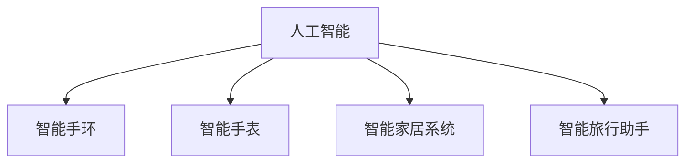

                 

# 智能个人环境适应创业：旅行中的健康舒适管理

## 1. 背景介绍

随着全球化的加速和人们出行需求的增加，越来越多的人选择旅行来探索新的文化、体验不同的生活方式。然而，在享受旅行的同时，人们也面临着健康和舒适管理的挑战。例如，如何适应不同气候、饮食、文化，如何应对时差、安全问题等，都是旅行者需要关注的重要方面。

近年来，人工智能(AI)技术在个人健康和舒适管理中的应用变得越来越普遍。例如，智能手环、智能手表可以监测健康数据，智能家居系统可以根据用户的喜好和行为自动调整环境。在旅行管理方面，AI技术也开始发挥越来越重要的作用，例如，智能旅行助手可以根据用户的行程自动推荐合适的饮食、活动、住宿等，从而提升旅行的健康和舒适性。

本文将从人工智能的角度，介绍智能个人环境适应创业的现状和前景，探讨旅行中健康舒适管理的技术实现，并提出一些未来的发展趋势和挑战。

## 2. 核心概念与联系

### 2.1 核心概念概述

为更好地理解智能个人环境适应创业在旅行中的健康舒适管理的应用，本节将介绍几个密切相关的核心概念：

- 人工智能(AI)：一种模拟人类智能行为的技术，包括机器学习、自然语言处理、计算机视觉等子领域。
- 智能手环和智能手表：可穿戴设备，通过传感器监测用户的健康数据，如心率、血压、睡眠等，提供个性化的健康管理建议。
- 智能家居系统：利用物联网技术，根据用户的偏好自动调节室内温度、照明、湿度等环境参数，提高居住舒适性。
- 智能旅行助手：基于自然语言处理和机器学习算法，能够理解和回答用户的旅行问题，并提供个性化的旅行建议，如餐饮、住宿、交通等。

这些核心概念之间的逻辑关系可以通过以下Mermaid流程图来展示：



这个流程图展示了AI技术在智能个人环境适应创业中的应用场景，从健康管理到智能家居，再到旅行管理，AI技术在其中都扮演着重要角色。

## 3. 核心算法原理 & 具体操作步骤
### 3.1 算法原理概述

智能个人环境适应创业的核心在于利用人工智能技术，通过数据分析和模型训练，为用户提供个性化的健康和舒适管理建议。其核心算法包括：

- 机器学习算法：通过学习用户的健康数据、行为习惯等，预测用户的健康风险和舒适需求。
- 自然语言处理(NLP)：理解和生成自然语言，实现与用户的交互。
- 计算机视觉：通过图像识别技术，分析环境参数，如天气、光线等，帮助用户适应环境。

### 3.2 算法步骤详解

基于AI技术的智能个人环境适应创业，一般包括以下几个关键步骤：

**Step 1: 数据收集与预处理**

- 收集用户的健康数据、行为数据、环境数据等。例如，智能手环和智能手表可以收集心率、血压、睡眠等数据，智能家居系统可以收集室内温度、湿度、光照等数据。
- 对数据进行清洗和预处理，去除噪声和异常值，确保数据的准确性和完整性。

**Step 2: 模型训练**

- 根据收集的数据，选择合适的机器学习算法进行模型训练。例如，可以使用回归算法预测健康风险，使用分类算法预测舒适需求。
- 在模型训练过程中，需要选择合适的特征，如用户的年龄、性别、运动量等，以提高模型的预测准确性。
- 在训练模型时，需要使用交叉验证等技术，避免过拟合，提高模型的泛化能力。

**Step 3: 用户交互与反馈**

- 利用自然语言处理技术，与用户进行交互，了解其健康和舒适需求。例如，智能旅行助手可以通过聊天界面，询问用户的目的地、行程安排等，了解其健康偏好和风险容忍度。
- 根据用户反馈，不断调整和优化模型，以更好地满足用户的个性化需求。

**Step 4: 应用部署**

- 将训练好的模型部署到实际应用中，例如，在智能旅行助手中，部署机器学习模型和自然语言处理模型，提供个性化的旅行建议。
- 监控模型性能，收集用户反馈，不断优化模型，提升用户体验。

### 3.3 算法优缺点

智能个人环境适应创业利用AI技术提供个性化的健康和舒适管理建议，具有以下优点：

- 高效性：通过模型训练和数据学习，能够快速提供个性化的建议。
- 精确性：利用机器学习和自然语言处理技术，可以精确预测用户的健康风险和舒适需求。
- 方便性：通过智能手环、智能手表等设备，用户可以随时随地获取健康和舒适管理建议。

同时，该方法也存在一些缺点：

- 数据隐私问题：收集用户的健康和行为数据，可能涉及隐私问题，需要采取严格的数据保护措施。
- 模型依赖性：模型的效果依赖于数据的质量和数量，如果数据质量不高，模型的预测效果可能不佳。
- 适应性不足：如果模型没有充分考虑不同用户之间的差异，可能无法提供完全个性化的建议。

### 3.4 算法应用领域

基于AI技术的智能个人环境适应创业，已经在健康管理、智能家居和旅行管理等多个领域得到应用，例如：

- 健康管理：智能手环和智能手表可以监测用户的健康数据，智能家居系统可以根据用户的行为自动调节环境参数，提升用户的健康水平。
- 智能家居：通过物联网技术，智能家居系统可以根据用户的偏好自动调节室内温度、湿度、照明等，提高居住舒适性。
- 旅行管理：智能旅行助手可以根据用户的行程自动推荐合适的饮食、活动、住宿等，从而提升旅行的健康和舒适性。

此外，AI技术在更多领域的应用也在不断扩展，如智能交通、智能安防等，为人们的生活带来更多便利。

## 4. 数学模型和公式 & 详细讲解  
### 4.1 数学模型构建

智能个人环境适应创业的数学模型构建，主要涉及以下几个方面：

- 健康风险预测模型：基于用户的健康数据和行为数据，预测用户的健康风险。例如，可以使用回归模型预测用户的患病概率。
- 舒适需求预测模型：基于环境数据和用户偏好，预测用户的舒适需求。例如，可以使用分类模型预测用户对室内温度的偏好。

### 4.2 公式推导过程

以健康风险预测模型为例，假设用户的历史健康数据为 $(x_1,x_2,...,x_n)$，其中 $x_i$ 表示第 $i$ 天的健康数据。模型的目标是预测第 $i+1$ 天的患病概率 $y$，可以表示为：

$$
y = f(x_1,x_2,...,x_n)
$$

其中 $f$ 为一个回归函数，可以使用线性回归、决策树、神经网络等算法进行建模。假设 $x_i$ 和 $y$ 之间的关系可以表示为线性函数：

$$
y = \theta_0 + \theta_1 x_1 + \theta_2 x_2 + ... + \theta_n x_n
$$

其中 $\theta_i$ 为回归系数，可以通过最小二乘法等方法求解。

### 4.3 案例分析与讲解

假设用户每天的健康数据包括心率、血压、睡眠质量等，我们可以使用多元线性回归模型预测用户的患病概率。通过收集大量的用户健康数据，并利用机器学习算法进行模型训练，可以得到回归系数 $\theta_i$，从而实现健康风险预测。

## 5. 项目实践：代码实例和详细解释说明
### 5.1 开发环境搭建

在进行智能个人环境适应创业的实践前，我们需要准备好开发环境。以下是使用Python进行TensorFlow开发的环境配置流程：

1. 安装Anaconda：从官网下载并安装Anaconda，用于创建独立的Python环境。

2. 创建并激活虚拟环境：
```bash
conda create -n myenv python=3.8 
conda activate myenv
```

3. 安装TensorFlow：根据CUDA版本，从官网获取对应的安装命令。例如：
```bash
conda install tensorflow-gpu -c conda-forge
```

4. 安装相关库：
```bash
pip install numpy pandas scikit-learn tensorflow-gpu
```

完成上述步骤后，即可在`myenv`环境中开始智能个人环境适应创业的实践。

### 5.2 源代码详细实现

以下是一个简单的智能旅行助手系统示例，通过TensorFlow实现。

首先，定义旅行助手的数据处理函数：

```python
import pandas as pd
import tensorflow as tf

# 读取数据
data = pd.read_csv('travel_data.csv')

# 定义模型参数
feature_cols = ['weather', 'time', 'destination']
label_cols = ['tourist_feedback']

# 数据预处理
def preprocess_data(data):
    # 将文本数据转换为数值数据
    data[label_cols] = pd.get_dummies(data[label_cols], prefix=label_cols[0])
    return data[feature_cols], data[label_cols]

# 数据集划分
train_data, test_data = train_test_split(data, test_size=0.2)
train_X, train_y = preprocess_data(train_data)
test_X, test_y = preprocess_data(test_data)
```

然后，定义模型和优化器：

```python
from tensorflow.keras import models, layers, optimizers

# 定义模型
model = models.Sequential()
model.add(layers.Dense(32, activation='relu', input_shape=(len(train_X.keys()),)))
model.add(layers.Dense(64, activation='relu'))
model.add(layers.Dense(128, activation='relu'))
model.add(layers.Dense(2, activation='softmax'))

# 编译模型
model.compile(optimizer=optimizers.Adam(), loss='categorical_crossentropy', metrics=['accuracy'])
```

接着，定义训练和评估函数：

```python
from sklearn.metrics import accuracy_score

# 训练函数
def train_model(model, train_X, train_y):
    model.fit(train_X, train_y, epochs=10, batch_size=32, validation_split=0.2)
    return model

# 评估函数
def evaluate_model(model, test_X, test_y):
    test_pred = model.predict(test_X)
    test_pred = np.argmax(test_pred, axis=1)
    accuracy = accuracy_score(test_y, test_pred)
    print('Accuracy:', accuracy)
```

最后，启动训练流程并在测试集上评估：

```python
train_model(model, train_X, train_y)
evaluate_model(model, test_X, test_y)
```

以上就是使用TensorFlow对智能旅行助手进行训练和评估的完整代码实现。可以看到，TensorFlow提供了一系列的高级API，使得模型的构建和训练变得简单高效。

### 5.3 代码解读与分析

让我们再详细解读一下关键代码的实现细节：

**定义数据处理函数**：
- 读取数据文件，提取特征和标签列。
- 将文本标签转换为数值标签，使用`get_dummies`函数实现。

**定义模型和优化器**：
- 使用`Sequential`模型堆叠多个全连接层，每层使用ReLU激活函数。
- 在最后一层使用softmax激活函数，输出两个类别的概率。
- 使用Adam优化器和交叉熵损失函数进行模型编译。

**训练和评估函数**：
- 使用`fit`函数进行模型训练，指定训练轮数、批大小和验证集比例。
- 使用`predict`函数对测试集进行预测，并使用`accuracy_score`函数计算准确率。

**训练流程**：
- 定义训练函数`train_model`，将模型、特征和标签传入训练函数。
- 在训练函数中，调用`fit`函数训练模型，返回训练后的模型。
- 定义评估函数`evaluate_model`，将训练好的模型、特征和标签传入评估函数。
- 在评估函数中，使用`predict`函数对测试集进行预测，并计算准确率。

可以看到，TensorFlow提供的高级API大大简化了模型的构建和训练过程。开发者可以将更多精力放在数据处理、模型优化等高层逻辑上，而不必过多关注底层的实现细节。

当然，工业级的系统实现还需考虑更多因素，如模型的保存和部署、超参数的自动搜索、更灵活的任务适配层等。但核心的训练范式基本与此类似。

## 6. 实际应用场景
### 6.1 智能旅行助手

智能旅行助手通过收集用户的行程、偏好和健康数据，利用机器学习算法和自然语言处理技术，为用户提供个性化的旅行建议，如餐饮、住宿、交通等。在实践中，可以收集用户的历史旅行记录和行为数据，通过训练模型，生成与旅行相关的推荐。

**实际应用**：
- 用户在智能旅行助手中输入目的地的信息，助手可以根据用户的行程、偏好和健康数据，推荐合适的饮食、住宿、活动等。
- 如果用户对推荐不满意，可以与助手进行交互，提出自己的需求和限制，助手会根据反馈进行动态调整。

**优势**：
- 个性化：根据用户的行程和偏好，提供量身定制的旅行建议。
- 实时性：通过自然语言处理技术，实时回答用户的问题，提供即时建议。
- 互动性：用户可以通过聊天界面与助手进行互动，提供更详细的需求和限制。

### 6.2 智能家居系统

智能家居系统通过物联网技术，利用AI算法自动调节室内环境参数，提高用户的居住舒适性。在实践中，可以收集用户的温度、湿度、光照等数据，通过训练模型，生成与环境相关的调节建议。

**实际应用**：
- 用户在智能家居系统中设定自己的温度和湿度偏好，系统会根据用户的偏好和当前的环境数据，自动调节室内温度和湿度。
- 系统还可以根据用户的行为数据，如睡眠时间、活动时间等，自动调节光照和音乐，提升用户的舒适感。

**优势**：
- 自动化：自动根据用户的偏好和环境数据调节室内参数。
- 自适应：根据用户的实时行为和环境变化，动态调整调节策略。
- 智能性：通过机器学习算法，不断优化调节策略，提升用户体验。

### 6.3 智能安防系统

智能安防系统通过AI技术，自动识别异常行为和潜在风险，提升用户的居住安全性。在实践中，可以收集视频、声音等数据，通过训练模型，生成与安全相关的检测建议。

**实际应用**：
- 系统通过摄像头和麦克风收集视频和声音数据，识别异常行为和潜在风险。
- 系统可以根据用户的偏好和行为习惯，动态调整安全策略，如设置不同等级的警报和响应机制。

**优势**：
- 实时性：实时监测视频和声音数据，及时发现异常行为。
- 自适应：根据用户的实时行为和环境变化，动态调整安全策略。
- 智能化：通过机器学习算法，不断优化安全策略，提升用户的安全感。

## 7. 工具和资源推荐
### 7.1 学习资源推荐

为了帮助开发者系统掌握智能个人环境适应创业的理论基础和实践技巧，这里推荐一些优质的学习资源：

1. 《深度学习》课程：斯坦福大学开设的深度学习课程，涵盖了机器学习、神经网络等基础知识，适合入门学习。
2. 《自然语言处理》课程：CMU大学开设的自然语言处理课程，涵盖了自然语言处理的基本技术和算法，适合进一步学习。
3. 《TensorFlow实战》书籍：TensorFlow官方出版的实战书籍，介绍了TensorFlow的高级API和实战案例，适合实践学习。
4. 《智能家居系统》书籍：介绍了智能家居系统的构建和实现方法，适合系统设计和开发学习。
5. 《智能安防系统》书籍：介绍了智能安防系统的构建和实现方法，适合系统设计和开发学习。

通过对这些资源的学习实践，相信你一定能够快速掌握智能个人环境适应创业的精髓，并用于解决实际的旅行和家居问题。

### 7.2 开发工具推荐

高效的开发离不开优秀的工具支持。以下是几款用于智能个人环境适应创业开发的常用工具：

1. TensorFlow：基于Python的开源深度学习框架，提供高效的模型训练和推理能力。
2. Keras：基于TensorFlow的高层API，提供简单易用的模型构建接口。
3. Jupyter Notebook：提供交互式开发环境，方便代码调试和数据可视化。
4. Python：Python语言本身具有易读易写、可扩展性强等优点，适合AI开发。
5. PyTorch：基于Python的开源深度学习框架，提供灵活的模型构建和训练能力。

合理利用这些工具，可以显著提升智能个人环境适应创业任务的开发效率，加快创新迭代的步伐。

### 7.3 相关论文推荐

智能个人环境适应创业的研究源于学界的持续研究。以下是几篇奠基性的相关论文，推荐阅读：

1. Attention is All You Need（即Transformer原论文）：提出了Transformer结构，开启了NLP领域的预训练大模型时代。
2. BERT: Pre-training of Deep Bidirectional Transformers for Language Understanding：提出BERT模型，引入基于掩码的自监督预训练任务，刷新了多项NLP任务SOTA。
3. Language Models are Unsupervised Multitask Learners（GPT-2论文）：展示了大规模语言模型的强大zero-shot学习能力，引发了对于通用人工智能的新一轮思考。
4. Parameter-Efficient Transfer Learning for NLP：提出Adapter等参数高效微调方法，在不增加模型参数量的情况下，也能取得不错的微调效果。
5. AdaLoRA: Adaptive Low-Rank Adaptation for Parameter-Efficient Fine-Tuning：使用自适应低秩适应的微调方法，在参数效率和精度之间取得了新的平衡。

这些论文代表了大语言模型微调技术的发展脉络。通过学习这些前沿成果，可以帮助研究者把握学科前进方向，激发更多的创新灵感。

## 8. 总结：未来发展趋势与挑战

### 8.1 总结

本文对智能个人环境适应创业的现状和前景进行了全面系统的介绍。首先阐述了智能个人环境适应创业在旅行中的健康舒适管理的应用，明确了AI技术在其中的核心作用。其次，从原理到实践，详细讲解了基于AI技术的智能个人环境适应创业的数学模型和具体操作步骤，给出了智能旅行助手、智能家居系统、智能安防系统等应用的代码实例和详细解释说明。最后，本文还广泛探讨了智能个人环境适应创业在实际应用场景中的表现，并提出了一些未来的发展趋势和挑战。

通过本文的系统梳理，可以看到，智能个人环境适应创业利用AI技术提供个性化的健康和舒适管理建议，已在旅行、家居、安防等多个领域得到应用，显示出广阔的前景。未来，随着AI技术的不断进步和普及，智能个人环境适应创业必将在更多领域发挥重要作用，为人们的生活带来更多便利和舒适。

### 8.2 未来发展趋势

展望未来，智能个人环境适应创业将呈现以下几个发展趋势：

1. 智能化程度提升：随着机器学习算法的不断优化和数据量的增加，智能系统的智能化程度将进一步提升，能够更好地理解用户的个性化需求，提供更加精准和全面的建议。
2. 多模态融合：未来的智能系统将不仅仅局限于单一的模态数据，如文本、声音、图像等，能够实现多模态数据的融合，提供更加全面和准确的建议。
3. 实时性增强：未来的智能系统将能够实现实时监测和响应，及时调整环境参数，提升用户的舒适性和安全性。
4. 自适应能力增强：未来的智能系统将能够根据用户的实时行为和环境变化，动态调整策略，提供更加个性化的建议。
5. 用户参与度提高：未来的智能系统将更加注重用户参与，通过与用户进行互动，了解用户的偏好和需求，提供更加贴合用户需求的建议。

以上趋势凸显了智能个人环境适应创业的广阔前景。这些方向的探索发展，必将进一步提升智能系统的性能和应用范围，为人们的生活带来更多便利和舒适。

### 8.3 面临的挑战

尽管智能个人环境适应创业已经取得了瞩目成就，但在迈向更加智能化、普适化应用的过程中，它仍面临着诸多挑战：

1. 数据隐私问题：收集用户的健康和行为数据，可能涉及隐私问题，需要采取严格的数据保护措施。
2. 模型依赖性：模型的效果依赖于数据的质量和数量，如果数据质量不高，模型的预测效果可能不佳。
3. 适应性不足：如果模型没有充分考虑不同用户之间的差异，可能无法提供完全个性化的建议。
4. 实时性挑战：实时监测和响应需要高效的计算能力和数据处理能力，现有的硬件设施可能无法满足需求。
5. 用户体验问题：过于复杂的系统界面和操作流程，可能影响用户的体验和接受度。

正视智能个人环境适应创业面临的这些挑战，积极应对并寻求突破，将是大规模落地应用的关键。

### 8.4 研究展望

面对智能个人环境适应创业所面临的种种挑战，未来的研究需要在以下几个方面寻求新的突破：

1. 探索更好的数据收集和保护方法：如何获取高质量的用户数据，同时保护用户的隐私，是未来的重要研究方向。
2. 开发更加高效的模型算法：如何通过算法优化和数据增强等方法，提高模型的泛化能力和适应性，是未来研究的重点。
3. 融合多模态数据：如何实现多模态数据的融合和处理，提高系统的全面性和准确性，是未来的重要方向。
4. 提升实时性和自适应能力：如何通过硬件优化和算法改进，提升系统的实时性和自适应能力，是未来的关键挑战。
5. 增强用户体验：如何设计更加简洁和友好的系统界面和操作流程，提升用户的接受度和满意度，是未来的重要课题。

这些研究方向的研究突破，必将引领智能个人环境适应创业技术迈向更高的台阶，为构建安全、可靠、可解释、可控的智能系统铺平道路。面向未来，智能个人环境适应创业技术还需要与其他人工智能技术进行更深入的融合，如知识表示、因果推理、强化学习等，多路径协同发力，共同推动自然语言理解和智能交互系统的进步。只有勇于创新、敢于突破，才能不断拓展智能系统的边界，让智能技术更好地造福人类社会。

## 9. 附录：常见问题与解答

**Q1：智能旅行助手如何收集和处理用户数据？**

A: 智能旅行助手可以通过多种方式收集和处理用户数据，例如：
- 通过用户的旅行历史记录，了解用户的行程和偏好。
- 通过用户的社交网络数据，获取用户的兴趣和爱好。
- 通过用户的健康监测设备，获取用户的健康数据。

**Q2：智能旅行助手如何实现个性化推荐？**

A: 智能旅行助手通过机器学习算法，根据用户的行程、偏好和健康数据，生成个性化的推荐。例如，可以使用协同过滤算法、回归模型、神经网络等方法，对用户的历史行为进行建模，生成推荐结果。

**Q3：智能旅行助手如何处理异常行为？**

A: 智能旅行助手通过机器学习算法，实时监测用户的行为，识别异常行为并进行响应。例如，可以使用异常检测算法，如孤立森林、K近邻等，识别异常行为，并根据用户的设置，进行报警或干预。

**Q4：智能旅行助手如何提升用户体验？**

A: 智能旅行助手可以通过以下方式提升用户体验：
- 设计简洁易用的界面，减少用户的操作步骤。
- 提供自然流畅的交互方式，提升用户的交互体验。
- 根据用户的反馈，不断优化推荐算法和系统响应机制，提高系统的准确性和响应速度。

这些问题的答案，能够帮助开发者更好地理解和实现智能个人环境适应创业的技术，提高系统的质量和用户体验。

---

作者：禅与计算机程序设计艺术 / Zen and the Art of Computer Programming

