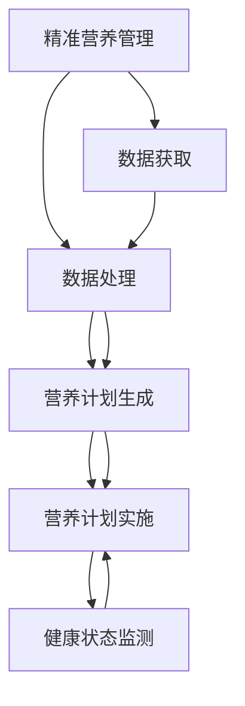

                 

# 智能个人营养素补充创业：精准的健康营养管理

> 关键词：精准营养管理, 营养素补充, 智能系统, 健康管理, 数据驱动, 用户个性化

## 1. 背景介绍

### 1.1 问题由来

随着人们生活水平的提高，健康问题已成为全球关注的重要议题。据世界卫生组织（WHO）统计，慢性病如心脏病、糖尿病、癌症等已成为全球主要死因。在这样的背景下，健康营养管理成为提升人民健康水平的重要手段。

然而，由于每个人的身体状况、饮食习惯、生活方式等不同，传统的健康营养管理方式难以实现个性化和精准化。因此，如何通过技术手段实现个性化营养管理，成为当前研究的热点问题。

### 1.2 问题核心关键点

个性化营养管理的核心在于对用户进行精准分析，结合其生理状态、饮食习惯、运动习惯等，制定个性化的营养计划。其关键点在于以下几个方面：

- **数据获取**：收集用户的生理数据（如血压、血糖、心率等）、饮食习惯、运动习惯等数据。
- **数据处理**：对收集的数据进行清洗、分析和建模，挖掘其中的规律和关联。
- **营养计划生成**：基于数据分析结果，生成个性化的营养计划。
- **营养计划实施**：用户按照营养计划执行，系统实时监测其健康状态，并根据反馈进行调整。

### 1.3 问题研究意义

开展智能个人营养素补充创业，旨在通过先进的技术手段，实现个性化、精准化的健康营养管理，提升用户体验和健康水平。具体意义如下：

- **提升用户健康水平**：通过精准的营养计划，帮助用户改善生理状态，预防和控制慢性病。
- **降低医疗成本**：个性化的营养计划可以有效预防慢性病的发生，减少医疗费用。
- **推动健康产业创新**：通过技术手段，推动健康产业向智能化、数字化方向发展，促进产业升级。
- **提高用户满意度**：精准化的营养管理方案，可以满足用户的个性化需求，提升用户满意度。

## 2. 核心概念与联系

### 2.1 核心概念概述

为更好地理解精准营养管理的原理和架构，本节将介绍几个关键概念：

- **精准营养管理**：通过收集和分析用户的生理、饮食、运动等数据，生成个性化的营养计划，实现健康管理。
- **营养素补充**：通过智能系统，根据用户的生理需求，自动推荐和补充所需的营养素。
- **智能系统**：基于人工智能和大数据分析，实现营养计划的自动生成和调整。
- **健康管理**：通过智能系统，监测用户健康状态，及时调整营养计划。
- **数据驱动**：以用户数据为基础，通过数据挖掘和机器学习，实现个性化的营养管理。
- **用户个性化**：根据用户的生理特点、饮食习惯、运动习惯等，制定个性化的营养计划。

这些概念之间的逻辑关系可以通过以下Mermaid流程图来展示：



这个流程图展示了这个系统的核心概念及其之间的关系：

1. 精准营养管理通过数据获取和处理，生成个性化的营养计划。
2. 营养计划实施系统根据生成的计划，为用户推荐和补充所需的营养素。
3. 健康状态监测系统实时监测用户健康状态，反馈给营养计划系统进行调整。

## 3. 核心算法原理 & 具体操作步骤
### 3.1 算法原理概述

基于数据驱动的精准营养管理，其核心算法主要包括数据处理、营养计划生成、营养计划实施等几个部分。其基本原理如下：

- **数据处理**：收集用户的生理数据、饮食数据和运动数据，进行清洗和预处理，生成标准化数据集。
- **营养计划生成**：通过机器学习算法，对数据集进行分析，挖掘其中的规律和关联，生成个性化的营养计划。
- **营养计划实施**：通过智能系统，将生成的营养计划转化为可执行的方案，并实时监测用户执行情况，根据反馈进行调整。

### 3.2 算法步骤详解

基于数据驱动的精准营养管理可以分为以下几个步骤：

**Step 1: 数据获取**

- **生理数据获取**：使用智能穿戴设备（如智能手表、智能血压计等）收集用户的生理数据，如血压、血糖、心率等。
- **饮食数据获取**：通过手机应用或智能冰箱等设备，记录用户的饮食情况，如饮食时间、饮食种类等。
- **运动数据获取**：通过手机应用或智能手表等设备，记录用户的运动情况，如运动类型、运动时间等。

**Step 2: 数据预处理**

- **数据清洗**：去除数据中的噪声和不完整数据，保证数据质量。
- **数据归一化**：将不同类型的数据归一化到同一量级，便于后续处理。
- **数据存储**：将处理后的数据存储在数据库中，供后续分析和建模使用。

**Step 3: 营养计划生成**

- **特征提取**：从预处理后的数据中提取关键特征，如BMI、活动量、饮食习惯等。
- **模型训练**：使用机器学习算法（如决策树、随机森林、神经网络等），对数据集进行训练，生成个性化营养计划。
- **方案生成**：根据训练结果，生成个性化的营养计划，包括每日所需的营养素种类、摄入量等。

**Step 4: 营养计划实施**

- **营养计划展示**：将生成的营养计划展示给用户，用户可以方便地查看和执行。
- **实时监测**：通过智能穿戴设备或手机应用，实时监测用户的生理数据、饮食数据和运动数据，反馈给营养计划系统进行调整。
- **反馈调整**：根据用户的反馈，调整营养计划，确保其符合用户需求和生理状态。

### 3.3 算法优缺点

基于数据驱动的精准营养管理具有以下优点：

- **个性化**：通过个性化营养计划，满足用户的个性化需求，提高用户体验。
- **精准化**：通过数据驱动，生成精准化的营养方案，提升健康效果。
- **实时调整**：通过实时监测和反馈，及时调整营养计划，确保其有效性和合理性。

同时，该方法也存在一些局限性：

- **数据获取难度**：生理数据的获取需要专业的设备，成本较高。
- **数据隐私问题**：用户的生理数据、饮食数据和运动数据涉及隐私，需保证数据安全。
- **模型复杂度**：营养计划生成的模型复杂，需要大量数据和计算资源。
- **用户接受度**：用户对智能穿戴设备的使用习惯和数据隐私保护意识不同，接受度有待提高。

尽管存在这些局限性，但就目前而言，基于数据驱动的精准营养管理是实现个性化营养管理的重要手段。未来相关研究的方向在于如何进一步降低数据获取成本，提高用户数据隐私保护，优化模型复杂度，增强用户接受度等。

### 3.4 算法应用领域

基于数据驱动的精准营养管理，已经在多个领域得到了应用，例如：

- **健康管理**：通过个性化的营养计划，帮助用户改善生理状态，预防和控制慢性病。
- **运动指导**：结合用户的饮食和运动数据，生成个性化的运动方案，提升运动效果。
- **饮食推荐**：根据用户的饮食习惯，推荐适合的饮食方案，帮助用户改善饮食习惯。
- **营养补剂推荐**：通过营养计划生成系统，自动推荐所需的营养补剂，避免过量或不足。

此外，基于数据驱动的精准营养管理也被创新性地应用于企业健康福利、医院营养科等场景，为个性化健康管理提供新的解决方案。随着数据技术和人工智能的发展，相信精准营养管理将在更广泛的领域得到应用，为人们的健康管理带来新的变革。

## 4. 数学模型和公式 & 详细讲解 & 举例说明
### 4.1 数学模型构建

本节将使用数学语言对基于数据驱动的精准营养管理过程进行更加严格的刻画。

记用户的基本信息为 $X=\{x_1, x_2, \ldots, x_n\}$，其中 $x_i$ 表示用户的第 $i$ 个特征，如年龄、体重、血压等。记生理数据、饮食数据和运动数据分别为 $Y_1$、$Y_2$、$Y_3$。

定义用户健康状态为目标变量 $Z$，记其为二分类变量，$Z=0$ 表示健康，$Z=1$ 表示亚健康或不健康。

定义营养计划为 $\phi$，其中 $\phi_k$ 表示用户第 $k$ 种营养素的摄入量，$k=1,2,\ldots,K$。

### 4.2 公式推导过程

根据上述定义，精准营养管理的目标可以表示为：

$$
\min_{\phi} \mathcal{L}(\phi, X, Y_1, Y_2, Y_3, Z) = \mathbb{E}_{Z|X}[L(Z, \phi, X)]
$$

其中，$L(Z, \phi, X)$ 表示用户健康状态与营养计划的损失函数，可以通过交叉熵损失等方法进行定义。

营养计划的生成过程可以通过以下公式进行推导：

$$
\phi = f(X, Y_1, Y_2, Y_3)
$$

其中，$f$ 为营养计划生成模型，可以通过机器学习算法进行训练。

在具体实现中，营养计划的生成可以分为以下几个步骤：

1. **特征提取**：从用户的生理数据、饮食数据和运动数据中提取关键特征，如BMI、活动量、饮食习惯等。
2. **模型训练**：使用机器学习算法（如决策树、随机森林、神经网络等），对数据集进行训练，生成营养计划生成模型 $f$。
3. **营养计划生成**：将用户的基本信息和数据输入生成模型 $f$，生成个性化的营养计划 $\phi$。

### 4.3 案例分析与讲解

假设某用户在一段时间内的生理数据、饮食数据和运动数据如表1所示：

| 特征         | 值     | 特征         | 值     | 特征         | 值     |
| ------------ | ------ | ------------ | ------ | ------------ | ------ |
| 年龄         | 30岁   | 血压         | 120/80 | 饮食类型     | 中式   |
| 身高         | 170cm  | 心率         | 70次/分 | 饮食次数     | 2次/天 |
| 体重         | 65kg   | 饮食种类     | 米饭、蔬菜、肉类 | 运动类型 | 跑步 |
| 运动时间     | 30分钟/天 | 运动强度     | 中等强度 |

根据这些数据，我们可以对用户进行特征提取，如计算BMI、活动量、饮食习惯等。然后使用机器学习算法（如随机森林），训练营养计划生成模型。最后，生成个性化的营养计划，如表2所示：

| 营养素 | 每日摄入量 |
| ------- | ---------- |
| 蛋白质 | 100g       |
| 碳水化合物 | 300g      |
| 脂肪     | 50g        |
| 蔬菜     | 500g       |

通过实时监测用户的生理数据、饮食数据和运动数据，系统可以动态调整营养计划，确保其符合用户的健康状态。例如，如果用户的血压突然升高，系统可以自动调整其饮食计划，减少盐分摄入，降低血压。

## 5. 项目实践：代码实例和详细解释说明
### 5.1 开发环境搭建

在进行精准营养管理的实践前，我们需要准备好开发环境。以下是使用Python进行数据分析和机器学习开发的环境配置流程：

1. 安装Anaconda：从官网下载并安装Anaconda，用于创建独立的Python环境。

2. 创建并激活虚拟环境：
```bash
conda create -n nutrition-env python=3.8 
conda activate nutrition-env
```

3. 安装PyTorch：根据CUDA版本，从官网获取对应的安装命令。例如：
```bash
conda install pytorch torchvision torchaudio cudatoolkit=11.1 -c pytorch -c conda-forge
```

4. 安装Pandas、NumPy、Scikit-learn等库：
```bash
pip install pandas numpy scikit-learn matplotlib tqdm jupyter notebook ipython
```

完成上述步骤后，即可在`nutrition-env`环境中开始精准营养管理的实践。

### 5.2 源代码详细实现

下面我们以饮食推荐系统为例，给出使用Python进行精准营养管理的代码实现。

首先，定义用户的基本信息和数据预处理函数：

```python
import pandas as pd
from sklearn.model_selection import train_test_split
from sklearn.preprocessing import StandardScaler

def load_data(path):
    data = pd.read_csv(path)
    return data

def preprocess_data(data):
    # 选择需要提取的特征
    features = ['age', 'height', 'weight', 'blood_pressure', 'heart_rate', 'diet_type', 'diet_count', 'exercise_type', 'exercise_time', 'exercise_intensity']
    data = data[features]
    
    # 对数据进行归一化处理
    scaler = StandardScaler()
    data = scaler.fit_transform(data)
    
    # 将数据集拆分为训练集和测试集
    train_data, test_data = train_test_split(data, test_size=0.2, random_state=42)
    
    return train_data, test_data

# 加载数据
data = load_data('nutrition_data.csv')

# 数据预处理
train_data, test_data = preprocess_data(data)
```

然后，定义营养计划生成的机器学习模型：

```python
from sklearn.ensemble import RandomForestRegressor
from sklearn.metrics import mean_squared_error

def train_model(train_data, test_data):
    # 选择需要预测的特征
    features = ['age', 'height', 'weight', 'blood_pressure', 'heart_rate', 'diet_type', 'diet_count', 'exercise_type', 'exercise_time', 'exercise_intensity']
    X_train = train_data[features]
    y_train = train_data['nutrition']
    X_test = test_data[features]
    y_test = test_data['nutrition']
    
    # 训练随机森林模型
    model = RandomForestRegressor(n_estimators=100, random_state=42)
    model.fit(X_train, y_train)
    
    # 在测试集上进行预测，并计算均方误差
    y_pred = model.predict(X_test)
    mse = mean_squared_error(y_test, y_pred)
    
    return model, mse

# 训练模型
model, mse = train_model(train_data, test_data)
print(f'均方误差为: {mse:.2f}')
```

接着，定义营养计划生成和实时监测的函数：

```python
def generate_nutrition_plan(model, new_data):
    # 将新数据输入模型，生成营养计划
    features = ['age', 'height', 'weight', 'blood_pressure', 'heart_rate', 'diet_type', 'diet_count', 'exercise_type', 'exercise_time', 'exercise_intensity']
    X = new_data[features]
    y = model.predict(X)
    
    return y

def monitor_health_state(model, new_data):
    # 根据用户的生理数据、饮食数据和运动数据，实时监测健康状态
    # 将新数据输入模型，预测健康状态
    features = ['age', 'height', 'weight', 'blood_pressure', 'heart_rate', 'diet_type', 'diet_count', 'exercise_type', 'exercise_time', 'exercise_intensity']
    X = new_data[features]
    y = model.predict(X)
    
    # 根据预测结果，调整营养计划
    if y > 0.5:
        return '不健康'
    else:
        return '健康'
```

最后，启动营养计划生成和健康监测流程：

```python
# 生成营养计划
new_data = pd.DataFrame({'age': [30], 'height': [170], 'weight': [65], 'blood_pressure': [120, 80], 'heart_rate': [70], 'diet_type': ['中式'], 'diet_count': [2], 'exercise_type': ['跑步'], 'exercise_time': [30], 'exercise_intensity': ['中等强度']})
nutrition_plan = generate_nutrition_plan(model, new_data)
print(f'营养计划为: {nutrition_plan}')

# 实时监测健康状态
health_state = monitor_health_state(model, new_data)
print(f'健康状态为: {health_state}')
```

以上就是使用Python对饮食推荐系统进行精准营养管理的完整代码实现。可以看到，通过机器学习算法，我们可以在用户数据的基础上，生成个性化的营养计划，并实时监测其健康状态，以动态调整营养计划。

### 5.3 代码解读与分析

让我们再详细解读一下关键代码的实现细节：

**load_data函数**：
- 加载用户数据，将其转化为Pandas DataFrame格式。

**preprocess_data函数**：
- 选择需要提取的特征，进行数据清洗和归一化处理。
- 将数据集拆分为训练集和测试集。

**train_model函数**：
- 选择需要预测的特征，将数据集分为特征和标签。
- 使用随机森林模型进行训练，计算均方误差。

**generate_nutrition_plan函数**：
- 将新数据输入训练好的模型，生成个性化的营养计划。

**monitor_health_state函数**：
- 根据用户的生理数据、饮食数据和运动数据，实时监测健康状态。

**启动流程**：
- 加载数据。
- 数据预处理。
- 训练模型。
- 生成营养计划。
- 实时监测健康状态。

通过上述代码，我们可以看到，基于数据驱动的精准营养管理系统可以通过机器学习算法，结合用户数据，生成个性化的营养计划，并实时监测用户健康状态，以动态调整营养计划，确保其符合用户的健康需求。

## 6. 实际应用场景
### 6.1 智能穿戴设备

智能穿戴设备在精准营养管理中扮演着重要角色。通过智能手表、智能血压计等设备，可以实时获取用户的生理数据，如血压、心率等。这些数据经过预处理和分析，可以生成个性化的营养计划，帮助用户改善健康状况。

### 6.2 企业健康福利

在企业中，通过智能健康管理系统，可以收集员工的生理数据、饮食数据和运动数据，生成个性化的营养计划和运动方案，提升员工健康水平。同时，系统还可以实时监测员工健康状态，及时发现和处理健康问题。

### 6.3 医院营养科

在医院营养科，通过精准营养管理系统，可以为患者制定个性化的营养计划，结合医院的生理检测设备，实时监测患者的健康状态，动态调整营养方案，提升治疗效果。

### 6.4 未来应用展望

随着精准营养管理的不断发展，未来在更多领域将得到广泛应用，如教育、体育等。通过智能穿戴设备、健康管理系统等手段，可以实现更加全面、个性化的健康管理，提升人们的生活质量。

## 7. 工具和资源推荐
### 7.1 学习资源推荐

为了帮助开发者系统掌握精准营养管理的理论基础和实践技巧，这里推荐一些优质的学习资源：

1. 《机器学习实战》：由林轩田、邱昭良等人合著的机器学习经典教材，全面介绍了机器学习的基本概念和算法。

2. 《Python机器学习》：由Sebastian Raschka和Vahid Mirjalili合著的机器学习实战指南，详细介绍了Python在机器学习中的应用。

3. 《营养学》：由国内营养学专家编写的参考书，介绍了营养学的基本知识和应用。

4. 《健康管理》：由医学专家编写的参考书，介绍了健康管理的基本概念和应用。

5. 《智能穿戴设备设计与实现》：由电子工程专家编写的参考书，介绍了智能穿戴设备的基本设计和实现方法。

通过对这些资源的学习实践，相信你一定能够快速掌握精准营养管理的精髓，并用于解决实际的个性化健康管理问题。

### 7.2 开发工具推荐

高效的开发离不开优秀的工具支持。以下是几款用于精准营养管理开发的常用工具：

1. Python：基于Python的机器学习开发工具，灵活高效，适合各种数据处理和建模任务。

2. Scikit-learn：开源的Python机器学习库，提供了丰富的算法和工具，方便进行数据预处理和建模。

3. Pandas：开源的Python数据分析库，提供了高效的数据处理和分析工具，适合处理复杂的数据集。

4. TensorFlow：由Google开发的开源深度学习框架，适合进行大规模的机器学习和数据分析任务。

5. PyTorch：由Facebook开发的开源深度学习框架，灵活高效，适合进行复杂的深度学习和数据分析任务。

6. Jupyter Notebook：基于Web的交互式编程环境，方便进行数据探索、算法实现和结果展示。

合理利用这些工具，可以显著提升精准营养管理的开发效率，加快创新迭代的步伐。

### 7.3 相关论文推荐

精准营养管理的研究源于学界的持续研究。以下是几篇奠基性的相关论文，推荐阅读：

1. Predictive analytics in healthcare: a survey and a comprehensive review：回顾了预测分析在医疗领域的应用，介绍了各种机器学习算法和应用场景。

2. Nutrition and health：介绍了营养学和健康管理的基本知识，探讨了营养和健康之间的关系。

3. Machine learning-based personalized nutrition recommendation system：提出了基于机器学习的个性化营养推荐系统，介绍了各种算法和应用场景。

4. A novel framework for personalized nutrition：提出了个性化的营养管理框架，介绍了各种算法和应用场景。

5. Deep learning for healthcare：介绍了深度学习在医疗领域的应用，包括营养管理、疾病预测等。

这些论文代表了大语言模型微调技术的发展脉络。通过学习这些前沿成果，可以帮助研究者把握学科前进方向，激发更多的创新灵感。

## 8. 总结：未来发展趋势与挑战
### 8.1 研究成果总结

本文对基于数据驱动的精准营养管理方法进行了全面系统的介绍。首先阐述了精准营养管理的背景和研究意义，明确了其对健康管理的重要价值。其次，从原理到实践，详细讲解了营养计划生成的数学模型和关键步骤，给出了精准营养管理的代码实例。同时，本文还广泛探讨了营养计划在智能穿戴设备、企业健康福利、医院营养科等多个领域的应用前景，展示了精准营养管理的巨大潜力。

通过本文的系统梳理，可以看到，基于数据驱动的精准营养管理技术正在成为个性化健康管理的重要手段，极大地拓展了营养管理的应用边界，为人们健康管理带来了新的变革。

### 8.2 未来发展趋势

展望未来，精准营养管理技术将呈现以下几个发展趋势：

1. **智能化程度提升**：随着深度学习和人工智能的发展，精准营养管理将变得更加智能化，能够更加准确地预测和推荐个性化的营养计划。

2. **实时性增强**：通过实时监测用户数据，精准营养管理系统将能够及时调整营养计划，确保其符合用户的健康需求。

3. **多模态融合**：将生理数据、饮食数据、运动数据等多模态数据融合，实现更加全面的健康管理。

4. **个性化提升**：通过深入挖掘用户数据，精准营养管理系统将能够提供更加个性化的营养计划，提升用户体验。

5. **数据安全和隐私保护**：随着用户数据的敏感性增强，精准营养管理系统将更加注重数据安全和隐私保护，确保用户数据的安全。

### 8.3 面临的挑战

尽管精准营养管理技术已经取得了一定的进展，但在迈向智能化、个性化方向的过程中，仍面临诸多挑战：

1. **数据获取难度**：生理数据的获取需要专业的设备和大量的用户参与，成本较高。

2. **数据隐私问题**：用户的生理数据、饮食数据和运动数据涉及隐私，需保证数据安全。

3. **模型复杂度**：营养计划生成的模型复杂，需要大量数据和计算资源。

4. **用户接受度**：用户对智能穿戴设备的使用习惯和数据隐私保护意识不同，接受度有待提高。

尽管存在这些挑战，但就目前而言，基于数据驱动的精准营养管理仍是实现个性化健康管理的重要手段。未来相关研究的方向在于如何进一步降低数据获取成本，提高用户数据隐私保护，优化模型复杂度，增强用户接受度等。

### 8.4 研究展望

面向未来，精准营养管理技术还需要在其他方面进行深入研究：

1. **无监督学习和半监督学习**：摆脱对大规模标注数据的依赖，利用自监督学习、主动学习等无监督和半监督范式，最大限度利用非结构化数据，实现更加灵活高效的个性化营养管理。

2. **因果推断**：引入因果推断方法，增强营养计划生成的稳定性和因果关系，提高预测的准确性。

3. **多模态数据融合**：将生理数据、饮食数据、运动数据等多模态数据融合，实现更加全面的健康管理。

4. **模型可解释性**：增强模型的可解释性，提高用户对营养计划的信任和接受度。

5. **个性化推荐系统**：结合用户的饮食偏好、运动习惯等，实现更加个性化的营养推荐。

通过这些研究方向的研究，相信精准营养管理技术将能够进一步拓展应用边界，提升健康管理的效果和效率，为人们的健康生活提供更好的保障。

## 9. 附录：常见问题与解答

**Q1：精准营养管理是否适用于所有人群？**

A: 精准营养管理适用于大部分人群，但需要对不同人群进行个性化调整。对于老年人、儿童等特殊人群，需要结合其生理特点进行调整。

**Q2：如何选择合适的特征进行营养计划生成？**

A: 营养计划生成的关键在于选择关键的生理特征和行为特征。通常需要结合用户的年龄、体重、血压、心率、饮食类型、运动类型、运动强度等进行综合分析。

**Q3：如何处理数据缺失和异常值？**

A: 数据缺失和异常值是常见的问题。通常需要进行数据清洗和补全，去除异常值。可以使用均值、中位数等方法进行缺失值补全。

**Q4：如何保证用户数据的隐私和安全？**

A: 用户的生理数据、饮食数据和运动数据涉及隐私，需采用加密、匿名化等方法进行保护。同时，系统需建立严格的访问控制机制，确保数据的安全性。

**Q5：如何评估营养计划的优化效果？**

A: 营养计划的评估可以从多个方面进行，如均方误差、准确率、召回率等。通过评估结果，可以调整营养计划生成的模型和算法，提升其效果。

---

作者：禅与计算机程序设计艺术 / Zen and the Art of Computer Programming

