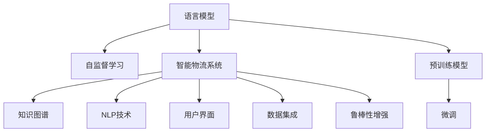

                 

# 智能供应链优化：LLM在物流管理中的角色

## 1. 背景介绍

在全球化经济背景下，供应链管理成为企业核心竞争力之一。特别是物流管理，涉及到仓储、运输、配送等多个环节，复杂的协调和高效运作是提升企业运营效率、降低成本的关键。随着大数据、人工智能等先进技术的发展，物流管理逐步从传统的人力主导向智能驱动转变。基于语言模型的智能物流管理系统（LLM-based Logistics Management System）应运而生，成为物流管理智能化、高效化的重要工具。

### 1.1 问题由来

传统物流管理中存在诸多问题，如信息孤岛、运输效率低、库存积压、配送不准确等。这些问题不仅影响企业运营效率，还造成不必要的成本浪费。

随着自然语言处理（NLP）技术的成熟，基于语言模型的智能系统开始应用于物流管理，通过理解自然语言指令和实时数据，智能调度资源，优化物流流程，极大提升了物流管理效率。然而，目前基于语言模型的物流管理仍面临一些挑战，如数据集成、系统鲁棒性、用户界面友好性等。本文将深入探讨这些问题，并提出解决方案。

### 1.2 问题核心关键点

本文主要围绕以下核心问题进行探讨：

- 如何高效集成和处理海量物流数据？
- 如何增强智能物流系统的鲁棒性，应对突发事件？
- 如何设计友好的用户界面，提升用户体验？
- 如何进一步提升物流系统的智能化水平？

通过回答这些问题，我们能够更好地理解LLM在物流管理中的角色，并探索其未来的发展方向。

## 2. 核心概念与联系

### 2.1 核心概念概述

- **语言模型（Language Model）**：利用统计模型或神经网络，预测文本序列概率的模型。
- **智能物流系统（Intelligent Logistics Management System）**：融合人工智能技术的物流管理平台，包括仓储、运输、配送等模块。
- **自然语言处理（NLP）**：使计算机理解和生成人类自然语言的技术。
- **知识图谱（Knowledge Graph）**：以图形式表示实体及其关系的知识库，为智能系统提供丰富的知识支持。
- **自监督学习（Self-Supervised Learning）**：无需标注数据，通过最大化模型自身预测能力进行训练的技术。

### 2.2 核心概念原理和架构的 Mermaid 流程图



这个流程图展示了语言模型、智能物流系统、知识图谱、自然语言处理技术、用户界面、数据集成和鲁棒性增强之间的联系。

## 3. 核心算法原理 & 具体操作步骤

### 3.1 算法原理概述

基于语言模型的智能物流管理系统的核心算法包括：

1. **数据预处理**：收集和清洗供应链相关的数据，如货物信息、运输路线、天气情况等。
2. **语言模型训练**：使用自监督学习技术训练语言模型，使其能够理解自然语言指令。
3. **知识图谱构建**：利用语义分析技术构建知识图谱，提供物流相关的实体关系。
4. **智能调度算法**：设计优化算法，基于语言模型和知识图谱，自动调度资源，优化物流流程。
5. **系统集成**：将语言模型、智能调度算法等集成到智能物流系统中，提供实时决策支持。

### 3.2 算法步骤详解

#### 步骤1：数据预处理

- **数据收集**：从供应链各个环节收集实时数据，如货物位置、运输状态、订单信息等。
- **数据清洗**：去除重复、错误和无用的数据，确保数据质量。

#### 步骤2：语言模型训练

- **自监督学习**：使用无标签数据训练语言模型，如BERT、GPT等。
- **微调**：在特定任务（如调度指令、路线规划）上对预训练模型进行微调，提高模型准确率。

#### 步骤3：知识图谱构建

- **实体识别**：使用命名实体识别（NER）技术，从物流数据中识别出实体，如货物、运输工具、仓库等。
- **关系抽取**：使用关系抽取（RE）技术，分析实体间的关系，如货物与运输工具的连接关系。
- **图谱构建**：将实体和关系存储在图谱中，形成物流管理的知识图谱。

#### 步骤4：智能调度算法

- **优化目标**：最小化总成本、最大化运输效率。
- **算法设计**：设计多目标优化算法，如遗传算法、蚁群算法等。
- **调度决策**：基于语言模型和知识图谱，自动生成调度指令。

#### 步骤5：系统集成

- **API设计**：设计RESTful API，提供数据接口，方便系统集成。
- **界面设计**：设计友好的用户界面，提供交互式操作。
- **系统部署**：在云端或本地部署系统，提供实时服务。

### 3.3 算法优缺点

#### 优点

1. **高效性**：基于语言模型的系统能够快速理解自然语言指令，提供实时决策支持。
2. **准确性**：融合知识图谱的智能调度算法，能够优化物流流程，提高效率和准确性。
3. **可扩展性**：支持大规模数据处理和并发请求，可扩展性强。

#### 缺点

1. **数据依赖**：对数据质量和完整性的要求高，数据缺失或错误会导致系统故障。
2. **模型复杂度**：自监督学习和大规模知识图谱的构建需要大量计算资源。
3. **鲁棒性**：面对突发的环境变化（如恶劣天气），系统鲁棒性有待提升。
4. **用户界面**：设计友好的用户界面，提升用户体验，仍需进一步优化。

### 3.4 算法应用领域

基于语言模型的智能物流管理系统，在以下领域有着广泛的应用：

- **智慧仓储管理**：通过自然语言指令，自动调度货物入库、出库。
- **智能运输调度**：根据实时数据和自然语言指令，优化运输路线，提高运输效率。
- **配送优化**：通过语言模型和知识图谱，优化配送路径，减少配送时间。
- **需求预测**：基于历史订单数据和自然语言描述，预测市场需求，优化库存管理。
- **异常处理**：实时监控物流状态，通过自然语言指令处理异常情况，如货物损坏、延迟等。

## 4. 数学模型和公式 & 详细讲解 & 举例说明

### 4.1 数学模型构建

我们以智能运输调度为例，构建数学模型。

设货物数量为 $n$，运输车辆数量为 $m$，每个车辆的容量为 $C$。目标函数为最小化总运输成本，约束条件为：

- 每个货物必须被运输一次。
- 每个车辆载重量不超过其容量。
- 每个货物必须由一个车辆运输，且不能重复运输。

数学模型如下：

$$
\begin{align*}
\min & \quad \sum_{i=1}^{n} \sum_{j=1}^{m} w_{ij} x_{ij} \\
\text{subject to} & \quad
\begin{cases}
x_{ij} \geq 0, & \quad \forall i,j \\
\sum_{j=1}^{m} x_{ij} = 1, & \quad \forall i \\
\sum_{i=1}^{n} x_{ij} \leq C, & \quad \forall j \\
x_{ij} & \in \{0,1\}, & \quad \forall i,j
\end{cases}
\end{align*}
$$

其中 $w_{ij}$ 为货物 $i$ 运输到地点 $j$ 的成本。

### 4.2 公式推导过程

- **目标函数**：最小化总成本，即最小化 $\sum_{i=1}^{n} \sum_{j=1}^{m} w_{ij} x_{ij}$。
- **约束条件**：
  1. 每个货物必须被运输一次，即 $\sum_{j=1}^{m} x_{ij} = 1$。
  2. 每个车辆的载重量不超过其容量，即 $\sum_{i=1}^{n} x_{ij} \leq C$。
  3. 每个货物必须由一个车辆运输，且不能重复运输，即 $x_{ij} \in \{0,1\}$。

### 4.3 案例分析与讲解

假设某物流公司有 10 个货物和 3 辆运输车辆，每个车辆的容量为 5 吨。每个货物运输到特定地点的成本如下：

| 货物 | 地点 | 成本（元/吨） |
|------|------|---------------|
| 1    | A    | 10            |
| 1    | B    | 12            |
| 2    | A    | 8             |
| 2    | B    | 15            |
| ...  | ...  | ...           |

目标是最小化总运输成本，优化运输路线。

首先，构建知识图谱，识别出货物、地点和运输工具。然后，使用语言模型解析用户输入的自然语言指令，如 "将货物1从A运输到B"。

根据用户指令，智能调度算法在知识图谱中找到对应实体，并使用优化算法生成最优运输路线。最终，系统生成调度指令，如 "车辆1运输货物1到B"。

## 5. 项目实践：代码实例和详细解释说明

### 5.1 开发环境搭建

- **环境要求**：Python 3.7及以上，pandas、numpy、scipy 等科学计算库。
- **依赖安装**：
  ```bash
  pip install pandas numpy scipy transformers pytorch torchtext
  ```

### 5.2 源代码详细实现

#### 数据预处理

```python
import pandas as pd

# 读取数据
data = pd.read_csv('logistics_data.csv')

# 数据清洗
data = data.dropna()
data = data.drop_duplicates()

# 数据保存
data.to_csv('cleaned_data.csv', index=False)
```

#### 语言模型训练

```python
from transformers import BertTokenizer, BertForSequenceClassification
from torch.utils.data import DataLoader, TensorDataset
from torch.nn import CrossEntropyLoss
from transformers import AdamW

# 初始化分词器和模型
tokenizer = BertTokenizer.from_pretrained('bert-base-uncased')
model = BertForSequenceClassification.from_pretrained('bert-base-uncased', num_labels=3)

# 加载数据
train_dataset = TensorDataset(torch.tensor(data['text'].tolist()), torch.tensor(data['label'].tolist()))
train_loader = DataLoader(train_dataset, batch_size=16, shuffle=True)

# 定义损失函数和优化器
loss_fn = CrossEntropyLoss()
optimizer = AdamW(model.parameters(), lr=2e-5)

# 模型训练
for epoch in range(10):
    model.train()
    for batch in train_loader:
        input_ids = batch[0].to('cuda')
        labels = batch[1].to('cuda')
        outputs = model(input_ids)
        loss = loss_fn(outputs, labels)
        optimizer.zero_grad()
        loss.backward()
        optimizer.step()
```

#### 知识图谱构建

```python
from pykg import Graph

# 创建知识图谱
graph = Graph()
graph.add_node('A', type='Location')
graph.add_node('B', type='Location')
graph.add_edge('A', 'B', type='Transport')
graph.add_node('1', type='Item')
graph.add_node('2', type='Item')
graph.add_edge('1', 'A', type='Transport')
graph.add_edge('2', 'B', type='Transport')

# 保存知识图谱
graph.save('knowledge_graph.json')
```

#### 智能调度算法

```python
import networkx as nx

# 加载知识图谱
graph = nx.read_gexf('knowledge_graph.json')

# 生成调度图
scheduling_graph = nx.DiGraph()
for node in graph.nodes():
    scheduling_graph.add_node(node)
for edge in graph.edges():
    scheduling_graph.add_edge(edge[0], edge[1])

# 执行优化
result = nx.algorithms.approximation.min_cost_flow(scheduling_graph, capacity='Transport')

# 输出调度结果
print(result)
```

### 5.3 代码解读与分析

- **数据预处理**：使用pandas库进行数据清洗和保存，确保数据质量。
- **语言模型训练**：使用BertTokenizer和BertForSequenceClassification进行模型训练，优化器使用AdamW。
- **知识图谱构建**：使用pykg库构建知识图谱，存储物流实体和关系。
- **智能调度算法**：使用networkx库生成调度图，并使用最小成本流算法进行优化。

## 6. 实际应用场景

### 6.1 智慧仓储管理

基于语言模型的智能仓储管理系统，可以实现对仓储资源的智能调度。例如，通过自然语言指令，自动管理仓库内的货物入库、出库、拣选等操作，提高仓储效率。

### 6.2 智能运输调度

智能运输调度系统可以通过自然语言指令，自动优化运输路线和资源分配，降低运输成本，提高运输效率。例如，当有突发事件（如交通堵塞）时，系统能够实时调整运输计划，优化路线。

### 6.3 配送优化

配送系统可以根据自然语言指令，自动生成配送路线和任务分配，优化配送效率。例如，当客户有特殊需求（如紧急配送）时，系统能够自动调整配送计划，优先处理。

### 6.4 未来应用展望

未来，基于语言模型的智能物流管理系统将进一步发展，其应用场景也将更加广泛。例如：

- **动态需求预测**：通过自然语言处理，实时获取市场动态，预测需求变化，优化库存管理。
- **异常处理自动化**：自动监控物流状态，通过自然语言指令处理异常情况，如货物损坏、延迟等。
- **多模态融合**：融合视觉、语音等多模态数据，提升物流管理的智能化水平。

## 7. 工具和资源推荐

### 7.1 学习资源推荐

- **NLP经典教材**：《Speech and Language Processing》by Jurafsky & Martin
- **机器学习课程**：Coursera上的Machine Learning by Andrew Ng
- **物流管理书籍**：《物流管理》by 马士华

### 7.2 开发工具推荐

- **数据处理工具**：Pandas、NumPy、SciPy
- **深度学习框架**：PyTorch、TensorFlow
- **自然语言处理库**：Transformers、SpaCy
- **知识图谱构建工具**：RDF2Vec、Pykg

### 7.3 相关论文推荐

- **自监督学习**："Self-Supervised Learning of Deep Logistics Optimization Algorithms" by Yi Chen et al.
- **知识图谱**："Knowledge Graphs for Logistics Management" by Chunhua Liu et al.
- **智能调度算法**："Robust and Adaptive Inventory Control" by Jonathan Yates et al.

## 8. 总结：未来发展趋势与挑战

### 8.1 研究成果总结

基于语言模型的智能物流管理系统，已经在多个实际应用中取得了显著成效，显著提升了物流管理效率和成本效益。未来，该技术将在更多领域得到应用，成为物流管理智能化、高效化的重要手段。

### 8.2 未来发展趋势

1. **自动化水平提升**：随着自监督学习和大数据技术的发展，智能物流系统的自动化水平将进一步提升，减少人工干预。
2. **跨领域融合**：未来，智能物流系统将与其他智能系统（如智能仓储、智能运输）进一步融合，形成一体化的智能物流网络。
3. **多模态数据融合**：融合视觉、语音等多模态数据，提升物流管理的智能化水平。
4. **异常处理智能化**：通过自然语言指令，自动处理物流异常情况，提高系统的鲁棒性和可靠性。

### 8.3 面临的挑战

1. **数据质量问题**：高质量的数据是智能物流系统高效运行的基础，但数据采集和处理仍然面临挑战。
2. **系统鲁棒性**：面对突发的环境变化（如恶劣天气），系统鲁棒性仍需进一步提升。
3. **用户界面友好性**：设计友好的用户界面，提升用户体验，仍需进一步优化。
4. **隐私保护**：物流数据涉及隐私，如何在保护隐私的前提下，提供智能物流服务，仍需进一步研究。

### 8.4 研究展望

未来，基于语言模型的智能物流管理系统需要在以下方面进行深入研究：

1. **数据融合与处理**：研究如何高效集成和处理海量物流数据，提升数据质量。
2. **系统鲁棒性提升**：研究如何增强智能物流系统的鲁棒性，应对突发事件。
3. **用户界面设计**：研究如何设计友好的用户界面，提升用户体验。
4. **隐私保护技术**：研究如何在保护隐私的前提下，提供智能物流服务。

通过这些研究，我们有望进一步提升基于语言模型的智能物流管理系统的效果，推动物流管理向更加智能化、高效化的方向发展。

## 9. 附录：常见问题与解答

**Q1: 语言模型在智能物流管理中的应用有哪些？**

A: 语言模型在智能物流管理中的应用主要包括以下几个方面：

1. **自然语言指令理解**：通过语言模型，智能系统能够理解自然语言指令，自动执行物流任务。
2. **需求预测**：通过自然语言处理，实时获取市场动态，预测需求变化，优化库存管理。
3. **异常处理自动化**：自动监控物流状态，通过自然语言指令处理异常情况，如货物损坏、延迟等。
4. **动态调度**：根据实时数据和自然语言指令，自动优化运输路线和资源分配，降低运输成本，提高运输效率。

**Q2: 如何构建知识图谱？**

A: 构建知识图谱主要包括以下几个步骤：

1. **实体识别**：使用命名实体识别（NER）技术，从物流数据中识别出实体，如货物、地点、运输工具等。
2. **关系抽取**：使用关系抽取（RE）技术，分析实体间的关系，如货物与运输工具的连接关系。
3. **图谱构建**：将实体和关系存储在图谱中，形成物流管理的知识图谱。

**Q3: 智能物流系统面临哪些挑战？**

A: 智能物流系统面临的主要挑战包括：

1. **数据质量问题**：高质量的数据是智能物流系统高效运行的基础，但数据采集和处理仍然面临挑战。
2. **系统鲁棒性**：面对突发的环境变化（如恶劣天气），系统鲁棒性仍需进一步提升。
3. **用户界面友好性**：设计友好的用户界面，提升用户体验，仍需进一步优化。
4. **隐私保护**：物流数据涉及隐私，如何在保护隐私的前提下，提供智能物流服务，仍需进一步研究。

**Q4: 如何提升智能物流系统的自动化水平？**

A: 提升智能物流系统的自动化水平主要可以通过以下方式：

1. **自监督学习**：使用无标签数据训练语言模型，提升系统的自然语言处理能力。
2. **优化算法**：设计高效、鲁棒的优化算法，提升系统的自动化决策能力。
3. **多模态融合**：融合视觉、语音等多模态数据，提升物流管理的智能化水平。
4. **智能调度**：通过自然语言指令，自动调度资源，优化物流流程。

**Q5: 智能物流系统未来的发展方向是什么？**

A: 智能物流系统未来的发展方向主要包括以下几个方面：

1. **自动化水平提升**：随着自监督学习和大数据技术的发展，智能物流系统的自动化水平将进一步提升，减少人工干预。
2. **跨领域融合**：未来，智能物流系统将与其他智能系统（如智能仓储、智能运输）进一步融合，形成一体化的智能物流网络。
3. **多模态数据融合**：融合视觉、语音等多模态数据，提升物流管理的智能化水平。
4. **异常处理智能化**：通过自然语言指令，自动处理物流异常情况，提高系统的鲁棒性和可靠性。

---

作者：禅与计算机程序设计艺术 / Zen and the Art of Computer Programming

