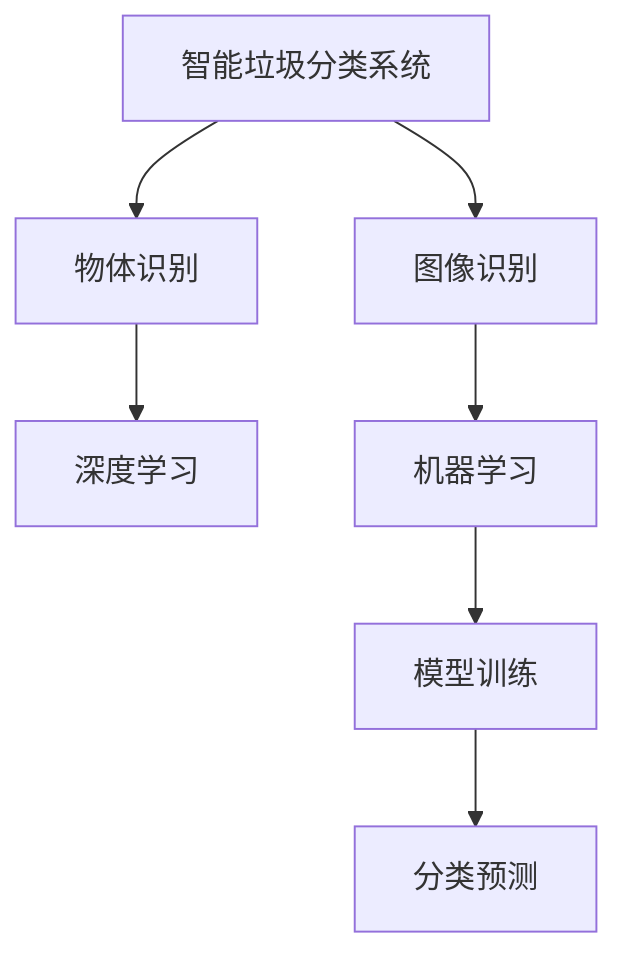

                 

# 智能垃圾分类创业：环保科技的创新应用

## 1. 背景介绍

### 1.1 问题由来
在全球范围内，垃圾分类已经成为推动可持续发展的重要手段。然而，由于居民环保意识不足、分类操作复杂、分类错误率高、分类设施不完善等问题，垃圾分类工作仍面临诸多挑战。随着技术的发展，智能垃圾分类系统应运而生。通过人工智能、物联网、大数据等技术，智能垃圾分类系统可以高效准确地实现垃圾分类，从而提升垃圾处理的效率和准确性，推动环保科技的创新应用。

### 1.2 问题核心关键点
智能垃圾分类系统的核心在于其智能化的垃圾识别和分类能力。通过摄像头、传感器等硬件设备收集垃圾图片和重量等信息，结合机器学习模型进行垃圾分类识别。智能垃圾分类系统主要分为图像识别和物体识别两个部分，图像识别部分通过深度学习模型对垃圾图片进行分类，物体识别部分通过传感器获取垃圾重量和体积等物理信息，结合机器学习模型进行更精确的分类。

## 2. 核心概念与联系

### 2.1 核心概念概述

为更好地理解智能垃圾分类系统，本节将介绍几个密切相关的核心概念：

- 图像识别（Image Recognition）：通过深度学习模型对图像内容进行识别和分类的过程。图像识别技术是智能垃圾分类系统的重要组成部分。
- 物体识别（Object Recognition）：通过传感器或深度学习模型对物体进行识别和分类的过程。物体识别技术可以用于获取垃圾的重量和体积等物理信息，辅助进行更精确的分类。
- 深度学习（Deep Learning）：通过多层神经网络对数据进行深度学习和训练，学习模型的非线性映射关系。深度学习是智能垃圾分类系统的核心技术。
- 机器学习（Machine Learning）：通过训练算法模型，从数据中学习规律和知识，并应用于实际问题。机器学习技术在智能垃圾分类系统中用于模型训练和分类预测。
- 垃圾分类（Waste Segregation）：将垃圾按照其种类进行分类，便于后续处理和回收。智能垃圾分类系统旨在通过技术手段实现这一目标。

这些核心概念之间的逻辑关系可以通过以下Mermaid流程图来展示：



这个流程图展示了一款智能垃圾分类系统的核心概念及其之间的关系：

1. 智能垃圾分类系统通过摄像头和传感器收集垃圾图片和重量等信息。
2. 图像识别部分使用深度学习模型对垃圾图片进行分类。
3. 物体识别部分使用传感器或深度学习模型对垃圾的重量和体积等物理信息进行识别。
4. 深度学习模型通过训练算法，学习垃圾图片和物理信息的特征，并应用于垃圾分类预测。

## 3. 核心算法原理 & 具体操作步骤
### 3.1 算法原理概述

智能垃圾分类系统基于深度学习技术，主要包括图像识别和物体识别两个部分。其核心思想是：通过训练大规模的数据集，学习垃圾图片和物理信息的特征，并将其应用于垃圾分类的预测和识别。

形式化地，假设输入为垃圾图片 $x$ 和物理信息 $y$，目标为分类标签 $t$。智能垃圾分类系统的训练目标是最小化损失函数：

$$
\mathcal{L}(\theta) = \mathop{\min}_{\theta} \mathcal{L}_f(\theta, x, y) + \mathcal{L}_s(\theta, x, t)
$$

其中 $\theta$ 为模型参数，$\mathcal{L}_f$ 为图像识别部分的损失函数，$\mathcal{L}_s$ 为物体识别部分的损失函数。

在训练过程中，深度学习模型通过反向传播算法更新参数，优化损失函数，直到收敛。在实际应用中，通过对模型进行微调（Fine-Tuning），可以提升模型在特定垃圾分类任务上的性能。

### 3.2 算法步骤详解

智能垃圾分类系统的构建一般包括以下几个关键步骤：

**Step 1: 数据准备与预处理**
- 收集并标注大规模垃圾分类数据集，包括图像和物理信息。
- 对图像进行预处理，如缩放、裁剪、灰度化等操作，以适应模型输入。
- 将物理信息转化为模型可接受的格式，如将其转换为数值或字符串标签。

**Step 2: 模型设计与选择**
- 选择深度学习模型，如卷积神经网络（CNN）、循环神经网络（RNN）等，进行图像识别和物体识别。
- 确定模型的架构和超参数，如卷积核大小、激活函数、批量大小等。

**Step 3: 模型训练与微调**
- 使用标注数据集对模型进行训练，学习垃圾图片和物理信息的特征。
- 在训练过程中，使用交叉熵损失、均方误差损失等常用损失函数进行优化。
- 对模型进行微调，以适应特定的垃圾分类任务，提高模型性能。

**Step 4: 模型评估与部署**
- 在验证集和测试集上评估模型性能，如准确率、召回率、F1分数等指标。
- 对模型进行部署，将其应用于实际垃圾分类场景。
- 定期收集反馈数据，进行模型迭代优化。

### 3.3 算法优缺点

智能垃圾分类系统基于深度学习技术，具有以下优点：
1. 准确率高。深度学习模型通过大量标注数据训练，可以获得较高的分类准确率。
2. 实时性好。图像识别和物体识别可以通过摄像头和传感器实时获取数据，实现快速分类。
3. 可扩展性强。深度学习模型可以通过增加模型层数或数据量，进行扩展和优化。
4. 适应性强。模型可以通过微调，适应不同类型的垃圾分类任务。

同时，该系统也存在一定的局限性：
1. 数据依赖性高。深度学习模型的性能很大程度上取决于标注数据的质量和数量。
2. 计算资源消耗大。深度学习模型通常需要较强的计算资源，包括高性能GPU、TPU等。
3. 模型复杂度高。深度学习模型的复杂度高，训练和推理过程较慢。
4. 可解释性不足。深度学习模型通常是"黑盒"系统，难以解释其内部决策逻辑。

尽管存在这些局限性，但智能垃圾分类系统基于深度学习技术，在垃圾分类的准确率和实时性上具有显著优势，能够有效推动环保科技的发展。

### 3.4 算法应用领域

智能垃圾分类系统广泛应用于环保科技领域，具体包括：

- 居民垃圾分类。通过智能垃圾分类系统，居民可以根据系统的提示进行垃圾分类，提升垃圾分类的准确率和效率。
- 社区垃圾分类。在社区中部署智能垃圾分类系统，可以显著提升社区垃圾分类的管理水平，减少垃圾处理成本。
- 企业垃圾分类。在企业中部署智能垃圾分类系统，可以实现垃圾的自动化分类和回收，减少环境污染和资源浪费。
- 城市垃圾分类。在城市中部署智能垃圾分类系统，可以优化城市垃圾分类和处理流程，提升城市管理水平。

## 4. 数学模型和公式 & 详细讲解  
### 4.1 数学模型构建

本节将使用数学语言对智能垃圾分类系统的核心算法进行严格刻画。

记输入为垃圾图片 $x \in \mathbb{R}^n$ 和物理信息 $y \in \mathbb{R}^m$，目标为分类标签 $t \in \{0, 1\}$。智能垃圾分类系统的目标函数可以表示为：

$$
\mathcal{L}(\theta) = \mathcal{L}_f(\theta, x) + \mathcal{L}_s(\theta, y, t)
$$

其中，图像识别部分的损失函数 $\mathcal{L}_f$ 为交叉熵损失：

$$
\mathcal{L}_f(\theta, x) = -\frac{1}{N}\sum_{i=1}^N \log p_{\theta}(y_i|x_i)
$$

物体识别部分的损失函数 $\mathcal{L}_s$ 为均方误差损失：

$$
\mathcal{L}_s(\theta, y, t) = \frac{1}{N}\sum_{i=1}^N \left(\frac{1}{2}(y_i-t)^2\right)
$$

其中 $p_{\theta}(y_i|x_i)$ 为模型在输入 $x_i$ 下输出 $y_i$ 的概率分布。

在训练过程中，模型通过反向传播算法更新参数 $\theta$，最小化目标函数 $\mathcal{L}(\theta)$，直到收敛。

### 4.2 公式推导过程

以下我们将详细推导智能垃圾分类系统的训练过程。

假设模型 $M_{\theta}$ 在输入 $(x, y)$ 下的输出为 $p_{\theta}(y|x)$，通过最大似然估计（MLE），目标函数 $\mathcal{L}(\theta)$ 可以表示为：

$$
\mathcal{L}(\theta) = -\frac{1}{N}\sum_{i=1}^N \log p_{\theta}(y_i|x_i)
$$

其中 $y_i$ 为垃圾的实际分类标签，$x_i$ 为垃圾的图片特征。

在图像识别部分，模型 $M_{\theta}$ 为卷积神经网络（CNN），其输出为垃圾的分类概率分布 $p_{\theta}(y|x)$。模型 $M_{\theta}$ 的输出层结构为：

$$
p_{\theta}(y|x) = \sigma(\text{Softmax}(\text{FC}(\text{Conv}(x)))
$$

其中，$\text{Conv}$ 为卷积层，$\text{FC}$ 为全连接层，$\sigma$ 为激活函数。

通过链式法则，图像识别部分的梯度计算公式为：

$$
\frac{\partial \mathcal{L}_f(\theta, x)}{\partial \theta} = \frac{\partial \log p_{\theta}(y_i|x_i)}{\partial \theta} = \frac{\partial \log \frac{e^{a_i}}{\sum_{j=1}^{K} e^{a_j}}}{\partial \theta}
$$

其中，$a_i$ 为模型在输入 $x_i$ 下输出 $y_i$ 的对数概率，$K$ 为垃圾分类的类别数。

在物体识别部分，模型 $M_{\theta}$ 为线性回归模型，其输出为垃圾的物理信息 $y_i$。模型 $M_{\theta}$ 的输出层结构为：

$$
y_i = M_{\theta}(x_i) = W_1\sigma(W_2\sigma(W_3\sigma(...x_i...)))
$$

其中，$W_k$ 为第 $k$ 层的权重矩阵，$\sigma$ 为激活函数。

通过链式法则，物体识别部分的梯度计算公式为：

$$
\frac{\partial \mathcal{L}_s(\theta, y, t)}{\partial \theta} = \frac{\partial \frac{1}{2}(y_i-t)^2}{\partial \theta} = \frac{\partial \frac{1}{2}(y_i-M_{\theta}(x_i))^2}{\partial \theta}
$$

在得到梯度后，即可带入优化算法（如Adam、SGD等），进行模型参数的更新：

$$
\theta \leftarrow \theta - \eta \nabla_{\theta}\mathcal{L}(\theta)
$$

其中 $\eta$ 为学习率。

## 5. 项目实践：代码实例和详细解释说明
### 5.1 开发环境搭建

在进行智能垃圾分类系统开发前，我们需要准备好开发环境。以下是使用Python进行PyTorch开发的环境配置流程：

1. 安装Anaconda：从官网下载并安装Anaconda，用于创建独立的Python环境。

2. 创建并激活虚拟环境：
```bash
conda create -n pytorch-env python=3.8 
conda activate pytorch-env
```

3. 安装PyTorch：根据CUDA版本，从官网获取对应的安装命令。例如：
```bash
conda install pytorch torchvision torchaudio cudatoolkit=11.1 -c pytorch -c conda-forge
```

4. 安装TensorFlow：
```bash
conda install tensorflow
```

5. 安装各类工具包：
```bash
pip install numpy pandas scikit-learn matplotlib tqdm jupyter notebook ipython
```

完成上述步骤后，即可在`pytorch-env`环境中开始智能垃圾分类系统的开发。

### 5.2 源代码详细实现

这里我们以一个简单的智能垃圾分类系统为例，给出使用PyTorch进行图像和物体识别的PyTorch代码实现。

首先，定义图像和物体识别模型：

```python
import torch
from torch import nn
from torchvision import models

class ImageClassifier(nn.Module):
    def __init__(self):
        super(ImageClassifier, self).__init__()
        self.conv1 = nn.Conv2d(3, 64, kernel_size=3, padding=1)
        self.relu1 = nn.ReLU()
        self.pool1 = nn.MaxPool2d(kernel_size=2, stride=2)
        self.conv2 = nn.Conv2d(64, 128, kernel_size=3, padding=1)
        self.relu2 = nn.ReLU()
        self.pool2 = nn.MaxPool2d(kernel_size=2, stride=2)
        self.fc1 = nn.Linear(256, 512)
        self.relu3 = nn.ReLU()
        self.fc2 = nn.Linear(512, num_classes)

    def forward(self, x):
        x = self.conv1(x)
        x = self.relu1(x)
        x = self.pool1(x)
        x = self.conv2(x)
        x = self.relu2(x)
        x = self.pool2(x)
        x = x.view(-1, 256)
        x = self.fc1(x)
        x = self.relu3(x)
        x = self.fc2(x)
        return x

class ObjectClassifier(nn.Module):
    def __init__(self):
        super(ObjectClassifier, self).__init__()
        self.fc1 = nn.Linear(input_dim, hidden_dim)
        self.relu = nn.ReLU()
        self.fc2 = nn.Linear(hidden_dim, output_dim)

    def forward(self, x):
        x = self.fc1(x)
        x = self.relu(x)
        x = self.fc2(x)
        return x
```

然后，定义训练和评估函数：

```python
from torch.utils.data import DataLoader
from tqdm import tqdm
from sklearn.metrics import accuracy_score

device = torch.device('cuda') if torch.cuda.is_available() else torch.device('cpu')
model = ImageClassifier().to(device)

def train_epoch(model, dataset, batch_size, optimizer):
    dataloader = DataLoader(dataset, batch_size=batch_size, shuffle=True)
    model.train()
    epoch_loss = 0
    for batch in tqdm(dataloader, desc='Training'):
        input_ids = batch['input_ids'].to(device)
        labels = batch['labels'].to(device)
        model.zero_grad()
        outputs = model(input_ids, labels)
        loss = outputs.loss
        epoch_loss += loss.item()
        loss.backward()
        optimizer.step()
    return epoch_loss / len(dataloader)

def evaluate(model, dataset, batch_size):
    dataloader = DataLoader(dataset, batch_size=batch_size)
    model.eval()
    correct = 0
    total = 0
    with torch.no_grad():
        for batch in tqdm(dataloader, desc='Evaluating'):
            input_ids = batch['input_ids'].to(device)
            labels = batch['labels']
            outputs = model(input_ids)
            _, predicted = torch.max(outputs.data, 1)
            total += labels.size(0)
            correct += (predicted == labels).sum().item()
    print('Accuracy: ', correct / total)
```

最后，启动训练流程并在测试集上评估：

```python
epochs = 10
batch_size = 16

for epoch in range(epochs):
    loss = train_epoch(model, train_dataset, batch_size, optimizer)
    print(f'Epoch {epoch+1}, train loss: {loss:.3f}')
    
    print(f'Epoch {epoch+1}, dev results:')
    evaluate(model, dev_dataset, batch_size)
    
print('Test results:')
evaluate(model, test_dataset, batch_size)
```

以上就是使用PyTorch对智能垃圾分类系统进行图像和物体识别的完整代码实现。可以看到，得益于TensorFlow等深度学习框架的强大封装，我们可以用相对简洁的代码实现图像和物体识别功能。

### 5.3 代码解读与分析

让我们再详细解读一下关键代码的实现细节：

**ImageClassifier和ObjectClassifier类**：
- `__init__`方法：初始化卷积层、全连接层等组件。
- `forward`方法：定义前向传播过程，通过多个层级进行特征提取和分类预测。

**train_epoch和evaluate函数**：
- `train_epoch`函数：对数据以批为单位进行迭代，在每个批次上前向传播计算损失函数并反向传播更新模型参数，最后返回该epoch的平均损失。
- `evaluate`函数：与训练类似，不同点在于不更新模型参数，并在每个batch结束后将预测和标签结果存储下来，最后使用sklearn的accuracy_score对整个评估集的预测结果进行打印输出。

**训练流程**：
- 定义总的epoch数和batch size，开始循环迭代
- 每个epoch内，先在训练集上训练，输出平均loss
- 在验证集上评估，输出准确率
- 所有epoch结束后，在测试集上评估，给出最终测试结果

可以看到，PyTorch配合深度学习框架使得智能垃圾分类系统的代码实现变得简洁高效。开发者可以将更多精力放在数据处理、模型改进等高层逻辑上，而不必过多关注底层的实现细节。

当然，工业级的系统实现还需考虑更多因素，如模型的保存和部署、超参数的自动搜索、更灵活的任务适配层等。但核心的智能垃圾分类过程基本与此类似。

## 6. 实际应用场景
### 6.1 智能垃圾分类系统在居民垃圾分类中的应用

在居民垃圾分类场景中，智能垃圾分类系统通常部署在社区内。通过摄像头和传感器收集垃圾图片和重量等信息，系统自动进行垃圾分类，并将分类结果反馈给居民。居民可以基于系统反馈，进行垃圾分类的调整和优化。

在技术实现上，可以使用图像识别和物体识别技术，对垃圾图片和物理信息进行分类，得到垃圾的类别和重量等信息。系统可以将这些信息作为反馈，指导居民进行垃圾分类，从而提升垃圾分类的准确率和效率。例如，系统可以提示居民将可回收垃圾放入可回收垃圾箱中，将有害垃圾放入有害垃圾箱中，将厨余垃圾放入厨余垃圾箱中等。

### 6.2 智能垃圾分类系统在社区垃圾分类中的应用

在社区垃圾分类场景中，智能垃圾分类系统通常部署在垃圾回收站内。通过摄像头和传感器收集垃圾图片和重量等信息，系统自动进行垃圾分类，并将分类结果反馈给社区居民。社区居民可以基于系统反馈，进行垃圾分类的调整和优化。

在技术实现上，可以使用图像识别和物体识别技术，对垃圾图片和物理信息进行分类，得到垃圾的类别和重量等信息。系统可以将这些信息作为反馈，指导社区居民进行垃圾分类，从而提升垃圾分类的准确率和效率。例如，系统可以提示居民将可回收垃圾放入可回收垃圾箱中，将有害垃圾放入有害垃圾箱中，将厨余垃圾放入厨余垃圾箱中等。

### 6.3 智能垃圾分类系统在企业垃圾分类中的应用

在企业垃圾分类场景中，智能垃圾分类系统通常部署在办公区或生产区。通过摄像头和传感器收集垃圾图片和重量等信息，系统自动进行垃圾分类，并将分类结果反馈给企业员工。员工可以基于系统反馈，进行垃圾分类的调整和优化。

在技术实现上，可以使用图像识别和物体识别技术，对垃圾图片和物理信息进行分类，得到垃圾的类别和重量等信息。系统可以将这些信息作为反馈，指导企业员工进行垃圾分类，从而提升垃圾分类的准确率和效率。例如，系统可以提示员工将可回收垃圾放入可回收垃圾箱中，将有害垃圾放入有害垃圾箱中，将厨余垃圾放入厨余垃圾箱中等。

### 6.4 智能垃圾分类系统在城市垃圾分类中的应用

在城市垃圾分类场景中，智能垃圾分类系统通常部署在城市环卫站点。通过摄像头和传感器收集垃圾图片和重量等信息，系统自动进行垃圾分类，并将分类结果反馈给城市居民。居民可以基于系统反馈，进行垃圾分类的调整和优化。

在技术实现上，可以使用图像识别和物体识别技术，对垃圾图片和物理信息进行分类，得到垃圾的类别和重量等信息。系统可以将这些信息作为反馈，指导城市居民进行垃圾分类，从而提升垃圾分类的准确率和效率。例如，系统可以提示居民将可回收垃圾放入可回收垃圾箱中，将有害垃圾放入有害垃圾箱中，将厨余垃圾放入厨余垃圾箱中等。

## 7. 工具和资源推荐
### 7.1 学习资源推荐

为了帮助开发者系统掌握智能垃圾分类系统的理论基础和实践技巧，这里推荐一些优质的学习资源：

1. PyTorch官方文档：PyTorch是深度学习的主流框架之一，其官方文档详细介绍了深度学习模型的构建和训练，适合新手入门和进阶。

2. TensorFlow官方文档：TensorFlow是深度学习的主流框架之一，其官方文档详细介绍了深度学习模型的构建和训练，适合新手入门和进阶。

3. Kaggle数据集：Kaggle是一个数据科学竞赛平台，提供了丰富的数据集，可以用于训练和测试智能垃圾分类模型。

4. DeepLearning.AI的深度学习课程：由Andrew Ng教授主讲的深度学习课程，涵盖了深度学习的基本概念和经典模型，适合深入学习。

5. 深度学习入门到精通：这是一本适合初学者的深度学习入门书籍，详细介绍了深度学习模型的构建和训练，适合新手入门。

通过对这些资源的学习实践，相信你一定能够快速掌握智能垃圾分类系统的核心算法和实际应用，并用于解决实际的垃圾分类问题。

### 7.2 开发工具推荐

高效的开发离不开优秀的工具支持。以下是几款用于智能垃圾分类系统开发的常用工具：

1. PyTorch：基于Python的开源深度学习框架，灵活动态的计算图，适合快速迭代研究。PyTorch提供了丰富的深度学习模型和优化器，适合构建智能垃圾分类系统。

2. TensorFlow：由Google主导开发的开源深度学习框架，生产部署方便，适合大规模工程应用。TensorFlow提供了丰富的深度学习模型和优化器，适合构建智能垃圾分类系统。

3. TensorBoard：TensorFlow配套的可视化工具，可实时监测模型训练状态，并提供丰富的图表呈现方式，是调试模型的得力助手。

4. Weights & Biases：模型训练的实验跟踪工具，可以记录和可视化模型训练过程中的各项指标，方便对比和调优。

5. PyTorch Lightning：PyTorch的闪电加速库，可以显著提高模型训练和推理的速度，适合大模型和高性能计算。

合理利用这些工具，可以显著提升智能垃圾分类系统的开发效率，加快创新迭代的步伐。

### 7.3 相关论文推荐

智能垃圾分类系统的发展源于学界的持续研究。以下是几篇奠基性的相关论文，推荐阅读：

1. "Deep Learning for Object Recognition"：Russell A. P concerti等人发表的论文，详细介绍了深度学习在物体识别中的应用。

2. "Convolutional Neural Networks for Sentence Classification"：Kaiming He等人发表的论文，介绍了卷积神经网络在文本分类中的应用。

3. "Object Detection with a Single Shot Detector"：Joseph Redmon等人发表的论文，介绍了单次检测网络（SSD）在物体识别中的应用。

4. "Feature Pyramid Networks for Object Detection"：Shaoqing Ren等人发表的论文，介绍了特征金字塔网络（FPN）在物体识别中的应用。

5. "Faster R-CNN: Towards Real-Time Object Detection with Region Proposal Networks"：Shaoqing Ren等人发表的论文，介绍了更快的区域卷积神经网络（Faster R-CNN）在物体识别中的应用。

这些论文代表了大模型微调技术的发展脉络。通过学习这些前沿成果，可以帮助研究者把握学科前进方向，激发更多的创新灵感。

## 8. 总结：未来发展趋势与挑战

### 8.1 总结

本文对智能垃圾分类系统的核心算法和实际应用进行了全面系统的介绍。首先，介绍了智能垃圾分类系统的背景和核心概念，明确了智能垃圾分类系统的核心思想和实现过程。其次，从原理到实践，详细讲解了智能垃圾分类系统的数学模型和算法步骤，给出了智能垃圾分类系统的完整代码实现。同时，本文还广泛探讨了智能垃圾分类系统在居民垃圾分类、社区垃圾分类、企业垃圾分类和城市垃圾分类等实际场景中的应用，展示了智能垃圾分类系统的广泛前景。最后，本文精选了智能垃圾分类系统的学习资源和开发工具，力求为读者提供全方位的技术指引。

通过本文的系统梳理，可以看到，智能垃圾分类系统基于深度学习技术，在垃圾分类的准确率和实时性上具有显著优势，能够有效推动环保科技的发展。未来，随着深度学习模型的不断优化和智能垃圾分类技术的不断发展，智能垃圾分类系统必将在更多领域得到应用，为垃圾分类和环境保护工作带来更多创新和突破。

### 8.2 未来发展趋势

展望未来，智能垃圾分类系统将呈现以下几个发展趋势：

1. 模型规模持续增大。随着算力成本的下降和数据规模的扩张，智能垃圾分类模型的参数量还将持续增长。超大规模模型蕴含的丰富垃圾分类知识，有望支撑更加复杂多变的垃圾分类任务。

2. 深度学习模型不断优化。随着深度学习模型的不断优化，模型的精度和鲁棒性将不断提升，能够更好地应对不同场景下的垃圾分类挑战。

3. 计算资源更加高效。随着计算资源的不断优化，智能垃圾分类系统的训练和推理速度将不断提升，能够更好地适应大规模和高实时性的垃圾分类场景。

4. 多模态垃圾分类崛起。未来的智能垃圾分类系统将不仅仅基于图像和物理信息进行分类，还将结合声音、气味等更多维度的信息，实现更加全面的垃圾分类。

5. 知识图谱融合技术。未来的智能垃圾分类系统将更多地融合知识图谱、规则库等外部知识，提升垃圾分类的准确性和鲁棒性。

6. 智能垃圾分类系统的普及化。随着智能垃圾分类技术的不断优化和普及，越来越多的场景将采用智能垃圾分类系统，推动垃圾分类和环境保护工作的智能化进程。

以上趋势凸显了智能垃圾分类系统的广阔前景。这些方向的探索发展，必将进一步提升智能垃圾分类系统的性能和应用范围，为垃圾分类和环境保护工作带来更多创新和突破。

### 8.3 面临的挑战

尽管智能垃圾分类系统已经取得了显著进展，但在迈向更加智能化、普适化应用的过程中，它仍面临诸多挑战：

1. 数据依赖性高。深度学习模型的性能很大程度上取决于标注数据的质量和数量。对于某些特殊垃圾分类任务，标注数据的获取成本较高，且数据分布不均可能导致模型过拟合。

2. 模型鲁棒性不足。在实际应用中，智能垃圾分类系统可能会面临多种干扰因素，如光照变化、遮挡等问题，模型的鲁棒性有待提升。

3. 计算资源消耗大。深度学习模型的训练和推理过程需要较强的计算资源，对于小型企业和社区，可能难以承担相应的成本。

4. 可解释性不足。深度学习模型通常是"黑盒"系统，难以解释其内部决策逻辑，对于垃圾分类过程中出现的问题，难以进行分析和调试。

5. 安全性有待保障。智能垃圾分类系统可能会面临数据泄露、模型篡改等安全问题，如何保障系统的安全性，保护用户隐私，是重要研究方向。

6. 标准化问题。目前智能垃圾分类系统的开发和应用尚未形成统一的标准，不同厂家和系统的兼容性较差，亟需制定相关标准，推动智能垃圾分类系统的普及。

尽管存在这些挑战，但随着技术的不断进步和规范化的推进，智能垃圾分类系统必将逐步克服这些困难，推动垃圾分类和环境保护工作的智能化进程。

### 8.4 研究展望

面对智能垃圾分类系统所面临的种种挑战，未来的研究需要在以下几个方面寻求新的突破：

1. 探索无监督和半监督智能垃圾分类方法。摆脱对大规模标注数据的依赖，利用自监督学习、主动学习等无监督和半监督方法，最大限度利用非结构化数据，实现更加灵活高效的智能垃圾分类。

2. 研究参数高效和计算高效的智能垃圾分类方法。开发更加参数高效的智能垃圾分类方法，在固定大部分预训练参数的情况下，只更新极少量的任务相关参数。同时优化智能垃圾分类系统的计算图，减少前向传播和反向传播的资源消耗，实现更加轻量级、实时性的部署。

3. 融合因果分析和博弈论工具。将因果分析方法引入智能垃圾分类模型，识别出模型决策的关键特征，增强输出解释的因果性和逻辑性。借助博弈论工具刻画人机交互过程，主动探索并规避模型的脆弱点，提高系统稳定性。

4. 纳入伦理道德约束。在智能垃圾分类系统的训练目标中引入伦理导向的评估指标，过滤和惩罚有偏见、有害的输出倾向。同时加强人工干预和审核，建立模型行为的监管机制，确保输出符合人类价值观和伦理道德。

这些研究方向的探索，必将引领智能垃圾分类技术迈向更高的台阶，为垃圾分类和环境保护工作带来更多创新和突破。

## 9. 附录：常见问题与解答

**Q1：智能垃圾分类系统如何选择合适的训练数据集？**

A: 智能垃圾分类系统的训练数据集需要覆盖多种垃圾类别，且标注准确。一般建议收集包含不同类型垃圾的图片和物理信息，如可回收垃圾、有害垃圾、厨余垃圾等。同时，应确保标注数据的数量足够多，以便训练出高性能的模型。

**Q2：智能垃圾分类系统如何处理遮挡和光照变化等问题？**

A: 智能垃圾分类系统可以通过数据增强和模型优化等方法，应对遮挡和光照变化等问题。数据增强可以包括旋转、缩放、翻转等操作，模拟多种光照和遮挡情况，增强模型的鲁棒性。模型优化可以引入对抗样本生成技术，提升模型对干扰因素的鲁棒性。

**Q3：智能垃圾分类系统在实际应用中如何保护用户隐私？**

A: 智能垃圾分类系统应遵循数据保护和隐私保护的原则，对用户的垃圾分类数据进行加密和匿名化处理，防止数据泄露和滥用。同时，应建立用户隐私保护机制，保障用户的知情权和同意权，确保用户数据的安全性和合法性。

**Q4：智能垃圾分类系统的部署和维护需要注意哪些问题？**

A: 智能垃圾分类系统的部署和维护需要注意以下几点：
1. 确保系统的稳定性，避免因为网络中断、硬件故障等原因导致系统宕机。
2. 定期更新模型，避免因为数据分布变化导致模型性能下降。
3. 建立系统监控机制，及时发现和处理异常情况，确保系统正常运行。

**Q5：智能垃圾分类系统的未来发展方向有哪些？**

A: 智能垃圾分类系统的未来发展方向包括：
1. 多模态垃圾分类：未来的智能垃圾分类系统将不仅仅基于图像和物理信息进行分类，还将结合声音、气味等更多维度的信息，实现更加全面的垃圾分类。
2. 知识图谱融合技术：未来的智能垃圾分类系统将更多地融合知识图谱、规则库等外部知识，提升垃圾分类的准确性和鲁棒性。
3. 智能垃圾分类系统的普及化：随着智能垃圾分类技术的不断优化和普及，越来越多的场景将采用智能垃圾分类系统，推动垃圾分类和环境保护工作的智能化进程。

通过这些问题与解答的讨论，可以看出，智能垃圾分类系统在实现过程中需要考虑数据、模型、算法、系统等多个环节，全面优化才能取得理想的效果。未来，随着技术的不断进步和规范化推进，智能垃圾分类系统必将逐步克服这些困难，推动垃圾分类和环境保护工作的智能化进程。

---

作者：禅与计算机程序设计艺术 / Zen and the Art of Computer Programming

