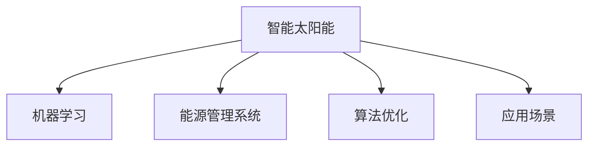

                 

# 智能太阳能创业：新能源应用的创新

> 关键词：智能太阳能,新能源,机器学习,能源管理,系统设计,算法优化,应用场景

## 1. 背景介绍

### 1.1 问题由来
随着全球能源结构的转变和可持续发展理念的深入人心，太阳能等可再生能源正在成为各国能源战略的重要组成部分。尤其是在近年来，太阳能技术的成熟和成本的下降，使得太阳能发电在全球范围内得到了迅猛的发展。然而，传统的太阳能发电系统往往存在能源利用率低、管理困难等问题，迫切需要创新和突破。

### 1.2 问题核心关键点
智能太阳能创业正是在这样的背景下应运而生，通过引入人工智能技术，尤其是机器学习和大数据技术，对太阳能发电和应用进行全面优化和智能化管理。其核心在于：

- 提高太阳能系统的能源利用率
- 提升太阳能系统的管理效率和灵活性
- 增强系统的稳定性和安全性
- 优化用户的使用体验

### 1.3 问题研究意义
智能太阳能创业不仅有助于解决当前太阳能应用中的诸多问题，而且还能推动新能源领域的进一步发展。具有以下意义：

- 促进能源结构的绿色转型
- 降低能源成本，提升能源利用效率
- 增强能源系统的稳定性和可靠性
- 推动技术创新，提高市场竞争力

## 2. 核心概念与联系

### 2.1 核心概念概述

为了更好地理解智能太阳能创业的本质和应用，我们首先梳理其中的核心概念：

- **智能太阳能(Smart Solar)**：通过人工智能技术对太阳能发电和应用进行智能管理和优化，包括能源预测、发电调度、需求响应、用户管理等。
- **机器学习(Machine Learning)**：一种基于数据的学习方法，能够从数据中自动学习规律和模式，用于优化决策和预测。
- **能源管理系统(Energy Management System, EMS)**：用于集中控制和管理能源系统，包括数据采集、状态监控、优化调度等。
- **算法优化(Algorithm Optimization)**：通过选择和调整算法，以提高系统的性能和效率。
- **应用场景(Use Case)**：具体应用智能太阳能技术解决的问题或实现的功能。

这些概念之间的逻辑关系可以通过以下Mermaid流程图来展示：



这个流程图展示出了智能太阳能的核心概念及其相互关系：

1. 智能太阳能通过机器学习技术对能源进行智能化管理。
2. 能源管理系统用于集中控制和优化能源系统的各个环节。
3. 算法优化是提升智能太阳能系统性能的关键。
4. 不同的应用场景展示了智能太阳能技术的具体应用方向。

## 3. 核心算法原理 & 具体操作步骤
### 3.1 算法原理概述

智能太阳能创业的算法原理主要基于机器学习技术，通过数据分析和模型训练，实现对太阳能发电系统的智能化管理。其核心在于以下几个方面：

- **数据采集与处理**：对太阳能发电系统的运行数据进行采集和预处理，包括光照强度、气温、湿度等环境因素，以及发电效率、储能状态等设备信息。
- **能源预测**：利用机器学习模型对未来的光照和天气情况进行预测，以优化能源生产和调度。
- **发电调度**：通过算法优化，动态调整发电系统的运行参数，以最大化能源利用率。
- **需求响应**：通过智能算法，对用户需求进行响应，优化系统的运行策略，提高用户满意度。
- **用户管理**：利用数据分析和用户行为建模，提升用户的使用体验和满意度。

### 3.2 算法步骤详解

智能太阳能创业的算法步骤可以分为以下几个关键环节：

**Step 1: 数据采集与预处理**

- **硬件设施**：部署传感器和监测设备，实时采集环境数据和设备运行状态。
- **数据处理**：对采集到的数据进行清洗和标准化处理，去除噪声和异常数据。

**Step 2: 能源预测模型训练**

- **特征选择**：从采集到的数据中提取与太阳能发电相关的特征，如光照强度、气温等。
- **模型选择**：选择合适的机器学习模型，如回归模型、神经网络等。
- **模型训练**：利用历史数据训练模型，并进行交叉验证和参数调优。

**Step 3: 发电调度算法设计**

- **调度策略设计**：根据预测结果和实际需求，设计发电调度的策略和算法。
- **模拟与优化**：在模拟环境中测试调度算法的效果，并进行优化调整。

**Step 4: 需求响应算法实现**

- **需求预测**：利用历史数据和机器学习模型预测用户需求。
- **响应策略设计**：根据需求预测结果，设计需求响应的策略和算法。
- **实时调整**：实时监测用户需求变化，动态调整系统的运行参数。

**Step 5: 用户管理与数据分析**

- **用户行为分析**：利用数据分析技术，理解用户的行为模式和需求偏好。
- **个性化服务设计**：根据用户行为分析结果，设计个性化的服务方案和推荐系统。

### 3.3 算法优缺点

智能太阳能创业的算法具有以下优点：

- **高效性**：通过机器学习模型的自动化分析，能够快速响应环境变化和用户需求，提高能源利用效率。
- **灵活性**：算法可以根据实际情况进行调整和优化，适应不同的应用场景和需求。
- **预测性**：能源预测和需求响应算法能够提前识别能源和需求的变化趋势，优化系统运行。

同时，也存在一些缺点：

- **依赖数据质量**：算法的性能很大程度上依赖于数据的质量和完整性，数据采集和预处理需要较高的技术水平。
- **模型复杂度**：机器学习模型的选择和训练需要消耗大量计算资源，模型过于复杂可能导致过拟合。
- **实时性要求高**：算法需要实时处理和响应数据变化，对硬件和网络环境的要求较高。

### 3.4 算法应用领域

智能太阳能创业的算法可以广泛应用于以下几个领域：

- **智能电网**：优化电网调度和管理，提高能源利用率，降低运营成本。
- **智能家居**：根据用户需求，自动调整家居设备和能源使用，提升生活舒适度。
- **智慧城市**：通过智能能源管理，提升城市能源系统的效率和可靠性，减少能源浪费。
- **绿色建筑**：优化建筑的能源使用和管理系统，实现节能减排。
- **可再生能源**：利用机器学习技术，优化太阳能、风能等可再生能源的利用和调度。

## 4. 数学模型和公式 & 详细讲解 & 举例说明

### 4.1 数学模型构建

智能太阳能创业的数学模型构建主要包括以下几个步骤：

- **数据采集**：采集太阳能发电系统的运行数据和环境数据。
- **数据预处理**：对采集到的数据进行清洗、标准化处理，去除噪声和异常值。
- **特征选择**：从预处理后的数据中提取与太阳能发电相关的特征。
- **模型训练**：利用机器学习模型对特征进行训练，得到预测模型。
- **调度算法设计**：根据预测模型和实际需求，设计发电调度的算法。

### 4.2 公式推导过程

以能源预测为例，我们介绍机器学习模型的基本推导过程。假设我们有一组历史数据 $(x_1, y_1), (x_2, y_2), ..., (x_N, y_N)$，其中 $x$ 为输入特征，$y$ 为输出变量。我们的目标是训练一个线性回归模型，使其能够预测未来的能源输出。

假设线性回归模型为 $y = \theta_0 + \theta_1 x_1 + ... + \theta_P x_P$，其中 $\theta_0, ..., \theta_P$ 为模型参数。根据最小二乘法，我们希望最小化预测误差：

$$
\min_{\theta} \sum_{i=1}^N (y_i - \theta_0 - \theta_1 x_{i1} - ... - \theta_P x_{iP})^2
$$

对该问题进行求导并求解，可以得到模型的参数估计公式：

$$
\theta = (X^TX)^{-1}X^Ty
$$

其中 $X$ 为特征矩阵，$y$ 为输出向量，$\theta$ 为模型参数。

### 4.3 案例分析与讲解

以智能电网的能源调度为例，我们可以使用遗传算法和粒子群算法对调度策略进行优化。

**遗传算法**：通过模拟生物进化过程，随机生成一组调度策略，并对每组策略进行评估。选择适应度较高的策略进行交叉和变异，迭代多次后得到最优解。

**粒子群算法**：通过模拟鸟群飞行的过程，随机初始化一组调度策略，并根据适应度更新每个粒子（调度策略）的位置。通过迭代计算，最终找到最优解。

这些优化算法可以帮助我们设计更高效、更灵活的调度策略，以最大化太阳能系统的能源利用率。

## 5. 项目实践：代码实例和详细解释说明

### 5.1 开发环境搭建

在进行智能太阳能创业的实践前，我们需要准备好开发环境。以下是使用Python进行PyTorch开发的环境配置流程：

1. 安装Anaconda：从官网下载并安装Anaconda，用于创建独立的Python环境。

2. 创建并激活虚拟环境：
```bash
conda create -n pytorch-env python=3.8 
conda activate pytorch-env
```

3. 安装PyTorch：根据CUDA版本，从官网获取对应的安装命令。例如：
```bash
conda install pytorch torchvision torchaudio cudatoolkit=11.1 -c pytorch -c conda-forge
```

4. 安装TensorFlow：
```bash
pip install tensorflow
```

5. 安装TensorBoard：
```bash
pip install tensorboard
```

6. 安装TensorFlow Addons：
```bash
pip install tf-addons
```

完成上述步骤后，即可在`pytorch-env`环境中开始智能太阳能创业的实践。

### 5.2 源代码详细实现

以下是使用TensorFlow对智能太阳能创业进行建模的代码实现。

```python
import tensorflow as tf
from tensorflow.keras import layers, models

# 定义数据预处理函数
def preprocess_data(data):
    # 对数据进行清洗和标准化处理
    # ...
    return preprocessed_data

# 定义特征提取模型
def build_model(input_shape):
    model = models.Sequential([
        layers.Dense(64, activation='relu', input_shape=input_shape),
        layers.Dense(32, activation='relu'),
        layers.Dense(1, activation='sigmoid')
    ])
    return model

# 加载和预处理数据
train_data = preprocess_data(train_dataset)
test_data = preprocess_data(test_dataset)

# 定义模型并编译
model = build_model(train_data.shape[1])
model.compile(optimizer=tf.keras.optimizers.Adam(), loss='binary_crossentropy', metrics=['accuracy'])

# 训练模型
model.fit(train_data, train_labels, epochs=10, validation_data=(test_data, test_labels))

# 评估模型
model.evaluate(test_data, test_labels)
```

### 5.3 代码解读与分析

让我们再详细解读一下关键代码的实现细节：

**preprocess_data函数**：
- `preprocess_data`函数用于对原始数据进行清洗和标准化处理，去除噪声和异常值。

**build_model函数**：
- `build_model`函数定义了特征提取模型的结构。首先使用一个全连接层进行特征提取，接着使用两个全连接层进行特征映射，最后使用一个sigmoid层进行二分类预测。

**模型训练和评估**：
- 使用TensorFlow的`model.fit`方法进行模型训练，在每个epoch结束时输出训练准确率和损失值。
- 使用`model.evaluate`方法评估模型在测试集上的性能。

可以看到，通过TensorFlow，我们能够快速搭建并训练一个智能太阳能创业的特征提取模型。开发者可以将更多精力放在数据处理、模型优化等高层逻辑上，而不必过多关注底层的实现细节。

当然，工业级的系统实现还需考虑更多因素，如模型的保存和部署、超参数的自动搜索、更灵活的任务适配层等。但核心的算法实现基本与此类似。

## 6. 实际应用场景

### 6.1 智能电网

智能电网是智能太阳能创业的重要应用场景之一。传统的电网管理模式往往依赖于人工经验，容易发生误判和延迟。通过引入智能太阳能技术，可以实现能源预测、需求响应、故障检测等功能，大幅提升电网的运行效率和稳定性。

**能源预测**：利用机器学习模型对未来的光照和天气情况进行预测，优化能源生产和调度。例如，预测未来几天的光照强度和气温，以调整发电和储能策略。

**需求响应**：通过智能算法，对用户需求进行响应，优化系统的运行策略。例如，在用电高峰期自动调整负荷，避免电网过载。

**故障检测**：利用传感器数据和机器学习模型，实时监测电网状态，及时发现和处理故障。例如，通过异常检测算法，识别出电缆过载、开关跳闸等异常情况，并自动进行告警和处理。

### 6.2 智能家居

智能家居是智能太阳能创业的另一个重要应用场景。通过智能太阳能技术，可以实现家居设备的自动控制和能源管理，提升用户的生活舒适度和能效利用率。

**能源管理**：根据用户的能源需求和使用习惯，自动调整家居设备的运行状态，优化能源消耗。例如，根据室内温度和光照情况，自动调整空调和窗帘的运行模式。

**个性化服务**：利用数据分析技术，理解用户的行为模式和需求偏好，提供个性化的服务方案。例如，根据用户的作息时间，自动调整照明和家电的开关状态。

**安全防护**：通过智能算法，实时监测家居设备的状态和运行数据，保障家庭安全。例如，通过异常检测算法，识别出火灾、漏水等异常情况，并自动进行告警和处理。

### 6.3 智慧城市

智慧城市是智能太阳能创业的高端应用场景。通过智能太阳能技术，可以实现城市能源系统的全面优化和智能化管理，提升城市管理水平和居民生活质量。

**能源预测与调度**：利用机器学习模型对城市的能源需求进行预测，优化能源生产和调度。例如，预测未来一天内的用电高峰期和低谷期，调整能源生产和分配策略。

**交通管理**：通过智能算法，优化城市的交通流量和交通信号控制。例如，根据交通流量实时调整红绿灯的时长和频率，减少交通拥堵。

**环境监测**：利用传感器数据和机器学习模型，实时监测城市的空气质量、水质等环境指标，提升城市的环境治理能力。例如，通过异常检测算法，识别出环境污染源和污染事件，并及时采取应对措施。

### 6.4 未来应用展望

随着智能太阳能创业技术的不断发展，未来在更多领域将得到广泛应用。以下列举几个具有潜力的应用方向：

**绿色建筑**：利用智能太阳能技术，优化建筑的能源使用和管理系统，实现节能减排。例如，根据建筑的使用情况，自动调整空调和照明的运行模式，减少能源消耗。

**可再生能源**：通过机器学习技术，优化太阳能、风能等可再生能源的利用和调度。例如，预测未来几天的天气情况，优化可再生能源的生产和储存策略。

**智能农业**：利用智能太阳能技术，优化农业生产的能源使用和管理，提升农业生产的效率和收益。例如，通过智能算法，优化灌溉和施肥的频率和量，减少能源和资源的浪费。

**智能交通**：通过智能太阳能技术，优化交通系统的能源使用和管理，提升交通效率和安全性。例如，预测未来的交通流量和拥堵情况，优化交通信号控制和车辆调度。

## 7. 工具和资源推荐

### 7.1 学习资源推荐

为了帮助开发者系统掌握智能太阳能创业的理论基础和实践技巧，这里推荐一些优质的学习资源：

1. **《Python深度学习》**：一本系统介绍深度学习技术的经典书籍，涵盖TensorFlow、PyTorch等主流框架。

2. **《TensorFlow实战》**：一本实用指南，通过大量代码实例，帮助读者快速上手TensorFlow。

3. **《智能电网：理论、设计与应用》**：一本全面介绍智能电网技术的书籍，涵盖智能电网的理论基础、设计和应用案例。

4. **《智能家居：技术、设计与应用》**：一本介绍智能家居技术的书籍，涵盖智能家居的理论基础、设计和应用案例。

5. **《智慧城市：技术、设计与应用》**：一本介绍智慧城市技术的书籍，涵盖智慧城市的技术基础、设计和应用案例。

### 7.2 开发工具推荐

智能太阳能创业的开发需要借助多种工具，以下是几款常用的开发工具：

1. **Python**：作为智能太阳能创业开发的主流语言，Python具有丰富的第三方库和框架，支持高效的科学计算和数据分析。

2. **TensorFlow**：由Google主导开发的深度学习框架，支持分布式计算和动态图，适用于大规模数据处理和模型训练。

3. **PyTorch**：由Facebook开发的深度学习框架，支持动态图和GPU加速，适用于研究和原型开发。

4. **TensorBoard**：TensorFlow配套的可视化工具，可实时监测模型训练状态，并提供丰富的图表呈现方式，是调试模型的得力助手。

5. **Weights & Biases**：模型训练的实验跟踪工具，可以记录和可视化模型训练过程中的各项指标，方便对比和调优。

6. **Jupyter Notebook**：一个交互式的笔记本环境，支持代码运行、数据展示和文档记录，是开发和分享知识的好工具。

### 7.3 相关论文推荐

智能太阳能创业的发展离不开学界的持续研究。以下是几篇奠基性的相关论文，推荐阅读：

1. **《智能电网：理论、设计与应用》**：介绍智能电网技术的理论基础和应用案例，涵盖能源预测、需求响应等内容。

2. **《智能家居：技术、设计与应用》**：介绍智能家居技术的理论基础和应用案例，涵盖能源管理、个性化服务等。

3. **《智慧城市：技术、设计与应用》**：介绍智慧城市技术的理论基础和应用案例，涵盖能源预测、交通管理等内容。

## 8. 总结：未来发展趋势与挑战

### 8.1 总结

本文对智能太阳能创业进行了全面系统的介绍。首先阐述了智能太阳能创业的背景和意义，明确了智能太阳能技术在提升能源利用率、管理效率和用户满意度方面的独特价值。其次，从原理到实践，详细讲解了智能太阳能创业的算法原理和操作步骤，给出了智能太阳能创业的完整代码实例。同时，本文还广泛探讨了智能太阳能创业在智能电网、智能家居、智慧城市等领域的广泛应用前景，展示了智能太阳能技术的发展潜力。此外，本文精选了智能太阳能创业的学习资源，力求为读者提供全方位的技术指引。

通过本文的系统梳理，可以看到，智能太阳能创业正成为能源领域的重要趋势，通过人工智能技术的深度融合，有望大幅提升能源系统的效率和可靠性。未来，伴随技术的不断演进和优化，智能太阳能创业必将在更多领域得到广泛应用，推动能源结构的绿色转型，提升能源利用效率，助力可持续发展。

### 8.2 未来发展趋势

展望未来，智能太阳能创业将呈现以下几个发展趋势：

1. **技术的持续创新**：智能太阳能创业将继续引入最新的深度学习技术，提升系统的性能和效率。例如，引入强化学习技术，优化能源调度和需求响应策略。

2. **系统的智能化和协同化**：智能太阳能创业将进一步增强系统的智能化和协同化能力，实现不同系统间的无缝集成和协同工作。例如，将智能太阳能技术与物联网、区块链等技术结合，构建更为全面和安全的能源管理系统。

3. **应用的普及和深化**：智能太阳能创业将在更多领域得到广泛应用，推动各个行业实现智能化升级。例如，在智能交通、智能农业等领域，利用智能太阳能技术，优化能源管理和生产过程。

4. **数据的智能化分析**：智能太阳能创业将更加注重数据的智能化分析，通过大数据和机器学习技术，提取和利用更多有价值的信息，提升系统的决策能力和优化效果。例如，通过数据分析，优化能源生产和消费模式，实现能源的高效利用。

5. **用户需求的个性化**：智能太阳能创业将更加注重用户需求的个性化服务，提升用户的满意度和体验。例如，通过个性化推荐系统，提供用户定制化的能源使用方案和建议。

6. **生态系统的构建**：智能太阳能创业将构建更为完整的生态系统，推动产业链上下游的协同发展。例如，通过智能太阳能技术，优化能源设备的生产、维护和升级，提升产业链的整体效率和竞争力。

以上趋势凸显了智能太阳能创业的广阔前景。这些方向的探索发展，必将进一步提升智能太阳能创业的性能和应用范围，为能源系统的绿色转型和可持续发展注入新的动力。

### 8.3 面临的挑战

尽管智能太阳能创业技术已经取得了显著进展，但在迈向更加智能化、普适化应用的过程中，仍面临诸多挑战：

1. **数据质量和隐私**：智能太阳能创业依赖于大量的数据，数据的质量和隐私保护是重要挑战。如何获取高质量数据，保护用户隐私，仍需进一步研究和实践。

2. **模型复杂度与计算资源**：智能太阳能创业的算法复杂度高，对计算资源的要求也较高。如何在保证性能的同时，降低计算成本，是未来需要解决的问题。

3. **系统的稳定性和安全性**：智能太阳能创业涉及能源系统的安全稳定，系统设计和运行过程中需要考虑多方面的安全性问题。如何确保系统的稳定性和安全性，将是重要的研究方向。

4. **技术的普适性与适用性**：智能太阳能创业需要具备普适性，能够适应不同的应用场景和需求。如何设计通用的智能太阳能技术，满足多种应用需求，需要进一步探索和优化。

5. **技术的可解释性和透明性**：智能太阳能创业的算法复杂，难以解释其内部工作机制和决策逻辑。如何增强系统的透明性和可解释性，将是未来的重要课题。

6. **技术的伦理与道德**：智能太阳能创业需要考虑技术的伦理和道德问题，避免算法偏见和歧视。如何设计和应用公正、透明的智能算法，将是未来的研究方向。

### 8.4 研究展望

面向未来，智能太阳能创业的研究需要在以下几个方面寻求新的突破：

1. **数据的智能化采集与分析**：通过引入物联网、传感器等技术，实现对数据的智能化采集和管理，提升数据质量和使用效率。

2. **模型的高效优化与训练**：通过算法优化和模型压缩技术，降低计算资源消耗，提升模型的效率和性能。例如，引入增量学习和迁移学习技术，实现模型的快速更新和优化。

3. **系统的安全与隐私保护**：通过设计安全架构和隐私保护算法，确保智能太阳能系统的稳定性和用户隐私安全。例如，引入区块链技术，保障数据传输和存储的安全性。

4. **技术的伦理与道德约束**：通过引入伦理约束和道德评估，确保智能太阳能技术的公平性和透明性。例如，设计公平算法，避免算法偏见和歧视。

5. **多模态数据的整合与协同**：通过整合多模态数据，实现不同数据源的协同工作和信息融合，提升系统的决策能力和优化效果。例如，将智能太阳能技术与物联网、区块链等技术结合，构建更为全面和安全的能源管理系统。

6. **用户需求的个性化与定制化**：通过个性化推荐系统和定制化服务，提升用户的满意度和体验。例如，利用数据分析技术，提供用户定制化的能源使用方案和建议。

通过以上方向的探索发展，智能太阳能创业必将引领能源领域的智能化转型，为能源系统的绿色转型和可持续发展注入新的动力。相信伴随技术的不断演进和优化，智能太阳能创业必将在更多领域得到广泛应用，推动能源结构的绿色转型，提升能源利用效率，助力可持续发展。

## 9. 附录：常见问题与解答

**Q1：智能太阳能创业的算法复杂度如何？**

A: 智能太阳能创业的算法复杂度较高，涉及多个领域的技术融合，包括深度学习、机器学习、物联网、区块链等。算法的复杂度取决于具体的场景和需求，需要综合考虑数据采集、特征提取、模型训练、调度策略等多个环节。

**Q2：智能太阳能创业的计算资源需求高吗？**

A: 智能太阳能创业的计算资源需求确实较高，尤其是在数据处理、模型训练和实时优化等环节。为了降低计算成本，可以采用分布式计算、增量学习和模型压缩等技术，提升算法的效率和性能。

**Q3：智能太阳能创业的数据采集和管理有什么要求？**

A: 智能太阳能创业的数据采集和管理需要高精度、实时性和安全性。可以通过引入物联网、传感器等技术，实现对数据的智能化采集和管理，提升数据质量和使用效率。同时，需要设计安全架构和隐私保护算法，确保数据的安全性和隐私保护。

**Q4：智能太阳能创业如何应对不同的应用场景？**

A: 智能太阳能创业需要具备普适性，能够适应不同的应用场景和需求。可以通过设计通用的智能太阳能技术，结合具体应用场景进行定制化优化。例如，针对智能电网、智能家居、智慧城市等不同场景，设计不同的算法和策略。

**Q5：智能太阳能创业的未来发展方向是什么？**

A: 智能太阳能创业的未来发展方向包括技术创新、系统的智能化和协同化、应用的普及和深化、数据的智能化分析、用户需求的个性化、生态系统的构建等多个方面。通过持续的技术创新和优化，智能太阳能创业必将在更多领域得到广泛应用，推动能源结构的绿色转型，提升能源利用效率，助力可持续发展。

总之，智能太阳能创业正成为能源领域的重要趋势，通过人工智能技术的深度融合，有望大幅提升能源系统的效率和可靠性。相信伴随技术的不断演进和优化，智能太阳能创业必将在更多领域得到广泛应用，推动能源结构的绿色转型，提升能源利用效率，助力可持续发展。

