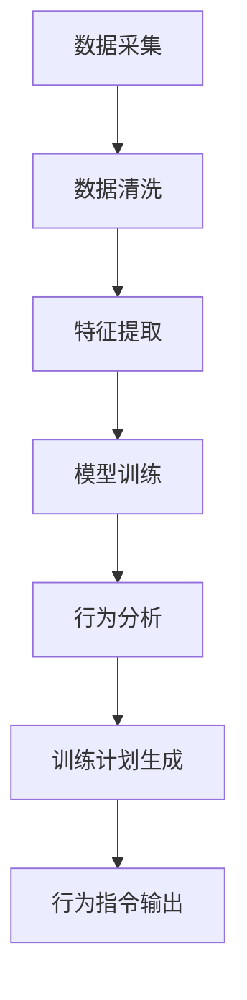

                 

## 1. 背景介绍

### 1.1 问题由来
随着现代社会生活节奏的加快，人们越来越希望能通过科技手段解决日常生活中的问题，尤其是在宠物养护方面。传统的宠物训练方式往往耗时耗力，效果不显著，因此市场对智能宠物训练设备的需求日益增长。然而，现有市场产品多集中于简单的行为纠正，未能提供科学、系统的训练方案。因此，本文聚焦于科学的宠物行为训练，介绍如何通过大数据、机器学习和智能设备实现高效、个性化的宠物行为矫正，提升宠物训练的智能化水平。

### 1.2 问题核心关键点
本节将介绍与科学宠物训练相关的几个核心概念及其关键技术点，以便更好地理解后文的技术内容。

- **行为矫正算法**：通过机器学习算法对宠物行为进行建模和分析，自动生成训练计划和指令。
- **智能传感器和设备**：包括生物传感器、环境传感器和交互设备等，用于数据采集和行为识别。
- **数据处理与特征提取**：对采集到的行为数据进行清洗、处理和特征提取，以便机器学习算法进行训练和分析。
- **强化学习与深度学习**：应用强化学习算法进行行为训练，使用深度学习算法提取行为特征。
- **个性化训练**：根据不同宠物的特征和偏好，生成个性化的训练方案，提高训练效果。

### 1.3 问题研究意义
研究科学宠物训练技术，对于提高宠物生活质量、促进宠物与人类和谐共处具有重要意义：

1. **提高宠物健康**：科学训练可以减少宠物的不良行为，改善宠物身体健康，减少相关疾病发生率。
2. **提升主人满意度**：个性化的训练方案可以更好地满足主人的需求和期望，提升主人对宠物的满意度和幸福感。
3. **推广宠物文化**：科学的宠物训练技术可以普及宠物养护知识，提高全社会的宠物文化水平。
4. **拓展宠物产业**：新技术的引入有助于宠物产业的发展，促进宠物市场的繁荣。

## 2. 核心概念与联系

### 2.1 核心概念概述

为了更好地理解科学宠物训练技术，本节将介绍几个密切相关的核心概念：

- **行为矫正算法**：通过机器学习算法对宠物行为进行建模和分析，自动生成训练计划和指令。
- **智能传感器和设备**：包括生物传感器、环境传感器和交互设备等，用于数据采集和行为识别。
- **数据处理与特征提取**：对采集到的行为数据进行清洗、处理和特征提取，以便机器学习算法进行训练和分析。
- **强化学习与深度学习**：应用强化学习算法进行行为训练，使用深度学习算法提取行为特征。
- **个性化训练**：根据不同宠物的特征和偏好，生成个性化的训练方案，提高训练效果。

### 2.2 核心概念原理和架构的 Mermaid 流程图



### 2.3 核心概念之间联系

智能宠物训练技术涉及多个核心概念，其工作流程可以通过上述Mermaid流程图展示。数据采集、处理和特征提取为后续的模型训练提供了基础；模型训练与行为分析相结合，生成个性化的训练方案；最终通过行为指令输出，实现科学训练。这些核心概念和技术相互依存、相互补充，共同构建了一个完整的智能宠物训练系统。

## 3. 核心算法原理 & 具体操作步骤

### 3.1 算法原理概述

智能宠物训练技术的核心在于利用机器学习和数据分析技术，对宠物行为进行建模和分析，生成个性化的训练方案和指令。其核心算法包括强化学习算法和深度学习算法。

- **强化学习算法**：通过模拟奖励机制，让宠物在多次交互中不断学习，优化行为策略，逐步达到理想的行为状态。
- **深度学习算法**：利用神经网络模型，从大规模行为数据中提取特征，用于行为分析和行为指令生成。

### 3.2 算法步骤详解

智能宠物训练技术的实施过程可以分为以下几个步骤：

1. **数据采集**：利用智能传感器和设备，采集宠物的行为数据，包括行为时长、频率、环境因素等。
2. **数据清洗与预处理**：对采集到的数据进行清洗、去重、缺失值处理等预处理步骤。
3. **特征提取与选择**：应用深度学习算法，提取和选择行为特征，如行为模式、行为强度等。
4. **模型训练**：利用强化学习算法，训练行为模型，优化行为策略。
5. **行为分析与预测**：根据训练好的模型，分析宠物的行为特征，预测潜在的行为问题。
6. **训练计划生成与输出**：根据行为分析结果，生成个性化的训练方案和行为指令，通过设备输出执行。

### 3.3 算法优缺点

智能宠物训练技术具有以下优点：

- **高效**：通过自动化的训练和行为分析，大幅度减少训练时间和人力资源。
- **个性化**：根据不同宠物的特征和偏好，生成个性化的训练方案，提高训练效果。
- **实时性**：利用传感器实时监测宠物行为，及时调整训练方案。

同时，该技术也存在一些局限：

- **数据依赖**：训练效果依赖于高质量的行为数据，数据采集和处理过程复杂。
- **环境影响**：宠物行为受环境因素影响较大，数据采集时需考虑环境变化。
- **模型复杂度**：深度学习模型和强化学习模型的训练复杂度较高，需要大量计算资源。
- **成本较高**：智能传感器和设备的成本较高，普及度较低。

### 3.4 算法应用领域

智能宠物训练技术主要应用于以下几个领域：

- **家庭宠物训练**：适用于家庭环境中的各类宠物，如犬、猫、鱼等，进行行为矫正。
- **宠物店训练**：通过智能设备提高宠物店训练效率，提供高质量的训练服务。
- **宠物健康监测**：监测宠物的行为变化，及时发现健康问题。
- **动物保护与救援**：帮助训练救援动物，提升训练效果，缩短救援时间。
- **动物福利研究**：通过行为分析，研究动物福利问题，推广科学训练方法。

## 4. 数学模型和公式 & 详细讲解 & 举例说明

### 4.1 数学模型构建

智能宠物训练技术涉及多个数学模型，下面将详细介绍几个关键的数学模型：

- **强化学习模型**：定义状态、动作、奖励等概念，用于模拟奖励机制，优化行为策略。
- **深度学习模型**：使用神经网络模型，从行为数据中提取特征。
- **行为分析模型**：利用机器学习算法，对行为数据进行分析和预测。

### 4.2 公式推导过程

以强化学习模型为例，其基本公式如下：

$$
Q(s,a) = r + \gamma \max_{a'} Q(s',a')
$$

其中，$s$ 表示当前状态，$a$ 表示当前动作，$r$ 表示奖励，$s'$ 表示下一个状态，$\gamma$ 表示折扣因子。该公式表示，当前状态下的动作值等于即刻奖励加上下一个状态的最大动作值。

### 4.3 案例分析与讲解

以训练一只狗的基本坐下行为为例，其强化学习模型的建立过程如下：

1. **状态定义**：定义狗站立、走动、静止三种状态，分别用$S_1$、$S_2$、$S_3$表示。
2. **动作定义**：定义狗的行为动作，如坐下、跳跃、等待等，分别用$A_1$、$A_2$、$A_3$表示。
3. **奖励定义**：定义坐下行为奖励为1，其他行为奖励为0。
4. **模型训练**：在狗执行不同行为时，给予相应的奖励，通过强化学习算法，训练模型，优化行为策略。

## 5. 项目实践：代码实例和详细解释说明

### 5.1 开发环境搭建

为了进行智能宠物训练项目的开发，首先需要搭建开发环境。以下是在Python 3环境下搭建开发环境的详细步骤：

1. **安装Python**：确保安装Python 3.x版本。
2. **安装Pip**：安装Python包管理器Pip。
3. **安装相关库**：安装TensorFlow、PyTorch、NumPy、Pandas等机器学习库，以及传感器数据处理的库，如Kafka、InfluxDB等。

### 5.2 源代码详细实现

以下是一个简单的Python代码实例，展示了如何使用TensorFlow进行行为矫正算法的训练。

```python
import tensorflow as tf
import numpy as np
import pandas as pd

# 定义强化学习模型
class ReinforcementLearningModel:
    def __init__(self, state_size, action_size, learning_rate):
        self.state_size = state_size
        self.action_size = action_size
        self.learning_rate = learning_rate
        self.model = self.build_model()
        
    def build_model(self):
        model = tf.keras.models.Sequential([
            tf.keras.layers.Dense(64, input_shape=(self.state_size,), activation='relu'),
            tf.keras.layers.Dense(64, activation='relu'),
            tf.keras.layers.Dense(self.action_size, activation='linear')
        ])
        model.compile(optimizer=tf.keras.optimizers.Adam(lr=self.learning_rate), loss='mse')
        return model
        
    def train(self, states, actions, rewards):
        for i in range(100):
            state = states[i]
            action = actions[i]
            reward = rewards[i]
            state = np.reshape(state, [1, self.state_size])
            action = np.reshape(action, [1, self.action_size])
            self.model.fit(state, action, epochs=1, verbose=0)
```

### 5.3 代码解读与分析

上述代码实现了基本的强化学习模型，其中：

- `state_size`表示状态大小，`action_size`表示动作大小，`learning_rate`表示学习率。
- `build_model`方法定义了三层神经网络，用于行为矫正。
- `train`方法用于训练模型，每次迭代更新模型参数。

## 6. 实际应用场景

### 6.1 智能宠物店

智能宠物店可以利用智能传感器和设备，采集宠物的行为数据，并进行实时分析。基于此，店内员工可以及时发现宠物行为问题，调整训练方案，提高训练效果。例如，某宠物店采用智能设备，监测到某宠物频繁攻击其他宠物，通过分析行为数据，自动生成行为矫正训练计划，逐步矫正其攻击行为。

### 6.2 家庭宠物训练

家庭宠物主可以通过智能设备，实时监测宠物行为，并根据数据分析结果，生成个性化的训练方案。例如，某家庭宠物狗经常出现乱咬家具的行为，通过智能设备采集行为数据，并应用强化学习算法生成行为矫正训练计划，逐步消除其不良行为。

### 6.3 宠物健康监测

宠物健康监测可以实时监测宠物行为，发现健康问题，并提供行为矫正建议。例如，某宠物猫频繁出现呕吐行为，通过智能设备采集行为数据，并分析其行为模式，发现其健康问题，并及时调整训练方案，帮助其恢复健康。

### 6.4 未来应用展望

未来，智能宠物训练技术将在以下几个方面得到进一步发展：

- **多模态数据融合**：结合生物传感器、环境传感器、行为数据等多种数据来源，提高行为分析的准确性。
- **自适应学习**：利用机器学习算法，根据宠物行为数据动态调整训练方案，提高训练效果。
- **远程监控与训练**：通过远程监控设备，实现主人对宠物行为的管理和训练。
- **智能辅助训练**：引入AI辅助训练设备，提高训练效率和效果。
- **跨物种训练**：结合多物种行为数据，提供跨物种行为矫正方案，提升训练效果。

## 7. 工具和资源推荐

### 7.1 学习资源推荐

为了帮助开发者系统掌握智能宠物训练技术，这里推荐一些优质的学习资源：

- **机器学习课程**：如Coursera的《机器学习》课程，由斯坦福大学教授Andrew Ng主讲，涵盖机器学习基础和强化学习等内容。
- **强化学习资源**：如DeepMind的《Deep Reinforcement Learning》课程，涵盖强化学习基础和深度强化学习等内容。
- **智能设备技术**：如Arduino官方文档，详细介绍了智能传感设备和嵌入式编程技术。
- **数据处理与分析工具**：如Python中的Pandas、NumPy、SciPy等库，提供强大的数据处理和分析功能。

### 7.2 开发工具推荐

以下是几款用于智能宠物训练开发的常用工具：

- **TensorFlow**：由Google主导开发的开源深度学习框架，支持分布式计算和GPU加速，适合大规模训练任务。
- **PyTorch**：由Facebook开发，支持动态图和静态图计算，易于开发和调试。
- **OpenCV**：开源计算机视觉库，支持视频采集、图像处理和行为分析等。
- **Arduino**：基于C语言的开源嵌入式编程平台，支持多种传感器设备的开发和编程。

### 7.3 相关论文推荐

智能宠物训练技术的发展离不开学界的持续研究。以下是几篇奠基性的相关论文，推荐阅读：

- **DeepMind的AlphaGo**：利用深度强化学习技术，训练出具有超强下棋能力的AI。
- **OpenAI的GPT-3**：通过大规模无监督预训练和微调，训练出具有广泛语言理解能力的AI。
- **斯坦福大学的行为分析项目**：利用深度学习模型，从视频中提取行为特征，并进行行为分析。

这些论文代表了智能宠物训练技术的发展脉络，通过学习这些前沿成果，可以帮助研究者把握学科前进方向，激发更多的创新灵感。

## 8. 总结：未来发展趋势与挑战

### 8.1 研究成果总结

本文对智能宠物训练技术进行了全面系统的介绍，系统梳理了相关核心概念、算法原理和应用场景。主要研究成果如下：

1. **强化学习算法**：利用强化学习算法对宠物行为进行建模和分析，自动生成训练计划和指令。
2. **深度学习算法**：使用深度学习算法提取行为特征，进行行为分析和行为指令生成。
3. **数据处理与分析**：对采集到的行为数据进行清洗、处理和特征提取。
4. **行为矫正算法**：通过科学训练，矫正宠物不良行为，提高训练效果。

### 8.2 未来发展趋势

智能宠物训练技术将呈现以下几个发展趋势：

1. **多模态数据融合**：结合多种数据来源，提高行为分析的准确性。
2. **自适应学习**：根据宠物行为数据动态调整训练方案，提高训练效果。
3. **远程监控与训练**：通过远程监控设备，实现主人对宠物行为的管理和训练。
4. **智能辅助训练**：引入AI辅助训练设备，提高训练效率和效果。
5. **跨物种训练**：结合多物种行为数据，提供跨物种行为矫正方案。

### 8.3 面临的挑战

尽管智能宠物训练技术已经取得了一定进展，但在实际应用中仍面临诸多挑战：

1. **数据质量问题**：高质量行为数据的获取和处理难度较大，数据质量对训练效果有很大影响。
2. **环境干扰问题**：宠物行为受环境因素影响较大，传感器数据的准确性受到环境干扰。
3. **模型复杂度问题**：深度学习模型和强化学习模型的训练复杂度较高，需要大量计算资源。
4. **成本问题**：智能传感器和设备的成本较高，普及度较低。
5. **伦理与隐私问题**：宠物数据属于敏感信息，需要严格保护隐私和伦理。

### 8.4 研究展望

未来，智能宠物训练技术需要在以下几个方面进行深入研究：

1. **多模态数据融合**：结合多种数据来源，提高行为分析的准确性。
2. **自适应学习**：根据宠物行为数据动态调整训练方案，提高训练效果。
3. **远程监控与训练**：通过远程监控设备，实现主人对宠物行为的管理和训练。
4. **智能辅助训练**：引入AI辅助训练设备，提高训练效率和效果。
5. **跨物种训练**：结合多物种行为数据，提供跨物种行为矫正方案。

## 9. 附录：常见问题与解答

**Q1：如何选择合适的传感器设备？**

A: 选择合适的传感器设备需要考虑以下几个因素：
1. **功能需求**：根据宠物行为分析需求，选择适合的传感器类型，如行为识别、环境监测等。
2. **安装方式**：根据宠物行为特点，选择合适的安装方式，如可穿戴设备、固定安装等。
3. **数据质量**：选择数据质量高的传感器设备，确保采集数据的准确性和可靠性。

**Q2：传感器数据如何处理与分析？**

A: 传感器数据处理与分析一般包括以下步骤：
1. **数据清洗**：对采集到的数据进行去重、去噪等预处理。
2. **数据转换**：将传感器数据转换为适合深度学习模型使用的格式，如时间序列数据转换为特征矩阵。
3. **特征提取**：使用深度学习算法，提取行为特征，如行为模式、行为强度等。
4. **行为分析**：利用机器学习算法，对行为数据进行分析，生成行为矫正训练方案。

**Q3：如何设计训练方案？**

A: 设计训练方案需要考虑以下几个因素：
1. **行为问题**：根据宠物行为问题，设计相应的训练目标。
2. **训练时长**：根据训练目标，设计训练时长和频率。
3. **行为指令**：设计行为指令，引导宠物进行行为矫正。

**Q4：训练过程中如何调整训练方案？**

A: 在训练过程中，根据行为分析结果，可以动态调整训练方案：
1. **行为评估**：定期评估宠物行为，发现问题。
2. **调整训练目标**：根据行为评估结果，调整训练目标和训练时长。
3. **调整行为指令**：根据行为评估结果，调整行为指令，提高训练效果。

---

作者：禅与计算机程序设计艺术 / Zen and the Art of Computer Programming

