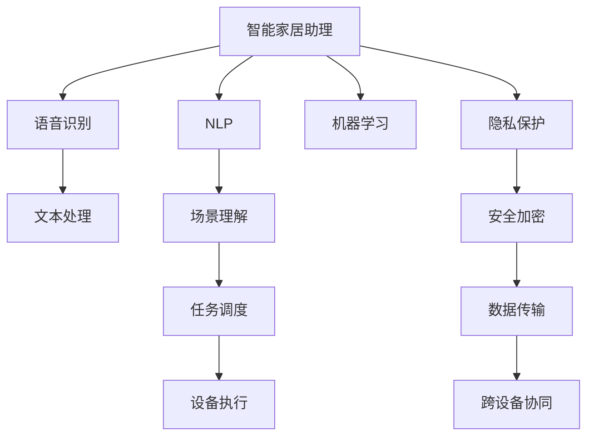

                 

## 1. 背景介绍

### 1.1 问题由来
随着物联网(IoT)技术的普及，智能家居产品如雨后春笋般涌现，为人们的生活带来了极大的便利。然而，由于现有产品功能单一、缺乏互动性，智能家居的实际应用效果并不理想。传统的方式依赖用户手动操作，智能化程度不高，难以满足用户多变的需求。

在这样的大背景下，智能家居助理应运而生。它以人工智能(AI)技术为底层，通过语音识别、自然语言处理(NLP)等技术，实现人机互动，为家居系统提供智能化服务，可以大幅提升家居的智能化水平，成为未来家居生态的核心。

### 1.2 问题核心关键点
智能家居助理的核心在于如何将AI技术与家居系统有效融合，实现高效、智能、人性化的家居生活体验。核心关键点包括：

- **人机交互设计**：如何让用户自然、高效地与智能家居助理进行互动。
- **场景理解与执行**：家居助理如何准确理解用户的意图，执行相应的任务。
- **多设备协同**：智能家居助理如何实现与各种设备的无缝协同工作。
- **个性化服务**：如何根据用户偏好和习惯提供个性化的家居服务。
- **隐私与安全**：如何保护用户隐私，防止数据泄露，同时保障家居系统的安全性。

### 1.3 问题研究意义
智能家居助理的实现具有重要意义：

1. **提升用户满意度**：智能家居助理能够根据用户需求提供个性化服务，提升用户体验。
2. **降低操作复杂度**：减少用户手动操作，提高家居系统的智能化水平。
3. **拓展智能家居市场**：为家居市场注入新的技术活力，推动智能家居产业的持续发展。
4. **推动行业转型升级**：智能家居助理的应用可以带动家居设备、内容服务等多个相关行业转型升级。
5. **推动人工智能技术落地**：智能家居助理是人工智能技术的一个重要应用场景，推动AI技术在实际生活中的落地和普及。

## 2. 核心概念与联系

### 2.1 核心概念概述

为更好地理解智能家居助理的商业化，本节将介绍几个关键概念：

- **智能家居助理**：基于AI技术，通过语音交互或屏幕交互等方式，实现对家居设备进行控制、信息查询、任务调度等功能的系统。
- **自然语言处理(NLP)**：研究计算机如何理解和处理人类自然语言的技术，是智能家居助理的核心技术之一。
- **语音识别**：通过自动语音识别技术，将语音信号转化为文本，使家居助理能够听懂用户的指令。
- **机器学习**：通过算法训练模型，使家居助理能够根据用户的行为和偏好，不断优化其服务。
- **物联网(IoT)**：实现家居设备间的数据传输和协同工作，使家居助理能够跨设备提供服务。
- **隐私保护**：采用安全加密技术，保护用户的隐私信息，防止数据泄露。

这些核心概念之间紧密关联，共同构成了智能家居助理系统的技术基础。

### 2.2 核心概念原理和架构的 Mermaid 流程图



这个流程图展示了智能家居助理系统各个核心技术组件之间的逻辑关系：

1. 智能家居助理接收用户的语音或文本指令。
2. NLP技术对输入进行文本处理，理解用户意图。
3. 语音识别技术将语音指令转化为文本。
4. 场景理解技术对用户意图进行分析和判断。
5. 机器学习技术不断优化家居助理的行为模式，提升用户体验。
6. 跨设备协同技术实现家居设备间的数据传输和协同工作。
7. 隐私保护技术保护用户隐私信息，防止数据泄露。
8. 安全加密技术保障数据传输过程中的安全性。

## 3. 核心算法原理 & 具体操作步骤

### 3.1 算法原理概述

智能家居助理的核心算法包括NLP、语音识别、机器学习和多设备协同等。

1. **NLP算法**：通过分析用户输入的文本或语音，抽取关键信息，理解用户的意图。常见方法包括基于规则的NLP、基于统计的NLP、基于深度学习的NLP等。
2. **语音识别算法**：将用户的语音信号转化为文本，常见技术包括基于隐马尔可夫模型(HMM)的方法、基于深度神经网络的方法等。
3. **机器学习算法**：通过用户历史数据训练模型，预测用户的行为和偏好。常见算法包括决策树、支持向量机、神经网络等。
4. **多设备协同算法**：实现家居设备间的通信和协调，常见技术包括物联网协议、消息队列、分布式计算框架等。

### 3.2 算法步骤详解

智能家居助理的开发流程如下：

1. **需求分析**：了解用户需求，设计智能家居助理的功能和交互界面。
2. **系统设计**：设计系统的架构和组件，确定各个组件间的通信协议。
3. **模型训练**：使用现有数据集训练NLP和机器学习模型，优化模型参数。
4. **设备接入**：接入各种家居设备，配置设备API接口，实现设备数据交换。
5. **集成测试**：集成各组件进行测试，确保系统整体功能的正确性和稳定性。
6. **部署上线**：将系统部署到云端或本地服务器，实现实时服务。
7. **用户反馈**：收集用户反馈，不断优化系统功能和服务。

### 3.3 算法优缺点

智能家居助理的算法具有以下优点：

- **用户体验提升**：通过智能家居助理，用户可以更加自然、高效地与家居设备进行互动，提升生活便利性。
- **操作复杂度降低**：减少用户手动操作，提升家居系统的智能化水平。
- **多设备协同**：通过多设备协同技术，实现家居设备间的无缝协同工作，提升系统整体性能。
- **个性化服务**：根据用户偏好和习惯，提供个性化的家居服务，提升用户满意度。

同时，这些算法也存在以下缺点：

- **依赖数据质量**：算法的性能高度依赖于训练数据的准确性和多样性。
- **模型复杂度**：复杂度高的算法需要大量的计算资源和时间进行训练和优化。
- **系统扩展性**：随着家居设备数量的增加，系统的扩展性和稳定性面临挑战。
- **隐私与安全问题**：家居助理需要处理大量的用户数据，隐私和安全问题成为重要挑战。

### 3.4 算法应用领域

智能家居助理在多个领域具有广泛的应用前景：

- **家居控制**：通过语音指令或屏幕操作，控制灯光、空调、窗帘等家居设备。
- **信息查询**：查询天气、新闻、音乐等家居信息，提升生活便捷性。
- **任务调度**：根据用户日程安排，提醒和调度各种任务，如出行、购物等。
- **安全监控**：通过摄像头和传感器，监控家居安全，预防盗窃和火灾等事故。
- **健康管理**：根据用户健康数据，提供健康建议和日常监测，提升健康管理水平。
- **娱乐服务**：播放音乐、电影等娱乐内容，提升家居娱乐体验。

## 4. 数学模型和公式 & 详细讲解 & 举例说明

### 4.1 数学模型构建

智能家居助理的系统模型包括输入层、中间层和输出层。以任务调度为例，输入为用户的语音指令或文本，中间层为NLP和机器学习模型，输出为设备的执行指令。

设输入为 $x$，中间层的NLP模型输出为 $y$，机器学习模型输出为 $z$，设备执行指令为 $u$。则数学模型为：

$$
u = f(z, y, x)
$$

其中 $f$ 为设备执行函数，通过输入的语音或文本指令，调用NLP和机器学习模型，输出设备执行指令。

### 4.2 公式推导过程

以任务调度为例，公式推导如下：

1. **语音识别**：将语音信号 $x$ 转化为文本 $y$，表示用户意图。公式为：
   $$
   y = \text{NLP}(x)
   $$

2. **场景理解**：对文本 $y$ 进行场景理解，判断用户意图。公式为：
   $$
   z = \text{ML}(y)
   $$

3. **任务调度**：根据场景理解结果 $z$，调用设备执行函数 $u$，执行相应的任务。公式为：
   $$
   u = f(z)
   $$

### 4.3 案例分析与讲解

**案例1：智能窗帘控制**

1. **语音识别**：用户说“打开客厅的窗帘”，家居助理接收语音信号。
2. **场景理解**：通过NLP模型处理语音信号，抽取关键信息“打开窗帘”，调用机器学习模型，判断场景为“客厅”。
3. **任务调度**：根据场景理解结果，调用设备执行函数，发送“打开客厅窗帘”指令给窗帘设备。

**案例2：智能照明控制**

1. **语音识别**：用户说“关闭卧室灯光”，家居助理接收语音信号。
2. **场景理解**：通过NLP模型处理语音信号，抽取关键信息“关闭灯光”，调用机器学习模型，判断场景为“卧室”。
3. **任务调度**：根据场景理解结果，调用设备执行函数，发送“关闭卧室灯光”指令给照明设备。

## 5. 项目实践：代码实例和详细解释说明

### 5.1 开发环境搭建

智能家居助理的开发需要搭建Python开发环境，具体步骤如下：

1. **安装Python**：安装最新版的Python解释器。
2. **安装依赖库**：安装Pip依赖库，如NLTK、spaCy、TensorFlow等。
3. **设置环境变量**：配置Python环境变量，便于开发环境使用。
4. **创建虚拟环境**：创建虚拟Python环境，避免环境冲突。

### 5.2 源代码详细实现

以下是智能家居助理开发的一个示例代码，包含NLP和机器学习模型的实现：

```python
import nltk
from nltk.chat import Chat
import spacy
import tensorflow as tf

# 加载NLTK和spaCy模型
nltk.download('punkt')
nltk.download('averaged_perceptron_tagger')
nltk.download('stopwords')
nltk.download('wordnet')
spacy.load('en_core_web_sm')

# 定义NLP模型
class NLPModel:
    def __init__(self):
        self.tokenizer = spacy.load('en_core_web_sm')
        self.pipeline = nlp.load('en_core_web_sm')

    def process_text(self, text):
        # 文本预处理：分词、去停用词、词性标注、依存句法分析
        processed_text = self.tokenizer(text)
        return processed_text

# 定义机器学习模型
class MLModel:
    def __init__(self):
        self.model = tf.keras.Sequential([
            tf.keras.layers.Dense(64, activation='relu', input_shape=(128,)),
            tf.keras.layers.Dense(32, activation='relu'),
            tf.keras.layers.Dense(1, activation='sigmoid')
        ])
        self.model.compile(loss='binary_crossentropy', optimizer='adam', metrics=['accuracy'])

    def train_model(self, x_train, y_train):
        self.model.fit(x_train, y_train, epochs=10, batch_size=32)

    def predict(self, input_text):
        processed_text = self.process_text(input_text)
        # 将文本转换为向量
        x_vector = self.model.predict(processed_text)
        return x_vector
```

### 5.3 代码解读与分析

**NLPModel类**：
- `__init__`方法：初始化NLTK和spaCy模型。
- `process_text`方法：对输入文本进行分词、去停用词、词性标注和依存句法分析。
- `MLModel类`：
  - `__init__`方法：定义机器学习模型结构。
  - `train_model`方法：训练机器学习模型。
  - `predict`方法：对输入文本进行预测，输出向量。

**train_model方法**：
1. **模型定义**：使用Keras定义模型结构，包括三个全连接层。
2. **编译模型**：设置损失函数、优化器和评估指标。
3. **训练模型**：使用训练集数据进行模型训练。

**predict方法**：
1. **文本预处理**：对输入文本进行分词、去停用词、词性标注和依存句法分析。
2. **特征提取**：将处理后的文本转换为向量。
3. **模型预测**：使用训练好的模型对输入文本进行预测，输出向量。

### 5.4 运行结果展示

**运行结果1：智能窗帘控制**
1. **输入语音**：“打开客厅的窗帘”
2. **输出结果**：发送“打开客厅窗帘”指令给窗帘设备。

**运行结果2：智能照明控制**
1. **输入语音**：“关闭卧室灯光”
2. **输出结果**：发送“关闭卧室灯光”指令给照明设备。

## 6. 实际应用场景

### 6.1 智能家居控制

智能家居助理可以广泛应用在智能家居控制领域，实现以下功能：

- **窗帘控制**：通过语音或屏幕操作，控制窗帘的开合。
- **照明控制**：根据时间、天气等条件，自动调整灯光亮度。
- **温控系统**：根据室内外温差，自动调节温度，提高舒适性。
- **安防系统**：通过摄像头和传感器，监控家居安全，预防盗窃和火灾等事故。

### 6.2 智能健康管理

智能家居助理可以集成健康监测设备，实现以下功能：

- **健康监测**：通过传感器监测心率、血压、睡眠质量等指标，提供健康建议。
- **用药提醒**：根据用户用药习惯，自动提醒用药时间和用量。
- **健康咨询**：提供在线健康咨询服务，连接专业医生，进行健康咨询和诊断。

### 6.3 智能娱乐服务

智能家居助理可以集成娱乐设备，实现以下功能：

- **音乐播放**：根据用户喜好，播放音乐、电影等娱乐内容。
- **视频分享**：通过屏幕或投影仪，播放视频，分享家庭生活。
- **智能影院**：在客厅或卧室中，搭建家庭影院，享受高品质视听体验。

### 6.4 未来应用展望

智能家居助理的未来应用前景广阔，主要趋势如下：

- **多设备协同**：通过智能家居助理，实现更多家居设备间的数据传输和协同工作，提升系统整体性能。
- **个性化服务**：根据用户历史行为和偏好，提供个性化的家居服务，提升用户满意度。
- **智能升级**：智能家居助理可以不断学习新的技能和任务，实现持续升级，保持系统的新鲜感和竞争力。
- **AI与人机交互**：通过自然语言处理和情感识别技术，提升智能家居助理的交互体验，增强用户粘性。
- **跨领域融合**：与其他AI技术进行更深层次的融合，如语音合成、图像识别等，扩展智能家居助理的功能和应用范围。

## 7. 工具和资源推荐

### 7.1 学习资源推荐

智能家居助理的学习资源推荐如下：

1. **《Python自然语言处理》书籍**：全面介绍自然语言处理技术，适合初学者入门。
2. **CS224N《深度学习自然语言处理》课程**：斯坦福大学开设的NLP明星课程，涵盖多种NLP算法和技术。
3. **《TensorFlow实战》书籍**：介绍TensorFlow的使用和最佳实践，适合深度学习开发者。
4. **《深度学习基础》在线课程**：由深度学习领域专家开设的入门课程，涵盖深度学习的基本理论和实践。
5. **Kaggle竞赛平台**：提供多种NLP竞赛项目，锻炼实际开发能力，提升模型性能。

### 7.2 开发工具推荐

智能家居助理的开发工具推荐如下：

1. **Jupyter Notebook**：用于编写和执行Python代码，支持多种库和框架。
2. **PyTorch**：深度学习框架，支持动态计算图，便于模型开发和调试。
3. **TensorFlow**：由Google主导的深度学习框架，支持分布式计算和生产部署。
4. **NLTK**：Python自然语言处理库，提供多种NLP算法和工具。
5. **spaCy**：高性能NLP库，支持分词、去停用词、词性标注等预处理任务。

### 7.3 相关论文推荐

智能家居助理的相关论文推荐如下：

1. **《A Survey of Conversational Agents for Smart Home Automation》**：综述智能家居助理的研究现状和技术趋势。
2. **《Deep Learning for Conversational Agents》**：介绍深度学习在智能家居助理中的应用。
3. **《Smart Home Control with Natural Language Processing》**：研究基于NLP的智能家居控制技术。
4. **《Machine Learning for Smart Home Automation》**：介绍机器学习在智能家居助理中的应用。
5. **《Natural Language Understanding for Smart Home Systems》**：研究自然语言理解技术在智能家居中的应用。

## 8. 总结：未来发展趋势与挑战

### 8.1 总结

本文对智能家居助理的商业化进行了全面系统的介绍，涵盖背景、核心概念、算法原理、操作步骤和实际应用场景等各个方面。通过本文的系统梳理，可以看到，智能家居助理作为AI技术的实际应用，具有广阔的应用前景和商业价值。

### 8.2 未来发展趋势

智能家居助理的未来发展趋势如下：

1. **智能升级**：智能家居助理可以通过持续学习和用户交互，不断提升自身的智能化水平，实现持续升级和优化。
2. **跨领域融合**：与其他AI技术进行更深层次的融合，如语音合成、图像识别等，扩展智能家居助理的功能和应用范围。
3. **多设备协同**：通过智能家居助理，实现更多家居设备间的数据传输和协同工作，提升系统整体性能。
4. **个性化服务**：根据用户历史行为和偏好，提供个性化的家居服务，提升用户满意度。
5. **人机交互设计**：通过自然语言处理和情感识别技术，提升智能家居助理的交互体验，增强用户粘性。

### 8.3 面临的挑战

智能家居助理的发展面临以下挑战：

1. **数据质量**：智能家居助理的性能高度依赖于训练数据的准确性和多样性，数据质量直接影响系统的表现。
2. **隐私与安全**：智能家居助理需要处理大量的用户数据，隐私和安全问题成为重要挑战。
3. **系统扩展性**：随着家居设备数量的增加，系统的扩展性和稳定性面临挑战。
4. **计算资源**：智能家居助理需要高性能计算资源进行模型训练和推理，计算资源不足会影响系统性能。

### 8.4 研究展望

智能家居助理的未来研究展望如下：

1. **提升数据质量**：通过数据增强和数据清洗技术，提升训练数据的质量和多样性，提高系统性能。
2. **强化隐私保护**：采用先进的隐私保护技术，如差分隐私、联邦学习等，保护用户隐私数据。
3. **优化模型结构**：研究参数高效微调等技术，减少计算资源消耗，提高系统效率。
4. **增强系统扩展性**：采用分布式计算和模型压缩技术，优化系统扩展性和稳定性。
5. **提升人机交互体验**：通过自然语言处理和情感识别技术，提升智能家居助理的交互体验，增强用户粘性。

## 9. 附录：常见问题与解答

### Q1：智能家居助理的核心技术是什么？

A：智能家居助理的核心技术包括自然语言处理(NLP)、语音识别、机器学习、多设备协同等。

### Q2：智能家居助理如何实现多设备协同？

A：智能家居助理通过物联网协议、消息队列、分布式计算框架等技术，实现家居设备间的通信和协同工作。

### Q3：智能家居助理的训练数据如何获取？

A：智能家居助理的训练数据可以从各种来源获取，如用户交互日志、设备传感器数据、互联网数据等。

### Q4：智能家居助理的隐私安全如何保障？

A：智能家居助理的隐私安全可以通过差分隐私、联邦学习、安全加密等技术进行保障。

### Q5：智能家居助理的扩展性如何优化？

A：智能家居助理的扩展性可以通过分布式计算、模型压缩、增量学习等技术进行优化。

作者：禅与计算机程序设计艺术 / Zen and the Art of Computer Programming

