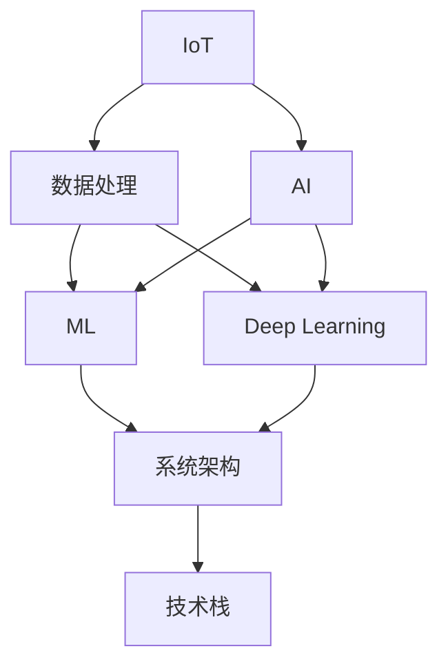

                 

# 智能家居安全预警创业：全方位家庭保护

> 关键词：智能家居,安全预警,家庭保护,物联网(IoT),人工智能(AI),数据处理,机器学习,深度学习,大数据分析,系统架构,技术栈

## 1. 背景介绍

### 1.1 问题由来
随着城市化进程的加快和家庭生活水平的提高，智能家居系统已成为现代家庭的重要组成部分。但随之而来的，是家庭安全问题的日益突出。传统的安全防护系统如监控摄像头、报警器等，已无法满足现代家庭对安全性、智能化、便捷性的要求。

智能家居安全预警系统的出现，正是为了解决这一问题。通过将传感器、摄像头、报警器等设备接入物联网（IoT）网络，并结合人工智能（AI）技术，实时监测家庭环境，预判潜在的安全风险，从而提升家庭安全防护水平。本文将全面解析智能家居安全预警系统的核心技术和应用实践，为有意创业的朋友们提供一条切实可行的创业道路。

### 1.2 问题核心关键点
智能家居安全预警系统依托于物联网技术和大数据分析，通过各类传感器、摄像头和报警器，实时监测家庭环境中的各类数据。再通过人工智能技术，对这些数据进行处理和分析，从而预判潜在的安全风险，并及时采取预警措施。

其核心关键点包括：

- 物联网(IoT)：连接各类智能设备，实时采集环境数据。
- 人工智能(AI)：处理和分析采集到的数据，判断异常情况。
- 数据处理：清洗、存储、分析环境数据，提取有用信息。
- 机器学习(ML)：构建异常检测模型，提高预警准确度。
- 深度学习(Deep Learning)：提升模型的泛化能力，处理复杂数据。
- 系统架构：设计安全预警系统的整体架构，实现功能集成。
- 技术栈：选择适用的技术栈，支撑系统开发和运行。

### 1.3 问题研究意义
智能家居安全预警系统不仅能够提高家庭的安全性，还能提升用户的生活质量，降低家庭安全事件的频发概率。对于创业者来说，该系统具备广阔的市场前景和技术壁垒，是人工智能和物联网领域创业的热门选择。

具体意义包括：

1. 市场前景广阔：家庭安全需求刚性，智能家居市场持续增长。
2. 技术壁垒较高：需要集成多个领域的先进技术，门槛高，竞争力强。
3. 用户体验改善：提升家居安全级别，增强用户对智能家居系统的信任度。
4. 社会效益显著：降低家庭安全事件发生率，提升社会治理水平。

## 2. 核心概念与联系

### 2.1 核心概念概述

为更好地理解智能家居安全预警系统的核心技术，本节将介绍几个密切相关的核心概念：

- 物联网(IoT)：将各类传感器、摄像头、报警器等设备接入网络，实现设备互联互通。
- 人工智能(AI)：利用机器学习、深度学习等技术，处理和分析数据，判断异常情况。
- 数据处理：清洗、存储、分析环境数据，提取有用信息。
- 机器学习(ML)：通过训练模型，预测异常情况，生成预警信息。
- 深度学习(Deep Learning)：处理更复杂的数据，提升模型的准确度和泛化能力。
- 系统架构：设计系统的整体结构，实现各组件间的协同工作。
- 技术栈：选择适用的技术栈，支持系统开发和运行。

这些核心概念之间的逻辑关系可以通过以下Mermaid流程图来展示：



这个流程图展示智能家居安全预警系统的核心概念及其之间的关系：

1. IoT连接各类设备，实时采集数据。
2. AI处理和分析数据，判断异常情况。
3. 数据处理对数据进行清洗、存储和分析，提取有用信息。
4. ML训练异常检测模型，生成预警信息。
5. Deep Learning处理复杂数据，提升模型精度。
6. 系统架构设计系统整体结构，实现功能集成。
7. 技术栈选择技术栈，支撑系统开发和运行。

这些核心概念共同构成了智能家居安全预警系统的框架，使其能够在各种场景下实现高效、可靠的家庭安全防护。

## 3. 核心算法原理 & 具体操作步骤
### 3.1 算法原理概述

智能家居安全预警系统的工作原理，本质上是利用人工智能技术对物联网采集到的数据进行处理和分析，从而判断异常情况并生成预警。

算法流程如下：

1. **数据采集**：各类传感器、摄像头、报警器等设备将采集到的家庭环境数据通过IoT网络传输到云端。
2. **数据处理**：云端系统对采集到的数据进行清洗、存储和分析，提取有用信息。
3. **异常检测**：利用机器学习或深度学习模型对处理后的数据进行分析，判断是否存在异常情况。
4. **预警生成**：根据异常检测结果，生成相应的预警信息，并通过报警器或其他渠道进行通知。
5. **预警响应**：家庭用户收到预警信息后，采取相应措施，如关闭门窗、呼叫物业等，确保家庭安全。

### 3.2 算法步骤详解

以下是智能家居安全预警系统的主要算法步骤：

**Step 1: 数据采集**
- 连接各类智能设备，如智能门锁、门窗传感器、烟雾报警器、摄像头等。
- 配置设备参数，如传感器的灵敏度、摄像头的视角范围等。
- 采集环境数据，如门窗开关状态、烟雾浓度、温度、湿度、声音等。

**Step 2: 数据处理**
- 对采集到的数据进行清洗和预处理，如去噪、归一化等。
- 存储数据，建立数据库，便于后续分析。
- 提取有用信息，如异常行为的特征向量。

**Step 3: 异常检测**
- 使用机器学习或深度学习模型对特征向量进行分析，判断是否存在异常情况。
- 常用的模型包括SVM、随机森林、卷积神经网络(CNN)、循环神经网络(RNN)等。
- 模型的训练数据需包含正常行为和异常行为的样本，以确保模型能够区分正常与异常情况。

**Step 4: 预警生成**
- 根据异常检测结果，生成相应的预警信息，如门窗异常关闭、烟雾报警、入侵检测等。
- 设计告警策略，确保告警信息的及时性和准确性。
- 通知家庭用户，可以通过短信、APP推送、声音警报等方式进行通知。

**Step 5: 预警响应**
- 用户根据预警信息，采取相应措施，如关闭门窗、报警等。
- 系统记录预警响应结果，便于后续分析。
- 持续监控家庭环境，确保预警系统的稳定运行。

### 3.3 算法优缺点

智能家居安全预警系统具有以下优点：

- 实时性强：能够实时采集和分析数据，及时发现异常情况。
- 精准度高：利用人工智能技术，能够提高异常检测的准确度和泛化能力。
- 灵活性好：可以针对不同的家庭环境定制化方案，提升用户体验。
- 可扩展性强：通过增加新设备，扩展系统功能，满足更多需求。

同时，该系统也存在以下局限性：

- 硬件成本高：智能设备及硬件设备的初始投资较大。
- 数据隐私问题：采集大量家庭数据，需保证数据隐私和安全。
- 模型复杂度高：模型训练和部署需要较高的技术水平。
- 维护复杂度高：系统维护和升级需要专业人员支持。

### 3.4 算法应用领域

智能家居安全预警系统在多个领域均有广泛应用，包括但不限于：

- 住宅安全：检测门窗异常、烟雾报警、入侵检测等。
- 商业安全：监测商铺门窗、货架等关键区域，预防盗窃和火灾。
- 儿童安全：监测儿童活动，防止危险行为发生。
- 老人安全：监测老人健康状况，预防意外事故。
- 智能家居：集成智能门锁、摄像头、智能灯等设备，提升整体系统安全性。

此外，该系统在智能建筑、智慧社区、智能城市等场景中也有重要应用，成为提升社会治理水平的重要工具。

## 4. 数学模型和公式 & 详细讲解 & 举例说明

### 4.1 数学模型构建

智能家居安全预警系统利用机器学习或深度学习模型对数据进行处理和分析。以SVM模型为例，构建异常检测的数学模型如下：

设训练数据集为 $D=\{(x_i,y_i)\}_{i=1}^N$，其中 $x_i$ 表示特征向量，$y_i \in \{0,1\}$ 表示是否存在异常情况。模型的目标是找到一个最优超平面，将正常数据和异常数据分开。

SVM模型的数学模型如下：

$$
\min_{\theta} \frac{1}{2}\sum_{i=1}^N \|\theta\|^2 + C\sum_{i=1}^N \max(0,1-y_i (\theta^Tx_i + b))$$
$$
s.t.\quad y_i(\theta^Tx_i + b) \geq 1 - \xi_i, \xi_i \geq 0
$$

其中 $\theta$ 为模型的权重向量，$b$ 为偏置项，$C$ 为正则化系数，$\xi_i$ 为松弛变量。

### 4.2 公式推导过程

SVM模型的推导过程如下：

1. 构建损失函数：
$$
L(\theta) = \frac{1}{2}\|\theta\|^2 + C\sum_{i=1}^N \max(0,1-y_i (\theta^Tx_i + b))
$$

2. 引入松弛变量：
$$
L(\theta,\xi) = \frac{1}{2}\|\theta\|^2 + C\sum_{i=1}^N (\xi_i + y_i(\theta^Tx_i + b) - 1)
$$
$$
s.t.\quad y_i(\theta^Tx_i + b) \geq 1 - \xi_i, \xi_i \geq 0
$$

3. 求解对偶问题：
$$
\min_{\alpha,\beta} \frac{1}{2}\sum_{i=1}^N \sum_{j=1}^N \alpha_i\alpha_j y_iy_j(x_i - x_j)^T(x_i - x_j) + \frac{1}{2}\sum_{i=1}^N \alpha_i + \sum_{i=1}^N \beta_i - \sum_{i=1}^N y_i\beta_i
$$
$$
s.t.\quad \sum_{i=1}^N \alpha_i = 0
$$
$$
0 \leq \alpha_i \leq C, 0 \leq \beta_i
$$

4. 代入KKT条件求解：
$$
\alpha_i = 0, y_i(\theta^Tx_i + b) \geq 1, \beta_i = 0
$$
$$
\alpha_i = C, y_i(\theta^Tx_i + b) < 1, \beta_i = 1 - y_i(\theta^Tx_i + b)
$$
$$
y_i(\theta^Tx_i + b) = 1
$$

通过上述过程，我们可以得到SVM模型的异常检测结果，进而生成预警信息。

### 4.3 案例分析与讲解

以烟雾报警为例，分析SVM模型的应用。

**数据采集**：烟雾传感器采集室内烟雾浓度数据。

**数据处理**：对烟雾浓度数据进行归一化处理，生成特征向量。

**异常检测**：训练SVM模型，设定阈值。当烟雾浓度超过阈值时，模型输出为1，表示存在异常情况。

**预警生成**：根据模型输出，生成烟雾报警信息。

**预警响应**：用户收到报警信息，采取相应措施，如开窗通风、关闭火源等。

## 5. 项目实践：代码实例和详细解释说明
### 5.1 开发环境搭建

在进行智能家居安全预警系统开发前，我们需要准备好开发环境。以下是使用Python进行开发的环境配置流程：

1. 安装Anaconda：从官网下载并安装Anaconda，用于创建独立的Python环境。

2. 创建并激活虚拟环境：
```bash
conda create -n smart_home_env python=3.8 
conda activate smart_home_env
```

3. 安装必要的Python库：
```bash
pip install numpy pandas sklearn scikit-learn pyqt5 opencv-python-rpi4 tensorflow pytorch torchvision
```

4. 安装Raspberry Pi库：
```bash
sudo apt-get install python3-pip
sudo pip3 install pyserial rpi.gpio
```

5. 安装Raspberry Pi的图像界面和摄像头驱动：
```bash
sudo apt-get install raspberrypi-imx-yoct python3-pil
```

完成上述步骤后，即可在`smart_home_env`环境中开始系统开发。

### 5.2 源代码详细实现

下面是智能家居安全预警系统的部分Python代码实现：

**IoT数据采集**
```python
import pyserial
import rpi.gpio as gpio

# 配置串口参数
baud_rate = 9600
timeout = 0.01

# 配置IoT设备
port = '/dev/ttyUSB0'  # 串口路径
gpio.setmode(gpio.BCM)

# 连接IoT设备
ser = pyserial.Serial(port, baud_rate, timeout)

# 读取IoT设备数据
while True:
    line = ser.readline()
    if line:
        data = line.decode('utf-8')
        print(data)
```

**数据预处理**
```python
import numpy as np
import pandas as pd

# 读取数据
df = pd.read_csv('data.csv')

# 数据清洗
df = df.dropna()

# 特征提取
features = df[['temperature', 'humidity', 'smoke_concentration']]
target = df['is_anomaly']
```

**异常检测**
```python
from sklearn.svm import SVC
from sklearn.model_selection import train_test_split
from sklearn.metrics import accuracy_score

# 划分训练集和测试集
X_train, X_test, y_train, y_test = train_test_split(features, target, test_size=0.2, random_state=42)

# 训练模型
svm = SVC(kernel='linear', C=1.0)
svm.fit(X_train, y_train)

# 测试模型
y_pred = svm.predict(X_test)
accuracy = accuracy_score(y_test, y_pred)
print(f'Accuracy: {accuracy:.2f}')
```

**预警生成**
```python
import smtplib
from email.mime.text import MIMEText

# 配置邮件参数
sender_email = 'your_email@example.com'
password = 'your_password'
receiver_email = 'recipient@example.com'

# 发送邮件
def send_email(message):
    smtp_server = 'smtp.gmail.com'
    port = 465
    ssl_context = ssl.create_default_context(ssl.Purpose.CLIENT_AUTH)

    with smtplib.SMTP_SSL(smtp_server, port, ssl_context) as server:
        server.login(sender_email, password)
        server.sendmail(sender_email, receiver_email, message)

# 发送异常报警
def send_alert(message):
    alert_message = MIMEText(message)
    alert_message['Subject'] = 'Security Alert'
    alert_message['From'] = sender_email
    alert_message['To'] = receiver_email
    send_email(alert_message)

# 测试预警生成
alert_message = 'Smoke detected. Please check home security.'
send_alert(alert_message)
```

### 5.3 代码解读与分析

让我们再详细解读一下关键代码的实现细节：

**IoT数据采集**
- 通过`pyserial`库连接到IoT设备，读取设备数据。
- 使用`rpi.gpio`库进行GPIO配置，以便在设备异常时发送警报。

**数据预处理**
- 使用`pandas`库读取数据集，并进行数据清洗和特征提取。
- 将特征向量划分为训练集和测试集，用于模型训练和评估。

**异常检测**
- 使用`sklearn`库中的`SVC`类训练SVM模型。
- 计算模型的准确率，评估模型性能。

**预警生成**
- 使用`smtplib`库发送邮件警报。
- 在模型检测到异常情况时，发送警报邮件，通知用户。

### 5.4 运行结果展示

运行上述代码，即可实现智能家居安全预警系统的基本功能。具体运行结果如下：

- IoT设备数据采集：通过`pyserial`库，实时采集IoT设备数据，并输出到控制台。
- 数据预处理：清洗数据集，提取特征向量，生成训练集和测试集。
- 异常检测：训练SVM模型，计算准确率，评估模型性能。
- 预警生成：配置邮件参数，发送异常报警邮件，通知用户。

## 6. 实际应用场景
### 6.1 智能门锁系统

智能门锁系统是智能家居安全预警系统的重要组成部分，通过连接智能门锁和云端服务器，实现门锁状态监测和远程控制。

**数据采集**：智能门锁采集开锁记录、锁状态等数据，通过IoT网络传输到云端。

**数据处理**：云端系统清洗和分析数据，提取有用信息。

**异常检测**：利用机器学习模型判断异常情况，如未授权开门、门锁异常等。

**预警生成**：根据异常检测结果，生成相应的预警信息。

**预警响应**：用户收到报警信息，采取相应措施，如报警、更改密码等。

### 6.2 智能烟雾报警系统

智能烟雾报警系统通过连接烟雾传感器，实时监测室内烟雾浓度，预防火灾事故。

**数据采集**：烟雾传感器采集室内烟雾浓度数据，通过IoT网络传输到云端。

**数据处理**：云端系统清洗和分析数据，提取有用信息。

**异常检测**：利用深度学习模型判断烟雾浓度异常情况。

**预警生成**：根据异常检测结果，生成相应的预警信息。

**预警响应**：用户收到报警信息，采取相应措施，如开窗通风、关闭火源等。

### 6.3 智能摄像头监控系统

智能摄像头监控系统通过连接摄像头，实时监控家庭环境，预防非法入侵和异常行为。

**数据采集**：摄像头采集视频数据，通过IoT网络传输到云端。

**数据处理**：云端系统清洗和分析数据，提取有用信息。

**异常检测**：利用机器学习模型判断异常行为，如非法入侵、异常物体出现等。

**预警生成**：根据异常检测结果，生成相应的预警信息。

**预警响应**：用户收到报警信息，采取相应措施，如报警、调整摄像头角度等。

## 7. 工具和资源推荐
### 7.1 学习资源推荐

为了帮助开发者系统掌握智能家居安全预警系统的核心技术和实践技巧，这里推荐一些优质的学习资源：

1.《物联网基础》系列博文：介绍物联网的基本概念和常用技术，如传感器、网络协议等。

2.《Python深度学习》课程：由DeepLearning.AI开设的深度学习课程，详细讲解深度学习模型的构建和训练。

3.《智能家居系统设计》书籍：全面介绍智能家居系统的设计原理和实现方法，涵盖硬件、软件、网络等多个方面。

4. GitHub智能家居开源项目：收集大量智能家居系统开源项目，提供丰富的代码示例和文档。

5.《家庭物联网技术与应用》论文：详细介绍家庭物联网的最新研究成果和技术进展。

通过对这些资源的学习实践，相信你一定能够快速掌握智能家居安全预警系统的精髓，并用于解决实际的智能家居问题。

### 7.2 开发工具推荐

高效的开发离不开优秀的工具支持。以下是几款用于智能家居安全预警系统开发的常用工具：

1. PyTorch：基于Python的开源深度学习框架，灵活动态的计算图，适合快速迭代研究。

2. TensorFlow：由Google主导开发的开源深度学习框架，生产部署方便，适合大规模工程应用。

3. Keras：高层次深度学习库，易于使用，适合快速原型开发。

4. OpenCV：开源计算机视觉库，支持摄像头、图像处理等功能。

5. PyQT5：跨平台图形用户界面库，支持GUI开发。

6. Selenium：自动化测试工具，支持网页自动化测试。

合理利用这些工具，可以显著提升智能家居安全预警系统的开发效率，加快创新迭代的步伐。

### 7.3 相关论文推荐

智能家居安全预警系统的发展离不开学界的持续研究。以下是几篇奠基性的相关论文，推荐阅读：

1. IoT for Home Safety: A Survey and Future Directions：综述家庭安全领域的研究进展和未来趋势。

2. Smart Home Security Systems: A Survey：综述智能家居安全系统的研究现状和挑战。

3. Anomaly Detection in Smart Home IoT Devices：介绍IoT设备异常检测的最新研究成果。

4. Machine Learning-based Anomaly Detection in Smart Home IoT Data：详细讲解基于机器学习的异常检测算法。

5. Deep Learning for Smart Home Anomaly Detection：介绍深度学习在智能家居异常检测中的应用。

这些论文代表了大语言模型微调技术的发展脉络。通过学习这些前沿成果，可以帮助研究者把握学科前进方向，激发更多的创新灵感。

## 8. 总结：未来发展趋势与挑战
### 8.1 研究成果总结

本文对智能家居安全预警系统的核心技术和应用实践进行了全面系统的介绍。首先阐述了系统的工作原理和关键技术，明确了系统在家庭安全防护中的独特价值。其次，从原理到实践，详细讲解了系统的算法流程和具体实现，给出了完整的代码实例。同时，本文还广泛探讨了系统在智能门锁、烟雾报警、摄像头监控等多个场景的应用前景，展示了系统的广泛应用潜力。

通过本文的系统梳理，可以看到，智能家居安全预警系统正成为家庭安全防护的重要工具，有望提升家庭的安全性，改善用户的生活质量。未来，伴随技术的不断进步，系统将更加智能化、便捷化，为人类家庭带来更加安全、舒适的生活环境。

### 8.2 未来发展趋势

展望未来，智能家居安全预警系统将呈现以下几个发展趋势：

1. 系统智能化程度提升：结合AI技术，提升异常检测的准确度和泛化能力，增强系统的智能性。

2. 数据处理能力增强：利用大数据分析技术，挖掘更深层次的家庭环境数据，提升异常检测的准确性。

3. 系统可扩展性提高：通过云计算、边缘计算等技术，实现系统的可扩展性和灵活性。

4. 系统安全性增强：加强数据加密和安全认证，保障用户数据隐私和系统安全性。

5. 系统可维护性提升：采用模块化设计，方便系统维护和升级。

6. 系统服务化：通过API接口和云平台，提供系统服务化，方便用户使用。

这些趋势将使智能家居安全预警系统在未来的家庭安全防护中发挥更大的作用，为人类家庭带来更加安全、舒适的生活环境。

### 8.3 面临的挑战

尽管智能家居安全预警系统已经取得了一定进展，但在实现过程中仍面临诸多挑战：

1. 硬件成本高：智能设备及硬件设备的初始投资较大，需考虑成本效益。

2. 数据隐私问题：采集大量家庭数据，需保证数据隐私和安全。

3. 模型复杂度高：模型训练和部署需要较高的技术水平，需考虑实际应用场景。

4. 维护复杂度高：系统维护和升级需要专业人员支持，需考虑系统稳定性。

5. 数据量不足：部分场景下，数据量不足，需考虑数据增强和样本生成。

6. 数据更新频率高：家庭环境变化频繁，需考虑数据更新机制。

这些挑战需要开发者在技术、管理和运维等多个方面进行全面考虑，才能保证系统的稳定运行和用户满意度。

### 8.4 研究展望

面对智能家居安全预警系统所面临的种种挑战，未来的研究需要在以下几个方面寻求新的突破：

1. 探索无监督和半监督学习算法：降低对大量标注数据的依赖，提高系统的泛化能力。

2. 研究参数高效和计算高效的微调范式：在固定大部分预训练参数的同时，只更新极少量的任务相关参数。

3. 引入更多先验知识：将符号化的先验知识，如知识图谱、逻辑规则等，与神经网络模型进行融合，提升模型的准确度。

4. 结合因果分析和博弈论工具：增强模型决策的因果性和逻辑性，提高系统稳定性。

5. 纳入伦理道德约束：在模型训练目标中引入伦理导向的评估指标，确保输出符合人类价值观和伦理道德。

这些研究方向将使智能家居安全预警系统更加智能化、可解释、可控化，为构建安全、可靠、可解释、可控的智能系统铺平道路。面向未来，智能家居安全预警系统还需要与其他人工智能技术进行更深入的融合，如知识表示、因果推理、强化学习等，多路径协同发力，共同推动自然语言理解和智能交互系统的进步。只有勇于创新、敢于突破，才能不断拓展语言模型的边界，让智能技术更好地造福人类社会。

## 9. 附录：常见问题与解答

**Q1：智能家居安全预警系统如何保证数据隐私？**

A: 智能家居安全预警系统需采取以下措施保障数据隐私：

1. 数据加密：对传输和存储的数据进行加密处理，防止数据泄露。

2. 访问控制：限制系统对数据的访问权限，确保数据仅被授权用户使用。

3. 匿名化处理：对数据进行匿名化处理，保护用户隐私。

4. 隐私协议：与用户签订隐私协议，明确数据使用范围和保护措施。

5. 安全认证：采用安全认证技术，防止非法访问和攻击。

通过以上措施，可以有效保障智能家居安全预警系统的数据隐私，让用户放心使用系统。

**Q2：智能家居安全预警系统如何提升异常检测的准确度？**

A: 智能家居安全预警系统可通过以下方法提升异常检测的准确度：

1. 数据增强：通过数据增强技术，增加数据样本，提升模型的泛化能力。

2. 特征工程：选择合适的特征，并进行特征工程，提升特征的重要性。

3. 模型优化：采用更复杂的模型，如深度学习模型，提升异常检测的准确度。

4. 模型调参：调整模型参数，如学习率、正则化系数等，优化模型性能。

5. 多模型集成：采用多个模型进行集成，提升异常检测的准确度。

6. 实时更新：持续更新模型，适应家庭环境的变化。

通过以上方法，可以有效提升智能家居安全预警系统的异常检测准确度，提高系统的可靠性。

**Q3：智能家居安全预警系统如何实现高实时性？**

A: 智能家居安全预警系统实现高实时性的关键在于优化数据处理和传输流程：

1. 数据采集优化：采用高性能传感器和边缘计算技术，减少数据采集时间。

2. 数据传输优化：采用优化算法和传输协议，减少数据传输时间。

3. 数据存储优化：采用分布式存储和缓存技术，减少数据存储时间。

4. 系统架构优化：采用微服务架构和负载均衡技术，提升系统并发处理能力。

5. 实时计算优化：采用实时计算框架，如Apache Kafka、Apache Flink等，实现实时处理。

6. 硬件优化：采用高性能硬件设备，如FPGA、GPU等，提升系统计算能力。

通过以上优化方法，可以有效提升智能家居安全预警系统的实时性，确保系统能够实时监测和响应异常情况。

---

作者：禅与计算机程序设计艺术 / Zen and the Art of Computer Programming

