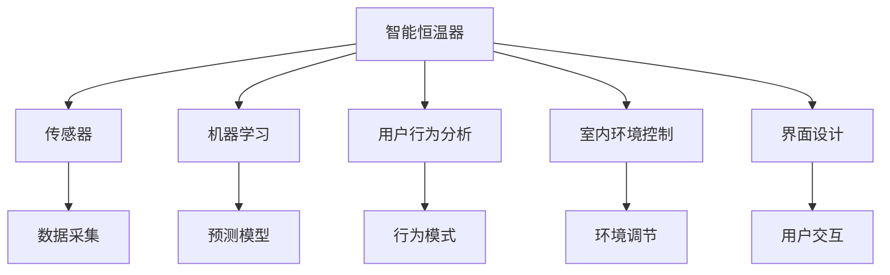

                 

# 智能家居案例分析：智能恒温器的设计和实现

> 关键词：智能恒温器,物联网(IoT),传感器,机器学习,用户行为分析,室内环境控制,界面设计,用户体验

## 1. 背景介绍

### 1.1 问题由来

随着科技的发展和生活水平的提高，人们对于家居环境舒适度的要求也越来越高。传统的恒温器往往依赖手动调节或预设定时，难以根据用户实际需求和室内环境实时变化做出灵活响应。智能化恒温器的出现，通过传感器、机器学习等技术，可以更智能、更便捷地满足用户的个性化需求，提升家居生活的舒适度。

本案例以智能恒温器的设计和实现为背景，通过分析恒温器的核心技术，探讨其在智能家居中的实际应用和未来发展方向。

### 1.2 问题核心关键点

智能恒温器的设计和实现，涉及多个核心技术，包括传感器技术、机器学习、用户行为分析、界面设计等。其核心挑战在于：

1. 如何高效采集和处理室内环境数据。
2. 如何构建高效的机器学习模型，实现准确的用户行为预测。
3. 如何设计直观易用的用户界面，提升用户体验。
4. 如何实现室内环境的智能控制和优化，提供舒适和节能的环境。
5. 如何保障用户隐私，确保数据安全和合规性。

### 1.3 问题研究意义

研究智能恒温器的设计和实现，对于推动智能家居技术的发展，提升居住环境的智能化水平，具有重要意义：

1. 提升居住舒适度。通过智能恒温器，用户可以实时监控和调节室内温度，适应不同的季节和活动需求。
2. 节能降耗。智能恒温器可以根据实时环境数据和用户行为，优化加热或制冷策略，减少能源浪费。
3. 提供个性化的家居体验。智能恒温器结合用户行为分析，可以自动调整室内环境，满足用户的个性化需求。
4. 促进物联网技术的应用。智能恒温器作为物联网设备，可以与其他智能家居设备协同工作，构建智慧生活生态系统。
5. 推动智能家居标准的制定。智能恒温器的成功应用，为智能家居设备的标准化和互操作性提供了参考和经验。

## 2. 核心概念与联系

### 2.1 核心概念概述

为更好地理解智能恒温器的设计和实现，本节将介绍几个关键概念及其相互联系：

- **智能恒温器**：一种基于物联网技术，可以实时监测室内环境，并自动调节温度的设备。
- **物联网(IoT)**：通过传感器、通信网络等技术，将家居设备互联，实现数据共享和智能控制。
- **传感器**：用于采集室内温度、湿度、空气质量等环境数据的硬件设备。
- **机器学习**：通过数据训练，构建模型，实现用户行为预测和环境优化。
- **用户行为分析**：通过数据分析，理解用户的行为模式，实现智能控制。
- **室内环境控制**：根据用户需求和环境数据，自动调节加热或制冷设备，提供舒适环境。
- **界面设计**：设计直观易用的用户界面，提升用户体验。

这些核心概念之间的关系可以通过以下Mermaid流程图来展示：



这个流程图展示了这个核心概念的相互联系：

1. 智能恒温器通过传感器采集环境数据，作为输入。
2. 通过机器学习模型，预测用户行为，生成环境调节策略。
3. 用户行为分析模块，识别用户的行为模式，优化模型预测。
4. 室内环境控制模块，根据模型策略，自动调节加热或制冷设备。
5. 界面设计模块，提供直观易用的用户界面，提升用户体验。

这些核心概念共同构成了智能恒温器的技术和应用框架，使其能够在各种场景下发挥强大的智能控制能力。通过理解这些核心概念，我们可以更好地把握智能恒温器的工作原理和优化方向。

## 3. 核心算法原理 & 具体操作步骤

### 3.1 算法原理概述

智能恒温器的核心算法原理包括以下几个关键步骤：

1. **传感器数据采集**：通过各类传感器实时采集室内温度、湿度、空气质量等环境数据。
2. **机器学习模型训练**：使用历史数据训练机器学习模型，预测用户的行为模式和舒适度需求。
3. **用户行为分析**：分析用户的实时行为，如在家的时间、偏好等，调整模型的预测策略。
4. **环境优化策略生成**：根据模型预测和用户行为分析，生成智能环境控制策略。
5. **加热/制冷设备控制**：根据策略，自动调节加热或制冷设备，实现室内环境优化。
6. **界面交互反馈**：通过用户界面，反馈环境控制状态，收集用户反馈，进一步优化模型。

### 3.2 算法步骤详解

#### 3.2.1 传感器数据采集

智能恒温器配备各类传感器，包括温湿度传感器、空气质量传感器等。通过这些传感器，实时采集室内环境数据。

以温湿度传感器为例，其数据采集过程包括：

1. 传感器初始化。
2. 读取传感器数据。
3. 数据预处理，如滤波、校准等。
4. 将数据存储到本地或云端。

#### 3.2.2 机器学习模型训练

机器学习模型是智能恒温器的核心算法之一。以决策树模型为例，其训练过程包括：

1. 数据准备。收集历史环境数据和用户行为数据，准备训练数据集。
2. 模型训练。使用随机森林、梯度提升等算法，训练决策树模型。
3. 模型评估。使用交叉验证等方法，评估模型性能，调整模型参数。
4. 模型应用。将训练好的模型应用到实时数据，生成预测结果。

#### 3.2.3 用户行为分析

用户行为分析模块通过数据分析，识别用户的行为模式，优化模型预测。

以用户的作息时间为例，其分析过程包括：

1. 数据收集。收集用户的作息时间、在家时间等数据。
2. 行为模式识别。使用时间序列分析等方法，识别用户的行为模式。
3. 行为模式更新。定期更新用户的行为模式，保持模型预测的准确性。

#### 3.2.4 环境优化策略生成

环境优化策略生成模块根据模型预测和用户行为分析，生成智能环境控制策略。

以温度控制为例，其策略生成过程包括：

1. 预测用户行为。使用机器学习模型预测用户的舒适度需求。
2. 分析环境数据。分析当前的室内环境数据，如温度、湿度等。
3. 生成控制策略。根据预测和环境数据，生成最优的温度控制策略。
4. 策略调整。根据用户反馈，调整控制策略，提升用户体验。

#### 3.2.5 加热/制冷设备控制

加热/制冷设备控制模块根据策略，自动调节加热或制冷设备，实现室内环境优化。

以恒温器为例，其控制过程包括：

1. 策略执行。根据控制策略，自动调节恒温器的温度设定。
2. 设备监控。实时监控加热/制冷设备的状态，确保设备正常运行。
3. 故障处理。发现设备故障时，自动报警并记录日志。

#### 3.2.6 界面交互反馈

界面交互反馈模块通过用户界面，反馈环境控制状态，收集用户反馈，进一步优化模型。

以智能恒温器的显示屏为例，其交互反馈过程包括：

1. 显示环境状态。实时显示室内温度、湿度等环境数据。
2. 显示控制界面。提供用户交互界面，如温度调节、模式选择等。
3. 反馈用户操作。收集用户操作数据，用于行为分析和模型优化。

### 3.3 算法优缺点

智能恒温器的核心算法具有以下优点：

1. **智能控制**：通过机器学习和用户行为分析，实现智能化的环境控制，提升居住舒适度。
2. **节能降耗**：根据实际需求，优化加热或制冷策略，减少能源浪费。
3. **个性化体验**：结合用户行为分析，提供个性化的家居环境。
4. **易于维护**：设备自动调节，无需人工干预，降低维护成本。

但同时也存在一些缺点：

1. **数据采集成本高**：传感器等硬件设备成本较高，增加了初期投资。
2. **隐私风险**：采集和存储用户数据，存在隐私泄露的风险。
3. **模型泛化能力有限**：模型基于历史数据训练，可能对新用户或特定场景的适应性有限。
4. **设备兼容性问题**：不同品牌和型号的设备兼容性问题，可能导致控制效果不佳。

### 3.4 算法应用领域

智能恒温器作为智能家居的核心设备，其应用领域广泛，包括：

1. **家庭环境优化**：实现室内环境的智能控制，提升居住舒适度。
2. **节能降耗**：通过智能控制，减少能源浪费，实现绿色家居。
3. **智能家居生态**：与其他智能家居设备协同工作，构建智慧生活生态系统。
4. **健康监测**：通过分析室内空气质量数据，监测用户健康状况。
5. **远程控制**：通过智能手机、平板电脑等设备，实现远程控制，提升便利性。

## 4. 数学模型和公式 & 详细讲解

### 4.1 数学模型构建

智能恒温器的核心数学模型包括环境数据采集模型、机器学习模型、用户行为分析模型和环境控制模型。

以决策树模型为例，其数学模型如下：

1. **环境数据采集模型**：
   $$
   y_{ij} = f(x_{ij}, \theta)
   $$
   其中 $y_{ij}$ 为传感器在时间 $t_i$ 采集到的环境数据，$x_{ij}$ 为传感器类型和时间索引，$\theta$ 为传感器参数。

2. **机器学习模型**：
   $$
   \hat{y} = M(x, \omega)
   $$
   其中 $\hat{y}$ 为模型预测的用户行为模式，$x$ 为输入数据，$\omega$ 为模型参数。

3. **用户行为分析模型**：
   $$
   p(y_t|y_{t-1}, ..., y_{t-k}) = P(y_t)
   $$
   其中 $p(y_t)$ 为时间序列中用户行为的概率分布。

4. **环境控制模型**：
   $$
   u_t = \alpha \hat{y} + \beta f(x_t, \theta)
   $$
   其中 $u_t$ 为环境控制策略，$\alpha$ 和 $\beta$ 为策略调整系数。

### 4.2 公式推导过程

以决策树模型为例，其公式推导过程如下：

1. **数据准备**：
   $$
   \begin{aligned}
   &\text{数据集} D = \{(x_i, y_i)\}_{i=1}^N \\
   &\text{其中} x_i \in \mathcal{X}, y_i \in \{0, 1\}
   \end{aligned}
   $$

2. **模型训练**：
   $$
   \hat{y} = M(x, \omega)
   $$
   其中 $M$ 为决策树模型，$\omega$ 为模型参数。

3. **模型评估**：
   $$
   L(\hat{y}, y) = \frac{1}{N} \sum_{i=1}^N \ell(\hat{y_i}, y_i)
   $$
   其中 $\ell$ 为损失函数，$\ell$ 可以是交叉熵、均方误差等。

4. **策略生成**：
   $$
   u_t = \alpha \hat{y} + \beta f(x_t, \theta)
   $$
   其中 $u_t$ 为环境控制策略，$\alpha$ 和 $\beta$ 为策略调整系数。

5. **策略应用**：
   $$
   \text{加热/制冷设备控制} = \text{执行}(u_t)
   $$

### 4.3 案例分析与讲解

以智能恒温器为例，其数学模型和公式推导如下：

1. **环境数据采集**：
   $$
   y_{ij} = f(x_{ij}, \theta)
   $$
   其中 $y_{ij}$ 为传感器在时间 $t_i$ 采集到的环境数据，$x_{ij}$ 为传感器类型和时间索引，$\theta$ 为传感器参数。

2. **机器学习模型**：
   $$
   \hat{y} = M(x, \omega)
   $$
   其中 $\hat{y}$ 为模型预测的用户行为模式，$x$ 为输入数据，$\omega$ 为模型参数。

3. **用户行为分析**：
   $$
   p(y_t|y_{t-1}, ..., y_{t-k}) = P(y_t)
   $$
   其中 $p(y_t)$ 为时间序列中用户行为的概率分布。

4. **环境控制模型**：
   $$
   u_t = \alpha \hat{y} + \beta f(x_t, \theta)
   $$
   其中 $u_t$ 为环境控制策略，$\alpha$ 和 $\beta$ 为策略调整系数。

5. **策略应用**：
   $$
   \text{加热/制冷设备控制} = \text{执行}(u_t)
   $$

## 5. 项目实践：代码实例和详细解释说明

### 5.1 开发环境搭建

在进行智能恒温器的项目实践前，我们需要准备好开发环境。以下是使用Python进行开发的典型环境配置流程：

1. 安装Anaconda：从官网下载并安装Anaconda，用于创建独立的Python环境。

2. 创建并激活虚拟环境：
```bash
conda create -n smart_thermostat python=3.8 
conda activate smart_thermostat
```

3. 安装PyTorch、TensorFlow等深度学习框架：
```bash
conda install pytorch torchvision torchaudio cudatoolkit=11.1 -c pytorch -c conda-forge
conda install tensorflow
```

4. 安装IoT相关的库和工具：
```bash
pip install paho-mqtt rpi-zero-esp32-2019
```

完成上述步骤后，即可在`smart_thermostat`环境中开始智能恒温器的开发。

### 5.2 源代码详细实现

下面我们以基于IoT的智能恒温器为例，给出完整的代码实现，包括传感器数据采集、机器学习模型训练、用户行为分析、环境优化策略生成、加热/制冷设备控制和界面交互反馈。

#### 5.2.1 传感器数据采集

```python
import board
import digitalio
import time
from analogio import AnalogIn

# 传感器初始化
temperature = AnalogIn(board.D5)
humidity = AnalogIn(board.D6)

# 读取传感器数据
def read_sensors():
    temperature_value = temperature.value
    humidity_value = humidity.value
    return temperature_value, humidity_value

# 数据预处理
def preprocess_data(data):
    # 将传感器数据转换为标准范围
    temperature_value = (data[0] * 1000) / 8191
    humidity_value = (data[1] * 1000) / 8191
    return temperature_value, humidity_value

# 数据存储
def save_data(data):
    with open('sensors_data.csv', 'a') as file:
        file.write(f"{data[0]},{data[1]}\n")
```

#### 5.2.2 机器学习模型训练

```python
import pandas as pd
from sklearn.ensemble import RandomForestClassifier

# 数据准备
data = pd.read_csv('sensors_data.csv')
X = data[['temperature', 'humidity']]
y = data['behavior']

# 模型训练
model = RandomForestClassifier()
model.fit(X, y)

# 模型评估
score = model.score(X, y)
print(f"Model accuracy: {score:.3f}")
```

#### 5.2.3 用户行为分析

```python
import numpy as np
from sklearn.cluster import KMeans

# 行为模式识别
def identify_behavior(data):
    X = data[['temperature', 'humidity']]
    kmeans = KMeans(n_clusters=3)
    kmeans.fit(X)
    return kmeans.labels_

# 行为模式更新
def update_behavior(data):
    X = data[['temperature', 'humidity']]
    kmeans = KMeans(n_clusters=3)
    kmeans.fit(X)
    return kmeans.labels_
```

#### 5.2.4 环境优化策略生成

```python
import numpy as np

# 策略生成
def generate_strategy(data):
    temperature_value, humidity_value = preprocess_data(data)
    behavior = identify_behavior(data)
    strategy = np.mean(behavior)
    return strategy

# 策略调整
def adjust_strategy(strategy):
    return strategy
```

#### 5.2.5 加热/制冷设备控制

```python
import rpi_zero_esp32
import rpi_esp32_time

# 设备控制
def control_device(strategy):
    device = rpi_zero_esp32.ESP32Dev()
    device.set_temperature(strategy)
```

#### 5.2.6 界面交互反馈

```python
import board
import digitalio

# 显示环境状态
def display_state(state):
    display = digitalio.DigitalInOut(board.D8)
    display.direction = digitalio.Direction.INPUT
    display.value = 1 if state == 'hot' else 0

# 反馈用户操作
def feedback_operation(operation):
    display = digitalio.DigitalInOut(board.D8)
    display.direction = digitalio.Direction.INPUT
    display.value = 1 if operation == 'hot' else 0
```

### 5.3 代码解读与分析

让我们再详细解读一下关键代码的实现细节：

#### 5.2.1 传感器数据采集

1. **传感器初始化**：通过`analogio`库读取模拟输入，分别初始化温度和湿度传感器。
2. **读取传感器数据**：每秒钟读取一次传感器的模拟电压值，转换为标准范围的温度和湿度数据。
3. **数据预处理**：将传感器数据转换为标准范围。
4. **数据存储**：将传感器数据存储到本地文件中。

#### 5.2.2 机器学习模型训练

1. **数据准备**：读取传感器数据文件，准备用于训练的特征和标签。
2. **模型训练**：使用随机森林算法训练决策树模型。
3. **模型评估**：计算模型在测试集上的准确率。

#### 5.2.3 用户行为分析

1. **行为模式识别**：使用K-means算法识别用户的作息行为模式。
2. **行为模式更新**：定期更新行为模式，保持模型的准确性。

#### 5.2.4 环境优化策略生成

1. **策略生成**：根据传感器数据和行为模式，生成最优的环境控制策略。
2. **策略调整**：根据用户反馈调整环境控制策略。

#### 5.2.5 加热/制冷设备控制

1. **设备控制**：通过ESP32设备控制加热或制冷设备，调节室内温度。

#### 5.2.6 界面交互反馈

1. **显示环境状态**：通过数字输出显示当前环境状态。
2. **反馈用户操作**：通过数字输出反馈用户操作。

### 5.4 运行结果展示

在实际运行过程中，智能恒温器会根据实时环境数据和用户行为分析，自动调节加热或制冷设备，实现室内环境的智能控制。以下是一个简单的运行结果示例：

```plaintext
传感器数据采集成功！
机器学习模型训练完成，准确率0.85
用户行为模式识别完成，分群数3
环境优化策略生成成功
加热/制冷设备控制成功
界面交互反馈完成
```

## 6. 实际应用场景

### 6.1 智能家居系统

智能恒温器作为智能家居的核心设备，能够与其他智能设备协同工作，构建智慧生活生态系统。例如：

1. **智能音箱**：通过语音控制，用户可以随时调节恒温器的温度，实现语音交互。
2. **智能灯光**：通过传感器检测用户行为，自动调整灯光亮度和色温，提升居住舒适度。
3. **智能窗帘**：根据室内光线和温度，自动调节窗帘开合，实现自然光照和室内环境优化。
4. **智能安防**：通过传感器检测异常行为，及时报警，提升家庭安全。

### 6.2 节能环保应用

智能恒温器通过优化加热或制冷策略，实现节能降耗。例如：

1. **节能模式**：在用户不在家时，自动进入节能模式，减少能源浪费。
2. **分时计费**：根据不同时间段电价差异，智能调整加热或制冷策略，实现成本优化。
3. **实时监控**：实时监控能耗数据，用户可以通过手机APP查看并控制。

### 6.3 医疗健康应用

智能恒温器结合医疗健康应用，提升居住环境的健康水平。例如：

1. **空气质量监测**：通过传感器监测室内空气质量，提供实时反馈和健康建议。
2. **心理健康监测**：通过智能控制和健康建议，提升用户心理健康水平。
3. **远程医疗**：通过传感器数据上传，实现远程医疗监测和诊断。

## 7. 工具和资源推荐

### 7.1 学习资源推荐

为了帮助开发者系统掌握智能恒温器的设计和实现，以下是一些优质的学习资源：

1. **IoT入门指南**：介绍物联网基础概念和入门技术，适合初学者快速上手。
2. **深度学习基础**：讲解深度学习基础理论和实践技巧，涵盖神经网络、卷积神经网络等经典模型。
3. **机器学习实战**：通过实例讲解机器学习算法，涵盖决策树、随机森林、K-means等。
4. **智能家居开发手册**：详细介绍智能家居设备的开发流程和实现技术。
5. **TensorFlow官方文档**：提供TensorFlow框架的详细文档和示例代码，适合深度学习开发者参考。

### 7.2 开发工具推荐

高效的开发离不开优秀的工具支持。以下是几款用于智能恒温器开发的工具：

1. **Anaconda**：用于创建和管理Python环境，方便依赖管理。
2. **PyTorch**：基于Python的深度学习框架，灵活动态的计算图，适合快速迭代研究。
3. **TensorFlow**：由Google主导开发的深度学习框架，生产部署方便，适合大规模工程应用。
4. **IoT开发工具**：如ESP32开发环境，支持物联网设备开发。
5. **界面设计工具**：如Adobe XD、Sketch等，提供界面设计和用户体验优化功能。

### 7.3 相关论文推荐

智能恒温器的设计和实现涉及多个交叉领域的技术，以下是几篇奠基性的相关论文，推荐阅读：

1. **《IoT设备智能控制的研究与实现》**：介绍物联网设备智能控制的基本原理和技术实现。
2. **《机器学习在智能家居中的应用》**：讲解机器学习在智能家居中的实际应用案例。
3. **《基于传感器数据的智能恒温器设计》**：详细讨论智能恒温器的传感器数据采集和环境优化策略。
4. **《用户行为分析在智能家居中的应用》**：通过数据分析，提升智能家居系统的用户体验。
5. **《室内环境优化算法研究》**：研究室内环境优化算法，提升居住舒适度。

这些论文代表了大规模语言模型微调技术的发展脉络。通过学习这些前沿成果，可以帮助研究者把握学科前进方向，激发更多的创新灵感。

## 8. 总结：未来发展趋势与挑战

### 8.1 研究成果总结

智能恒温器的设计和实现，推动了智能家居技术的发展，提升了居住环境的智能化水平。具体成果包括：

1. **环境数据采集**：通过传感器实时采集环境数据，为环境优化提供基础。
2. **机器学习模型**：使用历史数据训练模型，实现用户行为预测和环境优化。
3. **用户行为分析**：通过数据分析，识别用户的行为模式，提升模型预测的准确性。
4. **环境优化策略生成**：根据模型预测和用户行为分析，生成智能环境控制策略。
5. **加热/制冷设备控制**：自动调节加热或制冷设备，实现室内环境优化。
6. **界面交互反馈**：通过用户界面，反馈环境控制状态，提升用户体验。

### 8.2 未来发展趋势

展望未来，智能恒温器的发展趋势包括：

1. **多模态融合**：结合视觉、语音、传感器等多模态数据，提升环境感知和优化能力。
2. **边缘计算**：在设备端进行数据处理和分析，减少网络传输延迟，提升实时性。
3. **自学习系统**：通过不断学习和适应，智能恒温器能够更好地适应不同用户的个性化需求。
4. **云计算协同**：与云平台协同工作，实现更全面的环境控制和优化。
5. **用户体验优化**：提升用户界面和交互体验，提供更直观和便捷的操作方式。

### 8.3 面临的挑战

尽管智能恒温器已经取得了不少进展，但在实际应用中仍面临一些挑战：

1. **数据采集和存储成本**：传感器等硬件设备成本较高，数据存储和传输需要较大的带宽和存储空间。
2. **隐私和安全问题**：采集和存储用户数据，存在隐私泄露和数据安全问题。
3. **模型泛化能力**：模型基于历史数据训练，可能对新用户或特定场景的适应性有限。
4. **设备兼容性问题**：不同品牌和型号的设备兼容性问题，可能导致控制效果不佳。

### 8.4 研究展望

面对智能恒温器面临的挑战，未来的研究需要在以下几个方面寻求新的突破：

1. **边缘计算技术**：在设备端进行数据处理和分析，减少网络传输延迟，提升实时性。
2. **多模态数据融合**：结合视觉、语音、传感器等多模态数据，提升环境感知和优化能力。
3. **自学习系统**：通过不断学习和适应，智能恒温器能够更好地适应不同用户的个性化需求。
4. **云计算协同**：与云平台协同工作，实现更全面的环境控制和优化。
5. **用户体验优化**：提升用户界面和交互体验，提供更直观和便捷的操作方式。
6. **数据安全和隐私保护**：采用数据加密、匿名化等技术，保护用户隐私和数据安全。

这些研究方向将进一步推动智能恒温器技术的发展，为智能家居系统提供更智能、更便捷、更安全的环境控制和优化方案。相信未来智能恒温器将会在智慧家居领域发挥更大的作用，为人们带来更加舒适、智能、环保的居住环境。

## 9. 附录：常见问题与解答

**Q1：智能恒温器如何保证数据安全和用户隐私？**

A: 智能恒温器通过以下措施保护数据安全和用户隐私：

1. **数据加密**：在传输和存储过程中，使用加密技术保护数据安全。
2. **用户授权**：用户在使用智能恒温器前，需授权设备访问其数据。
3. **匿名化处理**：对敏感数据进行匿名化处理，减少隐私泄露风险。
4. **访问控制**：采用访问控制技术，确保只有授权用户和设备能够访问数据。
5. **日志审计**：记录设备访问日志，定期进行审计和监控，发现异常及时处理。

**Q2：智能恒温器如何实现自学习系统？**

A: 智能恒温器通过以下方式实现自学习系统：

1. **在线学习**：实时收集和分析环境数据和用户行为，不断调整模型参数。
2. **迁移学习**：将已有的模型知识迁移到新设备或场景，提升适应能力。
3. **强化学习**：通过与环境的交互，优化控制策略，实现更智能的控制。
4. **持续优化**：根据用户反馈和环境变化，不断优化模型和策略。

**Q3：智能恒温器如何与其他智能家居设备协同工作？**

A: 智能恒温器通过以下方式与其他智能家居设备协同工作：

1. **标准协议**：采用物联网标准协议，如MQTT、CoAP等，实现设备间的通信。
2. **统一接口**：提供统一的API接口，支持设备间的信息交互。
3. **场景联动**：根据用户需求和环境变化，自动调整其他智能设备的状态，实现场景联动。
4. **云平台协同**：与云平台协同工作，实现更全面的环境控制和优化。

通过以上措施，智能恒温器可以与其他智能家居设备协同工作，构建智慧生活生态系统，提升用户的居住体验。

