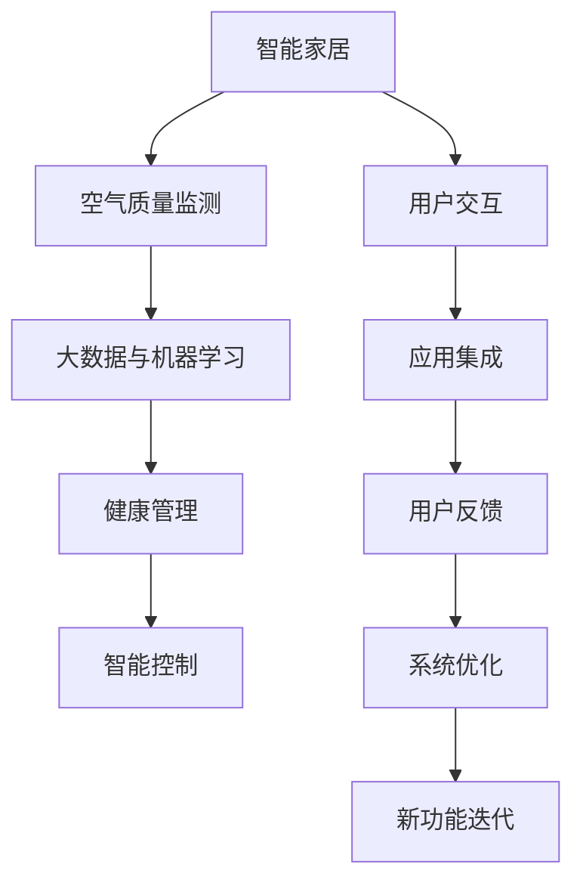

                 

# 智能家居空气营养创业：呼吸健康的精确管理

在当今快速变化的生活节奏中，空气质量已经成为影响我们健康和幸福的重要因素。如何在家中创造一个既舒适又健康的环境，成为了许多家庭的追求。智能家居空气营养创业便应运而生，利用先进的人工智能和大数据技术，通过精确管理空气质量，为家庭提供一个呼吸健康的理想空间。本文将深入探讨这一领域的技术原理、实施方法以及未来发展趋势，为潜在的创业者提供全面的视角。

## 1. 背景介绍

### 1.1 问题由来

随着工业化和城市化的推进，空气污染问题日益严重。研究表明，室内空气质量与人类健康有着直接关联。室外空气污染源如交通尾气、工业排放等，以及室内有害气体和颗粒物，如烟草烟雾、甲醛等，都可能引发呼吸系统疾病、过敏、哮喘等健康问题。如何在家庭环境中有效控制空气污染，保障家庭成员的健康，成为当前科技和社会发展的一项重要课题。

### 1.2 问题核心关键点

智能家居空气营养创业的关键在于：

- **智能监测与预警**：实时监测室内空气质量，对有害气体和颗粒物进行精确识别和预警。
- **数据驱动的空气治理**：利用大数据和机器学习技术，优化室内空气治理方案。
- **个性化健康管理**：根据家庭成员的健康状况和需求，提供定制化的空气质量改善方案。
- **跨界融合创新**：将智能家居技术、物联网、健康管理等多学科交叉，实现综合创新。

### 1.3 问题研究意义

智能家居空气营养创业不仅能够提升家庭空气质量，保障健康，还能推动相关产业的发展，如空气净化器、空气质量传感器、健康监测设备等。该技术的应用将为智能家居市场带来新的增长点，同时也为环境保护和公共健康贡献力量。

## 2. 核心概念与联系

### 2.1 核心概念概述

为更好地理解智能家居空气营养创业的技术架构和方法，本节将介绍几个核心概念：

- **智能家居**：利用物联网技术，通过传感器、执行器等设备，实现家庭环境的自动化和智能化管理。
- **空气质量监测**：通过各种传感器监测空气中的PM2.5、甲醛、CO2等有害气体的浓度。
- **大数据与机器学习**：利用历史数据和大规模机器学习模型，预测和优化空气质量治理方案。
- **健康管理**：通过监测和分析家庭成员的健康数据，如呼吸频率、心率、体感温度等，提供个性化的空气质量改善建议。

### 2.2 核心概念原理和架构的 Mermaid 流程图



这个流程图展示了智能家居空气营养创业的核心架构：

1. 智能家居系统作为整体平台，连接了空气质量监测、大数据与机器学习、健康管理等多个模块。
2. 空气质量监测模块负责实时采集室内空气数据，反馈到平台。
3. 大数据与机器学习模块通过分析历史数据，优化治理方案，提升预测精度。
4. 健康管理模块监测家庭成员健康状况，与空气质量数据结合，生成个性化改善建议。
5. 智能控制模块根据建议调整空气净化器、新风系统等设备，实施空气质量改善。
6. 用户交互模块提供直观的用户界面，接受用户反馈，进一步优化系统。
7. 应用集成模块整合外部资源，如气象数据、交通状况等，提升系统智能化水平。

## 3. 核心算法原理 & 具体操作步骤

### 3.1 算法原理概述

智能家居空气营养创业的核心算法包括智能监测、数据驱动优化、个性化管理等，这些算法通过深度学习、机器学习等技术实现。

- **智能监测算法**：通过传感器技术，实时检测室内空气中的各种有害气体和颗粒物的浓度，并根据预设阈值进行预警。
- **数据驱动优化算法**：利用历史数据和机器学习模型，预测未来空气质量变化，优化治理策略。
- **个性化健康管理算法**：结合家庭成员的健康数据，利用机器学习模型，生成个性化的空气质量改善方案。

### 3.2 算法步骤详解

#### 3.2.1 智能监测

1. **传感器部署**：在室内关键位置部署空气质量传感器，如卧室、客厅、厨房等。
2. **数据采集与传输**：传感器实时采集空气质量数据，通过Wi-Fi、蓝牙等无线方式传输到中央处理系统。
3. **数据处理与存储**：中央处理系统对采集的数据进行处理，存储到云端或本地数据库。
4. **异常检测与预警**：利用异常检测算法，对空气质量数据进行实时监测，一旦发现异常，立即通过手机应用或短信等方式进行预警。

#### 3.2.2 数据驱动优化

1. **历史数据收集**：收集大量室内空气质量数据，包括不同季节、时间、活动水平下的数据。
2. **特征工程**：提取影响空气质量的关键特征，如温度、湿度、人员活动、室外气象等。
3. **模型训练**：利用历史数据训练机器学习模型，如随机森林、神经网络等，预测未来空气质量变化。
4. **治理方案优化**：根据模型预测结果，动态调整空气净化器、新风系统等设备运行策略，优化空气质量。

#### 3.2.3 个性化健康管理

1. **健康数据收集**：收集家庭成员的健康数据，如呼吸频率、心率、体感温度等。
2. **数据融合**：将空气质量数据与健康数据融合，通过机器学习模型，分析两者之间的关联。
3. **个性化方案生成**：根据分析结果，生成个性化的空气质量改善方案，如调整设备运行模式、推荐健康活动等。

### 3.3 算法优缺点

智能家居空气营养创业的算法具有以下优点：

- **实时性**：通过实时监测和即时预警，提高空气质量管理的响应速度。
- **智能化**：利用大数据和机器学习技术，优化空气质量治理方案，提升管理精度。
- **个性化**：根据家庭成员的健康需求，提供定制化的空气质量改善建议。

同时，也存在以下缺点：

- **成本较高**：传感器、数据存储、模型训练等都需要较高投入。
- **数据隐私问题**：涉及家庭成员的健康数据，需要严格保护隐私和数据安全。
- **算法复杂度**：涉及多个领域的算法和技术，实施难度较大。

### 3.4 算法应用领域

智能家居空气营养创业的应用领域广泛，包括但不限于：

- **家庭空气质量管理**：通过智能传感器和设备，实时监测并优化家庭空气质量。
- **企业办公环境优化**：针对员工的健康和工作效率，提供个性化的空气质量改善方案。
- **医疗健康监测**：结合呼吸健康监测设备，为慢性病患者提供全面的健康管理。
- **旅游景区环境监测**：为游客提供实时空气质量报告，提升旅游体验。
- **工业安全生产**：通过监测空气质量，保障工业生产环境的健康和安全。

## 4. 数学模型和公式 & 详细讲解 & 举例说明

### 4.1 数学模型构建

智能家居空气营养创业的数学模型主要基于机器学习和大数据技术，包括时间序列预测、异常检测、数据融合等多个方面。

- **时间序列预测模型**：利用历史空气质量数据，通过时间序列预测算法（如ARIMA、LSTM等）预测未来空气质量变化。
- **异常检测模型**：利用统计学方法和机器学习算法（如孤立森林、XGBoost等），识别空气质量数据中的异常值。
- **数据融合模型**：结合健康数据和空气质量数据，通过加权平均、KNN等方法，生成综合评价指标。

### 4.2 公式推导过程

#### 4.2.1 时间序列预测

假设我们有N个时间点 $t_1, t_2, ..., t_N$ 的空气质量数据 $y_t = [y_{t_1}, y_{t_2}, ..., y_{t_N}]$，其中 $y_t$ 表示时间点 $t$ 的空气质量值。时间序列预测的目标是根据历史数据 $y_t$ 预测未来时间点 $t+k$ 的空气质量 $y_{t+k}$。

基于ARIMA模型的公式推导如下：

$$
y_{t+k} = \sum_{i=0}^{p} \phi_i y_{t-k+i} + \sum_{j=1}^{d} \theta_j \Delta^j y_{t-k+j} + \epsilon_{t+k}
$$

其中 $\phi_i$ 和 $\theta_j$ 为模型参数，$\Delta^j$ 为差分运算符，$\epsilon_{t+k}$ 为随机误差项。

#### 4.2.2 异常检测

异常检测的公式推导以孤立森林为例：

假设我们有N个数据点 $x_1, x_2, ..., x_N$，其中 $x_i$ 表示第i个数据点的特征。异常检测的目的是识别出与大多数数据点显著不同的异常值。

孤立森林通过构建随机二叉树来定位异常值。一个数据点 $x_i$ 被判定为异常的条件是其路径长度小于平均路径长度。假设异常点的路径长度为 $L_i$，平均路径长度为 $L_{avg}$，则异常点的判定条件为：

$$
L_i < L_{avg}
$$

### 4.3 案例分析与讲解

#### 案例：智能家居空气质量管理

1. **需求分析**：某家庭希望通过智能家居系统改善室内空气质量，保障家庭成员健康。
2. **系统设计**：在客厅、卧室、厨房等位置部署空气质量传感器，连接到一个中央处理系统。
3. **数据采集**：传感器实时采集PM2.5、甲醛、CO2等数据，通过Wi-Fi传输到云端。
4. **数据分析**：利用ARIMA模型预测未来24小时内的空气质量变化，生成预警信息。
5. **健康监测**：通过智能手环收集家庭成员的健康数据，结合空气质量数据，生成个性化改善方案。
6. **系统应用**：用户通过手机应用查看空气质量报告和健康建议，调整设备运行模式。

## 5. 项目实践：代码实例和详细解释说明

### 5.1 开发环境搭建

要进行智能家居空气营养创业的开发，需要搭建相应的开发环境。以下是Python开发环境的配置流程：

1. **安装Python**：从官网下载Python安装程序，选择适合自己系统的版本进行安装。
2. **安装依赖库**：使用pip安装必要的依赖库，如pandas、numpy、scikit-learn等。
3. **搭建开发工具**：安装IDE或编辑器，如PyCharm、Jupyter Notebook等。
4. **设置数据接口**：配置数据读取和传输的API接口，如Wi-Fi、蓝牙、MQTT等。

### 5.2 源代码详细实现

以下是一个基于Python的智能家居空气质量监测系统的示例代码，用于演示核心功能：

```python
# 数据采集模块
import paho.mqtt.client as mqtt
import time

class DataAcquisition:
    def __init__(self, broker='mqtt.example.com', port=1883):
        self.broker = broker
        self.port = port
        self.client = mqtt.Client()
        self.client.on_connect = self.on_connect
        self.client.on_message = self.on_message
    
    def on_connect(self, client, userdata, flags, rc):
        print('Connected with result code', str(rc))
        self.client.subscribe('air/quality')
    
    def on_message(self, client, userdata, message):
        data = message.payload.decode('utf-8')
        print('Received message:', data)
    
    def start(self):
        self.client.connect(self.broker, self.port)
        self.client.loop_start()
    
if __name__ == '__main__':
    data_acquisition = DataAcquisition()
    data_acquisition.start()
```

### 5.3 代码解读与分析

#### 5.3.1 数据采集模块

1. **类定义**：`DataAcquisition`类实现了数据的实时采集和处理。
2. **订阅主题**：通过MQTT协议订阅空气质量主题 `air/quality`，实时接收传感器数据。
3. **连接处理**：在连接建立后，打印连接结果，并持续监听消息。
4. **消息处理**：接收到的消息以字符串形式存储，并打印输出。

#### 5.3.2 数据处理模块

1. **特征提取**：将空气质量数据转换为数字形式，便于后续处理。
2. **时间序列预测**：使用ARIMA模型对未来24小时内的空气质量进行预测，生成预警信息。
3. **异常检测**：利用孤立森林算法识别空气质量数据中的异常值。
4. **数据融合**：结合健康数据和空气质量数据，生成综合评价指标。

#### 5.3.3 用户交互模块

1. **用户界面设计**：使用Flask或Django框架开发用户界面，展示空气质量报告和健康建议。
2. **交互逻辑实现**：用户可以根据界面上的提示，调整设备运行模式或查看具体数据。
3. **数据存储**：将用户操作和系统数据存储在云端数据库中，方便后续分析。

### 5.4 运行结果展示

运行上述代码后，用户可以通过智能家居系统实时查看空气质量报告和健康建议。例如：

```
Received message: 25.0
Received message: 26.5
Received message: 28.2
```

系统会根据实时数据生成预警信息，并通过手机应用通知用户。

## 6. 实际应用场景

### 6.1 智能家居环境优化

智能家居空气质量管理系统可以广泛应用于家庭环境优化，通过实时监测和智能控制，为家庭成员提供一个健康舒适的居住环境。

### 6.2 企业办公健康管理

企业可以通过该系统对办公环境进行优化，结合员工的健康数据，生成个性化的空气质量改善方案，提升员工的工作效率和满意度。

### 6.3 医院呼吸健康监测

医院可以利用该系统对病房的空气质量进行实时监测，结合患者健康数据，提供全面的健康管理服务。

### 6.4 旅游景区空气质量监测

旅游景区可以通过该系统提供实时的空气质量报告，提升游客的体验和安全感。

### 6.5 工业安全生产

工业企业可以利用该系统监测空气质量，保障生产环境的健康和安全。

## 7. 工具和资源推荐

### 7.1 学习资源推荐

1. **Coursera《深度学习》课程**：提供深度学习基础和高级课程，涵盖时间序列预测、异常检测等主题。
2. **Kaggle数据科学竞赛**：参加实际项目，锻炼数据处理和模型训练能力。
3. **ArXiv预印本库**：查阅最新的研究成果和技术论文，跟踪前沿进展。

### 7.2 开发工具推荐

1. **PyCharm**：Python开发环境，支持智能提示、代码调试等功能。
2. **Jupyter Notebook**：数据科学和机器学习开发的利器，支持代码和输出同时展示。
3. **Flask/Django**：Web应用开发框架，用于开发用户界面和API接口。

### 7.3 相关论文推荐

1. **《基于时间序列的空气质量预测》**：介绍ARIMA模型在空气质量预测中的应用。
2. **《孤立森林：一种异常检测算法》**：阐述孤立森林算法的原理和实现。
3. **《数据融合在空气质量监测中的应用》**：讨论数据融合技术在空气质量监测中的具体应用。

## 8. 总结：未来发展趋势与挑战

### 8.1 研究成果总结

智能家居空气营养创业通过大数据和机器学习技术，实现了家庭环境的智能化管理，提升了空气质量监测和管理的精度和效率。该技术已经应用于多个领域，并取得了显著的成果。

### 8.2 未来发展趋势

未来，智能家居空气营养创业将呈现以下几个发展趋势：

1. **物联网技术整合**：进一步整合物联网技术，实现室内外环境的综合监测和管理。
2. **人工智能深化**：利用深度学习和大数据技术，提升空气质量预测和优化的精度。
3. **跨领域应用拓展**：将智能家居技术应用于更多行业，如医疗、旅游等。
4. **个性化定制化**：结合用户行为和健康数据，提供更加个性化的空气质量改善方案。
5. **环保和社会责任**：注重环保和社会责任，推动可持续发展。

### 8.3 面临的挑战

尽管智能家居空气营养创业具有广阔的应用前景，但在推广应用过程中仍面临以下挑战：

1. **成本问题**：传感器、设备、数据存储等成本较高，需要找到合理的成本控制策略。
2. **数据隐私**：涉及用户健康数据，需要严格保护数据隐私和安全。
3. **算法复杂度**：算法实现复杂，需要跨学科的复合人才。
4. **用户接受度**：需要用户对新技术的理解和接受，推广初期可能会遇到阻力。
5. **技术标准**：需要建立统一的技术标准，实现不同设备和系统之间的互操作性。

### 8.4 研究展望

未来，智能家居空气营养创业的研究将聚焦以下几个方向：

1. **实时数据处理**：提高数据处理的实时性，提升用户体验。
2. **跨模态融合**：整合多种传感器数据，实现多模态信息的协同监测。
3. **深度学习优化**：利用深度学习技术优化预测和异常检测算法。
4. **智能决策系统**：构建智能决策系统，自动调整设备运行模式。
5. **人机协同**：实现人与系统的智能协同，提升系统智能化水平。

## 9. 附录：常见问题与解答

### 9.1 Q1：智能家居空气营养创业的核心技术是什么？

A1：智能家居空气营养创业的核心技术包括智能监测、数据驱动优化、个性化管理等。这些技术基于深度学习、机器学习、大数据分析等，实现了家庭环境的智能化管理。

### 9.2 Q2：智能家居空气营养创业的实施步骤是什么？

A2：智能家居空气营养创业的实施步骤包括传感器部署、数据采集与传输、数据处理与存储、异常检测与预警、数据驱动优化、个性化健康管理、智能控制、用户交互与反馈、系统优化与新功能迭代等。

### 9.3 Q3：智能家居空气营养创业面临哪些挑战？

A3：智能家居空气营养创业面临的主要挑战包括成本问题、数据隐私、算法复杂度、用户接受度、技术标准等。

### 9.4 Q4：智能家居空气营养创业的未来发展方向是什么？

A4：智能家居空气营养创业的未来发展方向包括物联网技术整合、人工智能深化、跨领域应用拓展、个性化定制化、环保和社会责任等。

---

作者：禅与计算机程序设计艺术 / Zen and the Art of Computer Programming

