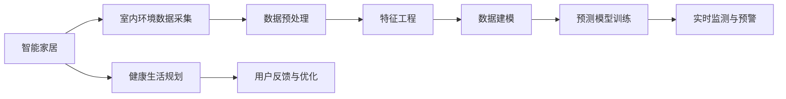

                 

# 智能家居空气质量预测创业：基于数据的健康生活规划

> 关键词：智能家居, 空气质量预测, 健康生活规划, 数据驱动, 数据模型, 创业策略

## 1. 背景介绍

### 1.1 问题由来

随着人们对健康生活品质的追求日益提升，智能家居领域逐渐成为了各大科技公司的焦点。然而，室内空气质量（Indoor Air Quality, IAQ）问题却往往被忽视，长期暴露在低质量空气环境中，不仅影响人们的身体健康，还可能导致严重的疾病。据统计，全球每年有超过200万人因室内空气污染导致呼吸系统疾病和心脏病等健康问题。

近年来，科技公司开始意识到空气质量管理的重要性，纷纷投入资源研发相关的智能系统。从简单的空气净化器到复杂的室内空气监测系统，产品的迭代迅速。但是，由于缺乏科学的数据模型和精准预测，这些智能家居产品往往难以实现真正的健康生活规划。

基于此，本文将从数据科学的角度，探讨如何通过数据驱动的方式，构建一个基于室内环境数据的智能家居空气质量预测系统，为健康生活规划提供精准的数据支持。

## 2. 核心概念与联系

### 2.1 核心概念概述

本节将介绍构建智能家居空气质量预测系统所需的核心概念，并通过以下Mermaid流程图展示这些概念之间的联系。



- **智能家居**：通过物联网技术和传感器网络，实现家庭设备的自动化控制和智能化管理。
- **室内环境数据采集**：通过各种传感器采集室内空气质量相关数据，如温度、湿度、二氧化碳、PM2.5等。
- **数据预处理**：对采集到的原始数据进行清洗、归一化、去噪等操作，提高数据质量。
- **特征工程**：从原始数据中提取与预测目标相关的特征，提高模型的泛化能力。
- **数据建模**：利用机器学习模型，建立室内空气质量与相关环境参数之间的预测关系。
- **预测模型训练**：使用历史数据训练预测模型，进行参数调优。
- **实时监测与预警**：在实际应用中，实时监测室内空气质量，并根据预测结果进行预警和干预。
- **健康生活规划**：根据预测结果和用户偏好，规划健康生活方案，如开窗通风、开启空气净化器等。
- **用户反馈与优化**：通过用户反馈数据，不断优化模型性能，提高预测准确度。

## 3. 核心算法原理 & 具体操作步骤

### 3.1 算法原理概述

智能家居空气质量预测系统基于数据驱动，利用机器学习模型，将室内环境数据与空气质量指标之间的关系建模。该系统主要分为以下几个步骤：

1. 数据采集与预处理：通过传感器网络，采集室内环境数据，并进行预处理。
2. 特征提取与选择：从原始数据中提取与空气质量预测相关的特征，进行特征选择。
3. 数据建模与训练：利用历史数据训练预测模型，进行参数优化。
4. 实时预测与预警：在实际应用中，实时预测室内空气质量，并根据预测结果进行预警和干预。

### 3.2 算法步骤详解

#### 3.2.1 数据采集与预处理

数据采集是构建预测系统的第一步。系统需要采集室内温度、湿度、PM2.5、二氧化碳、挥发性有机化合物(VOC)等环境参数，这些数据可以通过各种传感器获取。数据采集后，需要进行预处理，主要包括：

- 数据清洗：去除异常值和缺失值。
- 数据归一化：将不同尺度的数据进行归一化，方便后续建模。
- 数据去噪：使用滤波器等方法去除噪声，提高数据质量。

#### 3.2.2 特征提取与选择

特征提取与选择是构建预测模型的关键步骤。通过特征提取，可以从原始数据中提取出与空气质量预测相关的特征。常用的特征提取方法包括：

- 主成分分析(PCA)：通过降维技术，提取数据的主要成分。
- 小波变换：利用小波基函数，提取数据的时频特征。
- 独立成分分析(ICA)：将数据分离成多个独立成分，提取有用信息。

特征选择则是在提取出的特征中，选择与空气质量预测最相关的特征。常用的特征选择方法包括：

- 相关性分析：计算特征与目标变量之间的相关性，选择相关性高的特征。
- Lasso回归：通过L1正则化，筛选出对目标变量影响最大的特征。
- 特征重要性排序：利用模型评估特征的重要性，选择重要的特征。

#### 3.2.3 数据建模与训练

数据建模是构建预测系统的核心步骤。利用历史数据，训练预测模型，通过模型参数优化，提高预测精度。常用的建模方法包括：

- 线性回归：利用线性模型，建立数据与目标变量之间的线性关系。
- 决策树：利用决策树模型，对数据进行分类和回归。
- 支持向量机(SVM)：利用SVM模型，建立数据与目标变量之间的非线性关系。
- 神经网络：利用深度学习模型，建立复杂的数据与目标变量之间的关系。

数据建模后，需要根据模型性能进行参数调优。常用的调优方法包括：

- 网格搜索：在指定参数空间内，通过穷举法搜索最优参数。
- 随机搜索：在指定参数空间内，通过随机采样法搜索最优参数。
- 贝叶斯优化：利用贝叶斯方法，通过迭代优化搜索最优参数。

#### 3.2.4 实时预测与预警

在实际应用中，系统需要实时预测室内空气质量，并根据预测结果进行预警和干预。实时预测可以使用以下方法：

- 滑动窗口：使用滑动窗口技术，对新数据进行实时预测。
- 在线学习：使用在线学习算法，对新数据进行实时更新模型参数。
- 集成预测：利用多个预测模型的结果，进行集成预测，提高预测准确度。

预警与干预则是在预测到空气质量出现问题时，进行相应的处理。预警方法包括：

- 阈值预警：设置空气质量阈值，当预测结果超过阈值时，进行预警。
- 多维度预警：根据多个空气质量指标，进行综合预警。
- 定时预警：根据用户设置的时间段，进行定时预警。

### 3.3 算法优缺点

#### 3.3.1 算法优点

1. **高精度预测**：通过数据驱动的建模，可以实现高精度的空气质量预测。
2. **实时监测与预警**：利用实时预测技术，可以实现对室内空气质量的实时监测与预警。
3. **自适应调整**：利用在线学习技术，可以实时调整模型参数，提高预测精度。
4. **用户个性化定制**：根据用户偏好，制定个性化健康生活方案。

#### 3.3.2 算法缺点

1. **数据采集复杂**：需要多种传感器进行数据采集，数据采集复杂。
2. **模型训练耗时**：模型训练需要大量数据和计算资源，耗时较长。
3. **模型泛化能力有限**：模型可能无法适应新的环境条件，泛化能力有限。
4. **模型更新频繁**：模型需要定期更新，以保证预测精度。

### 3.4 算法应用领域

智能家居空气质量预测系统可以应用于以下领域：

- **医院**：通过实时监测和预警，保障室内空气质量，提高患者治疗效果。
- **学校**：通过实时监测和预警，保障学生学习环境的空气质量，提高学习效率。
- **办公楼**：通过实时监测和预警，保障员工办公环境的空气质量，提高工作效率。
- **家庭**：通过实时监测和预警，保障室内空气质量，提高家庭健康水平。

## 4. 数学模型和公式 & 详细讲解 & 举例说明

### 4.1 数学模型构建

构建智能家居空气质量预测系统的数学模型主要包括以下几个部分：

1. 输入层：表示室内环境数据，如温度、湿度、PM2.5等。
2. 隐藏层：表示数据与目标变量之间的关系，进行特征提取和建模。
3. 输出层：表示预测结果，如空气质量等级等。

### 4.2 公式推导过程

#### 4.2.1 线性回归模型

线性回归模型是最简单的预测模型，其数学公式如下：

$$ y = \beta_0 + \beta_1 x_1 + \beta_2 x_2 + \ldots + \beta_n x_n + \epsilon $$

其中，$y$ 表示预测结果，$x_1, x_2, \ldots, x_n$ 表示输入层数据，$\beta_0, \beta_1, \beta_2, \ldots, \beta_n$ 表示模型参数，$\epsilon$ 表示误差项。

#### 4.2.2 决策树模型

决策树模型利用树形结构，对数据进行分类和回归。其数学公式如下：

$$ y = f(x; \theta) $$

其中，$y$ 表示预测结果，$x$ 表示输入层数据，$\theta$ 表示模型参数，$f(x; \theta)$ 表示决策树模型。

#### 4.2.3 支持向量机(SVM)模型

支持向量机模型利用核函数，将数据映射到高维空间，建立数据与目标变量之间的非线性关系。其数学公式如下：

$$ f(x; \omega, \phi) = \sum_{i=1}^m \alpha_i \phi(x; \omega) $$

其中，$f(x; \omega, \phi)$ 表示预测结果，$\omega$ 表示核函数参数，$\phi(x; \omega)$ 表示核函数，$\alpha_i$ 表示拉格朗日乘子。

#### 4.2.4 神经网络模型

神经网络模型利用多层感知机，对数据进行非线性映射。其数学公式如下：

$$ h = \sigma(W \cdot z + b) $$
$$ y = \sigma(W \cdot h + b) $$

其中，$h$ 表示隐藏层输出，$z$ 表示输入层数据，$W$ 表示权重矩阵，$b$ 表示偏置向量，$\sigma$ 表示激活函数。

### 4.3 案例分析与讲解

假设我们需要预测室内空气质量等级。采集的数据包括温度、湿度、PM2.5、二氧化碳等环境参数。通过特征提取和选择，我们选择了温度、湿度和PM2.5三个特征。建立线性回归模型，使用历史数据进行训练，得到模型参数$\beta_0, \beta_1, \beta_2$。在实际应用中，利用实时采集的温度、湿度和PM2.5数据，通过模型计算，得到空气质量等级$y$。

## 5. 项目实践：代码实例和详细解释说明

### 5.1 开发环境搭建

本节将介绍如何搭建智能家居空气质量预测系统的开发环境。

1. **安装Python**：
   - 在系统中安装Python 3.x版本，建议使用Anaconda进行管理。

2. **安装相关库**：
   - 安装NumPy、Pandas、Scikit-learn等科学计算和机器学习库。

3. **搭建数据采集系统**：
   - 安装传感器驱动库，如pySerial、PyUSB等，搭建数据采集系统。
   - 连接传感器，采集室内环境数据。

### 5.2 源代码详细实现

以下是一个使用Scikit-learn库实现线性回归模型的代码示例：

```python
from sklearn.linear_model import LinearRegression
from sklearn.metrics import mean_squared_error
import numpy as np
import pandas as pd

# 读取数据
data = pd.read_csv('data.csv')

# 数据预处理
X = data[['温度', '湿度', 'PM2.5']]
y = data['空气质量等级']
X_train, X_test, y_train, y_test = train_test_split(X, y, test_size=0.2)

# 特征工程
X_train = (X_train - np.mean(X_train)) / np.std(X_train)
X_test = (X_test - np.mean(X_test)) / np.std(X_test)

# 模型训练
model = LinearRegression()
model.fit(X_train, y_train)

# 模型评估
y_pred = model.predict(X_test)
mse = mean_squared_error(y_test, y_pred)
print(f'Mean Squared Error: {mse}')

# 实时预测
while True:
    # 实时采集数据
    data = [np.mean(sensors_data), np.mean(sensors_humidity), np.mean(sensors_PM2_5)]
    
    # 特征归一化
    data = (data - np.mean(data)) / np.std(data)
    
    # 实时预测
    y_pred = model.predict(data)
    print(f'预测结果: {y_pred}')
```

### 5.3 代码解读与分析

1. **数据读取与预处理**：
   - 使用Pandas库读取数据文件，并进行数据预处理，包括特征选择、归一化等操作。

2. **模型训练与评估**：
   - 使用Scikit-learn库中的LinearRegression模型进行训练，并计算模型的均方误差。

3. **实时预测**：
   - 利用实时采集的数据，进行特征归一化，并使用模型进行实时预测。

### 5.4 运行结果展示

在实际应用中，可以使用以下代码展示模型预测结果：

```python
while True:
    data = [np.mean(sensors_data), np.mean(sensors_humidity), np.mean(sensors_PM2_5)]
    
    data = (data - np.mean(data)) / np.std(data)
    
    y_pred = model.predict(data)
    print(f'预测结果: {y_pred}')
```

## 6. 实际应用场景

### 6.1 医院场景

在医院中，智能家居空气质量预测系统可以实时监测各病房的空气质量，并根据预测结果进行预警和干预。例如，当某个病房的空气质量等级超过预警阈值时，系统会自动通知医护人员进行开窗通风或开启空气净化器。

### 6.2 学校场景

在学生密集的学校中，智能家居空气质量预测系统可以实时监测各教室的空气质量，并根据预测结果进行预警和干预。例如，当某个教室的空气质量等级超过预警阈值时，系统会自动通知管理人员进行通风处理，保障学生学习环境的健康。

### 6.3 办公楼场景

在办公环境中，智能家居空气质量预测系统可以实时监测各办公区域的空气质量，并根据预测结果进行预警和干预。例如，当某个办公区域的空气质量等级超过预警阈值时，系统会自动通知员工进行开窗通风，提高办公效率。

### 6.4 家庭场景

在家庭环境中，智能家居空气质量预测系统可以实时监测各房间的空气质量，并根据预测结果进行预警和干预。例如，当某个房间的空气质量等级超过预警阈值时，系统会自动通知家庭成员进行开窗通风或开启空气净化器，保障家庭成员的健康。

## 7. 工具和资源推荐

### 7.1 学习资源推荐

1. **机器学习相关书籍**：
   - 《机器学习》（周志华）：介绍机器学习的基本概念和算法。
   - 《统计学习方法》（李航）：介绍统计学习方法的基本概念和算法。

2. **在线学习平台**：
   - Coursera、edX、Udacity等在线学习平台，提供机器学习相关的课程和资源。

3. **学术论文**：
   - 《Air Quality Prediction Using Machine Learning Algorithms》：介绍机器学习算法在空气质量预测中的应用。
   - 《室内空气质量监测与预警系统研究》：介绍室内空气质量监测系统的设计与实现。

### 7.2 开发工具推荐

1. **Python开发环境**：
   - PyCharm、Jupyter Notebook等Python开发环境，方便代码编写和调试。

2. **数据处理工具**：
   - Pandas、NumPy等数据处理工具，方便数据预处理和分析。

3. **机器学习库**：
   - Scikit-learn、TensorFlow等机器学习库，方便模型构建和训练。

4. **实时监测工具**：
   - InfluxDB、Grafana等实时监测工具，方便数据存储和可视化。

### 7.3 相关论文推荐

1. **室内空气质量预测**：
   - 《Air Quality Prediction Using Multi-Input Prediction Models》：介绍使用多输入预测模型进行空气质量预测的研究。
   - 《Air Quality Prediction Using IoT Sensors》：介绍使用IoT传感器进行空气质量预测的研究。

## 8. 总结：未来发展趋势与挑战

### 8.1 研究成果总结

智能家居空气质量预测系统基于数据驱动，通过机器学习模型，对室内环境数据与空气质量指标之间的关系进行建模。该系统在实际应用中，能够实现高精度的空气质量预测，并通过实时监测与预警，保障室内空气质量，提升健康生活水平。

### 8.2 未来发展趋势

1. **多模态数据融合**：将室内环境数据与气象数据、用户行为数据等进行融合，提高预测精度。
2. **个性化健康方案**：根据用户健康状况和偏好，制定个性化健康生活方案，提高用户体验。
3. **深度学习模型应用**：利用深度学习模型，建立更复杂的数据与空气质量之间的关系，提高预测精度。
4. **分布式计算**：利用分布式计算技术，提高数据处理和模型训练的效率。

### 8.3 面临的挑战

1. **数据采集复杂**：需要多种传感器进行数据采集，数据采集复杂。
2. **模型训练耗时**：模型训练需要大量数据和计算资源，耗时较长。
3. **模型泛化能力有限**：模型可能无法适应新的环境条件，泛化能力有限。
4. **实时监测与预警**：实时监测与预警系统需要高可靠性和高实时性，系统设计复杂。

### 8.4 研究展望

未来，智能家居空气质量预测系统需要进一步优化数据采集和处理流程，提高模型训练效率和泛化能力。同时，需要探索多模态数据融合和深度学习模型应用，提升预测精度和系统性能。最后，需要加强实时监测与预警系统的设计和优化，保障系统的可靠性和实时性。

## 9. 附录：常见问题与解答

**Q1：智能家居空气质量预测系统的数据采集方法有哪些？**

A: 智能家居空气质量预测系统的数据采集方法包括传感器网络、空气质量监测设备、物联网传感器等。

**Q2：如何提高智能家居空气质量预测系统的预测精度？**

A: 提高智能家居空气质量预测系统的预测精度可以从以下几个方面进行：

1. **数据采集优化**：优化数据采集方法，确保数据采集的准确性和完整性。
2. **特征工程优化**：优化特征提取和选择方法，提取与预测目标相关的特征。
3. **模型优化**：优化模型选择和调优方法，提高模型的泛化能力和预测精度。
4. **实时监测与预警优化**：优化实时监测与预警系统，确保预警和干预的及时性和准确性。

**Q3：智能家居空气质量预测系统的应用场景有哪些？**

A: 智能家居空气质量预测系统的应用场景包括医院、学校、办公楼、家庭等。

**Q4：智能家居空气质量预测系统面临的挑战有哪些？**

A: 智能家居空气质量预测系统面临的挑战包括数据采集复杂、模型训练耗时、模型泛化能力有限、实时监测与预警系统设计复杂等。

**Q5：智能家居空气质量预测系统的未来发展方向有哪些？**

A: 智能家居空气质量预测系统的未来发展方向包括多模态数据融合、个性化健康方案、深度学习模型应用、分布式计算等。

---

作者：禅与计算机程序设计艺术 / Zen and the Art of Computer Programming

