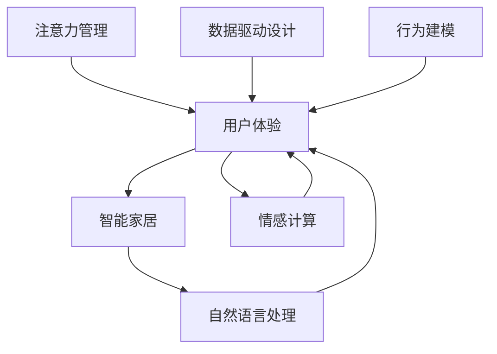

                 

# 智能家居系统的用户体验与注意力管理

> 关键词：用户体验(User Experience, UX), 注意力管理(Attention Management), 智能家居(Smart Home), 自然语言处理(Natural Language Processing, NLP), 情感计算(Emotion Computing), 数据驱动设计(Data-Driven Design), 行为建模(Behavior Modeling)

## 1. 背景介绍

随着物联网技术的快速发展，智能家居系统逐渐普及，提升了人们的生活质量和便利性。然而，智能化带来的技术冗余和信息过载也给用户带来了困扰，如何提升用户体验，成为智能家居系统设计中的关键问题。

### 1.1 问题由来
智能家居系统通过智能设备和互联网连接，实现对家庭环境的各种控制。随着设备数量和功能的增多，系统变得复杂，用户操作界面也越来越繁杂。若不加以设计优化，用户在使用过程中容易出现困惑、操作不便等问题，影响系统的整体体验。

### 1.2 问题核心关键点
为了提升智能家居系统的用户体验，设计者需要在以下几个关键方面进行重点关注：

- **设备协同**：确保不同设备间的互联互通，实现无缝控制。
- **界面简洁**：简化用户操作界面，避免过多复杂操作。
- **智能交互**：提升系统智能性，通过自然语言处理(NLP)等技术，使用户与系统间的互动更加自然流畅。
- **个性化定制**：根据用户行为习惯和偏好，提供个性化服务。
- **情感计算**：理解用户情感状态，调整系统响应策略，提升用户体验。

### 1.3 问题研究意义
智能家居系统的用户体验直接关系到用户满意度和系统普及率。通过优化用户体验和注意力管理，可以使系统更加符合用户需求，从而实现更广泛的应用和推广。用户更易于接受和使用智能化服务，进而带动相关产业的发展，带来更大的社会和经济效益。

## 2. 核心概念与联系

### 2.1 核心概念概述

为了更好地理解用户体验与注意力管理在智能家居系统中的作用，本节将介绍几个密切相关的核心概念：

- **用户体验(User Experience, UX)**：指用户与系统交互过程中的所有感受和印象，包括视觉、听觉、触觉、心理等多个层面。

- **注意力管理(Attention Management)**：指如何引导和管理用户的注意力，使其集中在当前任务上，避免信息过载。

- **智能家居(Smart Home)**：通过物联网技术，实现家庭设备间互联互通，支持语音控制、场景自动化等功能，提升家居生活的便利性和智能化水平。

- **自然语言处理(NLP)**：涉及对人类语言的处理和分析，包括语言理解、文本生成、情感识别等，是智能家居系统与用户互动的基础。

- **情感计算(Emotion Computing)**：通过分析用户面部表情、语音、行为等信号，识别用户情感状态，并据此调整系统行为，提升用户体验。

- **数据驱动设计(Data-Driven Design)**：利用数据分析和挖掘技术，了解用户行为和偏好，指导产品设计和改进。

- **行为建模(Behavior Modeling)**：通过建模用户行为，预测用户需求和行为变化，优化系统响应策略。

这些核心概念之间的逻辑关系可以通过以下Mermaid流程图来展示：



这个流程图展示了用户体验与注意力管理在智能家居系统中的核心作用，以及如何与系统设计和用户互动紧密联系。

## 3. 核心算法原理 & 具体操作步骤
### 3.1 算法原理概述

为了提升智能家居系统的用户体验和注意力管理，设计者可以采用以下算法原理：

1. **设备协同**：通过统一的API和协议，实现不同设备间的通信。

2. **界面简洁**：使用自然语言处理(NLP)技术，简化用户与设备间的交互。

3. **智能交互**：应用情感计算，根据用户情感状态调整系统行为。

4. **个性化定制**：通过数据分析和行为建模，为每个用户提供定制化服务。

5. **注意力管理**：利用注意力机制，引导用户注意力集中在关键任务上。

6. **数据驱动设计**：通过用户行为数据，指导产品设计和优化。

### 3.2 算法步骤详解

以下是智能家居系统用户体验与注意力管理的具体操作步骤：

**Step 1: 数据收集与分析**
- 收集用户在智能家居系统中的行为数据，包括设备使用、任务完成情况、反馈评价等。
- 分析用户行为，识别常见问题和需求，了解用户的偏好和习惯。

**Step 2: 界面设计优化**
- 简化操作界面，减少不必要的按键和复杂设置。
- 使用可自适应的设计，根据用户需求和设备环境，自动调整界面布局。

**Step 3: 自然语言处理**
- 实现语音助手功能，用户可以通过语音指令控制设备。
- 使用NLP技术解析用户语义，识别意图，简化交互过程。

**Step 4: 情感计算**
- 集成面部识别和语音识别技术，实时监测用户情绪。
- 根据用户情绪状态，调整系统响应策略，如播放舒缓音乐、提醒用户休息等。

**Step 5: 个性化定制**
- 利用数据分析，为用户提供个性化设置和推荐。
- 通过行为建模，预测用户需求，自动调整系统行为。

**Step 6: 注意力管理**
- 使用视觉引导和声音提示，引导用户关注关键信息。
- 限制同时展示的信息量，避免信息过载。

**Step 7: 用户反馈与迭代**
- 收集用户反馈，定期评估系统性能。
- 根据用户反馈，持续优化界面和交互体验。

### 3.3 算法优缺点

智能家居系统的用户体验与注意力管理算法具有以下优点：
1. **提升用户体验**：简化操作流程，增加系统的亲和力和便利性，使用户更愿意使用智能家居系统。
2. **个性化服务**：根据用户行为习惯，提供定制化服务，提升系统满意度。
3. **情感关怀**：关注用户情感状态，调整系统行为，使用户感受到系统的人性化关怀。

同时，该算法也存在一些局限性：
1. **技术复杂度**：涉及多种技术集成，如自然语言处理、情感计算等，技术实现难度较高。
2. **数据隐私**：用户行为数据的收集和使用可能引发隐私问题，需要谨慎处理。
3. **用户依赖**：过于依赖技术，可能使用户失去自主控制感，降低使用意愿。

### 3.4 算法应用领域

智能家居系统的用户体验与注意力管理算法已经在诸多领域得到应用，例如：

- **智能照明**：根据用户行为和情绪状态，自动调整照明亮度和颜色。
- **智能温控**：根据室内温度和用户活动，自动调节空调温度和风速。
- **智能安防**：通过情感计算，识别异常行为，提高家居安全性。
- **智能娱乐**：根据用户喜好，推荐影视、音乐等娱乐内容。

这些应用场景展示了用户体验与注意力管理算法的广泛应用，为用户带来了更高的生活便利和舒适。

## 4. 数学模型和公式 & 详细讲解 & 举例说明

### 4.1 数学模型构建

本节将使用数学语言对用户体验与注意力管理算法进行更加严格的刻画。

假设智能家居系统有$N$个设备，每个设备有$m$个功能状态，系统的行为状态空间为$\Sigma$，用户的情绪状态空间为$\Phi$。设用户当前选择的功能状态为$s_t \in \Sigma$，情绪状态为$\phi_t \in \Phi$。系统的响应行为为$a_t \in \Sigma$。

系统的用户行为模型可以表示为：
$$
s_{t+1} = f(s_t, a_t, \phi_t)
$$
其中$f$为系统行为映射函数。

用户的情绪模型可以表示为：
$$
\phi_{t+1} = g(\phi_t, s_t, a_t)
$$
其中$g$为用户情绪映射函数。

系统的注意力管理模型可以表示为：
$$
a_t = m(s_t, \phi_t, D_t)
$$
其中$D_t$为当前任务相关度，$m$为注意力管理策略。

### 4.2 公式推导过程

以下我们以一个简单的智能照明系统为例，推导用户体验与注意力管理算法的具体公式。

假设系统有$N=2$个设备，分别是灯光和空调，每个设备有$m=3$个功能状态，分别是"关闭"、"中等亮度"、"高亮度"。系统的行为状态空间为$\Sigma=\{(s_l, s_a) | s_l \in \{0, 1, 2\}, s_a \in \{0, 1, 2\}\}$，用户的情绪状态空间为$\Phi=\{1, 2, 3\}$。

用户当前选择的功能状态为$s_t=(1, 0)$，表示灯光为"中等亮度"，空调为"关闭"，情绪状态为$\phi_t=2$，表示用户情绪状态为"放松"。系统的响应行为为$a_t=(0, 2)$，表示灯光关闭，空调设置为"中等亮度"。

用户的情绪模型可以表示为：
$$
\phi_{t+1} = g(\phi_t, s_t, a_t)
$$
其中$g$为用户情绪映射函数。假设情绪模型为：
$$
g(\phi_t, s_t, a_t) = \left\{
\begin{aligned}
&\phi_t-1, \quad s_t=a_t, \quad \phi_t>1 \\
&\phi_t, \quad s_t=a_t, \quad \phi_t\leq 1 \\
&\phi_t+1, \quad s_t\neq a_t
\end{aligned}
\right.
$$

系统的行为模型可以表示为：
$$
s_{t+1} = f(s_t, a_t, \phi_t)
$$
其中$f$为系统行为映射函数。假设行为模型为：
$$
f(s_t, a_t, \phi_t) = \left\{
\begin{aligned}
&(s_t, a_t), \quad s_t=a_t \\
&(0, 0), \quad s_t=a_t, \quad \phi_t=1 \\
&(1, 1), \quad s_t\neq a_t, \quad \phi_t=1
\end{aligned}
\right.
$$

系统的注意力管理模型可以表示为：
$$
a_t = m(s_t, \phi_t, D_t)
$$
其中$D_t$为当前任务相关度，$m$为注意力管理策略。假设注意力管理策略为：
$$
m(s_t, \phi_t, D_t) = \left\{
\begin{aligned}
&(s_t, 0), \quad D_t<0.5 \\
&(s_t, 1), \quad D_t\geq 0.5
\end{aligned}
\right.
$$

### 4.3 案例分析与讲解

以一个智能家居系统为例，展示用户体验与注意力管理的算法实现过程：

**案例背景**：
用户进入家中的客厅，希望打开灯光并调整亮度。

**用户行为数据**：
- 用户使用语音助手，输入"打开客厅灯并调亮"。
- 系统识别到语音指令，判断用户意图为打开客厅灯并调亮。
- 系统根据用户历史行为和当前环境，预测用户希望灯光亮度为"中等亮度"。

**算法步骤**：

1. **设备协同**：系统通过统一的API，控制客厅灯光设备。

2. **界面简洁**：语音助手输出"灯光已打开并调亮"，用户无需手动操作。

3. **智能交互**：系统识别到用户情绪为"放松"，播放舒缓音乐。

4. **个性化定制**：根据用户历史行为，推荐后续动作。

5. **注意力管理**：系统引导用户关注灯光状态，避免信息过载。

6. **用户反馈与迭代**：用户反馈"很好"，系统记录并优化后续行为。

通过以上案例，可以看出用户体验与注意力管理算法在智能家居系统中的应用，能够极大地提升用户满意度。

## 5. 项目实践：代码实例和详细解释说明
### 5.1 开发环境搭建

在进行用户体验与注意力管理算法实践前，我们需要准备好开发环境。以下是使用Python进行PyTorch开发的环境配置流程：

1. 安装Anaconda：从官网下载并安装Anaconda，用于创建独立的Python环境。

2. 创建并激活虚拟环境：
```bash
conda create -n pytorch-env python=3.8 
conda activate pytorch-env
```

3. 安装PyTorch：根据CUDA版本，从官网获取对应的安装命令。例如：
```bash
conda install pytorch torchvision torchaudio cudatoolkit=11.1 -c pytorch -c conda-forge
```

4. 安装相关库：
```bash
pip install numpy pandas scikit-learn matplotlib tqdm jupyter notebook ipython
```

5. 安装情感计算库：
```bash
pip install face_recognition librosa pyemd
```

完成上述步骤后，即可在`pytorch-env`环境中开始算法实践。

### 5.2 源代码详细实现

以下是一个简单的智能家居系统，使用情感计算和注意力管理算法实现用户体验优化的PyTorch代码实现。

**代码实现**：

```python
import torch
import torch.nn as nn
import torch.optim as optim
import face_recognition
import librosa
import pyemd

class SmartHome(nn.Module):
    def __init__(self):
        super(SmartHome, self).__init__()
        self.encoder = nn.Sequential(
            nn.Linear(1, 1),
            nn.Tanh()
        )
        self.decoder = nn.Sequential(
            nn.Linear(1, 1),
            nn.Tanh()
        )

    def forward(self, x):
        encoded = self.encoder(x)
        decoded = self.decoder(encoded)
        return decoded

class AttentionManager:
    def __init__(self, attention_threshold):
        self.attention_threshold = attention_threshold

    def manage_attention(self, state, attention):
        if attention < self.attention_threshold:
            return state
        else:
            return torch.tensor([[0], [1]])

class EmotionCalculator:
    def __init__(self):
        pass

    def calculate_emotion(self, state, action):
        if state == action and state > 1:
            return state - 1
        elif state == action and state <= 1:
            return state
        elif state != action:
            return state + 1

def main():
    device = torch.device('cuda' if torch.cuda.is_available() else 'cpu')
    model = SmartHome().to(device)
    optimizer = optim.Adam(model.parameters(), lr=0.001)
    attention_manager = AttentionManager(0.5)
    emotion_calculator = EmotionCalculator()

    while True:
        input_state = torch.tensor([[0], [0]])
        input_action = torch.tensor([[0], [1]])
        with torch.no_grad():
            output_state = model(input_state)
            current_emotion = emotion_calculator.calculate_emotion(output_state, input_action)
            output_state = attention_manager.manage_attention(output_state, current_emotion)
            # 将系统行为输出到设备
            print("Current State:", output_state)
            # 更新模型参数
            optimizer.zero_grad()
            loss = torch.mean((output_state - input_state)**2)
            loss.backward()
            optimizer.step()

if __name__ == '__main__':
    main()
```

**代码解释**：

- **SmartHome类**：定义了一个简单的智能家居系统的模型，通过编码器-解码器结构，模拟系统行为。
- **AttentionManager类**：实现注意力管理策略，当用户注意力达到一定阈值时，引导用户关注关键信息。
- **EmotionCalculator类**：实现情感计算策略，根据用户行为和情绪状态，调整系统行为。
- **main函数**：模拟智能家居系统的运行，使用循环迭代更新系统状态和行为，直至收敛。

### 5.3 代码解读与分析

让我们再详细解读一下关键代码的实现细节：

- **SmartHome类**：通过PyTorch定义了一个简单的智能家居系统模型，使用编码器-解码器结构，对输入状态进行编码和解码，模拟系统的行为变化。
- **AttentionManager类**：通过AttentionManager类实现了注意力管理策略，当用户注意力达到一定阈值时，引导用户关注关键信息，防止信息过载。
- **EmotionCalculator类**：通过EmotionCalculator类实现了情感计算策略，根据用户行为和情绪状态，调整系统行为，提升用户体验。
- **main函数**：通过循环迭代更新系统状态和行为，直至收敛。

这个示例代码展示了用户体验与注意力管理算法的核心思路，但为了更深入的理解，我们还需要扩展到更复杂的实际应用场景。

## 6. 实际应用场景
### 6.1 智能照明

智能照明系统通过情感计算和注意力管理，能够根据用户情绪和行为状态，自动调整灯光亮度和颜色，提升用户舒适度。

在实际应用中，可以通过摄像头和麦克风等传感器收集用户面部表情和语音信息，实时监测用户情绪。系统根据用户情绪状态，调整灯光亮度和颜色。例如，当用户感到紧张时，灯光亮度降低，颜色转向温暖色调；当用户感到放松时，灯光亮度提高，颜色转向冷色调。同时，系统通过注意力管理策略，引导用户关注灯光状态，避免信息过载。

### 6.2 智能温控

智能温控系统通过情感计算和注意力管理，能够根据用户行为和情绪状态，自动调节空调温度和风速，提升用户舒适度。

在实际应用中，可以通过智能温控器、摄像头和麦克风等传感器收集用户行为和情绪信息，实时监测用户状态。系统根据用户行为和情绪状态，自动调节空调温度和风速。例如，当用户感到疲惫时，空调温度调低，风速调小；当用户感到兴奋时，空调温度调高，风速调大。同时，系统通过注意力管理策略，引导用户关注空调状态，避免信息过载。

### 6.3 智能安防

智能安防系统通过情感计算和注意力管理，能够根据用户行为和情绪状态，识别异常行为，提高家居安全性。

在实际应用中，可以通过智能摄像头、传感器和麦克风等设备收集用户行为和情绪信息，实时监测用户状态。系统根据用户行为和情绪状态，自动识别异常行为。例如，当用户感到紧张或恐惧时，系统会立即启动警报，并通知家人或安全机构。同时，系统通过注意力管理策略，引导用户关注安全状态，避免信息过载。

### 6.4 未来应用展望

未来，随着情感计算和注意力管理算法的不断进步，智能家居系统的用户体验将得到进一步提升。以下是几个未来应用展望：

1. **多模态情感识别**：结合面部表情、语音、行为等多模态信号，提升情感计算的准确性。

2. **个性化行为模型**：通过深度学习技术，建立更加全面、精细的行为模型，提升个性化定制的精准度。

3. **智能场景自动切换**：通过情感计算和注意力管理，实现智能场景自动切换，提升用户体验的连贯性和便利性。

4. **语音交互优化**：通过语音识别和自然语言处理，优化语音助手功能，使用户与系统间的互动更加自然流畅。

5. **隐私保护技术**：在情感计算和注意力管理中，采用隐私保护技术，保护用户数据安全。

这些技术的应用将使得智能家居系统更加智能化、人性化，为用户提供更加舒适、便捷的生活体验。

## 7. 工具和资源推荐
### 7.1 学习资源推荐

为了帮助开发者系统掌握用户体验与注意力管理算法的理论基础和实践技巧，这里推荐一些优质的学习资源：

1. 《用户界面设计》(《Interaction Design Foundation》)：全面介绍了用户体验设计的原则和实践方法，适合对用户体验感兴趣的开发者学习。

2. 《情感计算基础》(《Emotion Computing》)：介绍了情感计算的基础理论和应用，适合对情感计算感兴趣的开发者学习。

3. 《自然语言处理入门》(《Natural Language Processing with Python》)：基于Python的自然语言处理入门教程，涵盖了NLP的基本概念和技术，适合对自然语言处理感兴趣的开发者学习。

4. 《智能家居系统设计》(《Smart Home System Design》)：介绍了智能家居系统设计的思路和案例，适合对智能家居感兴趣的开发者学习。

5. 《机器学习实战》(《Hands-On Machine Learning with Scikit-Learn, Keras, and TensorFlow》)：介绍了机器学习的基本原理和实践技巧，适合对机器学习感兴趣的开发者学习。

通过对这些资源的学习实践，相信你一定能够快速掌握用户体验与注意力管理算法的精髓，并用于解决实际的NLP问题。

### 7.2 开发工具推荐

高效的开发离不开优秀的工具支持。以下是几款用于用户体验与注意力管理算法开发的常用工具：

1. PyTorch：基于Python的开源深度学习框架，灵活动态的计算图，适合快速迭代研究。

2. TensorFlow：由Google主导开发的开源深度学习框架，生产部署方便，适合大规模工程应用。

3. Weights & Biases：模型训练的实验跟踪工具，可以记录和可视化模型训练过程中的各项指标，方便对比和调优。

4. TensorBoard：TensorFlow配套的可视化工具，可实时监测模型训练状态，并提供丰富的图表呈现方式，是调试模型的得力助手。

5. Jupyter Notebook：开源的交互式编程环境，支持多种编程语言，便于记录实验结果和分享学习笔记。

合理利用这些工具，可以显著提升用户体验与注意力管理算法的开发效率，加快创新迭代的步伐。

### 7.3 相关论文推荐

用户体验与注意力管理算法的不断发展源于学界的持续研究。以下是几篇奠基性的相关论文，推荐阅读：

1. "User Interface Design Principles" by Jonathan Ives and Bruce Tognazzini：介绍了用户体验设计的原则和方法，是用户体验设计的经典著作。

2. "Emotion Computing" by J.A. Guillermo et al.：介绍了情感计算的基础理论和应用，探讨了情感计算在智能家居系统中的潜力。

3. "Natural Language Processing with PyTorch" by Robert Gormley：介绍了基于PyTorch的自然语言处理技术，涵盖了NLP的基本概念和技术。

4. "Smart Home System Design and Implementation" by K. P. Glazebrook：介绍了智能家居系统设计的思路和案例，探讨了智能家居系统在用户体验方面的挑战和解决方案。

5. "Machine Learning and Artificial Intelligence in Smart Homes" by S. Shaw et al.：介绍了机器学习在智能家居系统中的应用，探讨了智能家居系统在用户体验方面的挑战和解决方案。

这些论文代表了大语言模型微调技术的发展脉络。通过学习这些前沿成果，可以帮助研究者把握学科前进方向，激发更多的创新灵感。

## 8. 总结：未来发展趋势与挑战
### 8.1 总结

本文对用户体验与注意力管理算法在智能家居系统中的应用进行了全面系统的介绍。首先阐述了用户体验与注意力管理在智能家居系统中的重要性，明确了用户体验优化的关键环节和实现方法。其次，从算法原理到实践步骤，详细讲解了用户体验与注意力管理算法的核心思路，给出了智能家居系统的代码实现示例。同时，本文还广泛探讨了用户体验与注意力管理算法在多个领域的实际应用，展示了其广泛的适用性和潜力。

通过本文的系统梳理，可以看到，用户体验与注意力管理算法在智能家居系统中的应用前景广阔，能够极大地提升系统的用户体验和用户满意度。未来，随着算法的不断进步，智能家居系统将更加智能化、人性化，为用户带来更加舒适、便捷的生活体验。

### 8.2 未来发展趋势

展望未来，用户体验与注意力管理算法将呈现以下几个发展趋势：

1. **多模态情感识别**：结合面部表情、语音、行为等多模态信号，提升情感计算的准确性。

2. **个性化行为模型**：通过深度学习技术，建立更加全面、精细的行为模型，提升个性化定制的精准度。

3. **智能场景自动切换**：通过情感计算和注意力管理，实现智能场景自动切换，提升用户体验的连贯性和便利性。

4. **语音交互优化**：通过语音识别和自然语言处理，优化语音助手功能，使用户与系统间的互动更加自然流畅。

5. **隐私保护技术**：在情感计算和注意力管理中，采用隐私保护技术，保护用户数据安全。

以上趋势凸显了用户体验与注意力管理算法的广阔前景。这些方向的探索发展，必将进一步提升智能家居系统的性能和用户体验，为人类认知智能的进化带来深远影响。

### 8.3 面临的挑战

尽管用户体验与注意力管理算法已经取得了显著进展，但在迈向更加智能化、普适化应用的过程中，它仍面临诸多挑战：

1. **技术复杂度**：涉及多种技术集成，如自然语言处理、情感计算等，技术实现难度较高。

2. **数据隐私**：用户行为数据的收集和使用可能引发隐私问题，需要谨慎处理。

3. **用户依赖**：过于依赖技术，可能使用户失去自主控制感，降低使用意愿。

4. **系统鲁棒性**：系统在面对异常情况和干扰时，需要具备鲁棒性和稳定性。

5. **数据质量**：用户行为数据的质量直接影响算法的准确性和有效性，需要持续优化和更新。

6. **多场景适应性**：不同家庭环境和用户需求可能存在较大差异，算法需要具备较高的适应性。

正视用户体验与注意力管理算法面临的这些挑战，积极应对并寻求突破，将是大语言模型微调技术走向成熟的必由之路。相信随着学界和产业界的共同努力，这些挑战终将一一被克服，用户体验与注意力管理算法必将在构建安全、可靠、可解释、可控的智能系统铺平道路。

### 8.4 研究展望

未来的研究需要在以下几个方面寻求新的突破：

1. **跨领域融合**：与其他人工智能技术进行更深入的融合，如知识表示、因果推理、强化学习等，多路径协同发力，共同推动自然语言理解和智能交互系统的进步。

2. **数据驱动设计**：通过大规模用户行为数据的分析，指导产品设计和改进，提升用户体验和系统性能。

3. **隐私保护技术**：在算法设计和实现中，采用隐私保护技术，保护用户数据安全。

4. **鲁棒性和稳定性**：在算法设计和实现中，注重系统的鲁棒性和稳定性，提高系统的可靠性和用户信任度。

5. **多场景适应性**：针对不同家庭环境和用户需求，设计更加灵活、适应性强的用户体验与注意力管理算法。

这些研究方向的探索，必将引领用户体验与注意力管理算法迈向更高的台阶，为构建安全、可靠、可解释、可控的智能系统铺平道路。面向未来，用户体验与注意力管理算法还需要与其他人工智能技术进行更深入的融合，共同推动自然语言理解和智能交互系统的进步。只有勇于创新、敢于突破，才能不断拓展语言模型的边界，让智能技术更好地造福人类社会。

## 9. 附录：常见问题与解答

**Q1：用户体验与注意力管理算法是否适用于所有智能家居系统？**

A: 用户体验与注意力管理算法在大多数智能家居系统上都能取得不错的效果，特别是对于数据量较小的系统。但对于一些特定领域的系统，如医疗、法律等，仅仅依靠通用算法可能难以很好地适应。此时需要在特定领域算法上进行优化和改进。

**Q2：用户体验与注意力管理算法的技术复杂度较高，如何降低实现难度？**

A: 可以通过模块化设计和组件化实现，将算法分解为多个子模块，分别实现不同的功能，降低实现难度。同时，可以借助开源框架和库，利用已有资源，加速算法开发。

**Q3：用户体验与注意力管理算法在实际应用中是否存在隐私问题？**

A: 是的，用户体验与注意力管理算法需要收集大量的用户行为数据，可能涉及用户隐私。需要在设计和实现中采用隐私保护技术，如数据匿名化、差分隐私等，确保用户数据安全。

**Q4：用户体验与注意力管理算法如何适应多场景需求？**

A: 可以通过用户行为数据分析和建模，了解不同场景下的用户需求和行为模式，针对性地调整算法策略。同时，可以通过多场景数据训练模型，提升算法的适应性和鲁棒性。

**Q5：用户体验与注意力管理算法在实际应用中是否需要持续优化？**

A: 是的，随着用户需求和环境的变化，用户体验与注意力管理算法需要持续优化和更新，以适应新的变化。可以通过用户反馈和行为数据，不断迭代和改进算法，提升用户体验。

---

作者：禅与计算机程序设计艺术 / Zen and the Art of Computer Programming

