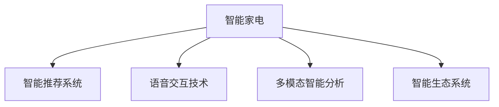

                 

## 1. 背景介绍

### 1.1 问题由来

随着物联网技术的迅速发展，智能家电已经逐渐成为家庭生活的标配。然而，在互联网浪潮中，智能家电行业面临着严峻的挑战：

- **竞争加剧**：市场份额日益分散，各品牌之间竞争激烈，小品牌难以突出重围。
- **用户体验差**：许多智能家电缺乏个性化服务，无法根据用户行为和偏好进行精准推荐，用户黏性低。
- **数据孤岛**：各个品牌之间数据难以互通，无法形成全局的智能场景，用户体验受限。
- **智能功能不足**：多数智能家电仅仅提供了简单的语音控制、远程控制等功能，难以满足用户多样化的需求。
- **价格战导致利润下降**：价格竞争使得部分企业不得不牺牲产品质量，影响了用户体验和品牌形象。

面对这些问题，智能家电企业需要转变思路，从传统的商品销售模式转向智能化、个性化服务模式，构建以用户为中心的智能生态系统。在这一背景下，智能家电需要在注意力经济中突围，通过提升用户体验，打造差异化品牌，从而赢得市场份额。

### 1.2 问题核心关键点

智能家电在注意力经济中突围的关键点包括：

- **个性化推荐系统**：通过分析用户行为数据，提供个性化的家电推荐和智能控制方案。
- **智能交互与语音控制**：实现自然语言理解和语音控制，提升用户交互体验。
- **数据整合与分析**：整合家庭环境数据，实现场景联动和智能分析，提升用户体验。
- **全场景覆盖与生态构建**：覆盖多个智能设备，构建全场景的智能生态系统，实现无缝的用户体验。
- **智能算法与技术应用**：采用先进的智能算法和数据挖掘技术，提升产品的智能化程度和用户体验。

## 2. 核心概念与联系

### 2.1 核心概念概述

为更好地理解智能家电在注意力经济中突围的方法，本节将介绍几个密切相关的核心概念：

- **注意力经济**：指在信息爆炸时代，人们获取信息的注意力成为一种稀缺资源，从而影响产品或服务的市场价值。通过吸引和维持用户注意力，可以提升产品竞争力。
- **智能推荐系统**：通过分析用户的历史行为和偏好，推荐符合用户兴趣的产品或服务，提升用户体验和满意度。
- **语音交互技术**：利用语音识别、自然语言处理等技术，实现用户与智能设备的自然语言交互，提升用户体验。
- **多模态智能分析**：结合语音、图像、文本等多模态数据，进行综合分析和推理，提升智能家电的智能化水平。
- **智能生态系统**：通过连接不同品牌、不同种类的智能设备，构建覆盖全场景的智能生态系统，实现无缝的用户体验。

这些核心概念之间的逻辑关系可以通过以下Mermaid流程图来展示：



这个流程图展示了这个核心概念的相互关系：

1. 智能家电通过智能推荐系统、语音交互技术、多模态智能分析等技术，提升用户体验。
2. 智能生态系统通过整合不同品牌、不同种类的智能设备，实现全场景覆盖，提升用户满意度。

## 3. 核心算法原理 & 具体操作步骤

### 3.1 算法原理概述

智能家电在注意力经济中突围，主要是通过构建智能推荐系统、提升语音交互技术、进行多模态智能分析等技术手段，以吸引和维持用户的注意力。其核心算法原理主要包括：

- **协同过滤算法**：通过分析用户行为数据，推荐用户可能感兴趣的其他产品或服务。
- **深度学习算法**：利用深度学习模型，对用户行为数据进行复杂分析和预测，提升推荐精度。
- **自然语言处理算法**：对用户语音指令进行自然语言处理，实现语音控制和智能交互。
- **多模态融合算法**：结合语音、图像、文本等多模态数据，进行综合分析和推理，提升智能家电的智能化程度和用户体验。

### 3.2 算法步骤详解

以下是智能家电在注意力经济中突围的主要算法步骤：

**Step 1: 数据采集与预处理**

- 收集用户的历史行为数据，如使用时间、频率、偏好等。
- 对数据进行清洗和预处理，去除噪音和异常值，保证数据的准确性和可靠性。

**Step 2: 特征提取与建模**

- 对用户行为数据进行特征提取，如使用时间、设备类型、用户偏好等。
- 利用协同过滤算法、深度学习算法等，建立智能推荐模型。
- 对用户语音指令进行分词、语音识别，转化为可处理的文本数据。
- 利用自然语言处理算法，对文本数据进行语义理解和意图识别。

**Step 3: 模型训练与优化**

- 在训练数据上训练智能推荐模型，优化推荐算法。
- 对语音控制和智能交互模型进行训练，提升语音识别和自然语言处理能力。
- 利用多模态融合算法，将不同模态的数据进行综合分析，提升智能分析精度。

**Step 4: 模型部署与反馈**

- 将训练好的模型部署到智能家电系统中，实现个性化推荐、语音控制和智能分析等功能。
- 对用户的使用数据进行收集和分析，不断优化推荐算法和交互模型，提升用户体验。
- 建立用户反馈机制，及时获取用户意见和建议，进行模型调整和优化。

**Step 5: 生态系统构建**

- 整合不同品牌、不同种类的智能设备，构建全场景的智能生态系统。
- 实现不同设备之间的数据互通和场景联动，提升用户体验。
- 通过云平台和服务接口，实现远程控制和管理，提升智能家电的智能化水平。

### 3.3 算法优缺点

智能家电在注意力经济中突围的算法主要优点包括：

- **提升用户体验**：通过个性化推荐和智能交互，提升用户的使用体验和满意度。
- **提高市场竞争力**：通过吸引和维持用户注意力，提高市场竞争力。
- **实现场景联动**：通过多模态智能分析，实现不同设备之间的数据互通和场景联动，提升用户体验。

同时，这些算法也存在一定的局限性：

- **数据隐私问题**：用户行为数据和语音数据涉及隐私保护，需要严格的数据管理和隐私保护措施。
- **计算复杂度高**：深度学习模型和协同过滤算法计算复杂度高，需要高性能的计算资源。
- **模型泛化能力有限**：各品牌数据差异较大，不同品牌之间难以实现有效的协同过滤和推荐。
- **多模态数据融合难度大**：语音、图像、文本等多模态数据融合难度大，需要复杂的数据处理和分析算法。
- **用户体验一致性问题**：不同品牌之间智能家电的体验不一致，影响用户的使用感受。

### 3.4 算法应用领域

智能家电在注意力经济中突围的算法在以下领域得到了广泛应用：

- **智能家居控制**：通过语音控制和智能推荐，实现家庭自动化和智能化。
- **智能医疗**：利用多模态智能分析，进行健康监测和个性化医疗推荐。
- **智能办公**：通过智能推荐和语音控制，提升办公效率和用户体验。
- **智能教育**：利用智能推荐和语音交互，提升教学质量和学生学习体验。
- **智能交通**：结合多模态数据，进行智能分析和场景联动，提升交通出行体验。

此外，智能家电在注意经济中突围的算法还被应用于智能城市、智能安防、智能制造等多个领域，推动了这些行业的数字化、智能化转型升级。

## 4. 数学模型和公式 & 详细讲解 & 举例说明

### 4.1 数学模型构建

智能家电在注意力经济中突围的主要数学模型包括：

- **协同过滤推荐模型**：基于用户行为数据和物品属性数据，构建推荐矩阵，进行推荐。
- **深度学习推荐模型**：利用深度学习模型，对用户行为数据进行复杂分析和预测，提升推荐精度。
- **语音识别模型**：利用深度学习模型，对用户语音指令进行识别和处理。
- **多模态智能分析模型**：利用多模态融合算法，将语音、图像、文本等多模态数据进行综合分析和推理。

### 4.2 公式推导过程

以下是智能家电在注意力经济中突围的算法公式推导：

**协同过滤推荐模型**：

假设用户集合为 $U$，物品集合为 $I$，用户对物品的评分矩阵为 $R$，协同过滤模型通过计算相似度 $s(u, i)$，推荐物品 $i$：

$$
\hat{r}_{ui} = \sum_{j \in N_i} \frac{r_{uj} s(u,j)}{\sum_{k \in N_j} s(u,k)}
$$

其中 $N_i$ 表示物品 $i$ 的邻居集合，$s(u,j)$ 为相似度函数。

**深度学习推荐模型**：

假设用户行为数据为 $\{h_t, h_{t-1}, \ldots, h_1\}$，深度学习模型利用神经网络 $F$，对行为序列 $h_t$ 进行预测，得到用户对物品的评分 $r_t$：

$$
r_t = F(h_t, \theta)
$$

其中 $\theta$ 为模型参数。

**语音识别模型**：

假设用户语音指令为 $x$，语音识别模型利用深度学习模型 $G$，对 $x$ 进行识别，得到文本序列 $y$：

$$
y = G(x, \phi)
$$

其中 $\phi$ 为模型参数。

**多模态智能分析模型**：

假设语音数据为 $x$，图像数据为 $i$，文本数据为 $t$，多模态智能分析模型利用融合算法 $H$，对 $x, i, t$ 进行综合分析，得到智能分析结果 $z$：

$$
z = H(x, i, t, \psi)
$$

其中 $\psi$ 为模型参数。

### 4.3 案例分析与讲解

以下是一个智能家电推荐系统的案例分析：

**案例背景**：某智能家电公司利用协同过滤算法和深度学习算法，构建智能推荐系统，提升用户满意度和市场竞争力。

**数据采集**：公司收集用户的历史使用数据，包括使用时间、频率、偏好等。

**特征提取**：对用户行为数据进行特征提取，如使用时间、设备类型、用户偏好等。

**模型训练**：利用协同过滤算法，构建推荐矩阵，进行推荐。同时，利用深度学习模型，对用户行为数据进行复杂分析和预测，提升推荐精度。

**模型部署**：将训练好的模型部署到智能家电系统中，实现个性化推荐、语音控制和智能分析等功能。

**反馈优化**：对用户的使用数据进行收集和分析，不断优化推荐算法和交互模型，提升用户体验。

**生态系统构建**：整合不同品牌、不同种类的智能设备，构建全场景的智能生态系统。

通过以上步骤，公司成功构建了智能推荐系统，实现了用户个性化推荐和智能交互，提升了用户满意度和市场竞争力。

## 5. 项目实践：代码实例和详细解释说明

### 5.1 开发环境搭建

在进行智能家电推荐系统开发前，我们需要准备好开发环境。以下是使用Python进行PyTorch开发的环境配置流程：

1. 安装Anaconda：从官网下载并安装Anaconda，用于创建独立的Python环境。

2. 创建并激活虚拟环境：
```bash
conda create -n pytorch-env python=3.8 
conda activate pytorch-env
```

3. 安装PyTorch：根据CUDA版本，从官网获取对应的安装命令。例如：
```bash
conda install pytorch torchvision torchaudio cudatoolkit=11.1 -c pytorch -c conda-forge
```

4. 安装TensorFlow：
```bash
conda install tensorflow -c pytorch -c conda-forge
```

5. 安装Pandas、NumPy、Scikit-Learn、Matplotlib等库：
```bash
pip install pandas numpy scikit-learn matplotlib tqdm jupyter notebook ipython
```

完成上述步骤后，即可在`pytorch-env`环境中开始项目实践。

### 5.2 源代码详细实现

以下是一个基于深度学习的智能家电推荐系统的PyTorch代码实现：

首先，定义数据处理函数：

```python
import pandas as pd
from sklearn.preprocessing import MinMaxScaler
from sklearn.metrics import mean_squared_error, mean_absolute_error

# 读取数据
data = pd.read_csv('user_data.csv')

# 数据预处理
data = data.dropna()
scaler = MinMaxScaler(feature_range=(0, 1))
data_scaled = scaler.fit_transform(data)

# 数据分割
train_ratio = 0.8
train_data = data_scaled[:int(train_ratio * len(data_scaled))]
test_data = data_scaled[int(train_ratio * len(data_scaled)):]
```

然后，定义模型和训练函数：

```python
from torch.utils.data import TensorDataset, DataLoader
from torch.nn import nn, Linear, GRU
from torch.optim import Adam

# 定义模型
class GRURecommender(nn.Module):
    def __init__(self, input_size, hidden_size, output_size):
        super(GRURecommender, self).__init__()
        self.gru = GRU(input_size, hidden_size)
        self.fc = Linear(hidden_size, output_size)
        
    def forward(self, x):
        x = self.gru(x)
        x = self.fc(x)
        return x

# 定义损失函数和优化器
loss_fn = nn.MSELoss()
optimizer = Adam(model.parameters(), lr=0.001)

# 训练函数
def train(model, train_data, batch_size, epochs):
    train_loader = DataLoader(train_data, batch_size=batch_size, shuffle=True)
    for epoch in range(epochs):
        for batch in train_loader:
            inputs, targets = batch
            optimizer.zero_grad()
            outputs = model(inputs)
            loss = loss_fn(outputs, targets)
            loss.backward()
            optimizer.step()
            print(f'Epoch: {epoch+1}, Loss: {loss.item():.4f}')
```

接着，定义评估函数：

```python
# 定义评估函数
def evaluate(model, test_data):
    test_loader = DataLoader(test_data, batch_size=32, shuffle=False)
    total_mse = 0
    total_mae = 0
    for batch in test_loader:
        inputs, targets = batch
        outputs = model(inputs)
        mse = loss_fn(outputs, targets).item()
        mae = mean_absolute_error(targets, outputs).item()
        total_mse += mse
        total_mae += mae
    mse = total_mse / len(test_loader.dataset)
    mae = total_mae / len(test_loader.dataset)
    print(f'Test MSE: {mse:.4f}, Test MAE: {mae:.4f}')
```

最后，启动训练流程并在测试集上评估：

```python
# 训练模型
train(model, train_data, 32, 100)

# 评估模型
evaluate(model, test_data)
```

以上就是使用PyTorch进行智能家电推荐系统开发的完整代码实现。可以看到，PyTorch提供了丰富的深度学习框架和工具，使得模型训练和优化变得简单高效。

### 5.3 代码解读与分析

让我们再详细解读一下关键代码的实现细节：

**数据处理函数**：
- 读取数据：使用Pandas读取CSV格式的数据集。
- 数据预处理：去除缺失值，并对数据进行归一化。
- 数据分割：将数据集分割为训练集和测试集。

**模型定义**：
- 定义GRURecommender模型：包含一个GRU层和一个全连接层，用于处理输入序列并输出推荐结果。
- 定义损失函数和优化器：使用均方误差损失函数和Adam优化器，进行模型训练。

**训练函数**：
- 定义训练循环：对模型进行多轮训练，每次更新参数以最小化损失函数。
- 输出每轮训练的损失值。

**评估函数**：
- 定义评估循环：对模型进行测试，计算均方误差和平均绝对误差。
- 输出测试集上的评估指标。

**训练流程**：
- 训练模型：使用训练集进行模型训练，循环迭代优化模型参数。
- 评估模型：在测试集上评估模型性能，打印评估指标。

可以看到，PyTorch提供了简洁的API接口和高效的计算图，使得模型开发和优化变得容易。开发者可以专注于模型的设计和优化，而不必过多关注底层实现细节。

## 6. 实际应用场景

### 6.1 智能家居控制

智能家居控制是智能家电在注意力经济中突围的重要应用场景。通过智能推荐系统和语音控制技术，用户可以轻松控制家中的各类设备，提升生活便利性和舒适度。

例如，某智能家居公司利用推荐系统推荐用户使用设备，如智能灯光、空调、电视等，并通过语音助手（如Alexa、Google Assistant）实现自然语言控制。用户可以通过语音指令进行开关机、调节温度、播放音乐等操作，提升家居体验。

### 6.2 智能医疗

智能医疗是智能家电在注意力经济中突围的另一个重要应用场景。通过多模态智能分析技术，智能家电可以实现健康监测和个性化医疗推荐，提升医疗服务质量和用户体验。

例如，某智能健康公司利用多模态智能分析技术，对用户的生理数据（如心率、血压、血糖等）进行监测和分析，结合用户的健康档案和行为数据，进行个性化医疗推荐。用户可以通过智能家电获取健康建议和诊疗方案，提升健康水平。

### 6.3 智能办公

智能办公是智能家电在注意力经济中突围的重要应用场景之一。通过智能推荐系统和语音控制技术，用户可以提升工作效率和办公体验。

例如，某智能办公公司利用推荐系统推荐用户使用办公设备，如打印机、会议室、文件柜等，并通过语音助手实现语音控制。用户可以通过语音指令进行设备调用、会议预约、文档管理等操作，提升办公效率和体验。

### 6.4 智能教育

智能教育是智能家电在注意力经济中突围的重要应用场景之一。通过智能推荐系统和语音交互技术，智能家电可以实现个性化教学和互动，提升教学效果和学生学习体验。

例如，某智能教育公司利用推荐系统推荐学生使用教材、练习册等学习资源，并通过语音助手实现自然语言互动。学生可以通过语音助手进行课程提问、作业提交、学习互动等操作，提升学习效果。

## 7. 工具和资源推荐

### 7.1 学习资源推荐

为了帮助开发者系统掌握智能家电推荐系统的理论基础和实践技巧，这里推荐一些优质的学习资源：

1. 《深度学习推荐系统》：深入讲解了深度学习在推荐系统中的应用，包括协同过滤、深度学习等算法。
2. 《Python深度学习》：介绍深度学习的基本概念和常用工具，适合初学者入门。
3. 《自然语言处理入门》：讲解自然语言处理的基本概念和常用技术，如分词、语音识别、情感分析等。
4. 《多模态数据融合》：讲解多模态数据融合的基本原理和常用方法，如特征提取、数据融合等。
5. 《智能家居技术》：介绍智能家居的基本概念和常用技术，如物联网、传感器、智能控制等。

通过对这些资源的学习实践，相信你一定能够快速掌握智能家电推荐系统的精髓，并用于解决实际的智能家电问题。

### 7.2 开发工具推荐

高效的开发离不开优秀的工具支持。以下是几款用于智能家电推荐系统开发的常用工具：

1. PyTorch：基于Python的开源深度学习框架，灵活动态的计算图，适合快速迭代研究。大部分智能推荐系统都有PyTorch版本的实现。
2. TensorFlow：由Google主导开发的开源深度学习框架，生产部署方便，适合大规模工程应用。同样有丰富的智能推荐系统资源。
3. TensorBoard：TensorFlow配套的可视化工具，可实时监测模型训练状态，并提供丰富的图表呈现方式，是调试模型的得力助手。
4. Weights & Biases：模型训练的实验跟踪工具，可以记录和可视化模型训练过程中的各项指标，方便对比和调优。
5. Jupyter Notebook：免费的开源笔记本工具，支持Python、R、Matlab等多种语言，方便编写和运行代码。

合理利用这些工具，可以显著提升智能家电推荐系统的开发效率，加快创新迭代的步伐。

### 7.3 相关论文推荐

智能家电推荐系统的研究源于学界的持续研究。以下是几篇奠基性的相关论文，推荐阅读：

1. "Collaborative Filtering for Recommender Systems"：介绍协同过滤算法的原理和应用。
2. "Deep Collaborative Filtering for Recommendation"：介绍深度学习在推荐系统中的应用。
3. "Natural Language Processing with Transformers"：介绍基于Transformer的NLP技术，适合智能语音控制和自然语言处理。
4. "Multimodal Fusion for Recommendation"：介绍多模态数据融合的原理和应用。
5. "Intelligent Recommendation Systems for Smart Home"：介绍智能家居推荐系统的原理和应用。

这些论文代表了大数据推荐技术的发展脉络。通过学习这些前沿成果，可以帮助研究者把握学科前进方向，激发更多的创新灵感。

## 8. 总结：未来发展趋势与挑战

### 8.1 总结

本文对智能家电在注意力经济中突围的方法进行了全面系统的介绍。首先阐述了智能家电在注意力经济中突围的背景和意义，明确了个性化推荐系统、语音交互技术、多模态智能分析等技术的重要性。其次，从原理到实践，详细讲解了智能家电推荐系统的数学模型和算法步骤，给出了智能家电推荐系统的完整代码实现。同时，本文还广泛探讨了智能家电推荐系统在智能家居控制、智能医疗、智能办公、智能教育等多个领域的应用前景，展示了智能家电推荐系统的广阔前景。此外，本文精选了智能家电推荐系统的各类学习资源，力求为读者提供全方位的技术指引。

通过本文的系统梳理，可以看到，智能家电推荐系统通过提升用户体验，打造差异化品牌，从而在注意力经济中突围。智能家电推荐系统利用个性化推荐和智能交互，提升用户的使用体验和满意度，通过多模态智能分析，实现不同设备之间的数据互通和场景联动，提升用户体验。智能家电推荐系统在智能家居控制、智能医疗、智能办公、智能教育等多个领域得到了广泛应用，推动了这些行业的数字化、智能化转型升级。

### 8.2 未来发展趋势

展望未来，智能家电推荐系统将呈现以下几个发展趋势：

1. **智能推荐系统智能化**：智能推荐系统将更加智能化，结合深度学习和大数据技术，提升推荐精度和多样性。
2. **语音交互技术自然化**：语音交互技术将更加自然化，结合自然语言处理和深度学习技术，提升用户交互体验。
3. **多模态智能分析深化**：多模态智能分析将更加深化，结合图像、语音、文本等多模态数据，提升智能分析精度和效果。
4. **智能生态系统全场景**：智能生态系统将更加全场景，覆盖不同品牌、不同种类的智能设备，提升用户体验。
5. **智能算法和数据融合优化**：智能算法和数据融合将更加优化，结合协同过滤、深度学习等技术，提升推荐效果和用户满意度。

以上趋势凸显了智能家电推荐系统的广阔前景。这些方向的探索发展，必将进一步提升智能家电推荐系统的性能和应用范围，为智能家电推荐系统带来新的突破。

### 8.3 面临的挑战

尽管智能家电推荐系统已经取得了显著成就，但在迈向更加智能化、普适化应用的过程中，它仍面临着诸多挑战：

1. **数据隐私问题**：用户行为数据和语音数据涉及隐私保护，需要严格的数据管理和隐私保护措施。
2. **计算复杂度高**：深度学习模型和协同过滤算法计算复杂度高，需要高性能的计算资源。
3. **模型泛化能力有限**：各品牌数据差异较大，不同品牌之间难以实现有效的协同过滤和推荐。
4. **多模态数据融合难度大**：语音、图像、文本等多模态数据融合难度大，需要复杂的数据处理和分析算法。
5. **用户体验一致性问题**：不同品牌之间智能家电的体验不一致，影响用户的使用感受。

### 8.4 研究展望

面对智能家电推荐系统所面临的种种挑战，未来的研究需要在以下几个方面寻求新的突破：

1. **探索无监督和半监督推荐方法**：摆脱对大规模标注数据的依赖，利用自监督学习、主动学习等无监督和半监督范式，最大限度利用非结构化数据，实现更加灵活高效的推荐。
2. **研究参数高效和计算高效的推荐方法**：开发更加参数高效的推荐方法，在固定大部分预训练参数的同时，只更新极少量的任务相关参数。同时优化推荐模型的计算图，减少前向传播和反向传播的资源消耗，实现更加轻量级、实时性的部署。
3. **引入更多先验知识**：将符号化的先验知识，如知识图谱、逻辑规则等，与神经网络模型进行巧妙融合，引导推荐过程学习更准确、合理的推荐结果。同时加强不同模态数据的整合，实现视觉、语音等多模态信息与文本信息的协同建模。
4. **结合因果分析和博弈论工具**：将因果分析方法引入推荐系统，识别出推荐决策的关键特征，增强推荐过程的因果性和逻辑性。借助博弈论工具刻画人机交互过程，主动探索并规避推荐系统的脆弱点，提高系统稳定性。
5. **纳入伦理道德约束**：在推荐目标中引入伦理导向的评估指标，过滤和惩罚有偏见、有害的推荐结果。同时加强人工干预和审核，建立推荐系统的监管机制，确保推荐结果符合人类价值观和伦理道德。

这些研究方向的探索，必将引领智能家电推荐系统技术迈向更高的台阶，为构建安全、可靠、可解释、可控的智能推荐系统铺平道路。面向未来，智能家电推荐系统还需要与其他人工智能技术进行更深入的融合，如知识表示、因果推理、强化学习等，多路径协同发力，共同推动智能推荐系统的进步。只有勇于创新、敢于突破，才能不断拓展智能推荐系统的边界，让智能推荐系统更好地造福人类社会。

## 9. 附录：常见问题与解答

**Q1：智能家电推荐系统如何保证用户隐私？**

A: 智能家电推荐系统通过以下方式保护用户隐私：

1. 数据匿名化：对用户数据进行匿名化处理，去除个人身份信息。
2. 数据加密：对传输和存储的数据进行加密，防止数据泄露。
3. 权限控制：限制系统访问权限，仅允许授权人员访问用户数据。
4. 差分隐私：在数据处理过程中引入差分隐私机制，确保数据不被泄露。

**Q2：智能家电推荐系统如何提升推荐精度？**

A: 智能家电推荐系统通过以下方式提升推荐精度：

1. 深度学习算法：利用深度学习模型，对用户行为数据进行复杂分析和预测，提升推荐精度。
2. 协同过滤算法：通过分析用户行为数据，推荐用户可能感兴趣的其他产品或服务。
3. 数据增强：通过回译、近义替换等方式扩充训练集，提升模型泛化能力。
4. 模型优化：不断优化模型参数和超参数，提升模型性能。

**Q3：智能家电推荐系统如何实现语音控制和自然语言交互？**

A: 智能家电推荐系统通过以下方式实现语音控制和自然语言交互：

1. 语音识别：利用深度学习模型，对用户语音指令进行识别和处理，转化为可处理的文本数据。
2. 自然语言处理：利用自然语言处理算法，对文本数据进行语义理解和意图识别。
3. 语音合成：利用语音合成技术，生成自然流畅的语音回复，提升用户体验。

**Q4：智能家电推荐系统如何应对不同品牌数据差异？**

A: 智能家电推荐系统通过以下方式应对不同品牌数据差异：

1. 数据标准化：对不同品牌的数据进行标准化处理，使其具有可比性。
2. 品牌无关推荐：设计品牌无关的推荐算法，避免品牌差异对推荐结果的影响。
3. 品牌协同推荐：利用多品牌数据进行协同推荐，提升推荐效果。

**Q5：智能家电推荐系统如何构建智能生态系统？**

A: 智能家电推荐系统通过以下方式构建智能生态系统：

1. 设备互联：通过物联网技术，实现不同品牌、不同种类的智能设备互联互通。
2. 场景联动：利用多模态智能分析技术，实现不同设备之间的数据互通和场景联动，提升用户体验。
3. 云平台服务：通过云平台和服务接口，实现远程控制和管理，提升智能家电的智能化水平。

通过以上步骤，智能家电推荐系统能够构建覆盖全场景的智能生态系统，实现无缝的用户体验。

---

作者：禅与计算机程序设计艺术 / Zen and the Art of Computer Programming

