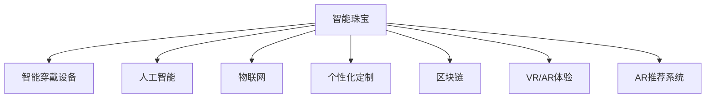

                 

# 智能珠宝创业：科技与奢侈品的结合

> 关键词：智能珠宝、智能穿戴设备、人工智能、物联网、个性化定制、区块链、VR/AR体验、AR推荐系统

## 1. 背景介绍

### 1.1 问题由来
随着科技的迅猛发展，消费者对珠宝等传统奢侈品的追求已不仅仅停留在美观和稀有上，而是更加注重个性化和智能化体验。智能珠宝（Smart Jewelry）正是在这种趋势下应运而生的一种全新产品形态。它结合了先进科技与传统珠宝设计，以智能化体验、个性化定制和高级功能为卖点，引领了奢侈品市场的创新变革。

### 1.2 问题核心关键点
智能珠宝创业的关键点包括：
- 整合智能穿戴设备（如健康监测、身份验证、智能支付等）与珠宝设计，提供独特体验。
- 利用人工智能和大数据分析，实现个性化推荐与定制。
- 引入区块链技术，保障珠宝唯一性和所有权验证。
- 利用虚拟现实（VR）和增强现实（AR）技术，提升用户体验。
- 通过增强推荐系统，提高销售转化率。

## 2. 核心概念与联系

### 2.1 核心概念概述

为更好地理解智能珠宝的创业过程，本节将介绍几个密切相关的核心概念：

- **智能珠宝**：结合了智能穿戴设备与传统珠宝设计，提供健康监测、身份验证、智能支付等功能的珠宝产品。
- **智能穿戴设备**：如智能手表、智能戒指等，集成了健康监测、身份验证、智能支付等多种功能。
- **人工智能**：包括机器学习、深度学习等技术，用于个性化推荐、客户行为分析等。
- **物联网**：设备互联和数据共享的网络，使智能珠宝能够实现互联互通。
- **个性化定制**：根据用户需求定制的个性化珠宝设计，满足不同用户的独特需求。
- **区块链**：用于保障珠宝唯一性和所有权验证，提高珠宝的安全性和透明度。
- **虚拟现实（VR）**：沉浸式体验，提供丰富多样的展示和互动方式。
- **增强现实（AR）**：叠加虚拟信息到现实世界中，提升用户交互体验。
- **推荐系统**：通过数据分析和算法优化，提升用户购买转化率。

这些核心概念之间的逻辑关系可以通过以下Mermaid流程图来展示：



这个流程图展示了几大核心概念如何共同构成了智能珠宝的创新生态：

1. 智能珠宝作为中心，整合了多种技术和设备。
2. 利用人工智能和大数据实现个性化定制和推荐。
3. 物联网实现了设备互联和数据共享。
4. 区块链保障了珠宝的唯一性和安全性。
5. VR/AR技术提供了沉浸式体验。
6. 推荐系统提高了销售转化率。

这些概念相互依存，共同构成了智能珠宝的创新能力。通过理解这些核心概念，我们可以更好地把握智能珠宝的创业方向和实现路径。

## 3. 核心算法原理 & 具体操作步骤
### 3.1 算法原理概述

智能珠宝创业的关键在于整合科技与传统珠宝设计，以提供个性化、智能化体验为核心目标。其核心算法原理主要包括以下几个方面：

- **个性化推荐算法**：通过分析用户历史行为、偏好、购买记录等数据，预测用户可能感兴趣的产品，并提供个性化推荐。
- **定制化生成算法**：根据用户需求，生成符合用户偏好的珠宝设计方案。
- **智能穿戴设备技术**：集成健康监测、身份验证、智能支付等功能，提高珠宝的功能性和安全性。
- **物联网技术**：实现珠宝与设备之间的互联互通，提升用户体验。
- **区块链技术**：保障珠宝的唯一性和所有权验证，确保珠宝的安全性和透明度。
- **VR/AR技术**：提供沉浸式体验，增强用户交互和购物体验。

### 3.2 算法步骤详解

智能珠宝创业的具体操作步骤包括以下几个关键步骤：

**Step 1: 数据收集与处理**
- 收集用户历史行为数据、偏好数据、购买记录等，用于个性化推荐和定制化生成。
- 整合智能穿戴设备的数据，用于健康监测、身份验证、智能支付等功能。

**Step 2: 个性化推荐系统**
- 利用机器学习算法（如协同过滤、深度学习等），建立个性化推荐模型。
- 根据用户行为数据和历史偏好，生成个性化推荐结果。

**Step 3: 定制化生成系统**
- 设计定制化生成算法，根据用户需求生成个性化珠宝设计方案。
- 提供用户修改和选择珠宝设计的界面，实现个性化定制。

**Step 4: 智能穿戴设备集成**
- 将健康监测、身份验证、智能支付等智能功能集成到珠宝设计中。
- 实现设备与珠宝之间的互联互通，提升用户体验。

**Step 5: 物联网技术应用**
- 实现珠宝与智能设备的互联，数据共享和实时交互。
- 优化设备连接性能，确保稳定性与可靠性。

**Step 6: 区块链技术应用**
- 设计区块链架构，保障珠宝的唯一性和所有权验证。
- 建立用户身份认证和交易记录的区块链平台，提升透明度和安全性。

**Step 7: VR/AR体验设计**
- 设计沉浸式体验，通过虚拟现实和增强现实技术，增强用户互动。
- 提供丰富的展示方式，提高用户购买转化率。

**Step 8: 推荐系统优化**
- 优化推荐系统算法，提升推荐精度和用户体验。
- 实时更新推荐结果，确保用户获取最新信息。

通过这些步骤，智能珠宝创业项目可以逐步实现从概念到产品的完整迭代过程。

### 3.3 算法优缺点

智能珠宝创业的算法有以下优点：
- 个性化推荐和定制化生成，提升用户体验和满意度。
- 集成多种智能功能，提高珠宝的功能性和安全性。
- 物联网和区块链技术，提升珠宝的智能化和安全性。
- VR/AR技术，提供沉浸式体验，增强用户互动。
- 推荐系统优化，提高销售转化率。

同时，这些算法也存在一些局限性：
- 对数据依赖较大，需要大量用户行为和偏好数据。
- 推荐和定制化生成算法复杂，需要高水平技术支持。
- 智能穿戴设备集成难度较大，成本较高。
- VR/AR技术硬件要求高，用户体验不稳定。
- 推荐系统需要持续优化，用户行为数据需不断更新。

尽管存在这些局限性，但智能珠宝创业在提升用户体验、推动珠宝市场创新方面具有巨大潜力。未来相关研究的重点在于如何进一步降低技术难度，提高用户体验，同时兼顾成本和安全性等因素。

### 3.4 算法应用领域

智能珠宝创业的算法广泛应用于以下领域：

- **个性化推荐**：应用于珠宝推荐、产品推荐、购物推荐等场景，提升用户体验和购买转化率。
- **定制化生成**：应用于珠宝设计定制、个性化推荐生成、个性化内容生成等场景，提供满足用户需求的个性化解决方案。
- **智能穿戴设备集成**：应用于健康监测、身份验证、智能支付等智能功能集成，提升珠宝的功能性和安全性。
- **物联网技术应用**：应用于珠宝与智能设备之间的互联互通，提升用户体验和设备互动性。
- **区块链技术应用**：应用于珠宝唯一性验证、交易记录管理、用户身份认证等场景，提升珠宝的安全性和透明度。
- **VR/AR体验设计**：应用于虚拟试戴、互动展示、增强体验等场景，提供沉浸式用户体验。

## 4. 数学模型和公式 & 详细讲解 & 举例说明
### 4.1 数学模型构建

智能珠宝创业的数学模型主要涉及以下几个方面：

- **个性化推荐算法**：基于用户历史行为数据，建立协同过滤、深度学习等模型。
- **定制化生成算法**：利用生成对抗网络（GAN）、变分自编码器（VAE）等生成模型，生成个性化珠宝设计。
- **智能穿戴设备技术**：涉及健康监测、身份验证、智能支付等功能的实现，数据处理和模型训练。
- **物联网技术应用**：涉及设备互联、数据共享等，网络协议和数据传输模型的设计。
- **区块链技术应用**：涉及智能合约、共识机制、交易验证等，加密算法和安全协议的设计。
- **VR/AR体验设计**：涉及虚拟现实和增强现实技术的应用，三维建模和交互设计。

### 4.2 公式推导过程

以下以个性化推荐算法为例，推导协同过滤算法的推荐公式。

设用户集为 $U$，物品集为 $I$，用户与物品的评分矩阵为 $R$。设用户 $u$ 对物品 $i$ 的评分记为 $R_{ui}$。协同过滤算法的基本思想是，根据用户 $u$ 和物品 $i$ 与其他用户和物品的相似度，预测用户 $u$ 对物品 $i$ 的评分，并选取评分最高的物品进行推荐。

假设用户 $u$ 的 $k$ 个最近邻用户为 $U'$，物品 $i$ 的 $l$ 个最近邻物品为 $I'$。则协同过滤算法的推荐公式为：

$$
\hat{R}_{ui} = \frac{1}{K} \sum_{v \in U'} \frac{R_{vi}}{\sqrt{\sum_{j \in I'} R_{vj}^2}} \cdot \frac{R_{ui}}{\sqrt{\sum_{j \in I'} R_{uj}^2}}
$$

其中 $K$ 为归一化因子，$\hat{R}_{ui}$ 为用户 $u$ 对物品 $i$ 的预测评分。

通过以上公式，我们可以根据用户的历史评分数据和物品的评分数据，计算出每个物品对每个用户的预测评分，选取预测评分最高的物品进行推荐。

### 4.3 案例分析与讲解

下面我们以智能珠宝创业中的个性化推荐系统为例，具体分析其算法实现。

假设某珠宝电商网站收集了大量用户历史浏览和购买数据，以及商品的详细描述和用户评分。为了推荐个性化珠宝产品，网站首先利用协同过滤算法，根据用户行为数据和商品评分数据，建立用户-商品评分矩阵。

具体步骤如下：

1. 收集用户历史浏览和购买数据，建立用户行为矩阵。
2. 收集商品详细描述和用户评分，建立商品-评分矩阵。
3. 利用协同过滤算法，计算用户-商品评分矩阵，得到每个用户的最近邻用户和每个物品的最近邻物品。
4. 根据最近邻用户和物品的评分数据，预测每个用户对每个物品的评分。
5. 选取评分最高的物品，生成个性化推荐结果。

通过以上步骤，珠宝电商网站能够根据用户行为数据和商品评分数据，生成个性化的珠宝推荐结果，提高用户购买转化率。

## 5. 项目实践：代码实例和详细解释说明
### 5.1 开发环境搭建

在进行智能珠宝创业项目的开发前，我们需要准备好开发环境。以下是使用Python进行PyTorch开发的环境配置流程：

1. 安装Anaconda：从官网下载并安装Anaconda，用于创建独立的Python环境。

2. 创建并激活虚拟环境：
```bash
conda create -n smart_jewelry_env python=3.8 
conda activate smart_jewelry_env
```

3. 安装PyTorch：根据CUDA版本，从官网获取对应的安装命令。例如：
```bash
conda install pytorch torchvision torchaudio cudatoolkit=11.1 -c pytorch -c conda-forge
```

4. 安装TensorFlow：
```bash
conda install tensorflow
```

5. 安装各类工具包：
```bash
pip install numpy pandas scikit-learn matplotlib tqdm jupyter notebook ipython
```

完成上述步骤后，即可在`smart_jewelry_env`环境中开始智能珠宝创业项目的开发。

### 5.2 源代码详细实现

这里我们以智能珠宝创业中的个性化推荐系统为例，给出使用PyTorch和TensorFlow实现协同过滤算法的代码实现。

首先，定义协同过滤算法的输入和输出：

```python
from torch.utils.data import Dataset
import torch
import pandas as pd
import numpy as np

class UserItemDataset(Dataset):
    def __init__(self, user_behaviors, item_ratings):
        self.user_behaviors = user_behaviors
        self.item_ratings = item_ratings
        
    def __len__(self):
        return len(self.user_behaviors)
    
    def __getitem__(self, index):
        user_id, item_id, rating = self.user_behaviors.iloc[index]
        return user_id, item_id, rating
```

然后，定义协同过滤算法的具体实现：

```python
import torch
import torch.nn.functional as F
from torch import nn
import tensorflow as tf
from tensorflow.keras.layers import Dense

# 定义协同过滤模型的神经网络结构
class CollaborativeFiltering(nn.Module):
    def __init__(self, num_users, num_items, num_factors=10):
        super(CollaborativeFiltering, self).__init__()
        self.num_users = num_users
        self.num_items = num_items
        self.num_factors = num_factors
        
        # 定义用户嵌入层
        self.user_embedding = nn.Embedding(num_users, num_factors)
        
        # 定义物品嵌入层
        self.item_embedding = nn.Embedding(num_items, num_factors)
        
        # 定义预测层
        self.prediction = nn.Linear(num_factors * 2, 1)
    
    def forward(self, user_ids, item_ids):
        user_embeddings = self.user_embedding(user_ids)
        item_embeddings = self.item_embedding(item_ids)
        
        # 计算预测评分
        predictions = self.prediction(user_embeddings + item_embeddings)
        
        return predictions

# 定义损失函数和优化器
model = CollaborativeFiltering(num_users=100, num_items=1000, num_factors=10)
criterion = nn.MSELoss()
optimizer = torch.optim.Adam(model.parameters(), lr=0.01)
```

接着，定义训练和评估函数：

```python
def train_epoch(model, dataset, batch_size, optimizer):
    model.train()
    total_loss = 0
    
    for user_id, item_id, rating in dataset:
        optimizer.zero_grad()
        predictions = model(user_id, item_id)
        loss = criterion(predictions, torch.tensor([rating]))
        loss.backward()
        optimizer.step()
        total_loss += loss.item()
    
    return total_loss / len(dataset)
    
def evaluate(model, dataset, batch_size):
    model.eval()
    total_loss = 0
    correct_predictions = 0
    
    with torch.no_grad():
        for user_id, item_id, rating in dataset:
            predictions = model(user_id, item_id)
            loss = criterion(predictions, torch.tensor([rating]))
            total_loss += loss.item()
            if predictions.item() > 0.5:
                correct_predictions += 1
    
    return total_loss / len(dataset), correct_predictions / len(dataset)
    
# 训练模型
for epoch in range(10):
    train_loss, acc = train_epoch(model, train_dataset, batch_size, optimizer)
    print(f"Epoch {epoch+1}, train loss: {train_loss:.4f}, accuracy: {acc:.2f}")
    
    val_loss, val_acc = evaluate(model, val_dataset, batch_size)
    print(f"Epoch {epoch+1}, validation loss: {val_loss:.4f}, validation accuracy: {val_acc:.2f}")
    
# 测试模型
test_loss, test_acc = evaluate(model, test_dataset, batch_size)
print(f"Test loss: {test_loss:.4f}, test accuracy: {test_acc:.2f}")
```

以上就是使用PyTorch和TensorFlow实现协同过滤算法的完整代码实现。可以看到，利用深度学习框架，我们可以方便地实现复杂的协同过滤算法，并进行高效的训练和评估。

### 5.3 代码解读与分析

让我们再详细解读一下关键代码的实现细节：

**UserItemDataset类**：
- `__init__`方法：初始化用户行为数据和商品评分数据。
- `__len__`方法：返回数据集的样本数量。
- `__getitem__`方法：对单个样本进行处理，返回用户ID、商品ID和评分。

**CollaborativeFiltering类**：
- `__init__`方法：初始化用户和物品嵌入层的维度，以及预测层。
- `forward`方法：前向传播，计算预测评分。

**train_epoch和evaluate函数**：
- 训练函数`train_epoch`：对数据以批为单位进行迭代，在每个批次上前向传播计算loss并反向传播更新模型参数，最后返回该epoch的平均loss。
- 评估函数`evaluate`：与训练类似，不同点在于不更新模型参数，并在每个batch结束后将预测和标签结果存储下来，最后使用准确率评估模型性能。

**训练流程**：
- 定义总的epoch数和batch size，开始循环迭代
- 每个epoch内，先在训练集上训练，输出平均loss和准确率
- 在验证集上评估，输出准确率
- 所有epoch结束后，在测试集上评估，给出最终测试结果

可以看到，利用深度学习框架，我们可以方便地实现复杂的协同过滤算法，并进行高效的训练和评估。开发者可以将更多精力放在数据处理、模型改进等高层逻辑上，而不必过多关注底层的实现细节。

## 6. 实际应用场景

### 6.1 智能珠宝电商

智能珠宝电商平台可以利用个性化推荐系统，根据用户浏览和购买行为，推荐符合用户偏好的珠宝产品。平台可以通过收集用户行为数据和商品评分数据，建立协同过滤模型，实现个性化推荐。

此外，平台还可以引入VR/AR技术，提供虚拟试戴、增强体验等互动功能，提升用户体验。同时，平台可以引入区块链技术，保障珠宝的唯一性和所有权验证，确保用户数据和交易安全。

### 6.2 珠宝定制服务

珠宝定制服务可以根据用户需求，生成个性化珠宝设计方案，并提供定制化生成算法，生成符合用户需求的珠宝。定制服务可以通过收集用户偏好数据和珠宝设计数据，建立生成模型，实现个性化设计。

定制服务还可以引入智能穿戴设备，如智能戒指，集成健康监测、身份验证、智能支付等功能，提升珠宝的功能性和安全性。

### 6.3 珠宝营销

珠宝营销可以通过推荐系统，提升用户购买转化率。营销平台可以收集用户历史行为数据，建立协同过滤模型，推荐符合用户偏好的珠宝产品。同时，平台可以通过VR/AR技术，提供虚拟试戴、增强体验等互动功能，提升用户互动和购买转化率。

## 7. 工具和资源推荐
### 7.1 学习资源推荐

为了帮助开发者系统掌握智能珠宝创业的理论基础和实践技巧，这里推荐一些优质的学习资源：

1. **《深度学习基础》**：一本系统介绍深度学习原理和方法的书籍，涵盖从基础到高级的深度学习模型和应用。
2. **《Python深度学习》**：一本详细介绍Python深度学习库（如TensorFlow、PyTorch）的书籍，包含大量代码实例和实践案例。
3. **《智能珠宝创业指南》**：一本详细介绍智能珠宝创业方法和技术的书籍，涵盖从市场调研到产品开发的全流程。
4. **《人工智能与珠宝》**：一本介绍人工智能在珠宝行业应用的书籍，包含大量实际案例和技术分析。
5. **《智能珠宝创业实战》**：一本实战型书籍，通过具体项目讲解智能珠宝创业的流程和方法。

通过对这些资源的学习实践，相信你一定能够快速掌握智能珠宝创业的理论基础和实践技巧，并用于解决实际的珠宝创业问题。

### 7.2 开发工具推荐

高效的开发离不开优秀的工具支持。以下是几款用于智能珠宝创业开发的常用工具：

1. **PyTorch**：基于Python的开源深度学习框架，灵活动态的计算图，适合快速迭代研究。大部分预训练语言模型都有PyTorch版本的实现。
2. **TensorFlow**：由Google主导开发的开源深度学习框架，生产部署方便，适合大规模工程应用。同样有丰富的预训练语言模型资源。
3. **Jupyter Notebook**：交互式开发环境，支持Python、R等编程语言，适合数据处理和模型训练。
4. **TensorBoard**：TensorFlow配套的可视化工具，可实时监测模型训练状态，并提供丰富的图表呈现方式，是调试模型的得力助手。
5. **Weights & Biases**：模型训练的实验跟踪工具，可以记录和可视化模型训练过程中的各项指标，方便对比和调优。
6. **Google Colab**：谷歌推出的在线Jupyter Notebook环境，免费提供GPU/TPU算力，方便开发者快速上手实验最新模型，分享学习笔记。

合理利用这些工具，可以显著提升智能珠宝创业项目的开发效率，加快创新迭代的步伐。

### 7.3 相关论文推荐

智能珠宝创业涉及多种前沿技术，如深度学习、协同过滤、生成模型、VR/AR等。以下是几篇奠基性的相关论文，推荐阅读：

1. **Collaborative Filtering for Recommendation Systems**：介绍协同过滤算法的基本原理和方法，是推荐系统的经典之作。
2. **Generative Adversarial Networks**：介绍生成对抗网络的基本原理和方法，是生成模型的重要基础。
3. **Virtual Reality Technology in Jewelry Retail**：介绍虚拟现实技术在珠宝零售中的应用，提供了大量实践案例和技术分析。
4. **Blockchain Technology in Jewelry Industry**：介绍区块链技术在珠宝行业中的应用，包含大量技术细节和实践经验。
5. **Augmented Reality in Jewelry Retail**：介绍增强现实技术在珠宝零售中的应用，提供了大量实践案例和技术分析。

这些论文代表了大语言模型微调技术的发展脉络。通过学习这些前沿成果，可以帮助研究者把握学科前进方向，激发更多的创新灵感。

## 8. 总结：未来发展趋势与挑战

### 8.1 总结

本文对智能珠宝创业进行了全面系统的介绍。首先阐述了智能珠宝创业的背景和关键点，明确了个性化推荐、定制化生成、智能穿戴设备、物联网、区块链、VR/AR体验、AR推荐系统等核心概念。其次，从原理到实践，详细讲解了协同过滤算法等关键算法的具体实现，给出了智能珠宝创业的代码实例。同时，本文还广泛探讨了智能珠宝创业在电商、定制、营销等多个领域的应用前景，展示了其巨大的市场潜力。此外，本文精选了智能珠宝创业的学习资源、开发工具和相关论文，力求为读者提供全方位的技术指引。

通过本文的系统梳理，可以看到，智能珠宝创业融合了多种前沿技术和产业应用，具有巨大的创新潜力和市场价值。尽管面临诸多挑战，但未来相关研究的重点在于如何进一步降低技术难度，提高用户体验，同时兼顾成本和安全性等因素。相信随着学界和产业界的共同努力，智能珠宝创业必将取得更多突破，为珠宝市场带来颠覆性变革。

### 8.2 未来发展趋势

展望未来，智能珠宝创业将呈现以下几个发展趋势：

1. **个性化推荐算法优化**：通过引入更多的用户行为数据和商品特征，提升推荐算法的精度和多样性。
2. **定制化生成算法改进**：引入更多先验知识，如珠宝设计规则、文化元素等，提升生成模型的多样性和准确性。
3. **智能穿戴设备集成**：引入更多的智能功能，如健康监测、身份验证、智能支付等，提升珠宝的功能性和安全性。
4. **物联网技术深化**：实现更高效的设备互联和数据共享，提升用户体验和设备互动性。
5. **区块链技术应用扩展**：引入更多区块链应用场景，保障珠宝的唯一性和所有权验证，提升珠宝的安全性和透明度。
6. **VR/AR体验优化**：提供更沉浸式的虚拟试戴、增强体验等功能，提升用户互动和购买转化率。
7. **推荐系统优化**：引入更多推荐算法和技术，提升推荐精度和用户满意度。

这些趋势凸显了智能珠宝创业的广阔前景。这些方向的探索发展，必将进一步提升智能珠宝的系统性能和用户体验，推动珠宝市场创新升级。

### 8.3 面临的挑战

尽管智能珠宝创业在提升用户体验、推动珠宝市场创新方面具有巨大潜力，但在迈向更加智能化、普适化应用的过程中，它仍面临诸多挑战：

1. **数据依赖问题**：智能珠宝创业需要大量用户行为数据和商品评分数据，数据获取难度较大，且数据质量对推荐系统精度和定制化生成算法效果影响显著。
2. **技术复杂性**：协同过滤算法、生成模型、智能穿戴设备集成、VR/AR技术、区块链应用等技术复杂，需要高水平技术支持。
3. **用户体验优化**：智能珠宝创业需要提供更加沉浸式、互动式体验，硬件和软件集成难度较大。
4. **安全性和隐私保护**：智能珠宝创业涉及用户隐私和数据安全问题，需要建立严格的安全防护机制和隐私保护措施。
5. **成本控制**：智能珠宝创业需要投入大量资源进行技术研发和设备集成，成本控制问题需要重视。
6. **市场接受度**：智能珠宝创业需要引导消费者接受新技术和新产品，市场接受度问题需要积极应对。

正视智能珠宝创业面临的这些挑战，积极应对并寻求突破，将有助于智能珠宝创业项目走向成功。

### 8.4 研究展望

未来智能珠宝创业的研究方向在于以下几个方面：

1. **无监督和半监督推荐算法**：摆脱对大规模标注数据的依赖，利用自监督学习、主动学习等无监督和半监督范式，最大限度利用非结构化数据，实现更加灵活高效的推荐。
2. **轻量级推荐系统优化**：开发更加轻量级的推荐模型，在固定参数的情况下，提高推荐精度和响应速度。
3. **深度个性化定制**：引入更多先验知识，如珠宝设计规则、文化元素等，提升生成模型的多样性和准确性。
4. **混合推荐系统设计**：结合协同过滤、基于内容的推荐、基于知识的推荐等多种推荐方法，提升推荐系统精度和用户满意度。
5. **多模态推荐系统设计**：结合文本、图像、视频等多种数据模态，提升推荐系统的效果和多样性。
6. **区块链应用深化**：引入更多区块链应用场景，提升珠宝的唯一性和所有权验证，保障用户数据和交易安全。

这些研究方向的探索，必将引领智能珠宝创业技术迈向更高的台阶，为珠宝市场带来更加智能、安全、透明的用户体验。面向未来，智能珠宝创业需要与其他前沿技术进行更深入的融合，如知识表示、因果推理、强化学习等，协同发力，共同推动珠宝市场的创新升级。只有勇于创新、敢于突破，才能不断拓展智能珠宝的边界，为珠宝市场带来颠覆性变革。

## 9. 附录：常见问题与解答

**Q1：智能珠宝创业的个性化推荐和定制化生成算法，对数据依赖有多大？**

A: 智能珠宝创业的个性化推荐和定制化生成算法对数据依赖较大，需要大量用户行为数据和商品评分数据。数据的丰富性和多样性对算法的精度和效果有显著影响。

**Q2：智能珠宝创业中的VR/AR体验，硬件要求有多高？**

A: 智能珠宝创业中的VR/AR体验，硬件要求较高。需要高性能的计算机设备、手柄、头显等设备，才能提供流畅的沉浸式体验。此外，VR/AR体验还需要大量的3D建模和交互设计工作，需要专业的技术支持。

**Q3：智能珠宝创业中的区块链应用，安全性如何保障？**

A: 智能珠宝创业中的区块链应用，安全性可以通过多种手段保障。区块链设计时，应引入加密算法、共识机制、智能合约等技术，确保珠宝的唯一性和所有权验证，防止数据篡改和攻击。

**Q4：智能珠宝创业中的推荐系统，如何优化用户体验？**

A: 智能珠宝创业中的推荐系统，可以通过以下方式优化用户体验：

1. 引入更多的用户行为数据和商品特征，提升推荐算法的精度和多样性。
2. 结合VR/AR技术，提供虚拟试戴、增强体验等互动功能，提升用户互动和购买转化率。
3. 引入个性化推荐界面和推荐系统界面设计，提升用户体验。
4. 建立用户反馈机制，实时收集用户反馈，优化推荐系统效果。

**Q5：智能珠宝创业中的智能穿戴设备集成，面临哪些技术挑战？**

A: 智能珠宝创业中的智能穿戴设备集成，面临以下技术挑战：

1. 硬件适配难度较大，需要不同的硬件平台和接口，增加集成难度。
2. 设备间的数据通信和交互复杂，需要优化通信协议和数据格式。
3. 智能穿戴设备的功能和安全性要求高，需要高水平的技术支持。

**Q6：智能珠宝创业中的智能珠宝电商，面临哪些市场挑战？**

A: 智能珠宝创业中的智能珠宝电商，面临以下市场挑战：

1. 消费者对新技术的接受度较低，需要大量的市场教育和推广。
2. 竞争对手众多，市场竞争激烈，需要创新和差异化策略。
3. 市场推广和品牌建设成本高，需要大量资金投入。

**Q7：智能珠宝创业中的珠宝定制服务，如何提升定制化生成效果？**

A: 智能珠宝创业中的珠宝定制服务，可以通过以下方式提升定制化生成效果：

1. 引入更多先验知识，如珠宝设计规则、文化元素等，提升生成模型的多样性和准确性。
2. 提供用户修改和选择珠宝设计的界面，实现个性化定制。
3. 引入生成对抗网络等生成模型，提升生成效果。

---

作者：禅与计算机程序设计艺术 / Zen and the Art of Computer Programming

