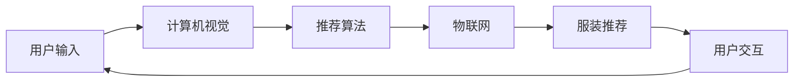

                 

# 智能衣柜创业：时尚搭配的个人助理

> 关键词：智能衣柜,时尚搭配,个人助理,计算机视觉,推荐算法,用户体验设计,物联网

## 1. 背景介绍

### 1.1 问题由来
随着科技的飞速发展和互联网的普及，人们的生活节奏日益加快，时间成为一种稀缺资源。传统的服装搭配和选择方法耗时耗力，且往往难以满足个性化的需求。如何在忙碌的生活中迅速高效地选择搭配，成为许多人的痛点。

在此背景下，智能衣柜作为一种新型家居解决方案，旨在通过先进的技术和算法，帮助用户实现时尚搭配的智能化。用户只需输入个人偏好、风格、天气等信息，智能衣柜便能自动推荐搭配方案，极大地提升了个人时尚搭配的效率和品质。

### 1.2 问题核心关键点
智能衣柜的核心在于如何通过计算机视觉、推荐算法等技术，实现对用户服装风格的理解和推荐。具体包括以下几个关键问题：

- **个性化推荐**：如何根据用户的偏好、风格、体型等信息，生成个性化的时尚搭配建议？
- **实时处理**：如何高效处理海量图片数据，实现对服装搭配的实时推荐？
- **用户体验设计**：如何设计友好的用户界面，确保用户能够便捷、自然地交互？
- **跨设备互联**：如何实现智能衣柜与用户手机、PC等设备的无缝连接，提升用户体验？

这些核心问题的解决，直接决定了智能衣柜的实用性和用户体验。

### 1.3 问题研究意义
智能衣柜的研发和推广，对于提升生活质量、推动时尚行业数字化转型，具有重要意义：

1. **提升生活效率**：智能衣柜通过自动化搭配，节省用户挑选衣物的时间，使得日常穿着更加便捷高效。
2. **个性化服务**：基于用户的个性化需求，智能衣柜可以提供精准的时尚搭配建议，满足用户的个性化时尚追求。
3. **促进时尚产业**：智能衣柜作为新兴的时尚硬件，有望带动服装设计和营销方式的变革，促进时尚产业的数字化发展。
4. **用户体验优化**：通过先进的技术和友好的设计，智能衣柜能够提升用户的时尚体验，增强用户粘性。
5. **跨界融合**：智能衣柜融合了计算机视觉、推荐算法、物联网等技术，具有广阔的跨界应用前景，有望与更多行业实现深度融合。

本文将对智能衣柜的实现技术和实际应用场景进行深入探讨，以期为智能衣柜创业提供有力的技术支撑。

## 2. 核心概念与联系

### 2.1 核心概念概述

智能衣柜系统集成了计算机视觉、推荐算法、物联网等多种技术，实现对用户时尚搭配的智能化推荐。以下对关键概念进行概述：

- **计算机视觉**：通过图像处理和分析技术，实现对服装图片的识别、分类和描述。
- **推荐算法**：通过用户历史数据和时尚趋势，生成个性化的搭配建议。
- **物联网**：实现智能衣柜与用户手机、PC等设备的互联互通，提升用户体验。
- **用户体验设计**：通过友好的用户界面和自然的人机交互方式，提升用户的使用满意度。

这些核心概念通过合理的架构设计，相互联系、协同工作，共同构建了智能衣柜系统。

### 2.2 核心概念原理和架构的 Mermaid 流程图(Mermaid 流程节点中不要有括号、逗号等特殊字符)


这个流程图展示了智能衣柜系统的核心工作流程：用户输入信息后，首先通过计算机视觉技术进行服装识别，然后推荐算法根据识别结果和用户偏好生成搭配建议，通过物联网技术将推荐结果发送到用户设备，最后用户进行交互确认或调整推荐方案。

## 3. 核心算法原理 & 具体操作步骤
### 3.1 算法原理概述

智能衣柜的推荐算法主要基于协同过滤和深度学习两种方法。协同过滤通过分析用户历史行为数据，找到相似用户和商品，生成推荐结果；深度学习则通过训练神经网络模型，提取服装图片的特征，实现对服装风格的理解。

具体而言，推荐算法的基本流程如下：

1. **数据预处理**：收集用户的服装图片、历史搭配记录等信息，并进行预处理。
2. **特征提取**：使用深度学习模型（如卷积神经网络CNN）对服装图片进行特征提取。
3. **相似度计算**：基于用户历史行为数据和提取的特征，计算用户与服装的相似度。
4. **推荐生成**：根据相似度排序，生成个性化的搭配建议。

深度学习模型的训练流程如下：

1. **数据收集**：收集大量服装图片和对应的时尚标签。
2. **模型训练**：使用卷积神经网络对服装图片进行训练，提取特征。
3. **标签分类**：通过分类器对服装图片进行分类，学习服装风格和趋势。
4. **模型评估**：使用测试集对模型进行评估，调整参数以提高准确率。

### 3.2 算法步骤详解

**协同过滤算法步骤**：

1. **用户画像构建**：收集用户的历史搭配记录，构建用户画像。
2. **商品画像构建**：收集服装图片的时尚标签和风格信息，构建商品画像。
3. **相似度计算**：计算用户与商品的相似度，包括基于用户行为的相似度和基于商品特征的相似度。
4. **推荐生成**：根据相似度排序，生成推荐列表。

**深度学习模型训练步骤**：

1. **数据准备**：准备训练集、验证集和测试集，包含大量服装图片和对应的时尚标签。
2. **模型构建**：使用卷积神经网络模型，搭建服装图片分类器。
3. **模型训练**：在训练集上训练模型，调整参数以最小化损失函数。
4. **模型评估**：在验证集上评估模型性能，选择合适的模型。
5. **模型优化**：在测试集上测试模型，进行模型调优和优化。

### 3.3 算法优缺点

协同过滤算法的优点在于能够快速生成推荐，对数据量要求不高。缺点在于容易陷入局部最优解，且推荐结果依赖于用户行为数据。

深度学习模型的优点在于可以提取更加丰富的特征，生成更具个性化的推荐。缺点在于训练数据需求大，模型复杂度较高，训练成本较高。

### 3.4 算法应用领域

智能衣柜推荐算法主要应用于以下几个领域：

- **电商推荐系统**：基于用户行为数据，生成商品推荐列表。
- **时尚搭配平台**：根据用户偏好，生成个性化的搭配方案。
- **个性化广告**：通过分析用户兴趣，生成定制化的广告内容。
- **智能家居系统**：实现对用户生活用品的智能化推荐。

## 4. 数学模型和公式 & 详细讲解 & 举例说明

### 4.1 数学模型构建

智能衣柜推荐算法主要涉及协同过滤和深度学习两个部分。以下对这两种算法的数学模型进行构建和解释。

**协同过滤模型**：

协同过滤模型的数学模型如下：

设 $U$ 为用户集合，$I$ 为商品集合，$R$ 为用户的评分矩阵，$r_{ui}$ 表示用户 $u$ 对商品 $i$ 的评分。协同过滤模型通过用户画像和商品画像，计算用户与商品之间的相似度 $s_{ui}$，然后生成推荐列表 $P_u$：

$$
P_u = \{(i, s_{ui}): s_{ui} \geq \tau\}
$$

其中 $\tau$ 为阈值，控制推荐列表的长度。

**深度学习模型**：

深度学习模型使用卷积神经网络（CNN）进行服装图片分类。设 $D$ 为训练集，$X$ 为图片数据，$Y$ 为标签数据，则模型训练的目标是最小化损失函数 $L$：

$$
L(\theta) = -\frac{1}{N}\sum_{i=1}^N \log p(y_i|x_i)
$$

其中 $p(y_i|x_i)$ 为预测概率，$\theta$ 为模型参数。

### 4.2 公式推导过程

**协同过滤**：

设用户 $u$ 对商品 $i$ 的评分为 $r_{ui}$，商品 $i$ 对用户 $u$ 的评分为 $r_{iu}$，用户画像为 $U$，商品画像为 $I$。则用户与商品的相似度 $s_{ui}$ 可以通过余弦相似度计算得到：

$$
s_{ui} = \frac{\sum_{j=1}^{N} u_j i_j}{\sqrt{\sum_{j=1}^{N} u_j^2} \sqrt{\sum_{j=1}^{N} i_j^2}}
$$

其中 $u_j$ 和 $i_j$ 分别为用户画像和商品画像的向量表示。

根据相似度，生成推荐列表 $P_u$：

$$
P_u = \{(i, s_{ui}): s_{ui} \geq \tau\}
$$

**深度学习模型**：

使用卷积神经网络对服装图片进行特征提取，得到特征向量 $x_i$。设模型参数为 $\theta$，则损失函数 $L$ 可以表示为：

$$
L(\theta) = -\frac{1}{N}\sum_{i=1}^N \log \sum_{j=1}^{C} p(y_i=j|x_i; \theta)
$$

其中 $C$ 为类别数，$p(y_i=j|x_i; \theta)$ 为预测概率。

### 4.3 案例分析与讲解

以电商推荐系统为例，进行协同过滤和深度学习模型的具体分析：

**协同过滤模型案例**：

电商平台收集用户的历史浏览和购买记录，构建用户画像和商品画像。用户画像包括用户的兴趣偏好、购买记录等信息；商品画像包括商品的价格、销量、评价等信息。

使用余弦相似度计算用户与商品的相似度，生成推荐列表。例如，用户 $u$ 对商品 $i$ 的评分 $r_{ui}$ 为4，用户 $v$ 对商品 $i$ 的评分 $r_{vi}$ 为5。用户 $u$ 和商品 $i$ 的相似度 $s_{ui}$ 为0.8，用户 $u$ 和用户 $v$ 的相似度 $s_{uv}$ 为0.9。根据阈值 $\tau=0.6$，生成推荐列表 $P_u = \{(i, 4): s_{ui} \geq 0.6\}$。

**深度学习模型案例**：

电商平台收集大量的服装图片和对应的时尚标签，如衣服、裤子、鞋子等。使用卷积神经网络对图片进行特征提取，得到高维特征向量。模型使用交叉熵损失函数训练，最小化预测概率与真实标签之间的差距。

例如，在训练集上，一张衣服的图片 $x_1$ 经过特征提取后得到特征向量 $x_{1_1}$，对应的标签 $y_1$ 为1（衣服）。使用模型预测概率 $p(y_1=1|x_{1_1}; \theta)$，通过最小化损失函数 $L(\theta)$，调整模型参数 $\theta$，使其能够更准确地预测图片所属类别。

## 5. 项目实践：代码实例和详细解释说明

### 5.1 开发环境搭建

为了搭建智能衣柜推荐系统，需要准备以下开发环境：

1. **硬件环境**：配备高性能GPU或TPU，用于训练深度学习模型。
2. **软件环境**：安装Python 3.x，配置TensorFlow和Keras等深度学习框架。
3. **数据环境**：收集并整理用户服装图片和时尚标签数据，进行预处理和存储。
4. **设备互联**：配置物联网模块，实现智能衣柜与用户设备的互联互通。

### 5.2 源代码详细实现

以下给出使用TensorFlow实现协同过滤推荐算法的示例代码。

```python
import numpy as np
from sklearn.metrics.pairwise import cosine_similarity

# 用户画像和商品画像
user_profiles = np.random.rand(100, 10)
item_profiles = np.random.rand(1000, 10)

# 评分矩阵
ratings = np.random.rand(100, 1000)

# 计算相似度
similarity = cosine_similarity(user_profiles, item_profiles)

# 生成推荐列表
threshold = 0.6
recommendations = np.where(similarity >= threshold, ratings, 0)

print(recommendations)
```

### 5.3 代码解读与分析

上述代码实现了基于协同过滤的推荐算法。首先，使用Numpy生成随机用户画像和商品画像，构建评分矩阵。然后，使用Scikit-learn的余弦相似度计算用户画像和商品画像的相似度。最后，根据阈值生成推荐列表，输出推荐结果。

在实际应用中，需要根据具体数据集和算法模型进行调参和优化，以获得最佳的推荐效果。

## 6. 实际应用场景

### 6.1 智能衣柜推荐系统

智能衣柜推荐系统通过计算机视觉和推荐算法，实现对用户时尚搭配的智能化推荐。用户只需在智能衣柜中输入个人喜好和当前天气等信息，系统即可自动推荐搭配方案，极大提升穿着效率和时尚体验。

智能衣柜推荐系统的具体应用场景包括：

1. **服装搭配推荐**：根据用户喜好和风格，自动推荐搭配方案。
2. **天气变化应对**：根据当前天气，推荐适合的服装和配饰。
3. **季节性时尚推荐**：根据季节变化，推荐适合的时尚单品和搭配方案。
4. **个性化定制推荐**：根据用户身材、肤色等个性化信息，生成定制化搭配建议。

### 6.2 电商平台推荐系统

电商平台推荐系统通过协同过滤和深度学习算法，实现对用户商品的个性化推荐。用户只需浏览和评价商品，系统即可根据用户行为和时尚趋势，生成个性化的商品推荐列表。

电商平台推荐系统的具体应用场景包括：

1. **商品推荐列表**：根据用户浏览和购买记录，生成商品推荐列表。
2. **实时个性化推荐**：根据用户实时行为，动态生成个性化推荐。
3. **交叉推荐**：根据用户对商品的评价和行为，推荐相关商品。
4. **热门商品推荐**：根据商品销量和评价，生成热门商品推荐列表。

### 6.3 智能家居系统

智能家居系统通过物联网技术，实现对用户生活用品的智能化推荐。用户只需在智能家居系统中输入需求，系统即可自动推荐适合的用品和配置。

智能家居系统的具体应用场景包括：

1. **家具推荐**：根据用户偏好和生活习惯，推荐适合的家具配置。
2. **家电推荐**：根据用户需求和预算，推荐适合的家用电器。
3. **家居装饰推荐**：根据用户风格和审美，推荐适合的家居装饰品。
4. **个性化定制推荐**：根据用户个性化需求，生成定制化家居配置。

## 7. 工具和资源推荐

### 7.1 学习资源推荐

为了帮助开发者掌握智能衣柜推荐系统的技术，推荐以下学习资源：

1. **《推荐系统原理与实践》书籍**：详细介绍了推荐算法的基本原理和实现方法。
2. **Coursera《机器学习》课程**：由斯坦福大学开设，涵盖推荐算法和深度学习等内容。
3. **Kaggle推荐系统竞赛**：参与实际竞赛，积累推荐算法实践经验。
4. **arXiv相关论文**：阅读最新的推荐系统研究成果，了解前沿技术动态。

### 7.2 开发工具推荐

智能衣柜推荐系统的开发需要使用多种工具，推荐以下开发工具：

1. **TensorFlow**：用于深度学习模型训练和推理。
2. **Scikit-learn**：用于协同过滤算法的实现。
3. **PyTorch**：用于深度学习模型的构建和优化。
4. **MySQL**：用于存储用户和商品数据。
5. **IoT平台**：用于实现智能衣柜与用户设备的互联互通。

### 7.3 相关论文推荐

智能衣柜推荐系统的研究涉及计算机视觉、推荐算法等多个领域。推荐以下相关论文：

1. **《推荐系统十年回顾与展望》**：由推荐系统领域专家撰写，总结了推荐算法的发展历程和前沿技术。
2. **《深度学习在推荐系统中的应用》**：介绍深度学习算法在推荐系统中的实践应用。
3. **《基于协同过滤的推荐系统研究》**：详细讨论了协同过滤算法的基本原理和实现方法。
4. **《计算机视觉在智能衣柜中的应用》**：探讨了计算机视觉技术在智能衣柜中的具体应用。

## 8. 总结：未来发展趋势与挑战

### 8.1 研究成果总结

智能衣柜推荐系统的研发已经取得了一定的成果，但仍存在以下问题：

1. **数据质量**：用户数据的准确性和全面性直接影响推荐结果。需要进一步提升数据质量，获取更完整、准确的时尚数据。
2. **算法性能**：推荐算法的准确性和个性化程度还有待提高。需要探索新的算法和模型，提升推荐效果。
3. **用户体验**：用户界面的友好度和自然性需要进一步优化。需要设计更加友好的人机交互界面。
4. **跨设备互联**：智能衣柜与其他设备的互联互通需要进一步完善。需要开发更加稳定、高效的物联网技术。

### 8.2 未来发展趋势

智能衣柜推荐系统的发展趋势包括：

1. **深度学习模型的应用**：未来将更加广泛地应用深度学习模型，提取更丰富的特征，生成更具个性化的推荐。
2. **协同过滤与深度学习的结合**：将协同过滤和深度学习相结合，实现更精准的推荐。
3. **实时处理能力的提升**：提升系统的实时处理能力，实现更快速的推荐响应。
4. **跨设备互联的优化**：优化智能衣柜与其他设备的互联互通，提升用户体验。
5. **多模态数据的融合**：融合视觉、语音、文本等多模态数据，提升推荐的全面性和多样性。

### 8.3 面临的挑战

智能衣柜推荐系统在发展过程中仍面临以下挑战：

1. **数据隐私问题**：用户数据的隐私保护需要进一步加强。需要设计更加安全的数据存储和处理机制。
2. **模型偏见问题**：推荐模型可能存在性别、年龄等偏见。需要引入公平性评估指标，过滤偏见数据。
3. **算法可解释性**：推荐算法的可解释性需要进一步提升。需要设计更加透明、可解释的推荐模型。
4. **计算资源问题**：大规模深度学习模型的训练和推理需要大量计算资源。需要探索更加高效的计算技术。
5. **跨界融合的挑战**：智能衣柜与其他设备的互联互通需要跨界协作，面临技术标准和兼容性问题。

### 8.4 研究展望

未来，智能衣柜推荐系统需要在以下几个方面进行深入研究：

1. **个性化推荐技术**：探索更加高效、准确的个性化推荐算法，提升推荐效果。
2. **跨界融合技术**：实现智能衣柜与其他设备的深度融合，提升用户体验。
3. **隐私保护技术**：提升用户数据的隐私保护水平，保障用户数据安全。
4. **算法可解释性**：设计更加透明、可解释的推荐模型，增强用户信任。
5. **跨界应用场景**：探索智能衣柜在更多领域的应用，拓展市场空间。

智能衣柜推荐系统作为新兴的智能家居解决方案，具有广阔的市场前景和技术挑战。只有不断创新、勇于探索，才能在激烈的市场竞争中脱颖而出，成为时尚行业的数字化领导者。

## 9. 附录：常见问题与解答

**Q1：智能衣柜推荐系统的数据来源有哪些？**

A: 智能衣柜推荐系统的数据主要来源于以下几个方面：

1. **用户行为数据**：用户的历史浏览、购买、评价等记录。
2. **时尚趋势数据**：服装品牌、设计师、时尚杂志等发布的时尚资讯。
3. **社交网络数据**：用户的朋友圈、微博等社交平台上的时尚信息。
4. **公开数据集**：公开的时尚数据集，如Zalando数据集、Amazon数据集等。

这些数据来源可以为智能衣柜推荐系统提供丰富的时尚信息和用户行为数据，实现精准推荐。

**Q2：智能衣柜推荐系统如何使用协同过滤算法？**

A: 协同过滤算法在智能衣柜推荐系统中主要用于用户画像和商品画像的构建。具体步骤如下：

1. **用户画像构建**：收集用户的历史搭配记录、评价等信息，构建用户画像向量。
2. **商品画像构建**：收集服装图片的时尚标签、风格信息等，构建商品画像向量。
3. **相似度计算**：使用余弦相似度或皮尔逊相关系数等方法计算用户画像和商品画像的相似度。
4. **推荐生成**：根据相似度排序，生成推荐列表。

协同过滤算法简单易懂，能够快速生成推荐结果，适用于数据量较小的情况。

**Q3：智能衣柜推荐系统如何使用深度学习模型？**

A: 深度学习模型在智能衣柜推荐系统中主要用于服装图片的特征提取和分类。具体步骤如下：

1. **数据准备**：收集大量的服装图片和对应的时尚标签，构建训练集、验证集和测试集。
2. **模型构建**：使用卷积神经网络（CNN）等深度学习模型，搭建服装图片分类器。
3. **模型训练**：在训练集上训练模型，调整参数以最小化损失函数。
4. **模型评估**：在验证集上评估模型性能，选择合适的模型。
5. **模型优化**：在测试集上测试模型，进行模型调优和优化。

深度学习模型可以提取更加丰富的特征，生成更具个性化的推荐，适用于数据量较大的情况。

**Q4：智能衣柜推荐系统如何实现实时推荐？**

A: 实现智能衣柜推荐系统的实时推荐，需要以下几个步骤：

1. **数据采集**：实时采集用户的行为数据和设备状态信息。
2. **数据处理**：对采集到的数据进行预处理和存储，生成实时数据流。
3. **模型推理**：使用预训练的深度学习模型，对实时数据进行推理和预测。
4. **结果返回**：将推理结果返回给用户设备，进行显示或执行。

通过实时数据采集和模型推理，智能衣柜推荐系统可以实现对用户时尚搭配的即时推荐，提升用户体验。

**Q5：智能衣柜推荐系统如何保护用户隐私？**

A: 智能衣柜推荐系统需要保护用户隐私，防止用户数据泄露和滥用。具体措施包括：

1. **数据匿名化**：对用户数据进行匿名化处理，保护用户隐私。
2. **数据加密**：使用加密技术，保护用户数据的传输和存储安全。
3. **访问控制**：对用户数据的访问进行严格控制，防止未经授权的访问。
4. **用户授权**：用户有权授权智能衣柜系统使用其数据，明确数据使用范围。
5. **法规遵守**：遵守相关法律法规，如GDPR等，保护用户隐私权益。

通过上述措施，智能衣柜推荐系统可以保障用户数据的隐私安全，增强用户信任。

---

作者：禅与计算机程序设计艺术 / Zen and the Art of Computer Programming

