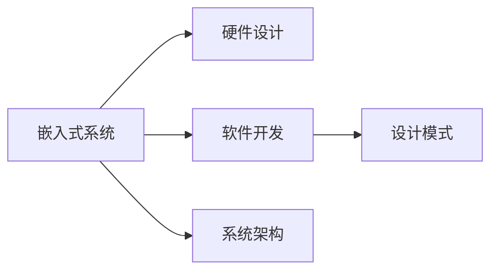

                 

# 智能设备开发：嵌入式系统设计与实现

> 关键词：智能设备,嵌入式系统,硬件设计,软件开发,设计模式,系统架构

## 1. 背景介绍

随着物联网技术的发展，智能设备已经渗透到我们生活的方方面面。从智能家居、可穿戴设备到工业自动化，无处不在的智能设备正在改变我们的生活方式。作为智能设备的核心部件，嵌入式系统成为了连接软件与硬件的桥梁，其设计与实现成为了智能设备开发的关键。本文章将围绕嵌入式系统，详细介绍嵌入式硬件设计、软件开发和系统架构的设计思路，帮助开发者理解并构建高性能的嵌入式系统。

## 2. 核心概念与联系

### 2.1 核心概念概述

在介绍嵌入式系统设计与实现之前，我们需要先了解几个核心概念：

- **嵌入式系统(Embedded System)**：指应用于特定场合，具有特定功能，有完备硬件和软件结构的系统。
- **硬件设计(Hardware Design)**：涉及芯片、电路、PCB等硬件部分的物理实现，包括数字设计、模拟设计、混合信号设计等。
- **软件开发(Software Development)**：指在嵌入式系统上开发运行程序，包括驱动程序、操作系统、应用软件等。
- **设计模式(Design Pattern)**：指经过实践验证，能解决特定问题的软件设计策略，有助于代码重用和软件架构的规范化。
- **系统架构(System Architecture)**：指系统整体框架的设计，包括组件结构、接口定义、数据流等，确保系统高效、可扩展和可维护。

这些概念相互交织，共同构成了嵌入式系统的设计与实现全貌。本节将使用Mermaid流程图来展示这些概念之间的联系。



从图中可以看出，嵌入式系统的设计与实现包括硬件设计、软件开发和系统架构三个主要环节，同时设计模式也是整个过程中不可或缺的一部分。接下来，我们将详细介绍这几个环节的核心算法原理和具体操作步骤。

## 3. 核心算法原理 & 具体操作步骤
### 3.1 算法原理概述

嵌入式系统的设计与实现涉及到硬件与软件的协同工作，其算法原理涵盖了从底层硬件设计到高层软件架构的多个层面。

**硬件设计**的算法原理包括数字电路设计、模拟电路设计、微控制器(MCU)设计和系统集成等，通常使用数字逻辑、时序分析、布局布线等技术。

**软件开发**的算法原理包括驱动程序设计、操作系统设计和应用软件设计等，通常使用操作系统内核、驱动程序、中间件、应用层等技术。

**系统架构**的算法原理包括组件化设计、分布式系统、微服务架构、云计算架构等，通常使用模块化、组件化、服务化等技术。

### 3.2 算法步骤详解

#### 3.2.1 硬件设计

**Step 1: 需求分析**
首先，需要明确硬件的功能需求，如处理器类型、外设接口、功耗要求、可靠性要求等。

**Step 2: 芯片选型**
根据需求，选择合适的芯片。如高性能处理器、低功耗MCU、传感器、通信模块等。

**Step 3: 电路设计**
使用数字设计工具，设计电路图，并进行仿真验证。

**Step 4: PCB设计**
根据电路图，设计PCB布线。使用自动布局布线工具，优化布线，减小干扰和功耗。

**Step 5: 验证与测试**
使用原型板进行硬件验证，测试硬件功能、性能和稳定性。

**Step 6: 生产与组装**
根据验证结果，进行大规模生产。组装PCB和外壳，并进行包装。

#### 3.2.2 软件开发

**Step 1: 需求分析**
明确软件的功能需求，如应用场景、接口需求、性能要求等。

**Step 2: 选型与设计**
选择合适的操作系统和开发工具，进行软件架构设计。

**Step 3: 驱动程序开发**
编写设备驱动程序，实现硬件与软件的交互。

**Step 4: 操作系统集成**
集成操作系统内核和驱动程序，实现系统启动、调度和管理。

**Step 5: 应用软件开发**
根据需求，编写应用软件，实现系统功能。

**Step 6: 测试与调试**
对软件进行单元测试、集成测试和系统测试，修复错误，优化性能。

#### 3.2.3 系统架构

**Step 1: 需求分析**
明确系统的功能需求，如系统规模、组件结构、数据流等。

**Step 2: 设计模式选择**
根据需求，选择合适的设计模式。如MVC模式、观察者模式、单例模式等。

**Step 3: 架构设计**
设计系统的组件结构，定义组件接口和数据流。

**Step 4: 组件实现**
根据架构设计，实现各个组件。

**Step 5: 集成与部署**
将各个组件集成到系统中，并进行部署。

### 3.3 算法优缺点

嵌入式系统设计与实现的算法具有以下优点：

- **功能定制化**：可以根据具体需求，定制硬件和软件功能。
- **高效性**：硬件和软件的协同工作，可以高效实现系统功能。
- **可靠性**：通过合理的硬件和软件设计，可以提高系统的稳定性和可靠性。
- **可扩展性**：模块化、组件化的设计，方便系统的扩展和升级。

但同时，嵌入式系统设计与实现也存在以下缺点：

- **开发成本高**：硬件设计、软件开发和系统架构设计，需要大量的工程投入。
- **技术门槛高**：涉及多个领域的知识，需要综合考虑硬件和软件各个环节。
- **迭代周期长**：从硬件设计到软件开发，再到系统集成，各个环节都需要充分验证和测试。

## 4. 数学模型和公式 & 详细讲解 & 举例说明
### 4.1 数学模型构建

嵌入式系统的设计与实现过程中，涉及多个数学模型，如数字电路模型、时序模型、信号模型等。以数字电路模型为例，我们假设数字电路由N个门电路构成，每个门电路具有两个输入信号和输出信号，其逻辑表达式为：

$$
y_i = f(x_1, x_2)
$$

其中 $y_i$ 为输出信号，$x_1, x_2$ 为输入信号，$f$ 为门电路的逻辑函数。

### 4.2 公式推导过程

数字电路的逻辑函数可以采用卡诺图、逻辑方程、布尔代数等方法进行推导。以卡诺图为例，假设门电路的输入信号为 $x_1, x_2$，输出信号为 $y_1, y_2$，其卡诺图如图1所示。

```
x1  x2
 0  0   0  1
 0  1   1  1
 1  0   0  0
 1  1   1  1
```

图1 数字电路卡诺图

在卡诺图的基础上，可以通过合并最小项，得到逻辑函数。假设输出信号 $y_1$ 的逻辑函数为：

$$
y_1 = x_1
$$

输出信号 $y_2$ 的逻辑函数为：

$$
y_2 = x_1 \oplus x_2
$$

其中 $\oplus$ 表示异或运算。

### 4.3 案例分析与讲解

假设某数字电路的输出信号 $y_1, y_2$ 分别由两个门电路构成，其逻辑函数如图2所示。

```
x1  x2
 0  0   0  1
 0  1   1  1
 1  0   1  0
 1  1   0  1
```

图2 数字电路逻辑函数

根据逻辑函数，我们可以将其拆分为两个门电路：

$$
y_1 = x_1 \land x_2
$$

$$
y_2 = x_1 \oplus x_2
$$

其中 $\land$ 表示与运算，$\oplus$ 表示异或运算。

## 5. 项目实践：代码实例和详细解释说明
### 5.1 开发环境搭建

嵌入式系统的设计与实现，需要搭建良好的开发环境。以下是一些常用的开发环境搭建流程：

**Step 1: 选择开发工具**
根据硬件和软件的不同需求，选择合适的开发工具。如Keil、IAR、Eclipse等。

**Step 2: 安装开发环境**
安装开发工具，并配置编译器和调试器。

**Step 3: 连接硬件设备**
连接目标设备，如MCU、FPGA等，进行程序调试。

**Step 4: 搭建开发平台**
搭建开发平台，配置硬件调试工具和软件仿真环境。

**Step 5: 测试与优化**
进行程序测试，优化性能，确保稳定性和可靠性。

### 5.2 源代码详细实现

以STM32微控制器为例，下面是一个简单的I2C通信程序：

```c
#include "stm32.h"
#include "i2c.h"

#define I2C_DEV 0x28
#define I2C_REG 0x03

void i2c_write(uint8_t dev, uint8_t reg, uint8_t val)
{
    i2c_start(dev, reg);
    i2c_write_val(val);
    i2c_stop();
}

void i2c_read(uint8_t dev, uint8_t reg, uint8_t *buf, uint8_t len)
{
    i2c_start(dev, reg);
    i2c_read_val(buf, len);
    i2c_stop();
}

int main()
{
    // 初始化I2C
    i2c_init();
    
    // 写数据
    i2c_write(I2C_DEV, I2C_REG, 0x12);
    
    // 读数据
    uint8_t buf[1];
    i2c_read(I2C_DEV, I2C_REG, buf, 1);
    
    return 0;
}
```

### 5.3 代码解读与分析

上述代码展示了STM32微控制器的I2C通信实现。通过调用`i2c_init()`函数，初始化I2C设备。然后，通过调用`i2c_write()`函数和`i2c_read()`函数，实现I2C通信。具体实现细节包括：

- `i2c_start()`函数：启动I2C通信，并发送设备地址和寄存器地址。
- `i2c_write_val()`函数：写入数据。
- `i2c_stop()`函数：停止I2C通信。

### 5.4 运行结果展示

在运行上述程序后，可以在调试器中查看I2C通信的实际效果，确保程序正确执行。

## 6. 实际应用场景

嵌入式系统的设计与实现，广泛应用于物联网、工业控制、消费电子等领域。以下列举几个典型的应用场景：

### 6.1 智能家居

智能家居设备，如智能门锁、智能音箱、智能灯光等，通过嵌入式系统实现远程控制和数据传输。例如，智能门锁可以通过Wi-Fi连接到云端，接收用户的远程控制指令，并进行身份验证和开锁操作。

### 6.2 工业自动化

工业自动化设备，如智能传感器、工业机器人、工业控制器等，通过嵌入式系统实现自动化控制和数据采集。例如，智能传感器可以实时监测工业生产过程中的温度、湿度、压力等参数，并将数据传输到控制中心，用于决策和控制。

### 6.3 消费电子

消费电子设备，如智能手表、智能耳机、智能电视等，通过嵌入式系统实现智能化功能和数据处理。例如，智能手表可以通过心率传感器、陀螺仪等传感器采集数据，并进行健康监测、运动追踪等应用。

### 6.4 未来应用展望

随着物联网技术的发展，嵌入式系统的设计与实现将进一步拓展应用领域，推动智能设备的普及和应用。未来，嵌入式系统将与云计算、大数据、人工智能等技术进行深度融合，形成更智能、更高效、更灵活的系统架构。

## 7. 工具和资源推荐
### 7.1 学习资源推荐

为了帮助开发者系统掌握嵌入式系统设计与实现的理论基础和实践技巧，这里推荐一些优质的学习资源：

1. 《嵌入式系统设计与实现》书籍：详细介绍了嵌入式系统从硬件设计到软件开发的全面内容。
2. Embedded.com网站：提供丰富的嵌入式系统开发资源，包括技术文章、开源项目、开发者社区等。
3. ARM、NXP、Microchip等公司的技术文档：详细介绍了各种嵌入式系统的硬件设计和开发工具。
4. Coursera、Udacity等在线课程：提供嵌入式系统设计与实现的进阶课程，涵盖数字电路、微控制器、操作系统等。

通过学习这些资源，相信你一定能够快速掌握嵌入式系统的设计与实现技术，并用于解决实际问题。

### 7.2 开发工具推荐

嵌入式系统设计与实现需要高效的开发工具支持。以下是几款常用的开发工具：

1. Keil、IAR：嵌入式系统开发工具，支持多种处理器和开发环境。
2. Eclipse：开源IDE工具，支持嵌入式系统开发，集成了调试器、模拟器等。
3. Yocto、Buildroot：嵌入式系统构建工具，方便快速构建和部署开发环境。
4. Visual Studio：Microsoft开发的IDE工具，支持Windows、Linux等平台的开发。
5. Keil、IAR：嵌入式系统开发工具，支持多种处理器和开发环境。

合理利用这些工具，可以显著提升嵌入式系统设计与实现的开发效率，加快创新迭代的步伐。

### 7.3 相关论文推荐

嵌入式系统设计与实现的研究源于学界的持续研究。以下是几篇奠基性的相关论文，推荐阅读：

1. "Embedded Systems: Hardware-Software Design and Verification" 书籍：详细介绍了嵌入式系统的硬件设计、软件设计和验证方法。
2. "Real-Time Operating Systems: A Computational Framework" 论文：探讨了实时操作系统在嵌入式系统中的应用。
3. "Software Design Patterns for Embedded Systems" 书籍：介绍了多种嵌入式系统设计模式，如MVC、观察者模式、单例模式等。
4. "Designing Embedded Systems: From Concept to Production" 书籍：详细介绍了嵌入式系统的设计和实现流程。

这些论文代表了大规模语言模型微调技术的发展脉络。通过学习这些前沿成果，可以帮助研究者把握学科前进方向，激发更多的创新灵感。

## 8. 总结：未来发展趋势与挑战

### 8.1 总结

本文对嵌入式系统设计与实现进行了全面系统的介绍。首先阐述了嵌入式系统设计与实现的研究背景和意义，明确了嵌入式系统在物联网、工业控制、消费电子等领域的独特价值。其次，从原理到实践，详细讲解了嵌入式系统的硬件设计、软件开发和系统架构的设计思路，给出了嵌入式系统开发的完整代码实例。同时，本文还广泛探讨了嵌入式系统在智能家居、工业自动化、消费电子等多个行业领域的应用前景，展示了嵌入式系统设计的广阔前景。

通过本文的系统梳理，可以看到，嵌入式系统设计与实现已经渗透到各个领域，成为了智能设备开发的关键技术。嵌入式系统设计和开发需要开发者从硬件设计、软件开发和系统架构等多个维度进行全面优化，方能得到理想的效果。

### 8.2 未来发展趋势

展望未来，嵌入式系统设计与实现将呈现以下几个发展趋势：

1. **智能化**：未来嵌入式系统将与人工智能、物联网等技术进行深度融合，实现更加智能化、自动化的功能。例如，智能家居设备可以通过机器学习算法，实现智能场景控制和用户行为预测。

2. **边缘计算**：随着边缘计算技术的发展，嵌入式系统将能够处理更多的数据和计算任务，实现本地化处理和数据优化。例如，智能监控设备可以在本地处理视频流，减少数据传输和云端计算压力。

3. **异构系统**：未来嵌入式系统将采用多种异构硬件，如CPU、GPU、FPGA等，提高系统的处理能力和灵活性。例如，工业自动化设备可以通过混合计算架构，实现多任务并行处理。

4. **低功耗**：未来嵌入式系统将更加注重功耗控制，实现高效能源管理和资源优化。例如，智能穿戴设备可以通过低功耗设计，延长设备的续航时间。

5. **安全性**：未来嵌入式系统将更加注重安全性和隐私保护，实现数据加密、身份验证等安全机制。例如，智能医疗设备可以通过区块链技术，保护用户数据的安全性和隐私性。

6. **开放生态**：未来嵌入式系统将更加开放，支持跨平台、跨生态的开发和应用。例如，工业自动化设备可以通过开放API和标准接口，与其他系统和设备进行互联互通。

这些趋势凸显了嵌入式系统设计与实现技术的广阔前景。这些方向的探索发展，必将进一步提升嵌入式系统设计的性能和应用范围，为智能设备带来更加广阔的发展空间。

### 8.3 面临的挑战

尽管嵌入式系统设计与实现技术已经取得了显著进展，但在迈向更加智能化、普适化应用的过程中，它仍面临着诸多挑战：

1. **硬件设计复杂性**：随着功能需求的多样化和硬件架构的复杂化，嵌入式系统设计难度增加。如何高效设计硬件，同时保持系统的稳定性和可靠性，是一大难题。

2. **软件开发复杂性**：嵌入式系统的软件设计需要考虑实时性、可靠性、安全性等因素，开发难度大。如何高效实现软件功能，同时保证系统的性能和安全性，是一大挑战。

3. **系统架构复杂性**：嵌入式系统的架构设计需要考虑模块化、组件化、服务化等因素，设计难度大。如何设计可扩展、可维护的系统架构，是一大挑战。

4. **资源限制**：嵌入式系统的资源有限，如内存、存储、处理器等。如何在资源限制下，实现高性能的系统功能，是一大挑战。

5. **硬件与软件协同**：嵌入式系统的硬件和软件需要紧密协同工作，设计难度大。如何高效协同工作，提高系统性能，是一大挑战。

6. **环境适应性**：嵌入式系统需要在恶劣的环境下工作，如高温、高湿、振动等。如何保证系统稳定性和可靠性，是一大挑战。

7. **跨平台兼容性**：嵌入式系统需要支持多种操作系统和开发环境，兼容性难度大。如何实现跨平台兼容，是一大挑战。

这些挑战凸显了嵌入式系统设计与实现技术的复杂性和挑战性。需要在各个环节进行全面优化，才能实现理想的效果。

### 8.4 研究展望

面对嵌入式系统设计与实现所面临的种种挑战，未来的研究需要在以下几个方面寻求新的突破：

1. **智能化算法优化**：通过机器学习和深度学习算法，优化嵌入式系统的智能化功能。例如，智能家居设备可以通过语音识别和自然语言处理，实现更加智能化的交互和控制。

2. **边缘计算优化**：优化嵌入式系统的边缘计算架构，提高数据处理和计算能力。例如，智能监控设备可以通过分布式计算，实现多数据源的实时处理和分析。

3. **异构系统设计**：设计多种异构硬件的混合计算架构，提高系统的处理能力和灵活性。例如，工业自动化设备可以通过混合计算架构，实现多任务并行处理和优化。

4. **低功耗优化**：优化嵌入式系统的低功耗设计，实现高效能源管理和资源优化。例如，智能穿戴设备可以通过低功耗设计，延长设备的续航时间。

5. **安全性设计**：设计嵌入式系统的安全性和隐私保护机制，实现数据加密、身份验证等安全功能。例如，智能医疗设备可以通过区块链技术，保护用户数据的安全性和隐私性。

6. **开放生态构建**：构建跨平台、跨生态的嵌入式系统开发和应用生态，实现互联互通和资源共享。例如，工业自动化设备可以通过开放API和标准接口，与其他系统和设备进行互联互通。

这些研究方向的探索，必将引领嵌入式系统设计与实现技术迈向更高的台阶，为智能设备带来更加广阔的发展空间。只有勇于创新、敢于突破，才能不断拓展嵌入式系统设计的边界，让智能设备更好地服务于人类社会。

## 9. 附录：常见问题与解答

**Q1：嵌入式系统设计与实现是否需要掌握多种硬件和软件知识？**

A: 嵌入式系统设计与实现需要掌握多种硬件和软件知识，包括数字电路设计、模拟电路设计、MCU设计、操作系统设计、应用软件设计等。这些知识可以逐步学习和掌握，关键在于不断实践和积累经验。

**Q2：嵌入式系统设计与实现中，哪些工具和资源最为重要？**

A: 嵌入式系统设计与实现中，开发环境、开发工具、学习资源和相关论文都是非常重要的。合理利用这些工具和资源，可以显著提升嵌入式系统设计的效率和质量。

**Q3：嵌入式系统设计与实现中，如何提高系统的稳定性和可靠性？**

A: 嵌入式系统设计与实现中，需要注重硬件设计、软件开发和系统架构的设计。例如，选择可靠的硬件芯片，设计稳定的电路和PCB，进行全面的软件测试和调试，设计可扩展、可维护的系统架构等，可以有效提高系统的稳定性和可靠性。

**Q4：嵌入式系统设计与实现中，如何实现高效能源管理和资源优化？**

A: 嵌入式系统设计与实现中，需要优化系统的功耗控制和资源使用。例如，采用低功耗设计技术，如异步设计、静态功耗优化、动态功耗管理等；优化软件算法和数据结构，减少资源占用；设计高效的系统架构，如多任务调度、资源池化等。

**Q5：嵌入式系统设计与实现中，如何保证系统的实时性和可靠性？**

A: 嵌入式系统设计与实现中，需要优化系统的实时性和可靠性。例如，采用实时操作系统，优化硬件时钟和同步，进行全面的软件测试和调试，设计可扩展、可维护的系统架构，实现数据冗余和容错机制等。

这些常见问题与解答，可以帮助开发者更好地理解嵌入式系统设计与实现的技术要点，提升系统的性能和可靠性。

---

作者：禅与计算机程序设计艺术 / Zen and the Art of Computer Programming

