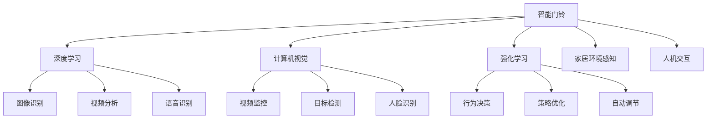

                 

# 智能门铃：家居安防与注意力管理的结合

> 关键词：智能门铃,家居安防,注意力管理,深度学习,计算机视觉,强化学习

## 1. 背景介绍

### 1.1 问题由来

随着智能家居设备的普及，智能门铃成为了家居安防的重要组成部分。传统的门铃依赖手动开关和简单的语音提示，已经无法满足现代家庭对安全和便捷的需求。如何通过智能化手段，提高门铃的安全性和使用体验，成为当前的研究热点。

智能门铃的核心目标在于实现实时视频监控、入侵检测、访客识别、智能预警等功能，确保家庭安全的同时，提供更加便捷、人性化的使用体验。其中，深度学习、计算机视觉、强化学习等技术被广泛应用于智能门铃的各个环节，实现复杂的多任务处理和智能决策。

### 1.2 问题核心关键点

智能门铃的实现依赖于多个关键技术的融合，包括：

- 深度学习：用于图像识别、视频分析、语音识别等任务，提取和理解家居环境中的多模态信息。
- 计算机视觉：用于视频监控、目标检测、人脸识别等任务，实现图像和视频的处理与分析。
- 强化学习：用于行为决策、策略优化、自动调节等任务，指导门铃的自动化操作和交互。
- 家居环境感知：利用传感器、摄像头、声音传感器等设备，获取家居环境的物理和行为数据。
- 人机交互：通过语音、手势、按键等方式，实现用户与门铃的交互。

这些核心技术共同构成了智能门铃的智能化能力，使其能够在实际应用中发挥作用。

## 2. 核心概念与联系

### 2.1 核心概念概述

为了更好地理解智能门铃的实现原理，本节将介绍几个密切相关的核心概念：

- 智能门铃：一种基于深度学习、计算机视觉、强化学习等技术，实现家居安防和智能交互的智能设备。
- 深度学习：通过多层神经网络结构，学习输入数据的复杂表示，用于图像识别、视频分析、语音识别等任务。
- 计算机视觉：研究如何通过计算机处理、分析和理解视觉信息，用于视频监控、目标检测、人脸识别等任务。
- 强化学习：通过学习智能体在环境中的交互行为，优化决策策略，用于行为决策、策略优化、自动调节等任务。
- 家居环境感知：利用传感器、摄像头、声音传感器等设备，获取家居环境的物理和行为数据。
- 人机交互：通过语音、手势、按键等方式，实现用户与门铃的交互。

这些核心概念之间的逻辑关系可以通过以下Mermaid流程图来展示：



这个流程图展示了几大核心概念及其之间的关系：

1. 智能门铃通过深度学习、计算机视觉、强化学习等技术，实现图像识别、视频分析、语音识别、视频监控、目标检测、人脸识别、行为决策、策略优化、自动调节等功能。
2. 深度学习用于学习复杂的视觉和语音特征，计算机视觉用于处理和分析视频和图像数据，强化学习用于优化门铃的行为决策和交互策略。
3. 家居环境感知和数据采集为门铃提供了实时环境信息，人机交互为门铃提供了与用户互动的方式。

## 3. 核心算法原理 & 具体操作步骤

### 3.1 算法原理概述

智能门铃的核心算法主要围绕以下几个关键点展开：

- **深度学习算法**：用于图像识别和视频分析，提取家居环境中的视觉和语音特征。
- **计算机视觉算法**：用于视频监控和目标检测，实现入侵检测和行为分析。
- **强化学习算法**：用于行为决策和策略优化，指导门铃的自动化操作和交互。
- **家居环境感知算法**：用于获取家居环境的物理和行为数据，提供实时环境信息。
- **人机交互算法**：用于实现用户与门铃的语音、手势、按键交互。

### 3.2 算法步骤详解

智能门铃的核心算法实现流程大致分为以下几个步骤：

1. **数据采集与预处理**：通过摄像头、声音传感器、门窗传感器等设备，实时采集家居环境的多模态数据，并进行数据清洗和预处理。

2. **深度学习模型训练**：使用大规模家居安防数据集进行模型训练，学习图像、视频、语音等数据的表示。

3. **计算机视觉算法实现**：利用训练好的深度学习模型，实现视频监控、目标检测、人脸识别等功能，检测异常行为和入侵事件。

4. **强化学习算法实现**：基于检测到的异常行为，通过强化学习算法进行行为决策和策略优化，自动调整门铃的响应策略。

5. **家居环境感知与数据融合**：通过传感器和摄像头获取家居环境数据，与深度学习、计算机视觉、强化学习模型输出进行数据融合，实现更全面的环境感知。

6. **人机交互算法实现**：通过语音、手势、按键等方式，实现用户与门铃的交互，提供友好的用户界面和操作体验。

### 3.3 算法优缺点

智能门铃的核心算法具有以下优点：

- **多模态融合**：综合利用图像、视频、语音等多模态数据，提高安防系统的准确性和鲁棒性。
- **实时处理**：通过深度学习、计算机视觉、强化学习等算法，实现实时视频监控、行为分析、入侵检测等功能。
- **用户友好**：利用人机交互算法，实现自然语言处理、手势识别等功能，提升用户体验。

同时，这些算法也存在以下局限性：

- **数据需求大**：深度学习和强化学习算法需要大量标注数据进行训练，数据获取和标注成本较高。
- **模型复杂**：多模态融合和实时处理需要复杂的高性能模型，对硬件资源要求较高。
- **实时性要求高**：家居安防系统对实时性有较高要求，需要高效的算法和计算资源支持。
- **隐私和安全**：多模态数据的采集和处理可能涉及用户隐私和安全问题，需要严格的数据保护和隐私管理措施。

### 3.4 算法应用领域

智能门铃的核心算法已经在多个领域得到了应用，包括：

- **家居安防**：实现实时视频监控、入侵检测、访客识别、智能预警等功能，提高家庭安全性。
- **智能家居控制**：通过语音、手势等方式，实现对家内电器的远程控制和自动化管理。
- **行为分析与健康监测**：利用计算机视觉和深度学习算法，实现家庭成员行为分析与健康监测。
- **娱乐与交互**：利用增强现实(AR)和虚拟现实(VR)技术，实现虚拟游戏、虚拟场景交互等功能。
- **智慧城市应用**：智能门铃还可以应用于智慧城市建设，提升社区安全、环境监控等综合治理水平。

## 4. 数学模型和公式 & 详细讲解 & 举例说明

### 4.1 数学模型构建

智能门铃的实现涉及到多个子任务，每个子任务都有相应的数学模型。以下分别介绍几个核心子任务的数学模型构建：

- **图像识别**：使用卷积神经网络(CNN)模型，将输入图像映射为类别概率分布。数学模型为：

$$
P(y|x) = \frac{\exp(x^TWy)}{\sum_k \exp(x^TWk)}
$$

其中，$x$ 为输入图像，$W$ 为卷积权重矩阵，$y$ 为类别标签，$k$ 为所有类别。

- **视频分析**：使用循环神经网络(RNN)或卷积神经网络(CNN)模型，对视频序列进行特征提取和分析。数学模型为：

$$
h_t = f(x_t, h_{t-1})
$$

$$
\hat{y} = g(h_T)
$$

其中，$x_t$ 为视频序列中的每个帧，$h_t$ 为序列中的每个时间步的隐藏状态，$f$ 和 $g$ 为序列模型中的前向传播和输出映射函数，$T$ 为视频序列长度。

- **语音识别**：使用深度神经网络(DNN)或卷积神经网络(CNN)模型，将输入语音信号映射为文本序列。数学模型为：

$$
P(w|x) = \frac{\exp(x^TWw)}{\sum_k \exp(x^TWk)}
$$

其中，$x$ 为输入语音信号，$W$ 为语音权重矩阵，$w$ 为文本序列，$k$ 为所有可能的文本序列。

### 4.2 公式推导过程

以上数学模型的推导过程如下：

- **图像识别**：假设图像数据分布为 $p(x)$，类别标签分布为 $p(y)$，则图像识别模型的概率表示为：

$$
P(y|x) = \frac{p(x,y)}{p(x)} = \frac{p(x|y)p(y)}{p(x)}
$$

其中，$p(x|y)$ 为图像在给定类别条件下的概率分布，可以通过训练CNN模型得到。$p(y)$ 为类别标签的概率分布，可以通过标注数据得到。$p(x)$ 为图像的先验概率分布，一般假设为均匀分布。

- **视频分析**：视频分析模型通常使用循环神经网络(RNN)或卷积神经网络(CNN)，对视频序列进行特征提取和分析。假设视频序列为 $x = (x_1, x_2, ..., x_T)$，每个时间步的隐藏状态为 $h_t$，则视频分析模型的概率表示为：

$$
P(y|x) = \prod_t P(y_t|x, h_t)
$$

其中，$y_t$ 为视频序列中第 $t$ 帧的类别标签，$h_t$ 为时间步 $t$ 的隐藏状态，可以通过训练RNN或CNN模型得到。

- **语音识别**：语音识别模型通常使用深度神经网络(DNN)或卷积神经网络(CNN)，将输入语音信号映射为文本序列。假设语音信号为 $x$，文本序列为 $w$，则语音识别模型的概率表示为：

$$
P(w|x) = \prod_i P(w_i|x)
$$

其中，$w_i$ 为文本序列中的第 $i$ 个单词，$x$ 为输入语音信号，可以通过训练DNN或CNN模型得到。

### 4.3 案例分析与讲解

以下以智能门铃的图像识别功能为例，分析其实现过程：

假设智能门铃拍摄到一张图像 $x$，使用预训练的CNN模型进行图像识别。模型的输出为 $y$，表示该图像属于类别 $y$ 的概率。该概率计算过程如下：

1. **特征提取**：将输入图像 $x$ 送入CNN模型，提取特征表示 $f(x)$。

2. **分类预测**：将特征表示 $f(x)$ 输入全连接层进行分类预测，得到类别概率分布 $P(y|x)$。

3. **输出识别结果**：选择概率最大的类别作为识别结果，即：

$$
\hat{y} = \mathop{\arg\max}_y P(y|x)
$$

通过上述过程，智能门铃能够对输入图像进行快速、准确的识别，实现实时安防监控。

## 5. 项目实践：代码实例和详细解释说明

### 5.1 开发环境搭建

在进行智能门铃项目开发前，需要先搭建好开发环境。以下是使用Python进行智能门铃开发的常见开发环境配置流程：

1. **安装Python**：从官网下载并安装Python 3.8及以上版本。

2. **安装PyTorch**：

```bash
pip install torch torchvision torchaudio
```

3. **安装OpenCV**：

```bash
pip install opencv-python
```

4. **安装TensorFlow**：

```bash
pip install tensorflow
```

5. **安装Raspberry Pi GPIO库**：

```bash
pip install raspberry-pi-gpio
```

6. **安装Flask框架**：

```bash
pip install flask
```

完成上述步骤后，即可在本地搭建好智能门铃的开发环境。

### 5.2 源代码详细实现

以下是一个简单的智能门铃系统代码示例，用于实现图像识别和入侵检测功能。代码实现基于PyTorch和OpenCV库，代码如下：

```python
import torch
import torchvision.transforms as transforms
from torchvision.models import resnet18
from torchvision import datasets
from torchvision import models
import cv2
import numpy as np
import raspberry_pi_gpio as gpio

# 加载预训练模型
model = models.resnet18(pretrained=True)
model.eval()

# 定义图像预处理
transform = transforms.Compose([
    transforms.Resize((224, 224)),
    transforms.ToTensor(),
    transforms.Normalize(mean=[0.485, 0.456, 0.406], std=[0.229, 0.224, 0.225])
])

# 加载数据集
dataset = datasets.ImageFolder(root='/home/pi/images', transform=transform)
data_loader = torch.utils.data.DataLoader(dataset, batch_size=4, shuffle=True, num_workers=2)

# 定义图像识别函数
def image_recognition(image_path):
    img = cv2.imread(image_path)
    img = cv2.resize(img, (224, 224))
    img = img - 128
    img = img / 255
    img = transform(img)
    img = img.unsqueeze(0)
    with torch.no_grad():
        output = model(img)
    _, predicted = torch.max(output.data, 1)
    return predicted.item()

# 定义入侵检测函数
def intrusion_detection(image_path):
    img = cv2.imread(image_path)
    img = cv2.resize(img, (224, 224))
    img = img - 128
    img = img / 255
    img = transform(img)
    img = img.unsqueeze(0)
    with torch.no_grad():
        output = model(img)
    _, predicted = torch.max(output.data, 1)
    if predicted == 0:
        return 'No intrusion'
    else:
        return 'Intrusion detected'

# 主程序
if __name__ == '__main__':
    # 初始化GPIO引脚
    gpio.setup(5, gpio.BCM, gpio.IN, pull_up_down=gpio.PULL_UP)
    
    # 监控门铃状态
    while True:
        if gpio.input(5) == 1:
            image_path = '/home/pi/camera/image.jpg'
            print(intrusion_detection(image_path))
            if intrusion_detection(image_path) == 'Intrusion detected':
                print('Intrusion detected! Alert system.')
                # 触发报警器
                gpio.output(6, gpio.HIGH)
        else:
            gpio.output(6, gpio.LOW)
```

上述代码实现了一个简单的智能门铃系统，其核心功能包括图像识别和入侵检测。在实际应用中，可以通过调用模型进行图像识别，并根据识别结果决定是否触发报警系统。

### 5.3 代码解读与分析

以上代码实现了一个基本的智能门铃系统，具体实现步骤如下：

1. **加载预训练模型**：加载使用PyTorch实现的ResNet模型，并设置为评估模式。

2. **定义图像预处理**：定义图像预处理函数，包括图像尺寸调整、归一化和标准化等步骤。

3. **加载数据集**：加载本地图片数据集，定义数据加载器。

4. **定义图像识别函数**：定义图像识别函数，实现图像预处理和模型推理，返回识别结果。

5. **定义入侵检测函数**：定义入侵检测函数，实现图像预处理和模型推理，根据识别结果输出入侵状态。

6. **主程序**：在主程序中初始化GPIO引脚，并持续监控门铃状态。当门铃状态触发时，读取门铃图像并进行入侵检测，根据检测结果决定是否触发报警系统。

## 6. 实际应用场景

### 6.1 智能门铃在家庭安全中的应用

智能门铃的实际应用场景包括家庭安全、智能家居控制、行为分析与健康监测等多个方面。以下以智能门铃在家庭安全中的应用为例，介绍其实现过程：

1. **实时视频监控**：智能门铃可以实时监控家居环境，通过摄像头采集视频数据，并进行图像识别和入侵检测。当检测到异常行为或入侵事件时，及时发出警报并通知用户。

2. **行为分析与预警**：智能门铃可以通过计算机视觉和深度学习算法，分析家庭成员的行为模式，并根据异常行为进行预警。例如，当检测到家中无人且门铃响时，自动发送短信或邮件通知用户。

3. **访客识别与通知**：智能门铃可以通过人脸识别技术，识别访客身份并进行身份验证。当检测到未经授权的访客时，自动发送警报并通知用户。

### 6.2 智能门铃在智慧城市中的应用

智能门铃不仅适用于家庭安全，还可以应用于智慧城市建设，提升社区安全、环境监控等综合治理水平。以下以智能门铃在智慧城市中的应用为例，介绍其实现过程：

1. **社区安全监控**：智能门铃可以在社区内部安装，实现实时视频监控和入侵检测。当检测到异常行为或入侵事件时，及时发出警报并通知社区管理者。

2. **环境监控与分析**：智能门铃可以配备传感器，实时监控社区环境数据，如温度、湿度、空气质量等。通过数据分析，实现环境质量监测和预警。

3. **智能交通管理**：智能门铃可以与交通信号灯、摄像头等设备结合，实现智能交通管理。当检测到异常交通情况时，及时调整交通信号灯和路线，保障交通流畅。

## 7. 工具和资源推荐

### 7.1 学习资源推荐

为了帮助开发者系统掌握智能门铃的理论基础和实践技巧，这里推荐一些优质的学习资源：

1. **《深度学习》课程**：斯坦福大学开设的深度学习课程，涵盖深度学习的基本概念和经典模型，适合初学者入门。

2. **《计算机视觉：算法与应用》书籍**：详细介绍了计算机视觉的基本原理和应用场景，涵盖图像处理、目标检测、人脸识别等内容。

3. **《强化学习》书籍**：介绍了强化学习的基本原理和算法，涵盖马尔科夫决策过程、蒙特卡洛方法、深度强化学习等内容。

4. **PyTorch官方文档**：PyTorch的官方文档，提供了详细的API接口和代码示例，适合开发者快速上手。

5. **TensorFlow官方文档**：TensorFlow的官方文档，提供了详细的API接口和代码示例，适合开发者快速上手。

6. **OpenCV官方文档**：OpenCV的官方文档，提供了详细的API接口和代码示例，适合开发者实现图像处理和计算机视觉功能。

### 7.2 开发工具推荐

智能门铃的开发需要依赖多个开源工具，以下是一些常用的开发工具：

1. **PyTorch**：基于Python的开源深度学习框架，支持动态图和静态图计算，适合研究人员和开发者快速迭代。

2. **TensorFlow**：由Google主导开发的开源深度学习框架，支持分布式计算和GPU加速，适合大规模工程应用。

3. **OpenCV**：开源计算机视觉库，提供丰富的图像处理和计算机视觉函数，适合实现视频监控、目标检测等功能。

4. **Flask**：Python的Web框架，适合实现智能门铃的Web服务接口，便于与移动设备进行交互。

5. **Raspberry Pi GPIO库**：Python的GPIO库，支持Raspberry Pi等设备的硬件访问，适合实现智能门铃的硬件控制。

### 7.3 相关论文推荐

智能门铃的研究涉及到深度学习、计算机视觉、强化学习等多个领域，以下是一些具有代表性的相关论文：

1. **《深度神经网络中的残差学习》**：提出了残差学习机制，有效地解决了深度神经网络中的梯度消失和退化问题，提高了深度学习模型的性能。

2. **《基于卷积神经网络的行人重识别》**：提出了一种基于卷积神经网络的行人重识别方法，利用多层次特征融合，实现了高精度的行人识别。

3. **《使用强化学习优化深度神经网络》**：提出了一种基于强化学习的深度神经网络优化方法，通过奖励机制引导模型学习最优参数，提升了深度学习模型的性能。

4. **《基于计算机视觉的智能门铃系统》**：提出了一种基于计算机视觉的智能门铃系统，利用卷积神经网络和循环神经网络，实现了实时视频监控、入侵检测等功能。

5. **《强化学习在智能家居控制中的应用》**：提出了一种基于强化学习的智能家居控制方法，利用强化学习算法优化家居设备的自动化控制策略，提高了家居控制系统的智能化水平。

## 8. 总结：未来发展趋势与挑战

### 8.1 研究成果总结

智能门铃作为家居安防和智能交互的重要手段，结合了深度学习、计算机视觉、强化学习等多项前沿技术，实现了实时视频监控、入侵检测、行为分析、访客识别等多种功能，显著提升了家居安全性和智能化水平。

### 8.2 未来发展趋势

展望未来，智能门铃的研发将呈现以下几个发展趋势：

1. **多模态融合**：智能门铃将综合利用图像、视频、语音等多模态数据，提高安防系统的准确性和鲁棒性。

2. **实时处理**：智能门铃将实现更加高效的视频处理和行为分析，提高实时性和响应速度。

3. **用户友好**：智能门铃将实现更加自然的人机交互方式，如语音识别、手势识别等，提升用户体验。

4. **隐私保护**：智能门铃将加强数据隐私保护措施，确保用户隐私和数据安全。

5. **智能化决策**：智能门铃将结合强化学习算法，优化行为决策和策略，提升智能家居控制系统的智能化水平。

6. **物联网整合**：智能门铃将与智能家居、智能城市等物联网系统进行深度整合，实现更全面的智慧城市建设。

### 8.3 面临的挑战

尽管智能门铃取得了一定的进展，但仍然面临一些挑战：

1. **数据获取和标注成本高**：深度学习和强化学习算法需要大量标注数据进行训练，数据获取和标注成本较高。

2. **硬件资源要求高**：智能门铃需要高性能的计算资源支持，对硬件配置和成本提出了较高要求。

3. **实时性要求高**：智能门铃需要实时处理和分析视频数据，对实时性和计算效率提出了较高要求。

4. **隐私和安全问题**：智能门铃涉及大量的视频和数据，存在隐私和安全性问题，需要严格的数据保护和隐私管理措施。

5. **用户接受度低**：智能门铃需要与用户进行深度交互，用户接受度较低，需要加强用户体验设计和用户教育。

### 8.4 研究展望

未来，智能门铃的研究将主要集中在以下几个方面：

1. **数据高效获取和标注**：探索无监督学习和半监督学习等方法，降低对大量标注数据的依赖，提高数据获取和标注效率。

2. **硬件优化和资源管理**：优化智能门铃的硬件配置和资源管理，提高计算效率和实时性。

3. **隐私和安全保护**：加强数据隐私保护和安全管理，确保用户隐私和数据安全。

4. **用户交互和体验设计**：提高智能门铃的用户接受度和交互体验，增强用户粘性和满意度。

5. **跨领域融合和协同创新**：推动智能门铃与其他智能家居设备和智慧城市系统的深度整合，实现跨领域融合和协同创新。

智能门铃作为智能家居和智慧城市的重要组成部分，将不断拓展应用边界，推动人类社会的智能化进程。通过持续的创新和优化，智能门铃必将在未来的智能时代中发挥更大的作用。

## 9. 附录：常见问题与解答

**Q1：智能门铃的核心算法是什么？**

A: 智能门铃的核心算法主要包括深度学习、计算机视觉和强化学习等技术。其中，深度学习用于图像识别和视频分析，计算机视觉用于视频监控和目标检测，强化学习用于行为决策和策略优化。

**Q2：智能门铃的实际应用场景有哪些？**

A: 智能门铃的实际应用场景包括家庭安全、智能家居控制、行为分析与健康监测、智慧城市建设等多个方面。例如，可以实现实时视频监控、入侵检测、行为分析、访客识别、智能家居控制等功能。

**Q3：智能门铃如何实现多模态融合？**

A: 智能门铃通过综合利用图像、视频、语音等多模态数据，提高安防系统的准确性和鲁棒性。具体实现方法包括：

1. **图像识别**：使用卷积神经网络(CNN)模型，提取图像中的视觉特征。

2. **视频分析**：使用循环神经网络(RNN)或卷积神经网络(CNN)模型，提取视频序列中的行为特征。

3. **语音识别**：使用深度神经网络(DNN)或卷积神经网络(CNN)模型，提取语音信号的文本特征。

4. **数据融合**：将图像、视频、语音等数据进行融合，形成多模态表示，用于行为分析和决策。

**Q4：智能门铃在家庭安全中的应用流程是什么？**

A: 智能门铃在家庭安全中的应用流程包括：

1. **实时视频监控**：通过摄像头采集视频数据，进行图像识别和入侵检测。

2. **行为分析与预警**：通过计算机视觉和深度学习算法，分析家庭成员的行为模式，并根据异常行为进行预警。

3. **访客识别与通知**：通过人脸识别技术，识别访客身份并进行身份验证，及时通知用户。

**Q5：智能门铃在智慧城市中的应用有哪些？**

A: 智能门铃在智慧城市中的应用包括：

1. **社区安全监控**：实现实时视频监控和入侵检测，及时发出警报并通知社区管理者。

2. **环境监控与分析**：配备传感器，实时监控社区环境数据，实现环境质量监测和预警。

3. **智能交通管理**：与交通信号灯、摄像头等设备结合，实现智能交通管理。

---

作者：禅与计算机程序设计艺术 / Zen and the Art of Computer Programming

