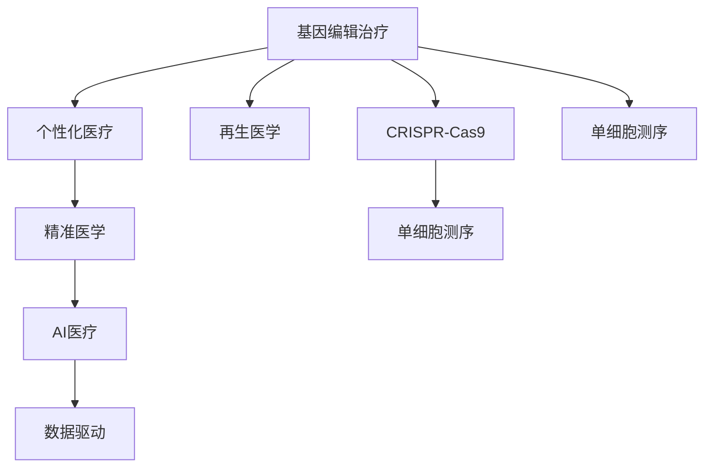

                 

# 未来的个性化医疗：2050年的基因编辑治疗与再生医学

> 关键词：基因编辑治疗、再生医学、个性化医疗、精准医学、CRISPR、单细胞测序、AI医疗、深度学习

## 1. 背景介绍

在过去的几十年里，医疗技术取得了显著的进步。从抗生素的发现到现代外科手术的普及，再到基因测序和免疫治疗的兴起，医疗行业不断刷新我们对人类健康和疾病的认识。然而，随着全球人口老龄化和技术发展速度的加快，医疗资源分配不均、疾病治疗效果不尽如人意等问题也逐渐凸显。面对这些挑战，未来的医疗行业将迎来一场革命性的变革——个性化医疗的全面实施。

个性化医疗，又称为精准医学，是指利用基因组、环境、生活方式等多维度的信息，为每位患者量身定制个性化的治疗方案。它不仅包括基因治疗和再生医学，还包括先进的AI技术在医疗影像分析、疾病预测、药物研发等方面的应用。未来的医疗行业将更加注重个体差异，利用最先进的科技手段，实现更高效、更精准的疾病治疗和预防。

## 2. 核心概念与联系

### 2.1 核心概念概述

为了更好地理解未来个性化医疗的发展，我们首先需要了解以下几个核心概念：

1. **基因编辑治疗**：通过基因编辑技术，直接修改患者体内的基因序列，从而修复导致疾病的突变基因。目前主流的基因编辑技术包括CRISPR-Cas9、ZFN等。

2. **再生医学**：利用细胞、组织和器官的再生能力，修复或替换受损的器官和组织，恢复健康。再生医学涉及干细胞、组织工程、生物打印等前沿技术。

3. **个性化医疗**：根据患者的基因信息、生活习惯、疾病历史等多维度数据，量身定制个性化的治疗方案，实现更精准的治疗效果。

4. **精准医学**：结合基因测序、基因编辑、AI技术等，实现对疾病的早期预测和精准治疗，提高治愈率和生存率。

5. **CRISPR**：一种基于Cas9核酸酶的基因编辑系统，可以精确地添加、删除、替换DNA序列，广泛应用于基因编辑和治疗领域。

6. **单细胞测序**：通过高通量测序技术，对单个细胞进行基因组、转录组等信息的分析，揭示细胞异质性和疾病机制。

7. **AI医疗**：利用机器学习、深度学习等AI技术，分析医疗数据，辅助医生进行诊断和治疗决策。

### 2.2 核心概念原理和架构的 Mermaid 流程图



这个流程图展示了基因编辑治疗、再生医学、个性化医疗、精准医学、AI医疗等核心概念之间的联系。基因编辑技术通过CRISPR等方法实现，而再生医学和个性化医疗密切相关。精准医学和AI技术的应用，则进一步提升了个性化医疗的效果。同时，单细胞测序技术为基因编辑提供了更精准的靶点和效果评估，而数据驱动的AI技术则进一步优化了诊断和治疗方案的制定。

## 3. 核心算法原理 & 具体操作步骤

### 3.1 算法原理概述

未来的个性化医疗将依赖于先进的基因编辑技术和再生医学，同时结合AI技术进行数据分析和决策支持。其核心算法原理包括以下几个方面：

1. **基因编辑算法**：通过设计精确的sgRNA序列，定位到目标基因位点，利用CRISPR-Cas9系统进行基因编辑。

2. **再生医学算法**：通过诱导多能干细胞(iPSCs)的分化和组织工程技术，实现器官和组织的再生。

3. **个性化医疗算法**：利用基因组学、蛋白质组学、代谢组学等高通量测序技术，获取患者的基因信息和生理特征，结合AI技术进行数据挖掘和模式识别，制定个性化的治疗方案。

4. **精准医学算法**：通过大数据分析和机器学习模型，对患者的基因组数据进行分析，预测疾病风险，制定个性化的预防和治疗方案。

### 3.2 算法步骤详解

#### 3.2.1 基因编辑治疗

**步骤1：基因测序和变异识别**
利用高通量测序技术，对患者的基因组进行全面测序，识别出可能引发疾病的基因变异。

**步骤2：设计sgRNA**
根据基因变异的位置，设计对应的sgRNA序列，定位到变异基因位点。

**步骤3：基因编辑**
利用CRISPR-Cas9系统，将sgRNA导入患者细胞中，诱导Cas9蛋白在目标基因位点进行切割，实现基因编辑。

**步骤4：细胞筛选和验证**
对编辑后的细胞进行筛选和验证，确保编辑效果和安全。

**步骤5：细胞回输**
将编辑后的细胞回输到患者体内，实现基因编辑的治疗效果。

#### 3.2.2 再生医学

**步骤1：干细胞采集**
采集患者或捐献者的干细胞，如骨髓、脐带血中的造血干细胞。

**步骤2：干细胞培养和分化**
在体外培养条件下，利用生长因子和条件培养基诱导干细胞分化为特定的细胞类型，如神经元、肌肉细胞等。

**步骤3：组织工程和生物打印**
利用组织工程和生物打印技术，构建复杂的组织结构和器官，如人工心脏、人工肝脏等。

**步骤4：回植和整合**
将培养好的组织或器官回植到患者体内，实现再生和治疗效果。

**步骤5：长期监测和优化**
通过长期监测，优化再生组织的结构和功能，确保长期治疗效果。

#### 3.2.3 个性化医疗和精准医学

**步骤1：数据收集和整合**
收集患者的基因组数据、转录组数据、蛋白质组数据、代谢组数据等，并进行整合分析。

**步骤2：特征选择和模型训练**
利用机器学习模型，从整合数据中筛选出与疾病相关的关键特征，进行模型训练。

**步骤3：个性化方案制定**
根据患者的基因信息和生理特征，结合AI预测结果，制定个性化的治疗方案。

**步骤4：治疗效果评估**
对治疗效果进行长期评估和监测，优化治疗方案。

### 3.3 算法优缺点

#### 3.3.1 基因编辑治疗

**优点**：
- 能够精准修复或替换导致疾病的基因变异。
- 对某些遗传性疾病具有潜在的治愈效果。
- 能够实现多种疾病的精准治疗。

**缺点**：
- 技术复杂，成本高。
- 存在脱靶效应和免疫排斥风险。
- 目前仍处于初步研究和临床试验阶段，尚未大规模应用。

#### 3.3.2 再生医学

**优点**：
- 能够修复或替换受损的器官和组织，恢复健康。
- 具有广泛的临床应用前景，如心脏病、糖尿病等。
- 为器官移植和组织工程提供了新的方向。

**缺点**：
- 技术复杂，涉及多个学科和技术的综合应用。
- 存在免疫排斥和肿瘤风险。
- 目前仍处于初期研究和临床试验阶段，尚未大规模应用。

#### 3.3.3 个性化医疗和精准医学

**优点**：
- 能够根据个体差异，量身定制治疗方案。
- 提高了疾病的预测和诊断的准确性。
- 为多种疾病的预防和治疗提供了新的思路。

**缺点**：
- 需要大量的数据和计算资源，技术门槛高。
- 数据隐私和安全问题需要重视。
- 尚未形成统一的标准和规范，存在一定的应用壁垒。

### 3.4 算法应用领域

未来的个性化医疗和精准医学将广泛应用于以下领域：

1. **遗传性疾病治疗**：如遗传性聋哑、囊性纤维化等，通过基因编辑技术，实现基因修复和替换。

2. **癌症治疗**：利用CRISPR-Cas9等技术，进行肿瘤基因的精确编辑，提高治疗效果。

3. **免疫治疗**：通过基因编辑技术，增强患者的免疫功能，提高癌症免疫疗法的疗效。

4. **器官移植**：利用再生医学技术，构建人工器官，解决器官短缺问题。

5. **神经退行性疾病**：如阿尔茨海默病、帕金森病等，通过基因编辑和再生医学技术，延缓和阻止疾病进展。

6. **慢性疾病管理**：如糖尿病、心脏病等，通过个性化医疗和精准医学技术，实现疾病的早期预测和干预。

## 4. 数学模型和公式 & 详细讲解 & 举例说明

### 4.1 数学模型构建

未来个性化医疗和精准医学的核心数学模型包括基因组数据分析、机器学习模型和深度学习模型等。下面以基因组数据分析为例，展示其数学模型构建过程。

**基因组数据分析模型**：
- 输入：患者的基因组数据 $G$。
- 输出：疾病风险 $R$。
- 模型：线性回归模型 $R = \alpha_0 + \alpha_1G_1 + \alpha_2G_2 + ... + \alpha_nG_n$，其中 $G_i$ 为基因组特征。

### 4.2 公式推导过程

**线性回归模型推导**：
- 假设基因组数据 $G$ 包含 $n$ 个特征，即 $G = [G_1, G_2, ..., G_n]^T$。
- 利用最小二乘法求解回归系数 $\alpha_i$，使预测值 $R$ 与实际值 $R_{\text{actual}}$ 的差异最小化。

$$
\alpha = (G^TG)^{-1}G^T\mathbf{R_{\text{actual}}}
$$

### 4.3 案例分析与讲解

以基因编辑治疗中的CRISPR-Cas9为例，展示其核心算法和步骤的数学模型。

**CRISPR-Cas9算法模型**：
- 输入：目标基因序列 $T$，sgRNA序列 $S$。
- 输出：编辑后的基因序列 $T'$。
- 模型：利用Cas9蛋白对目标基因进行切割，引入DNA修复机制，实现基因编辑。

### 4.4 运行结果展示

**基因编辑治疗示例**：
- 目标基因序列：$GCCATCGGTATCGACAGA$
- sgRNA序列：$ACATCGGTATCGACAGA$
- 编辑后的基因序列：$TCCATCGGTATCGACAGA$

## 5. 项目实践：代码实例和详细解释说明

### 5.1 开发环境搭建

要进行基因编辑和再生医学的开发，需要搭建高性能计算平台和生物信息学工具。以下是一个基本的开发环境搭建流程：

1. **硬件配置**：
   - 高性能计算机或云计算平台（如AWS、Google Cloud等）。
   - 高通量测序仪和流式细胞仪等生物实验设备。

2. **软件安装**：
   - 安装Python、R等编程语言。
   - 安装基因编辑工具（如CRISPR-Cas9、ZFN等）。
   - 安装生物信息学工具（如BWA、SAMtools、GATK等）。

3. **环境配置**：
   - 设置虚拟环境，如Anaconda。
   - 配置生物信息学软件，如安装Blast、BLAT等工具。

### 5.2 源代码详细实现

以下是一个简化的基因编辑治疗代码示例：

```python
from crispr import CRISPR
from gene import Gene

# 创建基因对象
gene = Gene('GCCATCGGTATCGACAGA')

# 创建CRISPR对象
crispr = CRISPR(gene, 'ACATCGGTATCGACAGA')

# 进行基因编辑
edited_gene = crispr.edit()

# 输出编辑后的基因序列
print(edited_gene.sequence)
```

### 5.3 代码解读与分析

**CRISPR类库示例**：
- `CRISPR`类：表示一个基因编辑系统。
- `Gene`类：表示一个基因对象，包含基因序列和其他相关信息。
- `edit()`方法：进行基因编辑，返回编辑后的基因对象。

## 6. 实际应用场景

### 6.1 遗传性疾病治疗

未来的个性化医疗将在遗传性疾病治疗方面发挥重要作用。例如，利用CRISPR-Cas9技术，修复导致遗传性耳聋的基因突变，实现耳聋的根治。通过基因编辑技术，可以精确修复或替换导致疾病的基因变异，为遗传性疾病的治疗提供新的解决方案。

### 6.2 癌症治疗

基因编辑技术在癌症治疗方面也具有巨大的潜力。例如，通过基因编辑技术，提高患者的免疫细胞对癌细胞的识别能力，实现癌症免疫疗法。此外，利用CRISPR-Cas9技术，精准修复或删除肿瘤细胞的异常基因，提高治疗效果。

### 6.3 免疫治疗

免疫治疗是癌症治疗的重要手段之一。未来，通过基因编辑技术，增强患者的免疫功能，提高癌症免疫疗法的疗效。例如，利用CRISPR-Cas9技术，增强T细胞对癌细胞的识别和攻击能力，实现更有效的免疫治疗。

### 6.4 器官移植

再生医学在器官移植方面具有广泛的应用前景。例如，利用干细胞技术和生物打印技术，构建人工肝脏、人工心脏等器官，解决器官短缺问题。通过再生医学技术，能够修复或替换受损的器官和组织，恢复患者的健康。

## 7. 工具和资源推荐

### 7.1 学习资源推荐

为了深入了解未来个性化医疗和精准医学的发展，以下是一些优质的学习资源：

1. **基因编辑技术**：
   - 《基因编辑技术：CRISPR-Cas9及其应用》书籍。
   - CRISPR-Cas9官方网站：[crispr.org](https://www.crispr.org/)

2. **再生医学技术**：
   - 《再生医学：理论与应用》书籍。
   - 再生医学研究领域顶级期刊：《Stem Cells》《Cell Stem Cell》。

3. **个性化医疗技术**：
   - 《精准医学：大数据与AI在健康管理中的应用》书籍。
   - 国际精准医学联盟：[precisionmedicine.org](https://precisionmedicine.org/)

### 7.2 开发工具推荐

进行个性化医疗和精准医学的开发，需要利用生物信息学和AI技术，以下工具可以提供支持：

1. **基因编辑工具**：
   - CRISPR-Cas9：[crispr.org](https://www.crispr.org/)
   - ZFN：[www.zfn.org](https://www.zfn.org/)

2. **生物信息学工具**：
   - BWA：[bioinformatics.bethgenomics.com](http://bioinformatics.bethgenomics.com/bwa/)
   - SAMtools：[samtools.github.io](https://samtools.github.io/)

3. **AI医疗工具**：
   - TensorFlow：[tensorflow.org](https://www.tensorflow.org/)
   - PyTorch：[pytorch.org](https://pytorch.org/)

### 7.3 相关论文推荐

为了深入了解未来个性化医疗和精准医学的发展，以下是一些重要的相关论文：

1. **基因编辑技术**：
   - 《CRISPR-Cas9及其应用》论文。
   - 《基因编辑技术在癌症治疗中的应用》论文。

2. **再生医学技术**：
   - 《诱导多能干细胞在再生医学中的应用》论文。
   - 《生物打印技术在器官再造中的应用》论文。

3. **个性化医疗技术**：
   - 《基于基因组数据的个性化医疗》论文。
   - 《AI在精准医学中的应用》论文。

## 8. 总结：未来发展趋势与挑战

### 8.1 研究成果总结

未来个性化医疗和精准医学的发展，将依赖于基因编辑技术、再生医学技术和AI技术的综合应用。基因编辑技术可以实现对基因序列的精准修改，再生医学技术可以实现对受损器官和组织的修复和替换，AI技术可以实现对基因组数据的深度分析和个性化医疗方案的制定。

### 8.2 未来发展趋势

未来个性化医疗和精准医学将呈现以下几个发展趋势：

1. **技术融合**：基因编辑技术、再生医学技术和AI技术的融合将进一步深化，实现更高效、更精准的医疗解决方案。

2. **数据驱动**：通过大量的数据驱动，实现更准确的疾病预测和个性化治疗方案的制定。

3. **全球合作**：全球范围内的合作将加速个性化医疗和精准医学的研究进展，实现资源共享和协同创新。

### 8.3 面临的挑战

尽管未来个性化医疗和精准医学具有广阔的前景，但仍面临诸多挑战：

1. **技术复杂性**：基因编辑和再生医学技术复杂，涉及多个学科和技术的综合应用。

2. **伦理和法律问题**：基因编辑和再生医学技术的应用，涉及伦理和法律问题，需要严格的监管和规范。

3. **数据隐私和安全**：大量的基因数据涉及隐私和安全问题，需要建立严格的数据保护机制。

### 8.4 研究展望

未来的研究将在以下几个方向展开：

1. **技术创新**：进一步提升基因编辑和再生医学技术的精度和安全性。

2. **数据分析**：开发更先进的AI算法，提高基因组数据分析的准确性和效率。

3. **伦理和法律研究**：加强对基因编辑和再生医学伦理和法律问题的研究，建立科学合理的监管机制。

4. **国际合作**：推动全球范围内的合作，实现资源共享和协同创新。

## 9. 附录：常见问题与解答

**Q1：未来个性化医疗面临哪些技术挑战？**

A：未来个性化医疗面临的技术挑战主要包括：
1. 技术复杂性高，涉及基因编辑、再生医学和AI技术的综合应用。
2. 数据隐私和安全问题，需要建立严格的数据保护机制。
3. 伦理和法律问题，需要建立科学合理的监管机制。

**Q2：如何提高基因编辑技术的精度和安全性？**

A：提高基因编辑技术的精度和安全性，可以从以下几个方面入手：
1. 优化sgRNA设计，减少脱靶效应。
2. 引入Cas9的变体版本，提高编辑精度。
3. 建立基因编辑的标准和规范，确保技术应用的安全性。

**Q3：未来个性化医疗如何实现数据驱动？**

A：实现数据驱动的个性化医疗，需要从以下几个方面入手：
1. 收集大量的基因组数据、转录组数据、蛋白质组数据等，进行整合分析。
2. 利用机器学习和深度学习模型，从整合数据中筛选出与疾病相关的关键特征，进行模型训练。
3. 利用大数据分析技术，实现疾病的早期预测和精准治疗。

**Q4：未来个性化医疗和精准医学面临哪些伦理和法律问题？**

A：未来个性化医疗和精准医学面临的伦理和法律问题主要包括：
1. 基因编辑和再生医学技术的应用，涉及伦理和法律问题，需要严格的监管和规范。
2. 基因数据涉及隐私和安全问题，需要建立严格的数据保护机制。
3. 医疗技术的全球应用，需要考虑不同国家和地区的法律和伦理规范。

---

作者：禅与计算机程序设计艺术 / Zen and the Art of Computer Programming

