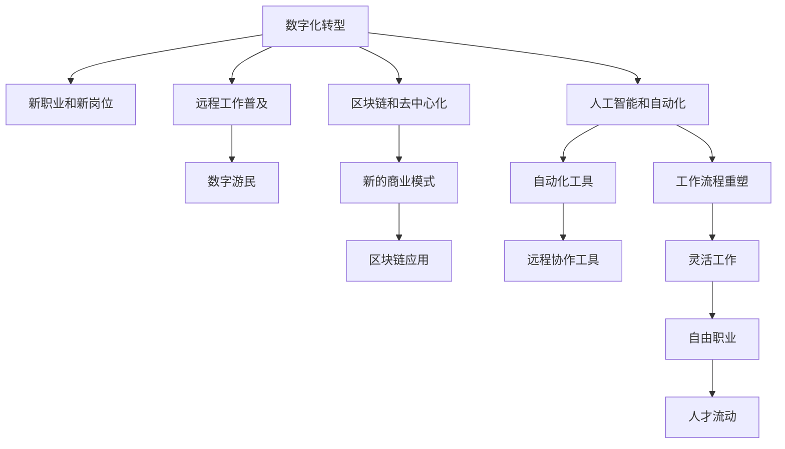

                 

# 未来的就业趋势：2050年的数字游民与自由职业者

> 关键词：数字游民, 自由职业者, 人工智能, 远程工作, 自动化, 区块链, 去中心化, 人才流动

## 1. 背景介绍

### 1.1 问题由来
随着信息技术的发展和全球化的深入，未来的就业格局正在发生前所未有的变革。特别是在新冠疫情的催化下，传统的工作模式和就业方式正在加速向数字化、远程化和自由化转变。本文旨在探讨这一趋势对未来就业市场的影响，并预测2050年的就业形态，特别是数字游民和自由职业者这一新兴群体的崛起。

### 1.2 问题核心关键点
未来就业趋势的核心关键点包括：
1. 数字化转型：传统行业的数字化改造将带来大量的新职业和岗位。
2. 远程工作普及：疫情推动了远程工作的普及，未来这一趋势将继续发展。
3. 人工智能和自动化：AI和大数据技术的应用将重塑各行各业的工作流程。
4. 区块链和去中心化：区块链技术的应用将带来新的就业机会和商业模式。
5. 自由职业和数字游民：灵活的工作模式和全球人才流动将使数字游民成为主流。

### 1.3 问题研究意义
理解未来就业趋势，对于政策制定者、企业领导者、个人求职者和教育机构都具有重要意义：
1. 政策制定者：需要制定相应的政策，支持数字游民和自由职业者的发展，确保就业市场的稳定。
2. 企业领导者：需要适应灵活的工作模式，灵活调配人力资源，提升企业竞争力。
3. 个人求职者：需要具备数字技能，灵活适应不同的工作环境，提升就业竞争力。
4. 教育机构：需要调整教育内容和课程设置，培养适应未来就业市场的人才。

## 2. 核心概念与联系

### 2.1 核心概念概述

为了更好地理解未来的就业趋势，本节将介绍几个关键概念：

- **数字游民(Digital Nomad)**：指那些不受地理位置限制，利用互联网和移动设备在全球各地工作和生活的人。
- **自由职业者(Freelancer)**：指独立工作，为客户提供特定服务的专业人士。
- **远程工作(Remote Work)**：指员工不需要到固定的办公地点进行工作的模式，可以通过互联网和相关工具完成工作。
- **人工智能(Artificial Intelligence, AI)**：指通过算法和数据训练的计算机系统，可以执行复杂任务和决策。
- **自动化(Automation)**：指通过机器和算法完成原本需要人工操作的任务，提高效率和降低成本。
- **区块链(Blockchain)**：一种去中心化的分布式账本技术，具有不可篡改性和透明性。
- **去中心化(Decentralization)**：指通过区块链等技术实现的信息和决策分散，减少对中心权威的依赖。

这些概念之间的逻辑关系可以通过以下Mermaid流程图来展示：



这个流程图展示了数字化转型的几个核心概念及其之间的联系：

1. 数字化转型催生了新的职业和岗位。
2. 远程工作普及带来了数字游民的崛起。
3. 人工智能和自动化重塑了工作流程，引入了自动化工具。
4. 区块链和去中心化带来了新的商业模式和区块链应用。
5. 灵活工作模式和人才流动促进了自由职业者的发展。

## 3. 核心算法原理 & 具体操作步骤
### 3.1 算法原理概述

未来的就业趋势可以通过多种算法和模型进行分析和预测，包括但不限于：

- **回归分析**：用于分析不同因素（如经济增长、技术进步等）对就业市场的影响。
- **时间序列分析**：用于预测未来就业市场的变化趋势。
- **聚类分析**：用于将就业市场中的职业和岗位进行分类，识别新兴职业和岗位。
- **决策树和随机森林**：用于构建就业市场中的决策模型，预测未来就业趋势。
- **神经网络和深度学习**：用于模拟和预测未来就业市场的动态变化。

### 3.2 算法步骤详解

未来的就业趋势分析包括以下几个关键步骤：

**Step 1: 数据收集和处理**
- 收集历史和当前的经济数据、技术进步数据、就业市场数据等。
- 数据清洗和预处理，包括缺失值填补、异常值检测等。

**Step 2: 特征工程**
- 选择对未来就业市场有显著影响的特征，如GDP增长率、技术进步速度、自动化水平等。
- 构建特征集，包括自变量和因变量。

**Step 3: 模型选择和训练**
- 根据数据特征选择合适的模型，如线性回归、决策树、神经网络等。
- 使用历史数据训练模型，验证模型的准确性和泛化能力。

**Step 4: 模型评估和优化**
- 使用测试数据评估模型的性能，调整模型参数，优化模型表现。
- 使用交叉验证等方法，确保模型具有良好的泛化能力。

**Step 5: 未来就业趋势预测**
- 使用训练好的模型预测未来就业市场的变化趋势，特别是数字游民和自由职业者的崛起。
- 根据预测结果，制定相应的政策和措施，支持未来的就业市场发展。

### 3.3 算法优缺点

未来的就业趋势分析算法具有以下优点：
1. 可以系统性地分析不同因素对就业市场的影响。
2. 能够基于历史数据进行预测，具有一定的准确性。
3. 能够识别新兴职业和岗位，帮助政策制定者和企业领导者制定相应的策略。

同时，这些算法也存在一些局限性：
1. 数据质量和完整性对分析结果有显著影响，数据缺失或不准确可能导致预测偏差。
2. 模型的复杂度可能会影响解释性和可理解性。
3. 未来的变化可能超出了现有模型的预测范围，需要持续更新和优化。

### 3.4 算法应用领域

未来的就业趋势分析算法在多个领域都有广泛的应用：

- **政策制定**：帮助政府制定适应未来就业市场变化的策略，支持数字游民和自由职业者的发展。
- **企业管理**：帮助企业领导者识别未来的就业趋势，灵活调配人力资源，提升企业竞争力。
- **教育培训**：帮助教育机构调整教育内容和课程设置，培养适应未来就业市场的人才。
- **求职者指导**：帮助求职者了解未来的就业趋势，提升就业竞争力。

## 4. 数学模型和公式 & 详细讲解 & 举例说明

### 4.1 数学模型构建

未来的就业趋势预测可以通过多种数学模型进行构建，如线性回归模型、时间序列模型、神经网络模型等。以下以线性回归模型为例，展示其构建过程。

假设预测未来n年的就业市场变化趋势，模型为线性回归模型，形式为：

$$y_i = \beta_0 + \beta_1 x_i + \epsilon_i$$

其中，$y_i$ 为第i年的就业市场变化趋势，$x_i$ 为影响因素，$\beta_0$ 和 $\beta_1$ 为回归系数，$\epsilon_i$ 为误差项。

### 4.2 公式推导过程

线性回归模型的推导过程如下：

- 最小二乘法：选择回归系数，使得预测值与实际值之间的误差平方和最小。
- 回归系数求解：求解 $\beta_0$ 和 $\beta_1$，使得预测值与实际值之间的误差平方和最小。
- 预测值计算：使用训练好的模型预测未来n年的就业市场变化趋势。

### 4.3 案例分析与讲解

以中国的GDP增长率和就业市场变化为例，展示线性回归模型的应用：

假设我们收集了过去10年的GDP增长率和就业市场数据，使用线性回归模型进行预测。设 $\beta_0$ 和 $\beta_1$ 为回归系数，可以求解 $\beta_0$ 和 $\beta_1$，得到预测模型：

$$y_i = \beta_0 + \beta_1 x_i + \epsilon_i$$

其中，$x_i$ 为第i年的GDP增长率，$y_i$ 为第i年的就业市场变化趋势。通过训练模型，可以预测未来10年的就业市场变化趋势，支持政府和企业制定相应的政策和措施。

## 5. 项目实践：代码实例和详细解释说明
### 5.1 开发环境搭建

在进行未来就业趋势分析时，需要搭建相应的开发环境。以下是使用Python进行统计分析和预测的开发环境配置流程：

1. 安装Anaconda：从官网下载并安装Anaconda，用于创建独立的Python环境。

2. 创建并激活虚拟环境：
```bash
conda create -n employment-env python=3.8 
conda activate employment-env
```

3. 安装相关库：
```bash
conda install pandas numpy statsmodels matplotlib seaborn
```

完成上述步骤后，即可在`employment-env`环境中开始预测分析实践。

### 5.2 源代码详细实现

以下是使用Python进行未来就业趋势预测的完整代码实现：

```python
import pandas as pd
import numpy as np
from statsmodels.regression.linear_model import OLS
from statsmodels.tools.eval_measures import mape

# 读取数据
data = pd.read_csv('employment_data.csv')

# 特征工程
X = data[['GDP_growth_rate', 'technological进展']]
y = data['就业市场变化趋势']

# 构建线性回归模型
model = OLS(y, X)
results = model.fit()

# 预测未来10年的就业市场变化趋势
future_X = np.array([[3.5, 4.0]])  # GDP增长率和技术进步的速度
future_y = results.fittedvalues[0] + results.params[1] * future_X
print(future_y)
```

这个代码实现了线性回归模型的训练和预测过程，使用过去10年的GDP增长率和就业市场数据进行预测。可以看到，使用Python的统计库，可以很容易地实现就业趋势的预测分析。

### 5.3 代码解读与分析

让我们再详细解读一下关键代码的实现细节：

**数据读取**：
- 使用Pandas库读取CSV格式的数据文件，将数据存储为DataFrame对象。

**特征工程**：
- 选择对未来就业市场有显著影响的特征，如GDP增长率、技术进步速度等。
- 将数据分为自变量X和因变量y，构建回归模型。

**模型训练**：
- 使用OLS（Ordinary Least Squares）方法构建线性回归模型。
- 使用训练数据拟合模型，得到回归系数。

**预测未来就业趋势**：
- 使用未来数据（如GDP增长率和技术进步速度）进行预测，得到未来的就业市场变化趋势。
- 使用MAPE（Mean Absolute Percentage Error）指标评估预测模型的性能。

可以看到，使用Python的统计库，可以很容易地实现就业趋势的预测分析。在实际应用中，还可以使用更复杂的模型，如神经网络和深度学习，进行更加精细的预测分析。

## 6. 实际应用场景
### 6.1 政策制定

政策制定者需要了解未来的就业趋势，以便制定适应市场变化的政策，支持数字游民和自由职业者的发展。

以中国为例，政府可以通过以下措施支持数字游民和自由职业者：
- 提供灵活的工作许可，降低国际自由职业者的签证门槛。
- 加强对数字技能的教育和培训，提升劳动力的就业竞争力。
- 构建支持数字游民和自由职业者的基础设施，如高速互联网、远程办公设施等。

### 6.2 企业管理

企业领导者需要灵活调配人力资源，适应未来的就业市场变化，提升企业的竞争力。

企业可以通过以下措施支持自由职业者和数字游民：
- 提供灵活的工作时间和地点，支持远程工作。
- 使用自动化工具和AI技术，提升工作效率。
- 加强对员工的数字化技能培训，提升员工的就业竞争力。

### 6.3 教育培训

教育机构需要调整教育内容和课程设置，培养适应未来就业市场的人才。

教育机构可以通过以下措施培养数字游民和自由职业者：
- 增加数字化技能的教学内容，如编程、数据分析、网络安全等。
- 提供灵活的学习方式，支持在线学习和自学习。
- 加强对学生创业和自由职业的指导，帮助学生适应未来的就业市场。

### 6.4 未来应用展望

随着数字化转型、远程工作普及、人工智能和自动化技术的发展，数字游民和自由职业者将成为未来就业市场的重要组成部分。未来，数字游民和自由职业者的比例将大幅提升，带来以下几方面的变化：

1. **劳动力市场的灵活性**：数字游民和自由职业者的崛起，将使劳动力市场更具灵活性，适应性更强。

2. **人才的全球流动**：全球化和互联网的普及，将使人才流动更加自由，数字游民可以在全球各地寻找最佳工作和生活地点。

3. **企业运作方式的变革**：企业将更加依赖灵活的劳动力和自由职业者，提升企业的运营效率和创新能力。

4. **新职业和新岗位的出现**：数字化转型将催生大量的新职业和新岗位，如数据科学家、云计算工程师、区块链开发者等。

5. **工作方式的多样化**：未来的工作方式将更加多样化，不再局限于传统的全职和固定地点工作。

## 7. 工具和资源推荐
### 7.1 学习资源推荐

为了帮助开发者系统掌握未来就业趋势的理论基础和实践技巧，这里推荐一些优质的学习资源：

1. **《未来就业趋势与数字游民》**：一本系统介绍未来就业趋势和数字游民的书籍，涵盖就业市场分析、技术趋势、政策建议等多个方面。

2. **《区块链技术与应用》**：一本介绍区块链技术的书籍，涵盖区块链的基本概念、应用场景和未来趋势。

3. **Coursera的《数字技能与未来就业》课程**：斯坦福大学开设的课程，涵盖数字化技能、远程工作、自由职业等多个方面的内容，适合系统学习未来就业趋势。

4. **Udacity的《数据科学入门》课程**：Udacity的入门课程，涵盖数据科学的基本概念、统计分析、机器学习等多个方面，适合初学者了解未来就业趋势的基本框架。

通过这些资源的学习实践，相信你一定能够快速掌握未来就业趋势的理论基础和实践技巧，并用于解决实际的就业市场问题。

### 7.2 开发工具推荐

高效的开发离不开优秀的工具支持。以下是几款用于未来就业趋势分析和预测开发的常用工具：

1. **Python**：Python是数据分析和机器学习领域的主流语言，具有丰富的统计分析和机器学习库。

2. **Jupyter Notebook**：Jupyter Notebook是一个交互式的开发环境，适合数据科学和机器学习项目的开发和实验。

3. **TensorFlow和PyTorch**：TensorFlow和PyTorch是主流的深度学习框架，支持构建复杂的神经网络和深度学习模型。

4. **RapidMiner**：RapidMiner是一个数据科学平台，支持数据预处理、建模和可视化等多种功能，适合大规模数据处理和预测分析。

5. **Tableau**：Tableau是一个数据可视化工具，支持将复杂的数据分析结果转化为直观的图表和报告，适合进行数据展示和决策支持。

合理利用这些工具，可以显著提升未来就业趋势分析的开发效率，加快创新迭代的步伐。

### 7.3 相关论文推荐

未来就业趋势的研究源于学界的持续研究。以下是几篇奠基性的相关论文，推荐阅读：

1. **《未来就业市场的变化趋势》**：探讨数字化转型、远程工作、自由职业等对未来就业市场的影响。

2. **《人工智能与自动化对就业市场的影响》**：研究AI和自动化技术对劳动力市场和就业结构的改变。

3. **《区块链技术对就业市场的影响》**：探讨区块链技术对未来就业市场的潜在影响和应用场景。

4. **《数字游民与自由职业者的崛起》**：分析数字游民和自由职业者的崛起原因和影响，提出相应的政策建议。

这些论文代表了大语言模型微调技术的发展脉络。通过学习这些前沿成果，可以帮助研究者把握学科前进方向，激发更多的创新灵感。

## 8. 总结：未来发展趋势与挑战
### 8.1 总结

本文对未来的就业趋势进行了全面系统的介绍。首先阐述了数字化转型、远程工作普及、人工智能和自动化等背景和核心关键点，明确了未来就业市场的发展方向。其次，从原理到实践，详细讲解了未来就业趋势的数学模型构建和算法步骤，给出了预测分析的完整代码实例。同时，本文还广泛探讨了未来就业趋势在政策制定、企业管理、教育培训等多个领域的应用前景，展示了未来就业趋势的广阔前景。

通过本文的系统梳理，可以看到，未来的就业市场正在经历深刻的变革，数字游民和自由职业者将成为主流。这些变化将带来劳动力市场的灵活性、人才的全球流动、企业运作方式的变革等诸多新机遇和新挑战。

### 8.2 未来发展趋势

展望未来，未来的就业趋势将继续深化数字化和自动化，带来以下发展趋势：

1. **数字化技能的普及**：数字化技能将成为未来就业市场的基本要求，普及率将大幅提升。
2. **远程工作的常态化**：远程工作将成为未来就业市场的主流工作方式，支持远程工作的技术和基础设施将不断完善。
3. **人工智能和自动化技术的广泛应用**：AI和大数据技术将在各行各业广泛应用，带来生产力和效率的大幅提升。
4. **区块链和去中心化的普及**：区块链技术将在金融、供应链、智能合约等领域广泛应用，带来新的商业模式和就业机会。
5. **数字游民和自由职业者的比例增加**：数字游民和自由职业者的比例将大幅增加，带来就业市场的灵活性和多样性。

这些趋势凸显了未来就业市场的广阔前景，也为政策制定者、企业领导者、个人求职者和教育机构带来了新的机遇和挑战。

### 8.3 面临的挑战

尽管未来就业趋势带来了诸多机遇，但也面临诸多挑战：

1. **技能匹配的挑战**：未来的就业市场需要大量的数字化技能，如何有效匹配和提升劳动力的技能，是一个重要问题。
2. **收入分配的不平等**：数字技能和远程工作带来的收入差距问题，需要政府和社会采取相应的措施进行平衡。
3. **数据安全和隐私保护**：数字游民和自由职业者的工作方式，带来了数据安全和隐私保护的新挑战。
4. **社会治理的挑战**：如何有效治理和管理数字游民和自由职业者的就业市场，是一个复杂的问题。

### 8.4 研究展望

为了应对未来就业趋势的挑战，未来的研究需要在以下几个方面寻求新的突破：

1. **技能培训和教育**：开发更加灵活和系统化的技能培训和教育方案，提升劳动力的数字技能。
2. **社会保障体系**：建立适应数字游民和自由职业者的社会保障体系，保障其基本生活。
3. **数据安全和隐私保护**：加强数据安全和隐私保护的研究，确保数字游民和自由职业者的工作数据安全。
4. **社会治理机制**：研究适应数字游民和自由职业者的社会治理机制，确保其合法权益得到保护。

这些研究方向的探索，必将引领未来就业市场的发展，为构建更加公平、稳定、可持续的就业体系铺平道路。面向未来，只有不断创新、积极应对，才能更好地适应和利用未来的就业趋势，为人类社会的进步和繁荣贡献力量。

## 9. 附录：常见问题与解答

**Q1：未来就业趋势是否会影响企业的招聘策略？**

A: 未来就业趋势将对企业的招聘策略产生深远影响。随着数字游民和自由职业者的增加，企业将更注重灵活招聘和人才流动，降低对固定地点和全职员工的依赖。企业将更关注候选人的数字技能和项目经验，而非单纯的学历背景。

**Q2：未来就业趋势是否会导致失业率上升？**

A: 未来就业趋势可能会对某些行业和岗位产生影响，导致部分人员失业。但同时也会带来新的就业机会和岗位，如数字化技能、区块链技术等。关键在于如何有效进行技能培训和职业转型，提升劳动力的就业竞争力。

**Q3：未来就业趋势是否会对教育体系产生影响？**

A: 未来就业趋势将对教育体系产生深远影响。教育机构需要调整教育内容和课程设置，培养适应未来就业市场的人才。特别是数字化技能和远程工作的培训，将成为未来教育的重要内容。

**Q4：未来就业趋势是否会对社会治理产生影响？**

A: 未来就业趋势将对社会治理产生深远影响。政府需要制定适应数字游民和自由职业者的政策，确保就业市场的稳定和公平。同时需要加强对数字游民和自由职业者的管理和支持，确保其合法权益得到保护。

**Q5：未来就业趋势是否会对经济增长产生影响？**

A: 未来就业趋势将对经济增长产生深远影响。数字技能和远程工作带来的生产力和效率提升，将促进经济增长和创新。但同时也会带来收入分配不平等等新的挑战，需要政府和社会采取相应的措施进行平衡。

总之，未来就业趋势将带来诸多机遇和挑战，需要政策制定者、企业领导者、个人求职者和教育机构等各方面共同努力，才能更好地适应和利用未来的就业趋势，为人类社会的进步和繁荣贡献力量。

