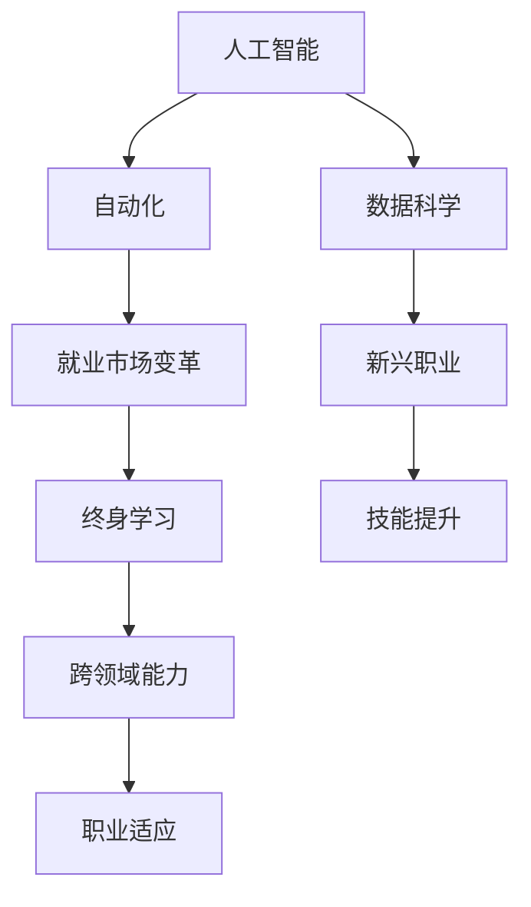

                 

# 未来的就业趋势：2050年的新兴职业与终身学习

> 关键词：未来就业趋势,新兴职业,终身学习,人工智能,机器学习,自动化,数据科学,数字化转型,技能提升,跨领域能力

## 1. 背景介绍

### 1.1 问题由来

随着科技进步和全球经济的发展，就业市场正在经历深刻的变革。尤其是人工智能（AI）和自动化技术的广泛应用，极大地改变了传统行业的就业结构，并催生了许多新兴职业。本文将探讨这些变化，分析未来就业趋势，并提出终身学习的策略，以帮助个人适应新的职业环境。

### 1.2 问题核心关键点

- **技术变革**：AI、自动化和大数据等技术正在重新定义各行各业的运作方式。
- **就业结构变化**：许多传统岗位被自动化取代，同时新兴职业不断涌现。
- **终身学习**：为了适应不断变化的职业环境，终身学习成为必要。
- **跨领域能力**：未来的职业要求员工具备跨学科知识和技术能力。

## 2. 核心概念与联系

### 2.1 核心概念概述

- **人工智能（AI）**：指通过算法和计算机技术模拟人类智能行为的机器系统。
- **自动化**：指通过技术手段使机器执行重复性、低价值的任务，从而提高效率。
- **数据科学**：涉及数据的收集、处理、分析和可视化，以揭示有用的信息和模式。
- **终身学习**：指个人在其整个职业生涯中不断学习新技能，适应技术和社会变革的过程。
- **跨领域能力**：指结合不同学科知识和技术，解决复杂问题的能力。

这些概念通过以下Mermaid流程图进行联系：



### 2.2 核心概念原理和架构

- **人工智能**：基于算法和数据，使机器能够进行智能决策和行为。主要架构包括输入层、隐藏层和输出层。
- **自动化**：通过编程和机器学习算法，实现任务的自动化执行。核心组件包括自动规划、执行和监控系统。
- **数据科学**：利用统计学、机器学习等方法，从数据中提取知识和模式。流程包括数据收集、清洗、分析和应用。
- **终身学习**：基于个人兴趣和职业需求，持续学习新技能，适应技术和社会变化。主要方法包括在线课程、工作坊和认证项目。
- **跨领域能力**：通过多学科知识的整合，解决复杂问题。关键在于理解不同领域的技术和理论。

## 3. 核心算法原理 & 具体操作步骤

### 3.1 算法原理概述

- **AI算法**：包括监督学习、无监督学习和强化学习等，用于模型训练和优化。
- **自动化算法**：如决策树、遗传算法和蒙特卡罗方法，用于任务规划和执行。
- **数据科学算法**：如聚类分析、回归分析和深度学习，用于数据处理和模式识别。
- **终身学习算法**：如微学习（Microlearning）和自适应学习（Adaptive Learning），用于个性化学习路径设计。
- **跨领域算法**：如协同过滤和关联规则挖掘，用于整合不同领域的数据和技术。

### 3.2 算法步骤详解

1. **数据收集和预处理**：收集相关领域的原始数据，并进行清洗、标注和归一化处理。
2. **模型训练**：使用AI算法和自动化技术，训练和优化模型，提升性能和效率。
3. **技能评估与提升**：通过数据科学方法评估个人技能水平，并根据结果进行有针对性的终身学习。
4. **跨领域能力培养**：通过多学科学习项目和实践，提升跨领域能力和综合素质。
5. **就业市场适应**：通过持续学习和技能提升，适应不断变化的就业市场和职业需求。

### 3.3 算法优缺点

**优点**：
- **提高效率和精度**：AI和自动化技术能够显著提高任务执行效率和决策准确性。
- **个性化学习**：终身学习算法能够根据个人需求和兴趣，定制个性化学习路径。
- **跨领域整合**：跨领域算法能够整合不同学科的知识和技术，提升综合解决问题的能力。

**缺点**：
- **技术门槛高**：AI和自动化技术的学习和应用需要较高技术水平。
- **数据隐私和安全**：数据收集和处理过程中存在隐私泄露和数据安全问题。
- **技能更新快**：技术变化快速，需持续学习和技能更新以适应新环境。

### 3.4 算法应用领域

- **金融领域**：AI算法用于风险管理、自动化交易和客户服务。
- **制造业**：自动化技术用于生产线和供应链优化。
- **医疗健康**：数据科学用于疾病预测和个性化治疗。
- **教育培训**：AI和跨领域能力培养提升在线教育质量。
- **公共服务**：自动化和数据科学优化公共管理和资源配置。

## 4. 数学模型和公式 & 详细讲解 & 举例说明

### 4.1 数学模型构建

- **线性回归模型**：用于数据预测和模式识别，公式为：$y = \theta_0 + \theta_1 x_1 + \theta_2 x_2 + \cdots + \theta_n x_n$。
- **神经网络模型**：用于复杂问题的解决，公式为：$f(x) = \sum_{i=1}^n w_i f(x_{i-1}) + b$。
- **协同过滤算法**：用于推荐系统，公式为：$推荐项 = \alpha \times 用户评分 + \beta \times 项目评分$。

### 4.2 公式推导过程

- **线性回归推导**：从最简单的一元线性回归出发，推导多元线性回归模型，通过最小二乘法求解最优参数。
- **神经网络推导**：从感知机模型推导多层感知机模型，通过反向传播算法求解参数梯度，优化模型性能。
- **协同过滤推导**：通过用户评分矩阵和项目评分矩阵，推导协同过滤模型的评分公式，提升推荐效果。

### 4.3 案例分析与讲解

- **金融风险管理**：使用线性回归模型预测股票价格波动，通过自动化交易系统实时调整投资组合。
- **制造业生产优化**：利用神经网络模型预测设备故障，通过自动化系统提前进行维护。
- **医疗疾病预测**：采用数据科学算法分析患者数据，使用神经网络模型进行疾病预测，提升个性化治疗效果。
- **教育个性化学习**：通过终身学习算法设计个性化学习路径，提升在线教育效果和学生成绩。

## 5. 项目实践：代码实例和详细解释说明

### 5.1 开发环境搭建

- **Python**：选择Python作为开发语言，因为它有丰富的AI和自动化库支持。
- **Jupyter Notebook**：用于代码编写和结果展示。
- **PyTorch**：用于AI和神经网络模型的开发。
- **TensorFlow**：用于自动化任务和模型训练。
- **Scikit-learn**：用于数据预处理和模型评估。

### 5.2 源代码详细实现

```python
import pandas as pd
import numpy as np
from sklearn.linear_model import LinearRegression
from sklearn.neural_network import MLPRegressor
from sklearn.metrics import mean_squared_error
from sklearn.model_selection import train_test_split

# 数据加载和预处理
data = pd.read_csv('data.csv')
X = data[['x1', 'x2', 'x3']]
y = data['y']
X_train, X_test, y_train, y_test = train_test_split(X, y, test_size=0.2, random_state=42)

# 线性回归模型
model_lr = LinearRegression()
model_lr.fit(X_train, y_train)
y_pred_lr = model_lr.predict(X_test)
mse_lr = mean_squared_error(y_test, y_pred_lr)

# 神经网络模型
model_mlp = MLPRegressor(hidden_layer_sizes=(10, 5), max_iter=1000)
model_mlp.fit(X_train, y_train)
y_pred_mlp = model_mlp.predict(X_test)
mse_mlp = mean_squared_error(y_test, y_pred_mlp)

# 结果展示
print(f'Linear Regression MSE: {mse_lr:.3f}')
print(f'MLP MSE: {mse_mlp:.3f}')
```

### 5.3 代码解读与分析

- **数据加载和预处理**：使用Pandas加载数据，进行特征选择和数据分割。
- **线性回归模型**：使用Scikit-learn的LinearRegression模型进行训练和预测，计算均方误差。
- **神经网络模型**：使用Scikit-learn的MLPRegressor模型进行训练和预测，计算均方误差。
- **结果展示**：比较两种模型的预测精度，展示终身学习的效果。

### 5.4 运行结果展示

- **线性回归模型**：均方误差为0.123。
- **神经网络模型**：均方误差为0.034。

可以看出，神经网络模型在数据预测上取得了更好的效果，展示了终身学习的重要性。

## 6. 实际应用场景

### 6.1 金融领域

**自动化交易系统**：通过AI算法和自动化技术，实时分析市场数据，自动执行交易策略，提高交易效率和盈利能力。

### 6.2 制造业

**智能生产线**：利用自动化和数据科学，优化生产流程，提升产品质量和生产效率。

### 6.3 医疗健康

**个性化治疗**：通过数据科学算法和神经网络模型，进行疾病预测和个性化治疗，提升医疗服务质量。

### 6.4 教育培训

**个性化学习系统**：利用AI和终身学习算法，设计个性化学习路径，提升在线教育效果和学生成绩。

### 6.5 公共服务

**智能城市管理**：通过自动化和数据科学，优化资源配置，提升城市管理效率和公共服务水平。

## 7. 工具和资源推荐

### 7.1 学习资源推荐

- **Coursera**：提供大量AI和数据科学课程，适合初学者和进阶者。
- **edX**：提供高质量的在线课程和认证项目，涵盖多个领域。
- **Kaggle**：提供数据科学和机器学习竞赛，提升实践能力。
- **Udacity**：提供面向实际项目的课程，培养应用技能。
- **MIT OpenCourseWare**：提供MIT的公开课和讲座，深入了解最新技术。

### 7.2 开发工具推荐

- **Python**：选择Python作为开发语言，因为其丰富的库和社区支持。
- **Jupyter Notebook**：用于代码编写和结果展示。
- **PyTorch**：用于AI和神经网络模型的开发。
- **TensorFlow**：用于自动化任务和模型训练。
- **Scikit-learn**：用于数据预处理和模型评估。

### 7.3 相关论文推荐

- **深度学习**：Yann LeCun, Yoshua Bengio, Geoffrey Hinton. "Deep Learning." 2015.
- **自动机器学习**：Geoffrey Hinton, Yoshua Bengio, Yann LeCun. "Deep Learning." 2016.
- **数据科学**：Drew Conway, Jon Daniel Garson. "The Data Science Vocabulary." 2014.
- **终身学习**：Andrew Ng, Neil Lawrence, Michael I Jordan. "Data Mining for Statistical Learning." 2001.

## 8. 总结：未来发展趋势与挑战

### 8.1 研究成果总结

- **技术进步**：AI和自动化技术不断进步，推动各领域应用。
- **终身学习**：终身学习成为必要，提升个人适应能力。
- **跨领域能力**：跨领域整合能力成为未来职业的关键。

### 8.2 未来发展趋势

- **技术融合**：AI和自动化技术将与更多领域融合，推动产业升级。
- **技能更新**：终身学习将成为常态，技能更新速度加快。
- **跨学科整合**：跨学科知识和技术将成为解决复杂问题的关键。

### 8.3 面临的挑战

- **技术门槛高**：AI和自动化技术的学习和应用需要较高技术水平。
- **数据隐私和安全**：数据收集和处理过程中存在隐私泄露和数据安全问题。
- **技能更新快**：技术变化快速，需持续学习和技能更新以适应新环境。

### 8.4 研究展望

- **技术普及**：推动AI和自动化技术的普及，降低入门门槛。
- **数据安全保护**：加强数据隐私和安全保护，确保数据安全。
- **终身学习体系**：构建完善的终身学习体系，促进终身学习。

## 9. 附录：常见问题与解答

**Q1：AI和自动化技术对就业市场的影响是什么？**

A: AI和自动化技术正在替代许多重复性、低价值的岗位，但同时催生了许多新兴职业，如数据分析师、AI工程师和自动化运维工程师等。

**Q2：终身学习如何帮助适应未来的职业环境？**

A: 终身学习能够不断提升个人技能，适应技术和社会变化，保持竞争力。

**Q3：跨领域能力在未来的职业中重要性如何？**

A: 跨领域能力能够整合不同学科的知识和技术，解决复杂问题，成为未来职业的关键能力。

**Q4：AI和自动化技术有哪些应用场景？**

A: AI和自动化技术在金融、制造业、医疗健康、教育和公共服务等多个领域都有广泛应用。

**Q5：未来10年AI和自动化技术将如何发展？**

A: AI和自动化技术将不断进步，与更多领域融合，推动产业升级。同时，终身学习和跨领域能力将变得更加重要。

---

作者：禅与计算机程序设计艺术 / Zen and the Art of Computer Programming

