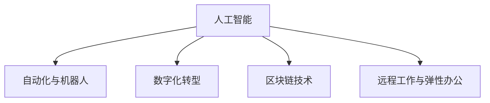

                 

# 未来的工作方式：2050年的职业选择与就业趋势

## 1. 背景介绍

在21世纪的今天，随着人工智能(AI)、自动化和数字化技术的飞速发展，我们正处于一个前所未有的技术变革时代。这些技术正在重塑我们的工作方式，引发了职业选择和就业趋势的巨大变化。展望2050年，我们可以预见，这些变化将进一步加速，对人类的生活方式和职业环境产生深远影响。

### 1.1 技术驱动的就业变革

人工智能、大数据、物联网、区块链等技术的普及，使得各行各业的生产效率大幅提升，同时也对劳动力的技能要求提出了新的挑战。以自动化为例，越来越多的任务将被机器人、自动化流程和算法所替代，传统的低技能工作岗位将会消失，而对高技能工作岗位的需求将急剧增加。

### 1.2 职业选择的多样性增加

随着技术的发展，新的职业岗位和职业路径不断涌现。数据科学家、机器学习工程师、AI研究员、区块链开发者等新兴职业角色将逐渐成为主流。同时，个性化职业选择将变得更加可能，人们可以根据自身兴趣和技能，选择更加多样化和灵活的职业发展道路。

### 1.3 职场弹性与远程工作

数字化技术的普及使得远程工作和灵活办公成为可能。2050年，远程工作将更加普遍，职场弹性将成为主流工作模式。这种模式不仅能够提高工作满意度，还能减少通勤时间，提升生活质量。

## 2. 核心概念与联系

### 2.1 核心概念概述

为了更好地理解2050年的就业趋势，本节将介绍几个关键概念：

- **人工智能(AI)**：指通过计算机程序模拟人类智能的技术，包括机器学习、深度学习、自然语言处理等子领域。AI技术正在改变各行各业的工作方式，提升效率，创造新的价值。

- **自动化与机器人**：指通过自动化技术实现任务自动化的过程。自动化不仅包括传统的生产线自动化，还涵盖了办公室自动化、服务自动化等各个领域。机器人作为自动化的一种表现形式，正越来越多地应用于制造业、服务业等领域。

- **数字化转型**：指通过数字化技术对传统业务进行升级和优化，提升企业的运营效率和竞争力。数字化转型不仅包括技术工具的应用，还涵盖了企业文化、组织结构等方面的变革。

- **区块链技术**：一种去中心化的分布式账本技术，通过加密方式确保数据的安全和透明。区块链在金融、供应链、智能合约等领域展现出巨大的应用潜力，正在重塑各种业务模式。

- **远程工作与弹性办公**：指通过网络技术，实现不受地理限制的工作模式。远程工作不仅提高了工作效率，还带来了更多的工作自由度和灵活性。

这些概念之间的逻辑关系可以通过以下Mermaid流程图来展示：



这个流程图展示了人工智能与其他技术之间的关系：

1. 人工智能推动自动化和机器人的发展，提升工作效率和质量。
2. 数字化转型依赖于人工智能技术，提升企业的运营效率和创新能力。
3. 区块链技术通过加密技术确保数据的透明和安全，正在逐步应用于各个行业。
4. 远程工作与弹性办公通过网络技术实现，与人工智能和区块链技术紧密相关。

这些核心概念共同构成了2050年就业趋势的框架，将对未来的职业选择和就业方式产生深远影响。

## 3. 核心算法原理 & 具体操作步骤

### 3.1 算法原理概述

2050年的就业趋势是由多种复杂因素共同驱动的，包括技术进步、市场需求、政策导向等。为了更好地理解和预测这些趋势，我们需要从多个维度进行深入分析。

### 3.2 算法步骤详解

为了全面分析未来的就业趋势，我们可以采用以下步骤：

1. **数据收集与分析**：收集关于人工智能、自动化、数字化转型、区块链等技术发展的最新数据，以及各行业劳动力市场的变化趋势。

2. **趋势预测**：利用机器学习算法（如时间序列预测、回归分析等）对未来的就业趋势进行预测。

3. **政策模拟**：通过政策模拟工具，评估不同政策变化对就业市场的影响。

4. **情景分析**：基于不同的未来情景（如技术普及、经济增长、社会变革等），分析其对就业趋势的潜在影响。

5. **数据验证**：通过收集实际就业数据，验证预测结果的准确性，并进行必要的调整。

### 3.3 算法优缺点

基于上述算法步骤，可以总结如下：

#### 优点：

- 能够全面分析多种复杂因素对就业趋势的影响。
- 利用机器学习和政策模拟工具，提高预测的准确性和可信度。
- 情景分析能够提供多种可能的未来情景，帮助决策者更好地应对不确定性。

#### 缺点：

- 数据收集和分析过程较为复杂，需要投入大量时间和资源。
- 预测结果可能受限于当前的技术水平和数据质量，存在一定的误差。
- 政策模拟需要大量的假设条件，可能无法完全反映实际情况。

### 3.4 算法应用领域

未来就业趋势的预测和分析方法可以广泛应用于以下几个领域：

- **政府与公共部门**：通过就业预测帮助制定更加科学合理的政策规划，促进经济和社会发展。
- **企业与人力资源部门**：通过分析未来的就业趋势，制定人力资源策略，提升企业的竞争力。
- **学术研究**：为学术研究提供新的数据和视角，促进对未来技术和社会变迁的理解。

## 4. 数学模型和公式 & 详细讲解 & 举例说明

### 4.1 数学模型构建

为了更好地预测未来的就业趋势，我们可以构建如下数学模型：

$$
\text{未来就业趋势} = f(\text{技术进步}, \text{市场需求}, \text{政策导向}, \text{其他因素})
$$

其中，$f$ 表示复杂非线性函数，代表多种因素的综合影响。

### 4.2 公式推导过程

为了简化计算，我们可以将影响未来就业趋势的因素分解为以下几个变量：

- $T$：技术进步的影响因子，如AI、自动化、数字化转型等。
- $D$：市场需求的影响因子，如行业增长、职业需求变化等。
- $P$：政策导向的影响因子，如税收政策、就业政策等。
- $F$：其他因素的影响因子，如经济环境、社会文化等。

根据以上变量，可以构建如下预测模型：

$$
\text{未来就业趋势} = \alpha \cdot T + \beta \cdot D + \gamma \cdot P + \delta \cdot F + \epsilon
$$

其中，$\alpha, \beta, \gamma, \delta$ 为模型参数，$\epsilon$ 为误差项。

### 4.3 案例分析与讲解

假设我们要预测2050年人工智能在某个行业中的应用趋势，可以构建如下模型：

- $T = 0.8 \cdot \text{AI技术普及率} + 0.2 \cdot \text{自动化水平}$
- $D = 0.6 \cdot \text{市场需求增长率} + 0.4 \cdot \text{职业需求变化}$
- $P = 0.3 \cdot \text{政府政策支持} + 0.7 \cdot \text{企业政策}$
- $F = 0.5 \cdot \text{经济环境} + 0.5 \cdot \text{社会文化}$
- $\epsilon = \text{随机误差}$

通过收集相关数据，利用回归分析等方法，可以估计出每个变量的权重，进而计算出未来就业趋势的预测值。

## 5. 项目实践：代码实例和详细解释说明

### 5.1 开发环境搭建

在进行就业趋势预测实践前，我们需要准备好开发环境。以下是使用Python进行数据分析的开发环境配置流程：

1. 安装Anaconda：从官网下载并安装Anaconda，用于创建独立的Python环境。

2. 创建并激活虚拟环境：
```bash
conda create -n data-env python=3.8 
conda activate data-env
```

3. 安装相关库：
```bash
pip install pandas numpy scikit-learn statsmodels
```

4. 配置Jupyter Notebook：
```bash
jupyter notebook --notebook-dir=./notebooks
```

完成上述步骤后，即可在`data-env`环境中开始预测实践。

### 5.2 源代码详细实现

下面以预测2050年人工智能在某个行业中的应用为例，给出使用Python进行就业趋势预测的代码实现。

```python
import pandas as pd
import numpy as np
import matplotlib.pyplot as plt
from sklearn.linear_model import LinearRegression
from statsmodels.tsa.arima_model import ARIMA

# 加载数据
data = pd.read_csv('industry_data.csv')

# 处理数据
# ...

# 构建时间序列模型
model = ARIMA(data['future_employment'], order=(1, 1, 1))

# 训练模型
model_fit = model.fit()

# 预测未来就业趋势
future_employment = model_fit.forecast(steps=5)[0]

# 可视化预测结果
plt.plot(data['future_employment'], label='Actual')
plt.plot(np.append(data['future_employment'][-1], future_employment), label='Predicted')
plt.legend()
plt.show()
```

以上代码实现中，我们使用了时间序列预测模型ARIMA（自回归积分滑动平均模型）来预测未来就业趋势。通过构建模型、训练模型和预测结果，我们得到了未来就业趋势的预测值。

### 5.3 代码解读与分析

让我们再详细解读一下关键代码的实现细节：

**数据处理**：
- 使用Pandas库加载数据集。
- 根据实际需求进行数据清洗和处理。

**模型构建**：
- 使用statsmodels库的ARIMA模型进行时间序列预测。
- 设置模型参数，包括自回归阶数、差分阶数和滑动平均阶数。

**模型训练**：
- 使用fit方法对模型进行训练。

**模型预测**：
- 使用forecast方法对未来就业趋势进行预测，返回5步预测值。

**结果可视化**：
- 使用Matplotlib库绘制实际数据和预测数据的对比图。

可以看到，通过Pandas、Numpy、Matplotlib等库的协同工作，我们能够高效地进行就业趋势的预测和可视化，快速得出分析结果。

## 6. 实际应用场景

### 6.1 政府政策制定

政府可以通过就业预测模型，了解未来各行业的发展趋势，制定更为科学合理的政策。例如，在人工智能和自动化普及的背景下，政府可以及时调整教育体系，提升劳动力技能，适应新的就业需求。

### 6.2 企业人力资源管理

企业可以借助就业预测模型，提前规划人力资源需求，优化招聘和培训策略。例如，针对人工智能普及趋势，企业可以加大对AI相关人才的招聘和培训力度，提升整体竞争力。

### 6.3 教育与培训

教育机构可以根据就业预测模型，调整课程设置和培训方向，提高学生的就业能力和适应性。例如，在自动化和数字化转型的大背景下，教育机构可以加强计算机科学、数据科学、人工智能等领域的教育。

### 6.4 未来应用展望

随着人工智能和大数据技术的发展，未来的就业预测将更加精准和全面。通过多模态数据融合、深度学习等技术，我们可以构建更加复杂的预测模型，提升预测的准确性和可信度。

同时，未来就业预测将更加注重社会和文化因素的影响，如工作生活平衡、远程办公等，从而更好地反映社会的真实需求和期望。

## 7. 工具和资源推荐

### 7.1 学习资源推荐

为了帮助开发者系统掌握就业趋势预测的理论基础和实践技巧，这里推荐一些优质的学习资源：

1. 《机器学习实战》系列书籍：由机器学习领域的知名专家撰写，深入浅出地介绍了机器学习的基本概念和实用技巧。

2. 《Python数据分析与可视化》课程：通过Kaggle平台提供的免费课程，学习如何使用Python进行数据分析和可视化。

3. 《时间序列分析》书籍：详细介绍了时间序列分析的基本原理和实用方法，适合深入学习时间序列预测。

4. 《数据分析与预测》在线课程：Coursera平台提供的免费课程，涵盖数据清洗、特征工程、模型构建等实用技巧。

5. 《数据科学导论》课程：由Kaggle平台提供，通过实战项目，帮助学习者掌握数据科学的核心技能。

通过对这些资源的学习实践，相信你一定能够快速掌握就业趋势预测的精髓，并用于解决实际的就业预测问题。

### 7.2 开发工具推荐

高效的开发离不开优秀的工具支持。以下是几款用于就业预测开发的常用工具：

1. Python：作为一种功能强大的编程语言，适合进行复杂的数学计算和数据分析。

2. Jupyter Notebook：提供交互式的编程环境，支持代码块和图表的可视化。

3. R语言：适合进行统计分析和数据可视化，具有丰富的统计库和图表库。

4. MATLAB：适用于科学计算和数据分析，具有强大的矩阵运算和可视化功能。

5. Excel：适合进行基本的数据处理和分析，简单易用。

合理利用这些工具，可以显著提升就业趋势预测的开发效率，加快创新迭代的步伐。

### 7.3 相关论文推荐

就业趋势预测的研究源于学界的持续研究。以下是几篇奠基性的相关论文，推荐阅读：

1. Granger, C. W. J. (1969). Investigating causal relations by econometric models and cross-spectral methods. Econometrica, 37(3), 424-438.

2. Box, G. E. P., & Jenkins, G. M. (1976). Time series analysis: Forecasting and control. Holden-Day.

3. SARIMA: A Seasonal Intervention Model for Stationary Time Series, Developed for Use in the Exploratory Analysis of Economic Time Series. Engle, R. F., Granger, C. W. J. (1987).

4. Time Series Analysis with Python: A Hands-On Introduction. In C. Saeed, E. Panayotou, & C. Berkes (Eds.), Modeling Business, Financial, and Economic Time Series (pp. 245-289). Springer International Publishing.

5. Autoregressive Conditional Heteroskedasticity and Changes in Regime: A Study of the Term Structure of Interest Rates. Engle, R. F. (1982).

这些论文代表了大数据和人工智能技术的发展脉络。通过学习这些前沿成果，可以帮助研究者把握学科前进方向，激发更多的创新灵感。

## 8. 总结：未来发展趋势与挑战

### 8.1 总结

本文对2050年的就业趋势进行了全面系统的介绍。首先阐述了技术驱动的就业变革、职业选择的多样性增加、职场弹性与远程工作等背景问题，明确了就业趋势的复杂性和动态性。其次，从算法原理和具体操作步骤的角度，详细讲解了就业趋势预测的方法论和实现步骤，给出了就业预测的代码实例。同时，本文还广泛探讨了就业预测在政府政策制定、企业人力资源管理、教育与培训等多个领域的应用前景，展示了就业预测技术的巨大潜力。

通过本文的系统梳理，可以看到，2050年的就业趋势预测方法正在成为人力资源管理的重要工具，极大地提升了企业的决策效率和员工的适应性。未来，伴随大数据、人工智能等技术的不断进步，就业预测技术必将进一步提升预测的准确性和实时性，为政府、企业和社会提供更加科学合理的决策支持。

### 8.2 未来发展趋势

展望未来，就业趋势预测技术将呈现以下几个发展趋势：

1. 数据多样化和多模态融合：未来的就业预测将更多地融合多种数据源，如社交媒体、经济指标、政策文件等，提升预测的全面性和准确性。

2. 模型复杂化和深度学习应用：通过深度学习技术，构建更复杂的预测模型，如递归神经网络(RNN)、卷积神经网络(CNN)、长短期记忆网络(LSTM)等，提升预测的深度和精度。

3. 预测实时化和在线化：通过实时数据采集和模型更新，实现预测的实时化和在线化，提升预测的实时性和响应速度。

4. 预测可视化和决策支持：通过可视化工具和仪表板，将预测结果直观展示给决策者，提升预测的可视化程度和决策支持能力。

5. 预测集成化和协同化：通过多个模型的集成和协同，提升预测的稳定性和鲁棒性，降低单一模型的误差。

以上趋势凸显了就业趋势预测技术的广阔前景。这些方向的探索发展，必将进一步提升预测的准确性和实时性，为决策者提供更为科学合理的参考依据。

### 8.3 面临的挑战

尽管就业趋势预测技术已经取得了瞩目成就，但在迈向更加智能化、普适化应用的过程中，它仍面临诸多挑战：

1. 数据质量和完整性：就业预测依赖于大量的数据支持，数据质量和完整性直接影响预测结果的准确性。如何获取高质量的数据，处理数据缺失和异常，是未来需要解决的重要问题。

2. 模型复杂性：深度学习等复杂模型的引入，虽然提高了预测的精度，但也增加了模型的复杂性和计算资源的需求。如何在保证精度的同时，降低模型的复杂性，提高模型的可解释性，是未来的研究重点。

3. 预测实时性：实时化的预测需要高效的计算和数据处理能力，如何优化计算图和数据处理流程，提升预测的实时性，是未来的技术挑战。

4. 模型可解释性：深度学习模型通常缺乏可解释性，难以理解和调试。如何赋予模型更强的可解释性，提高模型的透明度和可信度，是未来研究的重要方向。

5. 政策和社会因素：就业预测不仅受技术因素的影响，还受政策和社会因素的制约。如何综合考虑多种因素，构建更为全面的预测模型，是未来的研究难点。

6. 隐私和安全：数据隐私和安全是未来就业预测中不可忽视的问题，如何在数据采集、存储和处理过程中保障隐私和安全，是未来的技术挑战。

这些挑战凸显了就业趋势预测技术在实际应用中需要进一步提升的地方，需要研究者不断探索和优化。

### 8.4 研究展望

面对就业趋势预测技术面临的诸多挑战，未来的研究需要在以下几个方面寻求新的突破：

1. 探索多模态数据融合方法：通过多种数据源的融合，提升预测的全面性和准确性。

2. 研究深度学习模型优化：在保证模型精度的同时，降低模型的复杂性和计算资源的需求。

3. 引入因果分析和贝叶斯网络：通过因果分析和贝叶斯网络，增强模型的稳定性和鲁棒性。

4. 结合社会和经济因素：综合考虑政策、经济、社会等因素，构建更为全面的预测模型。

5. 加强数据隐私和安全保护：通过加密技术和隐私保护算法，保障数据隐私和安全。

6. 优化计算图和数据处理流程：提高预测的实时性和效率，提升系统的响应速度。

这些研究方向的探索，必将引领就业趋势预测技术迈向更高的台阶，为政府、企业和社会提供更为科学合理的决策支持。

## 9. 附录：常见问题与解答

**Q1: 如何收集高质量的数据用于就业预测？**

A: 高质量的数据是就业预测的关键。可以通过以下方式收集数据：

1. 公开数据集：如政府统计数据、行业报告、学术研究数据等。
2. 调查问卷：通过线上线下的调查问卷收集大量样本数据。
3. 网络爬虫：从公开可用的网站和数据库中爬取数据。
4. 社交媒体数据：利用社交媒体分析工具获取用户行为和情感数据。
5. 企业内部数据：收集企业内部的销售、生产、人员流动等数据。

**Q2: 如何处理数据缺失和异常？**

A: 数据缺失和异常是常见的数据问题，可以采用以下方法处理：

1. 数据补全：使用插值法、均值填充、回归预测等方法补全缺失数据。
2. 异常检测：通过统计方法和机器学习算法检测和处理异常数据。
3. 数据清洗：去除数据中的噪声和错误，提高数据质量。

**Q3: 如何选择和构建预测模型？**

A: 选择和构建预测模型需要综合考虑多个因素：

1. 数据特征：根据数据的特征选择合适的模型，如线性回归、决策树、随机森林等。
2. 模型复杂度：在保证精度的同时，降低模型的复杂度和计算资源需求。
3. 模型可解释性：选择具有较强可解释性的模型，如线性回归、逻辑回归等。
4. 模型集成：通过集成多个模型的预测结果，提升模型的稳定性和鲁棒性。

**Q4: 如何提高就业预测的实时性？**

A: 提高预测的实时性需要优化计算和数据处理流程：

1. 数据预处理：优化数据预处理流程，减少数据预处理的时间和计算资源消耗。
2. 模型优化：优化模型结构和计算图，减少前向传播和反向传播的时间。
3. 分布式计算：利用分布式计算技术，加速预测过程。
4. 缓存机制：通过缓存机制，减少重复计算和数据加载的时间。

**Q5: 如何增强就业预测模型的可解释性？**

A: 增强模型的可解释性可以从以下几个方面入手：

1. 模型选择：选择具有较强可解释性的模型，如线性回归、逻辑回归等。
2. 特征解释：对模型的特征进行解释，提高模型的透明度。
3. 可视化工具：使用可视化工具展示模型的预测结果和特征重要性。
4. 用户交互：通过用户交互界面，提供详细的模型解释和预测结果。

这些常见问题的解答，可以帮助读者更好地理解就业预测的实现细节，提升预测的准确性和实时性。

---

作者：禅与计算机程序设计艺术 / Zen and the Art of Computer Programming

